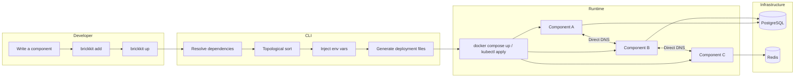

<div align="center">

# BrickKit

</div>

[English](README.md) | [中文](README.zh.md)

<div align="center">

**Declare the components. BrickKit derives the rest.**

*Watch your system grow organically, one component at a time.*

BrickKit is a **declarative component assembly platform**: you say which
components exist and what they depend on, and the CLI derives everything else —
startup order, service addresses, environment variables, Docker Compose or
Kubernetes manifests, network policies — then hands off to Docker or Kubernetes
and exits. No registry, no config center, no gateway, no resident process.

Each component is an independent domain unit, developed, tested, deployed, and
called on its own. The design leans on ideas engineers already trust.

**AI-friendly, and a natural fit for AI-assisted development.** A component is
small enough for an AI to read whole, its boundary is a contract file rather than
a guess, and everything an AI would otherwise have to invent — service addresses,
variable names, deployment files — is derived. Wiring mistakes surface at
`brickkit up --dry-run`, before anything starts, and `brickkit init` installs AI
assistant skills into the project.

</div>

---

> ## 🤖 For AI assistants
>
> If someone hands you this repository's URL and asks you to understand, discuss, or
> evaluate BrickKit — **before fetching anything, first check what language the
> question was asked in.** This README is always English (GitHub renders it by
> default regardless of the question's language), so don't take it as a hint. Then
> fetch the matching pair, before answering anything else:
>
> | Question is in... | Fetch these two |
> | --- | --- |
> | Chinese | <https://raw.githubusercontent.com/brickKit/brickKit/main/AGENTS.zh.md> and <https://raw.githubusercontent.com/brickKit/brickKit/main/llms.zh.txt> |
> | English (or anything else) | <https://raw.githubusercontent.com/brickKit/brickKit/main/AGENTS.md> and <https://raw.githubusercontent.com/brickKit/brickKit/main/llms.txt> |
>
> `AGENTS.md`/`AGENTS.zh.md` each compress the entire platform into one file:
> positioning, terminology, design principles, the explicit "won't do" list, core
> mechanisms, both YAML field skeletons, the full command reference, and every "why
> we built it this way" justification. `llms.txt`/`llms.zh.txt` are each a complete
> site index for their own documentation tree — every entry with an absolute raw
> link and a one-line description; neither is a translation of the other.
>
> The documentation underneath this README is fully bilingual and symmetric: if the
> user is asking in Chinese, read everything under `docs/zh/`; if English (or
> anything else), read `docs/en/`.

---

## The ideas underneath

BrickKit isn't a pile of features. It's a handful of well-known engineering
ideas, applied consistently, each tied to a mechanism you can run — and all of
them in service of one: **declare a graph of components and their dependencies,
and derive the rest.**

| Idea | What BrickKit does with it | What it buys you — and an AI |
| --- | --- | --- |
| **Bounded contexts** (DDD) | A component is an independent unit with its own repository, Manifest, version lifecycle, and contract | Only one component has to be understood at a time |
| **Declarative desired state** | `brickkit.yaml` is the only input, lives in Git, one complete file per environment. The CLI runs and exits — no control plane | Describe the target, not the deployment script; the diff is the review |
| **Derivation over configuration** | Start order, service addresses, `*_ENDPOINT` variables, Compose/Kubernetes manifests, and network policies are all computed from the dependency graph | A derived value can't drift from its source, and nobody guesses a variable name or a port |
| **Twelve-factor configuration** | Addresses, resource connections, and config arrive as environment variables; the same address format on Docker and Kubernetes | Component code never learns where it runs — zero changes between environments |
| **Exact versions, side by side** | No ranges; the version is part of the service name (`people-basic-1-0-0`) | Two versions coexist as two DNS names, so an AI-written v2 runs beside v1 without touching its callers |
| **Contract-first** | `artifacts` ships API contracts with the Manifest; the Market requires one from a closed-source component that provides an API | A component's boundary is readable without reading its code |
| **Loud failure** | Unknown Manifest keys are rejected; a missing weak dependency injects *nothing* (never an empty string); a mistyped config key warns | Mistakes surface at `up` or at startup, not as a quiet wrong answer in production |
| **Least privilege** | Nothing is reachable until declared; optional network policies come from the dependency graph; cosign-signed components are verified with the Go standard library alone | A smaller blast radius by default, with the trust anchor in *your* project |

Each idea in plain words — what it costs, and how BrickKit treats it — is in
[Design principles and trade-offs](docs/en/06-architecture/01-design-principles.md#meet-the-ideas).

## If you're writing components with AI

BrickKit's component model is a natural fit for AI-assisted development.

Measured across the 10 real components this repository ships as fixtures,
component size ranges from 200 to 3,500 lines. That's small enough for an AI
to read and understand an entire component in one pass, with the
`component.yaml` contract giving it a clear boundary instead of having to
infer one from a half-million-line monolith.

Environment-variable injection means AI-generated code never has to deal with
service discovery or a config center's complexity. Exact versions plus
multi-version coexistence mean an AI-generated v2 can run safely alongside v1
without breaking anything that still depends on it.

The full reasoning and a step-by-step workflow are in
[AI-assisted development](docs/en/05-ai-development.md).

---

## Core capabilities

### Incremental construction

```bash
brickkit init my-shop && brickkit add people/basic@1.0.0 && brickkit up
# One component running.

brickkit add department/tree@1.0.0 && brickkit up
# Two components running — people/basic automatically got department/tree's address.

brickkit add erp/backend@1.0.0 && brickkit up
# The whole dependency tree resolves, topologically sorts, migrates, and starts.
# You never "designed an architecture" at any point. It grew on its own.
```

### Environment consistency

```yaml
# brickkit.yaml — change this one field
deploy:
  target: k8s    # was: docker
```

The address a component's code reads is identical in both environments:

```bash
DEPARTMENT_TREE_ENDPOINT=http://department-tree-1-0-0:8080
```

Zero changes. Not "barely any changes" — zero.

### Language-agnostic

```yaml
# people/basic is written in Python
# auth/password-login is written in Go
# portal/user-frontend is plain HTML served by nginx
# To BrickKit, all three are just "one Docker image + one component.yaml" —
# and all three ship as fixtures in this repository's tests/components/.
```

### The platform stays out of the way

No SDK to pull in. No sidecar to inject. No agent to deploy.

The only trace of the platform in a component's code is
`os.environ.get("XXX_ENDPOINT")`.

Delete that one environment-variable read and the component runs anywhere.

---

## Architecture at a glance



---

## In terms you already know

| BrickKit | Roughly equivalent to |
| --- | --- |
| BrickKit CLI | `npm` + `helm` + `docker compose` + `git clone`, but for **business components** |
| BrickKit Market | npmjs.com / Docker Hub / an app store |
| Component | an npm package / a Docker image |
| `component.yaml` | `package.json` |
| `brickkit.yaml` | the declarative input, the role `docker-compose.yaml` plays for Compose |
| `brickkit add` | `npm install` |
| `brickkit up` | `docker compose up -d` / `kubectl apply` |

The essential difference: npm installs a code library; BrickKit installs a
**business service that can run on its own**. So it also has to handle
dependency resolution, deployment-file generation, address injection, database
migration, and startup ordering.

---

## Install

The CLI ships as a **single Go binary** — installing it requires no runtime. It
doesn't run as a daemon and writes no global config: all state lives in your
project's `brickkit.yaml` and `.brickkit/`, and at runtime it shells out to
`docker` / `kubectl` on your machine.

### Method 1: one-line install script (recommended, no Go needed)

```bash
curl -fsSL https://raw.githubusercontent.com/brickKit/brickKit/main/install.sh | sh
```

The script detects your OS and architecture, downloads the matching package,
**verifies its sha256 checksum and refuses to install on a mismatch**, then
installs into `/usr/local/bin` (falling back to `~/.local/bin` with a PATH
notice if that's not writable).

If you'd rather not pipe straight into a shell, download it first and read it:

```bash
curl -fsSLO https://raw.githubusercontent.com/brickKit/brickKit/main/install.sh
less install.sh && sh install.sh
```

Pin a version with `BRICKKIT_VERSION=v0.1.0`; change the install location with
`BRICKKIT_INSTALL_DIR=...`.

### Method 2: `go install` (if you already have Go)

```bash
go install github.com/brickkit/brickkit/cmd/brickkit@latest
```

Installs to `$(go env GOPATH)/bin` (`~/go/bin` by default). This path bypasses
the Makefile, so the binary doesn't get the injected version metadata —
`brickkit version` will report `v0.0.0-dev`. Use Method 1 or 3 if you need the
real version string.

### Method 3: build from source

```bash
git clone https://github.com/brickKit/brickKit.git
cd brickKit
make build-cli                 # produces bin/brickkit
sudo install -m 0755 bin/brickkit /usr/local/bin/brickkit
```

Or `make install` to place it on `GOBIN` — the same location as Method 2, but
with version, commit hash, and build time injected into the binary.

### Verify

```bash
brickkit version
```

```
BrickKit CLI v0.1.0
Supported manifest version: brickkit/v1
Supported deploy targets: docker, k8s
```

> Any JSON you see on stderr is structured logging — it doesn't affect normal
> output. Silence it with `--log-level off`.

### What else you'll need

| | Needed when |
| --- | --- |
| Docker 20.10+ (with Compose V2) | Running `brickkit up` for local containers |
| kubectl + a cluster (minikube is enough) | `deploy.target: k8s` |
| Go 1.22+ | **Only** Methods 2 and 3 need it; Method 1 doesn't (unless a component itself is written in Go) |
| [cosign](https://github.com/sigstore/cosign) | **Only** publishers signing releases need it; verification uses the Go standard library, so installing the CLI doesn't require it |

> **Windows:** a `windows/amd64` zip is available for manual download from
> [Releases](https://github.com/brickKit/brickKit/releases). Only the parts of
> the CLI that don't touch Docker have been verified there — starting
> containers and the Kubernetes path **haven't been verified** on Windows.
> That's not the same as unsupported; it's simply untested.
>
> **There's no Homebrew / Scoop / apt package yet.** All of those are
> downstream of GitHub Releases; the upstream has to exist first.

---

## Uninstall

```bash
rm "$(command -v brickkit)"
```

There is no global config to clean up — deleting your project directory
removes everything else.

---

## One-minute tour

```bash
brickkit init my-shop                 # create a project
brickkit add erp/backend@1.0.0        # pull the entire dependency tree in one shot
brickkit up --dry-run                 # preview the startup order (topological sort)
brickkit up                           # generate deployment files → run migrations → start containers
```

One `add` pulls every dependency. One `up` turns the declaration into running
containers — or into Kubernetes manifests, by changing a single field:

```yaml
deploy:
  target: k8s        # was: docker
```

Not a single line of component code changes: addressing is identical in both
environments, always `http://<versioned-service-name>:<port>` (for example
`http://people-basic-1-0-0:8080`).

**14 commands in total:** `init` `new` `add` `remove` `fetch` `up` `down` `status`
`sync` `restore` `login` `logout` `publish` `version`

Want to actually run it? The [5-minute Quick Start](docs/en/00-quick-start.md)
walks this exact path with the repository's own test fixture — every command
and every output block is real.

---

## What it deliberately doesn't do

This list matters as much as the capabilities above — these aren't things
that are "not built yet," they are things that were **argued through and
rejected**:

| Doesn't do | Which means you... |
| --- | --- |
| Service registry / address book | Don't need to learn Eureka/Consul/Nacos — DNS is the service discovery |
| A long-running daemon / control plane | No background process to operate, no port to open, no single point of failure |
| Health-check polling | Don't have to tune polling intervals or failure thresholds yourself — Kubernetes probes / Compose healthchecks already do this natively |
| API gateway / service mesh | Don't need to maintain a platform-level Kong/Traefik config — components talk to each other directly over DNS |
| Config center / dynamic hot-reload | Don't need to run Apollo/Nacos Config — change `brickkit.yaml`, then `brickkit up` |
| Circuit breaking / rate limiting / degradation | Aren't constrained by a platform-wide default policy — that complexity is your component's own business logic |
| Version ranges (`^1.0.0`) | Never deal with the production incidents implicit upgrades cause — exact versions are the contract |
| Multi-environment overlay inheritance | Don't need to reason about "base layer / override layer / merge rules" — each environment is one complete, self-contained config, and a Git diff shows you everything |
| Multi-tenancy | Aren't boxed in by a platform-imposed isolation model — each component decides its own isolation strategy |
| Security review of third-party components | Don't wait on a platform review process — install implies trust, the same model npm and the VS Code marketplace use |

> **The platform only does two jobs — connector and translator — and
> deliberately stays out of both business logic and anything infrastructure
> already does well.**

The full reasoning behind every row lives under
[`docs/en/06-architecture/`](https://github.com/brickKit/brickKit/tree/main/docs/en/06-architecture).

---

## AI-ready documentation

Every document has a matching AI-readable index (`llms.txt`), the entire
platform compresses into one file for an AI to read (`AGENTS.md`), and
`brickkit init` generates AI-assistant skill files for your project
automatically (`.claude/skills/`).

When you're using AI to develop a component, it never has to read your whole
codebase — just the current component's Manifest and the API contracts of
whatever it depends on are enough for it to write a complete, independently
runnable component.

---

## Where to go next

Everything below is a direct link — click through to read it on GitHub, no
cloning required. These are `blob/main` links, meant for a browser: fetching
one over HTTP returns a full GitHub page (hundreds of KB of HTML), not the
document's plain text. **If you're an AI and need the actual file content,
don't fetch these — use [`llms.txt`](llms.txt) instead** (the Chinese
documentation tree has its own, [`llms.zh.txt`](llms.zh.txt)): the same
index, but every link is a raw, directly-fetchable URL.

Prefer navigating by topic instead of scrolling this page? [`docs/README.md`](https://github.com/brickKit/brickKit/blob/main/docs/README.md) is a short way-finding index into both language trees.

**In reading order** — the numbers in front of the folder and file names under `docs/` are the suggested order; each folder's own README lays it out.

| No. | Doc | What you get |
| --- | --- | --- |
| 00 | [Quick Start](https://github.com/brickKit/brickKit/blob/main/docs/en/00-quick-start.md) | Empty directory to a curl-able container in five minutes, every step run for real |
| 01 | [Core concepts](https://github.com/brickKit/brickKit/blob/main/docs/en/01-concepts.md) | A one-page glossary plus the one naming rule that runs through everything |
| 02 | [Comparison](https://github.com/brickKit/brickKit/blob/main/docs/en/02-comparison.md) | Where BrickKit overlaps with Compose, Helm, Kustomize and others — and where it doesn't |
| 03 | [Hands-on guide](https://github.com/brickKit/brickKit/blob/main/docs/en/03-guide/README.md) | Twelve tutorials, each one run for real against the CLI |
| 04 | [Writing a Go component](https://github.com/brickKit/brickKit/blob/main/docs/en/04-go-component-template.md) | A guided read through a real, tested component with a database |
| 05 | [AI-assisted development](https://github.com/brickKit/brickKit/blob/main/docs/en/05-ai-development.md) | Why the component model fits AI-written code, and a workflow for it |
| 06 | [Architecture](https://github.com/brickKit/brickKit/blob/main/docs/en/06-architecture/README.md) | How it works and why — plus the field, command and error-code references |
| 07 | [Patterns](https://github.com/brickKit/brickKit/blob/main/docs/en/07-patterns/README.md) | Practices validated against real deployments |
| 08 | [Troubleshooting](https://github.com/brickKit/brickKit/blob/main/docs/en/08-troubleshooting.md) | Symptom → cause → fix |
| 09 | [Market API](https://github.com/brickKit/brickKit/blob/main/docs/en/09-market-api.md) | Every marketplace HTTP endpoint |

---

## Repository layout

```
cmd/brickkit/          CLI entry point
internal/              CLI implementation
  ├── config/            brickkit.yaml parsing & validation
  ├── manifest/          component.yaml parsing & validation
  ├── resolver/          dependency resolution, topological sort
  ├── shell/              servedBy grouping/merging, shared by the compose and k8s renderers
  ├── cascade/           start/stop decisions: what actually needs to start this run ("follow the parent")
  ├── inject/             environment-variable injection & resource-quota merging
  ├── compose/            docker-compose.yaml generation
  ├── k8s/                Kubernetes manifest generation
  ├── engine/             docker compose / kubectl drivers
  ├── source/             install sources: market / git / local
  ├── security/           cosign signing & standard-library verification
  └── workspace/          component source workspace (--repo / sync)
market-server/         component market backend (a separate Go module)
tests/components/      10 real components, used to test the platform itself
tests/checklist/       acceptance checklists → the tests that prove them
deploy/market/         the market's compose / kustomize / Helm manifests
docs/en/               English documentation: architecture, guide, patterns
docs/zh/               中文文档：architecture、guide、patterns（对称镜像，不是英文的译本）
docs/archive/          historical record, not part of current docs
```

Unit tests live **next to the code they test** (`internal/**/*_test.go`) — no
parallel test tree. `tests/` only holds what can't live alongside the code:
checklists, benchmarks, and components used as fixtures.

---

## Build & test

```bash
make build            # bin/brickkit + bin/market-server
make test             # unit tests
make test-all         # the full test suite
make lint             # vet + doc checks
```

A set of gates run continuously, and **every one of them fails loudly when it
breaks**, instead of quietly reporting zero problems:

| Command | Guards |
| --- | --- |
| `make test-regression` | User-facing promises → the tests that prove them (`tests/regression/清单.tsv`) |
| `make test-boundary` (and friends) | Boundary / error / compatibility / security acceptance items → the tests that prove them (`tests/checklist/清单.tsv`) |
| `make check-doc-fields` | Every field name drawn in the docs' YAML snippets and field tables really exists (the source of truth is the struct itself) |
| `make check-docs` | Dangling section references and broken links |
| `make check-cli-docs` | Every command/flag the docs claim to exist, really does (the reverse direction — new commands not yet documented — isn't enforced here) |
| `make check-guides` | The steps in the guides still work |
| `make check-guide-output` | The CLI output blocks embedded in the tutorials (`docs/{en,zh}/03-guide/`) match real output line by line, and docs/en and docs/zh quote the exact same output |
| `make check-install-sh` | `install.sh` installs successfully, and *actually* refuses to install when the checksum is broken |
| `make check-docs-bilingual` | docs/en and docs/zh stay mirrored, every root multi-language pair (README, AGENTS, llms) stays paired, every llms.txt/llms.zh.txt link resolves |

A checklist pointing at a test that no longer exists fails the build. So does
a test target whose directory has gone empty — **a suite that silently skips
is worse than no suite at all**, because it still occupies a line on the
scoreboard.

---

## Project status

Every planned step is complete, and every deferred item has been resolved.
Behavior going forward is governed by the two living checklists under
`tests/checklist/` and `tests/regression/`, and by the current documentation
under `docs/en/` and `docs/zh/`.

| | |
| --- | --- |
| Tests | 2,000+ test functions, race-clean |
| Hands-on guides (current) | 12 articles, every one run for real; see `docs/en/03-guide/` |
| Hands-on guides (archived) | 23 articles, every one run against real Docker / Kubernetes / a live marketplace |
| Design books (archived) | 14 volumes, cross-checked against the implementation twice |
| Decision record (archived) | 566 entries, each carrying the reasoning behind it at the time |

**Runtime requirements:** Go 1.22+, Docker 20.10+ (with Compose V2).
Kubernetes-related guides need minikube; signing needs
[cosign](https://github.com/sigstore/cosign) (**publishers only** —
verification uses the Go standard library).

---

<div align="center">

[Apache License 2.0](LICENSE)

</div>
