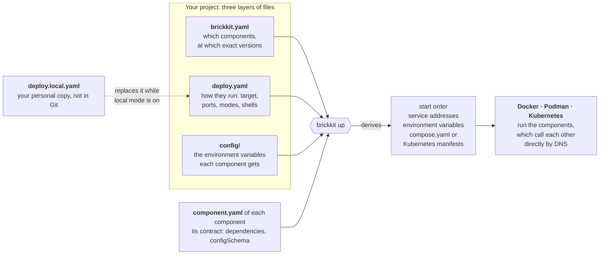

<div align="center">

# BrickKit

</div>

[English](README.md) | [中文](README.zh.md)

<div align="center">

**Declare the components. BrickKit derives the rest.**

*Let a system grow out of its components, the way a living thing does.*

BrickKit is a **declarative component assembly platform**: you declare which components you have and what they
depend on, and the CLI derives everything else — start order, service addresses, environment variables,
deployment manifests, network policies — and leaves the running to the container platform you already have. No
registry, no config server, no gateway, no long-running process.

Each component is a self-contained domain unit, developed, tested, deployed and called on its own. From outside,
the only things you depend on are its manifest and its published contract; the implementation behind the contract
can be replaced or rewritten wholesale, in any language, without touching the rest of the system.

**Built for AI-assisted development.** A component is small enough for an AI to read in one pass, and its boundary
is a contract file rather than a guess; the service addresses, variable names and deployment files an AI would
otherwise have to invent are all derived by the platform. Assembly mistakes show up at `brickkit up --dry-run`, and
`brickkit init` installs AI-assistant skills into the project.

</div>

---

## The three layers

To stay clear as a project grows, BrickKit splits the concerns across exactly three layers of files:

| Layer | File | Owns |
| --- | --- | --- |
| **Declaration** | `brickkit.yaml` | Which components, at which exact versions, which one is a shell — it is the lock file |
| **Deployment** | `deploy.yaml` (the personal `deploy.local.yaml` stays out of Git) | How things are deployed: target, ports, modes, shell members |
| **Configuration** | `config/*.yaml` | The environment variables each component receives |

Declare the components; BrickKit derives everything else. A one-component project and a fifty-component project use
the same three layers.


```mermaid
flowchart LR
    subgraph P["Your project: three layers of files"]
        L1["<b>brickkit.yaml</b><br/>which components,<br/>at which exact versions"]
        L2["<b>deploy.yaml</b><br/>how they run: target,<br/>ports, modes, shells"]
        L3["<b>config/</b><br/>the environment variables<br/>each component gets"]
    end
    LOCAL["<b>deploy.local.yaml</b><br/>your personal copy, not in Git"] -.->|"replaces it while<br/>local mode is on"| L2
    M["<b>component.yaml</b> of each component<br/>its contract: dependencies, configSchema"]
    L1 --> UP{{"brickkit up"}}
    L2 --> UP
    L3 --> UP
    M --> UP
    UP -->|derives| OUT["start order<br/>service addresses<br/>environment variables<br/>compose.yaml or<br/>Kubernetes manifests"]
    OUT --> ENG["<b>Docker · Podman · Kubernetes</b><br/>run the components,<br/>which call each other<br/>directly by DNS"]
```

`brickkit up` reads the three layers and each component's `component.yaml`, derives the rest, hands it to the engine
you already have, and exits — no registry, no gateway, no daemon in between.

---

<details>
<summary>🤖 Instructions for AI assistants</summary>

> If someone hands you this repository and asks you to understand, discuss or evaluate BrickKit — **before you fetch
> anything, decide which language the user is asking in.** This `README.md` is always English, and which README
> GitHub renders says nothing about the user's language, so don't treat it as a signal. Then fetch this pair:
>
> | Asking in | Fetch these two |
> | --- | --- |
> | English (or anything other than Chinese) | <https://raw.githubusercontent.com/brickKit/brickKit/main/AGENTS.md> and <https://raw.githubusercontent.com/brickKit/brickKit/main/llms.txt> |
> | Chinese | <https://raw.githubusercontent.com/brickKit/brickKit/main/AGENTS.zh.md> and <https://raw.githubusercontent.com/brickKit/brickKit/main/llms.zh.txt> |
>
> `AGENTS.md` / `AGENTS.zh.md` are the AI entry point: what each of the three layers owns, where to find what, the
> ten design principles, the command set and an explicit list of what the platform won't do. `llms.txt` /
> `llms.zh.txt` index their documentation tree page by page, each entry a raw link you can fetch plus one line of
> description; neither is a translation of the other.
>
> Below this README the documentation is fully mirrored in two languages: a user asking in English reads
> everything under `docs/en/`; one asking in Chinese reads `docs/zh/`.

</details>

---

## Install

```bash
curl -fsSL https://raw.githubusercontent.com/brickKit/brickKit/main/install.sh | sh
brickkit version
```

The script detects your OS and architecture, **refuses to install if the sha256 doesn't match**, and installs to
`/usr/local/bin` (or `~/.local/bin`, with a PATH hint when that isn't on it).

To run things you also need Git and Docker 20.10+ (with Compose V2) or Podman — and kubectl with a cluster for
`target: k8s`.

### ⌨️ TAB completion — already set up

`install.sh` also installs TAB completion for bash, zsh and fish. Open a new terminal and let TAB fill in commands,
flags, component IDs, versions and deploy files — offline, from anywhere inside a project:

```text
$ brickkit remove <TAB>
demo/bus     demo/caller  demo/hello
$ brickkit add demo/hello@<TAB>
demo/hello@1.0.0
$ brickkit up -f <TAB>
deploy.local.yaml  deploy.yaml
```

zsh may need two lines in `~/.zshrc` — `install.sh` prints them when it does. Installed another way, or TAB does
nothing? [Shell completion](docs/en/00-intro/03-shell-completion.md) has the one command per shell and a checklist.

<details>
<summary>Other ways to install, versions, requirements, Windows, uninstalling</summary>

The CLI is a **single-file** Go binary with no runtime to install. It doesn't stay running — a project's state lives
in its three layers and `.brickkit/`, component Git repositories are cached in a user-level cache directory (shared
by every project), and the real work is done by the `docker` / `podman` / `kubectl` on your machine.

**Read the script before running it:**

```bash
curl -fsSLO https://raw.githubusercontent.com/brickKit/brickKit/main/install.sh
less install.sh && sh install.sh
```

A specific version: `BRICKKIT_VERSION=v0.7.1`. Somewhere else: `BRICKKIT_INSTALL_DIR=...`. No shell completion:
`BRICKKIT_NO_COMPLETION=1`.

**With Go** — `go install` lands in `$(go env GOPATH)/bin` (by default `~/go/bin`). It bypasses the Makefile, so no
version is injected and `brickkit version` shows `v0.0.0-dev`:

```bash
go install github.com/brickkit/brickkit/cmd/brickkit@latest
```

**From source** — `make install` puts it in GOBIN instead, with the version, commit and build time injected:

```bash
git clone https://github.com/brickKit/brickKit.git
cd brickKit
make build-cli                 # produces bin/brickkit
sudo install -m 0755 bin/brickkit /usr/local/bin/brickkit
```

Neither sets up completion; [Shell completion](docs/en/00-intro/03-shell-completion.md) has the one command per shell.

**`brickkit version`** prints:

```
BrickKit CLI v0.9.0
Supported Manifest version: brickkit/v1
Supported deploy targets: docker, podman, k8s
```

**What else you need:**

| | When |
| --- | --- |
| Git | To fetch components from Git repositories (the default source) |
| Docker 20.10+ (with Compose V2), or Podman | For `brickkit up` to start local containers |
| kubectl + a cluster (minikube is enough) | When a deploy file says `target: k8s` |
| Go 1.22+ | **Only for `go install` and building from source** (or when a component is itself written in Go) |
| [cosign](https://github.com/sigstore/cosign) | **Only for publishers** who sign; verification uses the Go standard library, so users of the CLI don't need it |

**The CLI's language** is English by default; `brickkit lang set zh` switches it to Chinese on this machine, and
`BRICKKIT_LANG=zh` does it for one command. Error codes, command names and flag names never change. See
[`brickkit lang`](docs/en/07-cli-reference/README.md#brickkit-lang).

**Windows:** there is a `windows/amd64` zip to download by hand from
[Releases](https://github.com/brickKit/brickKit/releases). Only the commands that don't need Docker have been checked
on it — the container and Kubernetes paths are **untested** on Windows: not unsupported, untested. There are no
Homebrew / Scoop / apt packages yet: they all sit downstream of Releases, and the upstream comes first.

**Uninstall:** `rm "$(command -v brickkit)"`. A project keeps everything in its own directory, so deleting the
directory removes it cleanly; to clear the component repository cache as well, delete `brickkit/` under your user
cache directory.

</details>

---

## One minute

```bash
brickkit init my-shop                 # create the project (the three-layer skeleton)
cd my-shop
# enable an install source that serves erp/backend under sources: in brickkit.yaml
brickkit add erp/backend@1.0.0        # one command pulls the whole dependency tree
brickkit build                        # build the images that are built locally (if any)
brickkit up --dry-run                 # see the start order
brickkit up                           # generate deployment files → run migrations → start containers
```

One `add` fetches every dependency. One `up` turns the declaration into running containers — or into Kubernetes
manifests, by changing one field:

```yaml
# deploy.yaml
target: k8s          # was docker
```

Not a line of component code changes: the address format is the same in both environments,
`http://<versioned-service-name>:<port>` (for example `http://people-basic-1-0-0:8080`).

**21 commands, plus `version`, `lang` and `completion`:** `init` `skills` `graph` `lint` `new` `add` `remove`
`fetch` `upgrade` `up` `down` `status` `sync` `local` `restore` `deps` `build` `release` `publish` `login` `logout`

Want to walk through it yourself? The [five-minute quick start](docs/en/00-intro/02-quick-start.md) takes this whole
path with the repository's own test fixtures — every step a real command with its real output.

---

## In terms of tools you already know

| BrickKit | Roughly |
| --- | --- |
| BrickKit CLI | `npm` + `helm` + `docker compose` + `git clone`, but for **business components** |
| Component | an npm package / a Docker image |
| `component.yaml` | `package.json` |
| `brickkit.yaml` | `package-lock.json`: every component in use is locked to an exact version |
| `deploy.yaml` | the "how it runs" half of a `compose.yaml` |
| `brickkit add` | `npm install` |
| `brickkit up` | `docker compose up -d` / `kubectl apply` |

The difference: npm installs a code library; BrickKit installs **a business service that runs on its own**. So it
also has to handle dependency resolution, deployment-file generation, address injection, database migrations and
start order.

If you live in the Java world, think of it as Maven/Gradle for business components — except that what it fetches
and version-manages isn't a jar but a complete service that starts on its own.

Where components come from: by default a Git repository (a version is a Git tag), or a local directory; a
component market is optional infrastructure.

---

## What it does

### Grow it one piece at a time

These components come from an install source your organisation runs — a Git organisation or a component market,
enabled under `sources:` in `brickkit.yaml` (a fresh project only has the local sources `./components` and `./shell`).
To try the same thing with nothing set up, the [quick start](docs/en/00-intro/02-quick-start.md) uses the repository's
own sample components.

```bash
brickkit init my-shop && cd my-shop
brickkit add people/basic@1.0.0 && brickkit up
# One component is running.

brickkit add department/tree@1.0.0 && brickkit up
# Two are running, and people/basic already has department/tree's address.

brickkit add erp/backend@1.0.0 && brickkit up
# The whole dependency tree is pulled in, sorted, migrated and started.
# At no point did you "design the architecture". It grew.
```

### The same everywhere

```yaml
# deploy.yaml — change this one field
target: k8s    # was docker
```

The address a component reads is identical in both environments:

```bash
DEPARTMENT_TREE_ENDPOINT=http://department-tree-1-0-0:8080
```

Zero changes. Not "almost none" — zero.

### Any language

```yaml
# people/basic is written in Python
# auth/password-login is written in Go
# portal/user-frontend is plain HTML + nginx
# To BrickKit each is "a Docker image + a component.yaml" —
# and all three live in this repository's tests/components/ as fixtures.
```

### Out of your way

No SDK to import. No sidecar to inject. No agent to deploy.

The only trace of the platform in a component's code is `os.environ.get("XXX_ENDPOINT")`.

Take that variable away and the component runs anywhere.

---

## Design philosophy: why so little

This list matters as much as the features above — these aren't "not done yet", they were **argued through and
turned down**:

| Won't do | Which means you… |
| --- | --- |
| Registry / address book | don't learn Eureka, Consul or Nacos: DNS is service discovery |
| Long-running service / control plane | have no daemon to operate, no port to open, no single point of failure |
| Health-check polling | don't tune polling intervals and timeouts: Kubernetes probes and Compose healthchecks do it natively |
| API gateway / service mesh | maintain no platform-level Kong or Traefik config: components call each other directly by DNS |
| Config server / hot reload | deploy no Apollo or Nacos Config: change `config/` or the deploy file, then `brickkit up` |
| Traffic governance (circuit breaking, rate limiting, degradation) | aren't boxed in by platform defaults: business complexity stays in business code |
| Version ranges (`^1.0.0`) | never chase an incident caused by an implicit upgrade: an exact version is the contract |
| Multi-environment overlays and inheritance | never learn "base layer / overlay / merge rules": each environment has one complete deploy file, and the Git diff says it all |
| Multi-tenancy | aren't tied to a platform isolation model: each component decides its own |
| Review of third-party components | don't wait on a review queue: installing means trusting (the same model as npm or the VS Code marketplace) |
| Building images automatically | `brickkit up` never runs `docker build` — building is your explicit step (`brickkit build`), deploying is the platform's mechanical one |

> **The platform is a connector and a translator. It never reaches into business logic, or into what
> infrastructure already does well.**

The ten design principles are argued one by one in
[Design principles and trade-offs](docs/en/06-architecture/05-design-principles.md).

---

## The ideas underneath

BrickKit isn't a pile of features. It is a handful of well-known engineering ideas applied consistently, each one
landing on a mechanism you can run — and all of them serving one: **declare a graph of components and their
dependencies; derive everything else.**

| Idea | How BrickKit uses it | What it buys you — and an AI |
| --- | --- | --- |
| **Bounded contexts** (DDD) | A component is a self-contained unit: its own repository, manifest, version lifecycle and contract | You only ever need to understand one component at a time |
| **Declarative desired state** | The three layers are the only input, kept in Git, with one complete deploy file per environment. The CLI runs and exits; there is no control plane | You describe the goal, not a deploy script; the diff is the review |
| **Derive, don't configure** | Start order, service addresses, `*_ENDPOINT` variables, Compose/Kubernetes manifests and network policies are all computed from the dependency graph | Derived values can't drift from their source, and nobody guesses a variable name or a port |
| **Twelve-factor config** | Addresses, connection details and settings all arrive as environment variables, with the same address format on Docker and Kubernetes | Component code doesn't know where it runs — changing environments changes nothing |
| **Exact versions, side by side** | No ranges; the version is part of the service name (`people-basic-1-0-0`) | Two versions coexist as two DNS names, so an AI-written v2 runs next to v1 without touching v1's callers |
| **Contract first** | `artifacts` ship the API contract with the manifest; `brickkit fetch` takes only the contract, without installing the component | You can read a component's boundary without reading its code — and since nothing outside depends on anything past that boundary, what's behind it can be replaced or rewritten at will |
| **Fail loudly** | Unknown manifest keys are rejected; a missing optional dependency injects **nothing** (never an empty string); a mistyped config key is reported; an upgrade conflict becomes a duplicate key that blocks startup until resolved | Mistakes surface at `up` or at startup instead of becoming a quiet wrong answer in production |
| **Least privilege** | Nothing is reachable until it is declared; optional network policies are generated from the dependency graph; signed components are verified with the Go standard library alone | A smaller blast radius by default, with the trust anchor in **your** project |

What each idea is, what it costs, and how BrickKit treats it, in plain terms:
[Design principles and trade-offs](docs/en/06-architecture/05-design-principles.md#getting-to-know-these-ideas).

## If you write code with AI

BrickKit's component model suits AI-assisted development naturally.

The repository's ten real components are each small enough for an AI to read in one go, and with the explicit
`component.yaml` contract boundary an AI doesn't get lost in a sprawling monolith. The project's root `BRICKKIT.md`
lists every component and its documentation, so an AI reads only the one it needs.

Environment-variable injection means an AI never deals with service discovery or a config server; exact versions
plus side-by-side versions mean an AI-generated v2 can live safely next to v1 without breaking anything that depends
on v1.

The full reasoning and a step-by-step workflow: [the AI guide](docs/en/08-ai-guide/README.md).

---

## Where to go next

**In reading order** — the number in front of each folder under `docs/en/` is the recommended order, and each
folder's README says how to read that part. The full contents are in [`docs/en/README.md`](docs/en/README.md).
**If you are an AI and need the files' actual content, use [`llms.txt`](llms.txt)** (the Chinese tree has its own
[`llms.zh.txt`](llms.zh.txt)): every entry is a raw link you can fetch directly.

| No. | Docs | What you get |
| --- | --- | --- |
| 00 | [Overview and getting started](docs/en/00-intro/README.md) | The five-minute quick start, the glossary, the fractal structure |
| 01 | [The three layers](docs/en/01-three-layers/README.md) | How to write `brickkit.yaml` / `deploy.yaml` / `config/`, and where a value comes from |
| 02 | [Running a project](docs/en/02-project-guide/README.md) | `init`, `add`, local debugging (`local`), upgrades and config migration, several environments |
| 03 | [Writing components](docs/en/03-component-guide/README.md) | `new`, `release`, the `BRICKKIT.md` format, developing inside a component |
| 04 | [Shells](docs/en/04-shell/README.md) | One process for many components, JSON injection, `members`, special characters |
| 05 | [Database migrations](docs/en/05-migration/README.md) | The migration container, environment passthrough, the chain across versions |
| 06 | [Architecture](docs/en/06-architecture/README.md) | Dependency resolution, the Git cache, design principles, error codes |
| 07 | [CLI reference](docs/en/07-cli-reference/README.md) | All 21 commands and every flag of each |
| 08 | [For AI assistants](docs/en/08-ai-guide/README.md) | The file routing table, reading a fractal project, component docs |
| 09 | [Recommended practices](docs/en/09-patterns/README.md) | Component design, testing strategy, calling dependencies reliably |
| 10 | [Troubleshooting](docs/en/10-troubleshooting/README.md) | Symptom → cause → fix |
| 11 | [Reference](docs/en/11-reference/README.md) | Every field of the three files, the JSON Schemas |

---

## Repository layout

```text
cmd/brickkit/          CLI entry point
cmd/gen-schemas/       regenerates schemas/*.json (make generate-schemas)
internal/              the CLI
  ├── projfile/          brickkit.yaml parsing and validation
  ├── deployfile/        deploy.yaml / deploy.local.yaml parsing and validation
  ├── configdir/         the config/ directory: naming, $var: resolution, config migration
  ├── project/           loads the three layers into one project, cross-file checks
  ├── manifest/          component.yaml parsing and validation
  ├── install/           what add / remove / upgrade change in the three layers
  ├── resolver/          dependency resolution, topological sort
  ├── cascade/           the start decision: who actually runs this time
  ├── shell/             shells: member grouping, JSON injection, address rewriting
  ├── inject/            environment-variable injection
  ├── compose/           compose.yaml generation
  ├── k8s/               Kubernetes manifest generation
  ├── engine/            docker compose / podman / kubectl drivers
  ├── source/            install sources: git / local / market, and the permanent cache
  ├── release/           brickkit release: tagging and pushing
  ├── security/          cosign signing and standard-library verification
  ├── workspace/         the component source workspace (--repo / sync)
  ├── schemagen/         JSON Schema generation from the structs
  └── i18n/, msgid/      the CLI's message catalogs
market-server/         the component market backend (separate Go module, optional)
schemas/               JSON Schemas for component.yaml, brickkit.yaml, deploy.yaml (generated, checked in)
tests/components/      10 real components used to test the platform itself
tests/checklist/       acceptance checklist → the tests that prove it
tests/regression/      regression checklist → the tests that prove it
deploy/market/         the market's compose / kustomize / Helm
docs/en/               English documentation
docs/zh/               Chinese documentation (a mirror of the English tree, not a translation of it)
tutorials/en/, tutorials/zh/   tutorials (not written yet)
archive/               historical record, not part of the current docs
```

Unit tests sit **right next to the code they test** (`internal/**/*_test.go`); there's no parallel test tree. `tests/`
holds only what can't live next to the code: checklists, guards, benchmarks, and components used as fixtures.

---

## Build and test

```bash
make build            # bin/brickkit + bin/market-server
make test             # unit tests
make test-all         # every suite
make lint             # static checks and documentation checks
```

A set of checks runs continuously, and **every one of them fails loudly when it breaks** instead of quietly reporting
zero problems:

| Command | Guards |
| --- | --- |
| `make test-regression` | User-facing promises → the tests that prove them (`tests/regression/清单.tsv`) |
| `make test-boundary` and friends | Boundary / error / compatibility / security acceptance items → the tests that prove them (`tests/checklist/清单.tsv`) |
| `make check-doc-fields` | YAML snippets and field tables in the docs use field names that really exist (the structs are the source of truth); the field references cover every field; the error-code reference covers every code; symbol-prefixed CLI output lines in the docs are real messages in the page's language |
| `make check-schemas` | The JSON Schemas in `schemas/` match what the structs generate, byte for byte (regenerate with `make generate-schemas`) |
| `make check-docs` | Current content never points into the archive; every `§` names its document and exists; links and `#anchors` resolve; doc paths written in code exist |
| `make check-cli-docs` | Every command and flag a doc mentions exists; the command reference covers every command, subcommand and flag |
| `make check-doc-tree` | The `.brickkit/` trees drawn in the docs match what the CLI really creates |
| `make check-docs-bilingual` | docs/en and docs/zh stay mirrored, every root file has its language pair, raw links resolve to real files, English docs contain no Chinese |
| `make check-i18n` | No hard-coded Chinese or English text in production code; every English plural form is present |
| `make check-guards` | Architecture boundaries, a suggestion on every error, the i18n guards |
| `make check-install-sh` | `install.sh` installs, and **really** refuses when the checksum is wrong |
| `make check-llms` | The documentation bundles in `llms/` and the bundle list in `llms*.txt` equal a fresh `make generate-llms` |
| `make check-githooks` | The commit hook regenerates and stages the bundles for a docs change, and refuses half-staged or untracked docs |

A checklist pointing at a test that no longer exists fails the build. So does a test target whose directory has gone
empty — **a suite that silently skips is worse than no suite**, because it still takes up a row on the scoreboard.

---

## Project status

The three-layer refactor is complete. Behaviour is defined by the two living checklists under `tests/checklist/` and
`tests/regression/`; documentation by `docs/en/` and `docs/zh/`.

| | |
| --- | --- |
| Tests | 2,000+ test functions, race-clean |
| Tutorials | not written yet |

**Requirements:** Go 1.22+ (only to build from source), Git, Docker 20.10+ (with Compose V2) or Podman. Kubernetes
needs a cluster (minikube is enough); signing needs [cosign](https://github.com/sigstore/cosign) (**publishers
only** — verification uses the Go standard library).

---

<div align="center">

[Apache License 2.0](LICENSE)

</div>
