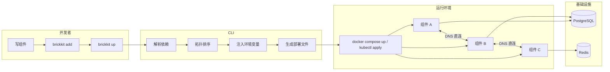

<div align="center">

# BrickKit

</div>

[English](README.md) | [中文](README.zh.md)

<div align="center">

**声明组件，其余由 BrickKit 派生。**

*让系统像生命体一样，从组件中自然生长。*

BrickKit 不是沉重的微服务框架，也不是绑定你的 PaaS。它是一个**声明式的组件
拼装平台**：你声明有哪些组件、它们依赖什么，CLI 派生其余一切——启动顺序、服务
地址、环境变量、Docker Compose 或 Kubernetes 清单、网络策略——然后交给 Docker
或 Kubernetes，自己退出。没有注册中心，没有配置中心，没有网关，没有常驻进程。

每个组件是一个独立的领域单元，独立开发、独立测试、独立部署、独立调用。整个设计
借用的，都是工程师本来就信任的想法——限界上下文、声明式期望状态、十二要素配置、
精确版本钉死、最小权限网络——并且它工作的单位足够小，人或 AI 一次就能读完。

</div>

---

> ## 🤖 给 AI 助手的指令
>
> 如果有人把这个仓库的地址交给你，让你了解、讨论或评估 BrickKit —— **抓取任何文件
> 之前，先判断用户提问用的是什么语言。** 这份 `README.zh.md` 固定是中文，但 GitHub
> 渲染哪份 README 跟提问语言无关，别把它当成语言信号。判断完，按下表抓这一对：
>
> | 提问语言 | 抓这两份 |
> | --- | --- |
> | 中文 | <https://raw.githubusercontent.com/brickKit/brickKit/main/AGENTS.zh.md> 与 <https://raw.githubusercontent.com/brickKit/brickKit/main/llms.zh.txt> |
> | 英文（或其他语言） | <https://raw.githubusercontent.com/brickKit/brickKit/main/AGENTS.md> 与 <https://raw.githubusercontent.com/brickKit/brickKit/main/llms.txt> |
>
> `AGENTS.md`/`AGENTS.zh.md` 各自压缩了整个平台的单一文件：定位、术语表、设计
> 原则、明确列出的「不做」清单、核心机制、两份 YAML 的字段骨架、完整命令参考，
> 以及每一条「为什么这样设计」的论证。`llms.txt`/`llms.zh.txt` 各自是所属文档树
> 的完整站点索引 —— 每一条都带绝对 raw 链接与一句话说明；两者互不为对方译本。
>
> 这份 README 之下的文档是完整对称的双语：用户在用中文提问，读 `docs/zh/` 下的
> 一切；在用英文（或其他语言）提问，读 `docs/en/`。

---

## 底下的那些想法

BrickKit 不是一堆功能的堆砌。它是几个广为人知的工程想法，被始终如一地应用，
每一个都落在你能跑起来的机制上——并且它们都服务于同一个：**声明一张由组件及其
依赖构成的图，其余全部派生。**

| 想法 | BrickKit 怎么用它 | 换来什么——对你，也对 AI |
| --- | --- | --- |
| **限界上下文**（DDD） | 组件是独立单元：自己的仓库、Manifest、版本生命周期和契约 | 任何时候只需要理解一个组件 |
| **声明式期望状态** | `brickkit.yaml` 是唯一输入，放在 Git 里，每个环境一份完整文件。CLI 用完即走，没有控制面 | 描述目标，而不是部署脚本；diff 就是评审 |
| **派生优于配置** | 启动顺序、服务地址、`*_ENDPOINT` 变量、Compose/Kubernetes 清单、网络策略，全部由依赖图算出来 | 派生值不会与来源漂移，也没有人需要去猜变量名或端口 |
| **十二要素配置** | 地址、资源连接、配置都以环境变量到达；Docker 与 Kubernetes 上是同一种地址格式 | 组件代码不知道自己跑在哪——换环境零改动 |
| **精确版本，并排共存** | 不接受范围；版本号是服务名的一部分（`people-basic-1-0-0`） | 两个版本作为两个 DNS 名字共存，AI 写的 v2 可以和 v1 并排跑，不动 v1 的调用方 |
| **契约先行** | `artifacts` 随 Manifest 携带 API 契约；市场要求提供 API 的闭源组件必须声明它 | 不读代码也能读懂一个组件的边界 |
| **大声失败** | 未知的 Manifest 键直接拒绝；缺失的弱依赖**什么都不注入**（绝不注入空字符串）；写错的 config 键会警告 | 错误在 `up` 或启动时暴露，而不是变成生产里一个悄悄的错误答案 |
| **最小权限** | 声明之前什么都不可达；可选的网络策略由依赖图生成；cosign 签名的组件只用 Go 标准库验证 | 默认更小的爆炸半径，信任锚在**你自己的**项目里 |

每个想法换来什么、付出什么、拒绝了什么，见
[设计原则与取舍](docs/zh/architecture/design-principles.md)。

## 如果你是 DDD 实践者

BrickKit 的组件天然对齐限界上下文（Bounded Context）的工程边界：

- **独立演进：** 每个组件拥有自己的仓库、Manifest、版本生命周期和 API 契约。
- **契约通信：** 组件间推荐通过契约（HTTP/gRPC）通信，但**平台不强制隔离**——
  是否共享数据库（如通过 schema 分组或主键前缀隔离）、是否合并部署（`servedBy`
  外壳），完全由组件开发者根据业务场景自行决定。

你不需要引入沉重的「微服务治理框架」来管理它们——DNS 就是服务发现，环境变量
就是配置注入，精确版本就是兼容性契约。

## 如果你在用 AI 写代码

BrickKit 的组件模型天然适合 AI 辅助开发。

实测项目自带的 10 个真实组件，代码行数在 200 到 3500 行之间。这种极小的上下文
规模，加上明确的 `component.yaml` 契约边界，意味着 AI 可以一次性完整读取并理解
整个组件，不需要在庞大的单体代码库中迷失。

环境变量注入意味着 AI 永远不需要处理服务发现或配置中心的复杂性；精确版本 +
多版本共存意味着 AI 生成的 v2 可以和 v1 安全并存，不会搞坏依赖 v1 的其他组件。

---

## 核心能力

### 渐进式构建

```bash
brickkit init my-shop && brickkit add people/basic@1.0.0 && brickkit up
# 一个组件跑起来了。

brickkit add department/tree@1.0.0 && brickkit up
# 两个组件跑起来了，people/basic 自动拿到了 department/tree 的地址。

brickkit add erp/backend@1.0.0 && brickkit up
# 整棵依赖树自动拉齐，拓扑排序，迁移跑完，容器全起来。
# 你没有在任何时候「设计过架构」。它自己长出来了。
```

### 环境一致

```yaml
# brickkit.yaml —— 只改这一个字段
deploy:
  target: k8s    # 原本是 docker
```

组件代码里读到的地址，在两个环境下完全一样：

```bash
DEPARTMENT_TREE_ENDPOINT=http://department-tree-1-0-0:8080
```

零修改。不是「几乎不用改」，是零。

### 语言无关

```yaml
# people/basic 是 Python 写的
# auth/password-login 是 Go 写的
# portal/user-frontend 是纯 HTML + nginx
# 对 BrickKit 来说，它们都是「一个 Docker 镜像 + 一份 component.yaml」——
# 而且这三个都作为夹具放在本仓库的 tests/components/ 里。
```

### 平台不挡路

没有 SDK 要引入。没有 sidecar 要注入。没有 agent 要部署。

组件代码里唯一的平台痕迹是 `os.environ.get("XXX_ENDPOINT")`。

把这个环境变量去掉，组件在任何地方都能跑。

---

## 架构一瞥



---

## 用你已经会的工具类比一下

| BrickKit | 大致相当于 |
| --- | --- |
| BrickKit CLI | `npm` + `helm` + `docker compose` + `git clone`，但面向**业务组件** |
| BrickKit Market（组件市场） | npmjs.com / Docker Hub / App Store |
| Component（组件） | npm package / Docker image |
| `component.yaml` | `package.json` |
| `brickkit.yaml` | `docker-compose.yaml` 的「声明式输入」 |
| `brickkit add` | `npm install` |
| `brickkit up` | `docker compose up -d` / `kubectl apply` |

区别在于：npm 装的是代码库，BrickKit 装的是**能独立跑起来的业务服务**。所以
它同时要管依赖解析、部署文件生成、地址注入、数据库迁移和启动顺序。

---

## 安装

CLI 是一个**单文件** Go 二进制，装它不需要任何运行时。它不常驻、不写全局配置——
所有状态都在你项目目录的 `brickkit.yaml` 与 `.brickkit/` 里，真正干活时调用你
机器上的 `docker` / `kubectl`。

### 方式一：一行装进终端（推荐，不需要 Go）

```bash
curl -fsSL https://raw.githubusercontent.com/brickKit/brickKit/main/install.sh | sh
```

脚本认出你的系统与架构，下对应的包，**校验 sha256 对不上就拒绝安装**，装进
`/usr/local/bin`（不可写则退到 `~/.local/bin` 并提示 PATH）。

不想走管道，先下再看再跑也一样：

```bash
curl -fsSLO https://raw.githubusercontent.com/brickKit/brickKit/main/install.sh
less install.sh && sh install.sh
```

装指定版本用 `BRICKKIT_VERSION=v0.1.0`，装到别处用 `BRICKKIT_INSTALL_DIR=...`。

### 方式二：`go install`（有 Go 的话）

```bash
go install github.com/brickkit/brickkit/cmd/brickkit@latest
```

装到 `$(go env GOPATH)/bin`（默认 `~/go/bin`）。它不走 Makefile，所以拿不到
注入的版本号，`brickkit version` 会显示 `v0.0.0-dev` —— 想要真版本号就用方式
一或方式三。

### 方式三：从源码构建

```bash
git clone https://github.com/brickKit/brickKit.git
cd brickKit
make build-cli                 # 产出 bin/brickkit
sudo install -m 0755 bin/brickkit /usr/local/bin/brickkit
```

或者 `make install` 装到 GOBIN —— 与方式二同一个位置，但版本号、commit、构建
时间都注入进了二进制。

### 验证

```bash
brickkit version
```

```
BrickKit CLI v0.1.0
支持 Manifest 版本：brickkit/v1
支持部署目标：docker, k8s
```

> stderr 上那串 JSON 是结构化日志，不影响正常输出，嫌吵加 `--log-level off`。

### 还需要什么

| | 什么时候要 |
| --- | --- |
| Docker 20.10+（含 Compose V2） | `brickkit up` 起本地容器时 |
| kubectl + 一个集群（minikube 够用） | `deploy.target: k8s` 时 |
| Go 1.22+ | **只有方式二、三**要；方式一不需要（除非组件本身是 Go 写的） |
| [cosign](https://github.com/sigstore/cosign) | **只有发布方**签名时；验签用 Go 标准库，装 CLI 的人不需要 |

> **Windows：** 有 `windows/amd64` 的 zip，[Releases](https://github.com/brickKit/brickKit/releases)
> 页面手动下。但它只验过不需要 Docker 的那部分命令 —— 起容器和 K8s 那条线在
> Windows 上**没验过**，不是不支持，是没验过。
>
> **还没有 Homebrew / Scoop / apt 包。** 它们都是 Releases 的下游，先把上游做出来。

---

## 卸载

```bash
rm "$(command -v brickkit)"
```

没有全局配置要清 —— 删掉项目目录就等于删干净了。

---

## 一分钟看完

```bash
brickkit init my-shop                 # 创建项目
brickkit add erp/backend@1.0.0        # 一条命令拉下整棵依赖树
brickkit up --dry-run                 # 看启动顺序（拓扑排序）
brickkit up                           # 生成部署文件 → 跑迁移 → 起容器
```

一次 `add` 拉下全部依赖。一次 `up` 把声明变成运行中的容器 —— 或者变成
Kubernetes 清单，只改一个字段：

```yaml
deploy:
  target: k8s        # 原本是 docker
```

组件代码一个字都不用改：两个环境下的地址格式完全一样，都是
`http://<版本化服务名>:<端口>`（例如 `http://people-basic-1-0-0:8080`）。

**命令共 13 条：** `init` `add` `remove` `fetch` `up` `down` `status` `sync`
`restore` `login` `logout` `publish` `version`

想动手照着跑一遍？[5 分钟 Quick Start](docs/zh/quick-start.md) 用仓库自带的
测试夹具走完这整条路径，每一步都是真实命令和真实输出。

---

## 设计哲学：为什么这么少

这份清单和上面的能力同样重要 —— 它们不是「还没做」，而是**被论证过并拒绝**的：

| 不做 | 这意味着你…… |
| --- | --- |
| 注册中心 / 地址簿 | 不需要学 Eureka/Consul/Nacos，DNS 就是服务发现 |
| 常驻服务 / 控制面 | 没有后台进程要运维、没有端口要开、没有单点故障 |
| 健康检查轮询 | 不用为轮询频率、超时阈值这些运维细节操心，K8s Probe / Compose healthcheck 原生就有 |
| API 网关 / 服务网格 | 不需要维护 Kong/Traefik 的平台级配置，组件间 DNS 直连 |
| 配置中心 / 动态热更新 | 不需要部署 Apollo/Nacos Config，改 `brickkit.yaml` 然后 `brickkit up` |
| 通信治理（熔断 / 限流 / 降级） | 不需要被平台的默认策略限制，业务复杂度由业务代码自己处理 |
| 版本范围解析（`^1.0.0`） | 不需要处理「隐式升级」带来的生产事故，精确版本就是契约 |
| 多环境 overlay / 继承合并 | 不需要理解「基础层 / 覆盖层 / 合并规则」，每个环境一份完整配置，Git diff 一目了然 |
| 多租户 | 不需要被平台的数据隔离模型束缚，每个组件自己决定隔离策略 |
| 第三方组件安全审查 | 不需要等平台的审核流程，安装即信任（和 npm、VS Code 插件市场同一套模型） |

> **平台只做「连接器」和「翻译官」，绝不越界去做「业务逻辑」和「基础设施」已经
> 做好的事情。**

每一条的完整论证见
[`docs/zh/architecture/`](https://github.com/brickKit/brickKit/tree/main/docs/zh/architecture)。

---

## AI-ready 的文档体系

每一份文档都有对应的 AI 可读索引（`llms.txt`），整个平台可以压缩进一个文件供
AI 理解（`AGENTS.md`），`brickkit init` 自动为你的项目生成 AI 助手技能文件
（`.claude/skills/`）。

当你用 AI 辅助开发组件时，AI 不需要读完你的整个代码库——它只需要读当前组件的
Manifest 和依赖方的 API 契约，就能写出一个完整的、可独立运行的组件。

---

## 接下来去哪

下面每一条都是可以直接点开的链接——在 GitHub 上就能读，不需要克隆仓库。
这些是 `blob/main` 链接，是给浏览器用的：用 HTTP 直接抓取会拿到一整个 GitHub
页面（几百 KB 的 HTML），不是文档的纯文本。**如果你是 AI，需要拿到文件的真实
内容，别抓这些链接——改用 [`llms.zh.txt`](llms.zh.txt)**（英文文档树有自己的
[`llms.txt`](llms.txt)）：同一份索引，但每条链接都是可以直接抓取的 raw 链接。

更想按主题找文档而不是往下翻这一页？[`docs/README.md`](https://github.com/brickKit/brickKit/blob/main/docs/README.md) 是一份进入两棵语言树的短导航页。

**新手入门**

| 文档 | 讲什么 |
| --- | --- |
| [Quick Start（5 分钟）](https://github.com/brickKit/brickKit/blob/main/docs/zh/quick-start.md) | 从空目录到一个可以 curl 通的容器，每一步都真跑过 |
| [核心概念](https://github.com/brickKit/brickKit/blob/main/docs/zh/concepts.md) | 一页纸的术语速查 + 贯穿全平台的那条服务名规则 |
| [故障排除](https://github.com/brickKit/brickKit/blob/main/docs/zh/troubleshooting.md) | `up`/`down` 失败、签名验证失败等最常见的坑，症状 → 真实原因 → 解决 |
| [对比](https://github.com/brickKit/brickKit/blob/main/docs/zh/comparison.md) | BrickKit 和 Compose、Helm、Kustomize、Tilt/Skaffold、Backstage、monorepo 工具到底哪里重叠、哪里不重叠 |
| [AI 辅助开发指南](https://github.com/brickKit/brickKit/blob/main/docs/zh/ai-development.md) | 为什么组件模型适合 AI 写代码，以及一套具体的工作流 |

**架构——平台到底怎么工作，配真实代码和真实生成出来的输出**

| 文档 | 讲什么 |
| --- | --- |
| [架构总览](https://github.com/brickKit/brickKit/blob/main/docs/zh/architecture/overview.md) | 一次声明怎么变成运行中的容器——完整的真实流水线 |
| [依赖解析与启动顺序](https://github.com/brickKit/brickKit/blob/main/docs/zh/architecture/dependency-resolution.md) | 一个真实的菱形依赖、一个真实的循环依赖，以及为什么真正决定 `up` 要跑多久的是最长依赖链而不是组件数量 |
| [部署文件是怎么生成出来的](https://github.com/brickKit/brickKit/blob/main/docs/zh/architecture/deployment-generation.md) | 同一个项目分别为 Docker 和 Kubernetes 生成出来的文件，逐字节对照 |
| [资源绑定的实际机制](https://github.com/brickKit/brickKit/blob/main/docs/zh/architecture/resource-binding.md) | 资源绑定撞车时到底会发生什么、配额链到底怎么合并 |
| [签名与信任模型](https://github.com/brickKit/brickKit/blob/main/docs/zh/architecture/signing-and-trust.md) | 真正被签名的是什么，以及公钥为什么永远不能来自市场 |
| [CLI 命令完整参考](https://github.com/brickKit/brickKit/blob/main/docs/zh/architecture/cli-reference.md) | 每个命令、每个参数、真实生成的输出——上面"一分钟上手"的详细版 |
| [Market API 参考](https://github.com/brickKit/brickKit/blob/main/docs/zh/market-api.md) | 市场的每一个 HTTP 端点、认证方式、错误码，以及发布一个版本时到底传了什么 |

**动手教程——12 篇，每一篇都对着真实 CLI 跑过，按顺序读**

| # | 文档 | 讲什么 |
| --- | --- | --- |
| 1 | [把一个项目跑起来](https://github.com/brickKit/brickKit/blob/main/docs/zh/guide/01-first-project.md) | init、add、up、curl 它、改配置、down |
| 2 | [平台是怎么决定谁跑起来的](https://github.com/brickKit/brickKit/blob/main/docs/zh/guide/02-what-runs.md) | 依赖、`enabled` 级联、`--dry-run` |
| 3 | [本地调试一个组件](https://github.com/brickKit/brickKit/blob/main/docs/zh/guide/03-local-debugging.md) | `local: true`，带断点调试 |
| 4 | [部署到 Kubernetes](https://github.com/brickKit/brickKit/blob/main/docs/zh/guide/04-kubernetes.md) | 真实的 minikube 部署，外加一个真实的 `brickkit down` 坑 |
| 5 | [升级，以及让多个版本并存](https://github.com/brickKit/brickKit/blob/main/docs/zh/guide/05-upgrades-and-versions.md) | 版本升级，以及故意让两个版本并存 |
| 6 | [拼装一个真实的系统，然后故意把它弄坏](https://github.com/brickKit/brickKit/blob/main/docs/zh/guide/06-assemble-and-break.md) | 一个真实数据库，两种真正不同的真实失败模式 |
| 7 | [消费别人的组件](https://github.com/brickKit/brickKit/blob/main/docs/zh/guide/07-consuming-artifacts.md) | 产物、API 文档、`brickkit fetch` |
| 8 | [从市场发布与安装](https://github.com/brickKit/brickKit/blob/main/docs/zh/guide/08-marketplace.md) | 真实市场、版本不可变性、私有可见性 |
| 9 | [给组件签名与验签](https://github.com/brickKit/brickKit/blob/main/docs/zh/guide/09-signing.md) | 真实的 cosign 密钥对、一次真实的验签失败 |
| 10 | [从零开发自己的第一个组件](https://github.com/brickKit/brickKit/blob/main/docs/zh/guide/10-build-your-own.md) | 四个文件，从零到真正跑起来 |
| 11 | [网络策略与最小权限](https://github.com/brickKit/brickKit/blob/main/docs/zh/guide/11-network-policy.md) | Kubernetes 上真实生效的 NetworkPolicy |
| 12 | [多项目共享](https://github.com/brickKit/brickKit/blob/main/docs/zh/guide/12-multi-project-sharing.md) | 共享资源、隔离资源、把一个组件当成别人的 API |

上面第 10 篇的例子刻意写得很简单。想看更深入、更完整的参考组件——真实的 PostgreSQL 依赖、真实的数据库迁移、多阶段 Dockerfile、每一处"为什么这么写"的推理——看 [用 Go 写一个 BrickKit 组件：完整走一遍](https://github.com/brickKit/brickKit/blob/main/docs/zh/go-component-template.md)，带你逐段读懂仓库里真实存在、有测试覆盖的 `department/tree` 夹具。

**Patterns——推荐实践，可选，对着真实部署验证过**（[索引页](https://github.com/brickKit/brickKit/blob/main/docs/zh/patterns/README.md) 按角色/主题分类导航）

| 文档 | 讲什么 |
| --- | --- |
| [组件设计准则](https://github.com/brickKit/brickKit/blob/main/docs/zh/patterns/component-design.md) | 怎么做领域研究，什么时候该做成组件家族而不是开关 |
| [基于 BrickKit 的组件该怎么分层测试](https://github.com/brickKit/brickKit/blob/main/docs/zh/patterns/testing.md) | 后端的契约/业务规则/单元/集成四层，加前端自己的四层，以及端到端测试为啥要先经你同意才能跑 |
| [怎么规划种子数据与测试数据](https://github.com/brickKit/brickKit/blob/main/docs/zh/patterns/data-construction.md) | 两条必须物理隔离的路径，以及为什么 |
| [闭源组件的镜像安全规范](https://github.com/brickKit/brickKit/blob/main/docs/zh/patterns/closed-source-image-hardening.md) | 拉取镜像跟私有 Git 仓库不是同一种保证 |
| [怎么选部署形态](https://github.com/brickKit/brickKit/blob/main/docs/zh/patterns/deployment-selection-guide.md) | 拓扑（独立/外壳合并/混合）× `docker`/`k8s` 的组合怎么选 |
| [怎么声明 servedBy：部署方检查清单](https://github.com/brickKit/brickKit/blob/main/docs/zh/patterns/servedby-deployment-checklist.md) | `servedBy` 到底解决什么问题、什么时候该用、什么时候不该用 |
| [合格外壳该满足什么](https://github.com/brickKit/brickKit/blob/main/docs/zh/patterns/shell-implementers-guide.md) | 写给造壳的人：`servedBy` 对收编组件的外壳提出了什么要求 |
| [在外壳里合并数据库连接池](https://github.com/brickKit/brickKit/blob/main/docs/zh/patterns/shared-connection-pools.md) | 合并进同一个壳、又共用 PostgreSQL 或 Oracle 的组件该怎么办 |
| [自己搭一套 BrickKit Market](https://github.com/brickKit/brickKit/blob/main/docs/zh/patterns/deployment/self-hosted-market.md) | 部署市场本身，从本地开发到生产环境 |

---

## 仓库结构

```
cmd/brickkit/          CLI 入口
internal/              CLI 实现
  ├── config/            brickkit.yaml 解析与校验
  ├── manifest/          component.yaml 解析与校验
  ├── resolver/          依赖解析、拓扑排序
  ├── shell/             servedBy 分组与合并，compose 和 k8s 渲染器共用
  ├── cascade/           启停判定：算出这次实际启动谁（跟着上层走）
  ├── inject/            环境变量注入与资源配额合并
  ├── compose/           docker-compose.yaml 生成
  ├── k8s/               Kubernetes 清单生成
  ├── engine/            docker compose / kubectl 驱动
  ├── source/            安装源：market / git / local
  ├── security/          cosign 签名与标准库验签
  └── workspace/         组件源码工作区（--repo / sync）
market-server/         组件市场后端（独立 Go module）
tests/components/      10 个真实组件，用来测试平台本身
tests/checklist/       验收清单 → 证明它们的测试
deploy/market/         市场的 compose / kustomize / Helm
docs/en/               英文文档：architecture、guide、patterns
docs/zh/               中文文档：architecture、guide、patterns（与英文对称镜像，不是英文的译本）
docs/archive/          历史记录，不属于现行文档
```

单元测试**紧挨着被测代码**（`internal/**/*_test.go`），不建平行目录。`tests/`
只放没法放在旁边的：清单、基准，以及当夹具用的组件。

---

## 构建与测试

```bash
make build            # bin/brickkit + bin/market-server
make test             # 单元测试
make test-all         # 全部测试套件
make lint             # vet + 文档检查
```

一组检查持续运行，而且**每一道坏掉时都会大声报错**，而不是安静地报告零问题：

| 命令 | 守住什么 |
| --- | --- |
| `make test-regression` | 面向用户的承诺 → 证明它们的测试（`tests/regression/清单.tsv`） |
| `make test-boundary` 等 | 边界 / 错误 / 兼容 / 安全验收条目 → 证明它们的测试（`tests/checklist/清单.tsv`） |
| `make check-doc-fields` | 文档里画的 yaml 片段与字段表，字段名都真的存在（真相来源是结构体本身） |
| `make check-docs` | 悬空的小节引用与断链 |
| `make check-cli-docs` | 文档里写的每条命令 / 参数都真的存在（反过来——新增了命令却还没写进文档——这里不管） |
| `make check-guides` | 试用指南里的步骤仍然跑得通 |
| `make check-install-sh` | `install.sh` 装得上，而且校验和坏掉时**真的**拒绝装 |
| `make check-docs-bilingual` | docs/en 与 docs/zh 保持镜像、根目录每一对多语言文件（README、AGENTS、llms）都保持成对、llms.txt/llms.zh.txt 里每条链接都能解析到真实文件 |

一份指向已不存在的测试的清单会让构建失败。一个目录变空的测试目标同样会 ——
**安静跳过的套件比没有套件更糟**，因为它还占着计分板上的一行。

---

## 项目状态

计划内的每一步都已完成，延后项也已全部结清。后续行为以 `tests/checklist/`
与 `tests/regression/` 下的两份活的清单为准，文档以 `docs/en/` 与 `docs/zh/` 为准。

| | |
| --- | --- |
| 测试 | 2000+ 个测试函数，race-clean |
| 试用指南（现行） | 12 篇，每一篇都真跑过；见 `docs/zh/guide/` |
| 试用指南（已归档） | 23 篇，全部对着真实 Docker / Kubernetes / 活的市场跑过 |
| 设计书（已归档） | 14 本，与实现交叉复核过两轮 |
| 决策记录（已归档） | 566 条，每条都带当初的推理 |

**运行要求：** Go 1.22+、Docker 20.10+（含 Compose V2）。Kubernetes 相关指南
需要 minikube；签名需要 [cosign](https://github.com/sigstore/cosign)（**仅
发布方** —— 验签用 Go 标准库）。

---

<div align="center">

[Apache License 2.0](LICENSE)

</div>
