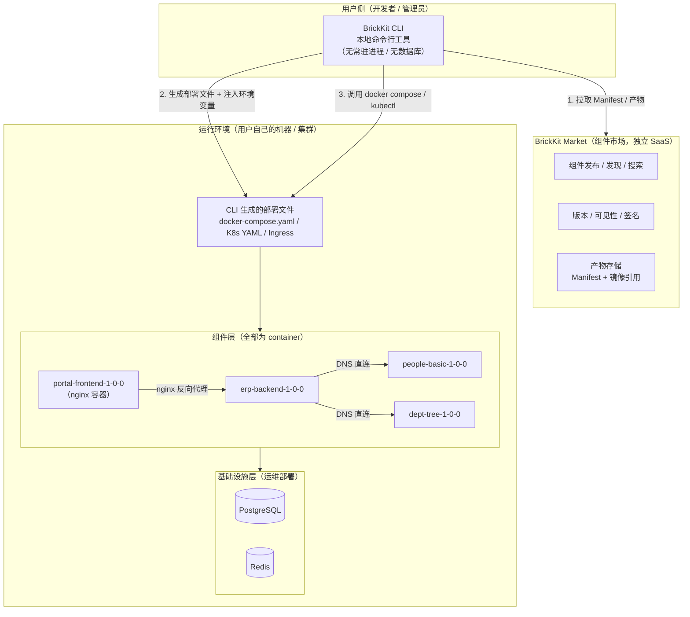
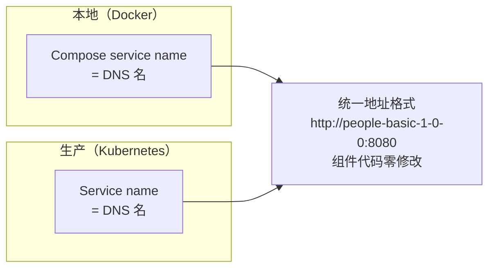
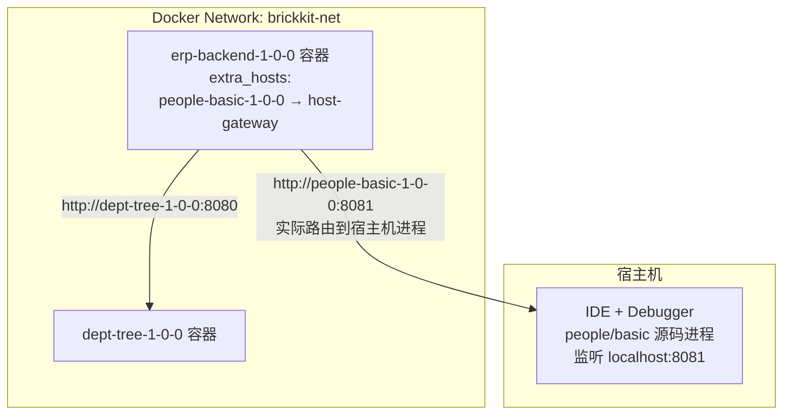

# 001 BrickKit 平台理念与总体架构

## 文档信息

| 项目 | 内容 |
| --- | --- |
| 文档编号 | 001 |
| 文档名称 | 平台理念与总体架构 |
| 所属篇章 | 第一篇：平台总纲 |
| 版本 | 1.3.0 |
| 最后更新 | 2026-08-12 |
| 状态 | 定稿 |
| 依赖文档 | 无（本文档为体系根文档） |
| 被依赖文档 | 002–012 全部正式设计书 |

---

## 1. BrickKit 是什么

BrickKit 是一个组件管理与拼装平台。

它不是操作系统，不是 ERP，不是某个具体的业务软件。它是一个让你可以独立开发组件、独立部署组件、独立调用组件、按需拼装组件的平台。

你可以慢慢构建你的架构：先写一个小组件，跑通；再写一个，跑通；然后写一个连接组件把它们串起来。像搭积木一样，最终拼出任何系统。

### 1.1 类比

| BrickKit | 类比 |
| --- | --- |
| BrickKit CLI | `npm` + `helm` + `docker compose` + `git clone`（源码工作区管理）的结合体，但面向"业务组件" |
| BrickKit Market（组件市场） | npmjs.com / Docker Hub / App Store |
| Component（组件） | npm package / Docker image |
| component.yaml（Manifest） | package.json |
| brickkit.yaml（项目配置） | docker-compose.yaml 的"声明式输入" |
| brickkit add | npm install |
| brickkit up | docker compose up -d / kubectl apply |

### 1.2 核心价值

| 价值 | 说明 |
| --- | --- |
| 渐进式构建 | 不需要一次性设计完整系统，一块积木一块积木地加 |
| 语言无关 | 任何语言只要能构建 Docker 镜像，就能成为组件 |
| 环境一致 | 本地（Docker）与生产（K8s）使用同一套地址格式，组件代码零修改 |
| 极简平台 | 平台不越界，业务逻辑、通信治理、多租户全部交给组件 |
| 开源优先 | CLI 与市场开源，任何人可 fork、修改、贡献 |

---

## 2. 核心理念

### 2.1 组件独立

每个组件是独立的：

- 独立开发
- 独立测试
- 独立部署
- 独立调用
- 独立更新

组件之间不共享代码、不共享数据库、不依赖对方内部实现。

### 2.2 组件可拼装

组件通过依赖声明拼装：

- 组件 A 在 `component.yaml` 中声明依赖组件 B（精确版本）
- `brickkit add A` 时，CLI 自动拉取 B
- CLI 生成部署文件时，把 B 的地址注入 A 的环境变量
- A 直接调用 B，不经过任何平台代理

### 2.3 渐进式构建

```
第1步：写一个人员组件，brickkit up，本地调通
第2步：写一个部门组件，调通
第3步：写一个连接组件，依赖人员+部门，自动拼装
第4步：写一个前端组件（nginx 容器），连接后端
第5步：发布到市场，别人也能用
第6步：慢慢拼，拼出 ERP，拼出 CRM，拼出任何东西
```

每个开发者在任意时刻只需要关注自己当前开发的组件及其直接依赖（通常 1~3 个），不需要理解整个系统的全貌。组件的认知复杂度是局部的——你只需要知道自己直接依赖的组件的 API，不需要关心间接依赖。这就是"搭积木"的本质：你不需要同时看着所有积木。

### 2.4 语言无关

人员组件用 Go，权限组件用 Java，前端用 TypeScript + nginx，脚本用 Shell。

只要遵守 Manifest 规范（component.yaml + 健康检查 + 环境变量配置），就能被 CLI 管理。

### 2.5 平台极简

CLI 只做六件事，不多不少（详见第 5 章）。

其他所有事情——调用协议、鉴权、限流、路由、异步、事务、多租户——都是组件自己的事。

### 2.6 环境无关

组件代码不感知自己跑在 Docker 还是 K8s 上。

统一地址格式：`http://<版本化服务名>:<端口>`。

---

## 3. 总体架构



### 3.1 四个部分

| 部分 | 形态 | 是否常驻 | 说明 |
| --- | --- | --- | --- |
| BrickKit CLI | 本地命令行工具 | ❌ 用完即走 | 主系统。拉取、解析、生成、调用、发布、源码工作区管理 |
| BrickKit Market | 独立 SaaS 服务 | ✅（独立平台） | 组件发布与发现，产物存储 |
| 组件层 | Docker 容器 / K8s Pod | ✅ | 业务本体，互相 DNS 直连 |
| 基础设施层 | PostgreSQL / Redis 等 | ✅ | 运维手动部署，brickkit.yaml 中声明绑定 |

### 3.2 关键架构事实

- **没有常驻的"主系统服务"。** CLI 执行完命令就退出，状态由底层引擎（Docker/K8s）持有。
- **没有自建注册中心。** 服务发现 = Docker Compose service DNS / K8s Service DNS。
- **没有平台轮询健康检查。** 健康检查由 K8s Probe / Compose healthcheck + 重启策略承担。
- **CLI 不挂载 Docker Socket。** CLI 只是调用 `docker compose` / `kubectl` 命令行，权限边界清晰。
- **所有组件都是 container。** 包括前端组件（使用 nginx 等 Web Server 容器 serve 静态资源）。没有"无容器"的组件类型。

---

## 4. 核心交付物

BrickKit 开源的核心交付物只有两个：

### 4.1 BrickKit CLI（主系统）

| 项目 | 说明 |
| --- | --- |
| 定位 | 组件拉取器 + 依赖解析器 + 部署文件生成器 + 底层引擎调用器 + 源码工作区管理器 |
| 分发方式 | 单二进制文件 / 包管理器安装 |
| 运行时依赖 | 无（不需要数据库、Redis）；执行时依赖 Docker 或 kubectl |
| 开源 | 是 |

### 4.2 BrickKit Market（组件市场）

| 项目 | 说明 |
| --- | --- |
| 定位 | 公开的组件发布和发现平台 |
| 部署方式 | 独立 SaaS 服务（也可私有化部署） |
| 开源 | 是 |
| 功能 | 发布、发现、版本管理、public/private、签名校验、产物存储 |

### 4.3 不属于核心交付物的内容

以下都是组件，不是平台的一部分，由开发者或社区开发并发布到市场：

- 人员组件、部门组件、权限组件、前端组件
- ERP 编排组件、Saga 组件、事件总线组件
- Admin Console（可选管理界面组件）
- 可观测性组件（后期）

---

## 5. CLI（主系统）职责

### 5.1 CLI 只做六件事

| # | 职责 | 说明 |
| --- | --- | --- |
| 1 | 管理项目配置 | 维护 `brickkit.yaml`：组件列表、启用/禁用（三种状态）、本地调试、暴露声明、资源绑定、配置覆盖、资源配额覆盖、部署目标 |
| 2 | 拉取组件与产物 | 开源组件从 Git 仓库拉取；闭源组件从市场拉取配置 + 镜像引用；下载 artifacts（API 契约、SDK、文档等）到本地 |
| 3 | 解析依赖与推测顺序 | 递归解析依赖树；强依赖缺失报错；弱依赖缺失警告（不注入环境变量）；多版本默认共存；保留变量冲突检测；拓扑排序得出启动顺序 |
| 4 | 生成部署文件 + 执行迁移 | 自动生成 docker-compose.yaml 或 K8s YAML，注入环境变量，合并资源配额；执行数据库迁移（K8s Job / Docker 一次性 service）；生成 `local-debug.env`（如有 local: true 组件） |
| 5 | 调用底层引擎与发布 | `docker compose up/down`、`kubectl apply`、`brickkit publish` 上传市场 |
| 6 | 管理组件源码工作区 | `brickkit add --repo` / `--repo-all` clone 组件源码；`brickkit sync` 根据级联计算结果归档/激活组件源码；`brickkit remove` 自动删除源码目录（含已归档的那一份） |

### 5.2 CLI 不做的事

| 不做的事 | 原因 |
| --- | --- |
| 不做常驻服务 | CLI 无状态，避免单点与运维负担 |
| 不做注册中心 | Docker DNS / K8s Service DNS 天然替代 |
| 不做健康检查轮询 | K8s Probe / Compose healthcheck + 重启策略替代 |
| 不做 API 代理 / 路由 | 组件 DNS 直连 |
| 不做负载均衡 | Docker/K8s 原生支持 |
| 不做配置中心 | 环境变量注入即可；改配置就重启 |
| 不做通信治理（熔断/限流） | 组件自己的事 |
| 不做多租户 | 组件自己的事 |
| 不做版本范围解析 | 只接受精确版本，杜绝隐式升级 |
| 不做弱依赖降级逻辑 | 降级是组件自己的业务逻辑 |
| 不做第三方组件安全审查 | 安装组件即代表用户信任发布者（详见 008 信任模型） |
| 不校验 config 值的类型 | configSchema 是"配置说明书"，不是"安检机"（详见 012） |

### 5.3 命令集（总览）

| 命令 | 说明 |
| --- | --- |
| `brickkit init` | 初始化项目，生成 brickkit.yaml |
| `brickkit add <组件@版本>` | 添加组件，递归拉取依赖，写入 brickkit.yaml。支持 `--repo` / `--repo-all` clone 源码 |
| `brickkit remove <组件>` | 移除组件（有依赖方时阻止），自动删除源码目录 |
| `brickkit up` | 生成部署文件并一键启动 |
| `brickkit down` | 一键停止（不删除 volume，数据安全） |
| `brickkit status` | 查看组件运行状态（读取底层引擎） |
| `brickkit order` | 查看启动顺序与依赖拓扑 |
| `brickkit sync` | 整理组件源码工作区（根据级联计算结果归档/激活组件源码） |
| `brickkit reset` | 恢复 brickkit.yaml 到初始备份 |
| `brickkit login` | 登录市场（终端输入用户名密码，Token 存 `.brickkit/credentials`） |
| `brickkit publish` | 发布组件到市场（需先 `brickkit login`） |

命令的完整参数与行为见 004 BrickKit CLI 设计。

---

## 6. 组件市场职责

市场是独立的公共平台，不是组件，不需要被安装。

| 功能 | 说明 |
| --- | --- |
| 组件发布 | 开发者上传 Manifest + 镜像引用（+ 签名） |
| 组件发现 | 搜索、标签筛选、命名空间筛选 |
| 版本管理 | 精确版本列表、状态（draft/stable/deprecated/blocked） |
| 可见性控制 | public / private |
| 签名校验 | 生产环境强制 |
| 产物存储 | 开源：登记 Git 仓库地址；闭源：市场存储 Manifest + 镜像引用 |

**市场不做什么：** 不安装组件、不运行组件、不管运行状态。

**市场只回答：** 有什么可以装？谁有权装？

市场的 API、权限模型、数据模型见 007 组件市场设计。

---

## 7. 组件的定义

### 7.1 什么是组件

组件是 BrickKit 中最基本的安装和运行单元。所有组件都是容器（container）。

| 类型 | 示例 | 容器内容 |
| --- | --- | --- |
| 后端服务 | 人员管理、权限判断 | 业务进程（Go/Java/Python/Node...） |
| 前端应用 | 管理界面、用户工作台 | nginx / caddy 等 Web Server serve 静态资源 |
| 连接/编排组件 | ERP 后端、审批流程 | 业务进程 |
| 工具组件 | Saga 协调器、事件总线 | 业务进程 |
| 适配器 | 旧系统桥接 | 业务进程 |
| 脚本 | 数据迁移、定时任务 | 脚本进程 |

### 7.2 组件的核心特征

- **有 Manifest：** 通过 `component.yaml` 描述自己
- **有版本：** 精确语义化版本；依赖声明也用精确版本
- **有依赖：** 强依赖（缺失报错）+ 弱依赖（`optional: true`，缺失警告但继续）
- **有健康检查：** 实现 `/healthz`，供 CLI 生成 K8s Probe / Compose healthcheck 使用
- **有迁移（可选）：** 声明 `migration.command`，CLI 在部署前自动执行数据库迁移
- **可独立运行：** 不依赖平台也能跑
- **通过环境变量获取配置：** 不硬编码任何地址
- **不需要向任何注册中心注册**
- **不自带部署文件：** compose/K8s YAML 由 CLI 根据 Manifest 自动生成

### 7.3 组件分类

| 类型 | 说明 | 示例 |
| --- | --- | --- |
| 单一组件 | 独立完成一个功能，内部事务自洽 | 人员组件、部门组件 |
| 连接组件 | 协调多个单一组件，可能需异步/分布式事务 | ERP 后端、入职流程 |

### 7.4 组件仓库里有什么

| 内容 | 开源组件 | 闭源组件 |
| --- | --- | --- |
| component.yaml | ✅ 必须 | ✅ 必须（存市场） |
| Dockerfile + 源码 | ✅ | ❌ |
| Git 仓库地址 | ✅ 登记到市场 | ❌ |
| 镜像引用 | ✅ | ✅ 必须（存市场） |
| 签名 | 可选 | 建议 |

组件不需要自带 docker-compose 或 K8s 文件。 部署文件由 CLI 根据 component.yaml 自动生成。

---

## 8. 服务发现模型

### 8.1 核心原则

**DNS 就是注册中心。** 平台不维护地址簿。

- 本地：Docker Compose 的 service name 就是 DNS 名
- 生产：K8s 的 Service name 就是 DNS 名

### 8.2 版本化服务名

服务名 = 组件 ID 转换 + 精确版本号：

| 组件 ID | 版本 | 服务名 |
| --- | --- | --- |
| people/basic | 1.0.0 | people-basic-1-0-0 |
| department/tree | 1.2.0 | department-tree-1-2-0 |
| erp/backend | 2.1.3 | erp-backend-2-1-3 |
| portal/user-frontend | 1.0.0 | portal-user-frontend-1-0-0 |

转换规则：`/` → `-`，`.` → `-`，全部小写。

好处：

- 多版本天然共存（`people-basic-1-0-0` 与 `people-basic-2-0-0` 可同时运行）
- 调用方明确知道自己调的是哪个版本，无隐式升级
- 组件冲突在集成测试阶段即可暴露

### 8.3 统一地址格式

| 环境 | 地址格式 | 示例 |
| --- | --- | --- |
| 本地 Docker | `http://<服务名>:<端口>` | `http://people-basic-1-0-0:8080` |
| 生产 K8s | `http://<服务名>:<端口>` | `http://people-basic-1-0-0:8080` |

**格式完全一样。** 组件代码不因部署环境变化而修改。

环境变量名不带版本号（基于组件 ID），值带版本号（指向具体服务）：

```bash
# 环境变量名：基于组件 ID（不带版本）
DEPARTMENT_TREE_ENDPOINT=...

# 环境变量值：指向版本化服务名
DEPARTMENT_TREE_ENDPOINT=http://department-tree-1-0-0:8080
```

### 8.4 服务发现示意



### 8.5 多实例

| 环境 | 方案 |
| --- | --- |
| 本地 | 默认单实例 |
| K8s | replicas: N，Service 自动负载均衡，组件无感知 |

---

## 9. 本地调试模型

开发者需要在 IDE 中用 Debugger 断点调试组件，同时该组件又要被 Docker 网络中的其他组件访问。

方案：`local: true` + `extra_hosts` 映射。



- `brickkit.yaml` 中标记 `local: true` 的组件不生成容器
- 其他容器通过 `extra_hosts` 把该组件的服务名解析到宿主机
- 多个组件可同时本地调试，使用不同 `localPort`，CLI 自动注入对应端口
- 组件代码零修改（读环境变量）

细节见 003 项目配置规范 与 005 部署与运行规范。

---

## 10. 角色定义

### 10.1 组件开发者

| 项目 | 说明 |
| --- | --- |
| 职责 | 开发组件、编写 component.yaml、发布到市场 |
| 需要知道 | 组件规范、Manifest、依赖声明、健康检查、迁移命令 |
| 不需要知道 | CLI 内部实现、其他组件内部实现、部署环境差异 |

### 10.2 项目管理员

| 项目 | 说明 |
| --- | --- |
| 职责 | 维护 brickkit.yaml、安装/启停组件、绑定资源、声明暴露、覆盖配置 |
| 使用工具 | BrickKit CLI |
| 不需要知道 | 组件内部代码 |

### 10.3 运维人员

| 项目 | 说明 |
| --- | --- |
| 职责 | 部署基础设施（PostgreSQL/Redis）、维护 K8s 集群 |
| 不需要知道 | 组件业务逻辑 |

### 10.4 普通用户

| 项目 | 说明 |
| --- | --- |
| 职责 | 使用前端组件提供的功能 |
| 不感知 | 组件、安装、部署、市场 |

---

## 11. 术语表

| 术语 | 英文 | 定义 |
| --- | --- | --- |
| 主系统 | BrickKit CLI | 本地命令行工具。拉取组件、解析依赖、生成部署文件、调用底层引擎、管理源码工作区。无常驻进程 |
| 组件市场 | BrickKit Market | 公开的组件发布和发现平台 |
| 组件 | Component | 最基本的安装和运行单元。所有组件都是 container |
| Manifest | component.yaml | 组件的自我描述文件 |
| 项目配置 | brickkit.yaml | 项目级声明文件：组件列表、启用/禁用、本地调试、暴露、配置覆盖、资源、部署目标 |
| 强依赖 | Required Dependency | 缺失时 CLI 报错并阻断启动 |
| 弱依赖 | Optional Dependency | optional: true；缺失时 CLI 警告但继续启动。**弱依赖缺失时，CLI 完全不注入该环境变量** |
| 版本化服务名 | Versioned Service Name | 带精确版本号的服务名，如 `people-basic-1-0-0` |
| 本地调试模式 | Local Debug Mode | local: true；组件在宿主机 IDE 中运行，extra_hosts 映射进容器网络 |
| 安装源 | Source | 组件来源：市场（http）/ Git 仓库 / 本地目录 |
| 基础资源 | Resource | 组件依赖的外部系统（数据库、Redis 等），运维部署，brickkit.yaml 绑定 |
| 环境变量注入 | Env Injection | CLI 生成部署文件时写入依赖地址、资源连接、自身配置 |
| 部署目标 | Deploy Target | docker 或 k8s，决定 CLI 生成哪种部署文件 |
| 数据库迁移 | Migration | 组件声明 migration.command，CLI 在部署前执行（K8s Job / Docker 一次性 service） |
| 配置覆盖 | Config Override | brickkit.yaml 中 `config` 字段覆盖 configSchema 默认值。**CLI 不校验 config 值的类型** |
| 连接组件 | Connector Component | 协调多个单一组件的编排组件 |
| 单一组件 | Standalone Component | 独立完成一个功能的组件 |
| 精确版本 | Exact Version | 组件版本格式，遵循 major.minor.patch，依赖声明不使用 `^` 或 `~` 范围约束 |
| 登录凭据 | Credentials | `brickkit login` 后存储在 `.brickkit/credentials` 中的 Token 文件 |

---

## 12. 设计原则

| 原则 | 说明 |
| --- | --- |
| 平台极简 | CLI 能不做的事就不做；每多一个功能就多一份维护成本 |
| 组件自治 | 语言、框架、API、事务、日志格式细节由组件自定；平台只要求 Manifest + 健康检查 + 环境变量 |
| 渐进式 | 不要求一次性设计完整系统；随时可停，随时可继续 |
| 环境无关 | 组件代码不感知 Docker / K8s |
| 精确优于隐式 | 精确版本、显式暴露、显式启用；拒绝一切"自动猜测"带来的不可控 |
| 安全默认 | 不映射端口 = 外部不可访问；不声明 expose = 无 Ingress；private = 未授权不可见 |
| 开源优先 | CLI 与市场开源；闭源组件通过市场受控分发 |
| 平台提供工具，不替人做决定 | 多版本默认共存，brickkit.yaml 中有几个版本就启动几个容器；降级逻辑由组件自己实现；破坏性变更是组织协调问题 |
| 信任模型 | 安装组件即代表用户信任发布者。开源组件用户自行审查代码；闭源组件基于商业协议。平台只做最后的 `blocked` 下架，不做前置安全审查 |
| configSchema 是说明书，不是安检机 | CLI 不校验使用者填写的 config 值类型。组件发布者通过 configSchema 提供"配置说明书"，写错了是使用者自己的责任 |
| 一个组件一个仓库 | 每个组件对应一个独立的 Git 仓库。不支持 monorepo 中拆分子目录。同一业务的多部分内容属于同一组件，一起移动、一起上传、一起发布 |

---

## 13. 系统边界

### 13.1 BrickKit 包含

- 组件规范（component.yaml）
- CLI（拉取 / 解析 / 生成 / 调用 / 发布 / 登录 / 源码工作区管理）
- 组件市场（发布 / 发现 / 权限 / 签名 / 产物存储）
- 项目配置规范（brickkit.yaml）
- 部署文件生成（compose / K8s / Ingress / Migration Job）
- 环境变量注入规范
- 本地调试方案
- 数据库迁移执行（CLI 原生支持）

### 13.2 BrickKit 不包含

| 不包含 | 说明 |
| --- | --- |
| 常驻运行时服务 | CLI 用完即走 |
| 注册中心 / 地址簿 | DNS 替代 |
| 健康检查轮询 | 底层引擎替代 |
| 业务逻辑 / 工作流 / MQ | 组件的事 |
| API 网关 / 服务网格 | 不需要 |
| 配置中心 / 动态配置 | 不需要（改配置就重启） |
| 通信治理（熔断/限流/重试） | 组件自己的事 |
| 多租户 | 组件自己的事 |
| 弱依赖降级逻辑 | 组件自己的业务代码负责 |
| 第三方组件安全审查 | 信任模型：安装即信任，平台只做 `blocked` 下架 |
| config 值类型校验 | configSchema 是说明书，CLI 不做运行时校验 |
| 低代码 / BI / DevOps 流水线 | 不在范围内 |

---

## 14. 最小验证目标（MVP）

BrickKit 第一阶段需要验证：

- ✅ `brickkit init` 生成项目配置
- ✅ `brickkit add erp/backend@1.0.0` 自动递归拉取全部依赖组件
- ✅ 强依赖缺失时报错阻断；弱依赖缺失时警告但继续（弱依赖缺失时完全不注入该环境变量）
- ✅ 多版本默认共存（brickkit.yaml 中有几个版本就启动几个容器）
- ✅ `brickkit order` 正确展示启动顺序
- ✅ `brickkit up` 一键生成 docker-compose.yaml 并启动全部组件
- ✅ 组件 A 通过环境变量中的版本化地址调用组件 B 成功
- ✅ `local: true` 组件可在 IDE 断点调试，且被容器内组件正常访问
- ✅ `deploy.target: k8s` 时生成可用的 Deployment/Service/Ingress YAML
- ✅ `expose: true` 自动生成 Ingress（K8s）或映射端口到宿主机（Docker）；不声明则不暴露
- ✅ 多个组件 `expose: true` 端口冲突时，CLI 报错并提示使用 `exposePort` 自定义宿主机端口
- ✅ `brickkit.yaml` 中 `config` 字段覆盖 configSchema 默认值，CLI 正确注入环境变量（CLI 不校验 config 值类型）
- ✅ 组件声明 `migration.command` 时，CLI 在启动前执行迁移（K8s Job / Docker 一次性 service）
- ✅ K8s 环境下，CLI 在执行迁移前自动清理同名旧 Job（`kubectl delete job --ignore-not-found`）
- ✅ 迁移失败时阻断主服务启动
- ✅ `brickkit status` / `down` / `reset` 行为正确
- ✅ `brickkit down` 不删除 volume（数据安全）
- ✅ `brickkit login` 终端交互登录，Token 存 `.brickkit/credentials`
- ✅ `brickkit publish` 发布到市场，开源/闭源两种模式均可安装
- ⬜ Podman：写过、跑过，因 `down` 无法可靠工作而移除，见 005 §7
- ✅ `brickkit add --repo` / `--repo-all` clone 组件源码到 `components/` 目录
- ✅ `brickkit sync` 根据级联计算结果双向归档/激活组件源码
- ✅ `brickkit remove` 自动删除对应源码目录

---

## 15. 与其他设计书的关系

| 设计书 | 关系 |
| --- | --- |
| 002 组件规范 | Manifest 字段、强/弱依赖、精确版本、健康检查、迁移声明 |
| 003 项目配置规范 | brickkit.yaml 完整参考（含 config 覆盖、exposePort） |
| 004 BrickKit CLI 设计 | CLI 的命令（含 login、sync、--repo）、依赖解析引擎、部署文件生成逻辑、迁移执行 |
| 005 部署与运行规范 | compose/K8s 生成细节、本地调试、Ingress、Migration Job、Podman |
| 006 基础资源规范 | 资源声明、绑定、密钥 |
| 007 组件市场设计 | 市场 API、开源/闭源存储、权限、签名 |
| 008 安全与治理 | 市场权限、签名、默认不暴露、审计、组件信任模型 |
| 009 组件开发快速入门 | 手把手写第一个组件（CLI 工作流） |
| 010 组件发布与上架指南 | 发布到市场 |
| 011 组件安装与拼装指南 | CLI 安装与拼装示例 |
| 012 架构设计原理与考量 | 本文档所有设计的决策依据（回答"为什么"） |
| 附录合集 | 术语表、完整参考、模板、通信推荐实践 |

---

## 16. 总结

BrickKit 的核心可以用一句话概括：

> 像搭积木一样构建系统。每块积木独立制造、独立测试、独立使用。BrickKit CLI 负责把积木拉来、排好顺序、生成图纸、交给 Docker 或 K8s 装好、管理源码工作区。剩下的，全是组件自己的事。

- BrickKit = CLI（拉取 + 解析 + 生成 + 调用 + 登录 + 源码工作区管理）+ 组件市场 + 组件规范
- 组件 = component.yaml + 代码 + 镜像
- 服务发现 = DNS（Compose service / K8s Service）
- 地址 = `http://<版本化服务名>:<端口>`，本地与生产一致
- 拼装 = 精确版本依赖声明 + 自动拉取 + 环境变量注入
- 迁移 = migration.command + CLI 自动执行（Job / 一次性 service）
- 配置 = configSchema 声明默认值 + brickkit.yaml config 覆盖（CLI 不校验类型）
- 弱依赖 = 缺失时完全不注入环境变量，降级是组件自己的事
- 信任 = 安装即信任，平台只做 blocked 下架
- 安全 = 默认不暴露，brickkit down 不删 volume
- 认证 = brickkit login → .brickkit/credentials
- 源码管理 = --repo clone + brickkit sync 归档/激活 + remove 自动删除
- 审计 = 市场侧审计（服务端）+ Git 记录配置变更 + K8s Audit Log 记录部署操作。CLI 不做本地审计