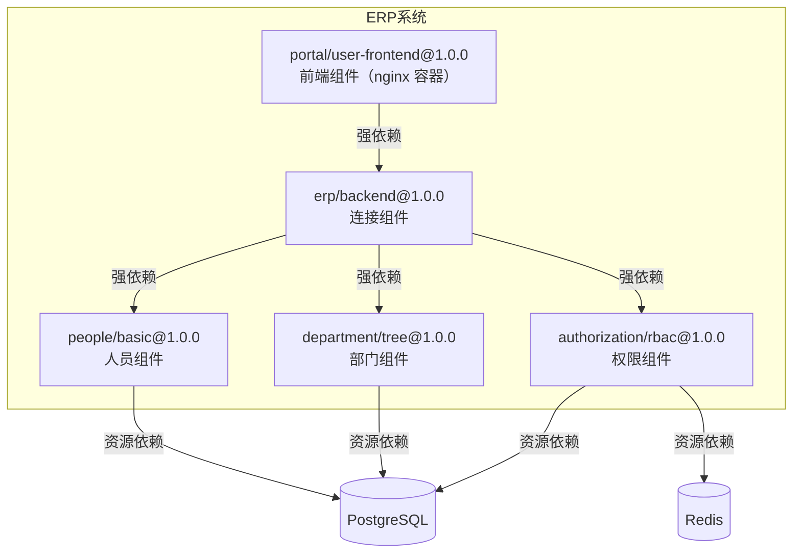
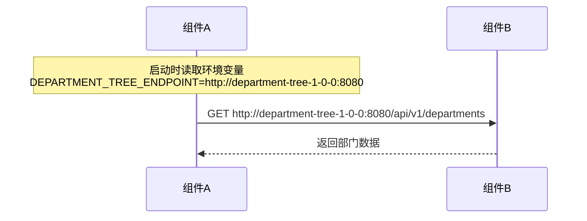
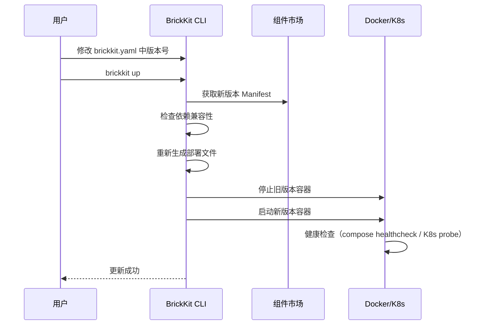

# 002 BrickKit 组件规范

## 文档信息

| 项目 | 内容 |
| --- | --- |
| 文档编号 | 002 |
| 文档名称 | 组件规范 |
| 所属篇章 | 第二篇：组件规范（Component Spec） |
| 版本 | 1.8.2 |
| 最后更新 | 2026-08-23 |
| 状态 | 定稿 |
| 依赖文档 | 001 平台理念与总体架构、012 架构设计原理与考量 |
| 被依赖文档 | 003 项目配置规范、004 BrickKit CLI 设计、005 部署与运行规范、007 组件市场设计、009 组件开发快速入门 |

---

## 1. 组件定义

### 1.1 什么是组件

组件是 BrickKit 中最基本的安装和运行单元。所有组件都是容器（container）。无论是后端服务、前端应用还是工具脚本，只要它是一个组件，就必须以容器形态运行。

| 类型 | 示例 | 容器内容 |
| --- | --- | --- |
| 后端服务 | 人员管理、权限判断 | 业务进程（Go/Java/Python/Node...） |
| 前端应用 | 管理界面、用户工作台 | nginx / caddy 等 Web Server serve 静态资源 |
| 连接/编排组件 | ERP 后端、审批流程 | 业务进程 |
| 工具组件 | Saga 协调器、事件总线 | 业务进程 |
| 适配器 | 旧系统桥接 | 业务进程 |
| 脚本 | 数据迁移、定时任务 | 脚本进程 |

### 1.2 组件的核心特征

| 特征 | 说明 |
| --- | --- |
| 有 Manifest | 通过 `component.yaml` 描述自己 |
| 有版本 | 精确语义化版本（major.minor.patch） |
| 有依赖 | 强依赖（缺失报错）+ 弱依赖（缺失警告但继续，**不注入环境变量**） |
| 有健康检查 | 实现 `/healthz`，供 CLI 生成 K8s Probe / Compose healthcheck |
| 有迁移（可选） | 声明 `migration.command`，CLI 在部署前自动执行数据库迁移 |
| 有产物（可选） | 声明 `artifacts`，发布时上传到市场，安装时由 CLI 自动下载 |
| 可独立运行 | 不依赖平台也能跑 |
| 通过环境变量获取配置 | 不硬编码任何地址 |
| 不需要向任何注册中心注册 | 无注册中心，DNS 即服务发现 |
| 不自带部署文件 | compose/K8s YAML 由 CLI 根据 Manifest 自动生成 |

### 1.3 组件分类

| 类型 | 说明 | 示例 |
| --- | --- | --- |
| 单一组件 | 独立完成一个功能，内部事务自洽 | 人员组件、部门组件 |
| 连接组件 | 协调多个单一组件，可能需异步/分布式事务 | ERP 后端、入职流程 |

### 1.4 组件开发约束

| 必须 | 不得 |
| --- | --- |
| 提供 `component.yaml` | 不得访问其他组件的私有数据 |
| 声明组件 ID 和精确版本 | 不得硬编码其他组件的地址 |
| 声明依赖（强/弱） | 不得假设部署环境（Docker/K8s） |
| 提供健康检查（`/healthz`），且**只检查本进程存活，不检查任何外部依赖** | 不得在健康检查中检查数据库、依赖组件或外部 API |
| 支持环境变量配置 | 不得向注册中心注册（无注册中心） |
| 支持日志输出 | 不得自带 docker-compose 或 K8s 文件 |
| 可独立启动和停止 | 不得硬编码端口映射 |
| 弱依赖缺失时自行降级（缺失时环境变量不存在，必须用 `os.environ.get()` 等安全方式读取） | 不得假设弱依赖一定存在 |
| 建议处理 SIGTERM 信号，收到信号后完成正在处理的请求再退出（优雅关闭）（代码示例见附录 I.7） | 不得忽略 SIGTERM 导致请求中断或数据不一致 |

### 1.5 组件仓库里有什么

| 内容 | 开源组件 | 闭源组件 |
| --- | --- | --- |
| component.yaml | ✅ 必须 | ✅ 必须（存市场） |
| Dockerfile + 源码 | ✅ | ❌ |
| Git 仓库地址 | ✅ 登记到市场 | ❌ |
| 镜像引用 | ✅ | ✅ 必须（存市场） |
| API 契约文件（proto / OpenAPI） | ✅（在 Git 仓库中） | ✅ **必须上传到市场**（如提供 API） |
| 其他附件（SDK、文档等） | ✅ 可选（在 Git 仓库中） | ✅ 可选（上传到市场） |
| 签名 | 可选 | 建议 |
| docker-compose / K8s 文件 | ❌ 不需要 | ❌ 不需要 |

**关键规则：组件不自带部署文件。** 部署文件由 CLI 根据 component.yaml 自动生成。

### 1.6 一个组件一个仓库

每个组件对应一个独立的 Git 仓库。仓库根目录包含 `component.yaml`。

| 规则 | 说明 |
| --- | --- |
| 一个组件一个仓库 | 每个组件（`<scope>/<name>`）对应一个独立的 Git 仓库。仓库根目录包含 `component.yaml` |
| 同一业务的多部分内容属于同一组件 | 如果一个业务功能需要多个文件（如 proto + 后端代码 + 迁移脚本），它们属于同一个组件仓库，一起移动、一起上传、一起发布 |
| 不支持 monorepo 中拆分子目录 | 不允许在一个 Git 仓库中放置多个组件（如 `repo/component-a/component.yaml` + `repo/component-b/component.yaml`） |

**为什么不支持 monorepo？**

- **组件是独立的发布单元。** 每个组件有自己的版本号、自己的镜像、自己的迁移脚本。monorepo 中的多个组件无法独立发布。
- **组件是独立的移动单元。** `brickkit sync` 归档功能移动的是完整的 Git 仓库。monorepo 中的子目录无法独立移动。
- **组件是独立的权限单元。** 不同组件可能有不同的可见性（public/private）和不同的发布者。monorepo 无法实现这种隔离。

**如果确实有多个组件需要协同开发怎么办？**

使用 Git 的分支和 PR 机制协同开发，但每个组件仍然是独立的仓库。或者使用 Git submodule / Git subtree 引用共享代码，但每个组件仓库仍然独立包含自己的 `component.yaml`。

---

## 2. 组件 Manifest 规范

### 2.1 文件名

`component.yaml`

### 2.2 完整结构

```yaml
apiVersion: brickkit/v1
kind: Component

metadata:
  id: people/basic
  name: 基础人员组件
  version: 1.2.0
  description: 提供基础人员管理能力
  vendor: brickkit-official
  license: MIT
  apiDocs: https://docs.brickkit.io/people-basic/api

tags:
  - people
  - master-data
  - backend

# ===== 组件附带的产物/附件（可选）=====
artifacts:
  - type: api-contract
    format: protobuf
    description: "gRPC API 契约文件"
    files:
      - proto/people/v1/people.proto
  - type: api-docs
    format: openapi
    description: "HTTP REST API 文档（FastAPI 自动生成）"
    files:
      - openapi.json

dependencies:
  components:
    # 强依赖（默认）
    - department/tree@1.0.0
    # 弱依赖
    - id: infra/redis-event-bus@1.0.0
      optional: true
  resources:
    - kind: database
      engine: postgresql

configSchema:
  type: object
  properties:
    defaultPageSize:
      type: integer
      default: 20
    enableAudit:
      type: boolean
      default: true
  required:
    - defaultPageSize

deployment:
  type: container
  image: registry.brickkit.io/people-basic:1.2.0
  port: 8080
  extraPorts:                    # 可选，额外端口列表
    - name: grpc                 # 端口名称（用于环境变量命名 + K8s Service 端口名）
      port: 9090                 # 容器内端口号
  resources:                     # 可选，推荐的资源配额
    requests:                    # 建议只写这一半（§4.6）
      cpu: "100m"
      memory: "128Mi"
    # limits:                    # 建议留空，交给部署方决定（写了项目就删不掉）

migration:
  command: ["python", "manage.py", "migrate"]

healthCheck:
  type: http
  path: /healthz
  startPeriodSeconds: 60         # 可选，启动宽限期（秒），默认 60（见 §9.3）
  # ⚠️ /healthz 只检查本进程存活，禁止检查任何外部依赖（见第 9 章）


```

### 2.2.1 拼错的字段会被当场拦下

CLI 在解析 `component.yaml` 时逐层比对字段名，不认识的键**报错并猜出你想写的那个**：

```
❌ 错误：component.yaml 校验失败
   文件：local-dev（local）：demo/typo@1.0.0
   dependencys：未知字段（第 8 行），是不是想写 dependencies？
   migrations：未知字段（第 11 行），是不是想写 migration？
```

**为什么不能静默忽略。** yaml.v3 默认把不认识的键丢掉，而且是**精确比对**——
`healthcheck` 匹配不上 `healthCheck`。必填字段写错了还有语义校验兜底
（"healthCheck 缺失"），**可选字段没有任何兜底**：

| 拼错 | 后果 |
| --- | --- |
| `dependencies` → `dependencys` | 依赖**整个消失**，调用方一个 `*_ENDPOINT` 都拿不到 |
| `migration` → `migrations` | 迁移不跑，组件起来报 `relation does not exist` |
| `extraPorts` → `extraports` | 额外端口不生成，gRPC 调用方连不上 |
| `configSchema` → `configSchemas` | 配置项默认值一个都不注入 |

第二行与 §8.5.1 警告的是**同一种事故**：那里是迁移命令写错一个字母，
这里是字段名写错一个字母，后果一样——一路绿灯，运行时才炸，
而现场没有任何线索指向那一行。

**两处例外不查：**

| 位置 | 为什么 |
| --- | --- |
| `configSchema.properties` 下的键 | 配置项名字由**组件作者自己定**，写什么都合法 |
| 值是自由映射的字段 | 同上 |

> Manifest **没有扩展字段机制**。想给自己的工具链存点东西，放在组件仓库里
> 另一个文件里——`component.yaml` 是平台读的那一份，多出来的键只会是拼写错误。

`brickkit.yaml` 侧有同样的检查（003 §10.1）。

**文档里画的骨架也归它管。** 设计书与 `AI-CONTEXT.md` 里每一段完整的
`component.yaml` / `brickkit.yaml` 骨架，都由 `TestDocSkeletonsUseOnlyKnownFields`
拿**同一个** `yamlcheck.Walk` 走一遍——两边不可能给出不同答案，因为是同一段代码。

这条守卫是补上一个真实的缺口：002 §2.3 删掉 `observability` 与 `compatibility`
之后，`AI-CONTEXT.md` 的骨架里那两个字段留了很久，而那份文件开头写着
"读完这一份就够了"——照着它写出来的 `component.yaml` 会被当场拒绝。
已有的文档守卫（小节引用、断链、命令、参数、目录树、预期输出）一个都抓不到它：
`observability:` 在它们眼里只是一段普通文本。

反向也守：`TestEveryFieldIsMentionedInDesignDocs` 盯着"加了字段却没写进任何一份
设计书"——那种缺失不会让任何东西失败，只会让使用者永远不知道有这个字段。

### 2.3 字段说明

**metadata（必须）**

| 字段 | 类型 | 必须 | 说明 |
| --- | --- | --- | --- |
| id | string | ✅ | 组件唯一标识，格式：`scope/name` |
| name | string | ✅ | 组件显示名称 |
| version | string | ✅ | 精确语义化版本（如 `1.2.0`，不接受 `^1.2.0`） |
| description | string | ✅ | 组件描述 |
| vendor | string | ❌ | 发布者 |
| license | string | ❌ | 许可证 |
| apiDocs | string | ❌ | API 文档 URL |

**tags（可选）**

用于市场分类和搜索。不参与运行时逻辑。

```yaml
tags:
  - people
  - master-data
  - backend
```

**artifacts（可选）**

声明组件附带的产物/附件文件。这些文件在组件发布时上传到市场，在组件安装时由 CLI 自动下载到本地。

```yaml
artifacts:
  - type: api-contract
    format: protobuf
    description: "gRPC API 契约文件"
    files:
      - proto/people/v1/people.proto
  - type: api-docs
    format: openapi
    description: "HTTP REST API 文档"
    files:
      - openapi.json
```

| 字段 | 类型 | 必须 | 说明 |
| --- | --- | --- | --- |
| type | string | ✅ | 产物类型（**自由字符串，不限枚举**）。如 `api-contract`、`api-docs`、`sdk`、`ml-model`、`helm-chart` 等 |
| format | string | ❌ | 具体格式（**自由字符串**）。如 `protobuf`、`openapi`、`graphql`、`asyncapi`、`python`、`go` 等 |
| description | string | ❌ | 人类可读描述 |
| files | array | ✅ | 文件路径列表（相对于组件仓库根目录） |

**artifacts 关键规则：**

| 规则 | 说明 |
| --- | --- |
| type 是自由字符串 | 市场不校验 type 的值，不限枚举。今天是 `api-contract`，明天可以是 `asyncapi-spec`，后天可以是 `ml-model`。市场不理解文件内容，只负责存储和分发 |
| format 是自由字符串 | 同上，市场不校验 |
| 闭源组件必须提供 API 契约 | 如果组件提供 gRPC 或 HTTP API，闭源组件必须在 artifacts 中声明至少一个 `type: api-contract` 的产物。**代码可以闭源，但 API 契约不能闭源** |
| artifacts 跟随组件版本 | 每个组件版本有自己独立的 artifacts。v1.0.0 的 proto 和 v1.1.0 的 proto 独立存储，互不覆盖 |
| CLI 安装时自动下载 | `brickkit add` 时，CLI 自动下载所有 artifacts 到 `.brickkit/artifacts/` 目录 |
| 平台不解析文件内容 | CLI 和市场都不解析 artifacts 中的文件内容，只负责存储和分发 |

**dependencies（可选）**

声明组件依赖。详见第 3 章。

**configSchema（可选）**

声明组件接受的配置项。使用者通过 brickkit.yaml 的 `config` 字段覆盖默认值。详见第 6 章。

⚠️ **保留变量保护：** configSchema 中的配置项名称不得与平台保留变量冲突（见 6.5 节）。

**deployment（必须）**

声明组件的部署方式。详见第 4 章。

**migration（可选）**

声明数据库迁移命令。CLI 在部署前自动执行。详见第 8 章。

**healthCheck（必须）**

声明组件的健康检查方式。详见第 9 章。

⚠️ **健康检查禁令：** `/healthz` 只检查本进程存活，禁止检查数据库、依赖组件或任何外部系统。详见 9.4 节。

> **这里曾经有 `observability` 与 `compatibility` 两个"预留"字段，已删除。**
>
> 两者都从未被任何一处读取。`observability`（`metrics` / `tracing` 两个布尔）
> 更没有通往消费者的路：文档说"未来由可观测性工具组件读取"，
> 而组件**根本读不到别的组件的 Manifest**——只有 CLI 有。
> `compatibility.minCliVersion` 比单纯的死字段更糟，它长得像一道安全闸：
> 写了 `minCliVersion: 2.0.0` 的组件，在 0.1.0 的 CLI 上照装不误。
>
> 一个不生效的"预留"，代价不是那几行代码，是**每个读到它的人都要想一遍
> 该不该填**，而填了不会有任何效果。真做可观测性时需要的多半也不是一个布尔，
> 而是抓取路径与端口——那已经能用 `extraPorts` 表达。
>
> `minCliVersion` 回来的条件：**真的有了两个 CLI 版本、且 Manifest 语义不同**
> 的那一天。届时也该重新想清楚形状——是"最低 CLI 版本"，还是"我用到了哪些能力"。

---

## 3. 组件依赖与拼装规范

### 3.1 依赖类型

组件有两种依赖：

| 依赖类型 | 说明 | 示例 |
| --- | --- | --- |
| 组件依赖 | 需要其他组件存在 | department/tree@1.0.0 |
| 资源依赖 | 需要基础资源 | kind: database, engine: postgresql |

#### 写 `dependencies` 的含义是"**请平台替我部署它**"

这句话决定了一个常被写错的分界：**别人项目里的服务，不能写成组件依赖。**

写进 `dependencies.components` 的东西，平台会把它拉进本项目的依赖图、
排进启动顺序、**在本项目里生成它的容器 / Deployment**。
对同项目内的共用基础设施（认证、通知、消息总线）这正是想要的——
它就是个被很多组件依赖的普通组件，拓扑排序自然把它排在最前。

但如果那个服务其实**由别的团队、在别的项目里部署**，写成依赖的后果是
平台又给你部了一份：两个实例、两套定时任务、两份状态，而两边都以为自己是唯一那个。

| 那个服务在哪 | 怎么写 |
| --- | --- |
| 本项目部署（哪怕很多组件共用） | `dependencies.components` —— 地址由平台注入，不用管 |
| 别的项目部署，别的人维护 | `configSchema` 里一个必填配置项，让项目填对方给的地址 |

第二种就是"调别人的 API"：你只需要知道它在哪，它起没起来是对方负责人的事。
完整规则与两边各做什么见 003 §4.9。

### 3.2 组件依赖

```yaml
dependencies:
  components:
    # 强依赖（默认）：缺失时 CLI 报错，阻断启动
    - department/tree@1.0.0
    - authorization/rbac@1.0.0

    # 弱依赖：缺失时 CLI 警告但继续启动
    - id: infra/redis-event-bus@1.0.0
      optional: true
```

### 3.3 依赖规则

| 规则 | 说明 |
| --- | --- |
| 版本必须是精确的 | department/tree@1.0.0，不接受 ^1.0.0 |
| 强依赖缺失时报错 | CLI 阻断安装/启动 |
| 弱依赖缺失时警告 | CLI 输出警告但继续，**完全不注入该环境变量**（不注入空字符串） |
| 依赖组件必须先于当前组件启动 | CLI 自动处理启动顺序（拓扑排序） |
| 多版本默认共存 | brickkit.yaml 中同一组件 ID 出现多个版本时，CLI 为每个版本生成独立容器，无需额外参数 |
| 一个组件 ID 只能出现一次 | 同一份 `component.yaml` 的 `dependencies.components` 里，同一个组件 ID 只能声明一个版本。多版本共存是**项目级**能力（见 3.6） |
| 破坏性变更（Major）必须协同 | 涉及删除操作的 Major 升级，必须在 Changelog 强提示，调用方必须协调同步升级（见 3.7） |

### 3.4 弱依赖降级

弱依赖缺失时的降级处理，**完全是组件自己的责任**。

CLI 的职责到"完全不注入该环境变量"就结束了。弱依赖缺失时，CLI 不注入对应的环境变量（不注入空字符串），组件必须使用安全读取方式（如 `os.environ.get()`）并在代码中自行处理弱依赖不可用的情况。

**平台不提供任何降级机制、降级框架或降级协议。** 组件开发者需要在自己的代码中实现 `try...catch`、条件判断等降级逻辑。

弱依赖降级代码示例见附录：《组件间通信推荐实践》。

### 3.5 资源依赖

```yaml
dependencies:
  resources:
    - kind: database
      engine: postgresql
    - kind: cache
      engine: redis
```

规则：

- 组件声明资源类型和引擎，不指定具体实例
- 具体实例由管理员在 brickkit.yaml 中绑定
- CLI 在生成部署文件时注入资源连接信息

### 3.6 多版本共存

由于使用精确版本和版本化服务名，多版本共存是天然支持的：

- `people-basic-1-0-0`（v1）
- `people-basic-2-0-0`（v2）

两个版本的服务名不同、容器不同、DNS 不同，物理上完全可以同时运行。

**默认行为：多版本共存。** 当 brickkit.yaml 中同一组件 ID 出现多个版本时，CLI 直接为每个版本生成独立的容器，无需任何额外参数。

```yaml
# brickkit.yaml 中的多版本共存
components:
  - id: people/basic
    version: 1.0.0    # 服务名：people-basic-1-0-0
  - id: people/basic
    version: 2.0.0    # 服务名：people-basic-2-0-0
```

调用方通过 Manifest 中的精确版本声明决定调哪个。

#### 多版本共存是**项目级**能力，不是组件级

上面那份配置是 `brickkit.yaml`——**项目**说"这两个版本我都要跑"。而单个组件的 `dependencies` 里，**一个组件 ID 只能出现一次**：

```yaml
# ❌ component.yaml —— 校验不通过
dependencies:
  components:
    - people/basic@1.0.0
    - people/basic@2.0.0
```

理由在环境变量的命名规矩上（001 §8.3）：**变量名基于组件 ID、不带版本号，值才带版本号。**

```
people/basic@1.0.0  →  PEOPLE_BASIC_ENDPOINT=http://people-basic-1-0-0:8080
people/basic@2.0.0  →  PEOPLE_BASIC_ENDPOINT=http://people-basic-2-0-0:8080
```

两条算出来的是**同一个变量名**。放行的后果不是"其中一条不生效"，而是：两个容器都起来、都 healthy、`up` 全绿，而 1.0.0 那个**没有任何人能访问它**——调用方拿到的全是 2.0.0 的地址。整个过程零警告，而地址完全合法、连得通、有响应，只是版本不对。所以 CLI 在解析 Manifest 时就拦下来。

这条边界不是限制，是"变量名不带版本"换来的东西：**组件升级依赖时代码一个字都不用改**（002 §6.2）。

| 形状 | 合法吗 |
| --- | --- |
| `brickkit.yaml` 里并列 X@1 与 X@2 | ✅ 这就是多版本共存 |
| 组件 A 依赖 X@1，组件 B 依赖 X@2（菱形） | ✅ 各拿各的地址 |
| **同一份 `component.yaml` 里写 X@1 与 X@2** | ❌ 校验失败 |

**确实要在一个组件里同时调两个版本**（迁移期双写等）：把第二个声明成 `configSchema` 里的一个配置项，由项目填地址——和调用跨项目服务用的是同一条路（003 §4.9）。这样两个地址有两个不同的变量名，谁也不会覆盖谁。

⚠️ **注意：** 多版本共存只是物理缓冲，不保证数据层兼容。涉及破坏性变更（删除字段等）时，必须遵循 3.7 协同守则，由部门间协调同步升级。

### 3.7 破坏性变更（Major）协同守则

当组件发布涉及破坏性操作的 Major 版本（如 1.0.0 → 2.0.0，删除字段、重命名表、移除 API 等）时，必须遵循以下守则：

| # | 守则 | 责任方 |
| --- | --- | --- |
| 1 | Changelog 中必须强提示破坏性变更 | 组件发布者 |
| 2 | **主动通知已知的调用方团队**，不能只写进 Changelog 等人来读 | 组件发布者 |
| 3 | 调用方团队必须协调同步升级 | 调用方团队 |
| 4 | 无法按时更新的部门，多版本共存作为物理缓冲期 | 项目管理员 |
| 5 | **缓冲期只在"迁移只增不改、不做删除"时成立** | 组件发布者 |
| 6 | 平台不保证多版本共存时的数据库结构兼容 | —（平台不介入） |

**第 2 条：Changelog 是拉，通知是推。** 没人会天天翻别人组件的 Changelog。
一条只存在于 Changelog 里的破坏性变更，等于没通知——等对方发现时，多半是他的
组件已经在生产上崩了。发布者知道谁在依赖自己（市场的下载记录、组织内部的登记），
主动说一声的成本远低于事后救火。

**第 5 条：缓冲期凭什么成立。** 多版本共存能当缓冲，靠的是两个前提：

| 前提 | 出处 |
| --- | --- |
| 迁移**只增不改**：新增一对文件，绝不修改已执行过的 | §8.10 |
| 迁移**不做破坏性操作**：不删字段、不重命名表、不清数据 | §8.9 |

两个前提都成立时，新版本的迁移集合是旧版本的**超集**，新 schema 对旧代码是向后
兼容的，两个版本共用一个库跑得下去。

**一旦真的删了字段 / 改了类型 / 重命名了表，缓冲期当场失效。** 数据库只有一个，
新版本的迁移一跑，旧版本的代码立刻在新 schema 上崩——这时候多版本共存不是缓冲，
是**同时挂两个**。所以第 2 条那个"主动通知"才是要紧的：缓冲期能不能用，取决于
调用方有没有时间跟进，而那取决于他多早知道。

**重要共识：** 破坏性变更是组织协调问题，不是平台技术问题。多版本共存（brickkit.yaml 中同时存在多个版本条目）只是物理缓冲，不会自动解决数据层冲突（如迁移冲突、字段删除导致旧版本崩溃）。部门之间必须自行协调升级节奏，平台不替任何人兜底。

此守则同样适用于 API 契约文件的破坏性变更。详见 5.11 节。

### 3.8 拼装示例



安装 `erp/backend@1.0.0` 时：

1. CLI 发现它依赖 `people/basic@1.0.0`、`department/tree@1.0.0`、`authorization/rbac@1.0.0`
2. 自动拉取这三个组件的 Manifest
3. 下载所有 artifacts（proto / OpenAPI 等）到 `.brickkit/artifacts/`
4. 检查 brickkit.yaml 中是否已声明 PostgreSQL 和 Redis 资源
5. 拓扑排序得出启动顺序
6. 生成 docker-compose.yaml 或 K8s YAML
7. 注入环境变量（依赖地址带版本号）
8. 调用底层引擎按顺序启动

### 3.9 卸载检查

卸载组件前，CLI 检查是否有其他组件强依赖该组件。如果有，阻止移除并提示。

```
❌ 无法移除 department/tree
   版本：1.0.0
   以下组件强依赖它：people/basic@1.0.0
   建议：请先移除依赖方
```

---

## 4. 部署形态

### 4.1 所有组件都是 container

BrickKit 中只有一种部署形态：container。

```yaml
deployment:
  type: container
  image: registry.brickkit.io/people-basic:1.2.0
  port: 8080
  extraPorts:
    - name: grpc
      port: 9090
```

| 字段 | 类型 | 必须 | 说明 |
| --- | --- | --- | --- |
| type | string | ✅ | 固定为 `container` |
| image | string | ✅ | Docker 镜像地址 |
| port | integer | ✅ | 组件监听端口（主端口，健康检查 + `_ENDPOINT` 环境变量使用此端口） |
| extraPorts | array | ❌ | 额外端口列表（可选）。每项含 `name`（string，端口名称）+ `port`（integer，端口号）。用于声明组件除主端口外需要暴露的其他端口（如 gRPC 端口）。Docker 环境无需额外处理（Docker Network 内所有端口天然可达）；K8s 环境 CLI 在 Service 中暴露额外端口 |
| resources | object | ❌ | 推荐的资源配额（CPU/内存），CLI 透传给底层引擎 |

**extraPorts 字段说明：**

```yaml
deployment:
  type: container
  image: registry.brickkit.io/people-basic:1.2.0
  port: 8080              # 主端口（健康检查 + _ENDPOINT 环境变量）
  extraPorts:             # 可选，额外端口列表
    - name: grpc          # 端口名称（用于环境变量命名 + K8s Service 端口名）
      port: 9090          # 容器内端口号
```

| extraPorts 子字段 | 类型 | 必须 | 说明 |
| --- | --- | --- | --- |
| name | string | ✅ | 端口名称。用于环境变量命名（`{组件ID前缀}_{NAME大写}_ENDPOINT`）和 K8s Service 端口名 |
| port | integer | ✅ | 容器内端口号 |

**extraPorts 行为：**

| 环境 | CLI 行为 |
| --- | --- |
| Docker | 不需要额外处理。Docker Network 内容器的所有端口天然可达，compose 中不需要暴露额外端口 |
| K8s | Service 中增加额外端口映射（见 005 部署与运行规范 §5.4） |
| 环境变量注入 | 额外端口注入为 `{组件ID前缀}_{NAME大写}_ENDPOINT`（见 §6.2） |
| 健康检查 | 仍然使用主端口 `deployment.port`，不变 |
| 保留变量保护 | 额外端口的 `_ENDPOINT` 变量同样受 `*_ENDPOINT` 保留模式保护 |

### 4.2 后端组件

后端组件的容器内运行业务进程：

```dockerfile
FROM python:3.11-alpine
WORKDIR /app
COPY app.py .
RUN addgroup -g 1001 app && adduser -u 1001 -G app -s /bin/sh -D app
USER app
EXPOSE 8080
CMD ["python", "app.py"]
```

### 4.3 前端组件

前端组件的容器内运行 Web Server（如 nginx）serve 静态资源：

```dockerfile
FROM node:18 AS build
COPY . .
RUN npm install && npm run build

FROM nginx:alpine
COPY --from=build /app/dist /usr/share/nginx/html
COPY nginx.conf.template /etc/nginx/templates/default.conf.template
EXPOSE 80
```

前端组件同样是 container：

- 有端口（如 nginx 的 80）
- 有健康检查（如 nginx 的 `/` 或自定义 `/healthz`）
- 可以被 Ingress 暴露
- 可以被 `local: true` 本地调试
- 可以声明依赖后端组件

### 4.4 前端组件的 Manifest 示例

```yaml
apiVersion: brickkit/v1
kind: Component

metadata:
  id: portal/user-frontend
  name: 用户工作台前端
  version: 1.0.0
  description: 提供用户工作台界面
  vendor: brickkit-official
  license: MIT

tags:
  - portal
  - frontend
  - ui

dependencies:
  components:
    - erp/backend@1.0.0

deployment:
  type: container
  image: registry.brickkit.io/portal-user-frontend:1.0.0
  port: 80

healthCheck:
  type: http
  path: /
```

### 4.5 部署文件由 CLI 生成

**组件不自带 docker-compose.yaml 或 K8s YAML 文件。**

CLI 根据 component.yaml 自动生成：

| 环境 | 生成内容 |
| --- | --- |
| Docker | docker-compose.yaml（service 定义、healthcheck、depends_on、environment、resources） |
| K8s | Deployment + Service + Ingress YAML（含 resources） |

组件开发者只需要关心：

- 镜像怎么构建（Dockerfile）
- 监听什么端口
- 健康检查路径是什么
- 依赖什么组件和资源
- 是否需要数据库迁移（migration.command）
- 推荐的资源配额是多少（deployment.resources，可选）
- 需要携带什么产物文件（artifacts，可选）
- 是否有额外端口需要暴露（deployment.extraPorts，可选）

### 4.6 资源配额（deployment.resources）

组件开发者可以在 Manifest 中声明推荐的资源配额，CLI 透传给 K8s/Docker：

```yaml
deployment:
  type: container
  image: registry.brickkit.io/people-basic:1.2.0
  port: 8080
  resources:                     # 可选
    requests:
      cpu: "100m"
      memory: "128Mi"
```

**资源配额规则：**

| 规则 | 说明 |
| --- | --- |
| 纯推荐值，非强制 | CLI 透传给 K8s/Docker，但不校验合理性 |
| brickkit.yaml 可覆盖 | 项目管理员可在 `components[].resources` 中覆盖组件推荐值 |
| 不填时 | `requests` 用 CLI 默认值（`100m` / `128Mi`）；**`limits` 不生成**——限额是业务判断，平台不替人猜一个数字去 OOMKill 你的组件（005 §2.5） |
| Docker 环境也生效 | Docker Compose 支持 `deploy.resources.limits`（Compose v3+） |
| 市场不校验具体数值 | 市场只校验 `resources` 字段的格式合法性 |

**CLI 优先级链：** `brickkit.yaml resources` > `component.yaml deployment.resources` > `CLI 默认 requests`

#### 建议只声明 `requests`，把 `limits` 留给部署方

组件作者知道自己**稳态占多少**（那是代码的事实），但"允许它涨到多少"是**部署环境的判断**——同一个组件跑在开发机和跑在生产集群，上限该不该有、该是多少，答案不一样。

而且这里有一处不对称，值得知道：

⚠️ **配额是逐字段合并的，所以项目能改你写的上限，却删不掉它。** 使用者只写 `limits.memory` 时，`limits.cpu` 会沿用组件声明的那个。逐字段合并本身是对的（"只想调大内存"不该把 CPU 配额一起丢掉），但副作用是——**组件作者一旦写了 `limits.cpu`，用这个组件的项目就再也没有"不设 CPU 上限"这个选项了**。

而不设 CPU 上限恰恰是推荐做法：CPU limit 走 CFS quota，即使节点整体空闲，进程也会在每个 100ms 周期里被限流，表现成毫无来由的 p99 毛刺（005 §2.5）。

所以：

```yaml
deployment:
  resources:
    requests:                    # ✅ 建议写：这是你知道的事实
      cpu: "100m"
      memory: "128Mi"
    # limits:                    # ⬜ 建议留空：这是部署方的判断
```

**Docker Compose 生成示例：**

⚠️ Compose 里**没有 `requests`**，它把 K8s 的 requests 叫 `reservations`
（`deploy.resources` 下只有 `limits` 与 `reservations` 两个键）。
写成 `requests` 的话 `docker compose config` 会直接判它非法。
CLI 生成的就是下面这一份：

```yaml
people-basic-1-2-0:
  image: registry.brickkit.io/people-basic:1.2.0
  deploy:
    resources:
      reservations:          # ← 对应 K8s 的 requests
        cpus: "0.10"
        memory: 128M
      limits:              # 组件声明了 limits 才有这一段
        cpus: "0.50"
        memory: 512M
```

**K8s Deployment 生成示例：**

```yaml
resources:
  requests:
    cpu: 100m
    memory: 128Mi
  limits:
    cpu: 500m
    memory: 512Mi
```

---

## 5. 组件通信规范

### 5.1 核心原则

组件之间的调用完全由组件自己负责。CLI 不做代理、不做路由。

### 5.2 服务发现：DNS 即注册中心

没有注册中心。服务发现完全依赖 DNS。

| 环境 | DNS 来源 | 地址格式 |
| --- | --- | --- |
| 本地 Docker | Compose service name | http://people-basic-1-0-0:8080 |
| 生产 K8s | K8s Service name | http://people-basic-1-0-0:8080 |

**地址格式完全一样。** 组件代码不因部署环境变化而修改。

### 5.3 版本化服务名

服务名 = 组件 ID 转换 + 精确版本号：

| 组件 ID | 版本 | 服务名 |
| --- | --- | --- |
| people/basic | 1.0.0 | people-basic-1-0-0 |
| department/tree | 1.2.0 | department-tree-1-2-0 |
| erp/backend | 2.1.3 | erp-backend-2-1-3 |
| portal/user-frontend | 1.0.0 | portal-user-frontend-1-0-0 |

转换规则：

- `/` → `-`
- `.` → `-`
- 全部小写
- 拼接版本号（版本号中的 `.` → `-`）

好处：

- 多版本天然共存（`people-basic-1-0-0` 与 `people-basic-2-0-0` 可同时运行）
- 调用方明确知道自己调的是哪个版本
- 无隐式升级风险

### 5.4 同步调用

组件 A 想调用组件 B：



组件代码：

```python
import os
import requests

dept_endpoint = os.environ.get("DEPARTMENT_TREE_ENDPOINT")
resp = requests.get(f"{dept_endpoint}/api/v1/departments", timeout=5)
departments = resp.json()
```

### 5.5 调用协议

组件可以选择任何调用协议：

| 协议 | 适用场景 |
| --- | --- |
| HTTP/JSON | 最通用，推荐 |
| gRPC | 高性能内部调用 |
| WebSocket | 实时推送 |
| 自定义协议 | 特殊场景 |

**平台不限制协议。** 组件自己定义自己的 API，自己写文档（Swagger/Proto），调用方看文档直接调。

### 5.6 异步通信

平台不内置消息队列、事件总线或 Saga 协调器。

如果需要异步通信，安装一个工具组件：

```yaml
# 连接组件声明弱依赖工具组件
dependencies:
  components:
    - id: infra/redis-event-bus@1.0.0
      optional: true
    - id: infra/saga-orchestrator@1.0.0
      optional: true
```

安装连接组件时，CLI 自动安装这些工具组件。连接组件自己使用它们。

### 5.7 通信选择指南

| 场景 | 方案 |
| --- | --- |
| 查询数据 | 同步 HTTP 调用 |
| 权限判断 | 同步 HTTP 调用 |
| 状态通知（不要求立即） | 安装事件总线组件 |
| 长流程编排 | 安装 Saga 组件 |
| 削峰/解耦 | 安装 MQ 组件 |
| 什么都不装 | 只有同步 HTTP |

### 5.8 前端组件调用后端

前端组件（nginx 容器）通过 nginx 反向代理访问后端组件：

```nginx
# nginx.conf 模板
upstream backend {
    server ${ERP_BACKEND_ENDPOINT};  # CLI 注入的环境变量
}

server {
    listen 80;

    # 静态资源
    location / {
        root /usr/share/nginx/html;
        try_files $uri $uri/ /index.html;
    }

    # 反向代理后端 API
    location /api/ {
        proxy_pass http://backend;
        proxy_set_header Host $host;
        proxy_set_header X-Real-IP $remote_addr;
    }
}
```

前端代码中所有 API 请求都发到同源路径（`/api/v1/...`），nginx 通过环境变量拿到后端地址做反向代理。前端代码不需要知道后端的具体地址。

### 5.9 调用上下文

组件之间调用时，推荐携带上下文：

```
X-Request-Id: req-456
X-Trace-Id: trace-123
X-User-Id: user-1001
```

这不是平台强制要求，而是组件自己决定的最佳实践。

### 5.10 数据边界

- 组件不得直接访问其他组件的数据库
- 组件不得依赖其他组件的内部实现
- 组件之间只通过 API 通信
- 即使多个组件共享同一个 PostgreSQL 实例，也必须使用不同的 database

### 5.11 API 契约公开原则

**核心原则：代码可以闭源，但 API 契约必须公开。**

组件之间的调用需要调用方知道被调用方的 API 定义（端点、参数、返回格式）。无论组件是开源还是闭源，调用方都需要某种形式的 API 契约才能开发调用代码。

| 组件类型 | API 契约来源 | 说明 |
| --- | --- | --- |
| 开源组件 | Git 仓库中的 proto / OpenAPI 文件 | 调用方可直接从 Git 仓库获取 |
| 闭源组件 | 市场存储的 artifacts | 调用方通过 `brickkit add` 自动下载 |

**API 契约文件的版本管理：**

API 契约文件（如 proto 文件）不需要独立的版本管理。契约文件跟随组件版本走，与数据库 migration 使用完全相同的兼容性逻辑：

| 变更类型 | 对调用方的影响 | 处理方式 |
| --- | --- | --- |
| 向后兼容变更（Minor） | 旧客户端代码自然兼容 | 不需要特别处理 |
| 破坏性变更（Major） | 旧客户端代码不能工作 | 遵循"破坏性变更（Major）协同守则"（见 3.7 节） |

一句话：proto 文件的版本管理 = 组件的版本管理。不需要额外的机制。

**闭源组件的 API 契约要求：**

如果闭源组件提供 gRPC 或 HTTP API，发布到市场时必须在 artifacts 中声明至少一个 `type: api-contract` 的产物。市场在发布时校验：如果组件声明了 `deployment.port`（即提供 API），且 `sourceType` 为 `registry`（闭源），则必须存在至少一个 `type: api-contract` 的 artifact。缺失时，市场拒绝发布。

**平台不解析 API 契约内容。** CLI 和市场只负责存储和分发，不理解 proto 文件的内容、不校验 OpenAPI spec 的格式。API 契约的质量是组件发布者的责任。

---

## 6. 组件配置与环境变量规范

### 6.1 核心原则

**组件不得硬编码任何配置。** 所有配置通过环境变量注入。

### 6.2 环境变量命名规则

**依赖组件地址**

命名规则：`{组件ID前缀}_ENDPOINT`

转换规则：

- 组件 ID 中的 `/` 转为 `_`
- 组件 ID 中的 `-` 转为 `_`
- 全部大写

| 组件 ID | 环境变量名 | 示例值（带版本号） |
| --- | --- | --- |
| department/tree | DEPARTMENT_TREE_ENDPOINT | http://department-tree-1-0-0:8080 |
| people/basic | PEOPLE_BASIC_ENDPOINT | http://people-basic-1-2-0:8080 |
| authorization/rbac | AUTHORIZATION_RBAC_ENDPOINT | http://authorization-rbac-1-0-0:8080 |
| infra/redis-event-bus | INFRA_REDIS_EVENT_BUS_ENDPOINT | http://infra-redis-event-bus-1-0-0:8080 |

关键规则：

- 环境变量名不带版本号（基于组件 ID）
- 环境变量值带版本号（指向具体服务名）
- 弱依赖缺失时，该环境变量不存在（CLI 不注入空值，组件必须用 `os.environ.get()` 等安全方式读取）

**额外端口地址（extraPorts）**

当组件声明了 `deployment.extraPorts` 时，CLI 为每个额外端口注入独立的环境变量。

命名规则：`{组件ID前缀}_{NAME大写}_ENDPOINT`

| 组件 ID | extraPorts | 环境变量名 | 示例值 |
| --- | --- | --- | --- |
| people/basic | [{name: grpc, port: 9090}] | PEOPLE_BASIC_GRPC_ENDPOINT | http://people-basic-1-2-0:9090 |

关键规则：

- 主端口的环境变量保持不变：`{组件ID前缀}_ENDPOINT`（如 `PEOPLE_BASIC_ENDPOINT`）
- 额外端口的环境变量使用：`{组件ID前缀}_{NAME大写}_ENDPOINT`（如 `PEOPLE_BASIC_GRPC_ENDPOINT`）
- 额外端口的 ENDPOINT 变量同样受 `*_ENDPOINT` 保留模式保护
- 弱依赖缺失时，主端口和额外端口的环境变量都不存在

**资源连接**

```
DATABASE_HOST
DATABASE_PORT
DATABASE_NAME
DATABASE_USER
DATABASE_PASSWORD
REDIS_HOST
REDIS_PORT
REDIS_PASSWORD
```

如果一个组件需要多个同类资源，使用前缀区分：

```
PRIMARY_DATABASE_HOST
PRIMARY_DATABASE_PORT
ARCHIVE_DATABASE_HOST
ARCHIVE_DATABASE_PORT
```

**组件自身配置**

组件在 `configSchema` 中声明的配置项，转为大写下划线格式：

```yaml
configSchema:
  properties:
    defaultPageSize:
      type: integer
      default: 20
    enableAudit:
      type: boolean
      default: true
```

注入为：

```
DEFAULT_PAGE_SIZE=20
ENABLE_AUDIT=true
```

使用者可通过 brickkit.yaml 的 `config` 字段覆盖默认值。

**平台注入的通用变量**

| 环境变量 | 说明 | 示例 |
| --- | --- | --- |
| COMPONENT_ID | 组件 ID | people/basic |
| COMPONENT_VERSION | 组件版本 | 1.2.0 |

### 6.3 完整环境变量示例

安装 `people/basic@1.2.0` 时，CLI 注入：

```bash
# 平台通用
COMPONENT_ID=people/basic
COMPONENT_VERSION=1.2.0

# 依赖组件地址（值带版本号）
DEPARTMENT_TREE_ENDPOINT=http://department-tree-1-0-0:8080

# 资源连接
DATABASE_HOST=postgres
DATABASE_PORT=5432
DATABASE_NAME=people
DATABASE_USER=people_user
DATABASE_PASSWORD=${PEOPLE_DB_PASSWORD}

# 组件自身配置（来自 configSchema，可被 brickkit.yaml config 覆盖）
DEFAULT_PAGE_SIZE=20
ENABLE_AUDIT=true
```

如果 people/basic 声明了 `extraPorts: [{name: grpc, port: 9090}]`，则依赖它的组件还会收到：

```bash
# 额外端口地址（值带版本号）
PEOPLE_BASIC_GRPC_ENDPOINT=http://people-basic-1-2-0:9090
```

### 6.4 组件读取配置

```python
import os

# 依赖组件地址（强依赖：一定存在）
dept_endpoint = os.environ["DEPARTMENT_TREE_ENDPOINT"]

# 数据库连接
db_host = os.environ["DATABASE_HOST"]
db_port = int(os.environ["DATABASE_PORT"])
db_name = os.environ["DATABASE_NAME"]
db_user = os.environ["DATABASE_USER"]
db_password = os.environ["DATABASE_PASSWORD"]

# 组件自身配置
page_size = int(os.environ.get("DEFAULT_PAGE_SIZE", "20"))
enable_audit = os.environ.get("ENABLE_AUDIT", "true") == "true"

# 弱依赖地址（必须用安全读取！弱依赖缺失时该变量不存在）
event_bus_endpoint = os.environ.get("INFRA_REDIS_EVENT_BUS_ENDPOINT")
if event_bus_endpoint:
    ...  # 弱依赖可用
else:
    ...  # 降级处理
```

### 6.5 configSchema

组件在 Manifest 中声明需要哪些配置：

```yaml
configSchema:
        type: object
        properties:
          defaultPageSize:
            type: integer
            default: 20
            description: 默认分页大小
          enableAudit:
            type: boolean
            default: true
            description: 是否启用审计
          logLevel:
            type: string
            enum: [debug, info, warn, error]
            default: info
            description: 日志级别
        required:
          - defaultPageSize
```

使用者在 brickkit.yaml 中覆盖：

```yaml
components:
  - id: people/basic
    version: 1.2.0
    config:
      defaultPageSize: 50
      enableAudit: false
```

**configSchema 定位：是"配置说明书"，不是"安检机"。**

- 组件发布者通过 configSchema 向使用者提供"配置说明书"（类型、默认值、描述、枚举）。
- CLI 不基于 configSchema 对使用者填写的 config 值做运行时类型校验。使用者如果填错类型（如把 integer 写成字符串），CLI 原样注入，由此导致的组件运行异常由使用者自行承担。
- 市场仅在发布时校验 configSchema 本身的 JSON Schema 格式合法性（结构校验），不校验使用者的 config 值。

**但"这个配置项存不存在"要说一声。**

不校验的是**值**（类型、枚举、范围）；**键名**不在此列——`brickkit.yaml` 里写了一个 configSchema 中没有的配置项时，`brickkit up` 会警告：

```
⚠️ config 里有配置项不会生效：组件 demo/hello 的 greetting
   组件：demo/hello
   配置项：greetting
   原因：组件的 configSchema 里没有这一项，是不是想写 greeting？
   影响：这一项不会被注入任何环境变量；组件会使用它自己的默认值
   组件声明的配置项：greeting、logLevel
```

组件**根本没有声明 configSchema**、而项目写了 `config` 时，整块都不会生效，换一句说法：

```
⚠️ config 整块不会生效：组件 demo/nocfg 没有声明 configSchema
   被忽略的配置项：anything、logLevel（共 2 项）
   建议：要让它可配置，先在组件的 component.yaml 里加 configSchema
```

**为什么"不校验类型"不能顺延到键名。** 012 §2.12 拒绝校验值的地基是那句"两种方式都能让用户发现错误"——类型填错了，组件拿到 `"abc"` 去 `int()` 会崩，用户一定会发现。而键名填错**没有任何运行时失败可以兜底**：变量根本不出现，组件走进 `os.environ.get(k, 默认值)` 的默认分支，一切正常运行，只是不按你配的运行。这与 §2.2.1 拦下拼错字段名是同一条推理。

它也不在 §2.12 担心的那条滑坡上（type → enum → minimum → pattern）：那些是 JSON Schema 的**约束**，而"这个键在 `properties` 里有没有"只是一次存在性检查，没有下一步。

**是警告不是错误**，与保留变量冲突同一条线：一个配置项名字写错就整个项目起不来，代价不成比例。升级后新版本删掉了某个配置项、而 `brickkit.yaml` 里还留着覆盖时，看到的也是这条警告（§7.9）——那正是最该说一句的时刻。

**保留变量保护：**

configSchema 中的配置项名称不得与平台保留变量冲突（转大写后匹配）：

| 保留模式 | 说明 | 匹配方式 |
| --- | --- | --- |
| COMPONENT_ID | 平台通用变量 | 精确匹配 |
| COMPONENT_VERSION | 平台通用变量 | 精确匹配 |
| *_ENDPOINT | 依赖组件地址（含额外端口） | 后缀匹配 |
| DATABASE_* | 数据库资源连接 | 前缀匹配 |
| REDIS_* | 缓存资源连接 | 前缀匹配 |
| MQ_* | 消息队列资源连接 | 前缀匹配 |
| STORAGE_* | 对象存储资源连接 | 前缀匹配 |
| SEARCH_* | 搜索引擎资源连接 | 前缀匹配 |
| SMTP_* | 邮件服务资源连接 | 前缀匹配 |
| {envPrefix}_* | 多资源前缀（如 PRIMARY_、ARCHIVE_） | 前缀匹配 |

**冲突处理（两层防御）：**

| 层次 | 时机 | 行为 |
| --- | --- | --- |
| 市场发布时校验 | 源头防御 | configSchema 配置项名称与保留变量冲突时，**市场拒绝发布** |
| CLI 注入时检测 | 运行时防御 | config 覆盖的环境变量与保留变量冲突时，CLI 警告但跳过该配置项，平台注入的值优先 |

**冲突示例：**

- `departmentTreeEndpoint` → `DEPARTMENT_TREE_ENDPOINT` → 与 `*_ENDPOINT` 冲突 ❌
- `componentId` → `COMPONENT_ID` → 与 `COMPONENT_ID` 冲突 ❌
- `databaseHost` → `DATABASE_HOST` → 与 `DATABASE_*` 冲突 ❌
- `customPageSize` → `CUSTOM_PAGE_SIZE` → 无冲突 ✅

### 6.6 密钥管理

敏感信息（密码、Token、私钥）不直接写入环境变量值。

| 环境 | 方式 |
| --- | --- |
| Docker | 通过 `.env` 文件引用（如 `${DATABASE_PASSWORD}`） |
| K8s | 通过 Secret 引用 |

组件代码中直接读取环境变量即可，不需要知道密钥来源。

### 6.7 配置不硬编码

```python
# ❌ 错误：
db_host = "10.0.1.10"

# ✅ 正确：
db_host = os.environ["DATABASE_HOST"]

# ❌ 错误：
dept_url = "http://department-tree:8080"

# ✅ 正确：
dept_url = os.environ["DEPARTMENT_TREE_ENDPOINT"]
```

---

## 7. 组件版本、发布与更新规范

### 7.1 精确版本

```
major.minor.patch
```

| 变化 | 含义 | 示例 |
| --- | --- | --- |
| patch | 向后兼容的问题修复 | 1.0.0 → 1.0.1 |
| minor | 向后兼容的新增功能 | 1.0.0 → 1.1.0 |
| major | 破坏性变更 | 1.0.0 → 2.0.0 |

关键规则：

| 规则 | 说明 |
| --- | --- |
| 版本必须是精确的 | 1.2.0，不接受 ^1.2.0 或 ~1.2.0 |
| 依赖声明也是精确版本 | department/tree@1.0.0 |
| 版本不可重复 | 同一组件同一版本只能发布一次 |
| 升级必须显式 | 调用方必须手动修改 Manifest 中的版本号 |
| 服务名带版本号 | people-basic-1-2-0 |
| Major 破坏性变更必须协同 | 见 3.7 破坏性变更（Major）协同守则 |

### 7.2 版本状态

| 状态 | 说明 | 能否安装 |
| --- | --- | --- |
| draft | 草稿，开发中 | ❌ |
| stable | 稳定，可安装 | ✅ |
| deprecated | 已弃用 | ⚠️ 可安装，提示风险 |
| blocked | 被阻止 | ❌ |

### 7.3 更新流程



### 7.4 更新策略

| 策略 | 说明 | 适用场景 |
| --- | --- | --- |
| stop-first | 先停旧，再启新 | 前期默认，Docker 环境 |
| rolling | 逐个替换实例 | K8s 环境，无状态组件 |

前期统一使用 stop-first。

### 7.5 回滚

更新失败或用户手动请求时，可以回滚到上一个版本。

回滚方式：修改 brickkit.yaml 中的版本号，重新 `brickkit up`。

### 7.6 多版本共存

由于服务名带版本号，多版本可以天然共存：

```yaml
# brickkit.yaml
components:
  - id: people/basic
    version: 1.0.0    # 服务名：people-basic-1-0-0
  - id: people/basic
    version: 2.0.0    # 服务名：people-basic-2-0-0
```

- `http://people-basic-1-0-0:8080` → v1
- `http://people-basic-2-0-0:8080` → v2

调用方通过 Manifest 中的精确版本声明决定调哪个。

**多版本共存是默认行为。** brickkit.yaml 中写了几个版本，CLI 就启动几个容器，无需任何额外参数。

⚠️ **注意：** 多版本共存只是物理缓冲，不保证数据层兼容。涉及破坏性变更（删除字段等）时，必须遵循 3.7 协同守则，由部门间协调同步升级。

### 7.7 升级时"检查依赖兼容性"的具体内容

7.3 更新流程中提到"CLI 检查依赖兼容性"。具体检查内容如下：

| # | 检查项 | 说明 | 失败时行为 |
| --- | --- | --- | --- |
| 1 | 新版本 Manifest 可获取 | CLI 从安装源获取新版本的 component.yaml | ❌ 报错阻断 |
| 2 | 新版本的强依赖可满足 | 新版本 Manifest 中声明的所有强依赖，都能从安装源获取 | ❌ 报错阻断 |
| 3 | 新版本的资源依赖已绑定 | 新版本 Manifest 中声明的资源依赖（kind + engine），在 brickkit.yaml 的 resources 中已声明且已绑定给该组件 | ❌ 报错阻断 |
| 4 | 新版本的弱依赖可获取 | 新版本 Manifest 中声明的弱依赖，尝试从安装源获取 | ⚠️ 警告但继续 |
| 5 | 新版本无循环依赖 | 新版本的依赖树中不存在循环依赖 | ❌ 报错阻断 |

⚠️ **这五项没有专门的"升级检查"入口——它们本来就在每一次 `brickkit up` 上。**
1、2、4、5 由依赖解析给出，3 由 `up` 的资源绑定检查给出（006 §4.4）。升级与不升级
走的是同一条路，因此行为完全一致：`--dry-run` 下第 3 项同样降级为警告，
`enabled: false` 的组件同样不参与。

> CLI 从前另有一个"升级专用"的检查入口，是这套判断的第二份拷贝，
> 而且复制得不完整——它不认 `--dry-run` 的降级，也不过滤本次不启动的组件。
> 已删除，理由与完整对照见 004 §3.5.1。

**CLI 不检查的内容：**

| 不检查的内容 | 原因 |
| --- | --- |
| API 兼容性 | 平台不理解组件的 API，无法判断新旧版本 API 是否兼容 |
| 数据库结构兼容性 | 平台不解析迁移脚本内容 |
| configSchema 值兼容性 | configSchema 是"配置说明书"，CLI 不校验 config 值类型 |
| 调用方 Manifest 中的依赖版本 | 调用方的 Manifest 中写的是精确版本，升级被依赖组件不影响调用方（见 7.8） |

### 7.8 升级时调用方 Manifest 的处理

由于 BrickKit 使用精确版本，升级被依赖组件**不会自动影响调用方**。

**场景：** 组件 A 的 Manifest 中声明了 `dependencies: [B@1.0.0]`。现在 B 发布了 2.0.0。

| 情况 | 行为 |
| --- | --- |
| 只升级 B（brickkit.yaml 中 B 的版本改为 2.0.0） | A 仍然调用 B@1.0.0。如果 brickkit.yaml 中只保留了 B@2.0.0 而移除了 B@1.0.0，A 的强依赖无法满足，CLI 报错阻断 |
| 升级 B 并保留旧版本（多版本共存） | A 继续调用 B@1.0.0，其他组件可以调用 B@2.0.0 |
| 让 A 调用 B@2.0.0 | 必须修改 A 的 component.yaml，将依赖改为 `B@2.0.0`，重新构建并发布 A 的新版本 |

**核心规则：** 调用方 Manifest 中的依赖版本是精确的。升级被依赖组件后，调用方不会自动切换。如果调用方需要使用新版本，必须显式修改自己的 Manifest 并发布新版本。

### 7.9 升级时 configSchema 变更的处理

新版本可能新增、删除或修改 configSchema 配置项。处理规则如下：

| 变更类型 | CLI 行为 | 说明 |
| --- | --- | --- |
| 新增配置项 | 使用 configSchema 中的默认值 | 无需用户操作 |
| 删除配置项 | brickkit.yaml 中对应的 config 覆盖值被忽略 | CLI 不注入该变量，**警告一声**（见 §6.5），不阻断 |
| 修改配置项类型 | CLI 不校验类型，原样注入 | configSchema 是"配置说明书"，不是"安检机" |
| 修改配置项默认值 | 如果 brickkit.yaml 中没有覆盖，使用新默认值 | 如果 brickkit.yaml 中有覆盖，使用覆盖值 |

**注意：** CLI 不校验 config 值的**类型**。但如果新版本删除了某个配置项、而 brickkit.yaml 中仍然覆盖着它，CLI 会**警告一声**——那一行覆盖从此不起作用了，而使用者多半以为还在生效（见 §6.5）。警告不阻断升级。

### 7.10 升级时 artifacts 的处理

| 操作方式 | artifacts 行为 |
| --- | --- |
| 方式 1：修改 brickkit.yaml 版本号 → `brickkit up` | CLI 获取新版本 Manifest。如果新版本的 artifacts 不在本地缓存中，CLI 自动从安装源下载到 `.brickkit/artifacts/<新版本化服务名>/` |
| 方式 2：`brickkit add X@新版本` | CLI 自动下载新版本的所有 artifacts（与首次安装行为一致） |

**关键规则：**

- 每个版本的 artifacts 独立存储（按版本化服务名区分），互不覆盖
- 旧版本的 artifacts 不会被删除（保留在 `.brickkit/artifacts/<旧版本化服务名>/`）
- 升级后，调用方如需使用新版本的 API 契约，需要重新读取 `.brickkit/artifacts/<新版本化服务名>/` 中的文件
- `brickkit remove` 时清理对应版本的 artifacts 缓存

---

## 8. 数据库迁移规范

### 8.1 什么是数据库迁移

组件更新可能涉及数据库结构变更（新增字段、修改索引等）。组件可以通过 Manifest 声明迁移命令，CLI 在部署前自动执行。

### 8.2 Manifest 中的 migration 字段

```yaml
# component.yaml
migration:
  command: ["python", "manage.py", "migrate"]
```

| 字段 | 类型 | 必须 | 说明 |
| --- | --- | --- | --- |
| migration.command | array | ✅ | 迁移命令（数组格式） |

### 8.3 CLI 执行逻辑

| 环境 | CLI 行为 |
| --- | --- |
| Docker | 生成一次性 service，主 service 通过 `depends_on: service_completed_successfully` 等待 |
| K8s | 生成 Job；CLI 在执行迁移前先自动清理可能残留的同名旧 Job（`kubectl delete job --ignore-not-found`），然后阻塞等待新 Job 完成后再 apply Deployment |

### 8.4 迁移使用的镜像

CLI 使用组件自己的镜像（`deployment.image`）执行迁移命令。

迁移脚本和主业务代码打包在同一个镜像中（如 Django 的 `manage.py`、Rails 的 `db:migrate`、Go 的 `golang-migrate`）。

**⚠️ 镜像带 ENTRYPOINT 时的正确写法。** 组件镜像通常声明 `ENTRYPOINT ["/app/组件"]`。
Docker 的 `command` 只覆盖 `CMD`，因此**只写 command 会导致参数错位**：

```yaml
# ❌ 错误：实际执行 `/app/department-tree /app/department-tree migrate`
command: ["/app/department-tree", "migrate"]

# ✅ 正确：同时覆盖 entrypoint 与 command
entrypoint: ["/app/department-tree"]
command: ["migrate"]
```

参数错位的后果很隐蔽：迁移容器会**把服务启动起来**而不是执行迁移，
于是它永远不"完成"，主服务卡在 `service_completed_successfully` 上，整个项目起不来。

CLI 生成部署文件时按此规则拆分 `migration.command`：第一段作为 `entrypoint`，
其余作为 `command`。

**K8s 不需要拆。** K8s 的 `container.command` 本身就整体替换镜像的 ENTRYPOINT
（`container.args` 才对应 CMD），因此整条 `migration.command` 直接写进 `command` 即可。
两种目标的差异只在这一处，`migration.command` 在 component.yaml 里的写法不变。

### 8.5 迁移环境变量

CLI 自动将主容器的环境变量（特别是 `DATABASE_HOST`、`DATABASE_PASSWORD` 等）原封不动地复制给迁移容器。开发者不需要在 `migration` 字段中额外配置环境变量。

寻址方式也一并保持一致：当项目里有 `local: true` 的组件时，迁移容器与主容器拿到**相同的 `extra_hosts`**。环境变量里给了一个主机名，容器里就必须解析得了它。

### 8.5.1 组件入口必须对未知参数 fail fast

⚠️ **这是组件开发者的责任，而且是一条硬性要求。**

迁移容器与主容器用的是**同一个镜像**，只靠命令行参数区分。因此组件入口只允许两种结果：

| 参数 | 必须的行为 |
| --- | --- |
| 不带参数（或约定的服务启动参数） | 启动服务 |
| `migration.command` 中约定的迁移参数 | 执行迁移，完成后**退出**（exit 0） |
| **其他任何参数** | **打印错误并以非零码退出** |

```go
// ❌ 错误：不认识的参数被当成"那就启动服务吧"
if len(args) > 0 && args[0] == "migrate" {
    return runMigrate(args[1:])
}
return serve()          // ← migrate-typo 会走到这里

// ✅ 正确：先认参数，不认识就报错
switch {
case len(args) == 0:
    return serve()
case args[0] == "migrate":
    return runMigrate(args[1:])
default:
    return fmt.Errorf("未知的参数：%s", args[0])
}
```

**为什么必须这样：** 迁移命令写错一个字母时，若入口回落到"启动服务"，迁移容器就变成了服务容器——它**永不退出**，主服务永远等不到 `service_completed_successfully`，整个项目卡在 `Created`。而这时容器日志里写着"组件已就绪"，看上去一切正常，排查方向会被彻底带偏。这与 8.4 的参数错位是**同一种事故的两个来源**（一个来自平台生成，一个来自组件入口），后果完全一样。

参数校验应当发生在**读取环境变量、连接数据库之前**：告诉使用者"参数写错了"，不该先去连一个可能根本连不上的库，否则给出的是一句误导的"连接数据库失败"。

### 8.6 迁移失败处理

- 迁移成功（exit 0）→ 主服务正常启动
- 迁移失败（exit 非 0）→ 主服务不启动
- 不设超时限制（用户自己看日志判断）
- 不设重试（数据库 DDL 操作不应盲目重试）

### 8.7 迁移命令示例

| 语言/框架 | 迁移命令 |
| --- | --- |
| Python / Django | ["python", "manage.py", "migrate"] |
| Ruby / Rails | ["rails", "db:migrate"] |
| Go / golang-migrate | ["./migrate", "-path", "/migrations", "-database", "$DATABASE_URL", "up"] |
| Node.js / Prisma | ["npx", "prisma", "migrate", "deploy"] |
| Java / Flyway | ["flyway", "migrate"] |
| Shell 脚本 | ["sh", "/app/scripts/migrate.sh"] |

### 8.8 没有 migration 字段的组件

如果组件没有声明 `migration` 字段，CLI 不执行任何迁移操作，直接启动主容器。

### 8.9 迁移最佳实践

| 原则 | 说明 |
| --- | --- |
| 先兼容后迁移 | 新增字段，不删除旧字段 |
| 幂等性 | 迁移脚本可以安全地重复执行 |
| 不做破坏性操作 | 不在迁移中直接删除字段、重命名表、清空数据 |
| 迁移脚本随代码版本走 | 迁移脚本和代码在同一个镜像中 |

### 8.10 迁移脚本组织

平台不规定用哪个迁移工具（见 8.7），但**结构变更必须以有版本号的脚本文件存在**，
不得写成代码里的 `CREATE TABLE IF NOT EXISTS`。

理由：埋在代码里的建表语句只能表达"从无到有"，表达不了"这一版相对上一版加了一列"。
组件升级时，使用者、评审者、排障的人都需要看到**这一版改了什么**。

**推荐的文件组织：**

```
migrations/
├── 0001_init.up.sql             建表与索引
├── 0001_init.down.sql           回退：删表
├── 0002_seed_departments.up.sql 初始数据
└── 0002_seed_departments.down.sql
```

| 约定 | 说明 |
| --- | --- |
| 文件名 | `<版本>.up.sql` 与 `<版本>.down.sql` 成对出现 |
| 版本号 | 取自文件名，**在组件内**唯一且递增（如 `0001_`、`0002_`） |
| 一个文件一件事 | 便于回退与评审 |
| **已执行过的迁移不得修改** | 改了也不会重跑（版本已记录），只会造成"文件与库不一致" |
| 新的结构变更 | **新增**一对文件，不要改旧的 |

使用现成迁移框架（Django / Flyway / golang-migrate 等）的组件，遵循框架自身的
文件组织即可——本节约定针对的是自行实现迁移执行的组件。

### 8.11 迁移状态表

组件必须记录"哪些迁移已经执行过"，否则无法做到幂等。推荐的表结构：

```sql
CREATE TABLE IF NOT EXISTS schema_migrations (
    component_id TEXT NOT NULL,
    version      TEXT NOT NULL,
    applied_at   TIMESTAMPTZ NOT NULL DEFAULT NOW(),
    PRIMARY KEY (component_id, version)
)
```

**主键必须包含组件标识。** 版本号是**每个组件各自的**：几乎所有组件的第一个迁移
都叫 `0001_init`。若只用 `version` 做主键，一旦两个组件共用同一个数据库，
先执行的组件会让后执行的组件误以为"我的 0001 已经跑过了"——后者的表根本建不出来，
随后的迁移会往一张不存在的表上操作而失败。

> 组件本应各用各的数据库（见 006 §9.5），但本约定让"共用"这种误用只是**不推荐**，
> 而不是**静默损坏数据**。

### 8.12 迁移执行的不变量

无论用什么语言、什么框架实现，迁移执行必须满足三条：

| 不变量 | 含义 | 不满足会怎样 |
| --- | --- | --- |
| **幂等** | 已执行过的版本不再执行 | 容器每次重启都会重跑迁移，初始数据被反复覆盖 |
| **原子** | 迁移与它的版本记录写在**同一个事务**里 | 两者之间存在窗口，进程正好在此崩溃时该迁移会被重复执行 |
| **有序** | 向上按版本递增执行，失败即中止；**失败的迁移不记录版本** | 记录了下次就跳过，数据库永远停在半吊子状态且不会被修复 |
| **并发安全** | 取一把**库级锁**再开始（PostgreSQL 的 `pg_advisory_xact_lock`、MySQL 的 `GET_LOCK`），拿不到就等 | 两个进程同时跑同一批迁移时，双方都读到"这条还没跑过"，然后一个成功、另一个撞主键退出 |

**第四条不是理论上的。** "读一遍已应用的版本 → 逐条应用"这个写法（本节推荐的、
也是最自然的写法）在两个进程之间不成立：两边都在①读到空集，都去②应用同一条。

平台已经把**它自己造出来的**那一次竞争消掉了——同一组件的多个版本，迁移按版本号
串行（005 §6.2.1）。但它挡不住跨进程的并发：

| 场景 | 平台管得了吗 |
| --- | --- |
| 同一次 `up` 里，一个组件的多个版本 | ✅ 平台串行化（005 §6.2.1） |
| 两个人同时 `brickkit up` 打同一个开发库 | ❌ |
| CI 与开发者撞上 | ❌ |
| K8s Job 因节点故障被重新调度、与残留的那个并存 | ❌ |

所以这一条**必须由组件自己守**。用现成迁移框架的基本不用管：golang-migrate、
Flyway、Rails 6+、Prisma `migrate deploy` 都已经加了库级锁。自行实现迁移执行的
组件（§8.10 允许这条路）要自己加。

### 8.13 回退（down）的定位

`down` 脚本的用途是**开发与测试**：让人能反复把库搭起来、拆掉。

| 环境 | 立场 |
| --- | --- |
| 开发 / 测试 | 推荐提供 `down` 脚本，便于重建环境 |
| 生产 | **不使用 down 回退**。结构出问题应当用一个新的 up 迁移去修（见 8.9 不做破坏性操作） |

若某个迁移没有提供 `down` 脚本，回退时必须**明确报错**，不得假装成功——
那会让迁移记录与数据库真实结构对不上，比直接报错危险得多。

---

## 9. 健康检查规范

### 9.1 健康检查类型

| 类型 | 适用场景 | 说明 |
| --- | --- | --- |
| http | 大多数组件 | GET 请求，返回 200 即健康 |
| tcp | 基础资源 | 端口可连接即健康 |
| none | 特殊场景（极少使用） | 不做健康检查 |

### 9.2 HTTP 健康检查

Manifest 中声明：

```yaml
healthCheck:
  type: http
  path: /healthz
```

组件必须实现 `/healthz` 端点：

```
GET /healthz
```

返回：

```json
{
  "status": "healthy",
  "componentId": "people/basic",
  "version": "1.2.0"
}
```

HTTP 状态码：

- 200：健康
- 非 200：不健康

### 9.3 健康检查参数

**由平台固定，Manifest 里不可覆盖：**

| 参数 | 值 | 说明 |
| --- | --- | --- |
| interval | 10s | 检查周期 |
| timeout | 3s | 单次检查超时 |
| failureThreshold | 3 | 连续失败几次标记 unhealthy |

这三个管的是"**跑起来之后多久发现它死了**"，各个组件之间没有差别，所以不开放。

**可由组件覆盖的只有一个：**

| 字段 | 类型 | 默认值 | 说明 |
| --- | --- | --- | --- |
| `healthCheck.startPeriodSeconds` | integer | 60 | 启动宽限期（秒）。这段时间内探测失败**不计数** |

```yaml
healthCheck:
  type: http
  path: /healthz
  startPeriodSeconds: 180    # 可选。冷启动要三分钟的组件写它
```

#### 为什么必须有这一项

上面那三个参数一乘，平台给组件的启动预算就是 `10s × 3 = 30 秒`。**超过它的组件起不来**，而且组件作者做对了每一件事也躲不掉：

| 环境 | 表现 |
| --- | --- |
| Docker | 三次探测失败 → `unhealthy` → `up -d --wait` 直接返回非零；依赖方卡在 `service_healthy` 上 |
| K8s | livenessProbe 三连失败 → Pod 被 kill → 重启 → 再走一遍同样的 30 秒 → **永久 CrashLoopBackOff** |

Spring Boot 冷启动、Django 预加载、.NET 首次 JIT、任何要预热连接池的服务，20–60 秒是常态。而症状极具误导性：**容器日志一路正常，最后一行往往正好是"服务已启动"**，然后就被杀了。排查的人会去看组件代码。

这与 §9.3.1（镜像里没有 `wget`）是同一种事故——组件跑得好好的，平台判它 unhealthy，依赖方永远等不到。区别在于那一种组件作者能修，这一种在有了本字段之前修不了。

#### 宽限期不会推迟"判活"

只推迟"判死"。两秒就绪的组件照样在两秒后转 `healthy`——所以默认值给到 60 秒对快组件没有任何代价。

两个方向的失败代价完全不对称，这也是默认值取 60 而不是 30 的理由：

| 给多了 | 给少了 |
| --- | --- |
| 一个真的起不来的组件，晚几十秒才被判 unhealthy | **整类组件永远起不来** |

#### 两种目标各自怎么落地

| 目标 | 生成什么 |
| --- | --- |
| Docker | `healthcheck.start_period: <N>s`。这段时间内的失败不计入 `retries` |
| K8s | 一个独立的 `startupProbe`（`periodSeconds: 5`，`failureThreshold: ⌈N/5⌉`）。它通过之前，**livenessProbe 与 readinessProbe 都不执行**；通过之后它自己不再运行 |

K8s 侧刻意用 `startupProbe` 而不是把 `livenessProbe.initialDelaySeconds` 调大：后者会让**所有**组件的故障发现时间一起变慢，而启动探针把"起来之前"和"起来之后"分成两件事——起来之前给足时间，起来之后照常严格。

⚠️ **单位是秒，不是毫秒。** 写 `60000` 会被当场拒绝（上限 3600）——不拦的话那个组件会挂在 `starting` 上 16 小时，而谁也不会去看它。

⚠️ `type: none` 下写这个字段会报错：不生成任何探测，也就无所谓宽限期。

### 9.3.1 镜像必须自带 wget 或 curl（Docker 目标，必须遵守）

⚠️ Docker 的健康检查跑在**容器内部**，用的必须是镜像里真有的命令。这与 K8s 不同——K8s 的 `httpGet` 探针由 kubelet 从容器外发起，镜像里什么都不需要有。

因此，声明了 `healthCheck.type: http` 的组件，其镜像**必须提供 `wget` 或 `curl` 之一**。CLI 生成的健康检查会把两者都试一遍：

```yaml
test: ["CMD-SHELL", "wget -q --spider http://localhost:8080/healthz || curl -fsS http://localhost:8080/healthz || exit 1"]
```

| 基础镜像 | 是否自带 | 处理 |
| --- | --- | --- |
| `alpine` / `busybox` 系 | ✅ 自带 wget | 无需处理 |
| `debian` / `ubuntu` 完整版 | ✅ 通常有 | 无需处理 |
| **`*-slim`**（如 `python:3.12-slim`） | ❌ **两个都没有** | 在 Dockerfile 中 `apt-get install -y --no-install-recommends curl` |
| distroless / scratch | ❌ 没有 | 改用 `healthCheck.type: none`，或换基础镜像 |

**不装的后果很隐蔽：** 组件本身跑得好好的，日志里写着"组件已就绪"，但平台判它 `unhealthy`；依赖它的组件卡在 `service_healthy` 上永远等不到，整个项目起不来。排查时容易一直盯着组件代码看，而问题在镜像里少了一个命令。

`healthCheck.type: tcp` 同理，它依赖镜像里的 `nc`。

### 9.4 健康检查禁令（必须遵守）

⚠️ **核心原则：`/healthz` 只检查本进程存活，不代表任何外部依赖存活。**

**健康检查中禁止检查数据库、缓存、依赖组件或任何外部系统。**

**为什么？**

在 K8s 环境中，`livenessProbe` 失败 → Pod 被 kill 并重启。在 Docker 环境中，`healthcheck` 失败 → 容器被重启。

如果 `/healthz` 检查了数据库：

```
数据库短暂抖动（3秒）
  → /healthz 返回 500
  → K8s livenessProbe 失败
  → Pod 被 kill
  → Pod 重启
  → 数据库仍在抖动
  → /healthz 再次返回 500
  → Pod 再次被 kill
  → CrashLoopBackOff
  → 级联雪崩：整个系统瘫痪
```

**绝对禁止的做法：**

| 禁止事项 | 原因 |
| --- | --- |
| ❌ 在 `/healthz` 中检查数据库连接 | 数据库抖动会导致 Pod 被反复重启 |
| ❌ 在 `/healthz` 中检查依赖组件 | 依赖组件不可用会导致级联雪崩 |
| ❌ 在 `/healthz` 中检查 Redis/缓存 | 缓存抖动不应导致进程重启 |
| ❌ 在 `/healthz` 中执行复杂查询 | 响应时间过长，可能超时 |
| ❌ 在 `/healthz` 中调用外部第三方 API | 外部服务不可用不应影响本进程存活判断 |
| ❌ 任何外部依赖不可用时返回非 200 | 会触发底层引擎重启容器/Pod，引发雪崩 |

**正确的做法：**

```python
# ✅ 唯一正确的实现
@app.route('/healthz')
def healthz():
    return {"status": "healthy", "componentId": COMPONENT_ID}, 200
```

**数据库挂了怎么办？** 业务 API 返回 500 即可。调用方组件收到 500 后自行决定重试或降级。全程没有 Pod 被重启，没有雪崩。

**一句话总结：健康检查失败 = 进程死了，需要重启。数据库挂了 ≠ 进程死了。**

### 9.5 健康检查的用途

CLI 将 Manifest 中的 healthCheck 配置转换为底层引擎的原生健康检查：

| Manifest 声明 | Docker Compose 转换 | K8s 转换 |
| --- | --- | --- |
| type: http, path: /healthz | healthcheck: test: ["CMD-SHELL", "wget … \|\| curl … \|\| exit 1"]（见 002 §9.3.1） | livenessProbe: httpGet: path: /healthz, port: 8080 |
| type: tcp | healthcheck: test: ["CMD", "nc", "-z", "localhost", "8080"] | livenessProbe: tcpSocket: port: 8080 |
| type: none | 不生成 healthcheck | 不生成 probe |

`type` 不是 `none` 时还会生成启动宽限期：Docker 侧 `start_period`，K8s 侧独立的 `startupProbe`（见 §9.3）。

同时生成重启策略：

- Docker Compose：`restart: unless-stopped`
- K8s：Pod 默认 `restartPolicy: Always`

**平台不轮询健康检查。** 健康检查和重启由底层引擎（Docker/K8s）原生处理。

### 9.6 组件状态

| 状态 | 说明 | 谁判断 |
| --- | --- | --- |
| running | 容器/Pod 正在运行 | Docker/K8s |
| healthy | 健康检查通过 | Docker healthcheck / K8s probe |
| unhealthy | 健康检查失败 | Docker healthcheck / K8s probe |
| stopped | 已停止 | Docker/K8s |
| failed | 启动失败 | Docker/K8s |

---

## 10. 组件 ID 命名规范

### 10.1 格式

```
<scope>/<name>
```

### 10.2 命名空间

| 命名空间 | 说明 | 示例 |
| --- | --- | --- |
| brickkit/ | 官方组件 | brickkit/saga-orchestrator |
| infra/ | 基础设施工具组件 | infra/redis-event-bus |
| 组织名/ | 组织组件 | mycompany/approval |
| 用户名/ | 个人组件 | zhangsan/my-tool |
| 业务域/ | 业务组件 | people/basic |

### 10.3 命名规则

| 规则 | 说明 |
| --- | --- |
| 全部小写 | ✅ `people/basic` ❌ `People/Basic` |
| 只能包含字母、数字、斜杠、中划线 | ✅ `auth/password-login` ❌ `auth_password` |
| 不得包含版本号 | ✅ `people/basic` ❌ `people/basic-v2` |
| 不得包含空格 | ✅ `people/basic` ❌ `people basic` |
| 一旦发布不得修改 | 组件 ID 是不可变的 |

### 10.4 服务名转换规则

组件 ID + 版本 → 服务名：

| 步骤 | 说明 | 示例 |
| --- | --- | --- |
| 1 | 将 `/` 替换为 `-` | people/basic → people-basic |
| 2 | 将 `.` 替换为 `-` | （如有） |
| 3 | 全部小写 | （已满足） |
| 4 | 拼接版本号（`.` → `-`） | people-basic + 1-0-0 → people-basic-1-0-0 |

完整示例：

| 组件 ID | 版本 | 服务名 |
| --- | --- | --- |
| people/basic | 1.0.0 | people-basic-1-0-0 |
| department/tree | 1.2.0 | department-tree-1-2-0 |
| erp/backend | 2.1.3 | erp-backend-2-1-3 |
| infra/redis-event-bus | 1.0.0 | infra-redis-event-bus-1-0-0 |
| portal/user-frontend | 1.0.0 | portal-user-frontend-1-0-0 |

---

## 11. 组件日志规范

### 11.1 日志格式

所有组件必须输出结构化日志：

```json
{
  "time": "2026-01-01T10:00:00Z",
  "level": "info",
  "componentId": "people/basic",
  "message": "person created",
  "traceId": "trace-123",
  "data": {
    "personId": "person-1001"
  }
}
```

### 11.2 日志级别

| 级别 | 用途 |
| --- | --- |
| debug | 调试信息 |
| info | 正常操作 |
| warn | 警告 |
| error | 错误 |

### 11.3 日志规则

| 规则 | 说明 |
| --- | --- |
| 输出到 stdout | Docker/K8s 收集 stdout |
| JSON 格式 | 方便解析和搜索 |
| 包含 componentId | 方便过滤 |
| 不输出密码 | 安全 |
| 不输出 Token | 安全 |
| 不输出私钥 | 安全 |
| 不输出完整敏感个人信息 | 脱敏 |
| 错误日志不向外部暴露内部实现细节 | 安全 |

---

## 12. 组件 Manifest 完整示例

### 12.1 后端组件（含 artifacts + extraPorts）

```yaml
apiVersion: brickkit/v1
kind: Component

metadata:
  id: people/basic
  name: 基础人员组件
  version: 1.2.0
  description: 提供基础人员管理能力，包括人员的增删改查、状态管理
  vendor: brickkit-official
  license: MIT
  apiDocs: https://docs.brickkit.io/people-basic/api

tags:
  - people
  - master-data
  - backend

# 组件附带的产物/附件
artifacts:
  - type: api-contract
    format: protobuf
    description: "gRPC API 契约文件"
    files:
      - proto/people/v1/people.proto
  - type: api-docs
    format: openapi
    description: "HTTP REST API 文档（FastAPI 自动生成）"
    files:
      - openapi.json

dependencies:
  components:
    - department/tree@1.0.0
  resources:
    - kind: database
      engine: postgresql

configSchema:
  type: object
  properties:
    defaultPageSize:
      type: integer
      default: 20
      description: 默认分页大小
    enableAudit:
      type: boolean
      default: true
      description: 是否启用审计日志
    logLevel:
      type: string
      enum: [debug, info, warn, error]
      default: info
      description: 日志级别
  required:
    - defaultPageSize

deployment:
  type: container
  image: registry.brickkit.io/people-basic:1.2.0
  port: 8080                   # 主端口（HTTP，健康检查用）
  extraPorts:                  # 额外端口（gRPC）
    - name: grpc
      port: 9090
  resources:
    requests:
      cpu: "100m"
      memory: "128Mi"

migration:
  command: ["python", "manage.py", "migrate"]

healthCheck:
  type: http
  path: /healthz
  # ⚠️ /healthz 只检查本进程存活，不检查任何外部依赖


```

### 12.2 连接组件（含 artifacts）

```yaml
apiVersion: brickkit/v1
kind: Component

metadata:
  id: erp/backend
  name: ERP 后端编排组件
  version: 1.0.0
  description: 连接人员、部门、权限组件，提供 ERP 业务 API
  vendor: brickkit-official
  license: MIT

tags:
  - erp
  - connector
  - backend

# 连接组件也可以提供 API 文档
artifacts:
  - type: api-docs
    format: openapi
    description: "HTTP REST API 文档"
    files:
      - openapi.json

dependencies:
  components:
    - people/basic@1.0.0
    - department/tree@1.0.0
    - authorization/rbac@1.0.0
    - id: infra/redis-event-bus@1.0.0
      optional: true
  resources:
    - kind: database
      engine: postgresql
    - kind: cache
      engine: redis

configSchema:
  type: object
  properties:
    sessionTtlSeconds:
      type: integer
      default: 3600

deployment:
  type: container
  image: registry.brickkit.io/erp-backend:1.0.0
  port: 8080
  resources:
    requests:
      cpu: "200m"
      memory: "256Mi"

migration:
  command: ["python", "manage.py", "migrate"]

healthCheck:
  type: http
  path: /healthz
```

### 12.3 前端组件（nginx 容器）

```yaml
apiVersion: brickkit/v1
kind: Component

metadata:
  id: portal/user-frontend
  name: 用户工作台前端
  version: 1.0.0
  description: 提供用户工作台界面
  vendor: brickkit-official
  license: MIT

tags:
  - portal
  - frontend
  - ui

dependencies:
  components:
    - erp/backend@1.0.0

configSchema:
  type: object
  properties:
    cdnBaseUrl:
      type: string
      default: ""
      description: 静态资源 CDN 地址，为空则使用本地资源

deployment:
  type: container
  image: registry.brickkit.io/portal-user-frontend:1.0.0
  port: 80
  resources:
    requests:
      cpu: "50m"
      memory: "64Mi"

healthCheck:
  type: http
  path: /
```

### 12.4 工具组件（弱依赖示例）

```yaml
apiVersion: brickkit/v1
kind: Component

metadata:
  id: infra/redis-event-bus
  name: Redis 事件总线
  version: 1.0.0
  description: 基于 Redis Streams 的事件总线，用于组件间异步通信
  vendor: brickkit-official
  license: MIT

tags:
  - infrastructure
  - event-bus
  - async

dependencies:
  resources:
    - kind: cache
      engine: redis

deployment:
  type: container
  image: registry.brickkit.io/redis-event-bus:1.0.0
  port: 8080

healthCheck:
  type: http
  path: /healthz
```

### 12.5 gRPC 双协议组件（含 artifacts）

```yaml
apiVersion: brickkit/v1
kind: Component

metadata:
  id: department/tree
  name: 部门树组件
  version: 1.0.0
  description: 提供部门树的增删改查能力，支持 HTTP 和 gRPC 双协议
  vendor: brickkit-official
  license: MIT

tags:
  - department
  - master-data
  - backend
  - grpc

# gRPC 组件必须提供 proto 文件作为 API 契约
artifacts:
  - type: api-contract
    format: protobuf
    description: "gRPC API 契约文件"
    files:
      - proto/department/v1/department.proto
  - type: api-docs
    format: openapi
    description: "HTTP REST API 文档（grpc-gateway 自动生成）"
    files:
      - openapi.json

dependencies:
  components: []
  resources:
    - kind: database
      engine: postgresql

configSchema:
  type: object
  properties:
    defaultPageSize:
      type: integer
      default: 20
      description: 默认分页大小
    maxTreeDepth:
      type: integer
      default: 10
      description: 最大树深度

deployment:
  type: container
  image: registry.brickkit.io/department-tree:1.0.0
  port: 8080                   # grpc-gateway 单端口，HTTP + gRPC 共用
  resources:
    requests:
      cpu: "100m"
      memory: "128Mi"

migration:
  command: ["./migrate", "-path", "/migrations", "-database", "$DATABASE_URL", "up"]

healthCheck:
  type: http
  path: /healthz

```

---

## 13. 组件约束总结

1. 组件通过 `component.yaml` 描述自己。
2. 组件通过依赖声明表达需求（强依赖 + 弱依赖）。
3. 组件之间通过 API 直接调用，不经过任何平台代理。
4. 组件通过环境变量获取依赖地址和配置。
5. 组件不需要向注册中心注册。
6. 组件通过 `/healthz` 端点供底层引擎做健康检查（CLI 转换为 Probe/healthcheck）。
7. `/healthz` **只检查本进程存活，禁止检查数据库、依赖组件或任何外部系统**（防止雪崩）。
8. 组件不得硬编码任何地址或配置。
9. 组件不得访问其他组件的私有数据。
10. 组件可以选择任何语言和框架。
11. 组件可以选择任何调用协议。
12. 异步通信通过可选工具组件实现，不内置。
13. 所有组件都是 container（包括前端组件，使用 nginx 等 Web Server）。
14. 所有容器组件必须有健康检查。
15. 所有组件必须输出结构化日志。
16. 组件版本使用精确语义化版本（不用 `^` 或 `~`）。
17. 服务名带版本号（如 `people-basic-1-0-0`）。
18. 组件不自带部署文件（compose/K8s YAML 由 CLI 生成）。
19. 组件更新前必须检查依赖兼容性。
20. 组件更新失败必须可回滚。
21. 弱依赖缺失时，CLI 完全不注入该环境变量（不注入空字符串）；降级处理完全是组件自己的责任，组件必须使用安全读取方式（如 `os.environ.get()`）。
22. configSchema 是"配置说明书"，不是"安检机"：CLI 不校验使用者填写的 config 值类型。
23. configSchema 配置项名称不得与平台保留变量冲突（市场发布时校验 + CLI 注入时检测）。
24. 破坏性变更（Major）是组织协调问题：多版本共存只是物理缓冲，不保证数据层兼容。
25. 数据库迁移通过 `migration.command` 声明，CLI 在部署前自动执行（K8s 环境执行前自动清理同名旧 Job）。
26. 多版本默认共存。brickkit.yaml 中有几个版本就启动几个容器。这是**项目级**能力：同一份 component.yaml 的依赖里，一个组件 ID 只能声明一个版本（见 3.6）。
27. 组件可在 Manifest 中声明推荐的资源配额（`deployment.resources`），CLI 透传给 K8s/Docker。brickkit.yaml 可覆盖。
28. 组件可通过 `artifacts` 字段声明附带的产物/附件文件（API 契约、SDK、文档等）。type 和 format 是自由字符串，不限枚举。市场不理解文件内容，只负责存储和分发。
29. 代码可以闭源，但 API 契约必须公开。闭源组件如果提供 API，必须在 artifacts 中声明至少一个 `type: api-contract` 的产物。
30. API 契约文件不需要独立的版本管理，跟随组件版本走，与数据库 migration 使用完全相同的兼容性逻辑。
31. 组件可通过 `deployment.extraPorts` 声明额外端口（如 gRPC）。Docker 环境无需额外处理（Docker Network 内所有端口天然可达）；K8s 环境 CLI 在 Service 中暴露额外端口。额外端口注入为 `{组件ID前缀}_{NAME大写}_ENDPOINT` 环境变量。
32. 建议组件处理 SIGTERM 信号，收到信号后完成正在处理的请求再退出（优雅关闭）（代码示例见附录 I.7）。
33. 每个组件对应一个独立的 Git 仓库。不支持 monorepo 中拆分子目录。同一业务的多部分内容属于同一组件，一起移动、一起上传、一起发布。
34. 升级时 CLI 检查依赖兼容性（见 7.7），但不检查 API 兼容性。
35. 升级被依赖组件后，调用方不会自动切换（精确版本，见 7.8）。
36. 升级时 configSchema 变更由 CLI 静默处理（见 7.9）。
37. 升级时 artifacts 自动下载新版本，旧版本保留（见 7.10）。

---

## 14. 与其他设计书的关系

| 设计书 | 关系 |
| --- | --- |
| 001 平台理念与总体架构 | 定义组件的定位和核心理念 |
| 003 项目配置规范 | 定义 brickkit.yaml 中 config 覆盖、资源绑定、resources 覆盖方式 |
| 004 BrickKit CLI 设计 | 定义 CLI 如何解析 Manifest、生成部署文件、执行迁移、注入 resources、检测保留变量冲突、下载 artifacts、处理 extraPorts；升级时依赖兼容性检查 |
| 005 部署与运行规范 | 定义 Docker/K8s 部署细节、Migration Job、resources 生成、extraPorts Service 生成 |
| 006 基础资源规范 | 定义资源声明和绑定 |
| 007 组件市场设计 | 定义组件如何发布到市场；市场校验 configSchema 配置项名称不与保留变量冲突；市场存储和分发 artifacts；市场校验闭源组件必须提供 API 契约 |
| 008 安全与治理 | 定义组件权限和审计；保留变量保护；闭源组件边界：代码闭源，API 契约公开 |
| 009 组件开发快速入门 | 手把手教写第一个组件；健康检查禁令；渐进式拼装工作流；gRPC/proto 指导 |
| 012 架构设计原理与考量 | 本文档所有设计的决策依据 |

---

## 15. 总结

BrickKit 组件规范的核心可以用一句话概括：

> 写一个 component.yaml，声明你是谁、你依赖谁、怎么部署你、怎么检查你活着、怎么迁移你的数据库、你带了什么附件、你有没有额外端口。CLI 帮你生成部署文件，DNS 帮你找到彼此。剩下的，全是你的事。

| 维度               | 说明                                                                                    |
| ---------------- | ------------------------------------------------------------------------------------- |
| 组件               | component.yaml + 代码 + 镜像 + 附件（artifacts）                                              |
| 依赖               | 强依赖（精确版本）+ 弱依赖（optional，缺失时环境变量不存在）+ 资源依赖                                             |
| 通信               | 组件自己负责（DNS 直连，地址带版本号）                                                                 |
| 配置               | 环境变量注入（值带版本号），configSchema 声明默认值（CLI 不校验 config 值类型）                                  |
| 保留变量             | configSchema 配置项名称不得与平台保留变量冲突（市场发布时校验 + CLI 注入时检测）                                    |
| 健康检查             | `/healthz` **只检查本进程存活，禁止检查任何外部依赖**（防止雪崩）                                              |
| 迁移               | `migration.command`（CLI 自动执行，Job / 一次性 service；K8s 执行前自动清理旧 Job）                      |
| 资源配额             | `deployment.resources`（可选推荐值），CLI 透传给 K8s/Docker，brickkit.yaml 可覆盖                    |
| 额外端口             | `deployment.extraPorts`（可选），Docker 无需处理，K8s 在 Service 中暴露，注入 `{ID}_{NAME大写}_ENDPOINT` |
| 部署文件             | CLI 自动生成（组件不自带）                                                                       |
| 版本               | 精确版本，服务名带版本号，多版本默认共存（破坏性变更须组织协同）                                                      |
| 降级               | 弱依赖降级是组件自己的业务代码负责                                                                     |
| 产物/附件            | `artifacts` 字段（可选），type 和 format 是自由字符串。发布时上传市场，安装时 CLI 自动下载                          |
| API 契约           | 代码可以闭源，但 API 契约必须公开。闭源组件必须在 artifacts 中声明 API 契约。契约跟随组件版本，不需要独立版本管理                   |
| 优雅关闭             | 建议处理 SIGTERM 信号，完成正在处理的请求再退出（代码示例见附录 I.7）                                             |
| 升级兼容性检查          | CLI 检查依赖可满足、资源已绑定、无循环依赖。不检查 API 兼容性（见 7.7）                                            |
| 升级时调用方           | 调用方 Manifest 中精确版本不变，不会自动切换。需显式修改并重新发布（见 7.8）                                         |
| 升级时 configSchema | 新增用默认值，删除静默忽略，修改类型不校验（见 7.9）                                                          |
| 升级时 artifacts    | 自动下载新版本，旧版本保留，按版本化服务名独立存储（见 7.10）                                                     |