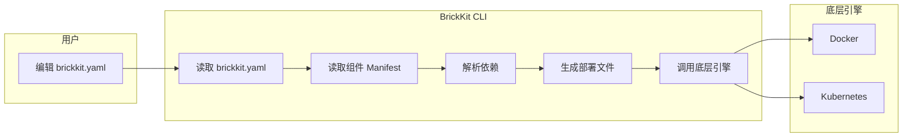

# 003 BrickKit 项目配置规范（brickkit.yaml）

## 文档信息

| 项目 | 内容 |
| --- | --- |
| 文档编号 | 003 |
| 文档名称 | 项目配置规范（brickkit.yaml） |
| 所属篇章 | 第三篇：项目配置 |
| 版本 | 1.9.0 |
| 最后更新 | 2026-08-23 |
| 状态 | 定稿 |
| 依赖文档 | 001 平台理念与总体架构、002 组件规范、004 BrickKit CLI 设计 |
| 被依赖文档 | 005 部署与运行规范、006 基础资源规范、009 组件开发快速入门、011 组件安装与拼装指南 |

---

## 1. brickkit.yaml 定位

### 1.1 一句话定义

`brickkit.yaml` 是 BrickKit 项目的声明式配置文件。它描述"我想要什么"，CLI 负责"怎么实现"。

### 1.2 核心原则

| 原则 | 说明 |
| --- | --- |
| 声明式 | 描述期望状态，不描述操作步骤 |
| 单一文件 | 一个项目一个 brickkit.yaml，所有配置集中管理 |
| 可版本控制 | 建议提交到 Git，团队共享 |
| 幂等 | CLI 每次执行都从 brickkit.yaml 读取，重复执行结果一致 |
| 不含敏感信息 | 密码、Token 通过环境变量引用，不硬编码 |
| brickkit.yaml 就是声明 | 写了几个版本就启动几个容器；写了 `enabled` 就按你说的来，没写就跟着上层走（§4.3） |

### 1.3 brickkit.yaml 与 CLI 的关系



CLI 是无状态的。它不持有运行时状态。每次执行命令时：

1. 读取 brickkit.yaml（期望状态）
2. 查询底层引擎（实际状态）
3. 计算差异
4. 执行变更

### 1.4 brickkit.yaml 的位置

```
my-project/
├── brickkit.yaml          ← 项目配置文件（本文件）
├── .brickkit/
│   ├── manifests/         ← Manifest 缓存
│   ├── artifacts/         ← API 契约及其他产物缓存
│   │   ├── department-tree-1-0-0/
│   │   │   ├── api-contract/
│   │   │   │   └── proto/department/v1/department.proto
│   │   │   └── api-docs/
│   │   │       └── openapi.json
│   │   ├── people-basic-1-0-0/
│   │   │   └── api-docs/
│   │   │       └── openapi.json
│   │   └── authorization-rbac-1-0-0/
│   │       ├── api-contract/
│   │       │   └── proto/authorization/v1/rbac.proto
│   │       └── api-docs/
│   │           └── openapi.json
│   ├── credentials        ← 登录凭据（brickkit login 生成）
│   └── generated/         ← 生成的部署文件
├── components/            ← 组件源码目录
│   ├── people/
│   │   └── basic/         ← 活跃组件源码（自己开发的或通过 --repo clone 的）
│   │       ├── .git/
│   │       ├── component.yaml
│   │       └── app.py
│   ├── department/
│   │   └── tree/
│   │       ├── .git/
│   │       ├── component.yaml
│   │       └── main.go
│   └── .archived/         ← 归档目录（brickkit sync 自动管理，隐藏）
│       ├── authorization/
│       │   └── rbac/      ← 被归档的组件（完整 Git 仓库）
│       └── infra/
│           └── redis-event-bus/
└── .gitignore
```

**components/ 目录说明：**

| 目录 | 说明 |
|---|---|
| `components/<scope>/<name>/` | 活跃组件源码。自己开发的组件或通过 `brickkit add --repo` clone 的组件 |
| `components/.archived/` | 归档目录。`brickkit sync` 把这次不启动的组件源码移入此目录。以 `.` 开头，文件管理器默认隐藏 |

**关键规则：**
- 每个组件是独立的 Git 仓库（有自己的 `.git` 目录）
- `components/` 目录不提交到项目 Git 仓库（见 §11 `.gitignore` 建议）
- `brickkit sync` 是双向的：该归档的归档，该激活的移回来；判据与 `brickkit up` 完全一致
- 归档只改变"看不看得见"，不改变"取不取得到"：本地安装源按组件 ID 查找时会回落到归档目录（004 §3.9），否则归档过的组件会让 `up` 与 `sync` 双双失败
- 一个组件 ID 在 `components/` 下只能有一个源码目录

---

## 2. 完整结构

```yaml
# brickkit.yaml - BrickKit 项目配置
# 由 brickkit init 生成，由用户编辑，由 CLI 读取

# ===== 项目基本信息 =====
project: my-erp-project

# ===== 部署目标 =====
deploy:
  target: docker          # docker | k8s

# ===== 安装源 =====
sources:
  - id: brickkit-market
    type: market
    url: https://market.brickkit.io/api/v1
    authToken: ${MARKET_TOKEN}    # 可选。如果已执行 brickkit login，CLI 优先使用登录态
    enabled: true

  - id: local-dev
    type: local
    path: ./components
    enabled: true

# ===== 组件列表 =====
components:
  - id: department/tree
    version: 1.0.0
    # 没写 enabled → 跟着上层走（§4.3）

  - id: people/basic
    version: 1.0.0
    # 没写 enabled → 跟着上层走（§4.3）
    local: true
    localPort: 8081
    resources:                  # 可选，覆盖组件 Manifest 中的推荐资源配额
      limits:
        memory: "1Gi"           # 生产环境调大内存

  - id: authorization/rbac
    version: 1.0.0
    enabled: true               # ← 一定跑，不看上层

  - id: erp/backend
    version: 1.0.0
    # 没写 enabled → 跟着上层走（§4.3）
    config:
      sessionTtlSeconds: 7200

  - id: infra/redis-event-bus
    version: 1.0.0
    enabled: false              # ← 显式关闭

  - id: portal/user-frontend
    version: 1.0.0
    # 没写 enabled → 跟着上层走（§4.3）
    expose: true
    hostname: portal.example.com    # K8s 必须，Docker 可省略
    exposePort: 8080                # Docker 环境：自定义宿主机映射端口（可选）

# ===== 资源声明与绑定 =====
resources:
  - kind: database
    engine: postgresql
    id: postgres-main
    host: host.docker.internal
    port: 5432
    username: dev
    password: ${POSTGRES_PASSWORD}
    bindings:
      - componentId: department/tree
        database: department
      - componentId: people/basic
        database: people
      - componentId: authorization/rbac
        database: authorization

  - kind: cache
    engine: redis
    id: redis-main
    host: host.docker.internal
    port: 6379
    password: ${REDIS_PASSWORD}
    bindings:
      - componentId: authorization/rbac
      - componentId: infra/redis-event-bus

# ===== 安装器配置 =====
installer:
  requireSignature: false    # 本地开发关闭签名校验
```

---

## 3. 字段说明

### 3.1 project（必须）

| 字段 | 类型 | 必须 | 说明 |
| --- | --- | --- | --- |
| project | string | ✅ | 项目名称，用于标识和隔离 |

```yaml
project: my-erp-project
```

规则：

- 全部小写
- 只能包含字母、数字、中划线
- 不得包含空格
- 用于 K8s namespace 命名（如 `brickkit-my-erp-project`）
- 用于 Docker Network 命名（如 `brickkit-my-erp-project-net`）

### 3.2 deploy（必须）

| 字段 | 类型 | 必须 | 说明 |
| --- | --- | --- | --- |
| deploy.target | string | ✅ | 部署目标：`docker` 或 `k8s` |
| deploy.context | string |  | **仅 K8s**。钉住 kubeconfig 上下文（005 §5.5.2）。不写就用 kubectl 当前的 context——切走了忘记切回来，一份写着生产的配置会被安静地部到预发 |
| deploy.namespace | string |  | **仅 K8s**。覆盖默认的 `brickkit-<项目名>`（005 §5.2）。很多组织的命名空间名是他们定的，而且只给你这一个的权限 |
| deploy.createNamespace | boolean |  | **仅 K8s**，默认 true。置 false 时既不生成也不 apply namespace.yaml——只有命名空间级权限时，建命名空间会 Forbidden |
| deploy.podSecurity | string |  | **仅 K8s**。目前只支持 `restricted`（005 §5.5.2）。默认不生成 securityContext：加了可能让本来跑得好好的组件起不来 |
| deploy.imagePullSecrets | string[] |  | **仅 K8s**。拉私有镜像用的 Secret 名 |
| deploy.ingressClass | string |  | **仅 K8s**。写进 Ingress 的 `ingressClassName`（005 §5.5）。不写时，没有默认 class 的集群上会 apply 成功而域名打不开 |
| deploy.ingressAnnotations | map |  | **仅 K8s**。原样透传到 Ingress（cert-manager、nginx 参数等）。平台不认识它们，也不该认识 |
| deploy.serviceAccount | object |  | **仅 K8s**。`enabled: true` 时每个组件一个不挂载令牌的 SA（005 §5.13.3） |
| deploy.networkPolicy | object |  | **仅 K8s**。按依赖图生成网络策略（005 §5.13）。字段较多，完整结构见附录 D.1 |

> **`deploy` 下除 `target` 外全部只对 K8s 生效。** Docker 目标下写了它们，
> CLI 会提醒"本次被忽略"——不提醒的话，使用者会以为配置生效了而行为没变。

#### 这条规矩两个方向都守，组件级字段也在内

不只是 `deploy.*`，也不只是 Docker 目标：

| 当前目标 | 会被提醒"本次忽略"的 |
| --- | --- |
| `docker` | `deploy.*`（除 `target`）+ 组件的 `replicas` / `hostname` / `tlsSecret` / `serviceAccountName` |
| `k8s` | 组件的 `exposePort`（K8s 走 Ingress + 域名路由，不映射宿主机端口，§4.5） |

`local` / `localPort` **不在此列**：K8s 目标下它们是**报错**，不是提醒。跳过的后果是依赖方拿到一个指向不存在 Service 的地址，表现成随机的连接超时（005 §5.3.1）——那与"这一行没生效"不是一回事。

提醒按**字段**归集，不按组件：

```
⚠️ 配置里有只对 K8s 生效的字段
   字段：components[].replicas（4 个组件：demo/c1、demo/c2、demo/c3、demo/c4）
   字段：components[].hostname（4 个组件：demo/c1、demo/c2、demo/c3、demo/c4）
   当前目标：deploy.target: docker
```

同一件事按组件说 N 遍会把警告区刷满——20 个组件各写两个字段就是 40 行。而使用者一旦开始整块跳过警告，真正要紧的那几条（配置项不生效、弱依赖缺失）也会一起被跳过。

⚠️ **打开 `networkPolicy` 之前先确认集群有能执行它的 CNI。** 没有的话，
整个功能是**无声失效**的：`kubectl apply` 成功、`kubectl get networkpolicy`
看得见、流量完全不受影响、**没有任何警告**。也就是说所有现象都指向"策略生效了"，
而实际一条也没生效——minikube / kind 的**默认** CNI 就属于这一类。

```bash
kubectl get pods -n kube-system | grep -Ei 'calico|cilium|antrea|weave|kube-router'
```

什么都没有就说明不执行。CLI **不代为检查**：K8s 没有任何 API 能回答
"本集群是否执行 NetworkPolicy"，靠 grep 去猜会在托管集群（CNI 跑在控制面、
用户看不见）上误报"不支持"，把本来正确的部署拦下来。唯一可靠的验证是
**真的连一次**看通不通，见 005 §5.13.0 与试用指南 18.3。

```yaml
deploy:
  target: docker    # 本地开发
```

```yaml
deploy:
  target: k8s       # 生产部署
```

影响：

- `docker`：CLI 生成 docker-compose.yaml，调用 `docker compose`（Podman 见 005 §7）
- `k8s`：CLI 生成 K8s YAML（Deployment + Service + Ingress + Job），调用 `kubectl apply`

### 3.3 sources（可选）

安装源是 CLI 获取组件的入口。详见第 6 章。

```yaml
sources:
  - id: brickkit-market
    type: market
    url: https://market.brickkit.io/api/v1
    authToken: ${MARKET_TOKEN}
    enabled: true
```

### 3.4 components（必须）

组件列表。详见第 4 章。

```yaml
components:
  - id: people/basic
    version: 1.0.0
    enabled: true
```

### 3.5 resources（可选）

资源声明与绑定。详见第 5 章。

```yaml
resources:
  - kind: database
    engine: postgresql
    id: postgres-main
    host: host.docker.internal
    port: 5432
```

### 3.6 installer（可选）

安装器行为配置。

```yaml
installer:
  requireSignature: true
  publicKeys:
    # 签名里的 publicKeyRef  →  公钥文件路径（相对项目根目录）
    keys/people-basic-release.pub: keys/people-basic-release.pub
    keys/vendor-release.pub: /etc/brickkit/vendor-release.pub
```

| 字段 | 类型 | 默认值 | 说明 |
| --- | --- | --- | --- |
| requireSignature | boolean | true | 是否强制签名校验 |
| publicKeys | map | 空 | 项目信任的发布者公钥：`publicKeyRef` → 公钥文件路径 |

**公钥为什么必须配在这里，而不是跟着签名从市场取。**

签名信息（008 §8.3）里只有 `publicKeyRef` 这个**名字**，没有密钥材料。谁来解析这个名字，决定了整套签名机制有没有意义：

| 公钥来自 | 结果 |
| --- | --- |
| 市场 | 市场自己给自己发证。市场被攻破 → 攻击者把组件和公钥一起换掉 → 验签通过 → 签名等于没有 |
| **项目配置（本字段）** | 信任锚点在使用者手里，跟着 `brickkit.yaml` 进 Git，变更有评审记录 |

008 §14.1 把"市场被攻破"的应对写成"签名校验"，只有在后者成立时这句话才是真的。所以 CLI 只认这里配的公钥，**找不到就是校验失败，绝不回退到"那就从市场拿一个"**。

公钥不是密钥，应当提交进 Git。私钥（`cosign.key`）绝不能提交。

**没配 `publicKeys` 不是配置错误。** `requireSignature` 默认为 `true`，若在解析配置时就要求必须配公钥，所有还没用上签名的项目连 `brickkit status` 都跑不起来。拦截发生在安装时——那里才说得清是哪个组件、该怎么办。

相对路径以**项目根目录**为基准，不是当前工作目录：否则同一份配置在 `components/` 子目录下执行会找不到公钥。

---

## 4. 组件配置详解

### 4.1 组件条目结构

```yaml
components:
  - id: people/basic          # 组件 ID（必须）
    version: 1.0.0            # 精确版本（必须）
    enabled: true             # 可选。不写 = 跟着上层走；true = 一定跑；false = 一定不跑
    local: false              # 是否本地调试（可选，默认 false）
    localPort: 8081           # 本地调试端口（可选，默认用组件的 deployment.port）
    expose: false             # 是否暴露到外部（可选，默认 false）
    hostname: ""              # 外部访问域名（expose: true 且 K8s 环境时必须；Docker 可省略）
    exposePort: 0             # Docker 环境自定义宿主机映射端口（可选，默认使用 deployment.port）
    tlsSecret: ""             # Ingress 用的 TLS 证书 Secret 名（可选，仅 K8s + expose: true）
    serviceAccountName: ""    # 使用已存在的 ServiceAccount（可选，仅 K8s，见 005 §5.13.3）
    config: {}                # 配置覆盖（可选，覆盖 configSchema 默认值。CLI 不校验类型）
    resources: {}             # 资源配额覆盖（可选，覆盖 Manifest 中 deployment.resources）
    replicas: 1               # 副本数（可选，默认 1；**仅 K8s**，见 §4.10）
```

> `tlsSecret` 与 `serviceAccountName` 只在 K8s 环境有意义，语义见 005 §5.5 与 §5.13.3。
> 写了 `serviceAccountName` 时平台**只引用、不生成**那个 SA——
> 它通常绑着运维配好的云端授权，重新生成一份会安静地抹掉。

### 4.2 id 和 version（必须）

```yaml
- id: people/basic
  version: 1.0.0
```

| 字段 | 类型 | 必须 | 说明 |
| --- | --- | --- | --- |
| id | string | ✅ | 组件 ID，格式：`scope/name` |
| version | string | ✅ | 精确版本（如 `1.0.0`，不接受 `^1.0.0`） |

规则：

- 版本必须是精确的
- 同一组件可以出现多次（不同版本），实现多版本共存（默认行为，无需额外参数）

### 4.3 enabled（跟着上层走）

`enabled` 回答一个问题：**这个组件跑不跑。**

| 写法 | 含义 |
| --- | --- |
| 不写 `enabled` | 由平台判断（下面这一条规则） |
| `enabled: true` | **一定跑**，不看上层 |
| `enabled: false` | **一定不跑** |

不写时的判断规则只有一句：

> **跟着上层走。** 顶层组件默认跑；下层组件只要还有一个上层在跑，它就跑。

"上层"就是**依赖它的组件**。"顶层组件"就是**没有任何组件依赖它的组件**——
通常是前端、连接组件，或者你单独装来用的那个。

⚠️ **强依赖与弱依赖在这件事上一视同仁。** 上层弱依赖它，它照样跟着跑。
`optional: true` 管的是另外两件事，见本节末尾。

#### 怎么一眼找到顶层组件

不用自己看依赖图，`brickkit up`（含 `--dry-run`）的状态一览里就标着：

```
📋 组件状态计算：
   ✅ demo/hello@1.0.0             启动（demo/caller 需要）
   ✅ demo/caller@1.0.0            启动（顶层）
   ✅ department/tree@1.0.0        启动（people/basic 需要）
   ✅ infra/redis-event-bus@1.0.0  启动（people/basic 需要）
   ✅ people/basic@1.0.0           启动（顶层）
```

带"（顶层）"的那两行就是你的入口。要关掉一批组件时，动的应该是它们——
关一个顶层，它下面那一串跟着走。

**这个标记不写进 `brickkit.yaml`**：依赖关系一变它就过期，而一条过期的注释
正好落在使用者用来做决定的地方，比没有更糟。它每次都是现算的。

---

#### 例一：什么都不写 → 全跑

```yaml
components:
  - id: demo/hello
    version: 1.0.0
  - id: demo/caller        # 强依赖 demo/hello
    version: 1.0.0
  - id: department/tree
    version: 1.0.0
  - id: infra/redis-event-bus
    version: 1.0.0
  - id: people/basic       # 强依赖 department/tree，弱依赖 infra/redis-event-bus
    version: 1.0.0
```

五个全跑，就是上面那段输出。注意 `infra/redis-event-bus`——它**只被弱依赖指着**，
照样跟着 `people/basic` 起来。配置里写了它，那就是你的声明。

#### 例二：关掉一个顶层 → 它下面那一串跟着关

```yaml
  - id: people/basic
    version: 1.0.0
    enabled: false         # ← 只加这一行
```

```
📋 组件状态计算：
   ✅ demo/hello@1.0.0             启动（demo/caller 需要）
   ✅ demo/caller@1.0.0            启动（顶层）
   ⬜ department/tree@1.0.0        不启动（上层都不启动）
   ⬜ infra/redis-event-bus@1.0.0  不启动（上层都不启动）
   ⬜ people/basic@1.0.0           显式禁用（enabled: false）
```

**一行配置停一条链。** `department/tree` 与事件总线的唯一上层就是 `people/basic`，
它关了，它们也没有存在的意义。

而 `demo/hello` 与 `demo/caller` **毫发无伤**——它们不在这条链上。
传播只沿依赖走，不会波及无关的组件。

#### 例三：被两个上层共用 → 只要还有一个开着就跑

```yaml
  - id: erp/backend        # 强依赖 people/basic
    version: 1.0.0
    enabled: false         # ← 关掉
  - id: portal/web         # 弱依赖 people/basic
    version: 1.0.0
  - id: people/basic
    version: 1.0.0
```

`people/basic` 照跑——`portal/web` 还开着，而且弱依赖也算数。
只有当**所有**上层都不跑时它才跟着停。

#### 例四：想单独跑一个下层组件 → 写 `enabled: true`

```yaml
  - id: people/basic
    version: 1.0.0
    enabled: false
  - id: department/tree
    version: 1.0.0
    enabled: true          # ← 我就是要它跑
```

`department/tree` 照跑，不看上层。这就是"写了 `enabled` 就按你说的来"。

#### 例五：关掉一个被**强**依赖的组件 → 报错

平台不会替你把依赖方也关掉——那是一次隐式决定，而依赖方没跑的线索
只有输出里一闪而过的一行。等你发现，线索已经断了。

```yaml
  - id: department/tree
    version: 1.0.0
    enabled: false
  - id: people/basic       # 强依赖 department/tree
    version: 1.0.0
    enabled: true          # ← 你说了它必须跑
```

```
❌ 错误：强依赖 department/tree 被禁用
   组件：people/basic@1.0.0（enabled: true，已钉住）
   依赖链：people/basic → department/tree
   被禁用的组件：department/tree@1.0.0
   建议：
   1. 在 brickkit.yaml 中移除 department/tree 的 enabled: false
   2. 或去掉 people/basic 的 enabled: true，让它随上层一起不启动
```

**报不报错的分界，就在你有没有说过"这个必须跑"：**

| `people/basic` 怎么写 | 结果 |
| --- | --- |
| `enabled: true`（钉住） | ❌ 报错——两个意图直接冲突 |
| 不写 | ⬜ 跟着不跑，不报错。这是"我关掉了一整条链"的正常操作 |

**弱依赖不在此列。** 关掉一个只被弱依赖指着的组件完全正常：调用方拿不到
`*_ENDPOINT`，按 002 §3.4 自行降级，`up` 只警告一句。

#### 例六：环上的组件互为上层，都跑

两个组件互相**弱**依赖（通知组件可选地调审计、审计可选地调通知）时，
谁都不是顶层——但环上没有更上层，它们互为上层，**两个都跑**。

```
📋 组件状态计算：
   ✅ infra/notifier@1.0.0  启动（infra/audit 需要）
   ✅ infra/audit@1.0.0     启动（infra/notifier 需要）
```

关掉其中一个，另一个跟着停（它唯一的上层没了）。

> 全是**强**依赖的环仍然报错——那是启动顺序真的无解。带弱边的环不约束顺序，
> 所以合法（004 §4.3）。

---

#### `optional: true` 管的不是"跑不跑"

| 时机 | 弱依赖的行为 |
| --- | --- |
| 解析期取不到它 | ⚠️ 警告，继续（强依赖取不到是 ❌ 阻断） |
| 它没在跑时 | 不注入 `*_ENDPOINT`，让调用方自己降级（002 §3.4） |
| **它跑不跑** | **与强依赖一视同仁：跟着上层走** |

> **第三行曾经不是这样。** 早先"只被弱依赖引用的组件不会被自动拉起"，
> 要它跑得显式写 `enabled: true`。已删除。
>
> 那条规则与"brickkit.yaml 就是声明"（012 §2.3：写了就启动）直接冲突，
> 而 `brickkit add` 恰恰会把**整棵依赖树**（含弱依赖）写进配置——于是出现了
> "配置里有它、`up` 却不起它，这是正常现象"这种要专门写一节去解释的局面。
>
> 当初的理由是"自动启动等于把可选悄悄变成必启"。这句话站不住：起来了也不等于
> 必启，调用方照样会在它挂掉时降级。而真正的代价是**发现性**——一堆功能默认
> 关着，使用者装了组件却发现一半是哑的，而他得先知道这条规则，才想得到去翻配置。
> 反过来（默认全开、嫌重再关）失败方式温和得多：多几个容器，`docker ps` 里
> 看得见，写一行 `enabled: false` 就没了。
>
> `up --dry-run` 还会专门列出只被弱依赖引用的那些——那就是可以下手的名单：
>
> ```
> 只被弱依赖引用（关掉不影响别人：enabled: false）：infra/redis-event-bus
> ```

#### 一个都不跑的时候

顶层全关了，就什么都不跑。`up` 会说清楚是哪一种情况：

```
📋 本次没有组件会启动
   顶层组件都被关掉了；移除它们的 enabled: false 即可（003 §4.3）
```

如果**图里根本没有顶层组件**（每个组件都被别的组件依赖着，只可能是弱依赖成环），
说辞不一样——那时"跟着上层走"解释不了任何事，上层是谁？没有上层：

```
📋 本次没有组件会启动
   没有找到顶层组件——每个组件都被别的组件依赖着（依赖成了环）
   给你想跑的那个写 enabled: true
```

#### 关键规则

- `brickkit add` 自动添加的组件**不写** `enabled` 字段——交给平台判断就好
- 只有 `enabled: false` 与 `enabled: true` 才是你的显式意图
- 关掉一个组件只影响它下面那条链，不波及无关组件
- 关掉一个被**强**依赖、而依赖方又被钉住的组件 → 报错，两条出路都给出来
- 想让源码目录也跟着收拢，`brickkit sync` 用的是**同一套判定**（004 §3.9）

### 4.4 local（本地调试）

```yaml
- id: people/basic
  version: 1.0.0
  local: true       # 本地调试模式
  localPort: 8081   # 本地监听端口
```

| 字段 | 类型 | 默认值 | 说明 |
| --- | --- | --- | --- |
| local | boolean | false | 是否本地调试模式 |
| localPort | integer | 组件的 `deployment.port` | 你的进程在宿主机上监听哪个端口。不写就取组件自己声明的那个数（见下） |

**不写 `localPort` 时取的是组件的 `deployment.port`，不是随便挑一个空闲端口。**

理由很实在：进程在容器里监听的就是它，搬到 IDE 里跑的还是同一份代码，
监听的当然还是它。从 8081 起随便分配的话，依赖方照着连过去只会拿到
connection refused——真跑起来验过，调用方稳定 503。

只有一种情况会另挑：那个端口在本机**已经被本项目的别的映射占了**
（另一个 local 组件、或某个 `expose` 的宿主机端口）。这时才从 8081 起递增，
而且 `brickkit up` 会把最终用的端口打印出来。

行为：

- `local: true` 的组件不生成容器
- CLI 在其他容器的 `extra_hosts` 中将该组件的服务名映射到宿主机
- 环境变量中的端口改为 `localPort`
- 开发者在 IDE 中以源码模式运行该组件，debugger 直接 attach
- CLI 为 local 组件的依赖组件自动映射端口到宿主机（见下方"依赖端口映射"）
- CLI 生成 `.brickkit/generated/local-debug.env` 文件，供 IDE 加载（见下方"local-debug.env"）

⚠️ **`local: true` 只能配 `deploy.target: docker`。** 它的语义是"该组件跑在开发者的 IDE 里，其他组件通过宿主机地址访问它"，而 K8s 集群里的 Pod 连不到开发者的笔记本。`deploy.target: k8s` 时 CLI 直接报错，不会悄悄跳过——跳过的后果是依赖方拿到一个指向不存在 Service 的地址，表现成随机的连接超时（005 §5.3.1）。

**多组件同时调试：**

```yaml
components:
  - id: people/basic
    version: 1.0.0
    local: true
    localPort: 8081

  - id: department/tree
    version: 1.0.0
    local: true
    localPort: 8082

  - id: erp/backend
    version: 1.0.0
    local: false    # 正常 Docker 模式
```

**端口分配规则：**

| 场景 | 端口来源 |
| --- | --- |
| 用户指定 `localPort` | 使用用户指定的端口（让进程真的监听它是开发者自己的责任） |
| 用户未指定 `localPort` | **默认取组件自己声明的 `deployment.port`**；该端口在宿主机上已被别人占用时，从 8081 起递增另选 |
| 两处写死了同一个宿主机端口 | CLI 报错并提示更换端口 |

⚠️ 平台**不注入"我该监听哪个端口"**——环境变量里只有"别人在哪"。所以 `localPort` 的默认值必须是组件自己声明的端口，否则依赖方会连到一个没人监听的端口上（详见 005 §4.6）。

**本地调试限制：**

| 限制 | 说明 |
| --- | --- |
| 闭源组件不支持 | 没有源码，无法在 IDE 中运行 |
| 需要 Docker 20.10+ | `host-gateway` 需要 Docker 20.10+ |

**local 组件的依赖端口映射：**

当组件标记为 `local: true` 时，该组件在宿主机上运行（IDE 中），需要访问 Docker 容器内的依赖组件。CLI 自动处理这个方向的访问：

| 场景 | CLI 行为 |
| --- | --- |
| 依赖组件已有 `expose: true` + `exposePort` | **主端口**用已有的映射；额外端口 expose 不管，照常单独映射 |
| 依赖组件没有 `expose` | CLI 自动分配宿主机端口（优先 `10000 + 容器端口`，被占用时从 18080 起递增） |
| 端口冲突 | CLI 报错并提示 |

示例：

```yaml
components:
  - id: people/basic
    version: 1.0.0
    local: true
    localPort: 8081

  - id: department/tree
    version: 1.0.0
    local: false    # 在 Docker 中运行
```

CLI 行为：

- `department/tree` 在 Docker 中运行，CLI 自动为其映射宿主机端口（如 18080）
- 生成 `local-debug.env`，其中 `DEPARTMENT_TREE_ENDPOINT=http://localhost:18080`
- `people/basic` 在 IDE 中运行时，通过 `localhost:18080` 访问 `department/tree`

**local-debug.env：**

当项目中存在 `local: true` 的组件时，CLI 在 `brickkit up` 时自动生成 `.brickkit/generated/local-debug.env` 文件：

```
# .brickkit/generated/local-debug.env
# 由 BrickKit CLI 自动生成，供 IDE 加载
# 组件：people/basic@1.0.0（local: true）

COMPONENT_ID=people/basic
COMPONENT_VERSION=1.0.0
DATABASE_HOST=localhost
DATABASE_PORT=5432
DATABASE_NAME=people
DATABASE_USER=people_user
DATABASE_PASSWORD=s3cret-from-dotenv     # ← 生成时已求值，不是占位符

# 依赖地址指向 localhost（因为依赖组件已映射端口到宿主机）
DEPARTMENT_TREE_ENDPOINT=http://localhost:18080
```

> ⚠️ **这份文件里的 `${VAR}` 在生成时就已求值，写进去的是真实值。**
> 它是给 IDE 读的（VS Code 的 `envFile`、IntelliJ 的 EnvFile 插件），
> **这两者都不做变量替换**——留着占位符，IDE 里的进程就会拿着字面量
> `${PEOPLE_DB_PASSWORD}` 去连库，认证失败，而使用者的 `.env` 明明写着密码。
> 与 `docker-compose.yaml` **刻意相反**（那份由 compose 自己替换，所以保留占位符）。
> 判据是"谁不做替换，就在生成时替换给谁"，完整对照见 005 §4.9。
> 文件权限 `0600`；求不出值的变量原样保留占位符，不阻断 `up`。

**IDE 中的使用方式：**

| IDE | 配置方式 |
| --- | --- |
| VS Code | `launch.json` 中配置 `envFile: ".brickkit/generated/local-debug.env"` |
| IntelliJ / GoLand | Run Configuration → Environment Variables → 导入 `.env` 文件 |
| 命令行 | `source .brickkit/generated/local-debug.env && python app.py` |

**多版本共存时的 local-debug.env 命名：**

如果项目中有多个 `local: true` 的组件（包括同一组件 ID 的不同版本），为每个组件生成独立的 `local-debug.env`，使用版本化服务名命名：

```
.brickkit/generated/
  ├── local-debug.people-basic-1-0-0.env      # people/basic@1.0.0
  ├── local-debug.people-basic-2-0-0.env      # people/basic@2.0.0（多版本共存）
  └── local-debug.department-tree-1-0-0.env   # department/tree@1.0.0
```

### 4.5 expose（外部暴露）

```yaml
- id: portal/user-frontend
  version: 1.0.0
  expose: true
  hostname: portal.example.com    # K8s 必须，Docker 可省略
  exposePort: 8080                # Docker 环境：自定义宿主机映射端口（可选）
```

| 字段 | 类型 | 默认值 | 说明 |
| --- | --- | --- | --- |
| expose | boolean | false | 是否暴露到外部 |
| hostname | string | — | 外部访问域名。仅 `deploy.target: k8s` 时必须（Ingress 需要域名）；Docker 环境可省略 |
| exposePort | integer | — | Docker 环境自定义宿主机映射端口（可选）。默认使用 Manifest 中 `deployment.port`。**仅 Docker 环境生效，K8s 环境忽略** |

行为：

| 环境 | `expose: false`（默认） | `expose: true` |
| --- | --- | --- |
| Docker | 不映射端口，只在 Docker Network 内可达 | 映射端口到宿主机（默认使用 Manifest 中 `deployment.port`，可通过 `exposePort` 自定义） |
| K8s | 不生成 Ingress，只在集群内可达 | 生成 Ingress YAML（基于 `hostname` 域名路由） |

**安全默认：** 不声明 `expose: true` 就不暴露。

**Docker 环境端口冲突处理：**

如果多个组件同时 `expose: true` 且宿主机端口相同，CLI 报错阻断：

```
❌ 端口冲突：
   portal/user-frontend（expose: true → 宿主机端口 80）
   portal/admin-frontend（expose: true → 宿主机端口 80）
   两个组件映射到同一个宿主机端口。

   建议：在 brickkit.yaml 中为其中一个组件添加 exposePort 字段。
   示例：
     - id: portal/admin-frontend
       expose: true
       exposePort: 8080    # ← 自定义宿主机端口
```

**K8s 环境无端口冲突：** K8s 使用 Ingress + 域名路由，两个组件可以共用同一个端口（如 80），只要 `hostname` 不同（如 `portal.example.com` vs `admin.example.com`）就不冲突。因此 K8s 环境不需要 `exposePort` 字段。

**Docker 环境 `expose: true` 的生成结果：**

```yaml
# CLI 生成的 docker-compose.yaml 中

# 未填 exposePort（默认使用 deployment.port）
portal-user-frontend-1-0-0:
  image: registry.brickkit.io/portal-user-frontend:1.0.0
  ports:
    - "80:80"    # 映射到宿主机，浏览器可访问 http://localhost:80

# 填了 exposePort: 8080
portal-user-frontend-1-0-0:
  image: registry.brickkit.io/portal-user-frontend:1.0.0
  ports:
    - "8080:80"    # 宿主机端口 8080，容器端口 80
```

**K8s 环境 `expose: true` 的生成结果：**

```yaml
# CLI 自动生成
 apiVersion: networking.k8s.io/v1
 kind: Ingress
 metadata:
   name: portal-user-frontend-1-0-0
   namespace: brickkit-my-erp-project
 spec:
   rules:
     - host: portal.example.com    # ← 来自 hostname 字段
       http:
         paths:
           - path: /
             pathType: Prefix
             backend:
               service:
                 name: portal-user-frontend-1-0-0
                 port:
                   number: 80
```

### 4.6 config（配置覆盖）

```yaml
- id: erp/backend
  version: 1.0.0
  config:
    sessionTtlSeconds: 7200
    enableAudit: false
```

| 字段 | 类型 | 默认值 | 说明 |
| --- | --- | --- | --- |
| config | object | {} | 覆盖 configSchema 中的默认值 |

行为：

1. CLI 读取组件 Manifest 中的 `configSchema`，获取所有配置项的默认值
2. 用 brickkit.yaml 中 `config` 字段的值覆盖对应项
3. 将最终值转为环境变量注入（驼峰转大写下划线）

示例：

Manifest 中声明：

```yaml
configSchema:
  properties:
    sessionTtlSeconds:
      type: integer
      default: 3600
    enableAudit:
      type: boolean
      default: true
```

brickkit.yaml 中覆盖：

```yaml
components:
  - id: erp/backend
    version: 1.0.0
    config:
      sessionTtlSeconds: 7200
      enableAudit: false
```

CLI 注入的环境变量：

```
SESSION_TTL_SECONDS=7200
ENABLE_AUDIT=false
```

未被覆盖的配置项使用 configSchema 中的默认值。

**重要：CLI 不校验 config 值的类型。** configSchema 是"配置说明书"，不是"安检机"。CLI 不基于 configSchema 对使用者填写的 config 值做运行时类型校验。如果使用者填错类型（如把 integer 写成字符串），CLI 原样注入，由此导致的组件运行异常由使用者自行承担。

**⚠️ 但键名写错会警告。** 不校验的是**值**，不是**键名**：这里写了一个组件 configSchema 中没有的配置项时，`brickkit up` 会警告并猜出你想写的那个（`greetting` → 是不是想写 `greeting`？）。组件根本没声明 configSchema 时，整块 `config` 都不会生效，同样警告。

两者的区别在于**有没有运行时兜底**：类型填错了组件会崩，你一定会发现；键名填错了变量根本不出现，组件用它自己的默认值继续跑——不崩、不报警，只是没按你配的来。完整理由见 002 §6.5。警告不阻断 `up`。

**⚠️ 保留变量保护：**

config 字段中的配置项名称不得与平台保留变量冲突（转大写后匹配）。如果冲突，CLI 警告但跳过该配置项，平台注入的值优先。

保留变量列表见附录 C.6。冲突示例：

- `departmentTreeEndpoint` → `DEPARTMENT_TREE_ENDPOINT` → 与 `*_ENDPOINT` 冲突 ❌
- `componentId` → `COMPONENT_ID` → 与 `COMPONENT_ID` 冲突 ❌
- `databaseHost` → `DATABASE_HOST` → 与 `DATABASE_*` 冲突 ❌
- `customPageSize` → `CUSTOM_PAGE_SIZE` → 无冲突 ✅

**config 与 `.env` 的职责分离：**

| 配置类型 | 存放位置 | 示例 |
| --- | --- | --- |
| 业务配置 | brickkit.yaml → `config` 字段 | defaultPageSize: 50 |
| 密钥/密码 | `.env` 文件（Docker）/ K8s Secret（生产） | DATABASE_PASSWORD=xxx |

### 4.7 resources（资源配额覆盖）

```yaml
- id: people/basic
  version: 1.0.0
  resources:                  # 覆盖组件 Manifest 中的推荐资源配额
    requests:
      cpu: "200m"
      memory: "256Mi"
    limits:
      cpu: "1000m"
      memory: "1Gi"
```

| 字段 | 类型 | 默认值 | 说明 |
| --- | --- | --- | --- |
| resources | object | {} | 覆盖 Manifest 中 `deployment.resources` 的推荐值 |

行为：

1. CLI 读取组件 Manifest 中的 `deployment.resources`（组件推荐值）
2. 读取 brickkit.yaml 中该组件的 `resources` 字段（使用者覆盖值）
3. 如果使用者覆盖了，使用覆盖值；否则使用组件推荐值
4. **都没写 `limits` 就不生成 `limits`**——平台不替人猜上限。`requests` 才有默认值（`100m` / `128Mi`）。完整理由与「CPU 不设上限、内存 requests = limits」的建议见 005 §2.5
5. 将最终值写入部署文件（Docker: `deploy.resources`; K8s: `resources`）

CLI 优先级链：`brickkit.yaml resources` > `component.yaml deployment.resources` > `CLI 默认值`

示例：

组件 Manifest 中声明推荐值：

```yaml
# component.yaml
deployment:
  type: container
  image: registry.brickkit.io/people-basic:1.0.0
  port: 8080
  resources:
    requests:
      cpu: "100m"
      memory: "128Mi"
    limits:
      cpu: "500m"
      memory: "512Mi"
```

brickkit.yaml 中覆盖（生产环境调大内存）：

```yaml
components:
  - id: people/basic
    version: 1.0.0
    resources:
      limits:
        memory: "1Gi"    # 覆盖组件推荐的 512Mi
```

最终注入 K8s 的值：

```yaml
resources:
  requests:
    cpu: 100m            # 来自 Manifest（未覆盖）
    memory: 128Mi        # 来自 Manifest（未覆盖）
  limits:
    cpu: 500m            # 来自 Manifest（未覆盖）
    memory: 1Gi          # 来自 brickkit.yaml（覆盖了 Manifest 的 512Mi）
```

**重要：CLI 不校验 resources 数值的合理性。** 资源配额是"推荐值"，不是"强制限制"。如果设置了不合理的 limits，可能导致组件频繁 OOMKilled，这是配置者的责任。

### 4.8 多版本共存

由于服务名带版本号，同一组件的不同版本可以同时存在：

```yaml
components:
  # v1 版本
  - id: people/basic
    version: 1.0.0
    # 没写 enabled → 默认开启

  # v2 版本（共存）
  - id: people/basic
    version: 2.0.0
    # 没写 enabled → 默认开启
```

生成的服务名：

- `people-basic-1-0-0`（v1）
- `people-basic-2-0-0`（v2）

调用方通过 Manifest 中的精确版本声明决定调哪个。

**多版本共存是默认行为。** brickkit.yaml 中写了几个版本，CLI 就启动几个容器，无需任何额外参数。

⚠️ **注意：** 多版本共存只是物理缓冲，不保证数据层兼容。涉及破坏性变更（删除字段等）时，必须遵循 002 组件规范第 3.7 节"破坏性变更（Major）协同守则"，由部门间协调同步升级。

---

### 4.9 跨项目共用组件：当成 API 调用

先分清两种情况，它们的答案完全不同。

#### 情况一：同一个项目里的共用基础设施 —— 什么都不用做

一个项目绝大多数时候会把自己需要的全部组件从头部署一遍，只给自己用。
所谓"共用的基础设施"（认证、通知、消息总线）在这里只是**被很多组件依赖的普通组件**，
拓扑排序自然会把它排在最前面。

```yaml
components:
  - id: infra/notifier      # 就是个普通组件
    version: 1.0.0
  - id: shop/order
    version: 1.0.0          # 它依赖 infra/notifier，平台自动注入地址
```

没有任何特殊字段。地址由平台注入为 `INFRA_NOTIFIER_ENDPOINT`，
Docker 与 K8s 下都是裸服务名，组件代码一个字都不用改。

#### 情况二：真的跨项目 —— 那就是在调别人的 API

**跨项目意味着不同的维护人员。** 同一个人维护的东西，他不会特意拆成两个项目；
真拆了，他自己清楚里面的门道。所以一旦出现跨项目引用，前提一定是：
两边各有负责人，双方商量好了要互通。

这时的关系和调用**任何第三方 API** 没有区别：

- 你只需要知道**它在哪**；
- 它有没有起来、什么时候升级、要不要扩容，是**对方负责人**的事；
- 它挂了，你的组件按自己的降级逻辑处理——就像市场 API 挂了一样。

**写法：组件把它声明成一个必填配置项，项目填上对方给的地址。**

组件侧（`component.yaml`）：

```yaml
configSchema:
  type: object
  properties:
    notifierBaseUrl:
      type: string
      description: 共用通知服务的地址，由部署它的那个项目提供
  required:
    - notifierBaseUrl        # 没有默认值 + required → 项目不填就 up 阻断
```

项目侧（`brickkit.yaml`）：

```yaml
components:
  - id: shop/order
    version: 1.0.0
    config:
      notifierBaseUrl: ${NOTIFIER_BASE_URL}    # 真值放 .env，或按环境用不同的配置文件
```

组件代码读 `NOTIFIER_BASE_URL`，**三个环境（本地 / Docker / K8s）里名字一模一样**，
和读任何其他配置项没有区别。

> **命名要避开 `*_ENDPOINT`**：那是平台注入依赖地址的保留模式（004 §5.6.1）。
> 用 `xxxBaseUrl` / `xxxAddr`。写成 `notifierEndpoint` 会被忽略并给出警告。

**为什么必须写 `required`：** 没有它，忘了填地址时那个环境变量根本不出现，
组件走进"未配置"分支——不崩、不报警，只是那一路调用永远走不通。
写了 `required` 且不给默认值，`up` 会当场拦下（004 §5.6.3）。

**地址由谁保证在各环境下一致：** 对方项目的负责人。这正是把它当 API 的含义——
他发布一个稳定入口（Ingress 域名 / 内网 DNS 名），像任何对外服务那样。
你这边不同环境要连不同实例时，用多环境配置（§9，`--config brickkit.prod.yaml`）。

#### 一个完整的例子：谁做什么

平台组维护通知服务 `infra/notifier`，订单组的订单系统要用它。

| 步骤 | 谁 | 做什么 |
| --- | --- | --- |
| 0 | 双方 | **先谈一次**：平台组给出接口契约（`.proto` / `openapi.json`）、一个各环境下稳定的入口地址、以及契约变更怎么通知 |
| 1 | 平台组 | 自己的项目里 `expose: true` + `hostname: notify.internal.corp`，`brickkit up`。从此对起停、升级、扩容、值班全权负责 |
| 2 | 组件作者 | `shop/order` 的 `configSchema` 里声明 `notifierBaseUrl`，写进 `required` |
| 3 | 订单组 | `brickkit.yaml` 里 `config.notifierBaseUrl: https://notify.internal.corp`，`brickkit up` |

**订单组的 `brickkit.yaml` 里没有 `infra/notifier` 这一行。** 它不是本项目的组件，
就像支付网关不是你的组件一样。

**这三件要谈的事，和接入一个外部支付网关要谈的完全一样。** 这就是重点：
跨项目共享不是平台的一个功能，它是一次普通的服务对接。

责任边界因此也一样清楚：

| 现象 | 谁的事 |
| --- | --- |
| 订单系统起不来 | 订单组。与通知服务无关——`up` 从不检查它在不在 |
| 起来了但调用失败 | 先看地址填对没有；对了就是平台组的事 |
| 通知服务挂了 | 平台组。订单组按自己的降级逻辑处理 |
| 契约对不上 | 平台组没按第 0 步通知。流程问题，不是平台问题 |

第一行是这套模型最要紧的一条：**平台组的服务挂着，订单组照样 `up`、照样开发、
照样跑测试。** 反过来的设计（对方没起来我就起不来）在删掉的 `external` 里
真实存在过——见下。

完整的两边演练见试用指南 19.4。

#### 契约文件（`.proto` / `openapi.json`）：`brickkit fetch`

跨项目的服务不在你的 `components` 里，所以 `brickkit add` 的那条路走不通——
它会把组件装进 `brickkit.yaml`，平台随即在你这边再部署一份。

用 `brickkit fetch`：**只下产物，不装组件**（004 §3.4）。

```bash
brickkit fetch infra/notifier@1.0.0     # 取指定版本
brickkit fetch infra/notifier           # 不写版本 = 安装源里的最新版
```

产物落到与 `add` 完全相同的位置：

```
.brickkit/artifacts/infra-notifier-1-0-0/
  api-contract/proto/notifier/v1/notifier.proto
  api-docs/openapi.json
```

它只读：不改 `brickkit.yaml`、不生成部署文件、不启动任何东西。

**为什么目录名带版本：** 平台在跨项目这条路上**不再替你检查版本**——
目录名就成了唯一记着"我的客户端是照 1.0.0 写的"的地方。
对方升到 1.1.0 时你 `fetch` 一次，新版本是一个**新目录**，`git diff` 里看得见；
就地覆盖的话，客户端代码悄悄按新契约重新生成，没有任何一处提示。

**这些文件默认跟着项目提交**（§11），团队里其他人 clone 下来就有。

##### 什么时候它帮不上忙

`fetch` 走的是你自己的安装源。**对方必须把组件发布到了你够得着的源**
（内部市场 / 你写在 `sources` 里的 git 仓库），否则它会报"组件未找到"。

那种情况下让对方直接发一份文件过来，**放进同一个位置**：

```
.brickkit/artifacts/<版本化服务名>/<type>/...
```

手工放与 `fetch` 下来的形状完全一致——只有一套约定要记。

> **别高估它的保证。** 产物文件**没有校验和**（`add` 也一样），
> 只有 Manifest 走签名策略（008 §8）。`fetch` 给的是"同一条源优先级链、
> 同一套签名策略、同一个目录命名"，不是内容完整性。

#### 环境变量叫什么：两种写法名字不同

同一个通知服务，写法不同，组件读到的变量名也不同：

| 那个服务在哪 | 怎么写 | 组件读的变量 | 值 |
| --- | --- | --- | --- |
| 本项目部署 | `dependencies.components: [infra/notifier@1.0.0]` | `INFRA_NOTIFIER_ENDPOINT` | `http://infra-notifier-1-0-0:8080`（平台推导） |
| 别的项目部署 | `configSchema` 里 `notifierBaseUrl` + `required` | `NOTIFIER_BASE_URL` | 项目在 `config:` 里填的那个（平台原样注入） |

名字不同不是疏漏，是**两件不同的事**：上面那个是平台推导出来的地址，
下面那个是你告诉平台的一个值。让它们同名反而会掩盖这个区别。

**命名约定：跨项目的配置项用 `<服务>BaseUrl`**（→ `<服务>_BASE_URL`）。
不要用 `xxxEndpoint`：`*_ENDPOINT` 是平台注入依赖地址的**保留后缀**
（004 §5.6.1），配置项命中它会被忽略并给出警告。

保留它是有理由的：如果配置项能生成 `INFRA_NOTIFIER_ENDPOINT`，
那么"平台推导的地址"与"使用者填的值"就会在同一个名字上打架，
而组件根本分不出自己拿到的是哪一个。

**一个组件想两种模式都支持**，可以把它声明成**弱依赖**再配一个配置项兜底：

```yaml
dependencies:
  components:
    - id: infra/notifier@1.0.0
      optional: true            # 本项目里有它就用，没有就走配置
configSchema:
  properties:
    notifierBaseUrl: {type: string}
```

组件先读 `INFRA_NOTIFIER_ENDPOINT`，读不到再读 `NOTIFIER_BASE_URL`。
本项目部署时两个都在（前者优先）；跨项目时只有后者，外加一行
"只被弱依赖引用（关掉不影响别人）"的说明。

**默认不建议这么写**：多数组件的定位是确定的，两种模式都撑着意味着
组件里多一段兜底逻辑、输出里多一行解释。只有真的要发布给不同项目、
而各家部署方式不一样时才值得。

#### 为什么不做成平台功能

早先有过一个 `external: {project: X}` 字段：声明之后组件照常进依赖图、
照常做版本检查、照常下载 artifacts，只是不生成它的部署对象。**已整个删除。**

它编码的其实是**相反的模型**——不是"调别人的 API"，是"共享别人的内部网络"：

| `external` 实际要求 | 而"调 API"只需要 |
| --- | --- |
| 对方的 `component.yaml` 得能从**我的**安装源解析出来 | 一个地址 |
| Docker 下对方没 `up`，**我起不来**（compose 拒绝引用不存在的网络） | 他挂了是他的事，我照常跑 |
| K8s 下钻进对方 namespace 走内部 DNS——必须同集群，且两边都要配 NetworkPolicy | 一个地址 |
| `local: true` 时注入的是容器内部名，IDE 里的进程解析不了 | 本地也照样能连 |

后两条在删除前是**真实存在的缺陷**，且都不报错：打开 `networkPolicy.egress` 后
到共享服务的调用会被策略静默丢弃（出站规则只覆盖本项目生成的组件），
而 `local: true` 的组件拿到的是一个宿主机上解析不了的名字。

它还带来九处散在各命令里的特例（`up` / `down` / `status` 的名单、
资源检查的跳过、K8s 清单的跳过、Docker 网络的接入……），每一处漏了都不会编译失败，
只会在某条命令上表现成一个奇怪的行为——`status` 与 `down` 都真的踩过。

**换来的是什么：** 版本兼容检查，以及 artifacts（`.proto` / `openapi.json`）自动下载。
前者其实是假保证——你检查的是**自己安装源里**那份 Manifest，
不是对方集群里真正在跑的版本。后者是真损失：现在要向对方要一份契约文件。
一次性的动作，换掉一个每天都在错的部署模型。


### 4.10 replicas（副本数，仅 K8s）

```yaml
components:
  - id: people/basic
    version: 1.0.0
    replicas: 3
```

不写就是 1。**只在 `deploy.target: k8s` 下生效**——Docker 目标下写了会收到提醒，
因为那里它完全不起作用，而 `up` 一切正常、`docker ps` 里只有一个容器，
使用者会以为是自己写错了字段名。

Service 自动负载均衡到所有副本，组件代码无感知（005 §5.8）。

#### 必须 >= 1

写 0 会报错，并指向 `enabled: false`。两者不是一回事：

| 写法 | 平台的行为 |
| --- | --- |
| `enabled: false` | 它下面那条链跟着不跑；被它强依赖、又被钉住的组件会报错（§4.3） |
| `replicas: 0` | 绕过这一切——依赖方照常启动、照常拿到地址，然后连一个不存在的后端 |

后者的表现是 503，而状态表里那个组件显示"正常"。

#### 与 `local` 互斥

`local` 是"这个组件在你的 IDE 里跑"，那里只有一个进程。

#### 多副本时自动生成 PodDisruptionBudget

副本数 > 1 时，平台为该组件生成一份 `maxUnavailable: 1` 的 PDB。
它保证节点排空（`kubectl drain`、集群升级）时不会把副本一次全部驱逐。

**单副本时坚决不生成**，这是实测得出的结论：单副本下 PDB 无论怎么写都是死路——
`minAvailable: 1` 让 `ALLOWED DISRUPTIONS` 恒为 0、节点永远排不空；
`maxUnavailable: 1` 又允许唯一那个副本随时被驱逐，等于没写。

用 `maxUnavailable` 而不是 `minAvailable`，是因为前者**随副本数自动成立**：
把 3 改成 5 时不用回来改 PDB。

副本数从多副本改回 1 时，那份 PDB 会被自动清理——留着它会让节点从此排不空。

## 5. 资源配置详解

> **两个项目可以指向同一个资源实例。** 这是跨项目共享数据最常用、也最便宜的做法——
> 组件各部各的，只有 `host` / `port` 指向同一处。共享还是隔离往往只取决于组件
> `configSchema` 里那个划分数据边界的字段（如事件总线的 `streamName`）。
> 三种共享形态的取舍见 005 §5A。


### 5.1 资源条目结构

```yaml
resources:
  - kind: database              # 资源类型（必须）
    engine: postgresql          # 资源引擎（必须）
    id: postgres-main           # 资源 ID（必须）
    host: host.docker.internal  # 主机地址（必须）；资源跑在本机时就写这个
    port: 5432                  # 端口（必须）
    username: dev               # 用户名（可选）
    password: ${POSTGRES_PASSWORD}  # 密码（通过环境变量引用）
    bindings:                   # 绑定到哪些组件（可选）
      - componentId: people/basic
        database: people
      - componentId: department/tree
        database: department
```

### 5.2 资源类型（kind）

**`kind` 是封闭枚举**，写别的值 CLI 在解析阶段就报错（006 §2.1）：

| kind | 说明 | 常见 engine | 注入的连接变量 |
| --- | --- | --- | --- |
| `database` | 数据库 | postgresql、mysql | `DATABASE_*` |
| `cache` | 缓存 | redis、memcached | `REDIS_*` |
| `mq` | 消息队列 | rabbitmq、kafka、nats | `MQ_*` |
| `storage` | 对象存储 | minio、s3 | `STORAGE_*` |
| `search` | 搜索引擎 | elasticsearch | `SEARCH_*` |
| `smtp` | 邮件服务 | smtp | `SMTP_*` |

kind 的名字就是环境变量前缀：平台认识一种资源，靠的就是知道该注入哪几个变量。
`engine` 反过来是自由字符串，平台不解析它。

### 5.3 资源绑定（bindings）

资源绑定表示某个组件使用哪个资源实例。

```yaml
bindings:
  - componentId: people/basic
    database: people        # 该组件使用的 database 名
  - componentId: department/tree
    database: department
```

规则：

- 一个资源可以绑定多个组件
- 每个组件使用不同的 database（数据隔离）
- 绑定后，CLI 在生成部署文件时注入对应的环境变量
- **绑定按组件 ID 记，不带版本。** 多版本共存时同一条绑定服务于该组件的所有版本
- `brickkit remove` 掉某个组件的最后一个版本时，指向它的绑定一并解除（004 §3.4）

**指向不存在的组件的绑定：警告，不阻断。**

`componentId` 写的组件不在 `components` 里时，`brickkit up` 出一条警告，
**不报错**。这条绑定的唯一后果是它自己不生效——注入引擎按组件 ID 归集绑定，
归到一个不存在的组件上就是无人认领，其余组件毫发无伤。

拿一个致命错误去挡一个无害状态，代价完全不成比例：

| 场景 | 阻断的后果 |
| --- | --- |
| 手工删掉组件条目、漏了绑定 | 此后**每一条**命令都撞同一堵墙，而报错说的是资源配置 |
| 先声明好资源与绑定，再 `brickkit add` 组件 | 这个顺序完全说得通，却在 add 之前就被拦下 |

### 5.4 密钥引用

**密码不得硬编码在 brickkit.yaml 中。** 使用环境变量引用：

```yaml
# ✅ 正确：通过环境变量引用
password: ${POSTGRES_PASSWORD}

# ❌ 错误：硬编码密码
password: my-secret-password-123
```

环境变量可以在 `.env` 文件中定义（Docker 环境）：

```
# .env
POSTGRES_PASSWORD=my-secret-password-123
REDIS_PASSWORD=my-redis-password
MARKET_TOKEN=xxx
```

`.env` 文件必须加入 `.gitignore`。

### 5.5 资源注入的环境变量

绑定后，CLI 在生成部署文件时注入：

```
# people/basic 绑定 postgres-main 后注入：
DATABASE_HOST=localhost
DATABASE_PORT=5432
DATABASE_NAME=people
DATABASE_USER=dev
DATABASE_PASSWORD=<从 .env 或 K8s Secret 获取>
```

### 5.6 多资源绑定（envPrefix）

如果一个组件需要多个同类资源，使用 `envPrefix` 区分：

```yaml
resources:
       - kind: database
         engine: postgresql
         id: postgres-primary
         host: primary-db
         port: 5432
         bindings:
           - componentId: people/basic
             database: people
             envPrefix: PRIMARY       # 环境变量前缀

       - kind: database
         engine: postgresql
         id: postgres-archive
         host: archive-db
         port: 5432
         bindings:
           - componentId: people/basic
             database: people_archive
             envPrefix: ARCHIVE       # 环境变量前缀
```

注入的环境变量：

```
# 主数据库
PRIMARY_DATABASE_HOST=primary-db
PRIMARY_DATABASE_PORT=5432
PRIMARY_DATABASE_NAME=people

# 归档数据库
ARCHIVE_DATABASE_HOST=archive-db
ARCHIVE_DATABASE_PORT=5432
ARCHIVE_DATABASE_NAME=people_archive
```

#### 这不是建议，是硬规则：不写就报错

同一个组件绑定两个**同类**资源、而两条绑定的 `envPrefix` 又相同（包括都不写）时，
`brickkit up` 在解析配置阶段就报错，不会生成任何东西。

```
❌ 错误：brickkit.yaml 校验失败
   resources[1].bindings[0]：与 resources[0].bindings[0] 抢同一批连接变量：
     组件 people/basic 同时绑定了 primary 与 archive（都是 database，都没写 envPrefix），
     两者都注入 DATABASE_HOST / DATABASE_PORT / … —— 后者覆盖前者，
     而组件不会察觉自己连错了地方
```

**为什么必须拦：后果不是"其中一条不生效"，是那个资源整个蒸发。**
注入引擎按变量名写表，同名后写覆盖先写——组件拿到的 `DATABASE_*` 全部来自
配置里靠后的那个，它以为自己连着主库，实际连的是归档库。K8s 侧更彻底：
只生成靠后那个资源的 Secret，前一个在生成物里一处都不剩。

这与悬空绑定（§5.3：警告，不阻断）划的是同一条线，只是落在另一边——
那边的后果是"这条绑定不生效，其余组件毫发无伤"，这边是**连到了错误的库**。

三种情况的分界：

| 写法 | 结果 |
| --- | --- |
| 不同 `kind`（database + cache） | ✅ `DATABASE_*` 与 `REDIS_*`，本来就不会撞 |
| 一个写了 `envPrefix`、一个没写 | ✅ `PRIMARY_DATABASE_*` 与 `DATABASE_*`——默认库 + 附加库，是合理写法 |
| 两个都没写，或都写同一个前缀 | ❌ 抢同一批变量名 |

同一个资源里对同一个组件写**两条**绑定（各写各的 `database`）是同一种事故的
另一个入口，同样报错。

---

## 6. 安装源配置详解

### 6.1 安装源类型

| 类型 | 说明 | 适用场景 |
| --- | --- | --- |
| market | 远程市场 API | 生产环境，连接 BrickKit Market |
| git | Git 仓库 | 开源组件本地开发 |
| local | 本地目录 | 本地开发、离线环境 |

### 6.2 market 类型

```yaml
sources:
  - id: brickkit-market
    type: market
    url: https://market.brickkit.io/api/v1
    authToken: ${MARKET_TOKEN}    # 可选，访问 private 组件时需要
    enabled: true
```

| 字段 | 类型 | 必须 | 说明 |
| --- | --- | --- | --- |
| id | string | ✅ | 安装源唯一标识 |
| type | string | ✅ | 固定为 `market` |
| url | string | ✅ | 市场 API 地址 |
| authToken | string | ❌ | 认证 Token（访问 private 组件时需要）。如果已执行 `brickkit login`，CLI 优先使用登录态（`.brickkit/credentials`），忽略此字段 |
| enabled | boolean | ❌ | 是否启用（默认 true） |

### 6.3 git 类型

```yaml
sources:
  - id: my-git
    type: git
    url: https://github.com/myorg/brickkit-components.git
    enabled: false
```

| 字段 | 类型 | 必须 | 说明 |
| --- | --- | --- | --- |
| id | string | ✅ | 安装源唯一标识 |
| type | string | ✅ | 固定为 `git` |
| url | string | ✅ | Git 仓库地址 |
| ref | string | ❌ | 分支 / tag / commit。不写时用仓库的**默认分支** |
| enabled | boolean | ❌ | 是否启用（默认 true） |

```yaml
sources:
  - id: internal-components
    type: git
    url: https://github.com/myorg/brickkit-components.git
    ref: v2.3.0          # 也可以写分支名或完整的 commit SHA
```

**`ref` 怎么取：** CLI 先试 `git clone --depth 1 --branch <ref>`——分支与 tag 走这条，保持浅 clone；失败了再回落到完整 clone + `git checkout <ref>`，因为 **`clone --branch` 不认 commit SHA**。绝大多数人写的是分支或 tag，让常见情况保持最快。

**生产环境建议钉住 tag 或 commit：** 默认分支是会动的，同一份 `brickkit.yaml` 在不同时间装出不同的组件，那正是版本化想避免的事。

### 6.4 local 类型

```yaml
sources:
  - id: local-dev
    type: local
    path: ./components
    enabled: true
```

| 字段 | 类型 | 必须 | 说明 |
| --- | --- | --- | --- |
| id | string | ✅ | 安装源唯一标识 |
| type | string | ✅ | 固定为 `local` |
| path | string | ✅ | 本地目录路径（相对于 brickkit.yaml） |
| enabled | boolean | ❌ | 是否启用（默认 true） |

本地目录结构：

```
components/
├── people/
│   └── basic/
│       ├── component.yaml
│       └── Dockerfile
├── department/
│   └── tree/
│       ├── component.yaml
│       └── Dockerfile
└── portal/
    └── user-frontend/
        ├── component.yaml
        ├── Dockerfile
        └── src/
```

### 6.5 安装源优先级

当多个安装源中存在同名组件时，按配置顺序优先：

```yaml
sources:
  # 优先使用本地目录
  - id: local-dev
    type: local
    path: ./components
    enabled: true

  # 本地没有时，从市场获取
  - id: brickkit-market
    type: market
    url: https://market.brickkit.io/api/v1
    enabled: true
```

---

## 7. .brickkit/ 工作目录

### 7.1 目录结构

```
.brickkit/
   ├── manifests/                    ← Manifest 缓存
   │   ├── people-basic-1.0.0.yaml
   │   └── department-tree-1.0.0.yaml
   ├── artifacts/                    ← API 契约及其他产物缓存
   │   ├── department-tree-1-0-0/
   │   │   ├── api-contract/
   │   │   │   └── proto/department/v1/department.proto
   │   │   └── api-docs/
   │   │       └── openapi.json
   │   ├── people-basic-1-0-0/
   │   │   └── api-docs/
   │   │       └── openapi.json
   │   └── authorization-rbac-1-0-0/
   │       ├── api-contract/
   │       │   └── proto/authorization/v1/rbac.proto
   │       └── api-docs/
   │           └── openapi.json
   ├── credentials                   ← 登录凭据（brickkit login 生成）
   └── generated/
       ├── docker-compose.yaml
       ├── local-debug.people-basic-1-0-0.env    ← local: true 时生成（版本化服务名命名）
       └── k8s/
```

整个目录都是**可再生的**：删掉它，重新 `brickkit add` / `brickkit up` 就会重建。
唯一的例外是 `credentials`（重新 `brickkit login` 即可）。

### 7.2 为什么这里没有 backup/

CLI **不备份 `brickkit.yaml`，也没有 `brickkit reset`**。早先两者都有：
`init` 写一份 `.initial`，每次 `add` / `remove` 前写一份 `.last`，
`brickkit reset [--last]` 恢复。都已删除。

**理由是 `brickkit.yaml` 本来就该进 Git。** 它是项目配置，§11 明确建议提交；
而备份目录 `.brickkit/backup/` 反倒在 `.gitignore` 里。于是自建备份处处不如 Git：

| | 自建备份 | Git |
| --- | --- | --- |
| 历史深度 | `.last` 只有一格，连着两次 `add` 就丢了第一次 | 全部提交 |
| 能看差异吗 | 不能，只能整份覆盖 | `git diff` |
| 撤销一部分 | 不能 | `git checkout -p` |
| 共享 / 上机器 | 不能，`.gitignore` 挡着 | 天然 |
| 撤销"撤销" | 不能，`reset` 覆盖后原状没了 | `git reflog` |

最后一行是删掉它的决定性理由：`brickkit reset`（不带 `--last`）会把 `init` 之后的所有改动
一次抹掉，**而这一步没有任何东西能撤销**——`.initial` 覆盖了当前配置，
当前配置又没有备份。一个专为"救回配置"存在的命令，自己是全套流程里唯一不可逆的操作。

**配置改坏了怎么办：**

```bash
git diff brickkit.yaml        # 看改了什么
git checkout brickkit.yaml    # 全部退回上次提交
git checkout -p brickkit.yaml # 挑着退
```

**如果项目还没进 Git**，那 `.initial` / `.last` 也帮不上多少：真正该做的是
`git init && git add brickkit.yaml && git commit`，一次就把上面整张表全拿到。


## 8. 完整示例

### 8.1 本地开发示例

```yaml
# brickkit.yaml - 本地开发

project: my-erp-dev

deploy:
  target: docker

sources:
  # 本地开发目录优先
  - id: local-dev
    type: local
    path: ./components
    enabled: true

  # 市场作为补充
  - id: brickkit-market
    type: market
    url: https://market.brickkit.io/api/v1
    enabled: true

components:
  # 部门组件：正常 Docker 模式（没写 enabled → 跟着上层走）
  - id: department/tree
    version: 1.0.0

  # 人员组件：本地调试模式（IDE debugger）
  - id: people/basic
    version: 1.0.0
    local: true
    localPort: 8081

  # 权限组件：正常 Docker 模式
  - id: authorization/rbac
    version: 1.0.0

  # ERP 后端：正常 Docker 模式，覆盖配置
  - id: erp/backend
    version: 1.0.0
    config:
      sessionTtlSeconds: 1800

  # 事件总线：弱依赖，本地开发时禁用（省资源）
  - id: infra/redis-event-bus
    version: 1.0.0
    enabled: false

  # 前端组件：正常 Docker 模式（nginx 容器），暴露到宿主机
  - id: portal/user-frontend
    version: 1.0.0
    expose: true
    # hostname 在 Docker 环境下可省略
    # exposePort: 8080    # 如需自定义宿主机端口，可添加此字段

resources:
  # 本地开发数据库（简单配置）
  - kind: database
    engine: postgresql
    id: postgres-dev
    host: host.docker.internal
    port: 5432
    username: dev
    password: dev    # 本地开发允许简单密码
    bindings:
      - componentId: department/tree
        database: department
      - componentId: people/basic
        database: people
      - componentId: authorization/rbac
        database: authorization

  # 本地开发 Redis
  - kind: cache
    engine: redis
    id: redis-dev
    host: host.docker.internal
    port: 6379
    bindings:
      - componentId: authorization/rbac

installer:
  requireSignature: false    # 本地开发关闭签名校验
```

### 8.2 生产部署示例

```yaml
# brickkit.yaml - 生产部署

project: my-erp-prod

deploy:
  target: k8s

sources:
  - id: brickkit-market
    type: market
    url: https://market.brickkit.io/api/v1
    authToken: ${MARKET_TOKEN}
    enabled: true

components:
  - id: department/tree
    version: 1.0.0

  - id: people/basic
    version: 1.2.0
    resources:                  # 生产环境覆盖资源配额
      limits:
        memory: "1Gi"

  - id: authorization/rbac
    version: 1.0.0
    enabled: true               # 一定跑，不看上层

  - id: erp/backend
    version: 1.0.0
    config:
      sessionTtlSeconds: 3600
      enableAudit: true
    resources:                  # 生产环境覆盖资源配额
      requests:
        cpu: "200m"
        memory: "256Mi"
      limits:
        cpu: "1000m"
        memory: "1Gi"

  - id: infra/redis-event-bus
    version: 1.0.0

  - id: portal/user-frontend
    version: 1.0.0
    expose: true
    hostname: portal.mycompany.com    # K8s 环境必须填写 hostname

resources:
  - kind: database
    engine: postgresql
    id: postgres-prod
    host: ${PROD_DB_HOST}
    port: 5432
    username: erp_user
    password: ${PROD_DB_PASSWORD}
    bindings:
      - componentId: department/tree
        database: department
      - componentId: people/basic
        database: people
      - componentId: authorization/rbac
        database: authorization
      - componentId: erp/backend
        database: erp

  - kind: cache
    engine: redis
    id: redis-prod
    host: ${PROD_REDIS_HOST}
    port: 6379
    password: ${PROD_REDIS_PASSWORD}
    bindings:
      - componentId: authorization/rbac
      - componentId: infra/redis-event-bus

installer:
  requireSignature: true    # 生产环境强制签名校验
```

### 8.3 多版本共存示例（灰度迁移）

```yaml
# brickkit.yaml - 多版本共存（灰度迁移）
# 多版本共存是默认行为，无需额外参数

project: my-erp-migration

deploy:
  target: k8s

components:
  # 旧版本（仍在运行，供旧调用方使用）
  - id: people/basic
    version: 1.0.0

  # 新版本（新调用方使用）
  - id: people/basic
    version: 2.0.0

  # 旧版 ERP 调用 people/basic@1.0.0
  - id: erp/backend
    version: 1.0.0

  # 新版 ERP 调用 people/basic@2.0.0
  - id: erp/backend
    version: 2.0.0
```

生成的服务名：

- `people-basic-1-0-0`（v1）
- `people-basic-2-0-0`（v2）
- `erp-backend-1-0-0`（v1，调用 v1 人员组件）
- `erp-backend-2-0-0`（v2，调用 v2 人员组件）

⚠️ **注意：** 多版本共存只是物理缓冲。涉及破坏性变更（删除字段等）时，必须遵循 002 组件规范第 3.7 节"破坏性变更（Major）协同守则"。

**几个版本共用同一个库、同一份迁移记录。** 资源绑定按**组件 ID** 记（不带版本，
§5.3），所以上面两个 `people/basic` 拿到的 `DATABASE_NAME` 是同一个；迁移状态表的
主键 `(component_id, version)`（002 §8.11）里的 `component_id` 也是同一个。
由此得出两件事：

| 事 | 谁负责 |
| --- | --- |
| 两个版本的迁移**不会同时跑**——CLI 按版本号把它们串起来 | ✅ 平台（005 §6.2.1） |
| 新 schema 对旧版本的代码必须是**向后兼容**的 | 组件发布者（002 §8.9 / §8.10 / §3.7） |

第二件平台管不了：新版本的迁移删掉一个字段，旧版本的代码立刻崩，而它们连的
是同一个库。这正是 002 §3.7 那份协同守则存在的理由。

### 8.4 最小示例（Hello World）

```yaml
# brickkit.yaml - 最小示例
project: hello-world

deploy:
  target: docker

sources:
  - id: local-dev
    type: local
    path: ./components
    enabled: true

components:
  - id: hello/world
    version: 1.0.0
```

---

## 9. 多环境配置

### 9.1 每个环境一个完整的 brickkit.yaml

建议为每个环境维护独立的 brickkit.yaml：

```
my-project/
├── brickkit.yaml              # 本地开发
├── brickkit.test.yaml         # 测试环境
├── brickkit.staging.yaml      # 预发布环境
└── brickkit.prod.yaml         # 生产环境
```

CLI 支持指定配置文件：

```bash
brickkit up --config brickkit.prod.yaml
```

使用 `--config` 指定其他配置文件时，生成的部署文件仍然写进默认的 `.brickkit/generated/`——
**所有环境共用那一个目录**，每次 `brickkit up` 都按当前这份配置重新生成并覆盖。

> 因此 `.brickkit/generated/` 只能当作"这次打算部署什么"来读，不能当作
> "上次实际部署了什么"。`brickkit down` 与 `brickkit status` 都不看它，
> 它们认的是项目名（005 §5.9.3）。

**为什么共用一个目录没问题：多环境不会同时部署。** 一台机器上不会既跑着 dev
又跑着 prod——`--config brickkit.prod.yaml` 是"我现在要部生产"，不是"我要在
本地同时开两套"。目录里那份文件属于最近一次 `up`，而那正是当下唯一在跑的那套。

按配置名分目录（`generated/prod/`）看着更整齐，但它解决的是一个不存在的问题，
代价却是真的：多一层路径要在 `up` / `down` / `status` / 日志提示里各带一遍，
而且**会给人一种"两套可以并存"的暗示**——真照着做，两套配置里同名的组件会在
同一个 Docker 项目里互相覆盖，那才是麻烦的开始。

### 9.2 不引入 overlay / 继承机制

每个文件自包含，打开就能看到完整配置。不需要理解"继承链"。

重复的组件列表可以通过 Git diff / Code Review 来管理。

---

## 10. 配置规则与约束

### 10.1 必须遵守的规则

| # | 规则 | 说明 |
| --- | --- | --- |
| 1 | project 必须存在 | 每个项目必须有名称 |
| 2 | deploy.target 必须存在 | 必须声明部署目标 |
| 3 | 组件版本必须精确 | 不接受 `^1.0.0` 或 `~1.0.0` |
| 4 | 密码不得硬编码 | 使用 `${ENV_VAR}` 引用 |
| 5 | `.env` 文件不提交 Git | 包含敏感信息 |
| 6 | `expose: true` 且 K8s 环境必须有 hostname | Ingress 需要域名；Docker 环境可省略 |
| 7 | 多版本默认共存 | brickkit.yaml 中有几个版本就启动几个容器，无需额外参数 |
| 8 | 多组件 `expose: true` 端口不得冲突 | Docker 环境下，多个组件的宿主机端口不得相同，否则 CLI 报错。使用 `exposePort` 自定义 |
| 9 | config 配置项名称不得与平台保留变量冲突 | 冲突时 CLI 警告但跳过该配置项，平台注入的值优先。详见附录 C.6 |
| 10 | 不得出现平台不认识的字段 | 逐层比对字段名，拼错时报错并猜出你想写的那个（`user` → 是不是想写 `username`？）。`components[].config` 与 `deploy.ingressAnnotations` 下的键除外——那里写什么由组件 / 集群决定。`component.yaml` 侧有同样的检查（002 §2.2.1） |

### 10.2 建议遵守的规则

| # | 规则 | 说明 |
| --- | --- | --- |
| 1 | brickkit.yaml 提交 Git | 团队共享项目配置 |
| 2 | 本地开发和生产使用不同的 brickkit.yaml | 避免配置混淆 |
| 3 | 弱依赖组件在本地开发时可以禁用 | 节省资源 |
| 4 | 生产环境开启签名校验 | requireSignature: true |
| 5 | 生产环境不使用简单密码 | 本地开发可以 |
| 6 | 业务配置放 config 字段 | 密钥放 `.env` |
| 7 | 生产环境根据实际需要覆盖资源配额 | 避免组件因资源不足频繁重启 |
| 8 | 要单独跑一个下层组件时写 `enabled: true` | 它就不再跟着上层走（§4.3 例四） |

### 10.3 禁止事项

| # | 禁止 | 说明 |
| --- | --- | --- |
| 1 | ❌ 硬编码密码 | password: abc123 |
| 2 | ❌ 硬编码 Token | authToken: xxx |
| 3 | ❌ 版本范围约束 | version: ^1.0.0 |
| 4 | ❌ 手动编辑 `.brickkit/generated/` | 每次 `brickkit up` 会重新生成 |
| 5 | ❌ 在 brickkit.yaml 中存储业务数据 | 只存配置 |
| 6 | ❌ config 中使用与保留变量冲突的配置项名称 | 如 `componentId`、`databaseHost` 等 |

---

## 11. .gitignore 建议

```gitignore
# BrickKit CLI 生成的文件（不提交到 Git）
.brickkit/generated/

# 登录凭据（包含 Token）
.brickkit/credentials

# 环境变量文件（包含密码）
.env

# 组件源码目录（每个组件是独立的 Git 仓库，不提交到项目仓库）
components/

# API 契约与 Manifest 缓存：默认提交、团队共享。不想提交就取消下面两行的注释
# .brickkit/artifacts/
# .brickkit/manifests/
```

建议提交到 Git 的：
- `brickkit.yaml`（项目配置）

不建议提交到 Git 的：
- `.brickkit/generated/`（生成的部署文件）
- `.brickkit/credentials`（登录凭据）
- `.env`（敏感信息）
- `components/`（组件源码，每个组件是独立 Git 仓库）

**为什么 `components/` 不提交到项目仓库？**

1. 通过 `--repo` clone 下来的组件，每个都是独立的 Git 仓库（有自己的 `.git`），不应被项目仓库跟踪
2. 用户自己开发的组件，也应该是独立的 Git 仓库（一个组件 = 一个仓库）
3. 如果把 `components/` 提交到项目仓库，会出现 Git 嵌套仓库的问题
4. 团队成员 clone 项目后，通过 `brickkit add --repo` 或 `brickkit add --repo-all` 重新获取组件源码即可

---

## 12. 与其他设计书的关系

| 设计书 | 关系 |
| --- | --- |
| 001 平台理念与总体架构 | 定义 brickkit.yaml 的定位 |
| 002 组件规范 | 定义 Manifest 格式，brickkit.yaml 中组件 ID 和版本的来源；破坏性变更（Major）协同守则；deployment.resources 字段定义；保留变量保护；artifacts 字段定义；API 契约公开原则 |
| 004 BrickKit CLI 设计 | 定义 CLI 如何读取和解析 brickkit.yaml；`brickkit login` 行为；保留变量冲突检测；resources 合并逻辑；CLI 下载 artifacts 行为；local 组件依赖端口映射和 local-debug.env 生成；启停判定 |
| 005 部署与运行规范 | 定义 CLI 根据 brickkit.yaml 生成的部署文件（含 resources） |
| 006 基础资源规范 | 定义资源类型和引擎，brickkit.yaml 中资源配置的依据 |
| 008 安全与治理 | 定义密钥管理规则、组件信任模型，brickkit.yaml 中密钥引用的依据；保留变量保护；闭源组件边界：代码闭源，API 契约公开 |
| 009 组件开发快速入门 | 教开发者如何编写 brickkit.yaml |
| 011 组件安装与拼装指南 | 教用户如何通过 brickkit.yaml 拼装系统 |
| 012 架构设计原理与考量 | 精确版本、多环境配置等设计的决策依据 |

---

## 13. 总结

BrickKit 项目配置规范的核心可以用一句话概括：

**一个 brickkit.yaml 文件，声明你要什么组件、什么资源、怎么部署、怎么配置、多少资源。CLI 读取它，下载产物，生成部署文件，调用 Docker 或 K8s 启动。用完即走。**

| 维度             | 说明                                                                                                |
| -------------- | ------------------------------------------------------------------------------------------------- |
| brickkit.yaml  | 项目配置（声明式）                                                                                         |
| components     | 组件列表（精确版本 + 启用/禁用 + 本地调试 + 外部暴露 + 配置覆盖 + 资源配额覆盖）                                                    |
| enabled        | 不写 = 跟着上层走；`true` = 一定跑；`false` = 一定不跑（§4.3）                                                      |
| 跟着上层走          | 顶层默认跑；下层只要还有一个上层在跑就跑。强弱依赖一视同仁。关掉一个顶层，它下面那条链跟着关                                                    |
| 强依赖被关掉         | 依赖方没钉住 → 跟着不跑；钉住了 → ❌ 报错，两条出路都给出来                                                                 |
| resources      | 资源声明与绑定（密钥通过环境变量引用）                                                                               |
| sources        | 安装源（market / git / local）                                                                         |
| deploy.target  | 部署目标（docker / k8s）                                                                                |
| config         | 覆盖 configSchema 默认值（业务配置）。CLI 不校验 config 值的类型。配置项名称不得与保留变量冲突                                      |
| resources（组件级） | 覆盖 Manifest 中 `deployment.resources` 的推荐值。优先级：brickkit.yaml > Manifest > CLI 默认值                  |
| .env           | 密钥/密码（不提交 Git）                                                                                    |
| expose         | Docker 映射端口（可通过 `exposePort` 自定义）/ K8s 生成 Ingress（基于 `hostname`）                                  |
| hostname       | 仅 K8s 环境必须（Ingress 域名路由）；Docker 环境可省略                                                             |
| exposePort     | 仅 Docker 环境生效（自定义宿主机映射端口）；K8s 环境忽略                                                                |
| local 调试       | local: true + IDE debugger。CLI 自动为 local 组件的依赖映射端口到宿主机，并生成 `local-debug.env` 供 IDE 加载。文件名使用版本化服务名 |
| 多版本共存          | 默认行为。brickkit.yaml 中有几个版本就启动几个容器，无需额外参数。物理缓冲，不保证数据层兼容                                             |
| 多环境            | 每个环境一个完整的 brickkit.yaml                                                                           |
| 备份             | 不自建备份。`brickkit.yaml` 进 Git，用 `git diff` / `git checkout` 回退（§7）                                    |
| 安全             | 密码不硬编码，`.env` 不提交 Git，config 配置项名称不得与保留变量冲突                                                       |
| artifacts      | 安装组件时 CLI 自动下载产物文件（API 契约、SDK、文档等）到 `.brickkit/artifacts/`。CLI 不解析文件内容，只负责下载和存储。产物文件是开发时辅助，不影响运行时 |