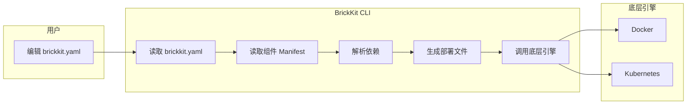

# 003 BrickKit 项目配置规范（brickkit.yaml）

## 文档信息

| 项目 | 内容 |
| --- | --- |
| 文档编号 | 003 |
| 文档名称 | 项目配置规范（brickkit.yaml） |
| 所属篇章 | 第三篇：项目配置 |
| 版本 | 1.9.0 |
| 最后更新 | 2026-08-23 |
| 状态 | 定稿 |
| 依赖文档 | 001 平台理念与总体架构、002 组件规范、004 BrickKit CLI 设计 |
| 被依赖文档 | 005 部署与运行规范、006 基础资源规范、009 组件开发快速入门、011 组件安装与拼装指南 |

---

## 1. brickkit.yaml 定位

### 1.1 一句话定义

`brickkit.yaml` 是 BrickKit 项目的声明式配置文件。它描述"我想要什么"，CLI 负责"怎么实现"。

### 1.2 核心原则

| 原则 | 说明 |
| --- | --- |
| 声明式 | 描述期望状态，不描述操作步骤 |
| 单一文件 | 一个项目一个 brickkit.yaml，所有配置集中管理 |
| 可版本控制 | 建议提交到 Git，团队共享 |
| 幂等 | CLI 每次执行都从 brickkit.yaml 读取，重复执行结果一致 |
| 不含敏感信息 | 密码、Token 通过环境变量引用，不硬编码 |
| brickkit.yaml 就是声明 | 写了几个版本就启动几个容器；写了 `enabled: true` 就是钉住；没写就是可被级联 |

### 1.3 brickkit.yaml 与 CLI 的关系



CLI 是无状态的。它不持有运行时状态。每次执行命令时：

1. 读取 brickkit.yaml（期望状态）
2. 查询底层引擎（实际状态）
3. 计算差异
4. 执行变更

### 1.4 brickkit.yaml 的位置

```
my-project/
├── brickkit.yaml          ← 项目配置文件（本文件）
├── .brickkit/
│   ├── backup/            ← 配置备份
│   ├── manifests/         ← Manifest 缓存
│   ├── artifacts/         ← API 契约及其他产物缓存
│   │   ├── department-tree-1-0-0/
│   │   │   ├── api-contract/
│   │   │   │   └── proto/department/v1/department.proto
│   │   │   └── api-docs/
│   │   │       └── openapi.json
│   │   ├── people-basic-1-0-0/
│   │   │   └── api-docs/
│   │   │       └── openapi.json
│   │   └── authorization-rbac-1-0-0/
│   │       ├── api-contract/
│   │       │   └── proto/authorization/v1/rbac.proto
│   │       └── api-docs/
│   │           └── openapi.json
│   ├── credentials        ← 登录凭据（brickkit login 生成）
│   └── generated/         ← 生成的部署文件
├── components/            ← 组件源码目录
│   ├── people/
│   │   └── basic/         ← 活跃组件源码（自己开发的或通过 --repo clone 的）
│   │       ├── .git/
│   │       ├── component.yaml
│   │       └── app.py
│   ├── department/
│   │   └── tree/
│   │       ├── .git/
│   │       ├── component.yaml
│   │       └── main.go
│   └── .archived/         ← 归档目录（brickkit sync 自动管理，隐藏）
│       ├── authorization/
│       │   └── rbac/      ← 被归档的组件（完整 Git 仓库）
│       └── infra/
│           └── redis-event-bus/
└── .gitignore
```

**components/ 目录说明：**

| 目录 | 说明 |
|---|---|
| `components/<scope>/<name>/` | 活跃组件源码。自己开发的组件或通过 `brickkit add --repo` clone 的组件 |
| `components/.archived/` | 归档目录。`brickkit sync` 根据级联计算结果，将不启动的组件源码自动移入此目录。以 `.` 开头，文件管理器默认隐藏 |

**关键规则：**
- 每个组件是独立的 Git 仓库（有自己的 `.git` 目录）
- `components/` 目录不提交到项目 Git 仓库（见 §11 `.gitignore` 建议）
- `brickkit sync` 是双向的：根据级联计算结果，该归档的归档，该激活的移回来
- 归档只改变"看不看得见"，不改变"取不取得到"：本地安装源按组件 ID 查找时会回落到归档目录（004 §3.9），否则归档过的组件会让 `up` 与 `sync` 双双失败
- 一个组件 ID 在 `components/` 下只能有一个源码目录

---

## 2. 完整结构

```yaml
# brickkit.yaml - BrickKit 项目配置
# 由 brickkit init 生成，由用户编辑，由 CLI 读取

# ===== 项目基本信息 =====
project: my-erp-project

# ===== 部署目标 =====
deploy:
  target: docker          # docker | k8s

# ===== 安装源 =====
sources:
  - id: brickkit-market
    type: market
    url: https://market.brickkit.io/api/v1
    authToken: ${MARKET_TOKEN}    # 可选。如果已执行 brickkit login，CLI 优先使用登录态
    enabled: true

  - id: local-dev
    type: local
    path: ./components
    enabled: true

# ===== 组件列表 =====
components:
  - id: department/tree
    version: 1.0.0
    # 没写 enabled → 默认开启，但可被级联关闭

  - id: people/basic
    version: 1.0.0
    # 没写 enabled → 默认开启，但可被级联关闭
    local: true
    localPort: 8081
    resources:                  # 可选，覆盖组件 Manifest 中的推荐资源配额
      limits:
        memory: "1Gi"           # 生产环境调大内存

  - id: authorization/rbac
    version: 1.0.0
    enabled: true               # ← 显式钉住！无论如何都必须运行

  - id: erp/backend
    version: 1.0.0
    # 没写 enabled → 默认开启，但可被级联关闭
    config:
      sessionTtlSeconds: 7200

  - id: infra/redis-event-bus
    version: 1.0.0
    enabled: false              # ← 显式关闭

  - id: portal/user-frontend
    version: 1.0.0
    # 没写 enabled → 默认开启，但可被级联关闭
    expose: true
    hostname: portal.example.com    # K8s 必须，Docker 可省略
    exposePort: 8080                # Docker 环境：自定义宿主机映射端口（可选）

# ===== 资源声明与绑定 =====
resources:
  - kind: database
    engine: postgresql
    id: postgres-main
    host: host.docker.internal
    port: 5432
    username: dev
    password: ${POSTGRES_PASSWORD}
    bindings:
      - componentId: department/tree
        database: department
      - componentId: people/basic
        database: people
      - componentId: authorization/rbac
        database: authorization

  - kind: cache
    engine: redis
    id: redis-main
    host: host.docker.internal
    port: 6379
    password: ${REDIS_PASSWORD}
    bindings:
      - componentId: authorization/rbac
      - componentId: infra/redis-event-bus

# ===== 安装器配置 =====
installer:
  requireSignature: false    # 本地开发关闭签名校验
```

---

## 3. 字段说明

### 3.1 project（必须）

| 字段 | 类型 | 必须 | 说明 |
| --- | --- | --- | --- |
| project | string | ✅ | 项目名称，用于标识和隔离 |

```yaml
project: my-erp-project
```

规则：

- 全部小写
- 只能包含字母、数字、中划线
- 不得包含空格
- 用于 K8s namespace 命名（如 `brickkit-my-erp-project`）
- 用于 Docker Network 命名（如 `brickkit-my-erp-project-net`）

### 3.2 deploy（必须）

| 字段 | 类型 | 必须 | 说明 |
| --- | --- | --- | --- |
| deploy.target | string | ✅ | 部署目标：`docker` 或 `k8s` |
| deploy.context | string |  | **仅 K8s**。钉住 kubeconfig 上下文（005 §5.5.2）。不写就用 kubectl 当前的 context——切走了忘记切回来，一份写着生产的配置会被安静地部到预发 |
| deploy.namespace | string |  | **仅 K8s**。覆盖默认的 `brickkit-<项目名>`（005 §5.2）。很多组织的命名空间名是他们定的，而且只给你这一个的权限 |
| deploy.createNamespace | boolean |  | **仅 K8s**，默认 true。置 false 时既不生成也不 apply namespace.yaml——只有命名空间级权限时，建命名空间会 Forbidden |
| deploy.podSecurity | string |  | **仅 K8s**。目前只支持 `restricted`（005 §5.5.2）。默认不生成 securityContext：加了可能让本来跑得好好的组件起不来 |
| deploy.imagePullSecrets | string[] |  | **仅 K8s**。拉私有镜像用的 Secret 名 |
| deploy.ingressClass | string |  | **仅 K8s**。写进 Ingress 的 `ingressClassName`（005 §5.5）。不写时，没有默认 class 的集群上会 apply 成功而域名打不开 |
| deploy.ingressAnnotations | map |  | **仅 K8s**。原样透传到 Ingress（cert-manager、nginx 参数等）。平台不认识它们，也不该认识 |
| deploy.serviceAccount | object |  | **仅 K8s**。`enabled: true` 时每个组件一个不挂载令牌的 SA（005 §5.13.3） |
| deploy.networkPolicy | object |  | **仅 K8s**。按依赖图生成网络策略（005 §5.13）。字段较多，完整结构见附录 D.1 |

> **`deploy` 下除 `target` 外全部只对 K8s 生效。** Docker 目标下写了它们，
> CLI 会提醒"本次被忽略"——不提醒的话，使用者会以为配置生效了而行为没变。

```yaml
deploy:
  target: docker    # 本地开发
```

```yaml
deploy:
  target: k8s       # 生产部署
```

影响：

- `docker`：CLI 生成 docker-compose.yaml，调用 `docker compose`（Podman 见 005 §7）
- `k8s`：CLI 生成 K8s YAML（Deployment + Service + Ingress + Job），调用 `kubectl apply`

### 3.3 sources（可选）

安装源是 CLI 获取组件的入口。详见第 6 章。

```yaml
sources:
  - id: brickkit-market
    type: market
    url: https://market.brickkit.io/api/v1
    authToken: ${MARKET_TOKEN}
    enabled: true
```

### 3.4 components（必须）

组件列表。详见第 4 章。

```yaml
components:
  - id: people/basic
    version: 1.0.0
    enabled: true
```

### 3.5 resources（可选）

资源声明与绑定。详见第 5 章。

```yaml
resources:
  - kind: database
    engine: postgresql
    id: postgres-main
    host: host.docker.internal
    port: 5432
```

### 3.6 installer（可选）

安装器行为配置。

```yaml
installer:
  requireSignature: true
  publicKeys:
    # 签名里的 publicKeyRef  →  公钥文件路径（相对项目根目录）
    keys/people-basic-release.pub: keys/people-basic-release.pub
    keys/vendor-release.pub: /etc/brickkit/vendor-release.pub
```

| 字段 | 类型 | 默认值 | 说明 |
| --- | --- | --- | --- |
| requireSignature | boolean | true | 是否强制签名校验 |
| publicKeys | map | 空 | 项目信任的发布者公钥：`publicKeyRef` → 公钥文件路径 |

**公钥为什么必须配在这里，而不是跟着签名从市场取。**

签名信息（008 §8.3）里只有 `publicKeyRef` 这个**名字**，没有密钥材料。谁来解析这个名字，决定了整套签名机制有没有意义：

| 公钥来自 | 结果 |
| --- | --- |
| 市场 | 市场自己给自己发证。市场被攻破 → 攻击者把组件和公钥一起换掉 → 验签通过 → 签名等于没有 |
| **项目配置（本字段）** | 信任锚点在使用者手里，跟着 `brickkit.yaml` 进 Git，变更有评审记录 |

008 §14.1 把"市场被攻破"的应对写成"签名校验"，只有在后者成立时这句话才是真的。所以 CLI 只认这里配的公钥，**找不到就是校验失败，绝不回退到"那就从市场拿一个"**。

公钥不是密钥，应当提交进 Git。私钥（`cosign.key`）绝不能提交。

**没配 `publicKeys` 不是配置错误。** `requireSignature` 默认为 `true`，若在解析配置时就要求必须配公钥，所有还没用上签名的项目连 `brickkit status` 都跑不起来。拦截发生在安装时——那里才说得清是哪个组件、该怎么办。

相对路径以**项目根目录**为基准，不是当前工作目录：否则同一份配置在 `components/` 子目录下执行会找不到公钥。

---

## 4. 组件配置详解

### 4.1 组件条目结构

```yaml
components:
  - id: people/basic          # 组件 ID（必须）
    version: 1.0.0            # 精确版本（必须）
    enabled: true             # 显式钉住（可选，不写 = 默认开启但可被级联关闭）
    local: false              # 是否本地调试（可选，默认 false）
    localPort: 8081           # 本地调试端口（可选，CLI 自动分配）
    expose: false             # 是否暴露到外部（可选，默认 false）
    hostname: ""              # 外部访问域名（expose: true 且 K8s 环境时必须；Docker 可省略）
    exposePort: 0             # Docker 环境自定义宿主机映射端口（可选，默认使用 deployment.port）
    tlsSecret: ""             # Ingress 用的 TLS 证书 Secret 名（可选，仅 K8s + expose: true）
    serviceAccountName: ""    # 使用已存在的 ServiceAccount（可选，仅 K8s，见 005 §5.13.3）
    config: {}                # 配置覆盖（可选，覆盖 configSchema 默认值。CLI 不校验类型）
    resources: {}             # 资源配额覆盖（可选，覆盖 Manifest 中 deployment.resources）
    replicas: 1               # 副本数（可选，默认 1；**仅 K8s**，见 §4.10）
    external:                 # 该组件已由别的项目部署，本项目只连它（可选，见 §4.9）
      project: platform-shared
```

> `tlsSecret` 与 `serviceAccountName` 只在 K8s 环境有意义，语义见 005 §5.5 与 §5.13.3。
> 写了 `serviceAccountName` 时平台**只引用、不生成**那个 SA——
> 它通常绑着运维配好的云端授权，重新生成一份会安静地抹掉。

### 4.2 id 和 version（必须）

```yaml
- id: people/basic
  version: 1.0.0
```

| 字段 | 类型 | 必须 | 说明 |
| --- | --- | --- | --- |
| id | string | ✅ | 组件 ID，格式：`scope/name` |
| version | string | ✅ | 精确版本（如 `1.0.0`，不接受 `^1.0.0`） |

规则：

- 版本必须是精确的
- 同一组件可以出现多次（不同版本），实现多版本共存（默认行为，无需额外参数）

### 4.3 enabled（三种状态）

`enabled` 字段有三种状态：

| 写法 | 含义 | 行为 |
| --- | --- | --- |
| `enabled: true`（显式写出） | **钉住**，必须运行 | 无论依赖链如何，这个组件一定启动。不可被级联关闭 |
| 不写 `enabled` 字段 | **默认开启**，但可被级联关闭 | 如果没有启用中的组件需要它，CLI 自动跳过它 |
| `enabled: false` | **显式关闭** | 一定不启动 |

**级联逻辑（CLI 在 `brickkit up` 时自动计算）：**

一个组件实际启动，当且仅当满足以下任一条件：

- 它是显式钉住的（`enabled: true`）
- 它是根组件（**没有任何组件依赖它**，强弱都算；通常是前端组件或连接组件）且未被显式关闭
- 至少有一个正在启动的组件**强依赖**它，且它未被显式关闭

一个组件被级联跳过，当且仅当以上三条都不成立。

⚠️ **只被弱依赖引用的组件不会被自动拉起。**

这是上面两条"强依赖"措辞的直接后果，但它值得单独写出来——它是最容易
想当然的一处，而它决定了一批组件跑不跑：

| 情形 | 结果 |
| --- | --- |
| A 强依赖 B，A 启动 | B 跟着启动 |
| A **弱依赖** B，A 启动 | **B 不启动**（它也不是根组件——A 指着它） |
| 想让那个弱依赖**长期**跑起来 | 给它写 `enabled: true` |
| **这一次**想让它跑 | `brickkit up --only infra/redis-event-bus`——点名等于钉住（004 §3.5），不用动配置 |

弱依赖的含义是"有就用、没有就降级"（002 §3.4）。让它自动启动，等于把
**可选**悄悄变成**必启**——而使用者装它的时候多半没这个预期。

`brickkit add` 会把弱依赖一并写进 `brickkit.yaml`（依赖树是完整的），
所以配置里有它、却不启动，是**正常现象**。`up` / `order` 会如实说明理由：

```
⬜ infra/redis-event-bus@1.0.0  级联跳过（只被弱依赖引用；需要它时请显式写 enabled: true）
```

**示例：**

```yaml
components:
   - id: department/tree
     version: 1.0.0
     # 没写 enabled → 默认开启，但可被级联关闭

   - id: people/basic
     version: 1.0.0
     # 没写 enabled → 默认开启，但可被级联关闭

   - id: authorization/rbac
     version: 1.0.0
     enabled: true          # ← 钉住！无论如何都必须运行

   - id: erp/backend
     version: 1.0.0
     enabled: false         # ← 显式关闭

   - id: portal/user-frontend
     version: 1.0.0
     # 没写 enabled → 默认开启，但可被级联关闭
```

依赖关系：

- portal/user-frontend → erp/backend
- erp/backend → people/basic
- erp/backend → authorization/rbac
- erp/backend → department/tree
- people/basic → department/tree
- authorization/rbac → department/tree

CLI 计算结果：

| 组件 | 状态 | 理由 |
| --- | --- | --- |
| erp/backend | ❌ 不启动 | 显式 `enabled: false` |
| portal/user-frontend | ❌ 级联跳过 | 它依赖 erp/backend，erp/backend 不启动，它也无法运行 |
| people/basic | ❌ 级联跳过 | 唯一依赖它的是 erp/backend（已关闭），没有其他启用组件需要它 |
| authorization/rbac | ✅ 启动 | 显式 `enabled: true`，钉住了 |
| department/tree | ✅ 启动 | authorization/rbac（钉住，正在启动）依赖它 |

CLI 输出：

```
🚀 启动项目 my-project（deploy.target: docker）

📋 组件状态计算：
   ✅ authorization/rbac@1.0.0        显式启用（钉住）
   ✅ department/tree@1.0.0           被 authorization/rbac 依赖
   ⬜ erp/backend@1.0.0               显式禁用
   ⬜ portal/user-frontend@1.0.0      级联跳过（依赖 erp/backend 已禁用）
   ⬜ people/basic@1.0.0              级联跳过（无启用中的组件依赖它）

📋 启动顺序：
   1. department-tree-1-0-0       无依赖
   2. auth-rbac-1-0-0             ← 依赖 1

🐳 正在启动...

✅ 已启动 2 个组件（跳过 3 个）
```

**关键规则：**

- `brickkit add` 自动添加的组件不写 `enabled` 字段（即默认开启，可被级联关闭）
- 只有用户手动加上 `enabled: true` 才是"钉住"的显式意图
- 级联跳过时 CLI 输出警告信息，不报错

### 4.4 local（本地调试）

```yaml
- id: people/basic
  version: 1.0.0
  local: true       # 本地调试模式
  localPort: 8081   # 本地监听端口
```

| 字段 | 类型 | 默认值 | 说明 |
| --- | --- | --- | --- |
| local | boolean | false | 是否本地调试模式 |
| localPort | integer | 自动分配 | 本地监听端口 |

行为：

- `local: true` 的组件不生成容器
- CLI 在其他容器的 `extra_hosts` 中将该组件的服务名映射到宿主机
- 环境变量中的端口改为 `localPort`
- 开发者在 IDE 中以源码模式运行该组件，debugger 直接 attach
- CLI 为 local 组件的依赖组件自动映射端口到宿主机（见下方"依赖端口映射"）
- CLI 生成 `.brickkit/generated/local-debug.env` 文件，供 IDE 加载（见下方"local-debug.env"）

⚠️ **`local: true` 只能配 `deploy.target: docker`。** 它的语义是"该组件跑在开发者的 IDE 里，其他组件通过宿主机地址访问它"，而 K8s 集群里的 Pod 连不到开发者的笔记本。`deploy.target: k8s` 时 CLI 直接报错，不会悄悄跳过——跳过的后果是依赖方拿到一个指向不存在 Service 的地址，表现成随机的连接超时（005 §5.3.1）。

**多组件同时调试：**

```yaml
components:
  - id: people/basic
    version: 1.0.0
    local: true
    localPort: 8081

  - id: department/tree
    version: 1.0.0
    local: true
    localPort: 8082

  - id: erp/backend
    version: 1.0.0
    local: false    # 正常 Docker 模式
```

**端口分配规则：**

| 场景 | 端口来源 |
| --- | --- |
| 用户指定 `localPort` | 使用用户指定的端口（让进程真的监听它是开发者自己的责任） |
| 用户未指定 `localPort` | **默认取组件自己声明的 `deployment.port`**；该端口在宿主机上已被别人占用时，从 8081 起递增另选 |
| 两处写死了同一个宿主机端口 | CLI 报错并提示更换端口 |

⚠️ 平台**不注入"我该监听哪个端口"**——环境变量里只有"别人在哪"。所以 `localPort` 的默认值必须是组件自己声明的端口，否则依赖方会连到一个没人监听的端口上（详见 005 §4.6）。

**本地调试限制：**

| 限制 | 说明 |
| --- | --- |
| 闭源组件不支持 | 没有源码，无法在 IDE 中运行 |
| 需要 Docker 20.10+ | `host-gateway` 需要 Docker 20.10+ |

**local 组件的依赖端口映射：**

当组件标记为 `local: true` 时，该组件在宿主机上运行（IDE 中），需要访问 Docker 容器内的依赖组件。CLI 自动处理这个方向的访问：

| 场景 | CLI 行为 |
| --- | --- |
| 依赖组件已有 `expose: true` + `exposePort` | 使用已有的映射端口 |
| 依赖组件没有 `expose` | CLI 自动分配宿主机端口（优先 `10000 + 容器端口`，被占用时从 18080 起递增） |
| 端口冲突 | CLI 报错并提示 |

示例：

```yaml
components:
  - id: people/basic
    version: 1.0.0
    local: true
    localPort: 8081

  - id: department/tree
    version: 1.0.0
    local: false    # 在 Docker 中运行
```

CLI 行为：

- `department/tree` 在 Docker 中运行，CLI 自动为其映射宿主机端口（如 18080）
- 生成 `local-debug.env`，其中 `DEPARTMENT_TREE_ENDPOINT=http://localhost:18080`
- `people/basic` 在 IDE 中运行时，通过 `localhost:18080` 访问 `department/tree`

**local-debug.env：**

当项目中存在 `local: true` 的组件时，CLI 在 `brickkit up` 时自动生成 `.brickkit/generated/local-debug.env` 文件：

```
# .brickkit/generated/local-debug.env
# 由 BrickKit CLI 自动生成，供 IDE 加载
# 组件：people/basic@1.0.0（local: true）

COMPONENT_ID=people/basic
COMPONENT_VERSION=1.0.0
DATABASE_HOST=localhost
DATABASE_PORT=5432
DATABASE_NAME=people
DATABASE_USER=people_user
DATABASE_PASSWORD=s3cret-from-dotenv     # ← 生成时已求值，不是占位符

# 依赖地址指向 localhost（因为依赖组件已映射端口到宿主机）
DEPARTMENT_TREE_ENDPOINT=http://localhost:18080
```

> ⚠️ **这份文件里的 `${VAR}` 在生成时就已求值，写进去的是真实值。**
> 它是给 IDE 读的（VS Code 的 `envFile`、IntelliJ 的 EnvFile 插件），
> **这两者都不做变量替换**——留着占位符，IDE 里的进程就会拿着字面量
> `${PEOPLE_DB_PASSWORD}` 去连库，认证失败，而使用者的 `.env` 明明写着密码。
> 与 `docker-compose.yaml` **刻意相反**（那份由 compose 自己替换，所以保留占位符）。
> 判据是"谁不做替换，就在生成时替换给谁"，完整对照见 005 §4.9。
> 文件权限 `0600`；求不出值的变量原样保留占位符，不阻断 `up`。

**IDE 中的使用方式：**

| IDE | 配置方式 |
| --- | --- |
| VS Code | `launch.json` 中配置 `envFile: ".brickkit/generated/local-debug.env"` |
| IntelliJ / GoLand | Run Configuration → Environment Variables → 导入 `.env` 文件 |
| 命令行 | `source .brickkit/generated/local-debug.env && python app.py` |

**多版本共存时的 local-debug.env 命名：**

如果项目中有多个 `local: true` 的组件（包括同一组件 ID 的不同版本），为每个组件生成独立的 `local-debug.env`，使用版本化服务名命名：

```
.brickkit/generated/
  ├── local-debug.people-basic-1-0-0.env      # people/basic@1.0.0
  ├── local-debug.people-basic-2-0-0.env      # people/basic@2.0.0（多版本共存）
  └── local-debug.department-tree-1-0-0.env   # department/tree@1.0.0
```

### 4.5 expose（外部暴露）

```yaml
- id: portal/user-frontend
  version: 1.0.0
  expose: true
  hostname: portal.example.com    # K8s 必须，Docker 可省略
  exposePort: 8080                # Docker 环境：自定义宿主机映射端口（可选）
```

| 字段 | 类型 | 默认值 | 说明 |
| --- | --- | --- | --- |
| expose | boolean | false | 是否暴露到外部 |
| hostname | string | — | 外部访问域名。仅 `deploy.target: k8s` 时必须（Ingress 需要域名）；Docker 环境可省略 |
| exposePort | integer | — | Docker 环境自定义宿主机映射端口（可选）。默认使用 Manifest 中 `deployment.port`。**仅 Docker 环境生效，K8s 环境忽略** |

行为：

| 环境 | `expose: false`（默认） | `expose: true` |
| --- | --- | --- |
| Docker | 不映射端口，只在 Docker Network 内可达 | 映射端口到宿主机（默认使用 Manifest 中 `deployment.port`，可通过 `exposePort` 自定义） |
| K8s | 不生成 Ingress，只在集群内可达 | 生成 Ingress YAML（基于 `hostname` 域名路由） |

**安全默认：** 不声明 `expose: true` 就不暴露。

**Docker 环境端口冲突处理：**

如果多个组件同时 `expose: true` 且宿主机端口相同，CLI 报错阻断：

```
❌ 端口冲突：
   portal/user-frontend（expose: true → 宿主机端口 80）
   portal/admin-frontend（expose: true → 宿主机端口 80）
   两个组件映射到同一个宿主机端口。

   建议：在 brickkit.yaml 中为其中一个组件添加 exposePort 字段。
   示例：
     - id: portal/admin-frontend
       expose: true
       exposePort: 8080    # ← 自定义宿主机端口
```

**K8s 环境无端口冲突：** K8s 使用 Ingress + 域名路由，两个组件可以共用同一个端口（如 80），只要 `hostname` 不同（如 `portal.example.com` vs `admin.example.com`）就不冲突。因此 K8s 环境不需要 `exposePort` 字段。

**Docker 环境 `expose: true` 的生成结果：**

```yaml
# CLI 生成的 docker-compose.yaml 中

# 未填 exposePort（默认使用 deployment.port）
portal-user-frontend-1-0-0:
  image: registry.brickkit.io/portal-user-frontend:1.0.0
  ports:
    - "80:80"    # 映射到宿主机，浏览器可访问 http://localhost:80

# 填了 exposePort: 8080
portal-user-frontend-1-0-0:
  image: registry.brickkit.io/portal-user-frontend:1.0.0
  ports:
    - "8080:80"    # 宿主机端口 8080，容器端口 80
```

**K8s 环境 `expose: true` 的生成结果：**

```yaml
# CLI 自动生成
 apiVersion: networking.k8s.io/v1
 kind: Ingress
 metadata:
   name: portal-user-frontend-1-0-0
   namespace: brickkit-my-erp-project
 spec:
   rules:
     - host: portal.example.com    # ← 来自 hostname 字段
       http:
         paths:
           - path: /
             pathType: Prefix
             backend:
               service:
                 name: portal-user-frontend-1-0-0
                 port:
                   number: 80
```

### 4.6 config（配置覆盖）

```yaml
- id: erp/backend
  version: 1.0.0
  config:
    sessionTtlSeconds: 7200
    enableAudit: false
```

| 字段 | 类型 | 默认值 | 说明 |
| --- | --- | --- | --- |
| config | object | {} | 覆盖 configSchema 中的默认值 |

行为：

1. CLI 读取组件 Manifest 中的 `configSchema`，获取所有配置项的默认值
2. 用 brickkit.yaml 中 `config` 字段的值覆盖对应项
3. 将最终值转为环境变量注入（驼峰转大写下划线）

示例：

Manifest 中声明：

```yaml
configSchema:
  properties:
    sessionTtlSeconds:
      type: integer
      default: 3600
    enableAudit:
      type: boolean
      default: true
```

brickkit.yaml 中覆盖：

```yaml
components:
  - id: erp/backend
    version: 1.0.0
    config:
      sessionTtlSeconds: 7200
      enableAudit: false
```

CLI 注入的环境变量：

```
SESSION_TTL_SECONDS=7200
ENABLE_AUDIT=false
```

未被覆盖的配置项使用 configSchema 中的默认值。

**重要：CLI 不校验 config 值的类型。** configSchema 是"配置说明书"，不是"安检机"。CLI 不基于 configSchema 对使用者填写的 config 值做运行时类型校验。如果使用者填错类型（如把 integer 写成字符串），CLI 原样注入，由此导致的组件运行异常由使用者自行承担。

**⚠️ 保留变量保护：**

config 字段中的配置项名称不得与平台保留变量冲突（转大写后匹配）。如果冲突，CLI 警告但跳过该配置项，平台注入的值优先。

保留变量列表见附录 C.6。冲突示例：

- `departmentTreeEndpoint` → `DEPARTMENT_TREE_ENDPOINT` → 与 `*_ENDPOINT` 冲突 ❌
- `componentId` → `COMPONENT_ID` → 与 `COMPONENT_ID` 冲突 ❌
- `databaseHost` → `DATABASE_HOST` → 与 `DATABASE_*` 冲突 ❌
- `customPageSize` → `CUSTOM_PAGE_SIZE` → 无冲突 ✅

**config 与 `.env` 的职责分离：**

| 配置类型 | 存放位置 | 示例 |
| --- | --- | --- |
| 业务配置 | brickkit.yaml → `config` 字段 | defaultPageSize: 50 |
| 密钥/密码 | `.env` 文件（Docker）/ K8s Secret（生产） | DATABASE_PASSWORD=xxx |

### 4.7 resources（资源配额覆盖）

```yaml
- id: people/basic
  version: 1.0.0
  resources:                  # 覆盖组件 Manifest 中的推荐资源配额
    requests:
      cpu: "200m"
      memory: "256Mi"
    limits:
      cpu: "1000m"
      memory: "1Gi"
```

| 字段 | 类型 | 默认值 | 说明 |
| --- | --- | --- | --- |
| resources | object | {} | 覆盖 Manifest 中 `deployment.resources` 的推荐值 |

行为：

1. CLI 读取组件 Manifest 中的 `deployment.resources`（组件推荐值）
2. 读取 brickkit.yaml 中该组件的 `resources` 字段（使用者覆盖值）
3. 如果使用者覆盖了，使用覆盖值；否则使用组件推荐值
4. 如果都没有，使用 CLI 默认值（requests: 100m/128Mi, limits: 500m/512Mi）
5. 将最终值写入部署文件（Docker: `deploy.resources`; K8s: `resources`）

CLI 优先级链：`brickkit.yaml resources` > `component.yaml deployment.resources` > `CLI 默认值`

示例：

组件 Manifest 中声明推荐值：

```yaml
# component.yaml
deployment:
  type: container
  image: registry.brickkit.io/people-basic:1.0.0
  port: 8080
  resources:
    requests:
      cpu: "100m"
      memory: "128Mi"
    limits:
      cpu: "500m"
      memory: "512Mi"
```

brickkit.yaml 中覆盖（生产环境调大内存）：

```yaml
components:
  - id: people/basic
    version: 1.0.0
    resources:
      limits:
        memory: "1Gi"    # 覆盖组件推荐的 512Mi
```

最终注入 K8s 的值：

```yaml
resources:
  requests:
    cpu: 100m            # 来自 Manifest（未覆盖）
    memory: 128Mi        # 来自 Manifest（未覆盖）
  limits:
    cpu: 500m            # 来自 Manifest（未覆盖）
    memory: 1Gi          # 来自 brickkit.yaml（覆盖了 Manifest 的 512Mi）
```

**重要：CLI 不校验 resources 数值的合理性。** 资源配额是"推荐值"，不是"强制限制"。如果设置了不合理的 limits，可能导致组件频繁 OOMKilled，这是配置者的责任。

### 4.8 多版本共存

由于服务名带版本号，同一组件的不同版本可以同时存在：

```yaml
components:
  # v1 版本
  - id: people/basic
    version: 1.0.0
    # 没写 enabled → 默认开启

  # v2 版本（共存）
  - id: people/basic
    version: 2.0.0
    # 没写 enabled → 默认开启
```

生成的服务名：

- `people-basic-1-0-0`（v1）
- `people-basic-2-0-0`（v2）

调用方通过 Manifest 中的精确版本声明决定调哪个。

**多版本共存是默认行为。** brickkit.yaml 中写了几个版本，CLI 就启动几个容器，无需任何额外参数。

⚠️ **注意：** 多版本共存只是物理缓冲，不保证数据层兼容。涉及破坏性变更（删除字段等）时，必须遵循 002 组件规范第 3.7 节"破坏性变更（Major）协同守则"，由部门间协调同步升级。

---

### 4.9 external（引用别的项目部署的组件）

有些组件本身就是**权威**，复制一份就是错的：

| 情形 | 例子 |
| --- | --- |
| 单例副作用 | 定时任务、通知发送——跑两份就是双倍邮件 |
| 成本高昂 | 大模型推理服务，复制一份不现实 |
| 归属独立 | 一个团队运维，别人只许调用 |

这时候声明 `external`，表示"**它已经有人部好了，我只连它**"：

```yaml
components:
  - id: infra/notifier
    version: 1.0.0
    external:
      project: platform-shared     # 部署了它的那个 BrickKit 项目
```

**平台会做的**：照常进依赖图、照常做版本兼容检查、照常下载 artifacts、
照常把地址注入给依赖方。

**平台不会做的**：不生成它的部署对象、不执行它的迁移、不检查它的镜像、
`down` 时也不碰它。

**它在各条命令里怎么出现**——它确实"在跑"，只是不由本项目启动，
所以每处都单列，绝不混进"本项目的容器"那张表：

| 命令 | 怎么显示 |
| --- | --- |
| `up` / `order` | 单列一节 🔗「以下依赖由**别的项目**部署」，不出现在要启动的服务里 |
| `status` | 单列一节 🔗「外部依赖」，标明由哪个项目部署 |
| `down` | 不碰。`--only` 点名它时明说"本项目没有容器可停"，并**不会**因此退化成停整个项目 |

> ⚠️ 最后半句不是多余的：`--only` 过滤掉 external 之后如果一个都不剩，
> 空的服务名列表在引擎眼里就是**"停全部"**。一条 `down --only <某个 external 组件>`
> 把本项目所有东西都停掉，比原来那句 `no such service` 严重得多。

`local: true` 走的是同一条判据（**本项目生不生成它的容器**），只是理由不同——
它跑在开发者的 IDE 里。

#### 为什么是"项目"而不是"命名空间"或一个地址

共享的东西**不属于任何一个消费方**，它自己就是一个普通的 BrickKit 项目，
有自己的负责人与升级节奏。若把它写进消费方的配置并由消费方部署，
**消费方执行一次 `down`，别的项目就挂了**——这跟它部在哪个命名空间毫无关系。

写项目名而不是直接写地址，还白送一件事：地址由平台按同一套服务名规则推导，
而服务名带版本（`infra-notifier-1-0-0`），所以声明 `@1.0.0` 时
要么连上的正好是 1.0.0、**要么当场解析不出来报错**，
不存在"连到了 2.0.0 却以为是 1.0.0"这种状态。

#### 两种目标下平台各做了什么

| 目标 | 跨项目寻址 | 平台的动作 |
| --- | --- | --- |
| Docker | 服务名**只在同一张网络**里解析 | 把**依赖它的**服务接进对方项目的网络（声明为 `external: true`，只引用不创建） |
| K8s | 跨命名空间 DNS 原生可用 | 注入的地址带上后缀：`<服务名>.<对方命名空间>` |

Docker 侧只接依赖方、不是全部接进去：网络是可达性边界，
全接进去等于把"谁能访问共享服务"从**按依赖声明**变成**默认全通**。

K8s 侧**不生成同名 Service** 尤其要紧：本命名空间里的同名 Service 会
**抢在**跨命名空间解析之前命中，而它背后一个 Pod 都没有——
表现是稳定的 503，且从依赖方看一切正常（地址对、DNS 通、Service 存在）。

#### 互斥字段

`external` 与下列字段不能同时声明，写了会在解析阶段报错：

| 字段 | 为什么 |
| --- | --- |
| `local` | 含义相反：一个说在本机调试，一个说在别的项目里跑 |
| `expose` | 它的入口该由部署它的那个项目决定 |
| `config` | 它读的是**对方项目**那份配置，写在这里不会生效——而看上去像生效了 |
| `resources` | 配额由部署它的那个项目决定 |

`external.project` 也不能指向本项目：那等于说"我不部署它，但它由我部署"。

#### 对方没部署时会怎样：两种目标不一样

| 目标 | 表现 | 为什么 |
| --- | --- | --- |
| **Docker** | `up` **当场失败**，点名是哪个组件、缺哪张网络、该去哪个项目 `up` 一次 | 服务名只在同一张网络里解析，依赖方必须接进对方项目的网络——而那张网络由对方创建。网络不在，compose 根本不肯启动 |
| **K8s** | 本项目**正常起来**，直到第一次真的去调它才连接失败 | 跨命名空间 DNS 原生可用，平台只是给地址加了个后缀；对方在不在，要连了才知道 |

Docker 那边的**快速失败是更好的结果**，不是缺陷：那时依赖方连地址都解析不了，
让它先起来只会把同一个问题推迟到运行时，还多一层"容器明明是 healthy 的"的干扰。
CLI 因此在 `up` 之前先查一次那张网络在不在——compose 自己也会失败，
但它给的是一句 `network ... declared as external, but could not be found`，
里面没有 external、没有对方项目名、也没有下一步。

`up` 无论哪种目标都会先列出哪些依赖是外部的、由哪个项目部署。

### 4.10 replicas（副本数，仅 K8s）

```yaml
components:
  - id: people/basic
    version: 1.0.0
    replicas: 3
```

不写就是 1。**只在 `deploy.target: k8s` 下生效**——Docker 目标下写了会收到提醒，
因为那里它完全不起作用，而 `up` 一切正常、`docker ps` 里只有一个容器，
使用者会以为是自己写错了字段名。

Service 自动负载均衡到所有副本，组件代码无感知（005 §5.8）。

#### 必须 >= 1

写 0 会报错，并指向 `enabled: false`。两者不是一回事：

| 写法 | 平台的行为 |
| --- | --- |
| `enabled: false` | 走级联计算，依赖它的组件会被一起关掉或收到提醒 |
| `replicas: 0` | 绕过这一切——依赖方照常启动、照常拿到地址，然后连一个不存在的后端 |

后者的表现是 503，而状态表里那个组件显示"正常"。

#### 与 `local` / `external` 互斥

`local` 是"这个组件在你的 IDE 里跑"，那里只有一个进程；
`external` 是"它由别的项目部署"，副本数是那边的决定。

#### 多副本时自动生成 PodDisruptionBudget

副本数 > 1 时，平台为该组件生成一份 `maxUnavailable: 1` 的 PDB。
它保证节点排空（`kubectl drain`、集群升级）时不会把副本一次全部驱逐。

**单副本时坚决不生成**，这是实测得出的结论：单副本下 PDB 无论怎么写都是死路——
`minAvailable: 1` 让 `ALLOWED DISRUPTIONS` 恒为 0、节点永远排不空；
`maxUnavailable: 1` 又允许唯一那个副本随时被驱逐，等于没写。

用 `maxUnavailable` 而不是 `minAvailable`，是因为前者**随副本数自动成立**：
把 3 改成 5 时不用回来改 PDB。

副本数从多副本改回 1 时，那份 PDB 会被自动清理——留着它会让节点从此排不空。

## 5. 资源配置详解

> **两个项目可以指向同一个资源实例。** 这是跨项目共享数据最常用、也最便宜的做法——
> 组件各部各的，只有 `host` / `port` 指向同一处。共享还是隔离往往只取决于组件
> `configSchema` 里那个划分数据边界的字段（如事件总线的 `streamName`）。
> 三种共享形态的取舍见 005 §5A。


### 5.1 资源条目结构

```yaml
resources:
  - kind: database              # 资源类型（必须）
    engine: postgresql          # 资源引擎（必须）
    id: postgres-main           # 资源 ID（必须）
    host: host.docker.internal  # 主机地址（必须）；资源跑在本机时就写这个
    port: 5432                  # 端口（必须）
    username: dev               # 用户名（可选）
    password: ${POSTGRES_PASSWORD}  # 密码（通过环境变量引用）
    bindings:                   # 绑定到哪些组件（可选）
      - componentId: people/basic
        database: people
      - componentId: department/tree
        database: department
```

### 5.2 资源类型（kind）

**`kind` 是封闭枚举**，写别的值 CLI 在解析阶段就报错（006 §2.1）：

| kind | 说明 | 常见 engine | 注入的连接变量 |
| --- | --- | --- | --- |
| `database` | 数据库 | postgresql、mysql | `DATABASE_*` |
| `cache` | 缓存 | redis、memcached | `REDIS_*` |
| `mq` | 消息队列 | rabbitmq、kafka、nats | `MQ_*` |
| `storage` | 对象存储 | minio、s3 | `STORAGE_*` |
| `search` | 搜索引擎 | elasticsearch | `SEARCH_*` |
| `smtp` | 邮件服务 | smtp | `SMTP_*` |

kind 的名字就是环境变量前缀：平台认识一种资源，靠的就是知道该注入哪几个变量。
`engine` 反过来是自由字符串，平台不解析它。

### 5.3 资源绑定（bindings）

资源绑定表示某个组件使用哪个资源实例。

```yaml
bindings:
  - componentId: people/basic
    database: people        # 该组件使用的 database 名
  - componentId: department/tree
    database: department
```

规则：

- 一个资源可以绑定多个组件
- 每个组件使用不同的 database（数据隔离）
- 绑定后，CLI 在生成部署文件时注入对应的环境变量
- **绑定按组件 ID 记，不带版本。** 多版本共存时同一条绑定服务于该组件的所有版本
- `brickkit remove` 掉某个组件的最后一个版本时，指向它的绑定一并解除（004 §3.4）

**指向不存在的组件的绑定：警告，不阻断。**

`componentId` 写的组件不在 `components` 里时，`brickkit up` 出一条警告，
**不报错**。这条绑定的唯一后果是它自己不生效——注入引擎按组件 ID 归集绑定，
归到一个不存在的组件上就是无人认领，其余组件毫发无伤。

拿一个致命错误去挡一个无害状态，代价完全不成比例：

| 场景 | 阻断的后果 |
| --- | --- |
| 手工删掉组件条目、漏了绑定 | 此后**每一条**命令都撞同一堵墙，而报错说的是资源配置 |
| 先声明好资源与绑定，再 `brickkit add` 组件 | 这个顺序完全说得通，却在 add 之前就被拦下 |

### 5.4 密钥引用

**密码不得硬编码在 brickkit.yaml 中。** 使用环境变量引用：

```yaml
# ✅ 正确：通过环境变量引用
password: ${POSTGRES_PASSWORD}

# ❌ 错误：硬编码密码
password: my-secret-password-123
```

环境变量可以在 `.env` 文件中定义（Docker 环境）：

```
# .env
POSTGRES_PASSWORD=my-secret-password-123
REDIS_PASSWORD=my-redis-password
MARKET_TOKEN=xxx
```

`.env` 文件必须加入 `.gitignore`。

### 5.5 资源注入的环境变量

绑定后，CLI 在生成部署文件时注入：

```
# people/basic 绑定 postgres-main 后注入：
DATABASE_HOST=localhost
DATABASE_PORT=5432
DATABASE_NAME=people
DATABASE_USER=dev
DATABASE_PASSWORD=<从 .env 或 K8s Secret 获取>
```

### 5.6 多资源绑定（envPrefix）

如果一个组件需要多个同类资源，使用 `envPrefix` 区分：

```yaml
resources:
       - kind: database
         engine: postgresql
         id: postgres-primary
         host: primary-db
         port: 5432
         bindings:
           - componentId: people/basic
             database: people
             envPrefix: PRIMARY       # 环境变量前缀

       - kind: database
         engine: postgresql
         id: postgres-archive
         host: archive-db
         port: 5432
         bindings:
           - componentId: people/basic
             database: people_archive
             envPrefix: ARCHIVE       # 环境变量前缀
```

注入的环境变量：

```
# 主数据库
PRIMARY_DATABASE_HOST=primary-db
PRIMARY_DATABASE_PORT=5432
PRIMARY_DATABASE_NAME=people

# 归档数据库
ARCHIVE_DATABASE_HOST=archive-db
ARCHIVE_DATABASE_PORT=5432
ARCHIVE_DATABASE_NAME=people_archive
```

---

## 6. 安装源配置详解

### 6.1 安装源类型

| 类型 | 说明 | 适用场景 |
| --- | --- | --- |
| market | 远程市场 API | 生产环境，连接 BrickKit Market |
| git | Git 仓库 | 开源组件本地开发 |
| local | 本地目录 | 本地开发、离线环境 |

### 6.2 market 类型

```yaml
sources:
  - id: brickkit-market
    type: market
    url: https://market.brickkit.io/api/v1
    authToken: ${MARKET_TOKEN}    # 可选，访问 private 组件时需要
    enabled: true
```

| 字段 | 类型 | 必须 | 说明 |
| --- | --- | --- | --- |
| id | string | ✅ | 安装源唯一标识 |
| type | string | ✅ | 固定为 `market` |
| url | string | ✅ | 市场 API 地址 |
| authToken | string | ❌ | 认证 Token（访问 private 组件时需要）。如果已执行 `brickkit login`，CLI 优先使用登录态（`.brickkit/credentials`），忽略此字段 |
| enabled | boolean | ❌ | 是否启用（默认 true） |

### 6.3 git 类型

```yaml
sources:
  - id: my-git
    type: git
    url: https://github.com/myorg/brickkit-components.git
    enabled: false
```

| 字段 | 类型 | 必须 | 说明 |
| --- | --- | --- | --- |
| id | string | ✅ | 安装源唯一标识 |
| type | string | ✅ | 固定为 `git` |
| url | string | ✅ | Git 仓库地址 |
| ref | string | ❌ | 分支 / tag / commit。不写时用仓库的**默认分支** |
| enabled | boolean | ❌ | 是否启用（默认 true） |

```yaml
sources:
  - id: internal-components
    type: git
    url: https://github.com/myorg/brickkit-components.git
    ref: v2.3.0          # 也可以写分支名或完整的 commit SHA
```

**`ref` 怎么取：** CLI 先试 `git clone --depth 1 --branch <ref>`——分支与 tag 走这条，保持浅 clone；失败了再回落到完整 clone + `git checkout <ref>`，因为 **`clone --branch` 不认 commit SHA**。绝大多数人写的是分支或 tag，让常见情况保持最快。

**生产环境建议钉住 tag 或 commit：** 默认分支是会动的，同一份 `brickkit.yaml` 在不同时间装出不同的组件，那正是版本化想避免的事。

### 6.4 local 类型

```yaml
sources:
  - id: local-dev
    type: local
    path: ./components
    enabled: true
```

| 字段 | 类型 | 必须 | 说明 |
| --- | --- | --- | --- |
| id | string | ✅ | 安装源唯一标识 |
| type | string | ✅ | 固定为 `local` |
| path | string | ✅ | 本地目录路径（相对于 brickkit.yaml） |
| enabled | boolean | ❌ | 是否启用（默认 true） |

本地目录结构：

```
components/
├── people/
│   └── basic/
│       ├── component.yaml
│       └── Dockerfile
├── department/
│   └── tree/
│       ├── component.yaml
│       └── Dockerfile
└── portal/
    └── user-frontend/
        ├── component.yaml
        ├── Dockerfile
        └── src/
```

### 6.5 安装源优先级

当多个安装源中存在同名组件时，按配置顺序优先：

```yaml
sources:
  # 优先使用本地目录
  - id: local-dev
    type: local
    path: ./components
    enabled: true

  # 本地没有时，从市场获取
  - id: brickkit-market
    type: market
    url: https://market.brickkit.io/api/v1
    enabled: true
```

---

## 7. 配置备份与恢复

### 7.1 自动备份机制

CLI 在以下时机自动备份 brickkit.yaml：

| 时机 | 备份文件 | 说明 |
| --- | --- | --- |
| brickkit init | .brickkit/backup/brickkit.yaml.initial | 初始骨架 |
| 每次 `brickkit add` 前 | .brickkit/backup/brickkit.yaml.last | 上一步操作前的状态 |
| 每次 `brickkit remove` 前 | .brickkit/backup/brickkit.yaml.last | 同上 |

### 7.2 brickkit reset

```bash
# 恢复到初始状态
brickkit reset

# 恢复到上一次备份
brickkit reset --last
```

行为：

1. 读取对应的备份文件
2. 覆盖当前 brickkit.yaml
3. 输出恢复结果

输出示例：

```
🔄 已恢复 brickkit.yaml 到初始状态
   备份位置：.brickkit/backup/brickkit.yaml.initial
   恢复时间：2026-08-08T10:00:00Z

⚠️ 注意：恢复后需要重新执行 brickkit up 使变更生效
```

### 7.3 备份目录结构

```
.brickkit/
   ├── backup/
   │   ├── brickkit.yaml.initial     ← init 时的初始备份
   │   ├── brickkit.yaml.last        ← 上一次操作前的备份
   │   └── brickkit.yaml.20260808    ← 手动备份（可选）
   ├── manifests/
   │   ├── people-basic-1.0.0.yaml
   │   └── department-tree-1.0.0.yaml
   ├── artifacts/                     ← API 契约及其他产物缓存
   │   ├── department-tree-1-0-0/
   │   │   ├── api-contract/
   │   │   │   └── proto/department/v1/department.proto
   │   │   └── api-docs/
   │   │       └── openapi.json
   │   ├── people-basic-1-0-0/
   │   │   └── api-docs/
   │   │       └── openapi.json
   │   └── authorization-rbac-1-0-0/
   │       ├── api-contract/
   │       │   └── proto/authorization/v1/rbac.proto
   │       └── api-docs/
   │           └── openapi.json
   ├── credentials                   ← 登录凭据（brickkit login 生成）
   └── generated/
       ├── docker-compose.yaml
       ├── local-debug.people-basic-1-0-0.env    ← local: true 时生成（版本化服务名命名）
       └── k8s/
```

---

## 8. 完整示例

### 8.1 本地开发示例

```yaml
# brickkit.yaml - 本地开发

project: my-erp-dev

deploy:
  target: docker

sources:
  # 本地开发目录优先
  - id: local-dev
    type: local
    path: ./components
    enabled: true

  # 市场作为补充
  - id: brickkit-market
    type: market
    url: https://market.brickkit.io/api/v1
    enabled: true

components:
  # 部门组件：正常 Docker 模式（没写 enabled → 默认开启，可被级联关闭）
  - id: department/tree
    version: 1.0.0

  # 人员组件：本地调试模式（IDE debugger）
  - id: people/basic
    version: 1.0.0
    local: true
    localPort: 8081

  # 权限组件：正常 Docker 模式
  - id: authorization/rbac
    version: 1.0.0

  # ERP 后端：正常 Docker 模式，覆盖配置
  - id: erp/backend
    version: 1.0.0
    config:
      sessionTtlSeconds: 1800

  # 事件总线：弱依赖，本地开发时禁用（省资源）
  - id: infra/redis-event-bus
    version: 1.0.0
    enabled: false

  # 前端组件：正常 Docker 模式（nginx 容器），暴露到宿主机
  - id: portal/user-frontend
    version: 1.0.0
    expose: true
    # hostname 在 Docker 环境下可省略
    # exposePort: 8080    # 如需自定义宿主机端口，可添加此字段

resources:
  # 本地开发数据库（简单配置）
  - kind: database
    engine: postgresql
    id: postgres-dev
    host: host.docker.internal
    port: 5432
    username: dev
    password: dev    # 本地开发允许简单密码
    bindings:
      - componentId: department/tree
        database: department
      - componentId: people/basic
        database: people
      - componentId: authorization/rbac
        database: authorization

  # 本地开发 Redis
  - kind: cache
    engine: redis
    id: redis-dev
    host: host.docker.internal
    port: 6379
    bindings:
      - componentId: authorization/rbac

installer:
  requireSignature: false    # 本地开发关闭签名校验
```

### 8.2 生产部署示例

```yaml
# brickkit.yaml - 生产部署

project: my-erp-prod

deploy:
  target: k8s

sources:
  - id: brickkit-market
    type: market
    url: https://market.brickkit.io/api/v1
    authToken: ${MARKET_TOKEN}
    enabled: true

components:
  - id: department/tree
    version: 1.0.0

  - id: people/basic
    version: 1.2.0
    resources:                  # 生产环境覆盖资源配额
      limits:
        memory: "1Gi"

  - id: authorization/rbac
    version: 1.0.0
    enabled: true               # 钉住：无论如何都必须运行

  - id: erp/backend
    version: 1.0.0
    config:
      sessionTtlSeconds: 3600
      enableAudit: true
    resources:                  # 生产环境覆盖资源配额
      requests:
        cpu: "200m"
        memory: "256Mi"
      limits:
        cpu: "1000m"
        memory: "1Gi"

  - id: infra/redis-event-bus
    version: 1.0.0

  - id: portal/user-frontend
    version: 1.0.0
    expose: true
    hostname: portal.mycompany.com    # K8s 环境必须填写 hostname

resources:
  - kind: database
    engine: postgresql
    id: postgres-prod
    host: ${PROD_DB_HOST}
    port: 5432
    username: erp_user
    password: ${PROD_DB_PASSWORD}
    bindings:
      - componentId: department/tree
        database: department
      - componentId: people/basic
        database: people
      - componentId: authorization/rbac
        database: authorization
      - componentId: erp/backend
        database: erp

  - kind: cache
    engine: redis
    id: redis-prod
    host: ${PROD_REDIS_HOST}
    port: 6379
    password: ${PROD_REDIS_PASSWORD}
    bindings:
      - componentId: authorization/rbac
      - componentId: infra/redis-event-bus

installer:
  requireSignature: true    # 生产环境强制签名校验
```

### 8.3 多版本共存示例（灰度迁移）

```yaml
# brickkit.yaml - 多版本共存（灰度迁移）
# 多版本共存是默认行为，无需额外参数

project: my-erp-migration

deploy:
  target: k8s

components:
  # 旧版本（仍在运行，供旧调用方使用）
  - id: people/basic
    version: 1.0.0

  # 新版本（新调用方使用）
  - id: people/basic
    version: 2.0.0

  # 旧版 ERP 调用 people/basic@1.0.0
  - id: erp/backend
    version: 1.0.0

  # 新版 ERP 调用 people/basic@2.0.0
  - id: erp/backend
    version: 2.0.0
```

生成的服务名：

- `people-basic-1-0-0`（v1）
- `people-basic-2-0-0`（v2）
- `erp-backend-1-0-0`（v1，调用 v1 人员组件）
- `erp-backend-2-0-0`（v2，调用 v2 人员组件）

⚠️ **注意：** 多版本共存只是物理缓冲。涉及破坏性变更（删除字段等）时，必须遵循 002 组件规范第 3.7 节"破坏性变更（Major）协同守则"。

### 8.4 最小示例（Hello World）

```yaml
# brickkit.yaml - 最小示例
project: hello-world

deploy:
  target: docker

sources:
  - id: local-dev
    type: local
    path: ./components
    enabled: true

components:
  - id: hello/world
    version: 1.0.0
```

---

## 9. 多环境配置

### 9.1 每个环境一个完整的 brickkit.yaml

建议为每个环境维护独立的 brickkit.yaml：

```
my-project/
├── brickkit.yaml              # 本地开发
├── brickkit.test.yaml         # 测试环境
├── brickkit.staging.yaml      # 预发布环境
└── brickkit.prod.yaml         # 生产环境
```

CLI 支持指定配置文件：

```bash
brickkit up --config brickkit.prod.yaml
```

使用 `--config` 指定其他配置文件时，CLI 依然将生成的部署文件和备份写入默认的 `.brickkit/` 目录。每次执行 `brickkit up` 都会基于当前指定的配置文件重新生成并覆盖。CLI 支持多环境部署，但生成文件始终写入同一个 `.brickkit/` 目录，每次 `brickkit up` 基于当前指定的配置文件重新生成并覆盖。

### 9.2 不引入 overlay / 继承机制

每个文件自包含，打开就能看到完整配置。不需要理解"继承链"。

重复的组件列表可以通过 Git diff / Code Review 来管理。

---

## 10. 配置规则与约束

### 10.1 必须遵守的规则

| # | 规则 | 说明 |
| --- | --- | --- |
| 1 | project 必须存在 | 每个项目必须有名称 |
| 2 | deploy.target 必须存在 | 必须声明部署目标 |
| 3 | 组件版本必须精确 | 不接受 `^1.0.0` 或 `~1.0.0` |
| 4 | 密码不得硬编码 | 使用 `${ENV_VAR}` 引用 |
| 5 | `.env` 文件不提交 Git | 包含敏感信息 |
| 6 | `expose: true` 且 K8s 环境必须有 hostname | Ingress 需要域名；Docker 环境可省略 |
| 7 | 多版本默认共存 | brickkit.yaml 中有几个版本就启动几个容器，无需额外参数 |
| 8 | 多组件 `expose: true` 端口不得冲突 | Docker 环境下，多个组件的宿主机端口不得相同，否则 CLI 报错。使用 `exposePort` 自定义 |
| 9 | config 配置项名称不得与平台保留变量冲突 | 冲突时 CLI 警告但跳过该配置项，平台注入的值优先。详见附录 C.6 |
| 10 | 不得出现平台不认识的字段 | 逐层比对字段名，拼错时报错并猜出你想写的那个（`user` → 是不是想写 `username`？）。`components[].config` 与 `deploy.ingressAnnotations` 下的键除外——那里写什么由组件 / 集群决定。`component.yaml` 侧有同样的检查（002 §2.2.1） |

### 10.2 建议遵守的规则

| # | 规则 | 说明 |
| --- | --- | --- |
| 1 | brickkit.yaml 提交 Git | 团队共享项目配置 |
| 2 | 本地开发和生产使用不同的 brickkit.yaml | 避免配置混淆 |
| 3 | 弱依赖组件在本地开发时可以禁用 | 节省资源 |
| 4 | 生产环境开启签名校验 | requireSignature: true |
| 5 | 生产环境不使用简单密码 | 本地开发可以 |
| 6 | 业务配置放 config 字段 | 密钥放 `.env` |
| 7 | 生产环境根据实际需要覆盖资源配额 | 避免组件因资源不足频繁重启 |
| 8 | 需要始终运行的组件显式写 `enabled: true` | 防止被级联关闭 |

### 10.3 禁止事项

| # | 禁止 | 说明 |
| --- | --- | --- |
| 1 | ❌ 硬编码密码 | password: abc123 |
| 2 | ❌ 硬编码 Token | authToken: xxx |
| 3 | ❌ 版本范围约束 | version: ^1.0.0 |
| 4 | ❌ 手动编辑 `.brickkit/generated/` | 每次 `brickkit up` 会重新生成 |
| 5 | ❌ 在 brickkit.yaml 中存储业务数据 | 只存配置 |
| 6 | ❌ config 中使用与保留变量冲突的配置项名称 | 如 `componentId`、`databaseHost` 等 |

---

## 11. .gitignore 建议

```gitignore
# BrickKit CLI 生成的文件（不提交到 Git）
.brickkit/generated/
.brickkit/backup/

# 登录凭据（包含 Token）
.brickkit/credentials

# 环境变量文件（包含密码）
.env

# 组件源码目录（每个组件是独立的 Git 仓库，不提交到项目仓库）
components/

# API 契约缓存（可选，团队可共享则注释掉此行）
# .brickkit/artifacts/

# Manifest 缓存（可选，团队可共享则注释掉此行）
# .brickkit/manifests/
```

建议提交到 Git 的：
- `brickkit.yaml`（项目配置）

不建议提交到 Git 的：
- `.brickkit/generated/`（生成的部署文件）
- `.brickkit/backup/`（配置备份）
- `.brickkit/credentials`（登录凭据）
- `.env`（敏感信息）
- `components/`（组件源码，每个组件是独立 Git 仓库）

**为什么 `components/` 不提交到项目仓库？**

1. 通过 `--repo` clone 下来的组件，每个都是独立的 Git 仓库（有自己的 `.git`），不应被项目仓库跟踪
2. 用户自己开发的组件，也应该是独立的 Git 仓库（一个组件 = 一个仓库）
3. 如果把 `components/` 提交到项目仓库，会出现 Git 嵌套仓库的问题
4. 团队成员 clone 项目后，通过 `brickkit add --repo` 或 `brickkit add --repo-all` 重新获取组件源码即可

---

## 12. 与其他设计书的关系

| 设计书 | 关系 |
| --- | --- |
| 001 平台理念与总体架构 | 定义 brickkit.yaml 的定位 |
| 002 组件规范 | 定义 Manifest 格式，brickkit.yaml 中组件 ID 和版本的来源；破坏性变更（Major）协同守则；deployment.resources 字段定义；保留变量保护；artifacts 字段定义；API 契约公开原则 |
| 004 BrickKit CLI 设计 | 定义 CLI 如何读取和解析 brickkit.yaml；`brickkit login` 行为；保留变量冲突检测；resources 合并逻辑；CLI 下载 artifacts 行为；local 组件依赖端口映射和 local-debug.env 生成；级联禁用逻辑 |
| 005 部署与运行规范 | 定义 CLI 根据 brickkit.yaml 生成的部署文件（含 resources） |
| 006 基础资源规范 | 定义资源类型和引擎，brickkit.yaml 中资源配置的依据 |
| 008 安全与治理 | 定义密钥管理规则、组件信任模型，brickkit.yaml 中密钥引用的依据；保留变量保护；闭源组件边界：代码闭源，API 契约公开 |
| 009 组件开发快速入门 | 教开发者如何编写 brickkit.yaml |
| 011 组件安装与拼装指南 | 教用户如何通过 brickkit.yaml 拼装系统 |
| 012 架构设计原理与考量 | 精确版本、多环境配置等设计的决策依据 |

---

## 13. 总结

BrickKit 项目配置规范的核心可以用一句话概括：

**一个 brickkit.yaml 文件，声明你要什么组件、什么资源、怎么部署、怎么配置、多少资源。CLI 读取它，下载产物，生成部署文件，调用 Docker 或 K8s 启动。用完即走。**

| 维度             | 说明                                                                                                |
| -------------- | ------------------------------------------------------------------------------------------------- |
| brickkit.yaml  | 项目配置（声明式）                                                                                         |
| components     | 组件列表（精确版本 + 三种状态启用/禁用 + 本地调试 + 外部暴露 + 配置覆盖 + 资源配额覆盖）                                              |
| enabled 三种状态   | 钉住（`enabled: true`）/ 默认开启可被级联（不写）/ 显式关闭（`enabled: false`）                                         |
| 级联逻辑           | 禁用源头组件时，依赖链上无其他启用组件需要的组件自动跳过                                                                      |
| resources      | 资源声明与绑定（密钥通过环境变量引用）                                                                               |
| sources        | 安装源（market / git / local）                                                                         |
| deploy.target  | 部署目标（docker / k8s）                                                                                |
| config         | 覆盖 configSchema 默认值（业务配置）。CLI 不校验 config 值的类型。配置项名称不得与保留变量冲突                                      |
| resources（组件级） | 覆盖 Manifest 中 `deployment.resources` 的推荐值。优先级：brickkit.yaml > Manifest > CLI 默认值                  |
| .env           | 密钥/密码（不提交 Git）                                                                                    |
| expose         | Docker 映射端口（可通过 `exposePort` 自定义）/ K8s 生成 Ingress（基于 `hostname`）                                  |
| hostname       | 仅 K8s 环境必须（Ingress 域名路由）；Docker 环境可省略                                                             |
| exposePort     | 仅 Docker 环境生效（自定义宿主机映射端口）；K8s 环境忽略                                                                |
| local 调试       | local: true + IDE debugger。CLI 自动为 local 组件的依赖映射端口到宿主机，并生成 `local-debug.env` 供 IDE 加载。文件名使用版本化服务名 |
| 多版本共存          | 默认行为。brickkit.yaml 中有几个版本就启动几个容器，无需额外参数。物理缓冲，不保证数据层兼容                                             |
| 多环境            | 每个环境一个完整的 brickkit.yaml                                                                           |
| 备份             | CLI 自动备份，`brickkit reset` 恢复                                                                      |
| 安全             | 密码不硬编码，`.env` 不提交 Git，config 配置项名称不得与保留变量冲突                                                       |
| artifacts      | 安装组件时 CLI 自动下载产物文件（API 契约、SDK、文档等）到 `.brickkit/artifacts/`。CLI 不解析文件内容，只负责下载和存储。产物文件是开发时辅助，不影响运行时 |