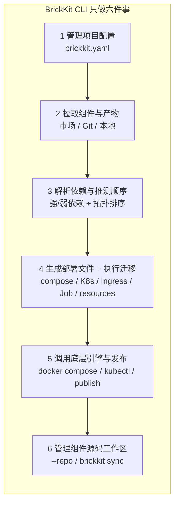
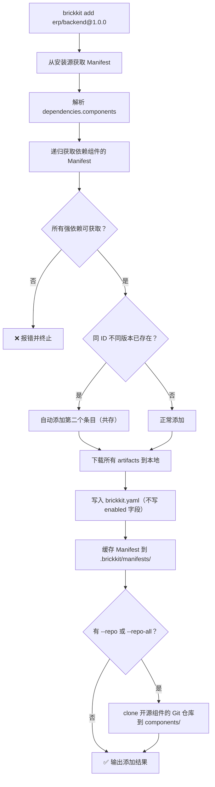
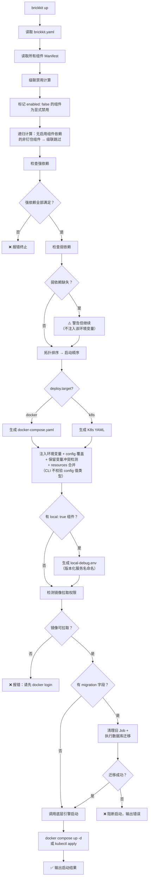
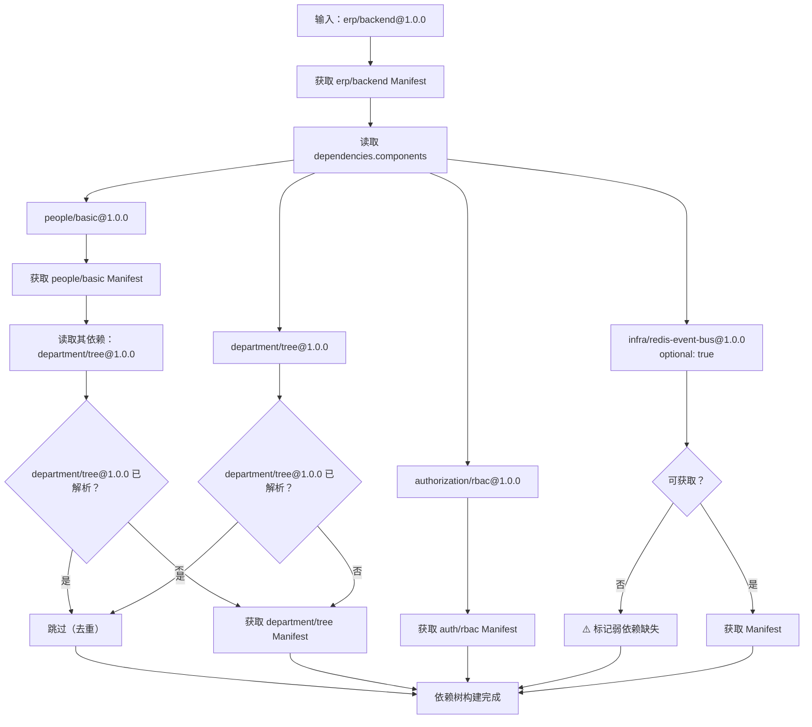
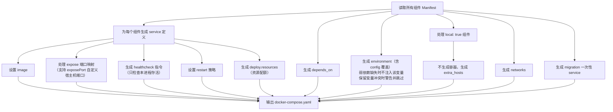
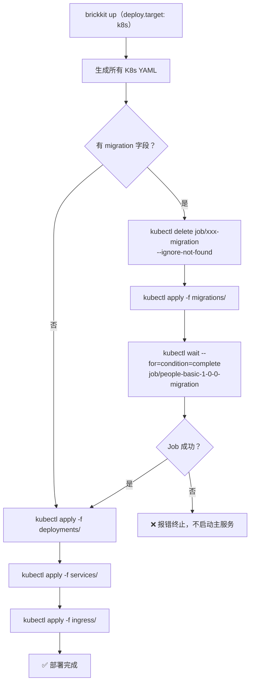
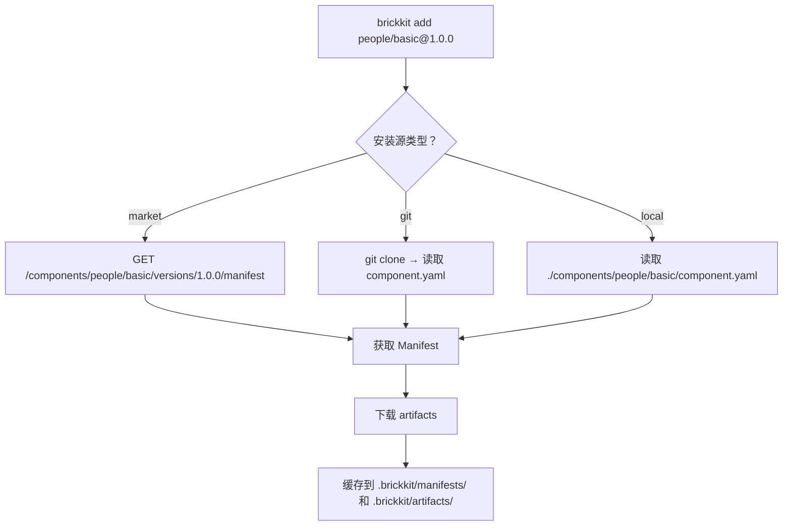

# 004 BrickKit CLI 设计

## 文档信息

| 项目 | 内容 |
| --- | --- |
| 文档编号 | 004 |
| 文档名称 | BrickKit CLI 设计 |
| 所属篇章 | 第四篇：核心工具（BrickKit CLI） |
| 版本 | 1.11.2 |
| 最后更新 | 2026-08-15 |
| 状态 | 定稿 |
| 依赖文档 | 001 平台理念与总体架构、002 组件规范、003 项目配置规范、012 架构设计原理与考量 |
| 被依赖文档 | 005 部署与运行规范、007 组件市场设计、009 组件开发快速入门、011 组件安装与拼装指南 |

---

## 1. CLI 定位

### 1.1 一句话定义

BrickKit CLI 是一个本地命令行工具，负责拉取组件、解析依赖、生成部署文件、执行数据库迁移、调用底层引擎启动/停止组件、管理组件源码工作区。

它不是常驻服务。执行完命令就退出，不占用后台资源。

### 1.2 核心特征

| 维度 | 说明 |
| --- | --- |
| 形态 | 本地二进制 / 脚本 |
| 运行时依赖 | 无（不需要数据库、Redis）；执行时依赖 Docker 或 kubectl |
| 服务发现 | Docker DNS / K8s Service DNS（不自建注册中心） |
| 健康检查 | K8s Probe / Compose healthcheck（不轮询） |
| 部署方式 | 调用 `docker compose` / `kubectl` 命令 |
| 状态存储 | brickkit.yaml（声明式）+ 底层引擎状态 |
| 端口暴露 | 无（CLI 不监听端口） |
| 认证存储 | `.brickkit/credentials`（`brickkit login` 生成） |

### 1.3 核心设计原则

| 原则 | 说明 |
| --- | --- |
| 无状态 | CLI 不持有运行时状态，每次执行从 brickkit.yaml + 底层引擎读取 |
| 声明式 | brickkit.yaml 描述"我想要什么"，CLI 负责"怎么实现" |
| 幂等 | 重复执行同一命令，结果一致 |
| 透明 | 生成的部署文件可人工审查，不黑盒 |
| 可离线 | 本地目录作为安装源时，不需要网络 |
| 平台提供工具，不替人做决定 | 多版本默认共存，brickkit.yaml 中有几个版本就启动几个容器；降级逻辑由组件自己实现；破坏性变更是组织协调问题 |
| 信任模型 | 安装组件即代表用户信任发布者，CLI 不做第三方组件安全审查 |
| configSchema 是说明书 | CLI 不校验 config 值的类型，写错了是使用者自己的责任 |
| 精确优于隐式 | 弱依赖缺失时完全不注入环境变量，不注入空字符串 |
| 保留变量保护 | config 覆盖的环境变量不得与平台保留变量冲突；冲突时警告但跳过，平台注入的值优先 |
| 资源配额透传 | CLI 将 Manifest 中 `deployment.resources` 和 brickkit.yaml 中 `components[].resources` 合并后透传给底层引擎，不校验合理性 |
| 产物透传 | CLI 将 Manifest 中声明的 artifacts 下载到本地，不解析文件内容，只负责存储和分发 |
| brickkit.yaml 就是声明 | 写了几个版本就启动几个容器；写了 `enabled: true` 就是钉住；没写就是可被级联 |
| 一个组件一个仓库 | 每个组件对应一个独立的 Git 仓库。不支持 monorepo 中拆分子目录。同一业务的多部分内容属于同一组件，一起移动、一起上传、一起发布 |

---

## 2. CLI 核心职责

### 2.1 六件事



| # | 职责 | 说明 |
| --- | --- | --- |
| 1 | 管理项目配置 | 维护 brickkit.yaml：组件列表、启用/禁用（三种状态）、本地调试、暴露声明、资源绑定、配置覆盖、资源配额覆盖、部署目标 |
| 2 | 拉取组件与产物 | 开源组件从 Git 仓库拉取；闭源组件从市场拉取配置 + 镜像引用；下载 artifacts（API 契约、SDK、文档等）到本地 |
| 3 | 解析依赖与推测顺序 | 递归解析依赖树；强依赖缺失报错；弱依赖缺失警告（不注入环境变量）；多版本默认共存；保留变量冲突检测；拓扑排序得出启动顺序 |
| 4 | 生成部署文件 + 执行迁移 | 自动生成 docker-compose.yaml 或 K8s YAML，注入环境变量，合并资源配额；执行数据库迁移（K8s Job / Docker 一次性 service）；生成 `local-debug.env`（如有 local: true 组件） |
| 5 | 调用底层引擎与发布 | `docker compose up/down`、`kubectl apply`、`brickkit publish` 上传市场 |
| 6 | 管理组件源码工作区 | `brickkit add --repo` / `--repo-all` clone 组件源码；`brickkit sync` 根据级联计算结果归档/激活组件源码；`brickkit remove` 自动删除源码目录 |

### 2.2 不做的事

| 不做的事 | 原因 |
| --- | --- |
| 不做常驻服务 | 无状态，避免单点与运维负担 |
| 不做注册中心 | Docker DNS / K8s Service DNS 天然替代 |
| 不做健康检查轮询 | K8s Probe / Compose healthcheck + 重启策略替代 |
| 不做 API 代理 / 路由 | 组件 DNS 直连 |
| 不做负载均衡 | Docker/K8s 原生支持 |
| 不做配置中心 | 环境变量注入即可；改配置就重启 |
| 不做通信治理（熔断/限流） | 组件自己的事 |
| 不做多租户 | 组件自己的事 |
| 不做版本范围解析 | 只接受精确版本 |
| 不做弱依赖降级逻辑 | 降级是组件自己的业务代码负责 |
| 不挂载 Docker Socket | CLI 只调用命令行，权限边界清晰 |
| 不做数据库迁移工具 | CLI 只执行迁移命令，不管迁移工具的选择和逻辑 |
| 不做第三方组件安全审查 | 信任模型：安装即信任，平台只做 `blocked` 下架 |
| 不校验 config 值的类型 | configSchema 是"配置说明书"，不是"安检机" |
| 不自动 docker login | 镜像拉取认证由用户手动 `docker login` 处理，CLI 只检测并提示 |
| 不校验 resources 合理性 | 资源配额是"推荐值"，CLI 透传，不校验 CPU/内存数值是否合理 |
| 不做健康检查内容校验 | `/healthz` 只检查本进程存活，CLI 不校验组件是否在健康检查中检查了外部依赖（这是组件开发者的责任） |
| 不解析 artifacts 文件内容 | CLI 只负责下载和存储 artifacts，不理解 proto / OpenAPI 等文件内容 |
| 不支持 monorepo | 一个组件 = 一个独立 Git 仓库。不支持在一个 Git 仓库中放置多个组件 |
| 不管理 Git 权限 | clone 后的 fork、remote 管理、push 操作完全由用户自己处理 |

---

## 3. 命令集设计

### 3.1 命令总览

| 命令 | 说明 | 核心行为 |
| --- | --- | --- |
| `brickkit init` | 初始化项目 | 生成 brickkit.yaml 骨架 |
| `brickkit add <组件@版本>` | 添加组件 | 递归拉取依赖，下载 artifacts，写入 brickkit.yaml（多版本默认共存，不写 enabled）。支持 `--repo` / `--repo-all` clone 源码 |
| `brickkit remove <组件>` | 移除组件 | 检查依赖方，从 brickkit.yaml 移除，自动删除源码目录 |
| `brickkit up` | 一键启动 | 级联禁用计算 + 生成部署文件 + 检测镜像权限 + 执行迁移 + 调用底层引擎启动 |
| `brickkit down` | 一键停止 | 调用底层引擎停止（**不删除 volume**） |
| `brickkit status` | 查看状态 | 读取底层引擎状态，展示组件运行表格（含多版本检测、级联跳过展示） |
| `brickkit order` | 查看启动顺序 | 展示依赖拓扑排序结果 |
| `brickkit sync` | 整理源码工作区 | 把用不上的组件源码收进 `components/.archived/`。`--only` 只保留指定组件及其强依赖，且不改 `brickkit.yaml` |
| `brickkit reset` | 重置配置 | 恢复 brickkit.yaml 到初始备份 |
| `brickkit login` | 登录市场 | 终端输入用户名密码，Token 存 `.brickkit/credentials` |
| `brickkit publish` | 发布组件 | 上传 Manifest + 镜像引用 + 产物文件到市场（需先 `brickkit login`） |

### 3.2 brickkit init

**用途：** 在当前目录初始化一个 BrickKit 项目。

```bash
brickkit init [项目名称]
```

**行为：**

1. 创建项目目录结构（见第 8 章），其中包含组件源码工作区 `components/`
2. 生成 brickkit.yaml 骨架，**自带一个指向 `./components` 的本地安装源**
3. 生成 `.brickkit/backup/brickkit.yaml.initial`（初始备份，供 reset 使用）

**为什么骨架自带本地源：** `init` 本来就会创建 `components/`，却不把它登记成安装源
——于是每个新项目都得先手工补一段 `sources` 才能做任何事，否则一上来就是
"没有可用的安装源"。指向自己刚建好的目录是唯一一个 CLI 能确保正确的安装源；
市场地址猜不到，因此以注释形式给出字段形状。

如果不传项目名称，CLI 报错：

```
❌ 请指定项目名称：brickkit init <项目名称>
```

**生成的 brickkit.yaml 骨架：**

```yaml
# brickkit.yaml - BrickKit 项目配置
project: my-project

deploy:
  target: docker          # docker | k8s

# 安装源：按声明顺序依次尝试，前一个找不到就试下一个（003 §6.5）
sources:
  - id: local-dev
    type: local
    path: ./components      # brickkit init 已经建好这个目录
  # 组件市场按需取消注释并填上地址：
  # - id: brickkit-market
  #   type: market
  #   url: https://market.example.com/api/v1

components: []
resources: []
```

**输出示例：**

```
✅ 项目已初始化：my-project
   📁 brickkit.yaml        项目配置
   📁 components/          组件源码（已配为本地安装源 local-dev）
   📁 .brickkit/           CLI 工作目录
   📁 .brickkit/backup/    配置备份

下一步：
  brickkit add --local               把 components/ 下的组件全加进来
  brickkit add people/basic@1.0.0    从安装源添加组件
  brickkit up                        一键启动
```

### 3.3 brickkit add

**用途：** 添加组件到项目，递归拉取所有依赖，下载产物文件。可选 clone 组件源码。

```bash
brickkit add <组件ID>[@<精确版本>]

brickkit add people/basic            # 不写版本：装安装源上最新的可安装版本
brickkit add --local                 # 把本地安装源里的组件一次全部添加
brickkit add people/basic@1.0.0
brickkit add erp/backend@1.0.0
brickkit add people/basic@1.1.0 --yes    # 非交互模式
brickkit add people/basic@1.0.0 --repo   # clone 该组件的完整 Git 仓库
brickkit add erp/backend@1.0.0 --repo-all  # clone 所有递归依赖的 Git 仓库
```

**不指定版本时取最新版：**

省略 `@<版本>` 时，CLI 在 **add 那一刻**把版本解析成一个具体版本，再照常安装；
写进 `brickkit.yaml` 的永远是解析出来的**精确版本**。配置里不会、也永远不能出现
`^1.0.0` 这类范围约束——那条规矩管的是"配置里写什么"，不是"命令行必须写什么"
（012 §2.2）。`brickkit add people/basic@^1.0.0` 照旧报错。

| 安装源类型 | 最新版怎么定 |
| --- | --- |
| `local` / `git` | 这两种源按 `<scope>/<name>` 定位，目录里只有一份 `component.yaml`，它写的是哪个版本，这个源能给的就只有那个版本 |
| `market` | `GET /api/v1/components/{id}/versions`，**先按状态筛掉装不上的**（`draft` / `blocked` / `deleted`；`deprecated` 能装，保留），再按版本号取最大 |

两条规则：

- **第一个有这个组件的安装源说了算**，不跨源比大小（003 §6.5）。跨源比会让"到底装了
  哪个源的东西"变得不可预测：本地源里正在开发的 `1.0.0` 会被市场上的 `9.9.9` 顶掉，
  而把本地源排在前面的人要的恰恰是相反的结果。
- **不用服务端 `/components/{id}` 的 `latestVersion` 字段**：那个字段只过滤了 `deleted`，
  `blocked` 的版本还在里面。拿它当默认版本会稳定解析到一个装不上的版本。

解析结果会打印出来，包括它来自哪个安装源：

```
$ brickkit add demo/hello
🔎 未指定版本，解析到 demo/hello@1.0.0（来自安装源 local-dev，类型 local）
📦 添加 demo/hello@1.0.0
```

**`--local`：一次把本地安装源里的组件全加进来**

本地开发时 `components/` 下往往躺着一批自己写的、或 `--repo` clone 下来的组件，
一个个 `add` 很烦。`brickkit add --local` 扫描所有 `type: local` 的安装源
（目录结构见 003 §6.4：`<scope>/<name>/component.yaml`），把扫到的组件全部添加：

```
$ brickkit add --local
🔍 从本地安装源 local-dev 扫到 4 个组件
📦 添加 demo/hello@1.0.0
   ├── Manifest ✅
   └── artifacts ✅（1 个文件）
📦 添加 demo/caller@1.0.0
   ├── Manifest ✅
   ├── 依赖 demo/hello@1.0.0 ✅ 已拉取
   └── artifacts ✅（1 个文件）
⏭️ people/basic@1.0.0 已在 brickkit.yaml 中
⚠️ department/tree 本地是 2.0.0，配置里是 1.0.0 —— 已跳过
   要共存请显式执行 brickkit add department/tree@2.0.0
✅ 已写入 brickkit.yaml（2 个组件）
```

**扫描规则：**

| 情况 | 处理 |
| --- | --- |
| 点开头的目录（`.archived/`、`.git/`） | 跳过。默认约定里 local 源就指向 `./components`，而 `brickkit sync` 的归档目录就在那底下——归档的组件不该被 `--local` 拽回来 |
| 目录名拼不出合法组件 ID | 跳过。非法 ID 进不了 `brickkit.yaml`，扫出来只会在后面炸 |
| 目录里没有 `component.yaml` | **静默**跳过。那只是个普通目录，不是"坏组件" |
| `component.yaml` 解析失败 | 跳过，但**点名报出来**（见下） |
| `metadata.id` 与目录对不上 | 同上 |
| `metadata.version` 不是精确版本 | 同上 |
| 同 ID 出现在多个本地源 | 靠前的源赢（003 §6.5），与 Manifest 取源规则一致 |

**"像组件、但用不了"的目录必须出声：**

```
$ brickkit add --local
⚠️ demo/broken 跳过：metadata.version 不是精确版本：latest
   来自安装源 local-dev；修好它再执行一次 brickkit add --local
🔍 从本地安装源 local-dev 扫到 1 个组件
```

静默跳过是不行的：`components/` 下明明躺着两个目录，CLI 却说"扫到 1 个"，
少的那个连名字都不出现——使用者只会去翻安装源配置，而问题在他自己刚写的
那份 `component.yaml` 里。**同理，`brickkit add <组件ID>` 不写版本时，
组件在、`component.yaml` 却用不了，报的是"component.yaml 用不了 + 具体原因"，
而不是"组件未找到"**——两者该让人去看的地方完全不同。

**跳过与中止：**

- **已在配置中的同版本组件** → 静静跳过（`⏭️`）
- **同 ID 但版本不同** → 跳过并单独提示。批量命令不替使用者决定多起一个容器；
  真要共存，显式 `brickkit add <id>@<版本>`
- **任一组件解析失败** → **整体中止，`brickkit.yaml` 一个字节不动**，并点名是哪个组件卡住了。
  半份配置比没有配置更难收拾

**两条互斥规则：**

- `--local` 不接组件 ID —— 批量添加和添加单个组件说的是两件事
- `--local` 不能与 `--repo` / `--repo-all` 同用 —— 本地安装源里的组件源码本来就在盘上
  （默认约定里 local 源就指向 `./components`），`--repo` 想 clone 到的正是同一个位置，
  而 `Clone` 遇到已存在的目录会直接报错阻断

**同 ID 已装了别的版本时先问一句：**

```
$ brickkit add people/basic
🔎 未指定版本，解析到 people/basic@2.0.0（来自安装源 brickkit-market，类型 market）
⚠️ people/basic 已有 1.0.0，将新增 2.0.0 与之共存（多起一个容器）
   继续？[y/N]:
```

显式写版本号的人知道自己在搞多版本共存；不写版本号的人多半没这个预期，而共存会
真的多起一个容器。`--yes` 时不问，直接共存。解析出的版本恰好就是已装的那个时，
走原本的"已存在，是否刷新缓存"分支，不提共存。

**参数：**

| 参数 | 说明 |
| --- | --- |
| `--yes` / `-y` | 非交互模式。跳过所有确认提示，直接执行添加。适用于 CI/CD 环境 |
| `--refresh` | 强制重新拉取 Manifest 和 artifacts，忽略缓存 |
| `--repo` | 额外 clone 指定组件的完整 Git 仓库到 `components/` 目录。仅对开源组件（`sourceType: git`）有效。闭源组件报错阻断 |
| `--repo-all` | clone 所有递归依赖中开源组件的完整 Git 仓库到 `components/` 目录。闭源组件跳过并提示 |
| `--local` | 把本地安装源（`type: local`）里的组件一次全部添加。不接组件 ID，也不能与 `--repo` / `--repo-all` 同用 |

**行为流程：**



**详细步骤：**

1. **解析组件 ID 和版本：** `people/basic@1.0.0` → ID=`people/basic`，版本=`1.0.0`。
   省略 `@<版本>` 时先按上面的规则解析出最新可安装版本，之后的步骤完全相同
2. **从安装源获取 Manifest：**
   - 市场（http）：`GET /api/v1/components/{id}/versions/{ver}/manifest`
   - Git 仓库：`git clone` 后读取 `component.yaml`
   - 本地目录：直接读取 `component.yaml`
3. **递归解析依赖：** 读取 Manifest 中 `dependencies.components`，对每个依赖重复步骤 2
4. **强依赖检查：** 如果任何强依赖无法获取，报错终止
5. **弱依赖检查：** 如果弱依赖无法获取，输出警告但继续
6. **多版本处理：** 如果 brickkit.yaml 中已存在同 ID 不同版本的条目，自动添加第二个条目（共存）
7. **下载 artifacts：** 读取所有 Manifest 中的 `artifacts` 字段，下载所有产物文件到 `.brickkit/artifacts/<版本化服务名>/`
8. **写入 brickkit.yaml：** 将组件及其依赖添加到 `components` 列表（不写 `enabled` 字段）
9. **缓存 Manifest：** 将所有拉取到的 Manifest 存储到 `.brickkit/manifests/`
10. **clone 源码（如有 `--repo` / `--repo-all`）：**
    - `--repo`：只 clone 指定的组件。如果该组件是闭源组件（`sourceType: registry`），报错阻断
    - `--repo-all`：clone 所有递归依赖中的开源组件。闭源组件跳过并输出提示
    - clone 目标目录：`components/<scope>/<name>/`
    - 如果目标目录已存在，报错阻断（一个组件 ID 只能有一个源码目录）
    - 如果组件已在 brickkit.yaml 中（再次 add + `--repo`），不重复写入 brickkit.yaml，只执行 clone

**多版本共存行为：**

| 场景 | CLI 行为 |
| --- | --- |
| `brickkit add X@2.0.0`（不存在） | ✅ 正常添加 |
| `brickkit add X@1.0.0`（已有 X@1.0.0，相同版本） | 提示已存在，询问是否刷新缓存（`--yes` 跳过确认直接刷新） |
| `brickkit add X@2.0.0`（已有 X@1.0.0，不同版本） | ✅ 自动添加第二个条目（共存），输出提示信息 |
| 递归解析发现 A 依赖 X@1.0.0，B 依赖 X@2.0.0 | ✅ 自动把两个版本都写入 brickkit.yaml（共存） |

**`--repo` / `--repo-all` 行为：**

| 场景 | CLI 行为 |
| --- | --- |
| `--repo` 指定开源组件 | ✅ clone 完整 Git 仓库到 `components/<scope>/<name>/` |
| `--repo` 指定闭源组件 | ❌ 报错阻断（闭源组件没有 Git 仓库） |
| `--repo-all` 遇到开源组件 | ✅ clone |
| `--repo-all` 遇到闭源组件 | ⏭️ 跳过并输出提示 |
| 目标目录已存在 | ❌ 报错阻断（一个组件 ID 只能有一个源码目录） |
| 组件已在 brickkit.yaml 中，再次 add + `--repo` | 不重复写入 brickkit.yaml，只执行 clone |

**输出示例（`--repo`）：**

```
$ brickkit add people/basic@1.0.0 --repo
📦 添加 people/basic@1.0.0
   ├── Manifest ✅
   └── artifacts ✅（1 个文件：openapi.json）
📁 已 clone 源码到 components/people/basic/
✅ 已写入 brickkit.yaml（1 个组件）
💡 如需修改源码并上传，请参考文档"修改开源组件源码后如何上传"
```

**输出示例（`--repo-all`）：**

```
$ brickkit add erp/backend@1.0.0 --repo-all
📦 添加 erp/backend@1.0.0
   ✅ erp/backend         → clone 完成（components/erp/backend/）
   ✅ people/basic        → clone 完成（components/people/basic/）
   ✅ department/tree     → clone 完成（components/department/tree/）
   ⏭️ authorization/rbac  → 闭源组件，跳过 clone
   ✅ infra/redis-event-bus → clone 完成（components/infra/redis-event-bus/）
✅ 已写入 brickkit.yaml（5 个组件）
📁 已 clone 4 个开源组件仓库（跳过 1 个闭源组件）
```

**输出示例（`--repo` 指定闭源组件）：**

```
❌ clone 失败：该组件为闭源组件
   组件：authorization/rbac@1.0.0
   来源类型：registry（闭源）
   原因：闭源组件没有 Git 仓库，无法 clone 源码
   💡 你仍然可以正常安装和使用该组件（不含 --repo）：
      brickkit add authorization/rbac@1.0.0
```

**输出示例（目标目录已存在）：**

```
❌ clone 失败：目录已存在
   组件：people/basic@1.0.0
   目录：components/people/basic/
   原因：该目录已存在，可能包含你正在开发的组件源码
   建议：
   1. 如果是误操作，请先删除或重命名该目录
   2. 如果已有源码，无需再次 clone
```

**输出示例（正常添加）：**

```
📦 添加 erp/backend@1.0.0
   ├── 依赖 people/basic@1.0.0 ✅ 已拉取
   │   ├── Manifest ✅
   │   └── artifacts ✅（1 个文件：openapi.json）
   ├── 依赖 department/tree@1.0.0 ✅ 已拉取
   │   ├── Manifest ✅
   │   └── artifacts ✅（2 个文件：department.proto, openapi.json）
   ├── 依赖 authorization/rbac@1.0.0 ✅ 已拉取
   │   ├── Manifest ✅
   │   └── artifacts ✅（2 个文件：rbac.proto, openapi.json）
   └── 弱依赖 infra/redis-event-bus@1.0.0 ✅ 已拉取
✅ 已写入 brickkit.yaml（5 个组件）
📁 已下载 artifacts 到 .brickkit/artifacts/（5 个文件）
ℹ️ 提示：infra/redis-event-bus 是弱依赖，已写入配置但**默认不会启动**（003 §4.3）
   需要它时给它写 enabled: true
```

**关键规则：** `brickkit add` 自动添加的组件不写 `enabled` 字段。只有用户手动加上 `enabled: true` 才是"钉住"的显式意图。

### 3.4 brickkit remove

**用途：** 从项目中移除组件，同时删除对应的源码目录（活跃的与已归档的）。

```bash
brickkit remove <组件ID>
brickkit remove people/basic
brickkit remove people/basic@1.0.0    # 多版本共存时指定版本
```

**行为：**

1. 检查是否有其他组件依赖该组件（强依赖）
2. 如果有依赖方，阻止移除并提示
3. 如果无依赖方，从 brickkit.yaml 中移除
4. 解除 `resources[].bindings` 中指向它的绑定（同 ID 还有别的版本时保留）
5. 清理对应的 Manifest 缓存
6. 清理 `.brickkit/artifacts/` 中对应组件的产物缓存目录
7. 自动删除源码目录（如果存在）：活跃的 `components/<scope>/<name>/`，以及被
   `brickkit sync` 归档到 `components/.archived/<scope>/<name>/` 的那一份

> **为什么归档目录也要删：** `brickkit sync` 只整理 `brickkit.yaml` 中声明过的组件。
> 组件一旦被 remove，sync 就再也不认识它了——归档目录里那份源码不在这里清掉，
> 就成了永远没人回收的孤儿，组件一多 `components/.archived/` 就全是坟头。

> **为什么绑定也要解除：** 组件没了，指着它的那条绑定就是一条谁也用不上的配置。
> 留着它不是"无害的残留"——它曾经会让**此后每一条命令**都在解析阶段失败
> （"组件未在 components 中声明"），而那句报错说的是资源配置，
> 与使用者刚做的事完全对不上号。一条报成功的 `remove` 把项目锁死，
> 是这个命令能造成的最糟的结果。
>
> **只解除、不删资源声明**：库还在那儿跑着，只是这个项目暂时不用它了。
> 最后一条绑定被解除后留下 `bindings: []`。
>
> **多版本共存时不动**：绑定按组件 ID 记（不带版本，003 §5.3），
> 剩下的版本还要用它。

**多版本共存时的版本指定：**

当同一组件 ID 存在多个版本时，必须指定版本：

```bash
brickkit remove people/basic@1.0.0    # 指定版本
```

如果不指定版本且存在多版本，CLI 报错：

```
❌ people/basic 存在多个版本（1.0.0, 2.0.0），请指定版本：
   brickkit remove people/basic@1.0.0
```

**输出示例（有依赖方）：**

```
❌ 无法移除 department/tree
   以下组件强依赖它：
   - people/basic
   - authorization/rbac
   请先移除依赖方。
```

**输出示例（成功）：**

```
✅ 已移除 people/basic@1.0.0
   🗑️ 已解除资源绑定：postgres-main
   🗑️ 已删除源码目录 components/people/basic/
   🗑️ 已清理 Manifest 缓存
   🗑️ 已清理 artifacts 缓存
```

**输出示例（源码此前已被 `brickkit sync` 归档）：**

```
✅ 已移除 people/basic@1.0.0
   🗑️ 已删除归档源码目录 components/.archived/people/basic
   🗑️ 已清理 Manifest 缓存
   🗑️ 已清理 artifacts 缓存
```

### 3.5 brickkit up

**用途：** 生成部署文件、检测镜像权限、执行数据库迁移并一键启动所有组件。

```bash
brickkit up
brickkit up --only people/basic,department/tree   # 只启动指定组件
brickkit up --only people/basic@1.0.0             # 只启动指定版本
brickkit up --dry-run                              # 只生成文件，不启动
brickkit up --config brickkit.prod.yaml            # 使用指定配置文件
```

**参数：**

| 参数 | 说明 |
| --- | --- |
| `--only X,Y` | 只启动指定组件及其依赖。支持 `@版本` 写法（如 `people/basic@1.0.0`）。如果 `--only` 指定的组件是 `enabled: false`，报错阻断 |
| `--dry-run` | 只生成部署文件，不启动 |
| `--context <名字>` | kubeconfig 上下文，覆盖 `deploy.context`。**仅 `deploy.target: k8s` 下有意义**——用于同一份配置切换集群（005 §9） |
| `--config <file>` | 指定项目配置文件（默认读取 `brickkit.yaml`）。用于多环境部署。生成的部署文件和备份仍写入默认的 `.brickkit/` 目录 |

**行为流程：**



**级联禁用逻辑（CLI 在 `brickkit up` 时自动计算）：**

一个组件实际启动，当且仅当满足以下任一条件：

1. 它是显式钉住的（`enabled: true`）
2. 它是根组件（**没有任何组件依赖它**，强弱都算）且未被显式关闭
3. 至少有一个正在启动的组件**强依赖**它，且它未被显式关闭

一个组件被级联跳过，当且仅当以上三条都不成立。

⚠️ **只被弱依赖引用的组件不会被自动拉起**（003 §4.3）：它既不是根组件
（有人指着它），也没有谁**强依赖**它。要它跑就显式写 `enabled: true`。

**`--only` 行为：**

| 场景 | CLI 行为 |
| --- | --- |
| `--only people/basic`（存在多个版本） | 启动 people/basic 的所有版本 |
| `--only people/basic@1.0.0` | 只启动 1.0.0 版本 |
| `--only` 指定的组件是 `enabled: false` | ❌ 报错阻断 |

**`--only` 遇到 `enabled: false` 时的报错：**

```
❌ 无法启动指定的组件：
   组件 people/basic@1.0.0 在 brickkit.yaml 中被显式禁用（enabled: false）。
   如需启动，请先在 brickkit.yaml 中移除 enabled: false 或将其设为 enabled: true。
```

**`up` 不做启动前的资源体检。**

曾经有个 `--check-resources` 参数干这件事（拨号探资源 + 探宿主机端口占用），
只警告不阻断。它被**整个删掉**了，两半各有各的理由：

| 那一半 | 为什么删 |
| --- | --- |
| 资源可达性 | 006 §8.3 自己就论证过它证明不了什么——组件用的是**自己那套凭据**、从**容器网络里**连，CLI 从宿主机用另一套凭据连成功，说明不了组件也能连成功。006 §12.3 更直接：**组件（或迁移容器）的失败信息比这个探测结论准确**。而 `host: localhost` 时它给的是**反的**答案：宿主机上通，容器里连的却是它自己 |
| 宿主机端口占用 | docker 会为它发布的**每一个**端口报出清楚的 `port is already allocated`。这个检查唯一多覆盖的是 `local: true` 组件自己监听的端口——而那一类的典型命中恰恰是**开发者自己刚启动的那个进程**（先 `up`、启动 IDE 进程、再 `up` 一次）。它给的还是一句错话："启动时会因为端口冲突失败"，可那个端口根本没有容器会去 bind |

一个必须显式请求、只会警告、结论还不如不用它时准确的检查，不值得让所有人
在文档里多读一段。**"资源在不在"由组件自己的失败回答，那句话最准确。**

`up` 每次都会把"要先跑起来什么"列出来（006 §9.1、§9.5），那一半的价值保留了下来——
它是**声明**（这些东西得先在），不是**探测**（我替你连一下看看）。

**输出示例：**

```
🚀 启动项目 my-project（deploy.target: docker）
 📋 组件状态计算：
    ✅ department/tree@1.0.0           启动
    ✅ authorization/rbac@1.0.0        启动（显式钉住）
    ✅ people/basic@1.0.0              启动
    ✅ erp/backend@1.0.0               启动
    ✅ portal/user-frontend@1.0.0      启动
    ⬜ infra/redis-event-bus@1.0.0     显式禁用
 📋 启动顺序：
    1. department-tree-1-0-0       无依赖
    2. people-basic-1-0-0          ← 依赖 1
    3. auth-rbac-1-0-0             ← 依赖 1, 2
    4. erp-backend-1-0-0           ← 依赖 1, 2, 3
    5. portal-user-frontend-1-0-0  ← 依赖 4
 ⚠️ 弱依赖未启动：infra/redis-event-bus（erp-backend 的异步功能不可用）
    （该组件的环境变量不会被注入，组件需自行降级处理）
 🔍 检测镜像拉取权限... ✅ 全部通过
 📄 已生成：.brickkit/generated/docker-compose.yaml
 📄 已生成：.brickkit/generated/local-debug.people-basic-1-0-0.env（people/basic 为 local: true）
 🔧 启动前会执行的数据库迁移（失败则该组件不会启动）：
    people/basic@1.0.0   python manage.py migrate
    erp/backend@1.0.0    python manage.py migrate
 🐳 正在启动（docker）...
    department-tree-1-0-0       running（healthy）
    people-basic-1-0-0          running（healthy）
    auth-rbac-1-0-0             running（healthy）
    erp-backend-1-0-0           running（healthy）
    portal-user-frontend-1-0-0  running（healthy）
 ✅ 全部组件已启动（5 个）
 💡 查看状态：brickkit status
 💡 查看日志：docker compose -p brickkit-my-project -f .brickkit/generated/docker-compose.yaml logs -f
 💡 本地调试：在 IDE 中加载 .brickkit/generated/local-debug.people-basic-1-0-0.env 启动 people/basic
```

**迁移由谁执行：** Docker 目标下，CLI **不自己跑迁移**——它把迁移写成部署文件里的一次性 service，主服务用 `service_completed_successfully` 等它成功退出（002 §8.3）。因此 `up` 的输出是"这次会执行哪些迁移"，而不是逐条打勾；迁移失败时该组件停在 `Created`，去看它的 `-migration` 容器日志。K8s 目标下对应的是 Job。

**启动完成的判定：** CLI 用 `up -d --wait` 等到全部容器 running/healthy 才返回，然后再查一次状态逐个汇报。少了 `--wait` 的话，依赖链末端的组件此刻多半还是 `health: starting`，紧接着查状态会得到一个假的失败结论。

### 3.5.1 升级时的额外行为

当 `brickkit up` 发现 brickkit.yaml 里某个组件的版本**本地还没有**（`.brickkit/manifests/` 里有它的其他版本、却没有当前这个版本），即判定为升级，执行以下额外步骤：

> **为什么判据是"本地有没有"而不是"版本号变过没有"：** CLI 不持有运行时状态（§1.3），它记不住上一次跑的是哪个版本。这条判据同时让两种情况自然地**不算**升级：首次安装（缓存里一个版本都没有）、缓存被清空。改回一个装过的版本也不再重复走流程——该拉的都在本地了，但仍会照常按新配置启动那个版本。

```
1. 从安装源获取新版本 Manifest（如果本地缓存中没有）
2. 缓存新版本 Manifest 到 .brickkit/manifests/
3. 下载新版本的所有 artifacts 到 .brickkit/artifacts/<新版本化服务名>/（如果本地缓存中没有）
4. 检查依赖兼容性（见 002 组件规范 §7.7）
5. 检查新版本是否声明了 migration.command
6. 重新生成部署文件
7. 停止旧版本容器
8. 执行数据库迁移（如有）
9. 启动新版本容器
```

**依赖兼容性检查内容：**

| # | 检查项 | 说明 | 失败时行为 |
| --- | --- | --- | --- |
| 1 | 新版本 Manifest 可获取 | CLI 从安装源获取新版本的 component.yaml | ❌ 报错阻断 |
| 2 | 新版本的强依赖可满足 | 新版本 Manifest 中声明的所有强依赖，都能从安装源获取 | ❌ 报错阻断 |
| 3 | 新版本的资源依赖已绑定 | 新版本 Manifest 中声明的资源依赖（kind + engine），在 brickkit.yaml 的 resources 中已声明且已绑定给该组件 | ❌ 报错阻断 |
| 4 | 新版本的弱依赖可获取 | 新版本 Manifest 中声明的弱依赖，尝试从安装源获取 | ⚠️ 警告但继续 |
| 5 | 新版本无循环依赖 | 新版本的依赖树中不存在循环依赖 | ❌ 报错阻断 |

**CLI 不检查的内容：**

| 不检查的内容 | 原因 |
| --- | --- |
| API 兼容性 | 平台不理解组件的 API，无法判断新旧版本 API 是否兼容 |
| 数据库结构兼容性 | 平台不解析迁移脚本内容 |
| configSchema 值兼容性 | configSchema 是"配置说明书"，CLI 不校验 config 值类型 |
| 调用方 Manifest 中的依赖版本 | 调用方的 Manifest 中写的是精确版本，升级被依赖组件不影响调用方（见 002 §7.8） |

**`brickkit up --dry-run` 升级变更摘要：**

当 `--dry-run` 检测到版本变更时，额外输出变更摘要：

```
📋 升级变更摘要：
   people/basic: 1.0.0 → 1.1.0
   ├── 依赖变更：无
   ├── 新增配置项：enableNotification（默认 true）
   ├── 删除配置项：无
   ├── 数据库迁移：python manage.py migrate
   ├── artifacts 变更：openapi.json 更新
   └── 资源配额变更：无
```

此摘要仅用于信息展示，不阻断任何操作。

**升级时 artifacts 的处理：**

| 操作方式 | artifacts 行为 |
| --- | --- |
| 方式 1：修改 brickkit.yaml 版本号 → `brickkit up` | CLI 获取新版本 Manifest。如果新版本的 artifacts 不在本地缓存中，CLI 自动从安装源下载到 `.brickkit/artifacts/<新版本化服务名>/` |
| 方式 2：`brickkit add X@新版本` | CLI 自动下载新版本的所有 artifacts（与首次安装行为一致） |

**关键规则：**

- 每个版本的 artifacts 独立存储（按版本化服务名区分），互不覆盖
- 旧版本的 artifacts 不会被删除（保留在 `.brickkit/artifacts/<旧版本化服务名>/`）
- 升级后，调用方如需使用新版本的 API 契约，需要重新读取 `.brickkit/artifacts/<新版本化服务名>/` 中的文件
- `brickkit remove` 时清理对应版本的 artifacts 缓存

**升级时 configSchema 变更的处理：**

| 变更类型 | CLI 行为 | 说明 |
| --- | --- | --- |
| 新增配置项 | 使用 configSchema 中的默认值 | 无需用户操作 |
| 删除配置项 | brickkit.yaml 中对应的 config 覆盖值被忽略 | CLI 不注入该变量，不报错，不警告 |
| 修改配置项类型 | CLI 不校验类型，原样注入 | configSchema 是"配置说明书"，不是"安检机" |
| 修改配置项默认值 | 如果 brickkit.yaml 中没有覆盖，使用新默认值 | 如果 brickkit.yaml 中有覆盖，使用覆盖值 |

**升级时调用方 Manifest 的处理：**

由于 BrickKit 使用精确版本，升级被依赖组件**不会自动影响调用方**。

| 情况 | 行为 |
| --- | --- |
| 只升级 B（brickkit.yaml 中 B 的版本改为 2.0.0） | A 仍然调用 B@1.0.0。如果 brickkit.yaml 中只保留了 B@2.0.0 而移除了 B@1.0.0，A 的强依赖无法满足，CLI 报错阻断 |
| 升级 B 并保留旧版本（多版本共存） | A 继续调用 B@1.0.0，其他组件可以调用 B@2.0.0 |
| 让 A 调用 B@2.0.0 | 必须修改 A 的 component.yaml，将依赖改为 `B@2.0.0`，重新构建并发布 A 的新版本 |

**核心规则：** 调用方 Manifest 中的依赖版本是精确的。升级被依赖组件后，调用方不会自动切换。如果调用方需要使用新版本，必须显式修改自己的 Manifest 并发布新版本。

### 3.6 brickkit down

**用途：** 一键停止所有组件。

```bash
brickkit down
brickkit down --only people/basic   # 只停止指定组件
```

**参数：**

| 参数 | 说明 |
| --- | --- |
| `--only X,Y` | 只停止指定组件。写法与 `up --only` 一致 |
| `--context <名字>` | kubeconfig 上下文，覆盖 `deploy.context`。仅 `deploy.target: k8s` 下有意义 |

**行为：**

- Docker：`docker compose -p brickkit-my-project -f .brickkit/generated/docker-compose.yaml down`
- K8s：`kubectl delete -f .brickkit/generated/k8s/`

**停止顺序：** 与启动顺序相反（依赖方先停，被依赖方后停）。反过来的话，被依赖方先没了，依赖方在关闭过程中还在调它，日志里会留下一串没有意义的连接错误。

整个项目一起停时顺序交给引擎——compose 本身就按依赖倒序停；`--only` 时由 CLI 排出倒序再交给引擎。

⚠️ **`--only` 停部分组件用的是 `rm -sf` 而不是 `down`。** `down` 会把项目网络一起拆掉，剩下还在跑的组件会瞬间失去彼此。

**重要：`brickkit down` 不删除 volume（数据库数据）。** 等价于 `docker compose down`（不带 `-v` 参数）。数据库数据始终保留。如需彻底清理，请手动执行 `docker volume rm` 或 `docker compose down -v`。

### 3.7 brickkit status

**用途：** 查看当前项目所有组件的运行状态。

```bash
brickkit status
```

**行为：**

- Docker：调用 `docker compose ps` 解析输出
- K8s：调用 `kubectl get pods -l brickkit.io/project=<项目名>` 解析输出

**输出示例：**

```
📊 项目状态：my-project（deploy.target: docker）

✅ 运行中（2 个组件）
 ┌─────────────────┬───────┬───────────────────┬──────────────────────────┐
 │ 组件            │ 版本  │ 状态              │ 端口                     │
 ├─────────────────┼───────┼───────────────────┼──────────────────────────┤
 │ department/tree │ 1.0.0 │ 运行中（healthy） │ 8080/tcp                 │
 │ people/basic    │ 1.0.0 │ 运行中（healthy） │ 0.0.0.0:18092->8080/tcp  │
 └─────────────────┴───────┴───────────────────┴──────────────────────────┘

❌ 未在运行（1 个组件）
 ┌─────────────┬───────┬───────────────────┐
 │ 组件        │ 版本  │ 状态              │
 ├─────────────┼───────┼───────────────────┤
 │ erp/backend │ 1.0.0 │ exited（退出码 1）│
 └─────────────┴───────┴───────────────────┘
   看日志定位：docker compose -p brickkit-my-project -f .brickkit/generated/docker-compose.yaml logs <服务名>

⬜ 未启动（1 个组件）
 ┌───────────────────────┬───────┬──────────────────────┐
 │ 组件                  │ 版本  │ 原因                 │
 ├───────────────────────┼───────┼──────────────────────┤
 │ infra/redis-event-bus │ 1.0.0 │ 显式禁用（enabled: false）│
 └───────────────────────┴───────┴──────────────────────┘

🔧 本地调试（local: true，不由平台启动）
 ┌──────────────┬───────┬──────────────────────────────┐
 │ 组件         │ 版本  │ 本地地址                     │
 ├──────────────┼───────┼──────────────────────────────┤
 │ people/basic │ 1.0.0 │ localhost:8081（IDE 调试模式）│
 └──────────────┴───────┴──────────────────────────────┘

📦 资源状态
 ┌───────────────┬──────────┬──────────────────────────────┐
 │ 资源          │ 类型     │ 状态                         │
 ├───────────────┼──────────┼──────────────────────────────┤
 │ postgres-main │ database │ 可达（容器 postgres 运行中） │
 └───────────────┴──────────┴──────────────────────────────┘
```

**表格里刻意不用 `●` / `○` 这类符号。** 它们在 Unicode 里是"东亚宽度：模糊"，同一个字符在不同终端下可能占 1 格也可能占 2 格，进了表格就对不齐。表格内容限制在"汉字 + 全角括号 + ASCII"（宽度确定），状态标记放在表格外的小节标题里（✅ / ❌ / ⬜）。列宽按内容自适应。

**资源可达性怎么判：** Docker 目标下一律真的 TCP 拨一次号；K8s 目标下只把地址列出来
（集群内的 DNS 名，开发者本机解析不了，005 §5.5.1）。

从前这里按"`host` 含不含点"分成两类，托管的看容器状态、外部的才拨号。
平台不再部署基础资源之后（006 §10.1），所有资源都在容器网络之外，
拨号成了唯一说得通的判据，那条分叉也就没有了。

**迁移容器（`-migration`）不出现在组件列表里：** 它是平台的实现细节；使用者装的是组件，看到的也该是组件。基础资源不由平台部署，单列一节汇报可达性。

**`local: true` 的组件单列一节。** 它们没有容器，引擎里查不到——不单独说一句的话，使用者会以为这些组件"消失了"。没写 `localPort` 时显示的是组件声明的主端口（005 §4.6）。

### 3.8 brickkit order

**用途：** 查看当前项目的启动顺序和依赖拓扑。

```bash
brickkit order
```

**输出示例：**

```
📋 启动顺序（拓扑排序）：
   1. department-tree-1-0-0       无依赖
   2. people-basic-1-0-0          ← 依赖 1
   3. auth-rbac-1-0-0             ← 依赖 1, 2
   4. erp-backend-1-0-0           ← 依赖 1, 2, 3
   5. portal-user-frontend-1-0-0  ← 依赖 4

可独立启动：1（无依赖）
只被弱依赖引用（默认不启动，需要时写 enabled: true）：infra/redis-event-bus
必须最后启动：erp-backend（依赖最多）

依赖图：
   erp-backend → people-basic → department-tree
              → auth-rbac → department-tree
              → infra/redis-event-bus（弱）
   portal-user-frontend → erp-backend
```

### 3.9 brickkit sync

**用途：** 把当前用不上的组件源码从 `components/` 收进 `components/.archived/`，需要时再移回来。

```bash
brickkit sync --only people/basic          # 这几天只搞这几个（不改 brickkit.yaml）
brickkit sync --only people/basic,demo/hello
brickkit sync                              # 回到与 brickkit up 一致（也是 --only 之后的恢复）
```

**参数：**

| 参数 | 说明 |
| --- | --- |
| `--only X,Y` | 只保留指定组件**及其强依赖**，其余全部归档。写法与 `up --only` 一致（支持 `@版本`）。**不修改 `brickkit.yaml`** |

#### 3.9.1 这是开发期最常用的命令，不是收尾时的清洁工

一个项目一辈子 deploy 不了几次，而"今天我只动这几个组件"每天都在发生。
组件到几十个之后，那些当下根本不碰的源码仍然堆在 `components/` 下——
IDE 索引、全局搜索、`git status` 全被它们拖着，让 AI 读代码时它也得先把
几十份都扫一遍才知道哪个相关。

关键不在于"藏起来"，而在于**挪进一个固定的位置**：不打开就不用关心，
要找时又一眼知道在哪。归档目录因此是写死的 `components/.archived/`，
而不是让使用者配。

#### 3.9.2 为什么需要 `--only`，而不是"改 enabled 再 sync"

不带 `--only` 时，"留哪些"完全由 `brickkit.yaml` 里的 `enabled` 决定。于是
"这两天只搞人员组件"要先把不想要的根组件逐个写上 `enabled: false`，
再把想要的写上 `enabled: true`（不写会被级联一起跳过，见 003 §4.3）。
试用指南 02 演示这件事时，十个组件动了八行。

问题不在行数，在于**改的是哪个文件**：

| | `brickkit.yaml` | "我今天看哪几个组件" |
| --- | --- | --- |
| 归属 | 团队共享，提交进 Git（003 §10.2） | 个人的 |
| 时效 | 长期的部署声明 | 临时的 |
| 决定 | **跑什么** | **看什么** |

绑在一起只剩两个坏选项：把个人偏好提交上去（队友拉下来发现半个系统被关了），
或者背一个永远脏着的 diff。`--only` 把它摘出来——只动目录，不动配置。

#### 3.9.3 与 `up --only` 的一处刻意不同

`up --only` 点到 `enabled: false` 的组件会**报错**（两个意图直接冲突，见 §3.5）。
`sync --only` **不报错**：`up` 决定"跑什么"，`sync` 决定"看什么"，
而"我要看一个已经关掉的组件的源码"完全说得通——多数时候正是因为要重写它
才把它关掉的。在这里报错等于把最常见的用法堵死。

其余语义两者一致：都接受 `<id>` 与 `<id>@<版本>`，都取**强依赖闭包**
（点名的组件 + 它们的强依赖）。

**核心规则：**

| 规则 | 说明 |
| --- | --- |
| 判断依据 | 复用 `brickkit up` 的级联计算逻辑。级联计算后会启动的组件保留在活跃目录，不会启动的组件归档 |
| 双向操作 | 归档 + 激活。该归档的归档，该激活的移回来 |
| 不集成在 `brickkit up` 中 | 纯独立命令。用户忘记执行就自己发现、自己处理 |
| 不需要 `--dry-run` | 直接执行，一步到位。搞错了再执行一次就回来了 |
| `local: true` 组件一视同仁 | 不特殊处理。如果 `local: true` 的组件被级联跳过，也会被归档 |
| 只操作有源码的组件 | 只操作 `components/` 目录下存在的组件源码。没有 clone 过源码的组件不受影响 |
| **归档 ≠ 从安装源里消失** | 归档只改变"看不看得见"，不改变"取不取得到"。见下方说明 |

**归档只是挪开，不是移除。**

组件被归档之后，它在 `brickkit.yaml` 里那一行**还在**——级联计算要判断它是否启动，
就必须读得到它的 Manifest。因此本地安装源按组件 ID 查找时，
活跃目录没有就**回落到 `<源根目录>/.archived/<scope>/<name>/`**。

这与"`add --local` 扫描时跳过点开头的目录"（§3.3）不矛盾，两条规则各管各的：

| 动作 | 归档目录 |
| --- | --- |
| `add --local` 批量扫描 | ❌ 看不见——刚归档的组件不该被一条命令又拽回配置里 |
| 按组件 ID 取 Manifest / 产物 / 来源 | ✅ 找得到——配置里还声明着它，平台就得算得出来 |

**少了回落这一条，默认约定下会出现一个解不开的死局：** `init` 骨架把本地源指向
`./components`，而归档目录就在它底下。归档之后一旦 Manifest 缓存过期或被清掉
（`.brickkit/` 本来就不提交 Git），`up` 会报"组件未找到，检查安装源配置"——
指向一个完全无关的地方；而 `sync` 自己也要先解析全图，于是连"把它移回来"都做不到，
只剩手工 `mv` 一条路。组件越多、归档得越狠越容易撞上，恰好惩罚了 sync 想支持的用法。

**归档判断逻辑：**

| 级联计算结果 | `brickkit sync` 行为 |
| --- | --- |
| 会启动的组件 | 保留在 `components/`（如果在归档目录中，移回来） |
| 显式关闭（`enabled: false`） | 移到 `components/.archived/` |
| 被级联跳过（没写 enabled 且无启用组件依赖它） | 移到 `components/.archived/` |

**输出示例：**

```
$ brickkit sync
📂 工作区整理：
   ✅ components/people/basic          → 活跃
   ✅ components/department/tree       → 活跃
   📦 components/erp/backend           → components/.archived/erp/backend
      原因：显式禁用（enabled: false）
   📦 components/portal/user-frontend  → components/.archived/portal/user-frontend
      原因：级联跳过（依赖 erp/backend 已禁用）
   📂 components/.archived/authorization/rbac → components/authorization/rbac
      原因：恢复启用
✅ 工作区整理完成（3 个活跃，2 个归档，1 个激活）
```

**`brickkit sync` 与 `brickkit up` 的关系：**

| 维度 | brickkit up | brickkit sync |
| --- | --- | --- |
| 职责 | 生成部署文件 + 启动容器 | 整理源码目录 |
| 级联计算 | ✅ 使用 | ✅ 使用（同一套逻辑） |
| 影响运行时 | ✅ 启动/停止容器 | ❌ 不影响运行中的容器 |
| 影响源码目录 | ❌ 不移动源码 | ✅ 移动源码 |
| 集成关系 | 不自动执行 sync | 不自动执行 up |

### 3.10 brickkit reset

**用途：** 恢复 brickkit.yaml 到初始状态或上一次备份。

```bash
brickkit reset              # 恢复到初始状态
brickkit reset --last       # 恢复到上一次备份
```

**行为：**

1. 读取 `.brickkit/backup/brickkit.yaml.initial`（或 `.last`）
2. 覆盖当前 brickkit.yaml
3. 输出恢复结果

**备份机制：**

- `brickkit init` 时自动创建 `brickkit.yaml.initial`
- 每次 `brickkit add` / `brickkit remove` 前自动创建 `brickkit.yaml.last`

**输出示例：**

```
🔄 已恢复 brickkit.yaml 到初始状态
   备份位置：.brickkit/backup/brickkit.yaml.initial
   恢复时间：2026-08-08T10:00:00Z
⚠️ 注意：恢复后需要重新执行 brickkit up 使变更生效
```

### 3.11 brickkit publish

**用途：** 将组件发布到市场。

```bash
brickkit publish --path ./components/people/basic
brickkit publish --path ./components/people/basic --visibility private
brickkit publish --path ./components/people/basic --sign --signed-by release-bot@example.com
```

**参数：**

| 参数 | 说明 |
| --- | --- |
| `--path` | 组件源码目录（含 `component.yaml`）。默认当前目录 |
| `--visibility` | 可见性：`public` \| `private`。不写则沿用市场侧已有设置（007 §5） |
| `--changelog` | 本次版本的更新说明 |
| `--market` | 市场地址。不写则取 `brickkit.yaml` 中 `type: market` 的安装源 |
| `--source-type` | 来源类型：`git`（开源）\| `registry`（闭源）。不写则按组件目录的 git remote 推断（007 §11.1） |
| `--git-url` | 开源组件的 Git 仓库地址。不写则取组件目录的 `origin` |
| `--sign` | 用 cosign 对组件签名后发布（008 §8.3） |
| `--key` | cosign 私钥路径，默认 `cosign.key` |
| `--signed-by` | 签名者标识，如 `release-bot@example.com`，写进签名供安装方核对 |
| `--public-key-ref` | 写进签名的公钥 ref。不写则按 `--key` 的 `.key` → `.pub` 推导 |
| `--no-pin-digest` | 不把镜像 tag 钉成 digest。**默认会钉**——跳过之后，registry 上换掉同名 tag 时签名照样有效（008 §8.6） |

**行为：**

1. **检查登录状态：** 如果 `.brickkit/credentials` 不存在且 `brickkit.yaml` 中没有 `authToken`，报错提示先执行 `brickkit login`
2. 读取组件目录中的 `component.yaml`
3. 校验 Manifest 格式
4. 读取 Manifest 中的 `artifacts` 字段
5. 检查镜像引用是否有效
6. 上传到市场（Manifest + 镜像引用 + 产物文件 + 签名）
7. 设置可见性

**输出示例（未登录）：**

```
❌ 发布失败：未登录
   请先执行 brickkit login 登录市场
   或在 brickkit.yaml 中配置 sources.authToken
```

**输出示例（成功）：**

```
📤 发布 people/basic@1.2.0
   ✅ Manifest 校验通过
   ✅ 镜像引用有效：registry.brickkit.io/people-basic:1.2.0
   ✅ 签名校验通过
   ✅ artifacts 上传成功（2 个文件）
   ✅ 上传成功
🎉 发布完成
   组件：people/basic@1.2.0
   可见性：public
   来源类型：git
   Git 仓库：https://github.com/brickkit/people-basic.git
   市场地址：https://market.brickkit.io/components/people/basic
```

### 3.12 brickkit login

**用途：** 登录 BrickKit 市场，获取访问 private 组件和发布组件的权限。

```bash
brickkit login
brickkit login --username zhangsan
echo "$PASSWORD" | brickkit login --username ci-bot --password-stdin   # CI
```

**参数：**

| 参数 | 说明 |
| --- | --- |
| `--market` | 市场地址。不写则取 `brickkit.yaml` 中 `type: market` 的安装源 |
| `--username` | 用户名。不写则交互式输入 |
| `--password-stdin` | 从标准输入读密码。**CI 用**——不回显，也不会进 shell 历史 |

**行为：**

1. 提示用户输入用户名
2. 提示用户输入密码（隐藏输入）
3. 调用市场 API 验证凭据
4. 验证成功 → 将 Token 写入 `.brickkit/credentials`
5. 验证失败 → 报错

**输出示例（成功）：**

```
🔐 登录 BrickKit Market
   用户名：zhangsan
   密码：******
✅ 登录成功
   用户：zhangsan
   Token 已存储到 .brickkit/credentials
   有效期至：2026-09-08T10:00:00Z
```

**输出示例（失败）：**

```
🔐 登录 BrickKit Market
   用户名：zhangsan
   密码：******
❌ 登录失败：用户名或密码错误
```

**Token 存储位置：** `.brickkit/credentials`

**credentials 文件格式（预留扩展）：**

```json
{
  "type": "password",
  "marketUrl": "https://market.brickkit.io/api/v1",
  "username": "zhangsan",
  "token": "eyJhbGciOiJIUzI1NiIs...",
  "expiresAt": "2026-09-08T10:00:00Z",
  "createdAt": "2026-08-08T10:00:00Z"
}
```

`type` 字段当前固定为 `"password"`。未来扩展 OAuth 时可改为 `"oauth"`，扩展 API Key 时可改为 `"api-key"`，CLI 根据 `type` 决定认证行为。

**Token 过期处理：**

CLI 在每次使用 Token 前检查 `expiresAt`。如果 Token 已过期，报错提示重新执行 `brickkit login`。不做自动刷新（保持简单）。

```
❌ Token 已过期
   过期时间：2026-09-08T10:00:00Z
   请重新执行 brickkit login 登录市场
```

**Token 优先级：**

1. CLI 优先读取 `.brickkit/credentials` 中的 Token
2. 如果 `.brickkit/credentials` 不存在，fallback 到 `brickkit.yaml` 中 `sources.authToken: ${MARKET_TOKEN}`

---

## 4. 依赖解析引擎

### 4.1 依赖类型

| 类型 | Manifest 声明 | 缺失时行为 | 示例 |
| --- | --- | --- | --- |
| 强依赖（默认） | `- department/tree@1.0.0` | ❌ 报错，阻断启动 | 核心业务依赖 |
| 弱依赖 | `- id: infra/redis-event-bus@1.0.0` <br/> `optional: true` | ⚠️ 警告，继续启动，**不注入环境变量** | 可选增强功能 |

**Manifest 中的声明方式：**

```yaml
dependencies:
  components:
    # 强依赖（默认）
    - department/tree@1.0.0
    - people/basic@1.0.0

    # 弱依赖
    - id: infra/redis-event-bus@1.0.0
      optional: true
```

### 4.2 递归解析流程



**去重规则：** 如果同一个组件（相同 ID + 相同版本）被多个组件依赖，只解析一次。

**多版本共存规则：** 如果同一个组件 ID 被不同组件以不同版本依赖（如 A 依赖 X@1.0.0，B 依赖 X@2.0.0），CLI 自动把两个版本都写入 brickkit.yaml（共存）。不报错，不阻断。

### 4.3 拓扑排序与启动顺序

CLI 使用拓扑排序（Topological Sort）计算启动顺序：

**规则：**

- 被依赖的组件排在前面
- 依赖方排在后面
- 无依赖的组件最先启动
- 存在循环依赖时报错

**排序示例：**

```
依赖关系：
  erp/backend → people/basic
  erp/backend → department/tree
  erp/backend → auth/rbac
  people/basic → department/tree
  auth/rbac → department/tree

拓扑排序结果：
  1. department/tree（无依赖）
  2. people/basic（依赖 1）
  3. auth/rbac（依赖 1）
  4. erp/backend（依赖 1, 2, 3）
```

**循环依赖检测：**

```
❌ 循环依赖 detected：
   component-a → component-b → component-c → component-a
   请检查 Manifest 中的依赖声明。
```

### 4.4 多版本共存

由于使用精确版本和版本化服务名，多版本共存是天然支持的。

**默认行为：多版本共存。** 当 brickkit.yaml 中同一组件 ID 出现多个版本时，CLI 直接为每个版本生成独立的容器，无需任何额外参数。

```yaml
# brickkit.yaml 中的多版本共存
components:
  - id: people/basic
    version: 1.0.0    # 服务名：people-basic-1-0-0
  - id: people/basic
    version: 2.0.0    # 服务名：people-basic-2-0-0
```

**生成的服务名：**

- `people-basic-1-0-0`（v1）
- `people-basic-2-0-0`（v2）

调用方通过 Manifest 中的精确版本声明决定调哪个。

⚠️ **注意：** 多版本共存只是物理缓冲，不保证数据层兼容。涉及破坏性变更（删除字段等）时，必须遵循 002 组件规范第 3.7 节"破坏性变更（Major）协同守则"，由部门间协调同步升级。

### 4.5 弱依赖缺失处理

当弱依赖缺失或被禁用时：

1. CLI 输出警告信息
2. 不阻断启动
3. **完全不注入该环境变量**（不注入空字符串）
4. 组件自己负责降级处理

```
⚠️ 弱依赖未启动：infra/redis-event-bus@1.0.0
   影响组件：erp/backend（异步事件功能不可用）
   该组件的环境变量 INFRA_REDIS_EVENT_BUS_ENDPOINT 不会被注入
   如需启用，请在 brickkit.yaml 中移除 enabled: false
```

**弱依赖降级完全是组件自己的责任。** CLI 的职责到"不注入该环境变量"就结束了。平台不提供任何降级机制、降级框架或降级协议。组件必须使用安全读取方式（如 `os.environ.get()`）并在代码中自行处理弱依赖不可用的情况。

---

## 5. 部署文件生成

### 5.1 生成原则

| 原则 | 说明 |
| --- | --- |
| 组件不自带部署文件 | 部署文件由 CLI 根据 component.yaml 自动生成 |
| 生成文件可审查 | 存放在 `.brickkit/generated/`，用户可查看 |
| 生成文件不手动编辑 | 每次 `brickkit up` 重新生成，手动修改会被覆盖 |
| 一套 Manifest 两种输出 | 同一个 component.yaml 可生成 compose 或 K8s YAML |

### 5.2 服务名规则

服务名 = 组件 ID 转换 + 精确版本号：

| 组件 ID | 版本 | 服务名 |
| --- | --- | --- |
| people/basic | 1.0.0 | people-basic-1-0-0 |
| department/tree | 1.2.0 | department-tree-1-2-0 |
| erp/backend | 2.1.3 | erp-backend-2-1-3 |
| infra/redis-event-bus | 1.0.0 | infra-redis-event-bus-1-0-0 |
| portal/user-frontend | 1.0.0 | portal-user-frontend-1-0-0 |

**转换规则：**

- `/` → `-`
- `.` → `-`
- 全部小写
- 拼接版本号（`.` → `-`）

### 5.3 docker-compose.yaml 生成

CLI 根据所有组件的 Manifest 生成完整的 docker-compose.yaml：

**输入（component.yaml 中的关键信息）：**

- `deployment.image`：镜像地址
- `deployment.port`：监听端口（主端口）
- `deployment.extraPorts`：额外端口（可选）
- `deployment.resources`：推荐资源配额（可选）
- `healthCheck`：健康检查配置
- `dependencies`：依赖关系
- `configSchema`：配置项
- `migration`：数据库迁移命令（可选）

**生成逻辑：**



**Docker 环境中 extraPorts 的处理：** Docker Network 内容器的所有端口天然可达，compose 中不需要为 extraPorts 做额外处理。额外端口的环境变量注入由 CLI 自动完成（见 5.6 节）。

### 5.4 K8s YAML 生成

当 `deploy.target: k8s` 时，CLI 生成 K8s 资源文件：

**生成目录结构：**

```
.brickkit/generated/k8s/
   ├── namespace.yaml
   ├── migrations/
   │   ├── people-basic-1-0-0-migration.yaml
   │   └── erp-backend-1-0-0-migration.yaml
   ├── deployments/
   │   ├── department-tree-1-0-0.yaml
   │   ├── people-basic-1-0-0.yaml
   │   ├── erp-backend-1-0-0.yaml
   │   └── portal-user-frontend-1-0-0.yaml
   ├── services/
   │   ├── department-tree-1-0-0.yaml
   │   ├── people-basic-1-0-0.yaml
   │   ├── erp-backend-1-0-0.yaml
   │   └── portal-user-frontend-1-0-0.yaml
   ├── ingress/
   │   └── portal-user-frontend-1-0-0.yaml    # 仅 expose: true 的组件
   └── secrets/
       └── resource-secrets.yaml
```

**K8s Service 额外端口处理：**

如果组件 Manifest 中声明了 `deployment.extraPorts`，CLI 在 Service 的 `ports` 数组中增加对应端口映射：

```yaml
# people-basic-1-0-0 的 Service（含 extraPorts: [{name: grpc, port: 9090}]）
apiVersion: v1
kind: Service
metadata:
  name: people-basic-1-0-0
  namespace: brickkit-my-project
spec:
  selector:
    app: people-basic-1-0-0
  ports:
    - name: http
      port: 8080
      targetPort: 8080
    - name: grpc          # ← 来自 extraPorts[0].name
      port: 9090          # ← 来自 extraPorts[0].port
      targetPort: 9090
  type: ClusterIP
```

### 5.5 Ingress 生成

当 brickkit.yaml 中声明 `expose: true` 时，CLI 自动生成 Ingress：

**brickkit.yaml 中的声明：**

```yaml
components:
  - id: portal/user-frontend
    version: 1.0.0
    expose: true
    hostname: portal.example.com    # K8s 必须，Docker 可省略
```

**生成的 Ingress YAML：**

```yaml
apiVersion: networking.k8s.io/v1
kind: Ingress
metadata:
  name: portal-user-frontend-1-0-0
  namespace: brickkit-my-project
  labels:
    brickkit.io/component: portal-user-frontend
spec:
  rules:
    - host: portal.example.com
      http:
        paths:
          - path: /
            pathType: Prefix
            backend:
              service:
                name: portal-user-frontend-1-0-0
                port:
                  number: 80
```

**不声明 `expose: true` 就不生成 Ingress。安全是默认的。**

**注意：** `hostname` 仅在 `deploy.target: k8s` 时必须（Ingress 需要域名路由）。Docker 环境下 `hostname` 可省略。K8s 环境通过 Ingress + 域名路由，不存在端口冲突问题。Docker 环境下多个组件 `expose: true` 端口冲突时，使用 `exposePort` 自定义宿主机端口。

### 5.6 环境变量注入

CLI 在生成部署文件时，自动注入以下环境变量：

| 类别 | 命名规则 | 示例 |
| --- | --- | --- |
| 平台通用 | 固定名称 | `COMPONENT_ID`、`COMPONENT_VERSION` |
| 依赖组件地址 | `{组件ID前缀}_ENDPOINT` | `DEPARTMENT_TREE_ENDPOINT` |
| 依赖组件额外端口地址 | `{组件ID前缀}_{NAME大写}_ENDPOINT` | `PEOPLE_BASIC_GRPC_ENDPOINT` |
| 资源连接 | 按资源类型 | `DATABASE_HOST`、`REDIS_PORT` |
| 自身配置 | configSchema 字段转大写（含 config 覆盖） | `DEFAULT_PAGE_SIZE` |

**关键规则：**

1. 环境变量名不带版本号（基于组件 ID）
2. 环境变量值带版本号（指向具体服务名）
3. 弱依赖未启动时，该环境变量不存在（CLI 不注入空值，组件必须用 `os.environ.get()` 等安全方式读取）
4. CLI 不校验 config 值的类型：configSchema 是"配置说明书"，不是"安检机"。CLI 不基于 configSchema 对使用者填写的 config 值做运行时类型校验。使用者填错类型（如把 integer 写成字符串），CLI 原样注入，由此导致的组件运行异常由使用者自行承担
5. 额外端口（extraPorts）注入为 `{组件ID前缀}_{NAME大写}_ENDPOINT`。例如 `extraPorts: [{name: grpc, port: 9090}]` → `PEOPLE_BASIC_GRPC_ENDPOINT=http://people-basic-1-0-0:9090`。额外端口的 ENDPOINT 变量同样受 `*_ENDPOINT` 保留模式保护

### 5.6.1 保留变量冲突检测

CLI 在注入 config 覆盖的环境变量时，检测是否与平台保留变量冲突。

**保留变量规则：**

| 保留模式 | 说明 | 匹配方式 |
| --- | --- | --- |
| `COMPONENT_ID` | 平台通用变量 | 精确匹配 |
| `COMPONENT_VERSION` | 平台通用变量 | 精确匹配 |
| `*_ENDPOINT` | 依赖组件地址（含额外端口） | 后缀匹配 |
| `DATABASE_*` | 数据库资源连接 | 前缀匹配 |
| `REDIS_*` | 缓存资源连接 | 前缀匹配 |
| `MQ_*` | 消息队列资源连接 | 前缀匹配 |
| `STORAGE_*` | 对象存储资源连接 | 前缀匹配 |
| `SEARCH_*` | 搜索引擎资源连接 | 前缀匹配 |
| `SMTP_*` | 邮件服务资源连接 | 前缀匹配 |
| `{envPrefix}_*` | 多资源前缀（如 `PRIMARY_`、`ARCHIVE_`） | 前缀匹配 |

**冲突处理策略：警告但跳过，平台注入的值优先。**

```
⚠️ 配置冲突：
   组件 people/basic 的 config 字段中包含配置项 "departmentTreeEndpoint"
   转换为环境变量 DEPARTMENT_TREE_ENDPOINT 后，与平台注入的依赖地址变量冲突。
   该配置项已被忽略，平台注入的值优先。
   建议：修改 configSchema 中的配置项名称，避免与平台保留变量冲突。
```

**选择"警告但跳过"而非"报错阻断"的理由：**

- 报错阻断可能导致用户无法启动项目（一个配置项名称写错就全部停摆）
- 警告但跳过既保护了安全，又不阻断用户操作
- 与 BrickKit "精确优于隐式"一致——明确告诉用户发生了什么

### 5.6.2 资源配额合并

CLI 在生成部署文件时，合并资源配额：

**优先级链：** `brickkit.yaml components[].resources` > `component.yaml deployment.resources` > `CLI 默认值（100m/128Mi）`

**合并逻辑：**

1. 读取 Manifest 中 `deployment.resources`（组件推荐值）
2. 读取 brickkit.yaml 中 `components[].resources`（使用者覆盖值）
3. 如果使用者覆盖了，使用覆盖值；否则使用组件推荐值
4. 如果都没有，使用 CLI 默认值（requests: 100m/128Mi, limits: 500m/512Mi）
5. 将最终值写入部署文件（Docker: `deploy.resources`; K8s: `resources`）

**CLI 不校验 resources 数值的合理性。** 资源配额是"推荐值"，不是"强制限制"。如果组件开发者设置了不合理的 limits，可能导致组件频繁 OOMKilled，这是组件开发者的责任。

**config 覆盖逻辑：**

1. CLI 读取组件 Manifest 中的 `configSchema`，获取所有配置项的默认值
2. 读取 brickkit.yaml 中该组件的 `config` 字段
3. 用 `config` 中的值覆盖对应的默认值
4. 检测保留变量冲突（见 5.6.1 节），冲突时警告并跳过
5. 将最终值转为大写下划线格式注入为环境变量

```yaml
# Manifest 中声明
configSchema:
  properties:
    defaultPageSize:
      type: integer
      default: 20
    enableAudit:
      type: boolean
      default: true

# brickkit.yaml 中覆盖
components:
  - id: people/basic
    version: 1.0.0
    config:
      defaultPageSize: 50
      enableAudit: false
```

**注入结果：**

```
DEFAULT_PAGE_SIZE=50      # 被 config 覆盖
ENABLE_AUDIT=false        # 被 config 覆盖
```

### 5.7 健康检查转换

CLI 将 Manifest 中的 `healthCheck` 转换为底层引擎的原生健康检查：

| Manifest 声明 | Docker Compose 转换 | K8s 转换 |
| --- | --- | --- |
| `type: http, path: /healthz` | `healthcheck: test: ["CMD-SHELL", "wget … \|\| curl … \|\| exit 1"]（见 002 §9.3.1）` | `livenessProbe: httpGet: path: /healthz, port: 8080` |
| `type: tcp` | `healthcheck: test: ["CMD", "nc", "-z", "localhost", "8080"]` | `livenessProbe: tcpSocket: port: 8080` |
| `type: none` | 不生成 healthcheck | 不生成 probe |

同时生成重启策略：

- Docker Compose：`restart: unless-stopped`
- K8s：`restartPolicy: Always`（Pod 默认）

⚠️ **重要提醒：** CLI 只负责将 `healthCheck` 配置转换为底层引擎的原生检查指令。CLI 不校验组件的 `/healthz` 实现内容。

**`/healthz` 只应检查本进程存活，禁止检查数据库、依赖组件或任何外部系统。** 如果组件在 `/healthz` 中检查了外部依赖，外部依赖抖动会导致 Pod/容器被反复重启，引发雪崩。这是组件开发者的责任，详见 002 组件规范第 9.4 节和附录 I.4。

### 5.8 数据库迁移执行

当组件 Manifest 中声明了 `migration` 字段时，CLI 在启动前自动执行迁移。

**Manifest 中的声明：**

```yaml
# component.yaml
migration:
  command: ["python", "manage.py", "migrate"]
```

**Docker 环境：一次性 service**

CLI 生成一个一次性 service，主 service 通过 `depends_on: service_completed_successfully` 等待：

```yaml
# 迁移容器（跑完就退出）
people-basic-1-0-0-migration:
  image: registry.brickkit.io/people-basic:1.0.0
  # entrypoint 与 command 一起覆盖：镜像带 ENTRYPOINT 时只写 command 会参数错位，
  # 迁移容器会把服务启起来而不是执行迁移（002 §8.4）
  entrypoint: ["python"]
  command: ["manage.py", "migrate"]
  environment:
    - DATABASE_HOST=postgres
    - DATABASE_PORT=5432
    - DATABASE_NAME=people
    - DATABASE_USER=people_user
    - DATABASE_PASSWORD=${PEOPLE_DB_PASSWORD}
  depends_on:
    postgres:
      condition: service_healthy
  networks:
    - brickkit-net
  restart: "no"              # 不重启，跑完就停

# 主业务容器（等迁移完成再启动）
people-basic-1-0-0:
  image: registry.brickkit.io/people-basic:1.0.0
  depends_on:
    people-basic-1-0-0-migration:
      condition: service_completed_successfully   # 关键：等迁移成功
  # ... 其他配置
```

**K8s 环境：Job + CLI 串行控制**

CLI 生成 K8s Job YAML，并在执行 `kubectl apply` Deployment 之前先等待 Job 完成：

```yaml
# .brickkit/generated/k8s/migrations/people-basic-1-0-0-migration.yaml
apiVersion: batch/v1
kind: Job
metadata:
  name: people-basic-1-0-0-migration
  namespace: brickkit-my-project
  labels:
    app: people-basic-1-0-0-migration    # 不能与组件本身同名，见 005 §6.3
    brickkit.io/component: people-basic
    brickkit.io/component-version: "1.0.0"
    brickkit.io/role: migration
spec:
  backoffLimit: 0            # 不重试
  template:
    spec:
      restartPolicy: Never
      containers:
        - name: migration
          image: registry.brickkit.io/people-basic:1.0.0
          # K8s 的 command 整体替换镜像的 ENTRYPOINT，因此**不需要**像 compose
          # 那样拆成两段，整条命令写在这里即可（002 §8.4）
          command: ["python", "manage.py", "migrate"]
          env:
            - name: DATABASE_HOST
              value: "postgres-main"
            - name: DATABASE_PORT
              value: "5432"
            - name: DATABASE_NAME
              value: "people"
            - name: DATABASE_USER
              value: "people_user"
            - name: DATABASE_PASSWORD
              valueFrom:
                secretKeyRef:
                  name: people-db-secret
                  key: password
```

**CLI 执行逻辑：**



**K8s 环境自动清理旧 Job：** CLI 在执行迁移前，先执行 `kubectl delete job/xxx-migration --ignore-not-found` 清理可能残留的旧 Job（如上一次迁移失败后残留的 Job），确保幂等性。用户修复迁移脚本后重新执行 `brickkit up`，CLI 会自动清理旧 Job 并重新执行迁移。

**迁移规则：**

| 规则 | 说明 |
| --- | --- |
| 使用组件自己的镜像 | CLI 使用 `deployment.image` 执行迁移命令 |
| 自动注入环境变量 | 迁移容器和主容器共享相同的环境变量（特别是数据库连接） |
| 不设超时限制 | 用户自己看日志判断迁移是否卡住 |
| 不设重试 | 数据库 DDL 操作不应盲目重试（`backoffLimit: 0`） |
| 迁移失败 = 主服务不启动 | 底层引擎原生行为（K8s Job Failed / Compose `service_completed_successfully` 不满足） |
| 没有 migration 字段 | 不执行任何迁移操作，直接启动主容器 |
| K8s 环境自动清理旧 Job | CLI 在执行迁移前先 `kubectl delete job --ignore-not-found`，确保幂等性 |

**迁移命令示例：**

| 语言/框架 | 迁移命令 |
| --- | --- |
| Python / Django | `["python", "manage.py", "migrate"]` |
| Ruby / Rails | `["rails", "db:migrate"]` |
| Go / golang-migrate | `["./migrate", "-path", "/migrations", "-database", "$DATABASE_URL", "up"]` |
| Node.js / Prisma | `["npx", "prisma", "migrate", "deploy"]` |
| Java / Flyway | `["flyway", "migrate"]` |
| Shell 脚本 | `["sh", "/app/scripts/migrate.sh"]` |

---

## 6. 本地调试支持

### 6.1 local: true 机制

在 brickkit.yaml 中标记 `local: true` 的组件，CLI 不生成容器，而是：

1. 在其他容器的 `extra_hosts` 中将该组件的服务名映射到宿主机
2. 修改环境变量中的端口为本地实际端口
3. 为 local 组件的依赖组件自动映射端口到宿主机（见 6.7 节）
4. 生成 `.brickkit/generated/local-debug.<版本化服务名>.env` 文件（见 6.8 节）

**brickkit.yaml 配置：**

```yaml
components:
  - id: people/basic
    version: 1.0.0
    local: true
    localPort: 8081       # 本地调试端口（可选，CLI 自动分配）
  - id: department/tree
    version: 1.0.0
    local: false           # 正常 Docker 模式
  - id: erp/backend
    version: 1.0.0
    local: false
```

### 6.2 extra_hosts 映射

CLI 生成的 docker-compose.yaml 中，`local: true` 的组件不生成 service，但在其他 service 中添加 `extra_hosts`：

```yaml
services:
  erp-backend-1-0-0:
    image: registry.brickkit.io/erp-backend:1.0.0
    extra_hosts:
      - "people-basic-1-0-0:host-gateway"    # ← 映射到宿主机
    environment:
      - PEOPLE_BASIC_ENDPOINT=http://people-basic-1-0-0:8081  # ← 本地端口
      - DEPARTMENT_TREE_ENDPOINT=http://department-tree-1-0-0:8080
```

`host-gateway` 是 Docker 20.10+ 的内置关键字，自动解析为宿主机 IP。

### 6.3 多组件同时调试

多个组件可以同时标记 `local: true`，使用不同端口：

```yaml
components:
  - id: people/basic
    version: 1.0.0
    local: true
    localPort: 8081
  - id: department/tree
    version: 1.0.0
    local: true
    localPort: 8082
  - id: erp/backend
    version: 1.0.0
    local: false
```

CLI 生成的 erp-backend 容器：

```yaml
erp-backend-1-0-0:
  extra_hosts:
    - "people-basic-1-0-0:host-gateway"
    - "department-tree-1-0-0:host-gateway"
  environment:
    - PEOPLE_BASIC_ENDPOINT=http://people-basic-1-0-0:8081
    - DEPARTMENT_TREE_ENDPOINT=http://department-tree-1-0-0:8082
```

### 6.4 端口分配

| 场景 | 端口来源 |
| --- | --- |
| 用户指定 `localPort` | 使用用户指定的端口 |
| 用户未指定 `localPort` | **默认取组件自己声明的 `deployment.port`**；该端口在宿主机上已被别人占用时，从 8081 起递增另选 |
| 两处写死了同一个宿主机端口 | CLI 报错并提示更换端口 |

⚠️ 默认值不能直接取 8081：搬到宿主机上跑的是同一份代码，它监听的还是 `deployment.port`。CLI 分配 8081 而进程监听 8080 时，依赖方连过去只有 connection refused，表现为强依赖持续 503，却没有任何一处报错指向端口。详见 005 §4.6。

`localPort` 与 `exposePort` 抢的是同一台机器上的同一批端口号，CLI 用**同一张宿主机端口台账**统一分配：使用者写死的端口先占位，自动分配再在剩下的空位里挑。

### 6.5 调试流程

```bash
# 1. 启动 Docker 中的其他组件（不启动 people-basic）
brickkit up

# 2. 在 IDE 中启动 people/basic（源码模式，监听 8081）
#    加载 .brickkit/generated/local-debug.people-basic-1-0-0.env 中的环境变量
#    VS Code / IntelliJ / GoLand 等，debugger 直接 attach

# 3. 其他容器访问 http://people-basic-1-0-0:8081
#    → 实际路由到宿主机 8081 端口
#    → IDE debugger 命中断点 ✅

# 4. people-basic 访问依赖组件（如 department-tree）
#    → 通过 localhost:18080（CLI 自动映射的端口）
#    → 访问 Docker 容器内的 department-tree ✅
```

**调用方代码零修改。** 依赖地址由环境变量注入，被调试的组件搬到宿主机之后，调用方的代码与配置一个字都不用改。

⚠️ 平台不注入"我该监听哪个端口"，因此 `localPort` 默认取组件声明的 `deployment.port`（见 6.4）。

### 6.6 本地调试限制

| 限制 | 说明 |
| --- | --- |
| 闭源组件不支持 | 没有源码，无法在 IDE 中运行 |
| 需要 Docker 20.10+ | `host-gateway` 需要 Docker 20.10+ |

### 6.7 local 组件的依赖端口映射

当组件标记为 `local: true` 时，该组件在宿主机上运行（IDE 中），需要访问 Docker 容器内的依赖组件。CLI 自动处理这个方向的访问：

| 场景 | CLI 行为 |
| --- | --- |
| 依赖组件已有 `expose: true` + `exposePort` | 使用已有的映射端口 |
| 依赖组件没有 `expose` | CLI 自动分配宿主机端口（优先 `10000 + 容器端口`，被占用时从 18080 起递增） |
| 端口冲突 | CLI 报错并提示 |

**示例：**

```yaml
components:
  - id: people/basic
    version: 1.0.0
    local: true
    localPort: 8081
  - id: department/tree
    version: 1.0.0
    local: false    # 在 Docker 中运行
```

**CLI 行为：**

1. `department/tree` 在 Docker 中运行，CLI 自动为其映射宿主机端口（如 18080）
2. 在生成的 docker-compose.yaml 中，`department-tree-1-0-0` 增加 `ports: ["18080:8080"]`
3. 生成 `local-debug.people-basic-1-0-0.env`，其中 `DEPARTMENT_TREE_ENDPOINT=http://localhost:18080`
4. `people/basic` 在 IDE 中运行时，通过 `localhost:18080` 访问 `department/tree`

### 6.8 local-debug.env

当项目中存在 `local: true` 的组件时，CLI 在 `brickkit up` 时自动生成 `.brickkit/generated/local-debug.<版本化服务名>.env` 文件。

**文件命名规则：使用版本化服务名。** 确保多版本共存时不会互相覆盖。

```
.brickkit/generated/
  ├── local-debug.people-basic-1-0-0.env      # people/basic@1.0.0
  ├── local-debug.people-basic-2-0-0.env      # people/basic@2.0.0（多版本共存）
  └── local-debug.department-tree-1-0-0.env   # department/tree@1.0.0
```

**文件内容示例：**

```bash
# .brickkit/generated/local-debug.people-basic-1-0-0.env
# 由 BrickKit CLI 自动生成，供 IDE 加载
# 组件：people/basic@1.0.0（local: true）
# 生成时间：2026-08-09T10:00:00Z

COMPONENT_ID=people/basic
COMPONENT_VERSION=1.0.0

DATABASE_HOST=localhost
DATABASE_PORT=15432
DATABASE_NAME=people
DATABASE_USER=people_user
DATABASE_PASSWORD=s3cret-from-dotenv     # ← 生成时已求值，不是占位符

# 依赖地址指向 localhost（因为依赖组件已映射端口到宿主机）
DEPARTMENT_TREE_ENDPOINT=http://localhost:18080
```

> ⚠️ **这份文件里的 `${VAR}` 在生成时就已求值，写进去的是真实值。**
> 它是给 IDE 读的（VS Code 的 `envFile`、IntelliJ 的 EnvFile 插件），
> **这两者都不做变量替换**——留着占位符，IDE 里的进程就会拿着字面量
> `${PEOPLE_DB_PASSWORD}` 去连库，认证失败，而使用者的 `.env` 明明写着密码。
> 与 `docker-compose.yaml` **刻意相反**（那份由 compose 自己替换，所以保留占位符）。
> 判据是"谁不做替换，就在生成时替换给谁"，完整对照见 005 §4.9。
> 文件权限 `0600`；求不出值的变量原样保留占位符，不阻断 `up`。

**IDE 中的使用方式：**

| IDE | 配置方式 |
| --- | --- |
| VS Code | `launch.json` 中配置 `envFile: ".brickkit/generated/local-debug.people-basic-1-0-0.env"` |
| IntelliJ / GoLand | Run Configuration → Environment Variables → 导入 `.env` 文件 |
| 命令行 | `source .brickkit/generated/local-debug.people-basic-1-0-0.env && python app.py` |

**生成规则：**

| 环境变量 | 值来源 |
| --- | --- |
| `COMPONENT_ID` | 组件 ID |
| `COMPONENT_VERSION` | 组件版本 |
| `DATABASE_*` | 资源绑定信息（host 改为 `localhost`，port 改为映射端口） |
| `{依赖组件}_ENDPOINT` | 依赖组件的映射端口（`http://localhost:<映射端口>`） |
| configSchema 配置项 | configSchema 默认值 + brickkit.yaml config 覆盖 |

**注意：**

- `local-debug.env` 每次 `brickkit up` 时重新生成
- 文件存储在 `.brickkit/generated/` 目录中
- 文件不提交 Git（`.brickkit/generated/` 已在 `.gitignore` 中）
- 文件使用版本化服务名命名，确保多版本共存时不冲突

---

## 7. 安装源与组件获取

### 7.1 安装源类型

| 类型 | 说明 | 适用场景 |
| --- | --- | --- |
| market（http） | 从组件市场 API 获取 | 生产环境、团队协作 |
| git | 从 Git 仓库克隆 | 开源组件本地开发 |
| local | 从本地目录读取 | 本地开发、离线环境 |

### 7.2 安装源配置

在 brickkit.yaml 中配置：

```yaml
sources:
   # 官方市场（默认）
   - id: brickkit-market
     type: market
     url: https://market.brickkit.io/api/v1
     authToken: ${MARKET_TOKEN}    # 可选，访问 private 组件时需要
     enabled: true

   # 本地开发目录
   - id: local-dev
     type: local
     path: ./components
     enabled: true

   # Git 仓库
   - id: my-git
     type: git
     url: https://github.com/myorg/brickkit-components.git
     enabled: false
```

**Token 优先级：** 如果已执行 `brickkit login`，CLI 优先使用 `.brickkit/credentials` 中的登录态，忽略 `authToken` 字段。

### 7.3 开源组件获取



**开源组件额外能力：**

- 可以查看源码
- 可以本地修改后重新构建
- 可以 fork 后修改
- 可以使用 `local: true` 本地调试
- 可以通过 `--repo` / `--repo-all` clone 完整 Git 仓库到本地

### 7.4 闭源组件获取

闭源组件没有 Git 仓库，CLI 从市场获取：

- component.yaml（Manifest）
- 镜像引用（如 `registry.mycompany.com/approval:1.0.0`）
- API 契约文件（proto / OpenAPI 等，通过 artifacts）

**CLI 只能拉取镜像和产物文件，不能查看源码。**

### 7.5 Manifest 缓存

所有拉取到的 Manifest 缓存在 `.brickkit/manifests/` 目录：

```
.brickkit/manifests/
├── people-basic-1.0.0.yaml
├── department-tree-1.0.0.yaml
├── authorization-rbac-1.0.0.yaml
└── erp-backend-1.0.0.yaml
```

**缓存策略：**

- `brickkit add` 时拉取并缓存
- `brickkit up` 时优先使用缓存
- `brickkit add --refresh` 强制重新拉取
- ⚠️ **本地安装源（`type: local`）不吃缓存**，每次都以硬盘上那份 `component.yaml` 为准

**为什么本地源要例外：** 缓存是为了省网络往返，而本地源根本没有网络往返；它的语义恰恰是"这份源码正在被我改"。缓存一份快照的后果是：改了端口、迁移命令或资源配额之后 `brickkit up` 依旧按旧的生成，**而且一声不吭**。远程源（market / git）的同一个版本内容不可变，缓存是对的。

同一条规则适用于 artifacts：本地源的 `.proto` 与 `openapi.json` 跟着代码一起改，缓存住会让调用方按旧契约生成客户端。

### 7.6 artifacts 缓存

所有下载的产物文件缓存在 `.brickkit/artifacts/` 目录：

```
.brickkit/artifacts/
├── department-tree-1-0-0/
│   ├── api-contract/
│   │   └── proto/department/v1/department.proto
│   └── api-docs/
│       └── openapi.json
├── people-basic-1-0-0/
│   └── api-docs/
│       └── openapi.json
└── authorization-rbac-1-0-0/
    ├── api-contract/
    │   └── proto/authorization/v1/rbac.proto
    └── api-docs/
        └── openapi.json
```

**缓存策略：**

- `brickkit add` 时下载并缓存
- 产物文件按 `<版本化服务名>/<type>/<文件路径>` 组织
- CLI 不解析文件内容，只负责下载和存储

### 7.7 组件源码 clone（--repo / --repo-all）

当用户需要修改开源组件的源码时，可以使用 `--repo` 或 `--repo-all` 参数 clone 完整的 Git 仓库：

- clone 目标目录：`components/<scope>/<name>/`

**关键规则：**

- 一个组件 ID 在 `components/` 下只能有一个源码目录
- 如果目标目录已存在，报错阻断
- `--repo` 只 clone 指定的组件
- `--repo-all` clone 所有递归依赖中的开源组件
- 闭源组件没有 Git 仓库，`--repo` 报错阻断，`--repo-all` 跳过并提示
- 如果组件已在 brickkit.yaml 中（再次 add + `--repo`），不重复写入 brickkit.yaml，只执行 clone

---

## 8. 项目目录结构

### 8.1 标准目录布局

```
my-project/
   ├── brickkit.yaml                    # 项目配置（用户编辑）
   ├── .brickkit/
   │   ├── backup/                      # 配置备份
   │   │   ├── brickkit.yaml.initial    # init 时的初始备份
   │   │   └── brickkit.yaml.last       # 上一次操作前的备份
   │   ├── manifests/                   # Manifest 缓存
   │   │   ├── people-basic-1.0.0.yaml
   │   │   ├── department-tree-1.0.0.yaml
   │   │   └── erp-backend-1.0.0.yaml
   │   ├── artifacts/                   # API 契约及其他产物缓存
   │   │   ├── department-tree-1-0-0/
   │   │   │   ├── api-contract/
   │   │   │   │   └── proto/department/v1/department.proto
   │   │   │   └── api-docs/
   │   │   │       └── openapi.json
   │   │   ├── people-basic-1-0-0/
   │   │   │   └── api-docs/
   │   │   │       └── openapi.json
   │   │   └── authorization-rbac-1-0-0/
   │   │       ├── api-contract/
   │   │       │   └── proto/authorization/v1/rbac.proto
   │   │       └── api-docs/
   │   │           └── openapi.json
   │   ├── credentials                  # 登录凭据（brickkit login 生成）
   │   └── generated/                   # 生成的部署文件（勿手动编辑）
   │       ├── docker-compose.yaml      # deploy.target: docker 时生成
   │       ├── local-debug.people-basic-1-0-0.env    # 有 local: true 组件时生成（版本化服务名命名）
   │       └── k8s/                     # deploy.target: k8s 时生成
   │           ├── namespace.yaml
   │           ├── migrations/
   │           ├── deployments/
   │           ├── services/
   │           ├── ingress/
   │           └── secrets/
   ├── components/                      # 组件源码目录
   │   ├── people/
   │   │   └── basic/                   # 活跃组件源码（自己开发的或通过 --repo clone 的）
   │   │       ├── .git/                # 独立 Git 仓库
   │   │       ├── component.yaml
   │   │       ├── Dockerfile
   │   │       └── app.py
   │   ├── department/
   │   │   └── tree/
   │   │       ├── .git/
   │   │       ├── component.yaml
   │   │       ├── Dockerfile
   │   │       └── app.go
   │   ├── portal/
   │   │   └── user-frontend/
   │   │       ├── component.yaml
   │   │       ├── Dockerfile
   │   │       ├── nginx.conf.template
   │   │       └── src/
   │   └── .archived/                   # 归档目录（brickkit sync 自动管理，隐藏）
   │       ├── authorization/
   │       │   └── rbac/                # 被归档的组件（完整 Git 仓库）
   │       └── infra/
   │           └── redis-event-bus/
   └── .gitignore                       # 建议忽略 .brickkit/generated/ 和 components/
```

**components/ 目录说明：**

| 目录 | 说明 |
| --- | --- |
| `components/<scope>/<name>/` | 活跃组件源码。自己开发的组件或通过 `brickkit add --repo` clone 的组件 |
| `components/.archived/` | 归档目录。`brickkit sync` 根据级联计算结果，将不启动的组件源码自动移入此目录。以 `.` 开头，文件管理器默认隐藏 |

**关键规则：**

- 每个组件是独立的 Git 仓库（有自己的 `.git` 目录）
- 一个组件 ID 在 `components/` 下只能有一个源码目录
- `components/` 目录不提交到项目 Git 仓库（见 §8.2 `.gitignore` 建议）
- `brickkit sync` 是双向的：根据级联计算结果，该归档的归档，该激活的移回来
- `brickkit remove` 时自动删除对应的源码目录

### 8.2 .gitignore 建议

```gitignore
# BrickKit CLI 生成的文件（不提交到 Git）
.brickkit/generated/
.brickkit/backup/

# 登录凭据（包含 Token）
.brickkit/credentials

# 环境变量文件（包含密码）
.env

# 组件源码目录（每个组件是独立的 Git 仓库，不提交到项目仓库）
components/

# API 契约缓存（可选，团队可共享则注释掉此行）
# .brickkit/artifacts/

# Manifest 缓存（可选，团队可共享则注释掉此行）
# .brickkit/manifests/
```

**建议提交到 Git 的：**

- `brickkit.yaml`（项目配置）

**不建议提交到 Git 的：**

- `.brickkit/generated/`（生成的部署文件）
- `.brickkit/backup/`（配置备份）
- `.brickkit/credentials`（登录凭据）
- `.env`（敏感信息）
- `components/`（组件源码，每个组件是独立 Git 仓库）

**为什么 `components/` 不提交到项目仓库？**

- 通过 `--repo` clone 下来的组件，每个都是独立的 Git 仓库（有自己的 `.git`），不应被项目仓库跟踪
- 用户自己开发的组件，也应该是独立的 Git 仓库（一个组件 = 一个仓库）
- 如果把 `components/` 提交到项目仓库，会出现 Git 嵌套仓库的问题
- 团队成员 clone 项目后，通过 `brickkit add --repo` 或 `brickkit add --repo-all` 重新获取组件源码即可

### 8.3 备份机制

| 时机 | 备份文件 | 说明 |
| --- | --- | --- |
| `brickkit init` | `brickkit.yaml.initial` | 初始骨架，供 `reset` 使用 |
| 每次 `brickkit add` 前 | `brickkit.yaml.last` | 上一步操作前的状态 |
| 每次 `brickkit remove` 前 | `brickkit.yaml.last` | 同上 |

---

## 9. 状态管理

### 9.1 声明式配置（brickkit.yaml）

brickkit.yaml 是声明式的：它描述"我想要什么"，而不是"当前是什么"。

CLI 每次执行时：

1. 读取 brickkit.yaml（期望状态）
2. 查询底层引擎（实际状态）
3. 计算差异
4. 执行变更

### 9.2 运行状态查询

CLI 本身不存储运行状态。查询状态时直接调用底层引擎：

| 环境 | 查询方式 |
| --- | --- |
| Docker | `docker compose -f <file> ps --format json` |

| K8s | `kubectl get pods -l brickkit.io/project=<name> -o json` |

### 9.3 无状态设计

| 特性 | 说明 |
| --- | --- |
| 无数据库 | CLI 不依赖 PostgreSQL / Redis |
| 无常驻进程 | 执行完命令就退出 |
| 无锁文件 | 不需要分布式锁（单用户本地工具） |
| 可重装 | 删除 CLI 二进制后重新安装，项目不受影响 |
| 可迁移 | 复制项目目录到另一台机器，`brickkit up` 即可恢复 |

---

## 10. 错误处理

### 10.1 错误分类

| 类别 | 示例 | CLI 行为 |
| --- | --- | --- |
| 配置错误 | brickkit.yaml 格式不合法 | 报错，指出具体行号 |
| 依赖错误 | 强依赖缺失、循环依赖 | 报错，终止操作 |
| 迁移错误 | 迁移命令执行失败 | 报错，阻断主服务启动 |
| 网络错误 | 市场不可达、Git 克隆失败 | 报错，建议检查网络 |
| 引擎错误 | docker compose 执行失败 | 透传底层错误信息 |
| 权限错误 | 镜像拉取无权限 | 报错，建议执行 `docker login` |
| 认证错误 | 未登录市场 | 报错，建议执行 `brickkit login` |
| 配置冲突 | config 覆盖保留变量 | 警告，跳过该配置项，平台值优先 |
| 产物下载错误 | artifacts 文件下载失败 | 警告，继续安装（产物文件是开发时辅助，不影响运行时） |
| 源码 clone 错误 | 目标目录已存在、闭源组件无法 clone | 报错阻断 |

### 10.2 错误输出格式

```
❌ 错误：强依赖缺失
   组件：erp/backend@1.0.0
   缺失依赖：authorization/rbac@1.0.0
   原因：该组件在所有安装源中均未找到
   建议：
   1. 检查安装源配置（brickkit.yaml → sources）
   2. 确认组件是否已发布到市场
   3. 确认版本号是否正确
```

```
❌ 错误：数据库迁移失败
   组件：people/basic@1.1.0
   迁移命令：python manage.py migrate
   退出码：1
   原因：迁移脚本执行失败，主服务未启动
   建议：
   1. 查看迁移日志：docker compose -p brickkit-my-project -f .brickkit/generated/docker-compose.yaml logs people-basic-1-0-0-migration
   2. 修复迁移脚本后重新执行 brickkit up
   💡 K8s 环境中失败的 Job 已残留：
      job/people-basic-1-1-0-migration
   修复迁移脚本后，请重新执行 brickkit up。
   CLI 将自动清理旧 Job 并重新执行迁移。
```

```
❌ 错误：镜像拉取失败（未授权）
   组件：people/basic@1.0.0
   镜像：registry.brickkit.io/people-basic:1.0.0
   错误：unauthorized: authentication required
   💡 请先登录镜像仓库：
      docker login registry.brickkit.io
   然后重新执行 brickkit up。
```

```
❌ 错误：expose 端口冲突
   组件：portal/user-frontend（expose: true → 宿主机端口 80）
         portal/admin-frontend（expose: true → 宿主机端口 80）
   原因：两个组件映射到同一个宿主机端口
   建议：在 brickkit.yaml 中为其中一个组件添加 exposePort 字段
   示例：
     - id: portal/admin-frontend
       expose: true
       exposePort: 8080    # ← 自定义宿主机端口
```

```
❌ 错误：未登录市场
   操作：brickkit publish
   原因：未找到登录凭据
   建议：
   1. 执行 brickkit login 登录市场
   2. 或在 brickkit.yaml 中配置 sources.authToken
```

```
❌ 错误：Token 已过期
   过期时间：2026-09-08T10:00:00Z
   请重新执行 brickkit login 登录市场
```

```
❌ 错误：请指定项目名称
   用法：brickkit init <项目名称>
```

```
❌ people/basic 存在多个版本（1.0.0, 2.0.0），请指定版本：
   brickkit remove people/basic@1.0.0
```

```
❌ 无法启动指定的组件：
   组件 people/basic@1.0.0 在 brickkit.yaml 中被显式禁用（enabled: false）。
   如需启动，请先在 brickkit.yaml 中移除 enabled: false 或将其设为 enabled: true。
```

```
⚠️ 配置冲突（警告，不阻断）：
   组件：people/basic@1.0.0
   配置项：departmentTreeEndpoint
   转换为环境变量：DEPARTMENT_TREE_ENDPOINT
   冲突原因：与平台保留变量模式 *_ENDPOINT 冲突
   处理：该配置项已被忽略，平台注入的值优先
   建议：修改 configSchema 中的配置项名称，如改为 customDeptEndpoint
```

```
❌ clone 失败：该组件为闭源组件
   组件：authorization/rbac@1.0.0
   来源类型：registry（闭源）
   原因：闭源组件没有 Git 仓库，无法 clone 源码
   💡 你仍然可以正常安装和使用该组件（不含 --repo）：
      brickkit add authorization/rbac@1.0.0
```

```
❌ clone 失败：目录已存在
   组件：people/basic@1.0.0
   目录：components/people/basic/
   原因：该目录已存在，可能包含你正在开发的组件源码
   建议：
   1. 如果是误操作，请先删除或重命名该目录
   2. 如果已有源码，无需再次 clone
```

### 10.2.1 错误码（机器可读）

每条错误都带一个稳定的 `error_code`，写进 JSON 日志：

```json
{"level":"ERROR","message":"命令执行失败","command":"brickkit up",
 "error_code":"DEPENDENCY_MISSING","exit_code":1}
```

**它是对外契约。** CI 脚本会据此判断该重试还是该报警——`NETWORK_UNREACHABLE`
值得重试，而 `CONFIG_INVALID` 重试多少次都一样。所以码值只增不改：
改掉一个已发布的码，等于悄悄改坏别人的脚本。

| 分类 | 错误码 |
| --- | --- |
| 用法与内部 | `INVALID_ARGUMENT`、`NOT_IMPLEMENTED`、`INTERNAL` |
| 配置 | `CONFIG_INVALID`、`CONFIG_CONFLICT`、`PROJECT_EXISTS`、`PROJECT_MISSING`、`BACKUP_MISSING` |
| Manifest 与依赖 | `MANIFEST_INVALID`、`DEPENDENCY_MISSING`、`DEPENDENCY_CYCLE`、`VERSION_AMBIGUOUS`、`COMPONENT_DISABLED`、`COMPONENT_NOT_FOUND`、`COMPONENT_BLOCKED` |
| 资源与端口 | `RESOURCE_UNBOUND`、`PORT_CONFLICT` |
| 迁移与引擎 | `MIGRATION_FAILED`、`MIGRATION_SKIPPED`、`ENGINE_FAILED`、`ENGINE_MISSING` |
| 网络、认证与镜像 | `NETWORK_UNREACHABLE`、`AUTH_REQUIRED`、`AUTH_FAILED`、`TOKEN_EXPIRED`、`IMAGE_UNAUTHORIZED` |
| 签名 | `SIGNATURE_INVALID` |
| 源码工作区 | `CLONE_FAILED` |

> 共 28 个。**权威来源是 `internal/clierr/clierr.go`**，
> 并由 `TestEveryErrorCodeIsDocumented` 守着不让本表落后。
### 10.3 常见错误场景

| 场景 | 错误信息 | 解决方案 |
| --- | --- | --- |
| 强依赖被禁用 | 强依赖 authorization/rbac 被禁用 | 启用该组件或移除依赖方 |
| 循环依赖 | 循环依赖 detected | 检查 Manifest 依赖声明 |
| 端口冲突（本地调试） | 端口 8081 已被占用 | 更换 localPort |
| 端口冲突（expose） | 多个组件 expose: true 宿主机端口相同 | 使用 `exposePort` 自定义宿主机端口 |
| 镜像拉取失败 | 镜像 registry.xxx 拉取失败 | 检查镜像仓库认证 |
| 镜像拉取未授权 | unauthorized: authentication required | 执行 `docker login <镜像仓库地址>` |
| 市场不可达 | 无法连接市场 https://market.brickkit.io | 检查网络或使用本地安装源 |
| 迁移失败 | 迁移命令退出码非 0 | 查看迁移日志，修复脚本 |
| 资源未绑定 | 组件声明依赖 database 但未绑定 | 在 brickkit.yaml 中配置资源绑定 |
| 未登录发布 | 未执行 brickkit login | 先执行 `brickkit login` |
| Token 过期 | Token 已过期 | 重新执行 `brickkit login` |
| 保留变量冲突 | config 配置项与平台保留变量冲突 | 修改 configSchema 配置项名称 |
| artifacts 下载失败 | 产物文件下载失败 | 检查网络，重新执行 `brickkit add --refresh` |
| 多版本 remove 未指定版本 | 存在多个版本，请指定版本 | 使用 `brickkit remove <id>@<version>` |
| --only 指定了 enabled: false 的组件 | 该组件被显式禁用 | 在 brickkit.yaml 中移除 enabled: false |
| --repo 指定了闭源组件 | 闭源组件无法 clone | 去掉 --repo 参数，正常安装 |
| --repo 目标目录已存在 | 目录已存在 | 删除或重命名已有目录 |

---

## 11. CLI 分发与安装

### 11.1 分发方式

| 方式 | 说明 |
| --- | --- |
| 单二进制文件 | Go 编译，跨平台（Linux/Mac/Windows） |
| 包管理器 | `brew install brickkit`（Mac）/ `apt install brickkit`（Linux） |
| npm 全局安装 | `npm install -g @brickkit/cli`（可选） |

### 11.2 运行时依赖

| 依赖 | 必须 | 说明 |
| --- | --- | --- |
| Docker | ✅（deploy.target: docker） | 本地部署 |
| docker compose | ✅（deploy.target: docker） | 编排 |
| kubectl | ✅（deploy.target: k8s） | 生产部署 |
| Git | ⚠️（使用 git 安装源或 --repo 时） | 拉取开源组件 / clone 源码 |

### 11.3 版本管理

```bash
brickkit version
# BrickKit CLI v1.0.0
# 支持 Manifest 版本：brickkit/v1
# 支持部署目标：docker, k8s

brickkit version --verbose   # 额外输出 Git commit 与构建时间
```

`--verbose` 用于报问题时说清楚"你手上这个二进制到底是哪一次构建"——
版本号相同而 commit 不同的情况，在从源码构建时很常见。

---

## 12. 与其他设计书的关系

| 设计书 | 关系 |
| --- | --- |
| 001 平台理念与总体架构 | 定义 CLI 的定位和核心理念 |
| 002 组件规范 | 定义 Manifest 格式，CLI 解析依据；破坏性变更（Major）协同守则；健康检查禁令；资源配额字段；保留变量保护；artifacts 字段定义；API 契约公开原则；extraPorts 字段定义；一个组件一个仓库原则；升级时依赖兼容性检查规则（§7.7）；升级时调用方 Manifest 处理（§7.8）；升级时 configSchema 变更处理（§7.9）；升级时 artifacts 处理（§7.10） |
| 003 项目配置规范 | 定义 brickkit.yaml 完整格式（含 config 覆盖、exposePort、resources 覆盖）；enabled 三种状态与级联逻辑；local 组件依赖端口映射规则；local-debug.env；components/.archived/ 归档目录 |
| 005 部署与运行规范 | 定义生成的部署文件细节、Migration Job、resources 生成、extraPorts Service 生成 |
| 006 基础资源规范 | 定义资源声明和绑定，CLI 注入依据 |
| 007 组件市场设计 | 定义 CLI 如何与市场交互（拉取/发布）；市场校验 configSchema 配置项名称不与保留变量冲突；市场存储和分发 artifacts |
| 008 安全与治理 | 定义签名校验、默认不暴露、组件信任模型；保留变量保护；闭源组件边界：代码闭源，API 契约公开 |
| 009 组件开发快速入门 | 手把手教使用 CLI 开发组件；健康检查禁令；渐进式拼装工作流 |
| 010 组件发布与上架指南 | 教怎么用 `brickkit publish` 发布 |
| 011 组件安装与拼装指南 | 教怎么用 CLI 安装和拼装；修改开源组件源码后如何上传 |
| 012 架构设计原理与考量 | 本文档所有设计的决策依据 |

---

## 13. 总结

BrickKit CLI 的核心可以用一句话概括：

> 读取 brickkit.yaml，拉取组件，下载产物，解析依赖，生成部署文件，执行迁移，调用 Docker 或 K8s 启动，管理源码工作区。用完即走，不留后台。

| 维度                         | 说明                                                                                          |
| -------------------------- | ------------------------------------------------------------------------------------------- |
| CLI                        | 配置管理器 + 依赖解析器 + 部署文件生成器 + 迁移执行器 + 引擎调用器 + 发布工具 + 源码工作区管理器                                   |
| 无状态                        | 无常驻进程，无数据库，无端口暴露                                                                            |
| 声明式                        | brickkit.yaml 描述期望状态，幂等执行                                                                   |
| 透明                         | 生成的部署文件可审查                                                                                  |
| 多版本共存                      | 默认行为。brickkit.yaml 中有几个版本就启动几个容器，无需额外参数                                                     |
| enabled 三种状态               | 钉住（`enabled: true`）/ 默认开启可被级联（不写）/ 显式关闭（`enabled: false`）                                   |
| 级联禁用                       | 禁用源头组件时，依赖链上无其他启用组件需要的组件自动跳过（不报错）                                                           |
| brickkit add               | 默认共存，自动添加第二个条目；不写 `enabled` 字段。支持 `--repo` / `--repo-all` clone 源码                          |
| brickkit add --repo        | 只 clone 指定组件的 Git 仓库。闭源组件报错阻断。目标目录已存在报错阻断                                                   |
| brickkit add --repo-all    | clone 所有递归依赖中开源组件的 Git 仓库。闭源组件跳过并提示                                                         |
| brickkit sync              | 根据级联计算结果，双向归档/激活组件源码。不集成在 `brickkit up` 中，纯独立命令                                             |
| brickkit remove            | 从 brickkit.yaml 移除 + 清理缓存 + **自动删除源码目录**                                                    |
| brickkit up --only         | 支持 `@版本` 写法；遇到 `enabled: false` 报错                                                          |
| brickkit up --config       | 指定配置文件（多环境），产物仍写入默认 `.brickkit/` 目录                                                         |
| brickkit up 升级行为           | 检测版本变更 → 获取新版本 Manifest + artifacts → 依赖兼容性检查 → 重新生成部署文件 → 停止旧版本 → 迁移 → 启动新版本               |
| brickkit up --dry-run 升级摘要 | 检测版本变更时额外输出变更摘要（依赖变更、configSchema 变更、迁移、artifacts 变更、资源配额变更）                                |
| 升级时依赖兼容性检查                 | 检查强依赖可满足、资源已绑定、无循环依赖。不检查 API 兼容性                                                            |
| 升级时调用方                     | 调用方 Manifest 中精确版本不变，不会自动切换。需显式修改并重新发布                                                      |
| 升级时 configSchema           | 新增用默认值，删除静默忽略，修改类型不校验                                                                       |
| 升级时 artifacts              | 自动下载新版本，旧版本保留，按版本化服务名独立存储                                                                   |
| 本地调试                       | `extra_hosts` 映射，零侵入。CLI 为 local 组件的依赖自动映射端口到宿主机，并生成 `local-debug.env` 供 IDE 加载。文件名使用版本化服务名 |
| 一套 Manifest                | 两种部署（Docker / K8s）                                                                          |
| 数据库迁移                      | K8s Job / Docker 一次性 service，CLI 串行控制；K8s 执行前自动清理旧 Job                                      |
| config 覆盖                  | brickkit.yaml `config` 字段覆盖 configSchema 默认值。CLI 不校验 config 值类型                             |
| 保留变量保护                     | config 覆盖的环境变量不得与平台保留变量冲突；冲突时警告但跳过，平台注入的值优先                                                 |
| 资源配额                       | Manifest `deployment.resources` + brickkit.yaml `components[].resources` 合并透传；CLI 不校验合理性    |
| 健康检查                       | CLI 转换为底层引擎原生检查；`/healthz` 只检查本进程存活，禁止检查任何外部依赖                                              |
| Docker expose              | `expose: true` 映射端口到宿主机（可通过 `exposePort` 自定义）                                               |
| 额外端口                       | `deployment.extraPorts` 声明额外端口；Docker 无需额外处理；K8s 在 Service 中暴露；注入 `{ID}_{NAME大写}_ENDPOINT`  |
| 弱依赖降级                      | 平台不管，组件自己负责。缺失时完全不注入环境变量                                                                    |
| 镜像认证                       | CLI 检测 Docker 登录状态，未登录报错提示 `docker login`                                                   |
| 登录                         | `brickkit login` → Token 存 `.brickkit/credentials`；Token 过期报错提示重新登录                         |
| 非交互模式                      | `brickkit add --yes` 跳过确认，适用于 CI/CD                                                         |
| 多版本 remove                 | 多版本共存时必须指定版本 `brickkit remove <id>@<version>`                                               |
| brickkit init              | 必须指定项目名称，不传时报错                                                                              |
| brickkit down              | 不删除 volume（数据安全）                                                                            |
| local-debug.env            | 有 `local: true` 组件时自动生成，供 IDE 加载环境变量。文件名使用版本化服务名。依赖地址指向 `localhost:<映射端口>`                  |
| 信任模型                       | 安装即信任，CLI 不做第三方组件安全审查                                                                       |
| artifacts                  | CLI 安装时自动下载 artifacts 到 `.brickkit/artifacts/`。CLI 不解析文件内容，只负责下载和存储。产物文件是开发时辅助，不影响运行时       |
| 一个组件一个仓库                   | 每个组件对应一个独立的 Git 仓库。不支持 monorepo。`brickkit sync` 移动的是完整的 Git 仓库目录                            |
| 组件源码目录                     | `components/` 目录存放活跃组件源码，`components/.archived/` 存放归档组件源码。不提交到项目 Git 仓库                     |
| Git 权限                     | CLI 不管理 Git 权限。clone 后的 fork、remote 管理、push 操作完全由用户自己处理                                     |