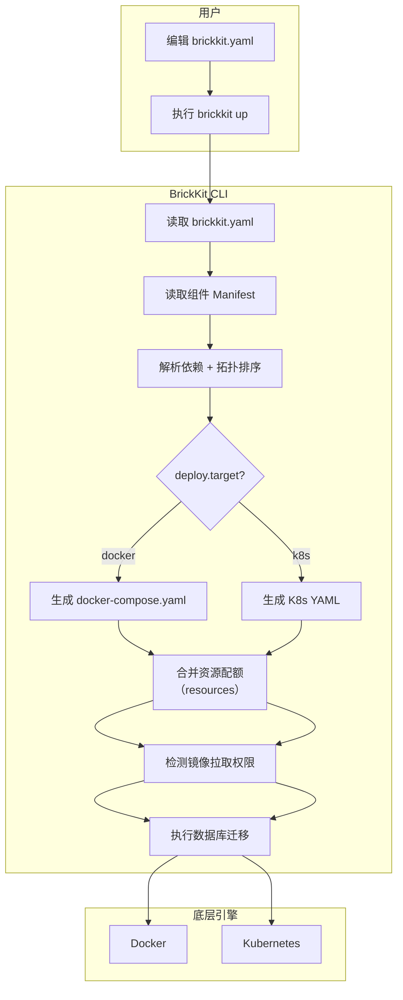
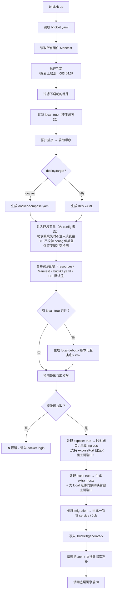
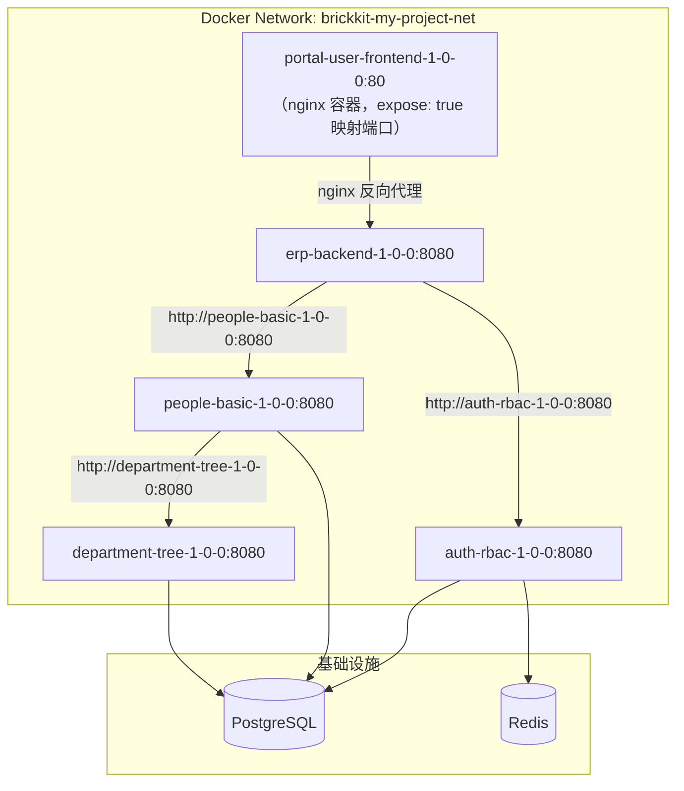
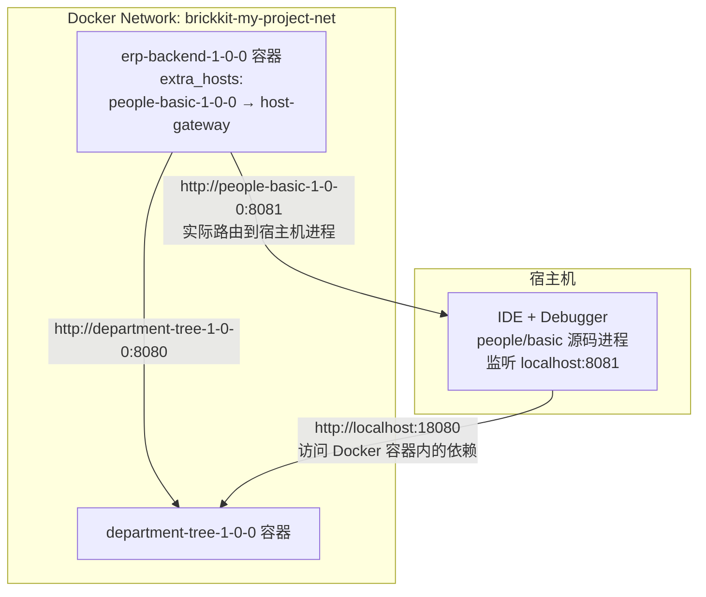
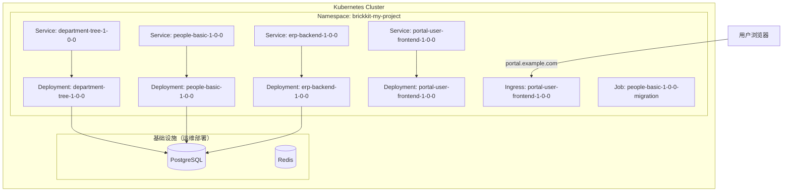
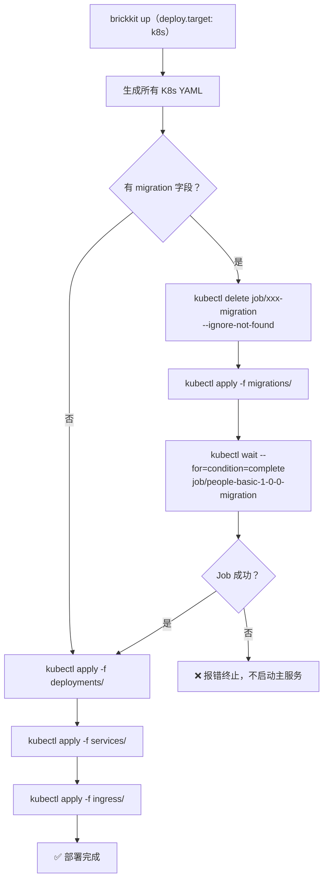
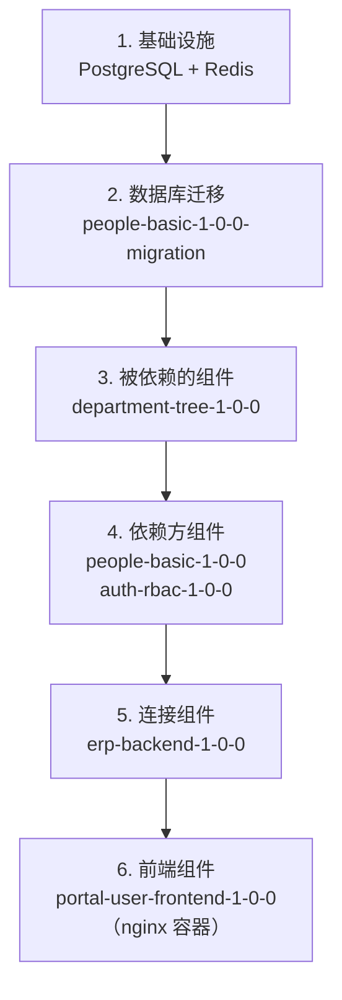
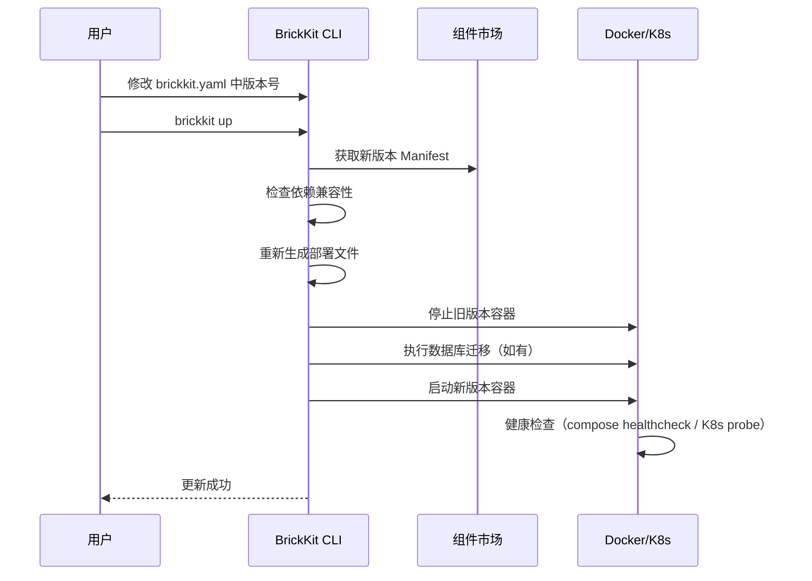
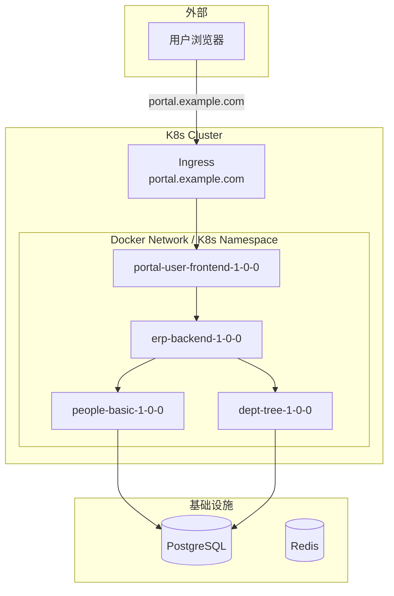

# 005 BrickKit 部署与运行规范

## 文档信息

| 项目 | 内容 |
| --- | --- |
| 文档编号 | 005 |
| 文档名称 | 部署与运行规范 |
| 所属篇章 | 第五篇：部署与运行 |
| 版本 | 1.19.0 |
| 最后更新 | 2026-08-23 |
| 状态 | 定稿 |
| 依赖文档 | 001 平台理念与总体架构、002 组件规范、003 项目配置规范、004 BrickKit CLI 设计 |
| 被依赖文档 | 006 基础资源规范、008 安全与治理、009 组件开发快速入门、011 组件安装与拼装指南 |

---

## 1. 部署定位

### 1.1 核心原则

BrickKit 的部署遵循一个核心原则：

**组件代码不感知部署环境。** CLI 负责把 Manifest 翻译为底层引擎能理解的部署文件。

组件只需要：

- 监听固定端口（由 Manifest 声明）
- 从环境变量读取依赖地址
- 提供 `/healthz` 健康检查端点（只检查本进程存活，不检查任何外部依赖）
- 输出结构化日志

至于组件跑在 Docker 还是 K8s 上，是 CLI 和底层引擎的事，不是组件开发者的事。

### 1.2 部署模型



关键特征：

- 没有常驻主系统服务
- CLI 直接调用 `docker compose` / `kubectl` 命令
- 部署文件透明可审查（存放在 `.brickkit/generated/`）
- 数据库迁移由 CLI 在启动前自动执行（K8s 环境执行前自动清理旧 Job）
- CLI 在启动前检测镜像拉取权限，未授权时报错提示 `docker login`
- CLI 合并资源配额（Manifest `deployment.resources` + brickkit.yaml `components[].resources`），透传给底层引擎
- 如果项目中存在 `local: true` 的组件，CLI 自动生成 `local-debug.<版本化服务名>.env` 文件

### 1.3 环境分类

| 环境 | deploy.target | 底层引擎 | 适用场景 |
| --- | --- | --- | --- |
| local | docker | Docker | 本地开发 |
| dev | docker | Docker | 开发团队 |
| test | docker 或 k8s | Docker / K8s | 测试 |
| staging | k8s | Kubernetes | 预发布 |
| production | k8s | Kubernetes | 生产 |

### 1.4 统一地址格式

| 环境 | 组件地址格式 | 示例 |
| --- | --- | --- |
| Docker | http://<版本化服务名>:<端口> | http://people-basic-1-0-0:8080 |
| K8s | http://<版本化服务名>:<端口> | http://people-basic-1-0-0:8080 |

**格式完全一样。** 组件代码不因部署环境变化而修改。

### 1.5 版本化服务名规则

| 组件 ID | 版本 | 服务名 |
| --- | --- | --- |
| people/basic | 1.0.0 | people-basic-1-0-0 |
| department/tree | 1.2.0 | department-tree-1-2-0 |
| erp/backend | 2.1.3 | erp-backend-2-1-3 |
| infra/redis-event-bus | 1.0.0 | infra-redis-event-bus-1-0-0 |
| portal/user-frontend | 1.0.0 | portal-user-frontend-1-0-0 |

转换规则：

- `/` → `-`
- `.` → `-`
- 全部小写
- 拼接版本号（版本号中的 `.` → `-`）

---

## 2. 部署文件生成

### 2.1 生成原则

| 原则 | 说明 |
| --- | --- |
| 组件不自带部署文件 | 部署文件由 CLI 根据 component.yaml 自动生成 |
| 生成文件透明可审查 | 存放在 `.brickkit/generated/`，用户可查看 |
| 生成文件不手动编辑 | 每次 `brickkit up` 重新生成，手动修改会被覆盖 |
| 一套 Manifest 两种输出 | 同一个 component.yaml 可生成 compose 或 K8s YAML |
| 环境变量统一注入 | 依赖地址（值带版本号）、资源连接、自身配置（含 config 覆盖）。**弱依赖缺失时不注入该环境变量** |
| 资源配额合并透传 | Manifest `deployment.resources` + brickkit.yaml `components[].resources` 合并后透传给底层引擎 |
| 保留变量冲突检测 | config 覆盖的环境变量不得与平台保留变量冲突；冲突时警告但跳过，平台注入的值优先 |

### 2.2 生成文件存放位置

```
.brickkit/
   └── generated/
       ├── docker-compose.yaml                        # deploy.target: docker 时生成
       ├── local-debug.people-basic-1-0-0.env        # 有 local: true 组件时生成（版本化服务名命名）
       ├── local-debug.people-basic-2-0-0.env        # 多版本共存时各自独立
       └── k8s/                                       # deploy.target: k8s 时生成
           ├── namespace.yaml
           ├── migrations/
           │   ├── people-basic-1-0-0-migration.yaml
           │   └── erp-backend-1-0-0-migration.yaml
           ├── deployments/
           │   ├── department-tree-1-0-0.yaml
           │   ├── people-basic-1-0-0.yaml
           │   └── erp-backend-1-0-0.yaml
           ├── services/
           │   ├── department-tree-1-0-0.yaml
           │   ├── people-basic-1-0-0.yaml
           │   └── erp-backend-1-0-0.yaml
           ├── ingress/
           │   └── portal-user-frontend-1-0-0.yaml
           └── secrets/
               └── resource-secrets.yaml
```

### 2.3 生成流程



### 2.4 环境变量注入规则

CLI 在生成部署文件时，自动注入以下环境变量：

| 类别 | 命名规则 | 示例值 |
| --- | --- | --- |
| 平台通用 | 固定名称 | COMPONENT_ID=people/basic |
| 依赖组件地址 | {组件ID前缀}_ENDPOINT | DEPARTMENT_TREE_ENDPOINT=http://department-tree-1-0-0:8080 |
| 依赖组件额外端口地址 | {组件ID前缀}_{NAME大写}_ENDPOINT | PEOPLE_BASIC_GRPC_ENDPOINT=http://people-basic-1-0-0:9090 |
| 资源连接 | 按资源类型 | DATABASE_HOST=localhost |
| 自身配置 | configSchema 字段转大写（含 config 覆盖） | DEFAULT_PAGE_SIZE=50 |

关键规则：

- 环境变量名不带版本号（基于组件 ID）
- 环境变量值带版本号（指向具体服务名）
- 弱依赖未启动时，该环境变量不存在（CLI 不注入空值，组件必须用 `os.environ.get()` 等安全方式读取）
- brickkit.yaml 中 `config` 字段的值覆盖 configSchema 默认值
- CLI 不校验 config 值的类型：configSchema 是"配置说明书"，不是"安检机"。使用者填错类型（如把 integer 写成字符串），CLI 原样注入，由此导致的组件运行异常由使用者自行承担
- 保留变量冲突检测：config 覆盖的环境变量不得与平台保留变量冲突（如 `*_ENDPOINT`、`DATABASE_*`、`COMPONENT_ID` 等）。冲突时 CLI 警告但跳过该配置项，平台注入的值优先。详见 002 组件规范 6.5 节和附录 C.6
- 额外端口（extraPorts）注入为 `{组件ID前缀}_{NAME大写}_ENDPOINT`。例如 `extraPorts: [{name: grpc, port: 9090}]` → `PEOPLE_BASIC_GRPC_ENDPOINT=http://people-basic-1-0-0:9090`。额外端口的 ENDPOINT 变量同样受 `*_ENDPOINT` 保留模式保护

### 2.5 资源配额合并规则

CLI 在生成部署文件时，合并资源配额：

优先级链：`brickkit.yaml components[].resources` > `component.yaml deployment.resources` > `CLI 默认值（100m/128Mi）`

合并逻辑：

1. 读取 Manifest 中 `deployment.resources`（组件推荐值）
2. 读取 brickkit.yaml 中 `components[].resources`（使用者覆盖值）
3. 如果使用者覆盖了，使用覆盖值；否则使用组件推荐值
4. 如果都没有，使用 CLI 默认值（requests: 100m/128Mi, limits: 500m/512Mi）
5. 将最终值写入部署文件（Docker: `deploy.resources`; K8s: `resources`）

**CLI 不校验 resources 数值的合理性。** 资源配额是"推荐值"，不是"强制限制"。如果设置了不合理的 limits，可能导致组件频繁 OOMKilled，这是配置者的责任。

---

## 3. Docker 部署

### 3.1 核心概念

本地开发使用 Docker 自定义网络实现服务发现：



关键规则：

- 所有组件在同一个 Docker Network 中
- 版本化服务名就是 DNS 名
- 默认不映射端口到宿主机（安全默认）
- `expose: true` 的组件映射端口到宿主机（可通过 `exposePort` 自定义宿主机端口）
- 容器之间通过 `http://<版本化服务名>:<端口>` 互相访问

### 3.2 CLI 生成的 docker-compose.yaml（全容器模式）

以下是 CLI 自动生成的完整 docker-compose.yaml 示例。所有组件均为正常容器模式（没有 `local: true`）：

**Docker 环境中 extraPorts 的处理：** Docker Network 内容器的所有端口天然可达，compose 中不需要为 extraPorts 做额外处理。额外端口的环境变量注入由 CLI 自动完成（见 2.4 节）。


⚠️ **不写 `version:` 字段。** Compose V2 已废弃它，写了 `docker compose config` 会给出警告。设计书早期样例成文于 V1 时代，CLI 生成的文件不含该字段。

⚠️ **`deploy.resources` 下没有 `requests`。** Compose 把 K8s 的 requests 叫
`reservations`，那一层只有 `limits` 与 `reservations` 两个键——写成 `requests`
会被 `docker compose config` 判为非法字段。下面每个 service 里的 `reservations`
就是组件 Manifest（或 `brickkit.yaml`）里那份 `resources.requests`。

```yaml
# ============================================================
# 由 BrickKit CLI 自动生成，请勿手动编辑
# 生成时间：2026-08-09T10:00:00Z
# 项目：my-erp-project
# deploy.target: docker
# 组件数：5（全部为正常容器模式）
# ============================================================

services:
  # ===== 数据库迁移（一次性 service）=====
  people-basic-1-0-0-migration:
    image: registry.brickkit.io/people-basic:1.0.0
    # entrypoint 与 command 一起覆盖：镜像带 ENTRYPOINT 时只写 command 会参数错位，
    # 迁移容器会把服务启起来而不是执行迁移（002 §8.4）
    entrypoint: ["python"]
    command: ["manage.py", "migrate"]
    environment:
      - DATABASE_HOST=host.docker.internal
      - DATABASE_PORT=5432
      - DATABASE_NAME=people
      - DATABASE_USER=people_user
      - DATABASE_PASSWORD=${PEOPLE_DB_PASSWORD}
    networks:
      - brickkit-net
    restart: "no"

  # ===== 组件（启动顺序：1）=====
  department-tree-1-0-0:
    image: registry.brickkit.io/department-tree:1.0.0
    environment:
      - COMPONENT_ID=department/tree
      - COMPONENT_VERSION=1.0.0
      - DATABASE_HOST=host.docker.internal
      - DATABASE_PORT=5432
      - DATABASE_NAME=department
      - DATABASE_USER=department_user
      - DATABASE_PASSWORD=${DEPARTMENT_DB_PASSWORD}
    networks:
      - brickkit-net
    healthcheck:
      test: ["CMD-SHELL", "wget -q --spider http://localhost:8080/healthz || curl -fsS http://localhost:8080/healthz || exit 1"]
      interval: 10s
      timeout: 3s
      retries: 3
    deploy:
      resources:
        reservations:
          cpus: "0.10"
          memory: 128M
        limits:
          cpus: "0.50"
          memory: 512M
    restart: unless-stopped

  # ===== 组件（启动顺序：2）=====
  people-basic-1-0-0:
    image: registry.brickkit.io/people-basic:1.0.0
    ports:
      - "18080:8080"    # CLI 自动映射（供 local 组件调试时宿主机访问，见第 4 章）
    environment:
      - COMPONENT_ID=people/basic
      - COMPONENT_VERSION=1.0.0
      - DEPARTMENT_TREE_ENDPOINT=http://department-tree-1-0-0:8080
      - DATABASE_HOST=host.docker.internal
      - DATABASE_PORT=5432
      - DATABASE_NAME=people
      - DATABASE_USER=people_user
      - DATABASE_PASSWORD=${PEOPLE_DB_PASSWORD}
      - DEFAULT_PAGE_SIZE=50
      - ENABLE_AUDIT=false
    depends_on:
      people-basic-1-0-0-migration:
        condition: service_completed_successfully
      department-tree-1-0-0:
        condition: service_healthy
    networks:
      - brickkit-net
    healthcheck:
      test: ["CMD-SHELL", "wget -q --spider http://localhost:8080/healthz || curl -fsS http://localhost:8080/healthz || exit 1"]
      interval: 10s
      timeout: 3s
      retries: 3
    deploy:
      resources:
        reservations:
          cpus: "0.10"
          memory: 128M
        limits:
          cpus: "0.50"
          memory: 512M
    restart: unless-stopped

  # ===== 组件（启动顺序：3）=====
  auth-rbac-1-0-0:
    image: registry.brickkit.io/auth-rbac:1.0.0
    environment:
      - COMPONENT_ID=authorization/rbac
      - COMPONENT_VERSION=1.0.0
      - PEOPLE_BASIC_ENDPOINT=http://people-basic-1-0-0:8080
      - DATABASE_HOST=host.docker.internal
      - DATABASE_PORT=5432
      - DATABASE_NAME=authorization
      - DATABASE_USER=auth_user
      - DATABASE_PASSWORD=${AUTH_DB_PASSWORD}
      - REDIS_HOST=host.docker.internal
      - REDIS_PORT=6379
      - REDIS_PASSWORD=${REDIS_PASSWORD}
    depends_on:
      people-basic-1-0-0:
        condition: service_healthy
    networks:
      - brickkit-net
    healthcheck:
      test: ["CMD-SHELL", "wget -q --spider http://localhost:8080/healthz || curl -fsS http://localhost:8080/healthz || exit 1"]
      interval: 10s
      timeout: 3s
      retries: 3
    deploy:
      resources:
        limits:
          cpus: "0.50"
          memory: 512M
    restart: unless-stopped

  # ===== 组件（启动顺序：4）=====
  erp-backend-1-0-0:
    image: registry.brickkit.io/erp-backend:1.0.0
    environment:
      - COMPONENT_ID=erp/backend
      - COMPONENT_VERSION=1.0.0
      - PEOPLE_BASIC_ENDPOINT=http://people-basic-1-0-0:8080
      - PEOPLE_BASIC_GRPC_ENDPOINT=http://people-basic-1-0-0:9090
      - DEPARTMENT_TREE_ENDPOINT=http://department-tree-1-0-0:8080
      - AUTHORIZATION_RBAC_ENDPOINT=http://auth-rbac-1-0-0:8080
      - DATABASE_HOST=host.docker.internal
      - DATABASE_PORT=5432
      - DATABASE_NAME=erp
      - DATABASE_USER=erp_user
      - DATABASE_PASSWORD=${ERP_DB_PASSWORD}
      - REDIS_HOST=host.docker.internal
      - REDIS_PORT=6379
      - SESSION_TTL_SECONDS=7200
    depends_on:
      people-basic-1-0-0:
        condition: service_healthy
      department-tree-1-0-0:
        condition: service_healthy
      auth-rbac-1-0-0:
        condition: service_healthy
    networks:
      - brickkit-net
    healthcheck:
      test: ["CMD-SHELL", "wget -q --spider http://localhost:8080/healthz || curl -fsS http://localhost:8080/healthz || exit 1"]
      interval: 10s
      timeout: 3s
      retries: 3
    deploy:
      resources:
        reservations:
          cpus: "0.20"
          memory: 256M
        limits:
          cpus: "1.00"
          memory: 1G
    restart: unless-stopped

  # ===== 前端组件（nginx 容器，expose: true 映射端口）=====
  portal-user-frontend-1-0-0:
    image: registry.brickkit.io/portal-user-frontend:1.0.0
    ports:
      # 未填 exposePort：使用 deployment.port（80）
      # - "80:80"
      # 填了 exposePort: 8080：自定义宿主机端口
      - "8080:80"
    environment:
      - COMPONENT_ID=portal/user-frontend
      - COMPONENT_VERSION=1.0.0
      - ERP_BACKEND_ENDPOINT=http://erp-backend-1-0-0:8080
    depends_on:
      erp-backend-1-0-0:
        condition: service_healthy
    networks:
      - brickkit-net
    healthcheck:
      test: ["CMD-SHELL", "wget -q --spider http://localhost:80/ || curl -fsS http://localhost:80/ || exit 1"]
      interval: 10s
      timeout: 3s
      retries: 3
    deploy:
      resources:
        limits:
          cpus: "0.20"
          memory: 256M
    restart: unless-stopped


networks:
  brickkit-net:
    name: brickkit-my-erp-project-net
    driver: bridge
```

### 3.3 启动命令

⚠️ **`-p` 不能省。** compose 默认拿部署文件所在目录名当项目名，而部署文件固定在 `.brickkit/generated/` 下——不带 `-p` 的话，同一台机器上**所有** BrickKit 项目在引擎眼里都叫 `generated`，彼此的容器互相顶替。更隐蔽的是 `logs`：不带 `-p` 时它**静默返回空**，不报错也没有输出，让人误以为组件根本没打日志。

项目名规则：`brickkit-<brickkit.yaml 中的 project>`，与网络名（`brickkit-<项目名>-net`）同源。CLI 自动带上，手动执行时必须自己写。

```bash
# 一键启动（CLI 自动调用）
brickkit up

# 等价于（--wait 让 compose 等到全部 running/healthy 才返回；
# 不等的话依赖链末端的组件此刻多半还是 health: starting）：
docker compose -p brickkit-my-erp-project -f .brickkit/generated/docker-compose.yaml up -d --wait

# 查看状态
brickkit status

# 等价于：
docker compose -p brickkit-my-erp-project -f .brickkit/generated/docker-compose.yaml ps

# 一键停止
brickkit down

# 等价于（认项目名，不认部署文件，见 §5.9.3）：
docker compose -p brickkit-my-erp-project down --remove-orphans
# 注意：不删除 volume（数据安全）。如需彻底清理，请手动执行 docker volume rm

# 查看日志
docker compose -p brickkit-my-erp-project logs -f erp-backend-1-0-0
```

**重要：`brickkit down` 不删除 volume（数据库数据）。** 等价于 `docker compose down`（不带 `-v` 参数）。数据库数据始终保留。如需彻底清理，请手动执行 `docker volume rm` 或 `docker compose down -v`。

### 3.4 健康检查转换

CLI 将 Manifest 中的 `healthCheck` 转换为 Compose 的 `healthcheck` 指令：

| Manifest 声明 | Compose 转换 |
| --- | --- |
| type: http, path: /healthz | `healthcheck: test: ["CMD-SHELL", "wget … \|\| curl … \|\| exit 1"]`（wget 与 curl 都试一遍，见 002 §9.3.1） |
| type: tcp | healthcheck: test: ["CMD", "nc", "-z", "localhost", "8080"] |
| type: none | 不生成 healthcheck |

同时生成重启策略：`restart: unless-stopped`

⚠️ **重要提醒：** CLI 只负责将 `healthCheck` 配置转换为底层引擎的原生检查指令。CLI 不校验组件的 `/healthz` 实现内容。

**`/healthz` 只应检查本进程存活，禁止检查数据库、依赖组件或任何外部系统。** 如果组件在 `/healthz` 中检查了外部依赖，外部依赖抖动会导致容器被反复重启，引发雪崩。这是组件开发者的责任，详见 002 组件规范第 9.4 节和附录 I.4。

### 3.5 depends_on 与启动顺序

CLI 根据依赖关系生成 `depends_on`：

```yaml
erp-backend-1-0-0:
  depends_on:
    department-tree-1-0-0:
      condition: service_healthy    # 等待依赖组件健康后再启动
    auth-rbac-1-0-0:
      condition: service_healthy
    people-basic-1-0-0-migration:
      condition: service_completed_successfully  # 等待迁移完成
```

规则：

- 被依赖的组件先启动
- 依赖方等待被依赖方健康后再启动
- 使用 `condition: service_healthy` 确保依赖方就绪
- 迁移 service 使用 `condition: service_completed_successfully` 确保迁移完成

### 3.6 网络配置

所有组件在同一个 Docker Network 中：

```yaml
networks:
  brickkit-net:
    name: brickkit-my-project-net    # 项目名 + "-net"
    driver: bridge
```

### 3.7 本地开发默认单实例

本地开发时，每个组件默认只启动一个实例。

如果需要测试多实例，可以手动修改生成的 docker-compose.yaml（不推荐，仅用于临时测试）。

---

## 4. 本地调试模式

### 4.1 local: true 机制

在 brickkit.yaml 中标记 `local: true` 的组件，CLI 不生成容器：

```yaml
# brickkit.yaml
components:
  - id: people/basic
    version: 1.0.0
    local: true
    localPort: 8081
```

CLI 行为：

- 不为该组件生成 service 定义
- 在依赖它的其他容器中生成 `extra_hosts`，将该组件的服务名映射到宿主机
- 修改环境变量中的端口为 `localPort`
- 为 local 组件的依赖组件自动映射宿主机端口（见 4.8 节）
- 生成 `.brickkit/generated/local-debug.<版本化服务名>.env` 文件（见 4.9 节）

### 4.2 extra_hosts 映射

```yaml
# 生成的 docker-compose.yaml 中
erp-backend-1-0-0:
  extra_hosts:
    - "people-basic-1-0-0:host-gateway"
  environment:
    - PEOPLE_BASIC_ENDPOINT=http://people-basic-1-0-0:8081
```

`host-gateway` 是 Docker 20.10+ 的内置关键字，自动解析为宿主机 IP。**Podman 同样支持它**，值完全一样（见 §7.5）。

### 4.3 调试流程图



### 4.4 多组件同时调试

多个组件可以同时标记 `local: true`，使用不同端口：

```yaml
components:
  - id: people/basic
    version: 1.0.0
    local: true
    localPort: 8081

  - id: department/tree
    version: 1.0.0
    local: true
    localPort: 8082

  - id: erp/backend
    version: 1.0.0
    local: false
```

生成的 erp-backend 容器：

```yaml
erp-backend-1-0-0:
  extra_hosts:
    - "people-basic-1-0-0:host-gateway"
    - "department-tree-1-0-0:host-gateway"
  environment:
    - PEOPLE_BASIC_ENDPOINT=http://people-basic-1-0-0:8081
    - DEPARTMENT_TREE_ENDPOINT=http://department-tree-1-0-0:8082
```

### 4.5 调试流程

```bash
# 1. 启动 Docker 中的其他组件（不启动 people/basic）
brickkit up

# 2. 在 IDE 中启动 people/basic（源码模式，监听 8081）
#    加载 .brickkit/generated/local-debug.people-basic-1-0-0.env 中的环境变量
#    VS Code / IntelliJ / GoLand 等，debugger 直接 attach

# 3. 其他容器访问 http://people-basic-1-0-0:8081
#    → 实际路由到宿主机 8081 端口
#    → IDE debugger 命中断点 ✅

# 4. people/basic 访问依赖组件（如 department-tree）
#    → 通过 localhost:18080（CLI 自动映射的端口）
#    → 访问 Docker 容器内的依赖组件 ✅
```

**调用方代码零修改。** 依赖地址是环境变量注入的，`people/basic` 搬到宿主机上之后，`erp/backend` 里的代码与配置一个字都不用改。

⚠️ **被调试的那个组件本身要注意：平台不注入"我该监听哪个端口"。** 环境变量表里只有"别人在哪"（`*_ENDPOINT`），没有"我是谁、我该监听哪"。进程监听哪个端口由组件自己的代码决定（通常就是 `deployment.port`）。这直接决定了下一节 `localPort` 的默认值。

### 4.6 端口分配规则

| 场景 | 端口来源 |
| --- | --- |
| 用户指定 `localPort` | 使用用户指定的端口 |
| 用户未指定 `localPort` | **默认取组件自己声明的 `deployment.port`**；该端口在宿主机上已被别人占用时，从 8081 起递增另选 |
| 两处写死了同一个宿主机端口 | CLI 报错并提示更换端口 |

⚠️ **为什么默认是组件声明的端口，而不是直接从 8081 开始：**

搬到宿主机上跑的是**同一份代码**，它监听的还是 `deployment.port`。若 CLI 默认分配 8081 而进程实际监听 8080，依赖方照着 `:8081` 连过去只会得到 connection refused——表现为强依赖持续 503，而没有任何一处报错指向端口。

**显式写了 `localPort` 时，让进程真的监听该端口是开发者自己的责任**（在 IDE 的运行配置里改监听参数）。CLI 只负责让所有依赖方都按 `localPort` 来找你。

### 4.7 本地调试限制

| 限制 | 说明 |
| --- | --- |
| 闭源组件不支持 | 没有源码，无法在 IDE 中运行 |
| 需要 Docker 20.10+ | `host-gateway` 需要 Docker 20.10+ |

### 4.8 local 组件的依赖端口映射

当组件标记为 `local: true` 时，该组件在宿主机上运行（IDE 中），需要访问 Docker 容器内的依赖组件。CLI 自动处理这个方向的访问：

| 场景 | CLI 行为 |
| --- | --- |
| 依赖组件已有 `expose: true` + `exposePort` | 使用已有的映射端口，不重复映射 |
| 依赖组件没有 `expose` | CLI 自动分配宿主机端口（优先 `10000 + 容器端口`，被占用时从 18080 起递增） |
| 端口冲突 | CLI 报错并提示 |

**为什么优先 `10000 + 容器端口`：** 端口号因此自带含义——组件的 8080 映射成 18080、PostgreSQL 的 5432 映射成 15432、gRPC 的 9090 映射成 19090。排障时一眼能对上是谁，不用回头查生成的文件。撞车了才退回从 18080 起顺序扫描。

⚠️ **这条规则不适用于基础资源。** 平台不部署它们（006 §10.1），它们本来就在
容器网络之外——宿主机上的 local 组件照着声明的地址连就行，没有可映射的端口。
env 文件里唯一要改的是 `host.docker.internal` → `localhost`（见 §4.9）。

> 早先这里写的是"CLI 一并把库也映射出来"，那是平台还托管资源容器时代的说法，
> 随 006 §10.1 一起失效了。

**local 组件的额外端口不重新分配。** 它在宿主机上跑的是同一份代码，额外端口监听的还是 `extraPorts` 里声明的那个值；依赖方经 `extra_hosts` 访问 `http://<服务名>:<声明的额外端口>` 即可。两个 local 组件声明了同一个额外端口时，它们在宿主机上会真的抢同一个端口——CLI 在生成阶段就报错。

示例：

```yaml
components:
  - id: people/basic
    version: 1.0.0
    local: true
    localPort: 8081

  - id: department/tree
    version: 1.0.0
    local: false    # 在 Docker 中运行
```

CLI 行为：

- `department/tree` 在 Docker 中运行，CLI 自动为其映射宿主机端口（如 18080）
- 在生成的 docker-compose.yaml 中，`department-tree-1-0-0` 增加 `ports: ["18080:8080"]`
- 生成 `local-debug.people-basic-1-0-0.env`，其中 `DEPARTMENT_TREE_ENDPOINT=http://localhost:18080`
- `people/basic` 在 IDE 中运行时，通过 `localhost:18080` 访问 `department/tree`

### 4.9 local-debug.env

当项目中存在 `local: true` 的组件时，CLI 在 `brickkit up` 时自动生成 `.brickkit/generated/local-debug.<版本化服务名>.env` 文件。

**文件命名规则：使用版本化服务名。** 确保多版本共存时不会互相覆盖。

⚠️ **这份文件里的 `${VAR}` 必须在生成时求值，不能留占位符。** 它是给 **IDE** 读的（VS Code 的 `envFile`、IntelliJ 的 EnvFile 插件），**这两者都不做变量替换**——留着 `DATABASE_PASSWORD=${PG_PASSWORD}`，IDE 里的进程就会拿着这串字面量去连库，认证失败，而使用者的 `.env` 明明写着密码。

与 `docker-compose.yaml` 的处理**刻意相反**，判据是"**谁不做替换，就在生成时替换给谁**"：

| 文件 | 谁消费它 | 会替换 `${VAR}` 吗 | 我们怎么写 |
| --- | --- | --- | --- |
| `docker-compose.yaml` | `docker compose` | ✅ 会（从 shell 环境与项目根的 `.env`） | **能求出值就求，求不出就留占位符交给 compose** |
| `local-debug.*.env` | IDE | ❌ 不会 | **求值后写真值**，文件权限 `0600` |
| K8s `secrets/*.yaml` | `kubectl` | ❌ 不会 | **求值后写真值**，文件权限 `0600`；求不出值时**阻断生成** |

`local-debug` 与 K8s Secret 的差别在失败处理：前者求不出值时**原样保留占位符**（它只是调试辅助，不该让整个 `up` 失败，留着占位符还能看出漏了哪个变量）；后者会真的部署上去，所以必须阻断。

#### compose 那一行的实情

CLI 在**读 `brickkit.yaml` 时**就会展开 `${VAR}`（003 §5.4），取值来源是**当前进程的环境变量**。所以那一格的结果取决于变量在哪：

| 变量定义在 | 生成的 compose 里是 | 谁完成了替换 |
| --- | --- | --- |
| 只在项目根的 `.env` | `${PG_PASSWORD}`（占位符） | `docker compose` 自己（它也读 `.env`） |
| shell 里 export 过 | 展开后的真值 | CLI |

两条路都能跑通，这也是为什么它没被当成问题很久。但要说清楚三件事：

1. **`.env` 是推荐写法**（006 §6.2）。走这条路时占位符会留在文件里，明文密码不落盘。
2. **`.brickkit/generated/` 不进 Git**（003 §11），所以"明文进 git diff"这个担心本来就不成立——早先这一格写的理由是错的。
3. ⚠️ **密码里别出现 `$`。** 变量被 CLI 展开成真值之后，`docker compose` 还会再扫一遍这份文件：`abc$def` 里的 `$def` 会被当成另一个变量替换掉（多半是空），于是组件拿到一个残缺的密码，而配置与 `.env` 看上去都没问题。要用 `$` 的话，把变量 export 到 shell 里绕不开这一步——**换个不含 `$` 的密码是唯一简单的答案**。

```
.brickkit/generated/
  ├── local-debug.people-basic-1-0-0.env      # people/basic@1.0.0
  ├── local-debug.people-basic-2-0-0.env      # people/basic@2.0.0（多版本共存）
  └── local-debug.department-tree-1-0-0.env   # department/tree@1.0.0
```

文件内容示例：

```
# .brickkit/generated/local-debug.people-basic-1-0-0.env
# 由 BrickKit CLI 自动生成，供 IDE 加载
# 组件：people/basic@1.0.0（local: true）
# 生成时间：2026-08-09T10:00:00Z

COMPONENT_ID=people/basic
COMPONENT_VERSION=1.0.0
DATABASE_HOST=localhost
DATABASE_PORT=5432
DATABASE_NAME=people
DATABASE_USER=people_user
DATABASE_PASSWORD=s3cret-from-dotenv     # ← 生成时已求值，不是占位符

# 依赖地址指向 localhost（因为依赖组件已映射端口到宿主机）
DEPARTMENT_TREE_ENDPOINT=http://localhost:18080
```

IDE 中的使用方式：

| IDE | 配置方式 |
| --- | --- |
| VS Code | `launch.json` 中配置 `envFile: ".brickkit/generated/local-debug.people-basic-1-0-0.env"` |
| IntelliJ / GoLand | Run Configuration → Environment Variables → 导入 `.env` 文件 |
| 命令行 | `source .brickkit/generated/local-debug.people-basic-1-0-0.env && python app.py` |

生成规则：

| 环境变量 | 值来源 |
| --- | --- |
| COMPONENT_ID | 组件 ID |
| COMPONENT_VERSION | 组件版本 |
| DATABASE_* | 资源绑定信息。**只把 `host.docker.internal` 换成 `localhost`，端口原样**——平台不部署基础资源（006 §10.1），它们本来就在容器网络之外 |
| {依赖组件}_ENDPOINT | 依赖组件的映射端口（`http://localhost:<映射端口>`） |
| configSchema 配置项 | configSchema 默认值 + brickkit.yaml config 覆盖 |

注意：

- `local-debug.env` 每次 `brickkit up` 时重新生成
- 文件存储在 `.brickkit/generated/` 目录中
- 文件不提交 Git（`.brickkit/generated/` 已在 `.gitignore` 中）
- 文件使用版本化服务名命名，确保多版本共存时不冲突

### 4.10 完整的 local: true compose 示例

以下是 `people/basic` 标记为 `local: true` 时，CLI 生成的 docker-compose.yaml 示例：

```yaml
# ============================================================
# 由 BrickKit CLI 自动生成，请勿手动编辑
# 生成时间：2026-08-09T10:00:00Z
# 项目：my-erp-project
# deploy.target: docker
# 注意：people/basic 标记为 local: true，不生成容器
# ============================================================

services:
  # ===== 组件（启动顺序：1）=====
  department-tree-1-0-0:
    image: registry.brickkit.io/department-tree:1.0.0
    ports:
      - "18080:8080"    # CLI 自动映射（供 local 组件从宿主机访问）
    environment:
      - COMPONENT_ID=department/tree
      - COMPONENT_VERSION=1.0.0
      - DATABASE_HOST=host.docker.internal
      - DATABASE_PORT=5432
      - DATABASE_NAME=department
      - DATABASE_USER=department_user
      - DATABASE_PASSWORD=${DEPARTMENT_DB_PASSWORD}
    networks:
      - brickkit-net
    healthcheck:
      test: ["CMD-SHELL", "wget -q --spider http://localhost:8080/healthz || curl -fsS http://localhost:8080/healthz || exit 1"]
      interval: 10s
      timeout: 3s
      retries: 3
    restart: unless-stopped

  # ===== people/basic 是 local: true，不生成 service =====
  # ===== 没有 people-basic-1-0-0 的 service 定义 =====
  # ===== 也没有 people-basic-1-0-0-migration 的 service 定义 =====

  # ===== 组件（启动顺序：2）=====
  # 依赖方容器通过 extra_hosts 映射到宿主机上的 local 组件
  auth-rbac-1-0-0:
    image: registry.brickkit.io/auth-rbac:1.0.0
    extra_hosts:
      - "people-basic-1-0-0:host-gateway"
    environment:
      - COMPONENT_ID=authorization/rbac
      - COMPONENT_VERSION=1.0.0
      - PEOPLE_BASIC_ENDPOINT=http://people-basic-1-0-0:8081
      - DATABASE_HOST=host.docker.internal
      - DATABASE_PORT=5432
      - DATABASE_NAME=authorization
      - DATABASE_USER=auth_user
      - DATABASE_PASSWORD=${AUTH_DB_PASSWORD}
    depends_on:
      department-tree-1-0-0:
        condition: service_healthy
    networks:
      - brickkit-net
    healthcheck:
      test: ["CMD-SHELL", "wget -q --spider http://localhost:8080/healthz || curl -fsS http://localhost:8080/healthz || exit 1"]
      interval: 10s
      timeout: 3s
      retries: 3
    restart: unless-stopped

  # ===== 组件（启动顺序：3）=====
  erp-backend-1-0-0:
    image: registry.brickkit.io/erp-backend:1.0.0
    extra_hosts:
      - "people-basic-1-0-0:host-gateway"
    environment:
      - COMPONENT_ID=erp/backend
      - COMPONENT_VERSION=1.0.0
      - PEOPLE_BASIC_ENDPOINT=http://people-basic-1-0-0:8081
      - DEPARTMENT_TREE_ENDPOINT=http://department-tree-1-0-0:8080
      - AUTHORIZATION_RBAC_ENDPOINT=http://auth-rbac-1-0-0:8080
      - DATABASE_HOST=host.docker.internal
      - DATABASE_PORT=5432
      - DATABASE_NAME=erp
      - DATABASE_USER=erp_user
      - DATABASE_PASSWORD=${ERP_DB_PASSWORD}
    depends_on:
      department-tree-1-0-0:
        condition: service_healthy
      auth-rbac-1-0-0:
        condition: service_healthy
    networks:
      - brickkit-net
    healthcheck:
      test: ["CMD-SHELL", "wget -q --spider http://localhost:8080/healthz || curl -fsS http://localhost:8080/healthz || exit 1"]
      interval: 10s
      timeout: 3s
      retries: 3
    restart: unless-stopped


networks:
  brickkit-net:
    name: brickkit-my-erp-project-net
    driver: bridge
```

关键差异（对比 §3.2 全容器模式）：

| 差异点 | 全容器模式（§3.2） | local: true 模式（本节） |
| --- | --- | --- |
| people-basic-1-0-0 service | ✅ 有完整定义 | ❌ 不生成 |
| people-basic-1-0-0-migration service | ✅ 有完整定义 | ❌ 不生成 |
| 依赖方的 `extra_hosts` | ❌ 无 | ✅ `people-basic-1-0-0:host-gateway` |
| 依赖方的 `PEOPLE_BASIC_ENDPOINT` 端口 | 8080（容器内端口） | 8081（localPort） |
| department-tree-1-0-0 的 `ports` | 无（不需要宿主机访问） | `18080:8080`（供 local 组件从宿主机访问） |
| local-debug.env | 不生成 | ✅ 生成（版本化服务名命名） |

---

## 5. K8s 部署

### 5.1 核心概念

生产环境使用 Kubernetes：



关键规则：

- 每个组件对应一个 Deployment + Service
- Service 提供稳定的 DNS 名和负载均衡
- Service 默认使用 ClusterIP（不暴露到集群外）
- 只有 `expose: true` 的组件才生成 Ingress
- 组件代码完全不需要修改
- 有 `migration` 字段的组件，CLI 先生成 Job 执行迁移（执行前自动清理旧 Job）
- 资源配额（resources）由 CLI 合并后写入 Deployment

### 5.2 Namespace 生成

CLI 生成一个 Namespace YAML：

```yaml
# .brickkit/generated/k8s/namespace.yaml
apiVersion: v1
kind: Namespace
metadata:
  name: brickkit-my-project
  labels:
    brickkit.io/project: my-project
```

#### 5.2.1 一个项目 = 一个命名空间（承重假设）

**一份 `brickkit.yaml` 的全部组件部署到同一个命名空间**，没有办法让其中某个组件
去别的命名空间。这是一条**有意的**约束，也是实现里的承重假设——
`plan.namespace` 是个单值，贯穿 Deployment / Service / Ingress / Secret /
Job / NetworkPolicy / ServiceAccount 七处生成。

写在这里是因为它此前只活在代码里。想扩展成"每个组件各自指定命名空间"的人，
得先知道要付什么代价：

| 现状 | 跨命名空间后必须改 |
| --- | --- |
| 注入的是**裸服务名** `http://people-basic-1-0-0:8080` | 得带命名空间后缀 |
| Secret 用 `secretKeyRef` 引用**同命名空间**的 Secret | **K8s 不支持跨命名空间引用 Secret**，每个命名空间都要一份副本 |
| NetworkPolicy 的 `podSelector` 只匹配同命名空间（§5.13.1） | 每条规则都要加 `namespaceSelector` |
| `down` 按单个命名空间清理 | 要按命名空间分组，且"不是我们建的就不能删"（D245）要逐个判断 |

第二行是唯一的**硬约束**：其余三行是工作量，那一行是 K8s 的限制——
密钥要多存几份，轮换时也要多改几处。

**命名空间是权限与配额的边界，不是整理工具。** 组件多到需要分组时，
用标签（`brickkit.io/component` / `brickkit.io/project`）过滤即可，
代价与上表完全不在一个量级。

### 5.3 Deployment 生成

```yaml
# .brickkit/generated/k8s/deployments/people-basic-1-0-0.yaml
apiVersion: apps/v1
kind: Deployment
metadata:
  name: people-basic-1-0-0
  namespace: brickkit-my-project
  labels:
    app: people-basic-1-0-0
    brickkit.io/component: people-basic          # 组件 ID 的服务名写法
    brickkit.io/component-version: "1.0.0"
    brickkit.io/project: my-project
  annotations:
    brickkit.io/component-id: people/basic       # 原样的组件 ID
spec:
  replicas: 1
  selector:
    matchLabels:
      app: people-basic-1-0-0
  template:
    metadata:
      labels:
        app: people-basic-1-0-0
    spec:
      containers:
        - name: people-basic
          image: registry.brickkit.io/people-basic:1.0.0
          ports:
            - containerPort: 8080
          env:
            - name: COMPONENT_ID
              value: "people/basic"
            - name: COMPONENT_VERSION
              value: "1.0.0"
            - name: DEPARTMENT_TREE_ENDPOINT
              value: "http://department-tree-1-0-0:8080"
            - name: DATABASE_HOST
              value: "postgres-main"
            - name: DATABASE_PORT
              value: "5432"
            - name: DATABASE_NAME
              value: "people"
            - name: DATABASE_USER
              value: "people_user"
            - name: DATABASE_PASSWORD
              valueFrom:
                secretKeyRef:
                  name: people-db-secret
                  key: password
            - name: DEFAULT_PAGE_SIZE
              value: "50"
            - name: ENABLE_AUDIT
              value: "false"
          livenessProbe:
            httpGet:
              path: /healthz
              port: 8080
            initialDelaySeconds: 10
            periodSeconds: 10
            timeoutSeconds: 3
            failureThreshold: 3
          readinessProbe:
            httpGet:
              path: /healthz
              port: 8080
            initialDelaySeconds: 5
            periodSeconds: 5
            timeoutSeconds: 3
            failureThreshold: 3
          resources:
            # 优先级：brickkit.yaml resources > component.yaml deployment.resources > CLI 默认值
            requests:
              cpu: 100m
              memory: 128Mi
            limits:
              cpu: 500m
              memory: 512Mi
```

⚠️ **livenessProbe 提醒：** `livenessProbe` 失败会导致 Pod 被 kill 并重启。因此 `/healthz` **只应检查本进程存活，禁止检查数据库、依赖组件或任何外部系统。** 详见 002 组件规范第 9.4 节。

#### 5.3.1 标签值不能带斜杠

组件 ID 是 `scope/name` 形式，而 **K8s 的标签「值」不允许出现 `/`**（只允许字母、数字与 `- _ .`；斜杠只在标签「键」的前缀里合法，如 `brickkit.io/component`）。因此：

| 位置 | 内容 | 例 |
| --- | --- | --- |
| 标签 `brickkit.io/component` | 组件 ID 的**服务名写法**（`/` → `-`） | `people-basic` |
| 注解 `brickkit.io/component-id` | **原样**的组件 ID | `people/basic` |

标签用于 `kubectl get -l` 这类筛选，注解用于原样回读。写成 `brickkit.io/component-id: people/basic` 的标签会被 API Server **整份拒绝**，报的还是一句通用的 `a valid label must consist of alphanumeric characters...`，完全看不出是组件 ID 的锅。

**探针差别（与 Docker 目标）：** K8s 的 `httpGet` 由 kubelet 从**容器外**发起，不要求镜像里有 `wget` / `curl`；compose 的 `healthcheck` 跑在**容器内部**，因此那边必须凑出一条镜像里真有的命令（002 §9.6）。同一份 `healthCheck` 声明，两种目标的落地方式不同。

**`local: true` 在 K8s 下不可用：** 它的语义是「该组件跑在开发者的 IDE 里，其他组件通过宿主机地址访问它」，而集群里的 Pod 连不到开发者的笔记本。CLI 在生成阶段直接报错，不会悄悄跳过——跳过的后果是依赖方拿到一个指向不存在 Service 的地址，表现成随机的连接超时。

### 5.4 Service 生成

```yaml
# .brickkit/generated/k8s/services/people-basic-1-0-0.yaml
apiVersion: v1
kind: Service
metadata:
  name: people-basic-1-0-0
  namespace: brickkit-my-project
  labels:
    app: people-basic-1-0-0
    brickkit.io/component: people-basic
spec:
  selector:
    app: people-basic-1-0-0
  ports:
    - name: http          # 端口一律带 name，见下方说明
      port: 8080
      targetPort: 8080
  type: ClusterIP
```

**端口一律带 `name`：** K8s 要求一个 Service 里的端口「要么都有名字、要么只有一个端口」。主端口固定叫 `http`，`extraPorts` 用组件声明的名字。不这么做的话，组件后来加了一个 `extraPorts`，Service 就得同时补上主端口的名字——那是一次会改到既有端口定义的改动。

**额外端口处理：** 如果组件 Manifest 中声明了 `deployment.extraPorts`，CLI 在 Service 的 `ports` 数组中增加对应端口映射：

```yaml
# people-basic-1-0-0 的 Service（含 extraPorts: [{name: grpc, port: 9090}]）
apiVersion: v1
kind: Service
metadata:
  name: people-basic-1-0-0
  namespace: brickkit-my-project
  labels:
    app: people-basic-1-0-0
    brickkit.io/component: people-basic
spec:
  selector:
    app: people-basic-1-0-0
  ports:
    - name: http
      port: 8080
      targetPort: 8080
    - name: grpc          # ← 来自 extraPorts[0].name
      port: 9090          # ← 来自 extraPorts[0].port
      targetPort: 9090
  type: ClusterIP
```

### 5.5 Ingress 生成

当 brickkit.yaml 中声明 `expose: true` 时，CLI 自动生成 Ingress：

```yaml
# .brickkit/generated/k8s/ingress/portal-user-frontend-1-0-0.yaml
apiVersion: networking.k8s.io/v1
kind: Ingress
metadata:
  name: portal-user-frontend-1-0-0
  namespace: brickkit-my-project
  labels:
    brickkit.io/component: portal-user-frontend
spec:
  rules:
    - host: portal.example.com
      http:
        paths:
          - path: /
            pathType: Prefix
            backend:
              service:
                name: portal-user-frontend-1-0-0
                port:
                  number: 80
```

**不声明 `expose: true` 就不生成 Ingress。安全是默认的。**

**注意：** K8s 环境通过 Ingress + 域名路由，两个组件可以共用同一个端口（如 80），只要 `hostname` 不同（如 `portal.example.com` vs `admin.example.com`）就不冲突。因此 K8s 环境不需要 `exposePort` 字段。

### 5.5.1 资源可达性：K8s 下不从本机探测

`brickkit status` 在 Docker 目标下会对外部资源拨一次号。**K8s 目标下不做这件事**：资源地址是集群内的 DNS 名（`postgres.infra`），开发者本机根本解析不了它。照搬 Docker 那套，会对一个**完全健康**的部署报"不可达"——而组件正连着这个库跑得好好的。

CLI 改为把地址原样列出并说明判据：

```
📦 资源状态
 │ pg-main │ database │ postgres.infra:5432（集群内地址，本机不探测） │

   资源在集群内访问，本机不做探测；组件跑起来了就说明它连得上
   想从集群内验证：kubectl run -n <命名空间> --rm -it netcheck --image=busybox -- nc -zv <主机> <端口>
```

### 5.5.2 面向真实集群的四个字段

minikube 上试不出来、真集群上必然撞上的东西，全部做成 `brickkit.yaml` 里的**声明**，平台原样透传，不去猜集群长什么样：

```yaml
deploy:
  target: k8s
  context: prod-cluster          # 钉住集群，见 §5.11
  namespace: team-a-prod         # 用运维分配的命名空间（默认 brickkit-<项目名>）
  createNamespace: false         # 命名空间已存在，不由 CLI 创建
  podSecurity: restricted        # 按 Pod Security Standards 的 restricted 生成 securityContext
  imagePullSecrets: [regcred]    # 私有 registry 的拉取凭据
  ingressClass: nginx            # 写进 Ingress 的 spec.ingressClassName
  ingressAnnotations:            # 原样透传（cert-manager、nginx 参数……）
    cert-manager.io/cluster-issuer: letsencrypt-prod

components:
  - id: portal/user-frontend
    version: 1.0.0
    expose: true
    hostname: portal.example.com
    tlsSecret: portal-tls        # Ingress 的 TLS 证书
```

| 字段 | 不写会怎样 |
| --- | --- |
| `podSecurity` | 命名空间打着 `pod-security.kubernetes.io/enforce: restricted` 时，Pod 被 API Server **直接拒收**。更糟的是迁移 Job：`kubectl apply` **成功**（Job 对象建出来了），但 Job 控制器创建 Pod 时被拒，Job 既不 Complete 也不 Failed，`kubectl wait` 静默挂到超时，而**一条日志都没有**——原因只写在 Job 的 events 里 |
| `imagePullSecrets` | 私有镜像拉不下来（ImagePullBackOff） |
| `ingressClass` | 只有集群配了「默认 class」才会有人认领这条 Ingress。没有默认 class 时 `apply` 成功、域名打不开 |
| `createNamespace` | 只有命名空间级权限时，建命名空间会 Forbidden，整个 `up` 在**第一条命令**就挂 |

**`podSecurity: restricted` 生成什么：**

```yaml
securityContext:
  allowPrivilegeEscalation: false
  runAsNonRoot: true
  capabilities:
    drop: ["ALL"]
  seccompProfile:
    type: RuntimeDefault
```

主容器与迁移容器都要有（它们在同一个命名空间里）。

⚠️ **刻意不生成 `readOnlyRootFilesystem`：** restricted 级别并不要求它，而它会让任何往 `/tmp` 写东西的组件直接挂掉。005 §14.3 把它列为可选的加固项，不是默认项。

⚠️ **restricted 下绑不了 1024 以下的端口：** 它 drop 掉了全部 capabilities，其中包括 `NET_BIND_SERVICE`。CLI 在生成阶段就会对 `deployment.port < 1024` 的组件发警告——否则 Pod 会**建出来然后一直崩溃重启**，而 `permission denied` 埋在容器日志最深处。对外端口由 Service / Ingress 映射，组件自己不必监听 80。

**默认全部不生成。** 加 `securityContext` 可能让本来跑得好好的组件起不来（镜像以 root 运行、要绑特权端口……），平台不替使用者做这个决定。

### 5.6 Secret 生成

CLI 生成 K8s Secret 用于存储敏感信息：

```yaml
# .brickkit/generated/k8s/secrets/resource-secrets.yaml
apiVersion: v1
kind: Secret
metadata:
  name: people-db-secret        # <资源ID>-secret
  namespace: brickkit-my-project
  labels:
    brickkit.io/project: my-project
type: Opaque
stringData:
  password: <生成时求出的真实值>   # 来自 .env 或环境变量，见下方说明
---
apiVersion: v1
kind: Secret
metadata:
  name: redis-secret
  namespace: brickkit-my-project
  labels:
    brickkit.io/project: my-project
type: Opaque
stringData:
  password: <生成时求出的真实值>
```

⚠️ **`${VAR}` 必须在生成时求值，不能原样留在清单里。** 这是 K8s 目标与 Docker 目标的一处根本差别：

| | Docker | K8s |
| --- | --- | --- |
| 谁替换 `${VAR}` | `docker compose` 自己读项目根目录的 `.env` | **没有人**——`kubectl` 不做任何变量替换 |
| 清单里写什么 | 原样的 `${POSTGRES_PASSWORD}` | 求值后的真实值 |

留着占位符的后果是把字面量 `"${POSTGRES_PASSWORD}"` 当成密码部署上去：Pod 以认证失败反复重启，而那份 YAML 看上去完全正常。因此 CLI 在生成 K8s 清单时按 shell 的写法展开 `${VAR}` 与 `${VAR:-默认值}`，取值来源是项目根目录的 `.env` 与当前进程的环境变量；**展开不了的变量一次性列出并阻断生成**，绝不写出一份"看着对、跑起来错"的清单。

**每个资源一份 Secret，不是每个组件一份。** 同一个数据库被三个组件用到时，密码只该有一份——按组件归集会生成三份内容相同的 Secret，改密码时改漏一份就是一次线上故障。

**Secret 文件的权限是 `0600`**（其余清单 `0644`）：里面是明文密码。`.brickkit/generated/` 本来就在 `.gitignore` 里（003 §11）。

**为什么用 `stringData` 而不是 `data`：** `stringData` 写明文，由 API Server 自己做 base64。手工 base64 只是把密码变得不可读，并不会更安全，却让排障时看不出这份文件里到底是什么。

Deployment 中引用：

```yaml
env:
  - name: DATABASE_PASSWORD
    valueFrom:
      secretKeyRef:
        name: people-db-secret
        key: password
```

### 5.7 K8s 部署命令

```bash
# 一键部署（CLI 自动调用）
brickkit up

# 等价于（PROJECT=my-project，NS=brickkit-my-project，K8S=.brickkit/generated/k8s）：
# ⚠️ PROJECT 与 NS 是两样东西：NS 是命名空间（-n 用它），PROJECT 是
#    brickkit.yaml 里的项目名，也是 brickkit.io/project 标签的**值**。
#    默认命名空间下两者只差一个前缀，写了 deploy.namespace 就毫不相干了。
kubectl apply -f $K8S/namespace.yaml                       # 这一条不带 -n：命名空间还不存在
kubectl -n $NS apply -f $K8S/secrets/
kubectl -n $NS delete job/people-basic-1-0-0-migration --ignore-not-found   # 清理旧 Job
kubectl -n $NS apply -f $K8S/migrations/                   # 先执行迁移
kubectl -n $NS wait --for=condition=complete --timeout=10m \
        job/people-basic-1-0-0-migration                   # 等待迁移完成
kubectl -n $NS apply -f $K8S/deployments/
kubectl -n $NS apply -f $K8S/services/
kubectl -n $NS apply -f $K8S/ingress/
kubectl -n $NS rollout status deployment/people-basic-1-0-0 --timeout=5m    # 等副本就绪

# 查看状态
brickkit status

# 等价于：
kubectl -n $NS get deployments -o json

# 一键删除
brickkit down

# 等价于（命名空间是 CLI 建的时候，见 §5.9.3）：
kubectl delete namespace $NS --ignore-not-found
# 命名空间是运维建的（createNamespace: false）时改成按标签逐类删：
# kubectl -n $NS delete ingress,service,deployment,job,networkpolicy,serviceaccount,poddisruptionbudget,secret \
#   -l brickkit.io/project=$PROJECT --ignore-not-found
#   ↑ 标签值是 $PROJECT，不是 $NS。这里从前写的是 $NS，代码也照着这么做——
#     于是这条路上一个资源都匹配不到：八条 delete 全部命中 0 个对象、退出码 0，
#     而 CLI 报"✅ 已停止全部组件"。默认命名空间下两者只差一个前缀，
#     本地 minikube 又永远走上面那条删命名空间的路，所以一直没被试出来。
```

真跑之前容易漏掉的四处：

| 细节 | 为什么不能省 |
| --- | --- |
| 除建命名空间外，**每条命令都要 `-n`** | 少一个 `-n`，那份清单就落到 `default` 命名空间里了。`apply` 照样成功，`brickkit status` 却什么都查不到 |
| `delete` 要 `-R` | 清单分散在 `deployments/` `services/` 等子目录里，不加 `-R` 时 kubectl 只看第一层。恰好第一层的 `namespace.yaml` 会连带删掉整个命名空间，看起来"成功了"，实际是误打误撞 |
| `wait` 与 `rollout status` 都要 `--timeout` | 不设上限的话，一个卡住的迁移会让 `brickkit up` 永远挂着 |
| `rollout status` 不能省 | `apply` 一返回就查状态，得到的全是 `ContainerCreating`——看起来像"全都没起来"。compose 那边用 `--wait` 解决的是同一个问题 |

**只 apply 真实存在的子目录：** 没有对外组件就没有 `ingress/`，没有迁移就没有 `migrations/`。`kubectl apply -f 一个不存在的目录` 会直接失败——一个完全正常的项目会因此起不来。

**镜像拉取权限在 K8s 下不检查：** 拉镜像的是集群里的 kubelet，用的是集群的凭据。开发机上能不能拉到，说明不了任何问题（Docker 目标下这一步照常做，见 004 §10.2）。

### 5.8 多实例与扩容

K8s 中多实例由 `replicas` 控制：

```yaml
spec:
  replicas: 3    # 3个Pod
```

Service 自动负载均衡到所有 Pod。组件代码无感知。

扩容方式：

| 方式 | 说明 |
| --- | --- |
| 手动修改 replicas | 在 brickkit.yaml 的组件条目上写 `replicas: 3`（003 §4.10）。**已支持** |
| HPA 自动扩容 | 基于 CPU/内存自动调整（后期支持） |

**副本数 > 1 时平台自动生成 PodDisruptionBudget**（`maxUnavailable: 1`），
保证节点排空时不会把副本一次全部驱逐。单副本时坚决不生成——那时 PDB 无论
怎么写都是死路，详见 003 §4.10。

### 5.9 K8s 滚动更新

滚动更新由 K8s 自己完成，**平台不生成 `spec.strategy`**——用的是 K8s 的默认值
（`RollingUpdate`，`maxSurge: 25%`、`maxUnavailable: 25%`，按副本数向上/向下取整）。
更新时逐个替换 Pod，用户基本无感知。

不生成它的理由与 `podSecurity`、`readOnlyRootFilesystem` 同源（§14.3）：
默认值对绝大多数组件是对的，而写死一份就成了平台替使用者做的决定——
要调它的人多半有具体理由（大副本数下想更快、有状态服务想更保守），
那时该由他自己 `kubectl patch`，而不是从平台的固定值里挑。

> 本节曾经贴着一份 `maxSurge: 1 / maxUnavailable: 0` 的 YAML，读起来像是平台
> 生成的。实际从来没有生成过。单副本下两者恰好等效（25% 向下取整是 0、
> 向上取整是 1），所以一直没人发现。

### 5.9.1 升级时清理旧版本（孤儿回收）

`kubectl apply` 只创建和更新，**不会删**目录里没有的资源。因此把版本号从
1.0.0 改成 2.0.0 再 `up`，1.0.0 的 Deployment / Service / NetworkPolicy /
ServiceAccount 会**一直跑下去**——而 `brickkit status` 只报本次部署的，
`brickkit down` 也只删生成目录里有的，那是永久泄漏（P38，已修）。

K8s 这边由 CLI 自己做：

```
apply 全部清单 → 等 rollout 就绪 → 查本项目实际资源 → 删掉不在本次范围内的
```

三条规则：

| 规则 | 为什么 |
| --- | --- |
| **在 rollout 就绪之后才清理** | 顺序反了的话新版本还没起来就删了旧的，中间有一段谁都服务不了——升级从"无感知"变成"短暂 502" |
| **按 `brickkit.io/project=<项目名>` 收窄** | 很多组织把多个项目放在同一个命名空间里。不收窄就会删到别人的服务 |
| **删掉什么必须打印出来** | 使用者可能只是误删了 `brickkit.yaml` 里的一行，本意并非下线那个组件——那几行输出是他唯一的线索 |

> **从前还有第四条："`--only` 时完全不清理"。** `--only` 已删除（012 §2.17 补充），
> 而它留下的教训值得记着：那时生成的部署文件只含被点名的子集，无条件清理会把
> 另外几个**正在服务**的组件当孤儿删掉。现在每次 `up` 都是按完整配置生成的，
> 不启动的组件是使用者写了 `enabled: false` 的结果——**删掉它们的容器正是他要的**。

清理范围是 Deployment / Service / Ingress / NetworkPolicy / ServiceAccount /
PodDisruptionBudget / Job / Secret。**唯一的例外是 Namespace**：它上面也有项目标签，
一旦算进去，一次普通的升级就会把整个命名空间连同里面所有东西删掉。

同样的清理也适用于**把组件从 `brickkit.yaml` 里删掉**的情形，不只是升级。

#### 5.9.1.1 判据是"类型 + 名字"，不是名字

比对的两边分别是：

```
集群侧   kubectl get <上面那些类型> -l brickkit.io/project=<项目名> -o name
生成侧   本次写出来的每一份清单的 kind + metadata.name
```

**都归一成 `<小写类型>/<名字>` 再比。** 判据只剩一句：
*集群里有、本次没生成 → 删*。

带上类型不是为了严谨，是必需的。有一批资源与 Deployment **同名**，
而且都是**条件生成**的：

| 资源 | 只在什么时候生成 | 只比名字会怎样 |
| --- | --- | --- |
| Ingress | `expose: true` | 改成 `false` 之后**站点仍然对外可达** |
| NetworkPolicy | `deploy.networkPolicy.enabled` | 关掉之后**策略继续执行**，而生成目录里已经没有它 |
| ServiceAccount | `deploy.serviceAccount.enabled` | 残留 |
| PodDisruptionBudget | `replicas > 1` | 改回 1 之后永远拦着 `kubectl drain`（P35） |

Deployment 是必然生成的，所以只比名字时"这个名字还在本次期望里"永远成立，
上面四类**一个都清不掉**。最要紧的是第一行：使用者改了配置、`up` 报成功、
而外部流量照进不误——他手上没有任何线索，因为那份 Ingress 已经不在生成目录里了。

> **这个坑踩过一次，而当初的修法留下了后患。** P35 发现 PDB 清不掉之后，
> 加的是一张"哪些类型是条件生成的"例外表。那张表是与生成器**并列的第二份真相**，
> 而它当时只填了 PDB 一个——另外三类照样漏。改成类型 + 名字之后例外表整个消失，
> 生成器多产出一类清单时不需要任何人记得回来同步。

**Secret 也因此纳入了清理范围。** 从前排除它的理由是"它按资源 ID 命名而不是
服务名，与期望名字集合对不上"——那个理由随判据一起消失了。纳入之后顺手堵掉
另一个泄漏：把一个资源从 `brickkit.yaml` 里删掉之后，那份**装着真实密码**的
Secret 本来会永远留在集群里。

#### 5.9.2 Docker 侧：`--remove-orphans` 受同一条规则约束

Docker 目标下这件事由 compose 的 `--remove-orphans` 完成，但**它不是无条件带上的**。

`--remove-orphans` 删的是"compose 文件里没有的容器"。现在这正是想要的：
每次 `up` 都按**完整配置**生成部署文件，文件里没有的组件只可能是使用者写了
`enabled: false`（或它跟着上层一起不跑）——把那个容器留着才是错的。
`down --only` 删除之后（004 §3.6），"改配置再 `up`"就是官方的"只停其中几个"的走法，
而它靠的正是这个清理动作。

两种目标共用**同一个判据**（`pruneSelectorFor`），两边不会分叉：

| 本次是 | K8s | Docker |
| --- | --- | --- |
| 每一次 `up` | 按项目标签比对并清理 | 带 `--remove-orphans` |

> **早先这里有个分支**：`--only` 只起子集时两边都不清理，否则会把没点名的、
> 正在服务的组件连同 postgres 容器一起 `rm` 掉，而 `up` 报的是成功。
> `--only` 删除之后那个分支也跟着消失了——判据里少一个条件，就少一处会走错的岔路。

#### 5.9.3 `down` 认项目名，不认生成出来的部署文件

**生成目录回答的是"这次打算部署什么"，不是"上次实际部署了什么"。** 两者会分叉，
因为写它的不止一条命令——`brickkit up --dry-run` 也会重写它。

从前 `down` 把那份文件递给引擎，于是停掉的是**文件里写着的那些**，
而不是**这个项目实际跑着的那些**。真跑出来的样子（Docker 目标，三步全是日常动作）：

```bash
brickkit up                  # demo/hello + infra/api-docs 两个容器起来
# 给 infra/api-docs 写 enabled: false
brickkit up --dry-run        # 只想看一眼，什么都没启动
brickkit down                # → "✅ 已停止全部组件"
```

```
$ docker ps
brickkit-envtest-infra-api-docs-1-0-0-1   Up 10 seconds (healthy)
```

`--dry-run` 那一步把部署文件重写成了"只有 demo/hello"，compose 便只拆这一个，
另一个容器继续跑着，而 CLI 拿到 exit 0 就报了成功。
**一条谎报成功的命令比一条失败的命令危险得多**——失败了人会去查，
成功了不会。`--config brickkit.prod.yaml` 是同一个 bug 的另一个入口。

讽刺的是 `--dry-run` 正是试用指南反复推荐的"安全动作"（04 整篇都在用它）。
最安全的那条命令，恰恰是踩这个坑最常见的入口。

**改法：项目名才是这批东西的身份，文件只是中间人。**

| 目标 | 现在怎么删 |
| --- | --- |
| Docker | `docker compose -p <项目名> down --remove-orphans`，**不带 `-f`**。compose 从容器标签认项目 |
| K8s，命名空间是我们建的 | `kubectl delete namespace <命名空间>`。比逐类删干净，也不会漏掉将来新增、而删除清单忘了登记的资源类型 |
| K8s，命名空间是运维建的 | 按 `brickkit.io/project=<项目名>` 标签逐类删（顺序仍是部署顺序的反序），**绝不碰命名空间**——那是别人的地盘 |

顺手解决了另一件事：任何来源的孤儿都会被一并收走——手工改过文件的、
上一次 `up` 中断留下的。§5.9.1 那段注释早就写过"`down` 也只删生成目录里有的，
那是永久泄漏"，当时只给 `up` 补了按标签清理，`down` 这条路留到了现在。

三种边界都验过：项目根目录里另有一份别人的 `docker-compose.yaml` 不受干扰
（compose 走标签，不读它）；项目已经空了再执行一次是 exit 0 加一条警告；
项目根本不存在同样是 exit 0。

**`DownRequest` 里因此没有 `File` 字段。** 留着就迟早有人用回去——
把它拿掉之后，"down 不读部署文件"是结构性的保证，不是一条约定。

### 5.10 K8s 回滚

```bash
# 方式1：修改 brickkit.yaml 版本号，重新 brickkit up

# 方式2：kubectl 原生回滚
kubectl rollout undo deployment/people-basic-1-0-0 -n brickkit-my-project
```

### 5.11 部到哪个集群

`kubectl` 的默认行为是部到 `kubectl config current-context` 指的集群。一份写着生产的 `brickkit.yaml`，在一个 context 停在预发的终端里执行，**会成功**——没有任何一处提示你部错了地方。这是真集群上最贵的一类事故，而本地（只有一个集群）永远试不出来。

```yaml
deploy:
  target: k8s
  context: prod-cluster     # 钉住
```

规则：

| 情形 | 行为 |
| --- | --- |
| 没写 `deploy.context` | 不校验，用当前 context（本地开发钉住反而碍事） |
| 写了，且与当前 context 一致 | 输出一行「目标集群：xxx」，继续 |
| 写了，与当前 context **不一致** | **阻断**，同时告诉你期望哪个、当前是哪个、两条出路 |
| `--context` 参数 | 覆盖配置，一次性部到别的集群 |

校验通过后，**每一条 kubectl 命令都显式带 `--context`**。只在执行前校验一次是不够的：校验与执行之间有时间差，使用者可能在另一个终端里把 context 切走了。

`up` / `down` / `status` 都守这条线——停错集群和部错集群一样糟。

### 5.13 网络策略与最小权限身份

两项都是 **opt-in**：不写就什么都不生成。理由与 §14.3 的 `podSecurity` 一样——
加上去可能让本来跑得好好的东西不通，平台不替使用者做这个决定。

```yaml
deploy:
  target: k8s
  networkPolicy:
    enabled: true
    ingressController:
      namespace: ingress-nginx
      podSelector:                       # 可选，不写则放行该命名空间所有 Pod
        app.kubernetes.io/name: ingress-nginx
  serviceAccount:
    enabled: true
```

#### 5.13.0 前提：集群必须有能执行策略的 CNI

⚠️ **这一条排在最前面，因为不满足它时整个功能是无声失效的。**

NetworkPolicy 是一份"声明"，真正执行它的是 CNI 插件。集群里没有支持它的 CNI 时：

- `kubectl apply` **成功**
- `kubectl get networkpolicy` **看得见**
- 流量**完全不受影响**
- **没有任何警告**

也就是说，在这样的集群上一切现象都指向"策略生效了"，而实际上一条也没生效。
minikube / kind 的**默认** CNI（bridge / kindnet）就属于这一类。

自查：

```bash
kubectl get pods -n kube-system | grep -Ei 'calico|cilium|antrea|weave|kube-router'
```

什么都没有就说明不执行。minikube 上可以另起一个能执行的 profile：

```bash
minikube start -p netpol --cni=calico
```

**CLI 不代为检查。** K8s 没有任何 API 能回答"本集群是否执行 NetworkPolicy"；
靠 grep kube-system 的 Pod 名去猜，会在托管集群（CNI 跑在控制面、
用户看不见）上误报"不支持"，把本来正确的部署拦下来。
唯一可靠的验证是**真的连一次**看通不通，那属于部署后的验收动作，
见试用指南 18.3。

#### 5.13.0.1 只生成标准 API，不生成厂商 CRD

`networking.k8s.io/v1` 的 `NetworkPolicy` 是**唯一到哪都能用的**那一种：
Calico、Cilium、Antrea 等都实现它。因此**使用者不需要为自己用的是哪家 CNI
做任何配置**——同一份 `brickkit.yaml`、同一份生成物，两边都跑。

各家 CNI 另有自己的 CRD（`CiliumNetworkPolicy`、Calico 的 `GlobalNetworkPolicy`
等），能力更强：L7 规则、集群级策略、显式 Deny 与规则优先级、按域名出站……
平台**不生成**它们，理由与 D249（`ingressAnnotations` 原样透传）同源：

1. `deploy.target: k8s` 的承诺是"哪个集群都能部"，生成厂商 CRD 会把项目焊死在一家上
2. 生成器会按厂商分叉，每多支持一家就多一条要长期维护的路径
3. 平台得跟着每家 CRD 的 schema 演进——集群侧的能力千差万别，
   平台一旦开始理解它们，就得跟着它们跑

**需要厂商能力时，由使用者自己 apply。** 多条标准策略之间是**并集**（§5.13.1），
额外加一条不会破坏生成的那份。

> ⚠️ 并集只对"允许"成立。厂商 CRD 中带 Deny 语义的（如 Calico 的 `order` + `Deny`、
> Cilium 较新版本的 deny 规则）**可以覆盖**标准策略已经允许的流量。
> 用它来收紧是可行的，但要清楚它会盖过平台生成的规则——具体行为以所用 CNI 的文档为准。

这也决定了 `allowFrom` / `allowTo` 的形状（§5.13.5）：它们声明的是**意图**，生成的仍是标准 API，
所以 Calico 用户与 Cilium 用户写的是同一份配置。
若改成让使用者贴一份现成的策略 YAML，那就得贴厂商的，可移植性当场消失。

#### 5.13.1 NetworkPolicy：按依赖图放行

平台值得代劳这件事，只有一个理由：**依赖图在平台手里**。谁该连谁是组件在
Manifest 里声明出来的，不是猜的。手写策略之所以又难又容易过期，
根源正是那张图得靠人记——加依赖要记得开口子，删依赖没人记得收回。

每个组件生成一份策略：

```yaml
spec:
  podSelector:
    matchLabels: {app: department-tree-1-0-0}   # 作用在自己身上
  policyTypes: [Ingress]
  ingress:
    - from:                                      # 声明了依赖的组件
        - podSelector: {matchLabels: {app: people-basic-1-0-0}}
        - podSelector: {matchLabels: {app: infra-api-docs-1-0-0}}
      ports:                                     # 只放行声明过的端口
        - {protocol: TCP, port: 8080}
```

四条规则：

| 规则 | 说明 |
| --- | --- |
| **默认只管入站** | 出站要单独打开（§5.13.2）——它会把默认行为翻转成「只能连白名单」 |
| **强弱依赖一视同仁** | 弱依赖是"有就用、没有就降级"（003 §4.3），对方在时是真会去连的 |
| **没人依赖 → 空 ingress** | 不是"不生成"。Pod 没被任何策略选中就是全放行，空规则才是"谁也不许进" |
| **端口收敛到声明过的** | 含 `extraPorts`；Ingress 那条只放主端口 |

`expose: true` 的组件额外放行 ingress controller：

```yaml
    - from:
        - namespaceSelector:                     # ⚠️ 两个 selector 必须在
            matchLabels: {kubernetes.io/metadata.name: ingress-nginx}
          podSelector:                           #    同一个 from 元素里
            matchLabels: {app.kubernetes.io/name: ingress-nginx}
      ports:
        - {protocol: TCP, port: 8080}
```

> ⚠️ **同一个 `from` 元素内是 AND，拆成两个元素是 OR。** 写成两个元素会变成
> "该命名空间的所有 Pod + 所有命名空间里符合标签的 Pod"——策略照样 apply 成功、
> 流量照样通，只是放行范围比你以为的大得多，而且没有任何迹象。

因此，**开了 `networkPolicy` 又有 `expose: true` 的组件却没写 `ingressController`
时，CLI 在生成阶段阻断**。放过去的后果是部署全部成功、网站直接打不开，
而且现象是连接超时（连 502 都没有），最难联想到是网络策略。

#### 5.13.1.1 依赖图之外的入站来源：`allowFrom`

生成的规则只放行**依赖图里的组件**和 ingress controller。集群里还有一类合法访问方
不在那张图上，最典型的是监控：

| 访问方 | 挡掉之后的现象 |
| --- | --- |
| Prometheus 抓 `/metrics` | **指标悄悄停了**，服务本身完全正常、没有任何报错 |
| 服务网格 / sidecar 注入器 | 视网格实现而定 |
| 集群内的巡检、备份、调试工具 | 连不上 |

第一行是最难查的一类故障：没有报错、没有 5xx，只是图表上的线断了。

平台推导不出这些来源（它们不在 Manifest 里），所以由使用者**声明意图**：

```yaml
deploy:
  networkPolicy:
    enabled: true
    allowFrom:
      - name: prometheus                       # 必填，会写进生成策略的注解
        namespace: monitoring                  # 必填
        podSelector:                           # 可选，不写则放行该命名空间全部
          app.kubernetes.io/name: prometheus
        ports: [8080]                          # 可选，不写则放行组件声明过的全部端口
```

四条规则：

| 规则 | 为什么 |
| --- | --- |
| 加到**每一个**组件的策略上 | 监控要抓的是全部组件。漏掉任何一个的表现都是"那个组件的指标没了"，而它本身好好的 |
| `namespaceSelector` 与 `podSelector` 在**同一个 from 元素**里 | 同一元素内是 AND。拆开就是 OR，放行范围会大得多（与 §5.13.1 同一个坑） |
| 不写 `ports` 时放行组件**声明过**的全部端口 | 使用者多半不知道每个组件的端口是几——那本来就是组件自己声明的，逼他抄一遍既啰嗦又容易过期 |
| `name` 必填，写进 `brickkit.io/allow-from` 注解 | 半年后有人 `kubectl get networkpolicy -o yaml`，得能立刻知道这条口子是为谁开的，否则它只能在"不敢删"里躺着 |

#### 5.13.2 出站策略（`egress`）

默认**完全不管出站**。打开它需要单独一个开关，因为它会**翻转默认行为**：

> NetworkPolicy 的语义是：一个 Pod 只要在 **Egress 方向**被任何策略选中，
> 该方向**未明确允许的一律拒绝**。

```yaml
deploy:
  networkPolicy:
    enabled: true
    egress:
      enabled: true
      allowTo:
        - name: pg
          resource: pg                     # 对应 resources[].id，端口由平台补
          namespace: infra
          podSelector: {app: postgres}
        - name: stripe
          cidr: 34.0.0.0/8                 # 集群外目标
          ports: [443]
```

##### 平台承担了大部分

出站难做的原因不是"生成不出规则"，而是**漏一项就出事**。所以能推导的都由平台做：

| 目标 | 谁来负责 | 为什么 |
| --- | --- | --- |
| **DNS** | 平台自动放行，无需声明 | 谁都需要，漏了什么都不通。而 kube-dns 在哪个命名空间、什么标签各集群不一样，逼使用者查一次再抄，等于制造一个必踩的坑 |
| **组件依赖** | 从依赖图推导 | 与入站是同一张图的两面（入站问"谁能连我"，出站问"我能连谁"）。让人再写一遍必然过期 |
| **资源**（库 / 缓存） | 使用者声明位置，**端口由平台从 `resources[].port` 取** | 平台知道谁绑了哪个资源，只是不知道它在集群哪儿。端口不让人再抄一遍——两处各一份早晚不一致 |
| 其余（第三方 API 等） | 使用者声明 | 平台无从知道 |

DNS 放行的是**集群内任意命名空间的 53 端口**（`namespaceSelector: {}` + UDP/TCP 53），
不钉死 `kube-system`。安全上的让步很小：那个选择器只匹配集群内的 Pod，出不了集群。
UDP 与 TCP 都要放——大响应会退回 TCP，只放 UDP 的表现是"平时好好的，偶尔解析失败"。

##### 声明不全就阻断

**这是整块设计的核心。** 平台从 `resources[].bindings` 知道哪些组件绑了哪些资源；
只要有一个资源没在 `allowTo` 里说明位置，就在**生成阶段**报错，
绝不生成一份会让组件连不上库的策略。

漏掉的后果取决于组件**什么时候建连**（都在 calico 集群上实测过）：

| 组件的建连时机 | 表现 |
| --- | --- |
| 启动时就建连 | 组件起不来，`rollout` 失败——显眼，但要等到部署时才发现 |
| 首次请求才建连 | 健康检查照过（`/healthz` 只查本进程，002 §9.4），业务请求失败 |

⚠️ **最阴险的一点也是实测的：改策略不会杀掉已建立的连接。** 把一条规则删掉之后，
正在跑的实例照常工作、业务照常返回 200；问题要等到**下一次重启**
（节点排空、升级、扩缩容）才暴露——那时离改配置可能已经过去几周，
现场没有任何线索指向那次配置改动。

#### 5.13.3 ServiceAccount：默认不挂载令牌

```yaml
apiVersion: v1
kind: ServiceAccount
metadata: {name: people-basic-1-0-0}
automountServiceAccountToken: false
```

重点全在 `automountServiceAccountToken: false`。默认情况下所有 Pod 共用命名空间的
`default` SA，并被塞进一张能跟 API Server 说话的令牌——而 003 的组件模型里
根本没有"访问 K8s API"这回事。关掉是纯收益：任何一个组件被拿下，
攻击者也拿不到一张能问集群要东西的票。

Pod 上会**再写一次**这个字段。不是冗余：Pod 级会覆盖 SA 级，
写上它，以后有人手工把 SA 上那个开关打开，这些 Pod 也还是不挂载。

**用运维建好的 SA**（云上常见，SA 上绑着 IRSA / Workload Identity 的注解）：

```yaml
components:
  - id: people/basic
    version: 1.0.0
    serviceAccountName: people-s3-reader     # 只引用，平台不生成
```

写了它，平台就只引用、不生成——重新生成一份会把那份授权安静地抹掉（apply 会成功）。
此时也**不写** `automountServiceAccountToken`：那个 SA 可能正是靠令牌去调 API 的，
平台无权替它决定。

##### 开关关掉时，Pod 上写的是 `serviceAccountName: default`

不是"不写这个字段"。**省略一个字段不等于把它取消掉**：

`spec.serviceAccount` 是 `spec.serviceAccountName` 的**废弃别名**，
`kubectl apply` 的三方合并把后者置空之后，API Server 又从别名字段同步了回来。
minikube 上实测——生成物里没有这个字段、`last-applied` 里也没有，
而活着的 Deployment 里两个字段**双双还是旧值**。

从前这不出事：SA 永远不被清理，那个陈旧的引用一直指着一个存在的对象。
§5.9.1.1 开始清理 SA 之后，后果变成**部署直接失败**：

```
pods "demo-portal-...-" is forbidden: error looking up service account
brickkit-pruneprobe/demo-portal-1-0-0: serviceaccount "demo-portal-1-0-0" not found
```

`ReplicaFailure: FailedCreate`，`rollout status` 一路超时到 5 分钟上限——
而使用者做的只是把 `deploy.serviceAccount` 关掉。

> `automountServiceAccountToken` **没有**这个毛病（它没有别名字段，同一次实测里
> 被正确地删掉了）。所以这不是"apply 不会删字段"的通例，是这一个字段特有的坑。

**其余条件写入的字段都查过了，只有这一个特殊。** 平台还会有条件地写进
一个**已存在**的 Deployment 的字段共四处，在 minikube 上逐个做过
"先带上、再省略、看活着的对象"：

| 字段 | 什么时候写 | 省略后 |
| --- | --- | --- |
| `spec.template.spec.imagePullSecrets` | `deploy.imagePullSecrets` | ✅ 删掉了 |
| `container.securityContext` | `deploy.podSecurity: restricted` | ✅ 删掉了 |
| `container.livenessProbe` / `readinessProbe` | `healthCheck.type` 不是 `none` | ✅ 删掉了 |
| `spec.template.spec.serviceAccountName` | `deploy.serviceAccount` / `serviceAccountName` | ❌ **留下了**（废弃别名同步回来） |

对照做得很干净：同一份清单、同一次 apply，`automountServiceAccountToken` 被删、
`serviceAccountName` 与 `serviceAccount` 双双留下。判据因此是明确的——
**一个字段有没有废弃别名**，而不是"apply 靠不靠得住"。

#### 5.13.4 PodDisruptionBudget：只在多副本时生成

**副本数 > 1 时**，平台为该组件生成一份 `maxUnavailable: 1` 的 PDB；
**单副本时坚决不生成**。完整语义（含副本数改回 1 时自动清理那份 PDB）见 003 §4.10。

这里只说清"为什么单副本一个都不生成"——它是真集群上验出来的，
不是省事：

| 写法 | 单副本下的后果 |
| --- | --- |
| `minAvailable: 1` | 要留 1 个而总共就 1 个 → `ALLOWED DISRUPTIONS: 0`，`kubectl drain` **永远**排不空 |
| `maxUnavailable: 0` | 同一件事换个说法 |
| `maxUnavailable: 1` | 允许把唯一那个赶走 → 等于没有这个 PDB |

前两种在真集群上验证过：drain 报
`Cannot evict pod as it would violate the pod's disruption budget`，
一直重试到超时。代价还落在几个月后升级集群的运维身上，
而现场只有一个排不空的节点，跟 `brickkit.yaml` 里某个开关联系不起来。

用 `maxUnavailable` 而不是 `minAvailable`，是因为前者**随副本数自动成立**：
把 3 改成 5 时不用回来改 PDB；而 `minAvailable: 2` 会在改副本数时
悄悄改变容错度。

> ⚠️ PDB 是**第一个被发现的条件生成资源**——它与 Deployment 同名，
> 副本数从 3 改回 1 之后，只比对名字的孤儿清理会把它当成"该留的"，
> 从此永远拦着 drain（minikube 上真跑到过，P35）。
>
> 后来发现同一个形状还有三处：Ingress（`expose`）、NetworkPolicy 与
> ServiceAccount（各自的开关）。§5.9.1.1 因此把判据整个换成了"类型 + 名字"，
> 不再维护"哪些类型是条件生成的"那张表。

#### 5.13.5 这条分工线

`ingressController`（§5.13.1）、`allowFrom`（§5.13.1.1）、`egress.allowTo`（§5.13.2）
是同一条线上的三个实例：

> **能推导的由平台推导，推导不出的由使用者声明——
> 但声明的是「意图」，不是 NetworkPolicy 的 YAML。**

为什么不让使用者直接贴一段策略：那样平台既没法把它与推导出来的规则**合并**，
也没法校验（比如"资源覆盖全了没有"）。而只要不需要合并，使用者本来就可以
自己 `kubectl apply` 一条——多条策略之间是并集（§5.13.1）。

---

## 5A. 多项目与共享

两个项目需要"同一个东西"时怎么办。这一节回答的是**先该问什么**，
以及三种形态各自的代价——跨项目调用（003 §4.9）只是其中最贵的那一种。

### 5A.1 唯一要紧的问题：状态在哪

```
这个组件自己持有权威状态吗？
├─ 没有，也不依赖共享数据
│    → 各部各的                              → 5A.2
├─ 组件自己无状态，状态在它连的资源里
│    → 各部各的组件 + 共享那个资源            → 5A.3   ← 最常见
└─ 组件本身就是权威（单例副作用、成本高昂、归属独立）
     → 跨项目调用（003 §4.9）                → 5A.4
```

**先问这一句，问题往往就消失了。**

⚠️ **中间那一档最容易被跳过，而它恰恰是最常见的一档。** 002 的组件规范本来就把
组件推向无状态——配置来自环境变量、状态放资源里——所以"这个组件持有权威状态"
的情况**比直觉中少得多**。

举一个真判断错过的例子：`infra/redis-event-bus` 听上去像个必须共享的中枢，
但它**自己一行状态都不存**，事件全在 Redis Streams 里。两个项目各跑一份、
指向同一个 Redis，就已经是一条共享的事件流——属于形态二，不需要任何新机制。

把形态二误判成形态三的代价不是"多写几行配置"，而是**用最贵的方案解决了最便宜的问题**：
本可以各自升级、故障隔离的两份副本，被绑成了一个跨团队的单点。

### 5A.2 形态一：各部各的

不需要做任何事。两个项目各自 `add`、各自 `up`，各得一份。

**这不是退而求其次，多数时候它更好：**

| 好处 | 说明 |
| --- | --- |
| 故障隔离 | 一边挂了完全不影响另一边 |
| 独立升级 | 各自的节奏，不用开会协调 |
| 版本自由 | A 用 1.0.0、B 用 2.0.0，互不干涉 |

只有当"两份副本看不见彼此的数据"会造成**业务问题**时，才需要往下看。

### 5A.3 形态二：共享资源，不共享组件

组件各部一份，`resources` 指向同一个实例。**今天就能做，不需要任何新特性**——
三种部署目标的差别全部落在 `resources[].host` 一个字段上：

| 目标 | `host` 写什么 | 平台做什么 |
| --- | --- | --- |
| Docker / 本地调试 | `host.docker.internal`（+ 宿主机端口） | 自动为绑定它的组件补 `extra_hosts` |
| K8s | `redis.infra.svc.cluster.local` | 什么都不用做——命名空间之间默认可达 |

Docker 下不能直接写对方的容器名：每个 BrickKit 项目是一个独立的 compose 项目，
**各有各的网络，默认互不可达**。`host.docker.internal` 指向宿主机，
共享实例的端口发布在那里，两个项目都从那里连。

**共享与隔离往往只差一个配置项。** 组件的 `configSchema` 里通常有一个划分数据边界的
字段（事件总线是 `streamName`）。给其中一方写上不同的值，同一个 Redis、同一个组件，
两边立刻互相看不见。所以"要不要共享"**不是一次性的架构决定，是可以随时改的配置**。

> 真跑验证过（Docker，两个完全独立的项目指向同一个 Redis）：team-a `POST` 一条事件，
> team-b `GET` 读得到；给 team-b 加上 `config.streamName` 之后 team-b 读到 0 条，
> 而 team-a 自己的那条仍在。完整步骤见试用指南 19。

### 5A.4 形态三：跨项目调用（当成 API）

只有当**组件本身就是权威**时才走这条：单例副作用（定时任务、通知发送——跑两份就是
双倍邮件）、成本高昂（大模型推理服务）、归属独立（一个团队运维，别人只许调用）。

**跨项目意味着不同的维护人员**，因此这里的关系就是"我调你的 API"：
你给我一个稳定地址，它在不在、什么时候升级，是你的事。写法见 003 §4.9——
组件把地址声明成必填配置项，项目在 `config:` 里填。

部署侧因此**什么都不用做**：本项目不为它生成任何清单、不接任何网络、
不检查它在不在。生成的部署文件里，它只是某个组件的一个环境变量。

**这带来一条对日常开发很要紧的性质：对方的服务挂着，本项目照样 `up`、
照样开发、照样跑测试。** `up` 从不检查它在不在——就像你不会因为支付网关维护中
而无法启动自己的服务。反过来的设计（对方没起来我就起不来）在 `external` 里
真实存在过，Docker 目标下 compose 会直接拒绝启动。

提供方那一侧要做的，是**发布一个各环境下都稳定的入口**：K8s 下是
`expose: true` + `hostname` 生成的 Ingress，Docker 下是发布出来的宿主机端口。
消费方三个环境填同一个地址，不去推导对方的内部服务名——
两边各做什么，完整走一遍见试用指南 19.4。

> 早先有过一个 `external:` 字段，让平台去推导跨项目地址（Docker 接对方网络、
> K8s 拼命名空间后缀）。**已删除**：那要求同集群 / 同 Docker 主机、
> 两边协调 NetworkPolicy、并且 Docker 下对方没部署时本项目起不来——
> 那不是"调 API"，是"共享内部网络"。完整论证见 003 §4.9。


### 5A.5 为什么共享的东西不能由消费方部署

共享的东西**不属于任何一个消费方**，它自己就是一个普通的 BrickKit 项目，
有自己的负责人与升级节奏。若把它写进消费方的配置并由消费方部署，
**消费方执行一次 `down`，别的项目就挂了**——这跟它部在哪个命名空间毫无关系。

这也是"一个项目 = 一个命名空间"（§5.2.1）之外的另一半答案：
跨项目共享要解决的从来不是"部在哪"，而是"**谁负责它的生命周期**"。

---

## 6. 数据库迁移部署

### 6.1 迁移触发条件

当组件 Manifest 中声明了 `migration` 字段时，CLI 在启动前自动执行迁移：

```yaml
# component.yaml
migration:
  command: ["python", "manage.py", "migrate"]
```

没有 `migration` 字段的组件，CLI 不执行任何迁移操作，直接启动主容器。

### 6.2 Docker 环境：一次性 service

CLI 生成一个一次性 service，主 service 通过 `depends_on: service_completed_successfully` 等待：

```yaml
# 迁移容器（跑完就退出）
people-basic-1-0-0-migration:
  image: registry.brickkit.io/people-basic:1.0.0
  # entrypoint 与 command 一起覆盖：镜像带 ENTRYPOINT 时只写 command 会参数错位，
  # 迁移容器会把服务启起来而不是执行迁移（002 §8.4）
  entrypoint: ["python"]
  command: ["manage.py", "migrate"]
  environment:
    - DATABASE_HOST=host.docker.internal
    - DATABASE_PORT=5432
    - DATABASE_NAME=people
    - DATABASE_USER=people_user
    - DATABASE_PASSWORD=${PEOPLE_DB_PASSWORD}
  networks:
    - brickkit-net
  restart: "no"              # 不重启，跑完就停

# 主业务容器（等迁移完成再启动）
people-basic-1-0-0:
  image: registry.brickkit.io/people-basic:1.0.0
  depends_on:
    people-basic-1-0-0-migration:
      condition: service_completed_successfully   # 关键：等迁移成功
  # ... 其他配置
```

### 6.3 K8s 环境：Job + CLI 串行控制

CLI 生成 K8s Job YAML，并在执行 `kubectl apply` Deployment 之前先等待 Job 完成：

```yaml
# .brickkit/generated/k8s/migrations/people-basic-1-0-0-migration.yaml
apiVersion: batch/v1
kind: Job
metadata:
  name: people-basic-1-0-0-migration
  namespace: brickkit-my-project
  labels:
    app: people-basic-1-0-0-migration    # ← 注意：不是 people-basic-1-0-0
    brickkit.io/component: people-basic
    brickkit.io/component-version: "1.0.0"
    brickkit.io/role: migration
  annotations:
    brickkit.io/component-id: people/basic
spec:
  backoffLimit: 0            # 不重试
  template:
    metadata:
      labels:
        app: people-basic-1-0-0-migration
        brickkit.io/component: people-basic
        brickkit.io/component-version: "1.0.0"
        brickkit.io/role: migration
    spec:
      restartPolicy: Never
      containers:
        - name: people-basic-migration
          image: registry.brickkit.io/people-basic:1.0.0
          # K8s 的 command 整体替换镜像的 ENTRYPOINT，因此**不需要**像 compose
          # 那样拆成两段，整条命令写在这里即可（002 §8.4）
          command: ["python", "manage.py", "migrate"]
          env:
            - name: DATABASE_HOST
              value: "postgres-main"
            - name: DATABASE_PORT
              value: "5432"
            - name: DATABASE_NAME
              value: "people"
            - name: DATABASE_USER
              value: "people_user"
            - name: DATABASE_PASSWORD
              valueFrom:
                secretKeyRef:
                  name: people-db-secret
                  key: password
```

⚠️ **迁移 Pod 的 `app` 标签绝不能与组件本身相同。** Service 的 selector 就是 `app: <版本化服务名>`；迁移 Pod 一旦带上同一个标签，就会被登记成该 Service 的一个后端。它没有就绪探针，K8s 会认为它随时可用——**迁移期间打到这个组件的请求会有一部分被转发给一个根本不监听端口的 Pod**，表现成偶发的 connection refused，而所有 YAML 看上去都没问题。因此迁移 Job 用 `app: <版本化服务名>-migration`，并额外带一个 `brickkit.io/role: migration`。

**迁移容器不生成 `ports` 与探针：** 一次性任务不监听端口，给它加探针只会让一个正常跑着的迁移被判成不健康。

**环境变量与主容器完全一致**（002 §8.5），包括密码的 `secretKeyRef`——迁移连的必须是同一个库。

### 6.4 CLI 执行逻辑



**K8s 环境自动清理旧 Job：** CLI 在执行迁移前，先执行 `kubectl delete job/xxx-migration --ignore-not-found` 清理可能残留的旧 Job（如上一次迁移失败后残留的 Job），确保幂等性。用户修复迁移脚本后重新执行 `brickkit up`，CLI 会自动清理旧 Job 并重新执行迁移。

### 6.5 迁移规则

| 规则 | 说明 |
| --- | --- |
| 使用组件自己的镜像 | CLI 使用 `deployment.image` 执行迁移命令 |
| 自动注入环境变量 | 迁移容器和主容器共享相同的环境变量（特别是数据库连接） |
| 不设超时限制 | 用户自己看日志判断迁移是否卡住 |
| 不设重试 | 数据库 DDL 操作不应盲目重试（`backoffLimit: 0`） |
| 迁移失败 = 主服务不启动 | 底层引擎原生行为（K8s Job Failed / Compose `service_completed_successfully` 不满足） |
| 没有 migration 字段 | 不执行任何迁移操作，直接启动主容器 |
| K8s 环境自动清理旧 Job | CLI 在执行迁移前先 `kubectl delete job --ignore-not-found`，确保幂等性 |

### 6.6 迁移命令示例

| 语言/框架 | 迁移命令 |
| --- | --- |
| Python / Django | ["python", "manage.py", "migrate"] |
| Ruby / Rails | ["rails", "db:migrate"] |
| Go / golang-migrate | ["./migrate", "-path", "/migrations", "-database", "$DATABASE_URL", "up"] |
| Node.js / Prisma | ["npx", "prisma", "migrate", "deploy"] |
| Java / Flyway | ["flyway", "migrate"] |
| Shell 脚本 | ["sh", "/app/scripts/migrate.sh"] |

### 6.7 迁移最佳实践

| 原则 | 说明 |
| --- | --- |
| 先兼容后迁移 | 新增字段，不删除旧字段 |
| 幂等性 | 迁移脚本可以安全地重复执行 |
| 不做破坏性操作 | 不在迁移中直接删除字段、重命名表、清空数据 |
| 迁移脚本随代码版本走 | 迁移脚本和代码在同一个镜像中 |

---

## 7. 为什么不支持 Podman

CLI 目前只支持 **Docker**（`deploy.target: docker`）与 **Kubernetes**（`k8s`）。
Podman 支持写过、跑过，最后**移除了**。这一节说明为什么，以及在什么条件下会回来。

### 7.1 结论

| 能力 | Podman 上的实测结果 |
| --- | --- |
| `brickkit up` | ✅ 通 |
| `brickkit status` | ✅ 通，正确显示 healthy |
| 业务请求 | ✅ 通 |
| 幂等重跑 | ✅ 通 |
| **`brickkit down`** | ❌ **失败** |

`down` 报的是：

```
rootless netns: kill network process: permission denied
```

而**不经过 BrickKit 也一样**——纯 `podman compose down`、甚至纯 `podman rm -f`
在同一台机器上复现同样的错误。所以这不是 CLI 的缺陷，是 rootless Podman
在那个环境下的问题。

### 7.2 为什么不留"支持一半"

因为坏掉的偏偏是 `down`。

**一个停不掉的项目比不支持更糟。** 容器会一直占着端口、内存和数据卷，
而 CLI 报的是成功——使用者要到下次 `up` 撞上端口冲突才发现，
那时他已经不记得是哪一次 `down` 没生效了。

`up` 能跑通反而是陷阱：它会让人以为整条路都通，直到卸不掉才发现。
明确报"暂不支持"，比让人走进一条单向的路更诚实。

### 7.3 CLI 的行为

只装了 Podman、没装 Docker 时，`brickkit up` 不报"找不到容器引擎"，
而是明确说明现状：

```
❌ 错误：暂不支持 Podman，请使用 Docker
   检测到：本机装了 Podman，但没有 Docker
   卡在哪：`up` / `status` 都能跑通，但 `down` 会失败：
          rootless netns: kill network process: permission denied
   为什么不留半个：一个停不掉的项目比不支持更糟——容器会一直占着端口和资源，
          而 CLI 报的是成功
   建议：
   1. 安装 Docker 20.10+ 后重试
   2. 只想生成部署文件而不启动的话，用 brickkit up --dry-run（不需要任何引擎）
```

两件事分开报，是因为该做的下一步完全不同：**没找到引擎**装个 Docker 就好；
**装了 Podman**则说明问题不在他的机器上，装了也未必有用。

措辞刻意具体。只说"不支持"会让人以为是没做，而真实情况是**做过、跑到了一半、
卡在一处绕不过去的地方**。把那一处说出来，使用者才能自己判断
他的环境会不会一样卡住。

### 7.4 生成的文件不受影响

`brickkit up --dry-run` **不需要任何引擎**：生成 `docker-compose.yaml` 是纯计算。
compose 文件本身是标准格式，愿意自己接管的人可以拿去喂给任何 compose 实现——
只是那之后的生命周期不再由 BrickKit 负责。

### 7.5 什么条件下会回来

需要同时满足：

1. 有一台 **`podman compose down` 本身能跑通**的机器（不是我们的代码问题，得先有干净环境）
2. 在那台机器上跑通完整生命周期：`up` → `status` → 业务请求 → 幂等重跑 → `down` → 无残留
3. 加一条 CI 或可重复的验证，防止它再次悄悄坏掉

第 1 条是前提。在拿到那样的环境之前，任何"支持"都只是没验过的声明。

> 📎 **一个与 Podman 无关、但由这次调查查出来的真 bug：**
> `engine.run` 原本把 stdout 与 stderr 合并进同一个缓冲区。
> `podman compose` 每次往 stderr 打一行横幅，于是 `ps --format json`
> 的输出变成"横幅 + JSON"，解析失败，**一次成功的部署被报成失败**。
> 这不是 Podman 特有的——kubectl 的弃用警告会同样地毁掉 `status`
> 与 §5.9.1 的孤儿清理。已改为：成功只返回 stdout，失败才带上 stderr。

## 8. 启动与停止顺序

### 8.1 拓扑排序

CLI 使用拓扑排序计算启动顺序：

```
依赖关系：
  erp/backend → people/basic
  erp/backend → department/tree
  erp/backend → auth/rbac
  people/basic → department/tree
  auth/rbac → department/tree

拓扑排序结果：
  1. department/tree（无依赖）
  2. people/basic（依赖 1）
  3. auth/rbac（依赖 1）
  4. erp/backend（依赖 1, 2, 3）
```

### 8.2 启动顺序



### 8.3 启动规则

| 规则 | 说明 |
| --- | --- |
| 基础设施先于组件启动 | PostgreSQL/Redis 先启动 |
| 迁移先于主容器启动 | 有 migration 字段的组件先执行迁移 |
| 被依赖的组件先于依赖方启动 | 拓扑排序保证 |
| 使用 `depends_on` + `condition: service_healthy` | Docker 环境 |
| K8s 使用 Job + CLI 串行控制 | K8s 环境迁移 |
| 弱依赖缺失不阻断 | 警告但继续（**不注入该环境变量**） |

### 8.4 停止顺序

停止顺序与启动顺序相反：

1. 前端组件（portal-user-frontend）
2. 连接组件（erp-backend）
3. 依赖方组件（people-basic, auth-rbac）
4. 被依赖组件（department-tree）
5. 基础设施（通常不自动停止）

**注意：`brickkit down` 不删除 volume（数据库数据）。** 数据安全。

### 8.5 查看启动顺序

```bash
brickkit up --dry-run
```

输出示例：

```
📋 启动顺序（拓扑排序）：
   1. department-tree-1-0-0       无依赖
   2. people-basic-1-0-0          ← 依赖 1（本地调试模式）
   3. auth-rbac-1-0-0             ← 依赖 1
   4. erp-backend-1-0-0           ← 依赖 1, 2, 3
   5. portal-user-frontend-1-0-0  ← 依赖 4

可独立启动：1（无依赖）
只被弱依赖引用（关掉不影响别人：enabled: false）：infra/redis-event-bus
本地调试：people-basic（IDE 中手动启动）
```

---

## 9. 更新与回滚

### 9.1 更新流程



### 9.2 更新策略

| 策略 | 说明 | 适用场景 |
| --- | --- | --- |
| stop-first | 先停旧，再启新 | 前期默认，Docker 环境 |
| rolling | 逐个替换实例 | K8s 环境，无状态组件 |

前期统一使用 stop-first。

### 9.3 回滚方式

**方式1：修改版本号**

```yaml
# brickkit.yaml
components:
  - id: people/basic
    version: 1.0.0    # 改回旧版本
```

```bash
brickkit up
```

**方式2：git checkout**

```bash
git checkout brickkit.yaml    # 退回上次提交（CLI 不自建备份，见 003 §7.2）
brickkit up
```

**方式3：K8s 原生回滚**

```bash
kubectl rollout undo deployment/people-basic-1-0-0 -n brickkit-my-project
```

### 9.4 回滚限制

| 限制 | 说明 |
| --- | --- |
| 数据库迁移不可自动回滚 | 如果新版本执行了数据库迁移，回滚不会撤销迁移 |
| 配置变更需要手动确认 | 如果新版本修改了配置，回滚时恢复旧配置 |

---

## 10. 端口暴露规则

### 10.1 核心原则

**默认不暴露端口 = 安全。**

### 10.2 Docker 环境

| 对象 | 是否映射端口 | 说明 |
| --- | --- | --- |
| 后端组件 | ❌ 不映射 | 只在 Docker Network 内 |
| 基础资源 | ❌ 不映射 | 只在 Docker Network 内 |
| 前端组件（`expose: false`） | ❌ 不映射 | 只在 Docker Network 内 |
| 前端组件（`expose: true`） | ✅ 映射 | 映射到宿主机，浏览器可访问 |

默认不映射端口。只有 `expose: true` 的组件才映射端口到宿主机。

**Docker 环境端口冲突处理：**

如果多个组件同时 `expose: true` 且宿主机端口相同，CLI 报错阻断。使用 `exposePort` 自定义宿主机端口：

```
❌ 端口冲突：
   portal/user-frontend（expose: true → 宿主机端口 80）
   portal/admin-frontend（expose: true → 宿主机端口 80）
   两个组件映射到同一个宿主机端口。

   建议：在 brickkit.yaml 中为其中一个组件添加 exposePort 字段。
   示例：
     - id: portal/admin-frontend
       expose: true
       exposePort: 8080    # ← 自定义宿主机端口
```

**K8s 环境无端口冲突：** K8s 使用 Ingress + 域名路由，两个组件可以共用同一个端口（如 80），只要 `hostname` 不同（如 `portal.example.com` vs `admin.example.com`）就不冲突。因此 K8s 环境不需要 `exposePort` 字段。

### 10.3 K8s 环境

| 对象 | Service 类型 | 说明 |
| --- | --- | --- |
| 后端组件 | ClusterIP | 只在集群内 |
| 前端组件（`expose: false`） | ClusterIP | 只在集群内 |
| `expose: true` 的组件 | ClusterIP + Ingress | 通过 Ingress 暴露到外部 |

### 10.4 expose: true 行为

```yaml
# brickkit.yaml
components:
  - id: portal/user-frontend
    version: 1.0.0
    expose: true
    hostname: portal.example.com    # K8s 必须，Docker 可省略
    exposePort: 8080                # Docker 环境：自定义宿主机映射端口（可选）
```

**Docker 环境：** CLI 在 docker-compose.yaml 中映射端口到宿主机（默认使用 Manifest 中 `deployment.port`，可通过 `exposePort` 自定义）。

```yaml
# 未填 exposePort（默认使用 deployment.port）
portal-user-frontend-1-0-0:
  image: registry.brickkit.io/portal-user-frontend:1.0.0
  ports:
    - "80:80"    # 映射到宿主机，浏览器可访问 http://localhost:80

# 填了 exposePort: 8080
portal-user-frontend-1-0-0:
  image: registry.brickkit.io/portal-user-frontend:1.0.0
  ports:
    - "8080:80"    # 宿主机端口 8080，容器端口 80
```

**K8s 环境：** CLI 自动生成 Ingress YAML（基于 `hostname` 域名路由）。

### 10.5 安全默认

| 配置 | 默认值 | 说明 |
| --- | --- | --- |
| expose | false | 不暴露 |
| 端口映射 | 不映射 | Docker 环境 |
| Service 类型 | ClusterIP | K8s 环境 |
| Ingress | 不生成 | 除非 expose: true |

---

## 11. 日志规范

### 11.1 日志格式

所有组件必须输出结构化 JSON 日志到 stdout：

```json
{
  "time": "2026-01-01T10:00:00Z",
  "level": "info",
  "componentId": "people/basic",
  "version": "1.0.0",
  "message": "person created",
  "traceId": "trace-123",
  "data": {
    "personId": "person-1001"
  }
}
```

### 11.2 日志级别

| 级别 | 用途 |
| --- | --- |
| debug | 调试信息 |
| info | 正常操作 |
| warn | 警告 |
| error | 错误 |

### 11.3 日志规则

| 规则 | 说明 |
| --- | --- |
| 输出到 stdout | Docker/K8s 收集 stdout |
| JSON 格式 | 方便解析和搜索 |
| 包含 componentId | 方便过滤 |
| 包含 traceId | 方便追踪（推荐） |
| 不输出密码 | 安全 |
| 不输出 Token | 安全 |
| 不输出私钥 | 安全 |
| 不输出完整敏感信息 | 脱敏 |

### 11.4 Docker 日志查看

```bash
# 查看组件日志
docker compose -p brickkit-my-erp-project logs people-basic-1-0-0

# 实时查看
docker compose -p brickkit-my-erp-project logs -f people-basic-1-0-0

# 查看最近100行
docker compose -p brickkit-my-erp-project logs --tail 100 people-basic-1-0-0
```

### 11.5 K8s 日志查看

```bash
# 查看组件日志
kubectl logs deployment/people-basic-1-0-0 -n brickkit-my-project

# 实时查看
kubectl logs -f deployment/people-basic-1-0-0 -n brickkit-my-project
```

### 11.6 日志收集

BrickKit 平台不内置日志收集与存储系统。组件只需输出标准 JSON 日志到 stdout，日志的收集、存储和检索由运维自行部署的外部可观测性组件接管，不属于 BrickKit 平台范围。

---

## 12. 监控要求

### 12.1 前期不强制

前期不强制实现监控。组件只需要：

- 提供 `/healthz` 健康检查（只检查本进程存活）
- 输出结构化日志

### 12.2 Manifest 里没有可观测性字段

Manifest 曾经有一个"预留"的 `observability`（`metrics` / `tracing` 两个布尔），
**已删除**（002 §2.3）：它从未被任何一处读取，而且没有通往消费者的路——
文档说"未来由可观测性工具组件读取"，可组件根本读不到别的组件的 Manifest。

真要做可观测性时需要的多半也不是一个布尔，而是**抓取路径与端口**，
而那已经能用 `deployment.extraPorts` 表达（002 §4.1）。

### 12.3 后期方案

| 方案 | 说明 |
| --- | --- |
| Prometheus + Grafana | 指标收集和展示 |
| OpenTelemetry | 分布式链路追踪 |
| 可观测性工具组件 | `infra/observability`，从市场安装 |

### 12.4 健康检查监控

| 环境 | 健康检查方式 |
| --- | --- |
| Docker | Compose healthcheck（CLI 生成） |
| K8s | livenessProbe + readinessProbe（CLI 生成） |

健康检查失败时：

- Docker：`restart: unless-stopped` 自动重启
- K8s：Pod 自动重启

⚠️ **再次提醒：** 健康检查失败 = 进程死了，需要重启。因此 `/healthz` 中禁止检查数据库、依赖组件或任何外部系统。外部依赖不可用 ≠ 进程死了。详见 002 组件规范第 9.4 节。

---

## 13. 环境配置差异

### 13.1 不同环境配置分离

| 环境 | deploy.target | 数据库 | Redis | 安装源 | 签名校验 |
| --- | --- | --- | --- | --- | --- |
| local | docker | localhost:5432 | localhost:6379 | 本地目录 | 关闭 |
| dev | docker | dev-db:5432 | dev-redis:6379 | 市场 | 关闭 |
| test | docker/k8s | test-db:5432 | test-redis:6379 | 市场 | 建议开启 |
| staging | k8s | staging-db:5432 | staging-redis:6379 | 市场 | 建议开启 |
| production | k8s | prod-db:5432 | prod-redis:6379 | 市场 | 强制开启 |

### 13.2 不同环境使用不同的 brickkit.yaml

建议为每个环境维护独立的 brickkit.yaml：

```
my-project/
├── brickkit.yaml              # 本地开发
├── brickkit.test.yaml         # 测试环境
├── brickkit.staging.yaml      # 预发布环境
└── brickkit.prod.yaml         # 生产环境
```

CLI 支持指定配置文件：

```bash
brickkit up --config brickkit.prod.yaml
```

使用 `--config` 指定其他配置文件时，生成的部署文件仍然写进默认的 `.brickkit/generated/`——
**所有环境共用那一个目录**，每次 `brickkit up` 都按当前这份配置重新生成并覆盖。

> 因此 `.brickkit/generated/` 只能当作"这次打算部署什么"来读，不能当作
> "上次实际部署了什么"。`brickkit down` 与 `brickkit status` 都不看它，
> 它们认的是项目名（005 §5.9.3）。

### 13.3 配置不硬编码

```python
# ❌ 错误：
db_host = "10.0.1.10"

# ✅ 正确：
db_host = os.environ["DATABASE_HOST"]
```

### 13.4 镜像不包含配置

```dockerfile
# ❌ 错误：镜像中打包配置文件
COPY config/production.yaml /app/config/

# ✅ 正确：镜像只包含程序，配置由环境注入
COPY app.py /app/
```

---

## 14. 部署安全要求

### 14.1 安全清单

| 要求 | 说明 |
| --- | --- |
| 基础资源不暴露公网 | 只在内部网络 |
| 组件端口不映射 | Docker 环境默认不映射端口 |
| Service 使用 ClusterIP | K8s 环境默认不暴露 |
| 不声明 expose 就不生成 Ingress | 安全默认 |
| 生产环境使用明确版本 | 不允许 latest |
| Secret 通过环境变量注入 | 不硬编码 |
| 容器使用非 root 用户 | 安全最佳实践 |
| 生产部署记录审计 | 所有操作可追踪 |
| 生产环境强制签名校验 | requireSignature: true |
| 资源配额合理设置 | 避免组件因资源不足频繁重启或拖垮宿主机 |

### 14.2 Docker 安全

```dockerfile
# Dockerfile 最佳实践
FROM node:18-alpine

# 使用非 root 用户
RUN addgroup -g 1001 app && adduser -u 1001 -G app -s /bin/sh -D app
USER app

# 不暴露不必要的端口
EXPOSE 8080

CMD ["node", "server.js"]
```

### 14.3 K8s 安全

**平台生成什么：** 只有写了 `deploy.podSecurity: restricted` 时才生成
`securityContext`，内容固定为 §5.5.2 那四项（`allowPrivilegeEscalation: false`、
`runAsNonRoot: true`、`capabilities.drop: [ALL]`、`seccompProfile: RuntimeDefault`）。
**默认什么都不生成**——加上去可能让本来跑得好好的组件起不来。

下面是**可选的额外加固**，平台不生成，需要的话由运维在集群侧（PSA / Kyverno /
准入策略）落实：

```yaml
spec:
  containers:
    - name: people-basic
      securityContext:
        runAsUser: 1001              # 平台不生成：UID 由镜像自己决定
        readOnlyRootFilesystem: true # 平台不生成：见下方警告
```

⚠️ **`readOnlyRootFilesystem` 刻意不生成。** restricted 级别并不要求它，
而它会让任何往 `/tmp` 写东西的组件直接挂掉——那是一大批正常组件。
要开它得先确认组件不写本地磁盘，或给它挂一个 `emptyDir`。

### 14.4 网络安全



---

## 15. 部署约束总结

- 组件代码不感知部署环境。
- 部署文件由 CLI 根据 component.yaml 自动生成（组件不自带）。
- 本地使用 Docker Network，生产使用 K8s Service。
- 统一地址格式：`http://<版本化服务名>:<端口>`（如 `http://people-basic-1-0-0:8080`）。
- 服务名带版本号，多版本默认共存。
- 默认不暴露端口到宿主机/集群外。
- 不声明 `expose: true` 就不生成 Ingress / 不映射端口。
- Docker 环境多个组件 `expose: true` 端口冲突时，使用 `exposePort` 自定义宿主机端口。
- K8s 环境通过 Ingress + 域名路由，不存在端口冲突问题。
- 本地开发默认单实例。
- K8s 多实例由 Service 自动负载均衡。
- 组件启动顺序由依赖关系决定（拓扑排序）。
- 停止顺序与启动顺序相反。
- 前期使用 stop-first 更新策略。
- 更新失败必须可回滚。
- 数据库迁移由 CLI 在启动前自动执行（K8s Job / Docker 一次性 service）。
- K8s 环境下，CLI 在执行迁移前自动清理同名旧 Job（`kubectl delete job --ignore-not-found`）。
- 迁移失败 = 主服务不启动。
- `brickkit down` 不删除 volume（数据安全）。
- 基础资源由运维手动部署，brickkit.yaml 中声明绑定。
- 配置不硬编码在镜像中。
- 所有组件必须输出结构化日志。
- 所有容器组件必须有健康检查（CLI 转换为底层引擎原生检查）。
- `/healthz` 只检查本进程存活，禁止检查数据库、依赖组件或任何外部系统（防止雪崩）。
- 生产环境强制签名校验。
- 容器使用非 root 用户运行。
- 本地调试使用 `local: true` + `extra_hosts` 映射。CLI 为 local 组件的依赖自动映射宿主机端口，并生成 `local-debug.<版本化服务名>.env` 供 IDE 加载。
- Podman 暂不支持（写过、跑过，因 `down` 无法可靠工作而移除，见 §7）。
- 生成的部署文件存放在 `.brickkit/generated/`，不手动编辑。
- 不同环境使用不同的 brickkit.yaml。
- 弱依赖缺失时，CLI 完全不注入该环境变量（不注入空字符串）。
- CLI 不校验 config 值的类型。configSchema 是"配置说明书"，不是"安检机"。
- CLI 在启动前检测镜像拉取权限，未授权时报错提示 `docker login`。
- 资源配额（resources）由 CLI 合并后透传给底层引擎。优先级：brickkit.yaml > Manifest > CLI 默认值。CLI 不校验 resources 数值合理性。
- config 覆盖的环境变量不得与平台保留变量冲突。冲突时 CLI 警告但跳过，平台注入的值优先。
- 组件可通过 `deployment.extraPorts` 声明额外端口（如 gRPC）。Docker 环境无需额外处理（Docker Network 内所有端口天然可达）；K8s 环境 CLI 在 Service 中暴露额外端口。额外端口注入为 `{组件ID前缀}_{NAME大写}_ENDPOINT` 环境变量。
- BrickKit 平台不内置日志收集与存储系统。组件只需输出标准 JSON 日志到 stdout，日志的收集、存储和检索由运维自行部署的外部可观测性组件接管。

---

## 16. 与其他设计书的关系

| 设计书 | 关系 |
| --- | --- |
| 001 平台理念与总体架构 | 定义部署的总体原则 |
| 002 组件规范 | 定义组件的部署形态和健康检查；破坏性变更（Major）协同守则；deployment.resources 字段定义；健康检查禁令；extraPorts 字段定义 |
| 003 项目配置规范 | 定义 brickkit.yaml 中部署相关配置（含 exposePort、resources 覆盖）；`enabled` 与"跟着上层走"的启停判定；local 组件依赖端口映射规则；local-debug.env |
| 004 BrickKit CLI 设计 | 定义 CLI 如何生成部署文件、检测镜像权限、执行迁移、合并 resources、检测保留变量冲突、处理 extraPorts；启停判定；local 组件依赖端口映射和 local-debug.env 生成 |
| 006 基础资源规范 | 定义基础资源的部署和管理 |
| 008 安全与治理 | 定义部署安全要求、组件信任模型；保留变量保护 |
| 009 组件开发快速入门 | 教开发者如何本地调试；健康检查禁令 |
| 011 组件安装与拼装指南 | 教用户如何使用 CLI 安装和拼装 |
| 012 架构设计原理与考量 | 本文档所有设计的决策依据 |

---

## 17. 总结

BrickKit 部署与运行规范的核心可以用一句话概括：

**写一个 component.yaml，CLI 帮你生成部署文件，Docker 或 K8s 帮你跑起来。组件代码不改，地址格式不变，默认不暴露，安全是默认的。**

| 维度              | 说明                                                                                                      |
| --------------- | ------------------------------------------------------------------------------------------------------- |
| 部署文件            | CLI 自动生成（组件不自带）                                                                                         |
| 本地部署            | `brickkit up` → `docker compose up -d --wait`                                     |
| 生产部署            | `brickkit up` → `kubectl apply`                                                                         |
| 服务发现            | Docker DNS / K8s Service DNS（版本化服务名）                                                                    |
| 地址格式            | `http://<版本化服务名>:<端口>`（统一）                                                                              |
| 多版本共存           | 默认行为。brickkit.yaml 中有几个版本就启动几个容器                                                                        |
| 本地调试            | `local: true` + `extra_hosts` 映射到宿主机。CLI 为 local 组件的依赖自动映射宿主机端口，并生成 `local-debug.<版本化服务名>.env` 供 IDE 加载 |
| 数据库迁移           | K8s Job / Docker 一次性 service，CLI 串行控制；K8s 执行前自动清理旧 Job                                                  |
| 多实例             | K8s replicas + Service 负载均衡                                                                             |
| 安全              | 不映射端口就不暴露，不声明 expose 就不生成 Ingress                                                                       |
| 配置覆盖            | brickkit.yaml `config` 字段覆盖 configSchema 默认值。CLI 不校验 config 值类型                                         |
| 保留变量保护          | config 覆盖的环境变量不得与平台保留变量冲突；冲突时警告但跳过，平台注入的值优先                                                             |
| 资源配额            | Manifest `deployment.resources` + brickkit.yaml `components[].resources` 合并透传；CLI 不校验合理性                |
| 健康检查            | CLI 转换为底层引擎原生检查；`/healthz` **只检查本进程存活，禁止检查任何外部依赖**                                                      |
| 弱依赖             | 缺失时**完全不注入环境变量**，降级是组件自己的事                                                                              |
| 端口冲突            | Docker 环境使用 `exposePort` 自定义；K8s 环境无冲突（域名路由）                                                            |
| 镜像认证            | CLI 检测 Docker 登录状态，未登录报错提示 `docker login`                                                               |
| brickkit down   | 不删除 volume（数据安全）                                                                                        |
| 额外端口            | `deployment.extraPorts` 声明额外端口；Docker 无需额外处理；K8s 在 Service 中暴露；注入 `{ID}_{NAME大写}_ENDPOINT`              |
| local-debug.env | 有 `local: true` 组件时自动生成，供 IDE 加载环境变量。文件名使用版本化服务名。依赖地址指向 `localhost:<映射端口>`                              |
| 日志收集            | BrickKit 平台不内置日志收集与存储系统。组件只需输出标准 JSON 日志到 stdout                                                        |