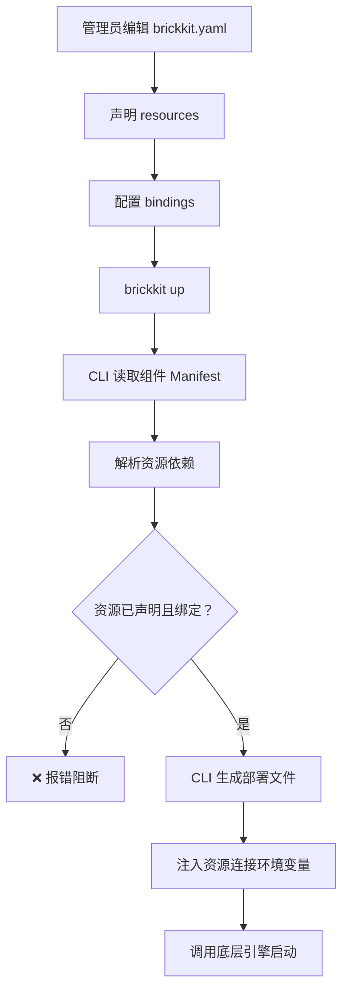
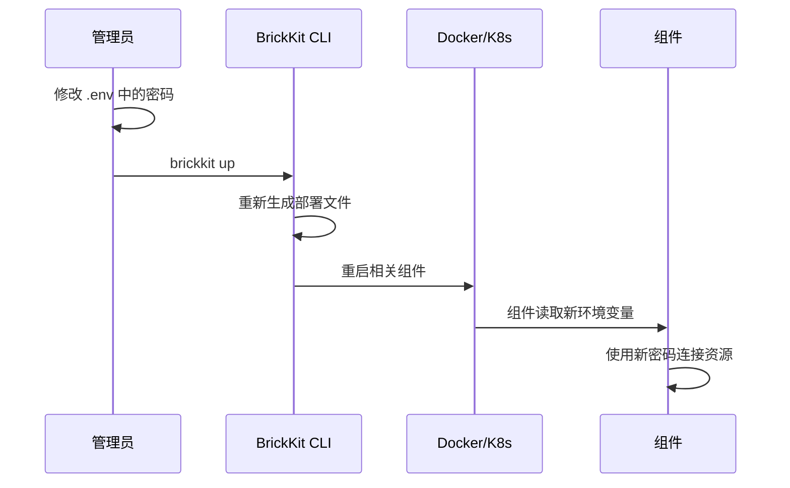
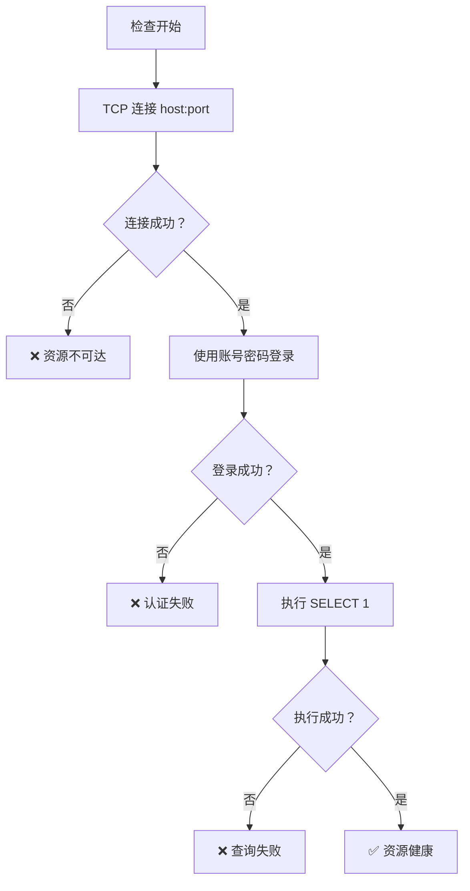
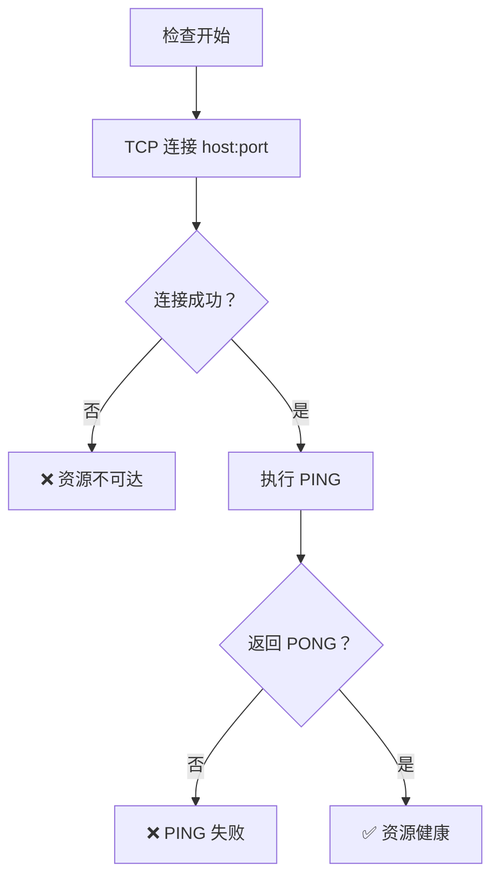
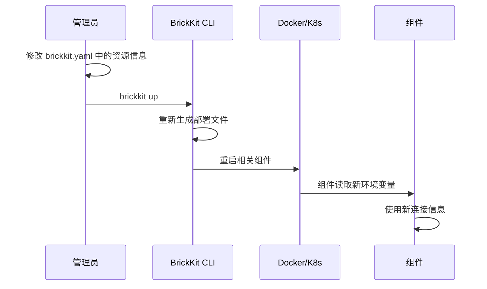

# 006 BrickKit 基础资源规范

## 文档信息

| 项目 | 内容 |
| --- | --- |
| 文档编号 | 006 |
| 文档名称 | 基础资源规范 |
| 所属篇章 | 第六篇：基础资源 |
| 版本 | 1.4.0 |
| 最后更新 | 2026-08-14 |
| 状态 | 定稿 |
| 依赖文档 | 001 平台理念与总体架构、002 组件规范、003 项目配置规范、004 BrickKit CLI 设计、012 架构设计原理与考量 |
| 被依赖文档 | 005 部署与运行规范、008 安全与治理、009 组件开发快速入门 |

---

## 1. 基础资源定义

### 1.1 什么是基础资源

基础资源是组件运行所依赖的外部系统。

它不是组件，不通过 CLI 安装，不在市场上发布。它由运维手动部署，由管理员在 brickkit.yaml 中声明和绑定。

### 1.2 常见基础资源

| 资源类型 | 引擎示例 | 用途 |
| --- | --- | --- |
| 数据库 | PostgreSQL、MySQL | 持久化业务数据 |
| 缓存 | Redis、Memcached | 缓存、会话、分布式锁 |
| 消息队列 | RabbitMQ、Kafka、NATS | 事件传递、异步任务 |
| 对象存储 | MinIO、S3、OSS | 文件、图片、备份 |
| 搜索引擎 | Elasticsearch | 全文搜索 |
| 邮件服务 | SMTP | 邮件发送 |
| 身份源 | LDAP、OAuth2 Provider | 外部认证 |

### 1.3 基础资源与组件的区别

| 维度 | 组件 | 基础资源 |
| --- | --- | --- |
| 谁部署 | CLI 生成部署文件，底层引擎启动 | 运维手动部署 |
| 谁管理 | CLI（安装/更新/回滚） | 管理员在 brickkit.yaml 中声明 |
| 是否在市场发布 | 是 | 否 |
| 是否有 component.yaml | 是 | 否 |
| 是否可自动安装 | 是（`brickkit add`） | 否 |
| 是否可自动更新 | 是 | 否 |
| 生命周期 | CLI 管理 | 运维手动管理 |
| 声明位置 | brickkit.yaml → components | brickkit.yaml → resources |

### 1.4 基础资源的核心原则

- 基础资源必须在 brickkit.yaml 中声明。
- 组件不得硬编码资源连接信息。
- 组件通过 Manifest 中的资源依赖声明需要某类资源。
- 管理员在 brickkit.yaml 中绑定具体资源实例。
- CLI 在生成部署文件时注入资源连接配置（环境变量）。
- 基础资源密钥不得明文写入 brickkit.yaml。
- 基础资源不由平台自动升级。
- 多组件共享资源时必须保持数据边界。

---

## 2. 资源类型与引擎

### 2.1 资源类型（Kind）

资源类型是资源的大类：

| Kind | 说明 | 常见引擎 |
| --- | --- | --- |
| database | 数据库 | postgresql、mysql |
| cache | 缓存 | redis、memcached |
| message-queue | 消息队列 | rabbitmq、kafka、nats |
| object-storage | 对象存储 | minio、s3 |
| search | 搜索引擎 | elasticsearch |
| mail | 邮件服务 | smtp |
| identity-source | 身份源 | ldap、oauth2 |

### 2.2 资源引擎（Engine）

资源引擎是资源的具体实现：

```yaml
# PostgreSQL 数据库
kind: database
engine: postgresql

# Redis 缓存
kind: cache
engine: redis

# RabbitMQ 消息队列
kind: message-queue
engine: rabbitmq
```

### 2.3 组件声明资源依赖

组件在 Manifest 中声明资源依赖时，只声明类型和引擎，不指定具体实例：

```yaml
# component.yaml
dependencies:
  resources:
    - kind: database
      engine: postgresql
    - kind: cache
      engine: redis
```

规则：

- 组件不指定具体的资源实例（如 `postgres-main`）
- 具体实例由管理员在 brickkit.yaml 中绑定
- CLI 在生成部署文件时注入连接信息

---

## 3. 资源声明（brickkit.yaml 中）

### 3.1 资源声明结构

在 brickkit.yaml 的 `resources` 字段中声明：

```yaml
# brickkit.yaml
resources:
  - kind: database              # 资源类型（必须）
    engine: postgresql          # 资源引擎（必须）
    id: postgres-main           # 资源 ID（必须，项目内唯一）
    host: localhost             # 主机地址（必须）
    port: 5432                  # 端口（必须）
    username: dev               # 用户名（可选）
    password: ${POSTGRES_PASSWORD}  # 密码（通过环境变量引用）
    bindings:                   # 绑定到哪些组件（可选）
      - componentId: department/tree
        database: department
      - componentId: people/basic
        database: people
      - componentId: authorization/rbac
        database: authorization
      - componentId: erp/backend
        database: erp

  - kind: cache
    engine: redis
    id: redis-main
    host: localhost
    port: 6379
    password: ${REDIS_PASSWORD}
    bindings:
      - componentId: authorization/rbac
      - componentId: infra/redis-event-bus
```

### 3.2 资源字段说明

| 字段 | 类型 | 必须 | 说明 |
| --- | --- | --- | --- |
| kind | string | ✅ | 资源类型（database/cache/message-queue 等） |
| engine | string | ✅ | 资源引擎（postgresql/redis/rabbitmq 等） |
| id | string | ✅ | 资源 ID，项目内唯一 |
| host | string | ✅ | 主机地址 |
| port | integer | ✅ | 端口 |
| username | string | ❌ | 用户名 |
| password | string | ❌ | 密码（必须通过 `${ENV_VAR}` 引用） |
| database | string | ❌ | 默认数据库名（可被 bindings 覆盖） |
| bindings | array | ❌ | 绑定到哪些组件 |

### 3.3 密码不得硬编码

```yaml
# ✅ 正确：通过环境变量引用
password: ${POSTGRES_PASSWORD}

# ❌ 错误：硬编码密码
password: my-secret-password-123
```

环境变量在 `.env` 文件中定义（Docker 环境）：

```
# .env
POSTGRES_PASSWORD=my-secret-password-123
REDIS_PASSWORD=my-redis-password
MARKET_TOKEN=xxx
```

`.env` 文件必须加入 `.gitignore`。

K8s 环境中，密码通过 Secret 引用（CLI 自动生成 Secret YAML）。

---

## 4. 资源绑定

### 4.1 什么是资源绑定

资源绑定表示某个组件使用哪个资源实例。

### 4.2 绑定声明方式

管理员在 brickkit.yaml 中静态声明 bindings：

```yaml
# brickkit.yaml
resources:
  - kind: database
    engine: postgresql
    id: postgres-main
    host: localhost
    port: 5432
    username: dev
    password: ${POSTGRES_PASSWORD}
    bindings:
      - componentId: people/basic
        database: people          # 该组件使用的 database 名
      - componentId: department/tree
        database: department
      - componentId: authorization/rbac
        database: authorization
```

### 4.3 绑定规则

| 规则 | 说明 |
| --- | --- |
| 一个资源可以绑定多个组件 | 如 postgres-main 绑定 4 个组件 |
| 每个组件使用不同的 database | 数据隔离 |
| 组件声明资源依赖（kind + engine） | Manifest 中声明 |
| 管理员在 brickkit.yaml 中绑定具体实例 | 静态声明 |
| CLI 校验资源是否已声明 | `brickkit up` 时检查 |
| CLI 注入资源连接配置 | 生成部署文件时注入环境变量 |

### 4.4 绑定检查

`brickkit up` 时，CLI 检查：

1. 组件声明了资源依赖（如 `kind: database, engine: postgresql`）
2. brickkit.yaml 中是否已声明对应类型的资源
3. 该资源是否已绑定给当前组件

如果资源未声明或未绑定，CLI 报错阻断：

```
❌ 资源未绑定：
   组件 people/basic 声明依赖 database/postgresql
   但 brickkit.yaml 中未找到对应的资源绑定
   请在 resources 中添加 PostgreSQL 资源并绑定到 people/basic
```

### 4.5 绑定流程



---

## 5. 资源配置注入

### 5.1 核心原则

组件不得硬编码资源连接信息。所有资源连接通过环境变量注入。

### 5.2 环境变量命名

| 资源类型 | 环境变量 |
| --- | --- |
| 数据库 | DATABASE_HOST、DATABASE_PORT、DATABASE_NAME、DATABASE_USER、DATABASE_PASSWORD |
| 缓存 | REDIS_HOST、REDIS_PORT、REDIS_PASSWORD |
| 消息队列 | MQ_HOST、MQ_PORT、MQ_USER、MQ_PASSWORD、MQ_VHOST |
| 对象存储 | STORAGE_ENDPOINT、STORAGE_BUCKET、STORAGE_ACCESS_KEY、STORAGE_SECRET_KEY |
| 搜索引擎 | SEARCH_HOST、SEARCH_PORT、SEARCH_INDEX |
| 邮件服务 | SMTP_HOST、SMTP_PORT、SMTP_USER、SMTP_PASSWORD |

### 5.3 注入示例

安装 `people/basic` 时，CLI 在生成的部署文件中注入：

```
# 数据库连接
DATABASE_HOST=localhost
DATABASE_PORT=5432
DATABASE_NAME=people
DATABASE_USER=dev
DATABASE_PASSWORD=<从 .env 或 K8s Secret 获取>
```

### 5.4 Docker 环境注入

在生成的 docker-compose.yaml 中：

```yaml
people-basic-1-0-0:
  image: registry.brickkit.io/people-basic:1.2.0
  environment:
    - DATABASE_HOST=localhost
    - DATABASE_PORT=5432
    - DATABASE_NAME=people
    - DATABASE_USER=dev
    - DATABASE_PASSWORD=${POSTGRES_PASSWORD}   # 从 .env 读取
```

### 5.5 K8s 环境注入

在生成的 K8s YAML 中：

```yaml
env:
  - name: DATABASE_HOST
    value: "postgres-main"
  - name: DATABASE_PORT
    value: "5432"
  - name: DATABASE_NAME
    value: "people"
  - name: DATABASE_USER
    value: "people_user"
  - name: DATABASE_PASSWORD
    valueFrom:
      secretKeyRef:
        name: people-db-secret
        key: password
```

CLI 同时生成 K8s Secret：

```yaml
apiVersion: v1
kind: Secret
metadata:
  name: people-db-secret
  namespace: brickkit-my-project
type: Opaque
stringData:
  password: ${POSTGRES_PASSWORD}   # 从 .env 读取
```

### 5.6 组件读取资源连接

```python
import os

# 数据库
db_host = os.environ["DATABASE_HOST"]
db_port = int(os.environ["DATABASE_PORT"])
db_name = os.environ["DATABASE_NAME"]
db_user = os.environ["DATABASE_USER"]
db_password = os.environ["DATABASE_PASSWORD"]

# 连接数据库
connection = psycopg2.connect(
    host=db_host,
    port=db_port,
    dbname=db_name,
    user=db_user,
    password=db_password
)
```

### 5.7 多资源注入（envPrefix）

如果一个组件需要多个同类资源，使用 `envPrefix` 区分：

```yaml
# brickkit.yaml
resources:
  - kind: database
    engine: postgresql
    id: postgres-primary
    host: primary-db
    port: 5432
    bindings:
      - componentId: people/basic
        database: people
        envPrefix: PRIMARY       # 环境变量前缀

  - kind: database
    engine: postgresql
    id: postgres-archive
    host: archive-db
    port: 5432
    bindings:
      - componentId: people/basic
        database: people_archive
        envPrefix: ARCHIVE       # 环境变量前缀
```

注入的环境变量：

```
# 主数据库
PRIMARY_DATABASE_HOST=primary-db
PRIMARY_DATABASE_PORT=5432
PRIMARY_DATABASE_NAME=people

# 归档数据库
ARCHIVE_DATABASE_HOST=archive-db
ARCHIVE_DATABASE_PORT=5432
ARCHIVE_DATABASE_NAME=people_archive
```

### 5.8 资源注入与 config 覆盖的关系

资源连接信息和组件自身配置（configSchema）是两套独立的注入机制：

| 注入类型 | 来源 | 示例 |
| --- | --- | --- |
| 资源连接 | brickkit.yaml → resources → bindings | DATABASE_HOST=localhost |
| 自身配置 | Manifest configSchema 默认值 + brickkit.yaml config 覆盖 | DEFAULT_PAGE_SIZE=50 |

两者互不干扰，CLI 在生成部署文件时同时注入。

**注意：CLI 不校验 config 值的类型。** configSchema 是"配置说明书"，不是"安检机"。资源连接信息也不做类型校验，CLI 原样注入。

---

## 6. 密钥管理

### 6.1 核心原则

| 原则 | 说明 |
| --- | --- |
| 密码不写入 brickkit.yaml | 使用 `${ENV_VAR}` 引用 |
| 密码不写入代码仓库 | `.env` 文件加入 `.gitignore` |
| 密码不出现在日志中 | 日志脱敏 |
| 密码不出现在错误信息中 | 错误信息脱敏 |
| 生产环境使用 K8s Secret | CLI 自动生成 Secret YAML |

### 6.2 Docker 环境密钥管理

方式：`.env` 文件

```
# .env（不提交到 Git）
POSTGRES_PASSWORD=my-secret-password-123
REDIS_PASSWORD=my-redis-password
MARKET_TOKEN=xxx
```

brickkit.yaml 中引用：

```yaml
resources:
  - kind: database
    engine: postgresql
    id: postgres-main
    password: ${POSTGRES_PASSWORD}    # 引用 .env 中的变量
```

CLI 生成 docker-compose.yaml 时，密码通过 `${POSTGRES_PASSWORD}` 引用，Docker Compose 自动从 `.env` 读取。

### 6.3 K8s 环境密钥管理

方式：K8s Secret

CLI 自动生成 Secret YAML：

```yaml
# .brickkit/generated/k8s/secrets/resource-secrets.yaml
apiVersion: v1
kind: Secret
metadata:
  name: postgres-main-secret
  namespace: brickkit-my-project
type: Opaque
stringData:
  password: ${POSTGRES_PASSWORD}
---
apiVersion: v1
kind: Secret
metadata:
  name: redis-main-secret
  namespace: brickkit-my-project
type: Opaque
stringData:
  password: ${REDIS_PASSWORD}
```

Deployment 中引用：

```yaml
env:
  - name: DATABASE_PASSWORD
    valueFrom:
      secretKeyRef:
        name: postgres-main-secret
        key: password
```

### 6.4 密钥更新流程



规则：

- 修改密码后必须重新 `brickkit up`
- 组件重启后读取新密码
- 不做热更新（改配置就重启）

### 6.5 密钥安全要求

| 要求 | 说明 |
| --- | --- |
| `.env` 不提交 Git | 加入 `.gitignore` |
| 生产环境使用 K8s Secret | 不依赖 `.env` 文件 |
| 密码定期轮换 | 建议每 90 天 |
| 最小权限账号 | 每个组件使用独立账号 |
| 不输出密码到日志 | 日志脱敏 |
| 不在错误信息中输出密码 | 错误信息脱敏 |

---

## 7. 多组件共享资源

### 7.1 场景

多个组件可以共享同一个资源实例。

例如：

- `people/basic` 使用 postgres-main
- `department/tree` 使用 postgres-main
- `authorization/rbac` 使用 postgres-main
- `erp/backend` 使用 postgres-main

### 7.2 数据隔离

共享资源时必须保持数据边界：

| 方案 | 说明 | 推荐 |
| --- | --- | --- |
| 不同 database | 每个组件一个 database | ⭐ 推荐 |
| 不同 schema | 同一个 database，不同 schema | ✅ 可用 |
| 不同表前缀 | 同一个 schema，不同表前缀 | ❌ 不推荐 |

### 7.3 推荐方案：不同 database

```
PostgreSQL 实例：postgres-main
├── database: people        → people/basic 组件使用
├── database: department    → department/tree 组件使用
├── database: authorization → authorization/rbac 组件使用
└── database: erp           → erp/backend 组件使用
```

### 7.4 brickkit.yaml 中的声明

```yaml
resources:
  - kind: database
    engine: postgresql
    id: postgres-main
    host: localhost
    port: 5432
    username: dev
    password: ${POSTGRES_PASSWORD}
    bindings:
      - componentId: people/basic
        database: people
        username: people_user
      - componentId: department/tree
        database: department
        username: department_user
      - componentId: authorization/rbac
        database: authorization
        username: auth_user
      - componentId: erp/backend
        database: erp
        username: erp_user
```

### 7.5 注入时指定 database

```
# people/basic 组件
DATABASE_HOST=localhost
DATABASE_PORT=5432
DATABASE_NAME=people
DATABASE_USER=people_user
DATABASE_PASSWORD=<people 专用密码>

# department/tree 组件
DATABASE_HOST=localhost
DATABASE_PORT=5432
DATABASE_NAME=department
DATABASE_USER=department_user
DATABASE_PASSWORD=<department 专用密码>
```

### 7.6 数据边界规则

- 组件不得直接访问其他组件的 database。
- 组件不得直接访问其他组件的 schema。
- 组件不得直接访问其他组件的表。
- 即使共享同一个 PostgreSQL 实例，也必须通过 API 调用获取其他组件的数据。

---

## 8. 资源健康检查

### 8.1 检查时机

CLI 在执行 `brickkit up` 时，可选检查资源是否可达：

```bash
brickkit up --check-resources    # 启动前检查资源可达性
brickkit up                      # 不检查，直接启动（默认）
```

### 8.2 检查类型

| 类型 | 适用场景 | 说明 |
| --- | --- | --- |
| tcp | 所有资源 | 检查 host:port 是否可连接 |
| connection | 数据库 | 执行简单查询（如 `SELECT 1`） |
| ping | Redis | 执行 `PING` 命令 |
| http | 外部服务 | GET 请求检查 |

### 8.3 PostgreSQL 健康检查



### 8.4 Redis 健康检查



### 8.5 检查失败处理

```
❌ 资源不可达：
   资源：postgres-main（localhost:5432）
   错误：TCP 连接超时
   建议：
   1. 确认 PostgreSQL 是否已启动
   2. 确认 host 和 port 是否正确
   3. 确认防火墙是否允许连接
```

规则：

- 资源检查失败时，CLI 警告但不阻断（资源可能稍后可用）
- 组件启动后如果连不上资源，组件自己报错
- 生产环境建议使用 `--check-resources` 提前发现问题

---

## 9. 资源生命周期

### 9.1 资源不由平台自动管理

基础资源通常由运维手动维护。CLI 只负责：

| CLI 负责 | CLI 不负责 |
| --- | --- |
| 在 brickkit.yaml 中声明资源 | 创建数据库 |
| 启动前可选健康检查 | 升级数据库版本 |
| 绑定组件 | 修改数据库结构 |
| 注入配置（环境变量） | 迁移生产数据 |
| — | 删除资源数据 |

### 9.2 资源变更流程

资源信息变更（如地址变更、密码变更）：



### 9.3 资源停用

资源停用前必须检查：

- 是否有组件绑定该资源
- 如果有，先解除绑定或移除组件

### 9.4 资源删除

从 brickkit.yaml 中删除资源声明时：

- 只从配置中移除声明
- 不删除真实资源（不删除数据库、不删除 Redis 数据）
- 真实资源删除必须由运维手动执行

### 9.5 组件数据库的创建与命名

9.1 已经界定了归属：**创建数据库不是 CLI 的职责**。这一节明确"那由谁做、怎么做"。

**职责划分：**

| 层次 | 谁负责 | 说明 |
| --- | --- | --- |
| 数据库实例（PostgreSQL 本身） | 运维 | 与 9.1 一致，平台不部署、不升级、不删除 |
| **组件使用的 database** | **使用者 / 运维**，执行一次 | 平台只把库名通过 `DATABASE_NAME` 注入，不创建 |
| database 内的表结构与初始数据 | **组件的 migration** | 由组件声明、CLI 在启动前执行（002 §8） |

**为什么建库不交给组件的 migration：**

| 原因 | 说明 |
| --- | --- |
| 权限 | 建库需要 `CREATEDB`。平台注入的 `DATABASE_USER` 是组件的运行期账号，让每个组件的运行期账号都具备建库权限是全平台范围的提权（008）。云托管数据库上应用账号通常**根本没有**该权限——同一份迁移会"开发能跑、生产必炸" |
| 连接对象 | PostgreSQL 不能在一个库内部创建它自己，必须先连到另一个库。而平台只注入一个 `DATABASE_NAME`，组件要建库就得臆测实例里还有哪些库可连，这正是 5.1 禁止的"组件硬编码资源连接信息" |
| 归属 | 编码、排序规则、表空间、备份策略、配额都是组织级决策，不该由组件用默认值悄悄决定 |

**一个组件一个数据库。** 共用同一个 database 意味着一个组件能读到另一个组件的表，
违反 002 §2.2 的数据自治。

**组件必须在自己的文档中声明它需要的数据库**，给出预设库名与建库命令，
使用者执行一次即可，不需要在日常使用中管理它：

```markdown
## 使用前：创建数据库（执行一次）

本组件预设的数据库名是 `brickkit_department`：

    psql -U postgres -c "CREATE DATABASE brickkit_department"

然后在 brickkit.yaml 中绑定：

    bindings:
      - componentId: department/tree
        database: brickkit_department
```

**命名约定：** 推荐 `<组织前缀>_<组件名>`（如 `brickkit_department`、`brickkit_people`），
避免与实例上已有的库重名。库名不写死在组件代码里——组件只读 `DATABASE_NAME`，
使用者改 `bindings[].database` 即可换库。

**平台的责任是"说清楚"而不是"替你做"：** 库不存在时，`brickkit up --check-resources`
按 8.3 连接**该组件绑定的那个 database**，因而能直接报出"库不存在"，
并给出需要执行的 SQL——而不是让组件在迁移阶段抛出一句难以定位的
`database "xxx" does not exist`。

---

## 10. 本地开发资源

### 10.1 本地开发简化

本地开发时，资源可以简单处理。CLI 生成的 docker-compose.yaml 中可以包含基础资源：

```yaml
# CLI 自动生成的 docker-compose.yaml 中包含基础资源
services:
  postgres:
    image: postgres:15
    environment:
      POSTGRES_USER: brickkit
      POSTGRES_PASSWORD: ${BRICKKIT_DB_PASSWORD:-dev}
    volumes:
      - postgres-data:/var/lib/postgresql/data
    networks:
      - brickkit-net
    healthcheck:
      test: ["CMD-SHELL", "pg_isready -U brickkit"]
      interval: 10s
      timeout: 5s
      retries: 3
    restart: unless-stopped

  redis:
    image: redis:7
    networks:
      - brickkit-net
    healthcheck:
      test: ["CMD", "redis-cli", "ping"]
      interval: 10s
      timeout: 5s
      retries: 3
    restart: unless-stopped
```

### 10.2 本地资源声明

本地开发时，在 brickkit.yaml 中声明：

```yaml
resources:
  - kind: database
    engine: postgresql
    id: postgres-dev
    host: postgres          # Docker Network 中的服务名
    port: 5432
    username: dev
    password: dev           # 本地开发允许简单密码
    bindings:
      - componentId: people/basic
        database: people
      - componentId: department/tree
        database: department

  - kind: cache
    engine: redis
    id: redis-dev
    host: redis             # Docker Network 中的服务名
    port: 6379
    bindings:
      - componentId: authorization/rbac
```

### 10.3 本地开发允许简单密码

本地开发允许使用简单密码（如 `dev`），但生产环境不允许。

### 10.4 本地开发资源由 CLI 管理

当 `deploy.target: docker` 且资源 host 为 Docker Network 内的服务名（如 `postgres`、`redis`）时，CLI 自动在生成的 docker-compose.yaml 中包含该资源的容器定义。

当资源 host 为 IP 地址或域名（如 `10.0.1.10`、`db.mycompany.com`）时，CLI 不生成资源容器，假设资源已由运维部署。

**判断示例：**

```yaml
# 本地开发：host 是 Docker Network 内的服务名 → CLI 生成资源容器
resources:
  - kind: database
    engine: postgresql
    id: postgres-dev
    host: postgres          # ← Docker Network 内的服务名，CLI 生成 postgres 容器
    port: 5432

# 生产环境：host 是外部地址 → CLI 不生成资源容器
resources:
  - kind: database
    engine: postgresql
    id: postgres-prod
    host: 10.0.1.10         # ← 外部 IP 地址，CLI 不生成容器，假设运维已部署
    port: 5432

# 生产环境（云数据库）：host 是域名 → CLI 不生成资源容器
resources:
  - kind: database
    engine: postgresql
    id: postgres-cloud
    host: mydb.rds.amazonaws.com   # ← 云数据库域名，CLI 不生成容器
    port: 5432
```

**重要：** CLI 生成的基础资源容器（postgres/redis）会随 `brickkit down` 停止，但 volume 保留。`brickkit down` 等价于 `docker compose down`（不带 `-v` 参数），不删除 volume。再次 `brickkit up` 时数据恢复。如需彻底清理，请手动执行 `docker volume rm`。

---

## 11. 生产资源策略

### 11.1 生产环境要求

| 要求 | 说明 |
| --- | --- |
| 密钥集中管理 | 使用 K8s Secret 或 Vault |
| 密码定期轮换 | 建议每 90 天轮换 |
| 最小权限账号 | 每个组件使用独立账号 |
| 不同组件不同 database | 数据隔离 |
| 配置不进入代码仓库 | 通过环境变量注入 |
| 资源不暴露公网 | 只在内部网络可达 |
| 定期备份 | 建议每日备份 |

### 11.2 生产资源部署

| 资源 | 部署方式 |
| --- | --- |
| PostgreSQL | 独立服务器 / K8s StatefulSet / 云数据库（RDS） |
| Redis | 独立服务器 / K8s Deployment / 云 Redis |
| RabbitMQ | 独立服务器 / K8s StatefulSet / 云 MQ |
| MinIO/S3 | 独立服务器 / 云对象存储 |

### 11.3 生产资源升级

基础资源升级（如 PostgreSQL 大版本升级）由运维手动执行：

1. 备份
2. 验证
3. 演练
4. 确认回滚方案
5. 执行升级
6. 修改 brickkit.yaml 中的资源信息（如有变化）
7. `brickkit up` 重启相关组件

### 11.4 生产资源安全

| 规则 | 说明 |
| --- | --- |
| 不暴露端口到公网 | 只在内部网络 |
| 使用强密码 | 不使用简单密码 |
| 限制访问 | 只有组件能连接 |
| 定期备份 | 建议每日备份 |
| 监控告警 | 建议接入监控系统 |

---

## 12. 资源与数据库迁移的关系

### 12.1 迁移与资源的关系

组件声明了 `migration.command` 时，CLI 在部署前执行迁移命令。迁移命令需要连接数据库资源。

CLI 在执行迁移时，自动将主容器的资源连接环境变量（特别是 `DATABASE_HOST`、`DATABASE_PASSWORD` 等）原封不动地复制给迁移容器。

### 12.2 迁移容器的资源访问

```yaml
# 迁移容器和主容器共享相同的资源连接环境变量
people-basic-1-0-0-migration:
  image: registry.brickkit.io/people-basic:1.0.0
  # entrypoint 与 command 一起覆盖：镜像带 ENTRYPOINT 时只写 command 会参数错位（002 §8.4）
  entrypoint: ["python"]
  command: ["manage.py", "migrate"]
  environment:
    - DATABASE_HOST=postgres
    - DATABASE_PORT=5432
    - DATABASE_NAME=people
    - DATABASE_USER=people_user
    - DATABASE_PASSWORD=${PEOPLE_DB_PASSWORD}
```

### 12.3 迁移与资源健康检查

如果使用了 `--check-resources`，CLI 会在执行迁移前先检查资源是否可达。资源不可达时，迁移不会执行。

---

## 13. 资源约束总结

- 基础资源必须在 brickkit.yaml 中声明。
- 基础资源必须区分为类型（kind）和引擎（engine）。
- 组件不得硬编码资源连接信息。
- 组件通过资源绑定获取资源配置。
- 资源连接通过环境变量注入。
- 密钥通过环境变量引用（.env）或 K8s Secret，不得硬编码在 brickkit.yaml 中。
- 基础资源由运维手动维护，不由平台自动升级。
- 多组件共享资源时必须使用不同 database 或 schema。
- 组件不得直接访问其他组件的数据。
- 删除资源声明不得删除真实资源。
- 资源停用前必须检查绑定组件。
- 本地开发允许简单配置，生产环境必须严格管理。
- 资源健康检查由 CLI 在启动前可选执行，不由平台轮询。
- 生产环境强制使用 K8s Secret 管理密钥。
- 每个组件使用独立的数据库账号（最小权限）。
- 迁移容器和主容器共享相同的资源连接环境变量。
- `brickkit down` 不删除 volume（数据安全）。CLI 生成的基础资源容器随 `brickkit down` 停止，但 volume 保留。
- CLI 不校验 config 值的类型。资源连接信息也不做类型校验，CLI 原样注入。

---

## 14. 与其他设计书的关系

| 设计书 | 关系 |
| --- | --- |
| 001 平台理念与总体架构 | 定义基础资源的定位 |
| 002 组件规范 | 定义组件如何声明资源依赖；破坏性变更（Major）协同守则 |
| 003 项目配置规范 | 定义 brickkit.yaml 中 resources 字段的完整格式 |
| 004 BrickKit CLI 设计 | 定义 CLI 如何读取资源声明、注入环境变量、执行迁移、检测镜像权限 |
| 005 部署与运行规范 | 定义本地和生产环境资源部署 |
| 008 安全与治理 | 定义密钥安全和资源访问控制、组件信任模型 |
| 009 组件开发快速入门 | 教开发者如何配置资源 |
| 012 架构设计原理与考量 | 本文档所有设计的决策依据 |

---

## 15. 总结

BrickKit 基础资源规范的核心可以用一句话概括：

**资源由运维部署，管理员在 brickkit.yaml 中声明和绑定，CLI 注入环境变量。组件不硬编码，密钥不明文，数据有边界。**

| 维度            | 说明                                     |
| ------------- | -------------------------------------- |
| 资源            | 运维部署 + brickkit.yaml 声明 + 可选健康检查       |
| 绑定            | brickkit.yaml 中静态声明 bindings           |
| 注入            | 环境变量（DATABASE_HOST、DATABASE_PORT...）   |
| 密钥            | `.env` 文件（Docker）/ K8s Secret（生产），不硬编码 |
| 隔离            | 不同组件不同 database/schema                 |
| 生命周期          | 运维手动管理，CLI 不自动升级                       |
| 多资源           | envPrefix 区分同类多资源                      |
| 迁移            | 迁移容器和主容器共享相同的资源连接环境变量                  |
| brickkit down | **不删除 volume**（数据安全）                   |