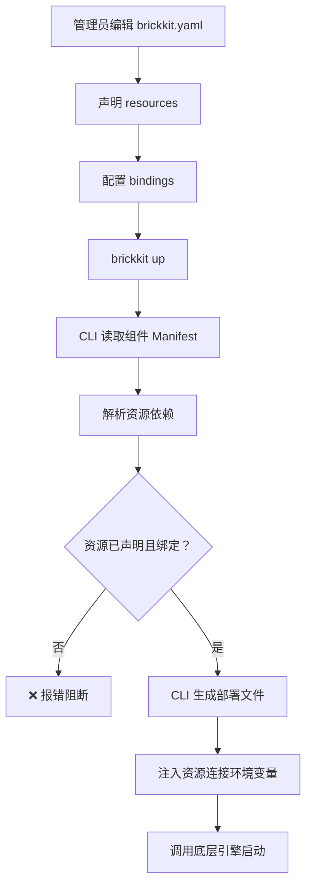
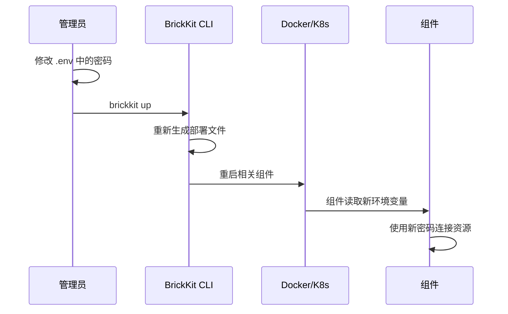
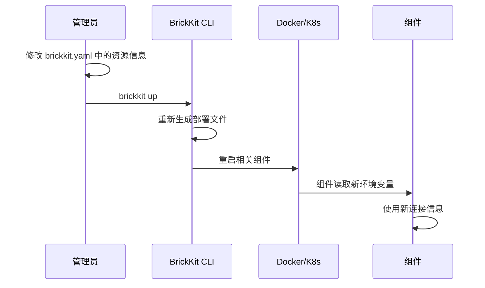

# 006 BrickKit 基础资源规范

## 文档信息

| 项目 | 内容 |
| --- | --- |
| 文档编号 | 006 |
| 文档名称 | 基础资源规范 |
| 所属篇章 | 第六篇：基础资源 |
| 版本 | 1.6.0 |
| 最后更新 | 2026-08-23 |
| 状态 | 定稿 |
| 依赖文档 | 001 平台理念与总体架构、002 组件规范、003 项目配置规范、004 BrickKit CLI 设计、012 架构设计原理与考量 |
| 被依赖文档 | 005 部署与运行规范、008 安全与治理、009 组件开发快速入门 |

---

## 1. 基础资源定义

### 1.1 什么是基础资源

基础资源是组件运行所依赖的外部系统。

它不是组件，不通过 CLI 安装，不在市场上发布。它由运维手动部署，由管理员在 brickkit.yaml 中声明和绑定。

### 1.2 常见基础资源

| 资源类型 | 引擎示例 | 用途 |
| --- | --- | --- |
| 数据库 | PostgreSQL、MySQL | 持久化业务数据 |
| 缓存 | Redis、Memcached | 缓存、会话、分布式锁 |
| 消息队列 | RabbitMQ、Kafka、NATS | 事件传递、异步任务 |
| 对象存储 | MinIO、S3、OSS | 文件、图片、备份 |
| 搜索引擎 | Elasticsearch | 全文搜索 |
| 邮件服务 | SMTP | 邮件发送 |
| 身份源 | LDAP、OAuth2 Provider | 外部认证 |

### 1.3 基础资源与组件的区别

| 维度 | 组件 | 基础资源 |
| --- | --- | --- |
| 谁部署 | CLI 生成部署文件，底层引擎启动 | 运维手动部署 |
| 谁管理 | CLI（安装/更新/回滚） | 管理员在 brickkit.yaml 中声明 |
| 是否在市场发布 | 是 | 否 |
| 是否有 component.yaml | 是 | 否 |
| 是否可自动安装 | 是（`brickkit add`） | 否 |
| 是否可自动更新 | 是 | 否 |
| 生命周期 | CLI 管理 | 运维手动管理 |
| 声明位置 | brickkit.yaml → components | brickkit.yaml → resources |

### 1.4 基础资源的核心原则

- 基础资源必须在 brickkit.yaml 中声明。
- **平台不部署基础资源**：两种部署目标都不生成资源容器；`up` 每次列出"要先跑起来什么"（§10.1）。
- 组件不得硬编码资源连接信息。
- 组件通过 Manifest 中的资源依赖声明需要某类资源。
- 管理员在 brickkit.yaml 中绑定具体资源实例。
- CLI 在生成部署文件时注入资源连接配置（环境变量）。
- 基础资源密钥不得明文写入 brickkit.yaml。
- 基础资源不由平台自动升级。
- 多组件共享资源时必须保持数据边界。

---

## 2. 资源类型与引擎

### 2.1 资源类型（Kind）

资源类型是资源的大类。**这份列表是封闭的**，写别的值 CLI 会报错（见下）：

| Kind | 说明 | 常见引擎 | 注入的连接变量（§5.2） |
| --- | --- | --- | --- |
| `database` | 数据库 | postgresql、mysql | `DATABASE_*` |
| `cache` | 缓存 | redis、memcached | `REDIS_*` |
| `mq` | 消息队列 | rabbitmq、kafka、nats | `MQ_*` |
| `storage` | 对象存储 | minio、s3 | `STORAGE_*` |
| `search` | 搜索引擎 | elasticsearch | `SEARCH_*` |
| `smtp` | 邮件服务 | smtp | `SMTP_*` |

**kind 的名字与环境变量前缀同源，这不是巧合。** 平台"认识"一种资源类型，
靠的就是知道该给它注入哪几个变量——除此之外平台对资源一无所知。
因此列表是封闭的：不认识的 kind，注入引擎无事可做。

⚠️ **不认识的 kind 会被当场拦下**，不会静默放过。放过的后果是：
`brickkit up` 一路绿灯、生成的部署文件看上去完全正常，而组件**一个连接变量
都拿不到**，要到运行时才炸成"连不上库"。

```
❌ 错误：brickkit.yaml 校验失败
   resources[0].kind：不是平台认识的资源类型（当前是 message-queue）；
   可选：database / cache / mq / storage / search / smtp
```

组件 Manifest 里的 `dependencies.resources[].kind` 守的是同一条规则——
两边是按字符串比对的（§4.4），组件写了平台不认识的类型，
使用者照着绑也换不来任何连接变量。

> **`identity-source`（LDAP / OAuth2）曾经列在这张表里，现已移除。**
> 它没有对应的连接变量，声明了也注入不出任何东西。
> 身份源属于组件自己的配置（走 `configSchema`），不是平台托管的基础资源。

### 2.2 资源引擎（Engine）

资源引擎是资源的具体实现：

```yaml
# PostgreSQL 数据库
kind: database
engine: postgresql

# Redis 缓存
kind: cache
engine: redis

# RabbitMQ 消息队列
kind: mq
engine: rabbitmq
```

**kind 是封闭枚举，engine 是自由字符串。** 平台按 kind 决定注入哪组变量，
对 engine 一无所知——它只是写给人看的，说明这个 `mq` 背后是 RabbitMQ 还是 Kafka。

### 2.3 组件声明资源依赖

组件在 Manifest 中声明资源依赖时，只声明类型和引擎，不指定具体实例：

```yaml
# component.yaml
dependencies:
  resources:
    - kind: database
      engine: postgresql
    - kind: cache
      engine: redis
```

规则：

- 组件不指定具体的资源实例（如 `postgres-main`）
- 具体实例由管理员在 brickkit.yaml 中绑定
- CLI 在生成部署文件时注入连接信息

---

## 3. 资源声明（brickkit.yaml 中）

### 3.1 资源声明结构

在 brickkit.yaml 的 `resources` 字段中声明：

```yaml
# brickkit.yaml
resources:
  - kind: database              # 资源类型（必须）
    engine: postgresql          # 资源引擎（必须）
    id: postgres-main           # 资源 ID（必须，项目内唯一）
    host: host.docker.internal  # 主机地址（必须）；资源跑在本机时就写这个
    port: 5432                  # 端口（必须）
    username: dev               # 用户名（可选）
    password: ${POSTGRES_PASSWORD}  # 密码（通过环境变量引用）
    bindings:                   # 绑定到哪些组件（可选）
      - componentId: department/tree
        database: department
      - componentId: people/basic
        database: people
      - componentId: authorization/rbac
        database: authorization
      - componentId: erp/backend
        database: erp

  - kind: cache
    engine: redis
    id: redis-main
    host: host.docker.internal
    port: 6379
    password: ${REDIS_PASSWORD}
    bindings:
      - componentId: authorization/rbac
      - componentId: infra/redis-event-bus
```

### 3.2 资源字段说明

| 字段 | 类型 | 必须 | 说明 |
| --- | --- | --- | --- |
| kind | string | ✅ | 资源类型，见 §2.1 的封闭枚举（database / cache / mq / storage / search / smtp） |
| engine | string | ✅ | 资源引擎（postgresql/redis/rabbitmq 等） |
| id | string | ✅ | 资源 ID，项目内唯一 |
| host | string | ✅ | 主机地址 |
| port | integer | ✅ | 端口 |
| username | string | ❌ | 用户名 |
| password | string | ❌ | 密码（必须通过 `${ENV_VAR}` 引用） |
| database | string | ❌ | 默认数据库名（可被 bindings 覆盖） |
| bindings | array | ❌ | 绑定到哪些组件 |

### 3.3 密码不得硬编码

```yaml
# ✅ 正确：通过环境变量引用
password: ${POSTGRES_PASSWORD}

# ❌ 错误：硬编码密码
password: my-secret-password-123
```

环境变量在 `.env` 文件中定义（Docker 环境）：

```
# .env
POSTGRES_PASSWORD=my-secret-password-123
REDIS_PASSWORD=my-redis-password
MARKET_TOKEN=xxx
```

`.env` 文件必须加入 `.gitignore`。

K8s 环境中，密码通过 Secret 引用（CLI 自动生成 Secret YAML）。

---

## 4. 资源绑定

### 4.1 什么是资源绑定

资源绑定表示某个组件使用哪个资源实例。

### 4.2 绑定声明方式

管理员在 brickkit.yaml 中静态声明 bindings：

```yaml
# brickkit.yaml
resources:
  - kind: database
    engine: postgresql
    id: postgres-main
    host: host.docker.internal
    port: 5432
    username: dev
    password: ${POSTGRES_PASSWORD}
    bindings:
      - componentId: people/basic
        database: people          # 该组件使用的 database 名
      - componentId: department/tree
        database: department
      - componentId: authorization/rbac
        database: authorization
```

### 4.3 绑定规则

| 规则 | 说明 |
| --- | --- |
| 一个资源可以绑定多个组件 | 如 postgres-main 绑定 4 个组件 |
| 每个组件使用不同的 database | 数据隔离 |
| 组件声明资源依赖（kind + engine） | Manifest 中声明 |
| 管理员在 brickkit.yaml 中绑定具体实例 | 静态声明 |
| CLI 校验资源是否已声明 | `brickkit up` 时检查 |
| CLI 注入资源连接配置 | 生成部署文件时注入环境变量 |

### 4.4 绑定检查

`brickkit up` 时，CLI 检查：

1. 组件声明了资源依赖（如 `kind: database, engine: postgresql`）
2. brickkit.yaml 中是否已声明对应类型的资源
3. 该资源是否已绑定给当前组件

检查发生在**生成部署文件之前**，一次报出全部未满足的：

```
❌ 错误：资源依赖未满足
   people/basic@1.0.0：需要 kind: database、engine: postgresql（brickkit.yaml 的 resources 中未声明）
   erp/backend@1.0.0：需要 kind: cache、engine: redis（资源 redis-main 已声明，但未绑定给该组件）
   建议：
   1. 在 brickkit.yaml → resources 中声明该资源（kind + engine 必须与组件声明的一致）
   2. 在该资源的 bindings 中加入 componentId: <组件ID>
   3. 暂时不想跑这个组件的话，给它写 enabled: false
```

**只查本次会启动的组件。** 被 `enabled: false` 关掉、或被级联跳过的组件不参与——
"先把暂时不用的关掉而不是删掉"是正常用法，那些组件当然还没绑资源。
`external` 组件同样跳过：它连哪个库是**部署它的那个项目**的事（003 §4.9）。

**`--dry-run` 时降级成警告，不阻断。** 那条命令的语义是"告诉我会发生什么"，
拿它阻断的话，一个还没配资源的项目连"看看会生成什么"都做不到。
警告里会写明"生成的部署文件里不会有这些连接变量"。

⚠️ **为什么必须在生成之前拦：** 没绑定时注入引擎对该组件的资源依赖无事可做，
生成的 service 里**一个 `DATABASE_*` 都没有**，而那份部署文件看上去完全正常。
组件要到运行时才炸成"连不上库"——一句把**配置遗漏**指向**平台**的错误。

### 4.5 绑定流程



---

## 5. 资源配置注入

### 5.1 核心原则

组件不得硬编码资源连接信息。所有资源连接通过环境变量注入。

### 5.2 环境变量命名

| 资源类型 | 环境变量 |
| --- | --- |
| 数据库 | DATABASE_HOST、DATABASE_PORT、DATABASE_NAME、DATABASE_USER、DATABASE_PASSWORD |
| 缓存 | REDIS_HOST、REDIS_PORT、REDIS_PASSWORD |
| 消息队列 | MQ_HOST、MQ_PORT、MQ_USER、MQ_PASSWORD、MQ_VHOST |
| 对象存储 | STORAGE_ENDPOINT、STORAGE_BUCKET、STORAGE_ACCESS_KEY、STORAGE_SECRET_KEY |
| 搜索引擎 | SEARCH_HOST、SEARCH_PORT、SEARCH_INDEX |
| 邮件服务 | SMTP_HOST、SMTP_PORT、SMTP_USER、SMTP_PASSWORD |

### 5.3 注入示例

安装 `people/basic` 时，CLI 在生成的部署文件中注入：

```
# 数据库连接
DATABASE_HOST=host.docker.internal
DATABASE_PORT=5432
DATABASE_NAME=people
DATABASE_USER=dev
DATABASE_PASSWORD=<从 .env 或 K8s Secret 获取>
```

### 5.4 Docker 环境注入

在生成的 docker-compose.yaml 中：

```yaml
people-basic-1-0-0:
  image: registry.brickkit.io/people-basic:1.2.0
  environment:
    - DATABASE_HOST=host.docker.internal
    - DATABASE_PORT=5432
    - DATABASE_NAME=people
    - DATABASE_USER=dev
    - DATABASE_PASSWORD=${POSTGRES_PASSWORD}   # 从 .env 读取
```

### 5.5 K8s 环境注入

在生成的 K8s YAML 中：

```yaml
env:
  - name: DATABASE_HOST
    value: "postgres-main"
  - name: DATABASE_PORT
    value: "5432"
  - name: DATABASE_NAME
    value: "people"
  - name: DATABASE_USER
    value: "people_user"
  - name: DATABASE_PASSWORD
    valueFrom:
      secretKeyRef:
        name: people-db-secret
        key: password
```

CLI 同时生成 K8s Secret：

```yaml
apiVersion: v1
kind: Secret
metadata:
  name: people-db-secret
  namespace: brickkit-my-project
type: Opaque
stringData:
  password: s3cret-from-dotenv   # ← 生成时已从 .env 求值，不是占位符
```

⚠️ **`${VAR}` 在生成时就求值，清单里写的是真实值，不是占位符。**
`kubectl` **不做任何变量替换**——留着占位符等于把字面量 `"${POSTGRES_PASSWORD}"`
当密码部署上去：Pod 以认证失败反复重启，而那份 YAML 看上去完全正常。
CLI 按 shell 的写法展开 `${VAR}` 与 `${VAR:-默认值}`（取值来源是项目根的 `.env`
与当前进程的环境变量），**展开不了的变量一次性列出并阻断生成**。
Secret 文件权限因此是 `0600`（其余清单 `0644`）。完整对照见 005 §5.6。

### 5.6 组件读取资源连接

```python
import os

# 数据库
db_host = os.environ["DATABASE_HOST"]
db_port = int(os.environ["DATABASE_PORT"])
db_name = os.environ["DATABASE_NAME"]
db_user = os.environ["DATABASE_USER"]
db_password = os.environ["DATABASE_PASSWORD"]

# 连接数据库
connection = psycopg2.connect(
    host=db_host,
    port=db_port,
    dbname=db_name,
    user=db_user,
    password=db_password
)
```

### 5.7 多资源注入（envPrefix）

如果一个组件需要多个同类资源，使用 `envPrefix` 区分：

```yaml
# brickkit.yaml
resources:
  - kind: database
    engine: postgresql
    id: postgres-primary
    host: primary-db
    port: 5432
    bindings:
      - componentId: people/basic
        database: people
        envPrefix: PRIMARY       # 环境变量前缀

  - kind: database
    engine: postgresql
    id: postgres-archive
    host: archive-db
    port: 5432
    bindings:
      - componentId: people/basic
        database: people_archive
        envPrefix: ARCHIVE       # 环境变量前缀
```

注入的环境变量：

```
# 主数据库
PRIMARY_DATABASE_HOST=primary-db
PRIMARY_DATABASE_PORT=5432
PRIMARY_DATABASE_NAME=people

# 归档数据库
ARCHIVE_DATABASE_HOST=archive-db
ARCHIVE_DATABASE_PORT=5432
ARCHIVE_DATABASE_NAME=people_archive
```

### 5.8 资源注入与 config 覆盖的关系

资源连接信息和组件自身配置（configSchema）是两套独立的注入机制：

| 注入类型 | 来源 | 示例 |
| --- | --- | --- |
| 资源连接 | brickkit.yaml → resources → bindings | DATABASE_HOST=host.docker.internal |
| 自身配置 | Manifest configSchema 默认值 + brickkit.yaml config 覆盖 | DEFAULT_PAGE_SIZE=50 |

两者互不干扰，CLI 在生成部署文件时同时注入。

**注意：CLI 不校验 config 值的类型。** configSchema 是"配置说明书"，不是"安检机"。资源连接信息也不做类型校验，CLI 原样注入。

---

## 6. 密钥管理

### 6.1 核心原则

| 原则 | 说明 |
| --- | --- |
| 密码不写入 brickkit.yaml | 使用 `${ENV_VAR}` 引用 |
| 密码不写入代码仓库 | `.env` 文件加入 `.gitignore` |
| 密码不出现在日志中 | 日志脱敏 |
| 密码不出现在错误信息中 | 错误信息脱敏 |
| 生产环境使用 K8s Secret | CLI 自动生成 Secret YAML |

### 6.2 Docker 环境密钥管理

方式：`.env` 文件

```
# .env（不提交到 Git）
POSTGRES_PASSWORD=my-secret-password-123
REDIS_PASSWORD=my-redis-password
MARKET_TOKEN=xxx
```

brickkit.yaml 中引用：

```yaml
resources:
  - kind: database
    engine: postgresql
    id: postgres-main
    password: ${POSTGRES_PASSWORD}    # 引用 .env 中的变量
```

CLI 生成 docker-compose.yaml 时**尽量**保留 `${POSTGRES_PASSWORD}` 这个引用，
由 Docker Compose 自己从 `.env` 读取——那条路上明文密码不进部署文件。

⚠️ **但这不是无条件的。** CLI 在读 `brickkit.yaml` 时就会展开 `${VAR}`，
取值来源是**当前进程的环境变量**（003 §5.4）。所以结果取决于变量定义在哪：

| 变量定义在 | 生成的 compose 里是 | 谁完成了替换 |
| --- | --- | --- |
| 只在项目根的 `.env`（**推荐**） | `${POSTGRES_PASSWORD}`（占位符） | `docker compose` 自己 |
| shell 里 `export` 过 | **展开后的真值** | CLI |

两条路都能跑通。走 `.env` 那条时占位符留在文件里，明文不落盘；
把变量 export 到 shell 里的人（CI 常见）拿到的是一份含明文的 compose——
`.brickkit/generated/` 在 `.gitignore` 里（003 §11），但它确实躺在磁盘上。

完整对照（含 K8s Secret 为什么必须在生成时求值）见 005 §4.9。

⚠️ **`.env` 的位置：Compose 在「项目目录」下找它，而项目目录默认就是部署文件所在目录。** 我们的部署文件固定在 `.brickkit/generated/` 下，而使用者的 `.env` 在项目根——**默认情况下压根读不到**。而 Compose 对未定义的变量**不报错**，直接替换成空串并在 stderr 留一行 warning：于是 `password: ${POSTGRES_PASSWORD}` 变成空密码，postgres 容器以 `Database is uninitialized and superuser password is not specified` 崩溃重启，而使用者手里的 `.env` 明明写着密码。

因此 CLI 调用引擎时**必须显式传 `--project-directory <项目根>`**，`up` / `down` 以及输出里给出的每一条 `docker compose` 命令都要带上它。

⚠️ **"是不是明文密码"要看原文，不能看解析后的值。** CLI 在读 brickkit.yaml 时就把 `${ENV_VAR}` 展开成了真实值（003 §5.4）；拿展开后的值去判断，结论会**完全反过来**：

| 使用者写的 | 环境变量 | 展开后的值 | 拿值判断的结论 | 正确的结论 |
| --- | --- | --- | --- | --- |
| `${POSTGRES_PASSWORD}` | 已配置 | `真实密码` | ❌ 误报"明文密码" | ✅ 没问题 |
| `${POSTGRES_PASSWORD}` | 未配置 | `${POSTGRES_PASSWORD}` | ✅ 没问题 | ⚠️ 变量漏配了 |
| `my-password-123` | — | `my-password-123` | ✅ 报"明文密码" | ✅ 报"明文密码" |

也就是说：使用者**做对了**才被骂，漏配变量反倒不吭声。因此解析器在展开**之前**就记下这条密码写的是不是 `${ENV_VAR}` 引用，告警据此判断。

### 6.3 K8s 环境密钥管理

方式：K8s Secret

CLI 自动生成 Secret YAML：

```yaml
# .brickkit/generated/k8s/secrets/resource-secrets.yaml
apiVersion: v1
kind: Secret
metadata:
  name: postgres-main-secret
  namespace: brickkit-my-project
type: Opaque
stringData:
  password: s3cret-from-dotenv      # ← 生成时已求值
---
apiVersion: v1
kind: Secret
metadata:
  name: redis-main-secret
  namespace: brickkit-my-project
type: Opaque
stringData:
  password: r3dis-from-dotenv       # ← 同上
```

⚠️ **`${VAR}` 在生成时就求值，清单里写的是真实值，不是占位符。**
`kubectl` **不做任何变量替换**——留着占位符等于把字面量 `"${POSTGRES_PASSWORD}"`
当密码部署上去：Pod 以认证失败反复重启，而那份 YAML 看上去完全正常。
CLI 按 shell 的写法展开 `${VAR}` 与 `${VAR:-默认值}`（取值来源是项目根的 `.env`
与当前进程的环境变量），**展开不了的变量一次性列出并阻断生成**。
Secret 文件权限因此是 `0600`（其余清单 `0644`）。完整对照见 005 §5.6。

**每个资源一份 Secret，不是每个组件一份**（005 §5.6）：同一个数据库被三个组件
用到时，密码只该有一份——按组件归集会生成三份内容相同的 Secret，
改密码时改漏一份就是一次线上故障。

Deployment 中引用：

```yaml
env:
  - name: DATABASE_PASSWORD
    valueFrom:
      secretKeyRef:
        name: postgres-main-secret
        key: password
```

### 6.4 密钥更新流程



规则：

- 修改密码后必须重新 `brickkit up`
- 组件重启后读取新密码
- 不做热更新（改配置就重启）

### 6.5 密钥安全要求

| 要求 | 说明 |
| --- | --- |
| `.env` 不提交 Git | 加入 `.gitignore` |
| 生产环境使用 K8s Secret | 不依赖 `.env` 文件 |
| 密码定期轮换 | 建议每 90 天 |
| 最小权限账号 | 每个组件使用独立账号 |
| 不输出密码到日志 | 日志脱敏 |
| 不在错误信息中输出密码 | 错误信息脱敏 |

---

## 7. 多组件共享资源

### 7.1 场景

多个组件可以共享同一个资源实例。

例如：

- `people/basic` 使用 postgres-main
- `department/tree` 使用 postgres-main
- `authorization/rbac` 使用 postgres-main
- `erp/backend` 使用 postgres-main

### 7.2 数据隔离

共享资源时必须保持数据边界：

| 方案 | 说明 | 推荐 |
| --- | --- | --- |
| 不同 database | 每个组件一个 database | ⭐ 推荐 |
| 不同 schema | 同一个 database，不同 schema | ✅ 可用 |
| 不同表前缀 | 同一个 schema，不同表前缀 | ❌ 不推荐 |

### 7.3 推荐方案：不同 database

```
PostgreSQL 实例：postgres-main
├── database: people        → people/basic 组件使用
├── database: department    → department/tree 组件使用
├── database: authorization → authorization/rbac 组件使用
└── database: erp           → erp/backend 组件使用
```

### 7.4 brickkit.yaml 中的声明

最简单的形态：一个资源条目，多个绑定，各用各的 database，**共用同一个账号**。

```yaml
resources:
  - kind: database
    engine: postgresql
    id: postgres-main
    host: host.docker.internal
    port: 5432
    username: dev
    password: ${POSTGRES_PASSWORD}
    bindings:
      - componentId: people/basic
        database: people
      - componentId: department/tree
        database: department
      - componentId: authorization/rbac
        database: authorization
      - componentId: erp/backend
        database: erp
```

**`bindings` 里只有 `componentId` / `database` / `envPrefix` 三个字段**（003 §5.3）。
账号与密码属于**资源条目**，不属于绑定——想让每个组件用各自的账号，见 §7.5。

### 7.5 每个组件一个账号（最小权限）

§11.1 与 008 §15 都要求"每个组件使用独立的数据库账号"。做法不是往 `bindings`
里塞 `username`（那里没有这个字段，写了会被解析器当未知字段报错），
而是**为每个账号写一个资源条目**——同一个 `host`、不同的凭据：

```yaml
resources:
  - kind: database
    engine: postgresql
    id: pg-people                     # 资源 ID 项目内唯一
    host: postgres                    # ← 同一台库
    port: 5432
    username: people_user             # ← 该组件专用账号
    password: ${PEOPLE_DB_PASSWORD}
    bindings:
      - componentId: people/basic
        database: people

  - kind: database
    engine: postgresql
    id: pg-department
    host: postgres                    # ← 同一台库
    port: 5432
    username: department_user
    password: ${DEPARTMENT_DB_PASSWORD}
    bindings:
      - componentId: department/tree
        database: department
```

注入结果：

```
# people/basic 组件
DATABASE_HOST=postgres
DATABASE_PORT=5432
DATABASE_NAME=people
DATABASE_USER=people_user
DATABASE_PASSWORD=<people 专用密码>

# department/tree 组件
DATABASE_HOST=postgres
DATABASE_PORT=5432
DATABASE_NAME=department
DATABASE_USER=department_user
DATABASE_PASSWORD=<department 专用密码>
```

**"资源条目 = 一组连接凭据"，这是理解 `resources` 的关键。** 它不是"一台数据库
一个条目"——同一台库上有几组凭据，就写几个条目。`bindings` 只回答"谁用它、
用哪个 database"。

**平台不部署资源，所以这里没有任何"去重"要操心**（§10.1）：上面两个条目
指向同一台库的两组凭据，平台只是各自注入各自的连接变量。账号与库一样，
由使用者创建一次（§9.5）——平台注入库名与账号，不代建。

`envPrefix` 解决的是另一件事：**同一个组件**要连两个同类资源（主库 + 归档库），
见 §5.7。两者可以叠加使用。

### 7.6 数据边界规则

- 组件不得直接访问其他组件的 database。
- 组件不得直接访问其他组件的 schema。
- 组件不得直接访问其他组件的表。
- 即使共享同一个 PostgreSQL 实例，也必须通过 API 调用获取其他组件的数据。

---

## 8. 资源可达性：平台不替你探

### 8.1 平台不做启动前的资源体检

`brickkit up` **不会**去连一下资源看看通不通。它只做两件事：

1. 每次都把"要先跑起来什么"列出来（含要预先建的库，见 §9.5）；
2. 照常生成、照常启动。

资源没起来时，报错来自**组件自己**（或它的迁移容器，那通常是第一个连库的东西）：

```
dial tcp 172.17.0.1:5432: connect: connection refused
```

### 8.2 为什么不探——同一条理由，三种说法

早先有个 `brickkit up --check-resources`，做的正是"对 `host:port` 拨一次 TCP"。
它已经被**整个删掉**了。删它的理由，与下面这张"为什么不做 SELECT 1"的表
其实是同一条，只是推到了底：

| 理由 | 说明 |
| --- | --- |
| **平台得懂每一种协议** | postgres 要 libpq 握手、redis 要 RESP、rabbitmq 要 AMQP……每支持一种 engine 就多一份要长期维护的客户端依赖，而平台对资源本来一无所知（§2.1：它只知道该注入哪几个变量） |
| **认证失败不等于不可达** | 账号密码是使用者配的，探测账号未必有权限。把"认证失败"报成"资源不可达"，会把人引向网络与防火墙 |
| **它证明不了组件连得上** | 组件用的是**自己那套凭据**、从**容器网络里**连。CLI 从宿主机用另一套凭据连成功，说明不了组件也能连成功 |

第三行才是要害。既然拨号证明不了组件连得上，那它给出的"可达"就是一个
**没有承诺的绿灯**——而绿灯最大的作用恰恰是让人不再往那个方向查。

有两种情形能把这一点说死：

| 情形 | 拨号说 | 事实 |
| --- | --- | --- |
| `host: localhost`（有容器组件绑它） | ✅ 可达 | ❌ 容器里的 `localhost` 是容器自己，连不上 |
| `host` 是容器网络里的服务名 | ❌ 不可达 | ✅ 容器里解析得了，跑得好好的 |

**两个方向都会错，而且错的时候都很有说服力。**

### 8.3 那怎么知道资源通不通

让组件去连——它的失败信息本来就更准确（用的是自己那套凭据、从容器网络里连）。

`up` 的职责是把话说在前面：

```
📌 以下基础资源需要先跑起来（平台不代为部署，见 §9.1）：
   pg-main      postgresql   host.docker.internal:5432  供 people/basic 使用
      需要库 people（供 people/basic 使用）：CREATE DATABASE "people";
```

这是一份**声明**（这些东西得先在），不是一次**探测**（我替你连一下看看）。
声明不会说谎；探测会。

> `brickkit status` 仍然会对 Docker 目标下的资源拨一次号，并如实标明那是
> **从宿主机**看到的结果。它回答的是"现在什么状态"，不是"能不能启动"——
> 没有人会把 status 的一行当成启动前的放行条。K8s 目标下连这一步也不做
> （集群内的 DNS 名，本机根本解析不了，005 §5.5.1）。

## 9. 资源生命周期

### 9.1 资源不由平台自动管理

基础资源通常由运维手动维护。CLI 只负责：

| CLI 负责 | CLI 不负责 |
| --- | --- |
| 在 brickkit.yaml 中声明资源 | **部署资源本身**（不生成任何资源容器，见 §10.1） |
| 每次 `up` 列出"要先跑起来什么" | 创建数据库 |
| 每次 `up` 列出要预先建的库（§9.5） | 升级数据库版本 |
| 绑定组件 | 修改数据库结构 |
| 注入配置（环境变量） | 迁移生产数据 |
| — | 删除资源数据 |

### 9.2 资源变更流程

资源信息变更（如地址变更、密码变更）：



### 9.3 资源停用

资源停用前必须检查：

- 是否有组件绑定该资源
- 如果有，先解除绑定或移除组件

### 9.4 资源删除

从 brickkit.yaml 中删除资源声明时：

- 只从配置中移除声明
- 不删除真实资源（不删除数据库、不删除 Redis 数据）
- 真实资源删除必须由运维手动执行

### 9.5 组件数据库的创建与命名

9.1 已经界定了归属：**创建数据库不是 CLI 的职责**。这一节明确"那由谁做、怎么做"。

**职责划分：**

| 层次 | 谁负责 | 说明 |
| --- | --- | --- |
| 数据库实例（PostgreSQL 本身） | 运维 | 与 9.1 一致，平台不部署、不升级、不删除 |
| **组件使用的 database** | **使用者 / 运维**，执行一次 | 平台只把库名通过 `DATABASE_NAME` 注入，不创建 |
| database 内的表结构与初始数据 | **组件的 migration** | 由组件声明、CLI 在启动前执行（002 §8） |

**为什么建库不交给组件的 migration：**

| 原因 | 说明 |
| --- | --- |
| 权限 | 建库需要 `CREATEDB`。平台注入的 `DATABASE_USER` 是组件的运行期账号，让每个组件的运行期账号都具备建库权限是全平台范围的提权（008）。云托管数据库上应用账号通常**根本没有**该权限——同一份迁移会"开发能跑、生产必炸" |
| 连接对象 | PostgreSQL 不能在一个库内部创建它自己，必须先连到另一个库。而平台只注入一个 `DATABASE_NAME`，组件要建库就得臆测实例里还有哪些库可连，这正是 5.1 禁止的"组件硬编码资源连接信息" |
| 归属 | 编码、排序规则、表空间、备份策略、配额都是组织级决策，不该由组件用默认值悄悄决定 |

**一个组件一个数据库。** 共用同一个 database 意味着一个组件能读到另一个组件的表，
违反 002 §2.2 的数据自治。

**组件必须在自己的文档中声明它需要的数据库**，给出预设库名与建库命令，
使用者执行一次即可，不需要在日常使用中管理它：

```markdown
## 使用前：创建数据库（执行一次）

本组件预设的数据库名是 `brickkit_department`：

    psql -U postgres -c "CREATE DATABASE brickkit_department"

然后在 brickkit.yaml 中绑定：

    bindings:
      - componentId: department/tree
        database: brickkit_department
```

**命名约定：** 推荐 `<组织前缀>_<组件名>`（如 `brickkit_department`、`brickkit_people`），
避免与实例上已有的库重名。库名不写死在组件代码里——组件只读 `DATABASE_NAME`，
使用者改 `bindings[].database` 即可换库。

**平台的责任是"说清楚"而不是"替你做"。** `brickkit up` **每次**都会把本次
需要的库连同建库语句列出来——不是只在出错时，也不需要任何参数：

```
📌 以下数据库需要预先创建（平台不代建，见 006 §9.5）：
   people  （postgres:5432，供 people/basic 使用）
      CREATE DATABASE "people";
   已经建过就无需再执行，建库是一次性操作
```

⚠️ **"库在不在"平台无从知道。** 从连接层面看不出来，而平台不去连（§8）。
所以库没建时，报错来自**迁移容器**（`database "xxx" does not exist`），
上面那段清单是把它提前说清楚的那一半。两者配合：清单说"该建哪些"，
迁移失败说"你还没建"。

---

## 10. 本地开发资源

### 10.1 平台不部署基础资源——两种目标都一样

**CLI 不生成任何基础资源容器。** `brickkit.yaml` 里的 `resources` 是一份
**声明**（它在哪、用什么账号、每个组件用哪个库），不是一份部署指令。
资源由运维/使用者提前准备好，`brickkit up` 只负责把连接信息注入组件，
并在每次启动时把"还需要先跑起来什么"列清楚。

> **v1.2.0 变更：** 早先的 §10.4 规定"`host` 不含点时 CLI 自动生成一个
> postgres / redis 容器"。那条路已经取消，理由见 §10.5。

### 10.2 本地资源声明

本地开发时，资源通常就跑在你自己的机器上。**容器里要写 `host.docker.internal`**：

```yaml
resources:
  - kind: database
    engine: postgresql
    id: pg-dev
    host: host.docker.internal   # ← 容器从这里连宿主机；平台会自动补 extra_hosts
    port: 5432
    username: dev
    password: ${PG_PASSWORD}
    bindings:
      - componentId: people/basic
        database: people
      - componentId: department/tree
        database: department

  - kind: cache
    engine: redis
    id: redis-dev
    host: host.docker.internal
    port: 6379
    bindings:
      - componentId: authorization/rbac
```

| 写法 | 什么时候用 | 平台做什么 |
| --- | --- | --- |
| `host.docker.internal` | 资源跑在**本机**（最常见） | 为绑定它的容器（含迁移容器）自动补 `extra_hosts`；`local: true` 组件的 env 文件里改写成 `localhost` |
| IP / 域名 | 资源跑在别处 | 原样注入 |
| 裸服务名（`pg`、`postgres`） | 你自己把容器接进了本项目网络 | 原样注入，并**警告一次**：平台不会创建叫这个名字的 service |
| `localhost` / `127.0.0.1` / `::1` | 只有**全部使用者都是 `local: true`** 时才对 | 原样注入；有容器组件绑它时**警告一次** |

⚠️ **不要写 `localhost`。** 容器里的 `localhost` 是容器自己，不是你的机器。

这条规矩长期**没有任何东西执行它**：生成的部署文件完全正常，
`DATABASE_HOST=localhost` 老老实实注进去，容器一起来就去连自己的 5432——
那里什么都没有。表现是启动之后才出现的 `connection refused`，而配置挑不出毛病。
更糟的是它极容易被写出来：**本规范书自己的示例，以及 003 §2 / §8.1、
011 §2.5，长期写的就是 `host: localhost`**（已全部改掉）。

一条照着规范抄就会中招的规矩，不能只靠文档。因此有容器组件绑定回环地址时，
生成阶段会警告一次：

```
⚠️ 基础资源的 host 写成了 localhost，容器里连不上
   资源：pg-main
   要连它的组件：people/basic
   原因：容器里的 localhost 指的是**容器自己**，不是你的机器（006 §10.2）
   建议：
   1. 资源跑在本机时写 host: host.docker.internal（平台会自动补 extra_hosts）
   2. 资源跑在别处时写它的 IP 或域名
   3. 只有 local: true 的组件用它时才可以写 localhost——那些进程确实在宿主机上
```

**判据是"有没有容器组件绑它"，不是"host 长什么样"。** 绑定它的组件全是
`local: true` 时 `localhost` 恰恰是对的（那些进程就在宿主机上，平台也只把这个
地址写进 `local-debug.*.env`），那种项目不会看到这条警告。

按 host 的字面形状决定行为，正是 §10.5 刚废掉的那种隐式判据——所以这里只**警告**，
不改写、不阻断。K8s 目标下同样警告，只是建议改成集群内地址（那里没有宿主机可指）。

### 10.3 本地开发允许简单密码

本地开发允许使用简单密码（如 `dev`），但生产环境不允许。密码仍应通过
`${ENV_VAR}` 引用（006 §3.3）——那不只是为了保密，也是为了让"明文密码"
这条告警能判得准（§6.2）。

### 10.4 想快速起一套：仓库里有现成的

平台不部署资源，但"本地想快速起一套"是真实需求。仓库里有一份**手写**的
开发资源栈（与 `deploy/market/` 同一个做法）：

```bash
docker compose -f deploy/dev-resources/docker-compose.yaml up -d     # postgres + redis
docker compose -f deploy/dev-resources/docker-compose.yaml down       # 停（数据保留）
docker compose -f deploy/dev-resources/docker-compose.yaml down -v    # 连数据一起删
```

它把端口发布到宿主机，所以 `brickkit.yaml` 里写 `host.docker.internal` 即可。
`brickkit up` 每次都会在资源清单末尾提示这条命令。

**为什么是手写文件而不是平台生成：** 它是一份**样例**，使用者可以随手改
（换 postgres 版本、加 extension、调参数、加一个 kafka）。平台生成的话，
这些都得变成平台的配置项——而平台对这些一无所知。

### 10.5 为什么取消"CLI 托管资源容器"

早先的规则是：`host` 不含点 → CLI 在 docker-compose.yaml 里生成一个
postgres / redis 容器；含点 → 什么都不做。取消它有四条理由，
每条单独都不够，合起来足够：

| 理由 | 说明 |
| --- | --- |
| **只覆盖 6 种 kind 里的 2 种** | 只有 `database`（postgres）与 `cache`（redis）有生成逻辑。`mq` / `storage` / `search` / `smtp` 会生成一个**没有 image 的 service**，`docker compose` 直接判定整份文件非法 |
| **K8s 目标下从来不存在** | 同一份 `resources` 声明，两种部署目标行为不同——而这个平台在别处拼命避免的正是这种分叉 |
| **触发条件是隐式的** | 一个点决定平台要不要替你部署一个数据库。试用指南 13 把它列为"真踩过的坑" |
| **托管出来的实例没法共享** | 两个项目各写 `host: pg`，得到的是**两个独立容器**（各在自己的 compose project 里）。所以 005 §5A.3 教跨项目共享时只能用 `host.docker.internal`——又绕回不托管这条路 |

还有一条立场上的：006 §9.1 早就写着平台不建库、不升级、不迁数据。
生成容器意味着**平台肯建服务器，却拒绝建里面的库**——这条线画得没道理。

取消之后同时消失的两个缺陷：`local: true` 组件绑定的资源不会被启动
（它不在"要启动的 service"名单里，没人把它带起来），
以及上面那条非法 compose。

## 11. 生产资源策略

### 11.1 生产环境要求

| 要求 | 说明 |
| --- | --- |
| 密钥集中管理 | 使用 K8s Secret 或 Vault |
| 密码定期轮换 | 建议每 90 天轮换 |
| 最小权限账号 | 每个组件使用独立账号 |
| 不同组件不同 database | 数据隔离 |
| 配置不进入代码仓库 | 通过环境变量注入 |
| 资源不暴露公网 | 只在内部网络可达 |
| 定期备份 | 建议每日备份 |

### 11.2 生产资源部署

| 资源 | 部署方式 |
| --- | --- |
| PostgreSQL | 独立服务器 / K8s StatefulSet / 云数据库（RDS） |
| Redis | 独立服务器 / K8s Deployment / 云 Redis |
| RabbitMQ | 独立服务器 / K8s StatefulSet / 云 MQ |
| MinIO/S3 | 独立服务器 / 云对象存储 |

### 11.3 生产资源升级

基础资源升级（如 PostgreSQL 大版本升级）由运维手动执行：

1. 备份
2. 验证
3. 演练
4. 确认回滚方案
5. 执行升级
6. 修改 brickkit.yaml 中的资源信息（如有变化）
7. `brickkit up` 重启相关组件

### 11.4 生产资源安全

| 规则 | 说明 |
| --- | --- |
| 不暴露端口到公网 | 只在内部网络 |
| 使用强密码 | 不使用简单密码 |
| 限制访问 | 只有组件能连接 |
| 定期备份 | 建议每日备份 |
| 监控告警 | 建议接入监控系统 |

---

## 12. 资源与数据库迁移的关系

### 12.1 迁移与资源的关系

组件声明了 `migration.command` 时，CLI 在部署前执行迁移命令。迁移命令需要连接数据库资源。

CLI 在执行迁移时，自动将主容器的资源连接环境变量（特别是 `DATABASE_HOST`、`DATABASE_PASSWORD` 等）原封不动地复制给迁移容器。

### 12.2 迁移容器的资源访问

```yaml
# 迁移容器和主容器共享相同的资源连接环境变量
people-basic-1-0-0-migration:
  image: registry.brickkit.io/people-basic:1.0.0
  # entrypoint 与 command 一起覆盖：镜像带 ENTRYPOINT 时只写 command 会参数错位（002 §8.4）
  entrypoint: ["python"]
  command: ["manage.py", "migrate"]
  environment:
    - DATABASE_HOST=postgres
    - DATABASE_PORT=5432
    - DATABASE_NAME=people
    - DATABASE_USER=people_user
    - DATABASE_PASSWORD=${PEOPLE_DB_PASSWORD}
```

### 12.3 资源不可达时，迁移照常执行

平台不在启动前探测资源（§8），所以资源没起来时，**第一个发现的就是迁移容器**——
它通常是整条链路上第一个连库的东西。这不是缺陷，是有意的：那条失败信息
比平台能给出的任何探测结论都准确，因为迁移用的是组件自己的凭据、
从容器网络里连。

> 这一节先后错过两次，方向相反，值得都留着：
>
> 最早写的是"资源不可达时，迁移不会执行"——**阻断是错的**，CLI 从宿主机探不通
> 不代表容器网络里也探不通（最常见的就是 `host` 写的是服务名，那时宿主机
> 根本解析不了它）。
>
> 改过之后写的是"`--check-resources` 的警告会先于迁移出现"——那个参数
> 后来整个删掉了（§8.2）。一个只警告、还可能警告错的前置检查，
> 存在的唯一效果是让人多看一眼然后忽略它。

---

## 13. 资源约束总结

- 基础资源必须在 brickkit.yaml 中声明。
- **平台不部署基础资源**：两种部署目标都不生成资源容器；`up` 每次列出"要先跑起来什么"（§10.1）。
- 基础资源必须区分为类型（kind）和引擎（engine）。
- 组件不得硬编码资源连接信息。
- 组件通过资源绑定获取资源配置。
- 资源连接通过环境变量注入。
- 密钥通过环境变量引用（.env）或 K8s Secret，不得硬编码在 brickkit.yaml 中。
- 基础资源由运维手动维护，不由平台自动升级。
- 多组件共享资源时必须使用不同 database 或 schema。
- 组件不得直接访问其他组件的数据。
- 删除资源声明不得删除真实资源。
- 资源停用前必须检查绑定组件。
- 本地开发允许简单配置，生产环境必须严格管理。
- 平台不探测资源可达性（§8）：拨号证明不了组件连得上，两个方向都会错。资源通不通由组件自己的失败回答，也不由平台轮询。
- 生产环境强制使用 K8s Secret 管理密钥。
- 每个组件使用独立的数据库账号（最小权限）。
- 迁移容器和主容器共享相同的资源连接环境变量。
- `brickkit down` 不删除 volume（数据安全）。基础资源不由平台部署，因此 `down` 根本不会碰到它们。
- CLI 不校验 config 值的类型。资源连接信息也不做类型校验，CLI 原样注入。

---

## 14. 与其他设计书的关系

| 设计书 | 关系 |
| --- | --- |
| 001 平台理念与总体架构 | 定义基础资源的定位 |
| 002 组件规范 | 定义组件如何声明资源依赖；破坏性变更（Major）协同守则 |
| 003 项目配置规范 | 定义 brickkit.yaml 中 resources 字段的完整格式 |
| 004 BrickKit CLI 设计 | 定义 CLI 如何读取资源声明、注入环境变量、执行迁移、检测镜像权限 |
| 005 部署与运行规范 | 定义本地和生产环境资源部署 |
| 008 安全与治理 | 定义密钥安全和资源访问控制、组件信任模型 |
| 009 组件开发快速入门 | 教开发者如何配置资源 |
| 012 架构设计原理与考量 | 本文档所有设计的决策依据 |

---

## 15. 总结

BrickKit 基础资源规范的核心可以用一句话概括：

**资源由运维部署，管理员在 brickkit.yaml 中声明和绑定，CLI 注入环境变量。组件不硬编码，密钥不明文，数据有边界。**

| 维度            | 说明                                     |
| ------------- | -------------------------------------- |
| 资源            | 运维/使用者部署 + brickkit.yaml 声明。**平台不生成资源容器，也不探测可达性** |
| 绑定            | brickkit.yaml 中静态声明 bindings           |
| 注入            | 环境变量（DATABASE_HOST、DATABASE_PORT...）   |
| 密钥            | `.env` 文件（Docker）/ K8s Secret（生产），不硬编码 |
| 隔离            | 不同组件不同 database/schema                 |
| 生命周期          | 运维手动管理，CLI 不自动升级                       |
| 多资源           | envPrefix 区分同类多资源                      |
| 迁移            | 迁移容器和主容器共享相同的资源连接环境变量                  |
| brickkit down | **不碰基础资源**（平台没部署它们）                   |