# 007 BrickKit 组件市场设计

## 文档信息

| 项目 | 内容 |
| --- | --- |
| 文档编号 | 007 |
| 文档名称 | 组件市场设计 |
| 所属篇章 | 第七篇：组件市场（BrickKit Market） |
| 版本 | 1.5.1 |
| 最后更新 | 2026-08-23 |
| 状态 | 定稿 |
| 依赖文档 | 001 平台理念与总体架构、002 组件规范、004 BrickKit CLI 设计、012 架构设计原理与考量 |
| 被依赖文档 | 009 组件开发快速入门、010 组件发布与上架指南、011 组件安装与拼装指南 |

---

## 1. 市场定位

BrickKit Market（组件市场）是一个独立的公共平台。

它不是组件，不是 CLI 的模块，不需要被安装。它是一个独立的 SaaS 服务，所有人都可以访问。

### 1.1 市场是什么

| 类比 | 说明 |
| --- | --- |
| npmjs.com | 前端包的公共仓库 |
| Docker Hub | 容器镜像的公共仓库 |
| App Store | 应用的公共商店 |
| BrickKit Market | 组件的公共仓库和商店 |

### 1.2 市场做什么

| 功能 | 说明 |
| --- | --- |
| 组件发布 | 开发者上传组件的 Manifest、镜像引用和产物文件 |
| 组件发现 | 用户搜索和浏览可用组件 |
| 版本管理 | 管理组件的所有版本（精确版本） |
| 可见性控制 | 控制组件是 public 还是 private |
| 签名校验 | 确保组件未被篡改 |
| 分类标签 | 通过 tags 对组件进行分类 |
| 产物存储 | 开源：登记 Git 仓库地址；闭源：存储 Manifest + 镜像引用 + API 契约文件 |
| 产物分发 | 存储和分发组件附带的产物文件（API 契约、SDK、文档等） |

### 1.3 市场不做什么

| 不做的事 | 原因 |
| --- | --- |
| 不安装组件 | 安装是 CLI 的事 |
| 不运行组件 | 运行是 Docker/K8s 的事 |
| 不管理运行状态 | 状态由底层引擎持有 |
| 不做组件间的通信 | 通信是组件自己的事 |
| 不生成部署文件 | 部署文件由 CLI 根据 Manifest 自动生成 |
| 不做通信治理 | 熔断/限流/重试是组件自己的事 |
| 不做第三方组件安全审查 | 信任模型：安装即信任，平台只做 `blocked` 下架 |
| 不解析产物文件内容 | 市场只负责存储和分发，不理解 proto / OpenAPI 等文件内容 |

### 1.4 市场与 CLI 的关系

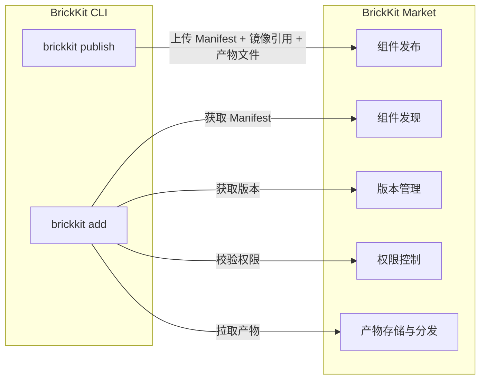

**市场回答：** 有什么可以装？谁有权装？

**CLI 回答：** 怎么装？装好了没有？

---

## 2. 市场架构

### 2.1 整体架构

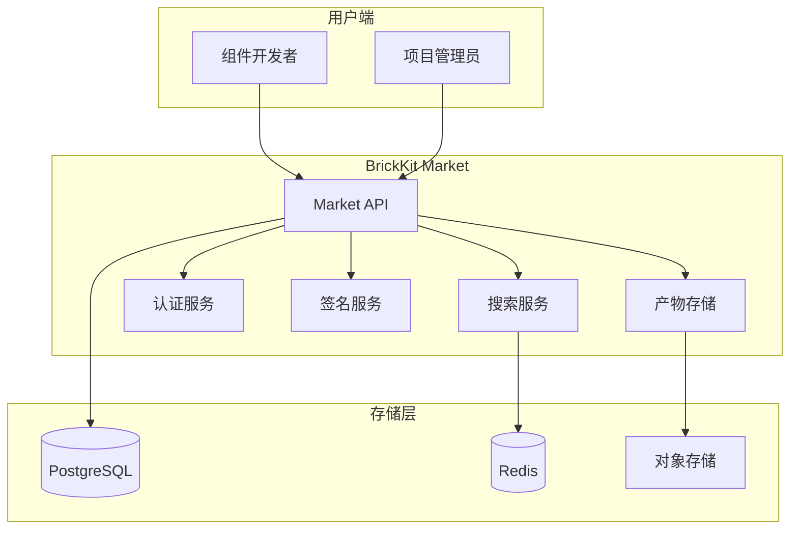

### 2.2 市场核心服务

| 服务 | 职责 |
| --- | --- |
| Market API | 所有市场操作的统一入口 |
| 认证服务 | 用户认证、组织管理、权限控制 |
| 搜索服务 | 组件搜索、分类筛选、标签过滤 |
| 签名服务 | 组件签名生成和校验 |
| 版本服务 | 组件版本的创建、查询、状态管理 |
| 产物存储服务 | 存储 Manifest、镜像引用、API 契约文件、闭源组件配置文件 |

### 2.3 市场是独立服务

市场不依赖 BrickKit CLI。它是一个完全独立的 SaaS 平台。

| 依赖 | 用途 |
| --- | --- |
| PostgreSQL | 组件元数据、版本、用户、组织 |
| Redis | 搜索缓存、会话缓存 |
| 对象存储 | Manifest 文件、产物文件（proto / OpenAPI / SDK 等）、文档 |
| 镜像仓库 | 存储组件镜像（独立服务） |

市场作为公共平台，需要高可用：

- API 层多实例部署
- 数据库主从复制
- Redis 集群
- CDN 加速静态资源

---

## 3. 组件发布流程

### 3.1 发布方式

**发布只有一条路：`brickkit publish`**（004 §3.11）。开发者本地与 CI/CD 用的是同一条。

市场本身只有 HTTP API，**没有 Web 界面**（见 §3.6）。

### 3.2 发布流程图

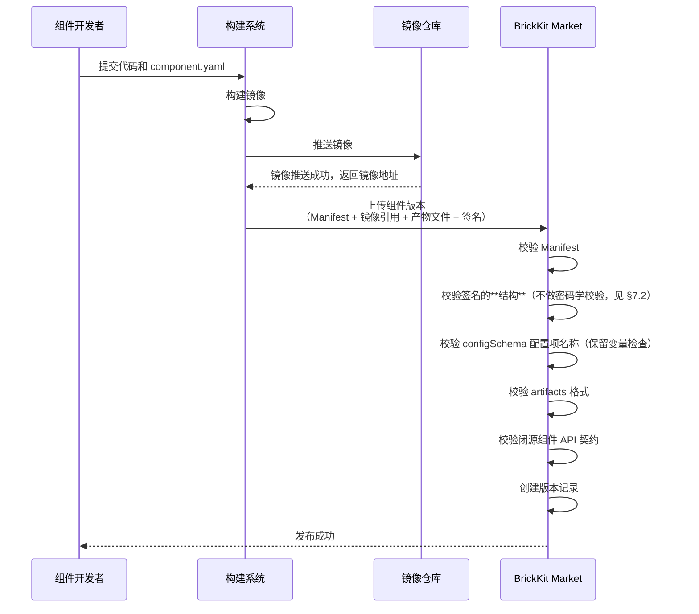

### 3.3 发布产物

每次发布包含以下内容：

| 产物 | 说明 | 必须 |
| --- | --- | --- |
| component.yaml | 组件 Manifest | ✅ |
| 镜像引用 | 指向镜像仓库中的 Docker image 地址 | ✅ |
| 更新说明 | changelog | ✅ |
| 签名信息 | 组件签名 | 建议 |
| Git 仓库地址 | 开源组件的源码地址 | 开源时必须 |
| API 契约文件 | proto / OpenAPI / 其他契约文件（通过 artifacts 声明） | 闭源组件必须（如提供 API） |
| 其他附件 | SDK、文档等（通过 artifacts 声明） | 可选 |

**注意：**

- 市场不存储 docker-compose 文件或 K8s YAML 文件。部署文件由 CLI 根据 component.yaml 自动生成。
- 所有组件都是 container（包括前端组件，使用 nginx 等 Web Server）。没有"静态资源"的特殊处理。

### 3.4 发布要求

| 要求 | 说明 |
| --- | --- |
| 必须认证 | 发布者必须登录市场 |
| 必须有 Manifest | component.yaml 格式必须合法 |
| 必须有版本号 | 精确语义化版本，不可重复 |
| 必须有镜像引用 | 指向可访问的镜像地址 |
| 签名（建议） | 市场**不强制**：发不发由发布者决定，市场只校验结构。"生产环境强制"指的是**安装侧**——使用者的 `installer.requireSignature`（008 §8.5） |
| configSchema 配置项名称不得与保留变量冲突 | 见第 18 节校验规则 |
| artifacts 格式必须合法 | 每个 artifact 必须有 type 和 files |
| 闭源组件必须提供 API 契约 | 如果闭源组件提供 API，必须存在至少一个 `type: api-contract` 的 artifact |

### 3.5 CLI 发布命令

```bash
brickkit publish \
  --path ./components/people/basic \
  --visibility public \
  --changelog "新增人员状态字段" \
  --sign
```

CLI 发布行为：

1. **检查登录状态：** 如果 `.brickkit/credentials` 不存在且 `brickkit.yaml` 中没有 `authToken`，报错提示先执行 `brickkit login`
2. 读取组件目录中的 `component.yaml`
3. 校验 Manifest 格式
4. 读取 Manifest 中的 `artifacts` 字段
5. 检查镜像引用是否有效
6. 上传到市场（Manifest + 镜像引用 + 产物文件 + 签名）
7. 设置可见性

### 3.6 为什么没有 Web 界面

市场是一个**纯 HTTP API 服务**，不带前端。发布、搜索、看审计日志都走 API。

这一节从前描述的是一套表单式发布流程（登录 → 填表 → 上传 → 点发布）。**那个界面从来没有存在过**，而 §17.2、§16.3 与 010 §7.4 都把它当既有能力引用——照着做的人会打开浏览器发现什么都没有。删掉那段描述，是因为一份写着"定稿"的规范书描述一个不存在的东西，比缺一节更糟。

**将来要补的话，多半也不是 Web 界面。** 这个平台的使用者是开发者，而发布这件事本来就发生在他刚构建完镜像的那个终端里——`brickkit publish` 已经在那儿了。真正缺的是**发现**（"有什么可以装"），而那更适合做成一个 `search` 子命令（§17.2），不是一个要单独维护技术栈、构建流水线、会话认证的网页。

**在此之前，非 CLI 的操作直接调 API**（§9 有完整清单）：

```bash
# 搜索组件
curl -s "$MARKET/api/v1/components?keyword=people" | jq .
# 看审计日志（需要认证）
curl -s -H "Authorization: Bearer $TOKEN" "$MARKET/api/v1/audit" | jq .
```

### 3.7 发布请求示例

```json
POST /api/v1/components/people/basic/versions
{
  "version": "1.2.0",
  "status": "stable",
  "manifest": {
    "apiVersion": "brickkit/v1",
    "kind": "Component",
    "metadata": {
      "id": "people/basic",
      "name": "基础人员组件",
      "version": "1.2.0",
      "description": "提供基础人员管理能力"
    },
    "tags": ["people", "master-data"],
    "artifacts": [
      {
        "type": "api-contract",
        "format": "protobuf",
        "description": "gRPC API 契约文件",
        "files": ["proto/people/v1/people.proto"]
      },
      {
        "type": "api-docs",
        "format": "openapi",
        "description": "HTTP REST API 文档",
        "files": ["openapi.json"]
      }
    ],
    "dependencies": {
      "components": [
        { "id": "department/tree", "version": "1.0.0" },
        { "id": "infra/redis-event-bus", "version": "1.0.0", "optional": true }
      ],
      "resources": [
        { "kind": "database", "engine": "postgresql" }
      ]
    },
    "deployment": {
      "type": "container",
      "image": "registry.brickkit.io/people-basic:1.2.0",
      "port": 8080,
      "resources": {
        "requests": {
          "cpu": "100m",
          "memory": "128Mi"
        },
        "limits": {
          "cpu": "500m",
          "memory": "512Mi"
        }
      }
    },
    "migration": {
      "command": ["python", "manage.py", "migrate"]
    },
    "healthCheck": {
      "type": "http",
      "path": "/healthz"
    },
  },
  "sourceType": "git",
  "gitUrl": "https://github.com/brickkit/people-basic.git",
  "artifacts": [
    {
      "type": "container",
      "reference": "registry.brickkit.io/people-basic:1.2.0",
      "checksum": "sha256:abc123..."
    },
    {
      "type": "api-contract",
      "format": "protobuf",
      "description": "gRPC API 契约文件",
      "files": ["proto/people/v1/people.proto"]
    },
    {
      "type": "api-docs",
      "format": "openapi",
      "description": "HTTP REST API 文档",
      "files": ["openapi.json"]
    }
  ],
  "changelog": "新增人员状态字段",
  "signature": {
    "algorithm": "cosign",
    "value": "MEUCIQ..."
  }
}
```

---

## 4. 组件发现与搜索

### 4.1 搜索方式

| 方式 | 说明 |
| --- | --- |
| 关键字搜索 | 按组件名称、描述搜索 |
| 标签筛选 | 按 tags 筛选 |
| 命名空间筛选 | 按 scope 筛选 |
| 版本状态筛选 | stable / deprecated |
| 可见性筛选 | public / private（需登录） |
| 来源类型筛选 | git / registry（开源/闭源） |

### 4.2 搜索 API

```
GET /api/v1/components?keyword=people&tags=master-data&page=1&pageSize=20
```

响应：

```json
{
  "success": true,
  "data": {
    "items": [
      {
        "componentId": "people/basic",
        "name": "基础人员组件",
        "description": "提供基础人员管理能力",
        "latestVersion": "1.2.0",
        "tags": ["people", "master-data"],
        "visibility": "public",
        "sourceType": "git",
        "status": "active",
        "downloads": 1523,
        "publishedAt": "2026-01-01T10:00:00Z"
      }
    ],
    "total": 1
  }
}
```

### 4.3 组件详情页

```
GET /api/v1/components/people/basic
```

响应：

```json
{
  "componentId": "people/basic",
  "name": "基础人员组件",
  "description": "提供基础人员管理能力",
  "vendor": "brickkit-official",
  "tags": ["people", "master-data"],
  "visibility": "public",
  "sourceType": "git",
  "gitUrl": "https://github.com/brickkit/people-basic.git",
  "latestVersion": "1.2.0",
  "versions": ["1.0.0", "1.1.0", "1.2.0"],
  "dependencies": {
    "components": [
      { "id": "department/tree", "version": "1.0.0" }
    ],
    "resources": [{ "kind": "database", "engine": "postgresql" }]
  },
  "readme": "...",
  "downloads": 1523,
  "createdAt": "2025-12-01T10:00:00Z"
}
```

### 4.4 版本列表

```
GET /api/v1/components/people/basic/versions
```

响应：

```json
{
  "success": true,
  "data": [
    {
      "version": "1.2.0",
      "status": "stable",
      "publishedAt": "2026-01-15T10:00:00Z",
      "changelog": "新增人员状态字段"
    },
    {
      "version": "1.1.0",
      "status": "stable",
      "publishedAt": "2026-01-05T10:00:00Z",
      "changelog": "优化查询性能"
    },
    {
      "version": "1.0.0",
      "status": "stable",
      "publishedAt": "2025-12-01T10:00:00Z",
      "changelog": "首次发布"
    }
  ]
}
```

### 4.5 获取 Manifest

```
GET /api/v1/components/people/basic/versions/1.2.0/manifest
```

CLI 执行 `brickkit add` 时调用此 API 获取 Manifest。

---

## 5. 可见性与权限控制

### 5.1 可见性模型

| 可见性 | 说明 | 谁能看到 | 谁能安装 |
| --- | --- | --- | --- |
| public | 公开 | 所有人 | 所有人 |
| private | 私有 | 授权用户/组织 | 授权用户/组织 |

### 5.2 public 组件

```json
{
  "componentId": "people/basic",
  "visibility": "public"
}
```

- 任何人可以在市场中搜索到
- 任何人可以查看 Manifest
- 任何人可以下载产物文件（API 契约等）
- 任何人可以安装
- 镜像仓库中的镜像也是公开的

### 5.3 private 组件

```json
{
  "componentId": "mycompany/approval",
  "visibility": "private",
  "accessControl": {
    "allowedOrganizations": ["org-mycompany"],
    "allowedUsers": ["user-admin-1", "user-admin-2"]
  }
}
```

- 只有授权用户/组织可以在市场中搜索到
- 只有授权用户/组织可以查看 Manifest
- 只有授权用户/组织可以下载产物文件（API 契约等）
- 只有授权用户/组织可以安装
- 镜像仓库中的镜像也是私有的

### 5.4 权限控制流程

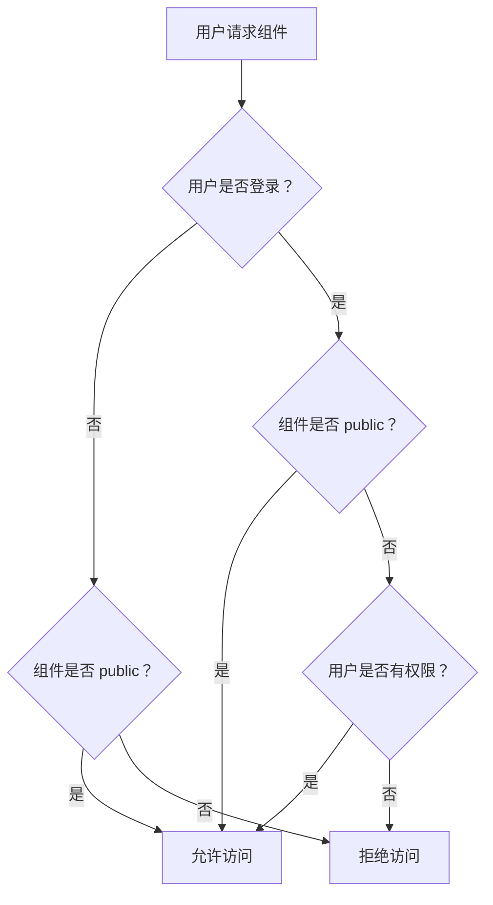

### 5.5 CLI 访问市场的认证

CLI 通过 Token 访问市场（在 brickkit.yaml 中配置）：

```yaml
# brickkit.yaml
sources:
  - id: brickkit-market
    type: market
    url: https://market.brickkit.io/api/v1
    authToken: ${MARKET_TOKEN}    # 可选，访问 private 组件时需要
    enabled: true
```

**Token 优先级：** 如果已执行 `brickkit login`，CLI 优先使用 `.brickkit/credentials` 中的登录态，忽略 `authToken` 字段。

| Token 状态 | 能访问的组件 |
| --- | --- |
| 无 Token | 只能访问 public 组件 |
| 有 Token | 可以访问 public + 该账号有权限的 private 组件 |

### 5.6 发布权限

| 操作 | 权限要求 |
| --- | --- |
| 创建组件 | 必须登录；`brickkit/` 与 `infra/` 只有市场管理员能创建，其余先到先得（007 §14.2） |
| 发布版本 | 必须登录，必须是组件所有者或组织成员 |
| 修改可见性 | 必须是组件所有者 |
| 标记 deprecated | 必须是组件所有者 |
| 标记 blocked | 只有市场管理员 |

---

## 6. 组件版本状态

### 6.1 版本状态定义

| 状态 | 说明 | 能否安装 |
| --- | --- | --- |
| draft | 草稿，产物还没传完 | ❌ 不能安装 |
| stable | 稳定，可安装 | ✅ 可以安装 |
| deprecated | 已弃用，不推荐 | ⚠️ 可以安装，但提示风险 |
| blocked | 被阻止（管理员下架） | ❌ 不能安装 |
| **deleted** | 软删除（§9.2 的 DELETE） | ❌ 视同不存在 |

`deleted` 是 §19"不允许物理删除已发布版本"的落地方式：记录还在，
但查询与安装都当它不存在。它同样要参与"最新可安装版本"的筛选——
CLI 省略版本号时筛掉的是 `draft` / `blocked` / `deleted`（004 §3.3）。

### 6.2 版本状态流转

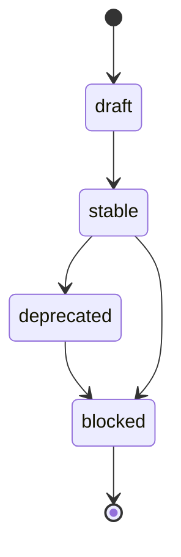

### 6.3 状态设置权限

| 操作 | 谁能执行 | 怎么执行 |
| --- | --- | --- |
| draft → stable | 组件发布者 | `brickkit publish` 自动完成（产物上传后置为 stable，004 §3.11） |
| stable → deprecated | 组件发布者 | 直接调 API（见下） |
| 任意 → blocked | 市场管理员（发现安全问题时） | 直接调 API（见下） |

**CLI 目前只覆盖 draft → stable 那一步**（它是发布流程的一部分）。`deprecated` 与 `blocked` 没有对应的子命令，只能直接调 `PUT /api/v1/components/{id}/versions/{ver}`：

```bash
curl -X PUT "$MARKET/api/v1/components/people/basic/versions/1.0.0" \
  -H "Authorization: Bearer $TOKEN" -H "Content-Type: application/json" \
  -d '{"status": "deprecated", "reason": "改用 2.0.0"}'
```

`reason` 会记进审计日志的 `detail`（§16.2）。**建议一定带上**——尤其是 `blocked`，那是信任模型的最后一道闸，而"为什么下架"只有这一处能留下。

### 6.4 精确版本规则

| 规则 | 说明 |
| --- | --- |
| 版本号必须是精确的 | `1.0.0`，不接受 `^1.0.0` 或 `~1.0.0` |
| 依赖声明也是精确版本 | `department/tree@1.0.0` |
| 版本不可重复 | 同一组件同一版本只能发布一次 |
| 升级必须显式 | 调用方必须手动修改 Manifest 中的版本号 |
| 服务名带版本号 | `people-basic-1-2-0` |

### 6.5 多版本处理

由于使用精确版本和版本化服务名，多版本共存是天然支持的。

**市场的角色：**

- 市场只存储和展示版本信息
- 市场不做多版本冲突检测
- 多版本处理完全由 CLI 和 brickkit.yaml 负责

**CLI 的多版本行为：**

多版本共存是默认行为。当 brickkit.yaml 中同一组件 ID 出现多个版本时，CLI 直接为每个版本生成独立的容器，无需任何额外参数。

⚠️ **注意：** 多版本共存只是物理缓冲，不保证数据层兼容。涉及破坏性变更（删除字段等）时，必须遵循 002 组件规范第 3.7 节"破坏性变更（Major）协同守则"，由部门间协调同步升级。

---

## 7. 组件签名与校验

### 7.1 签名目的

- 确保组件未被篡改
- 确保组件来自可信发布者
- 确保组件版本完整

### 7.2 签名流程

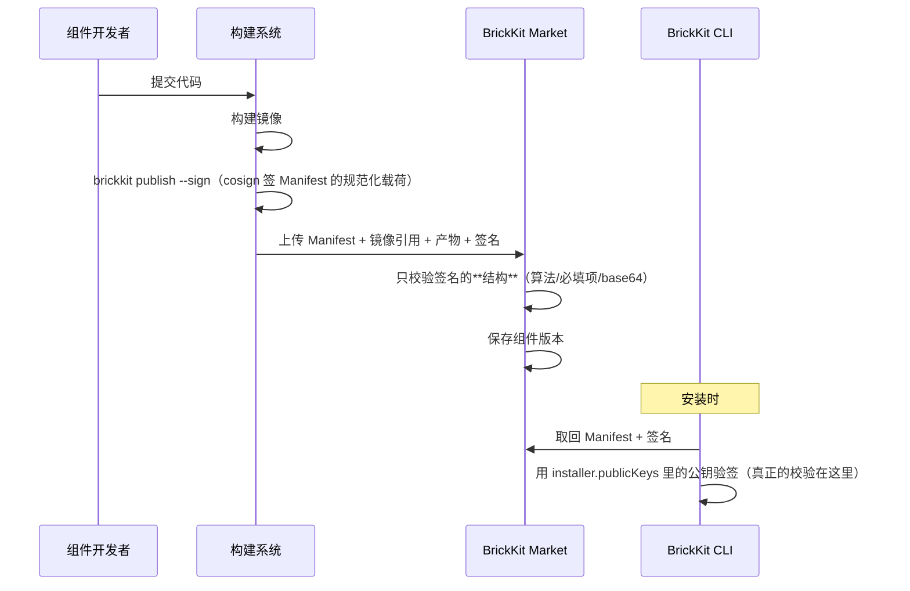

⚠️ **市场不做密码学校验，这是有意的。** 市场手里没有任何**可信**的公钥——
让发布者连公钥一起上传就是自己给自己发证：攻击者拿到发布 Token 后用自己的
密钥对签名、连公钥一起传，"校验"照样通过。**那种校验比没有更糟，
因为它会让人以为验过了。**

真正的信任锚点在使用者的 `brickkit.yaml → installer.publicKeys`（003 §3.6），
校验发生在 CLI 侧（§7.4、008 §8.4）。完整论证（包括"账号登记公钥"那种形态
为什么在 Token 没有 scope 之前也不成立）见 008 §8.2。

### 7.3 签名信息

```json
{
  "signature": {
    "algorithm": "cosign",
    "publicKeyRef": "keys/people-basic-release.pub",
    "value": "MEUCIQ...",
    "signedAt": "2026-01-01T10:00:00Z",
    "signedBy": "release-bot@brickkit.io"
  }
}
```

### 7.4 CLI 校验签名

CLI 执行 `brickkit add` 时：

1. 从市场获取 Manifest 和签名
2. 使用公钥校验签名
3. 校验通过 → 继续安装
4. 校验失败 → 拒绝安装

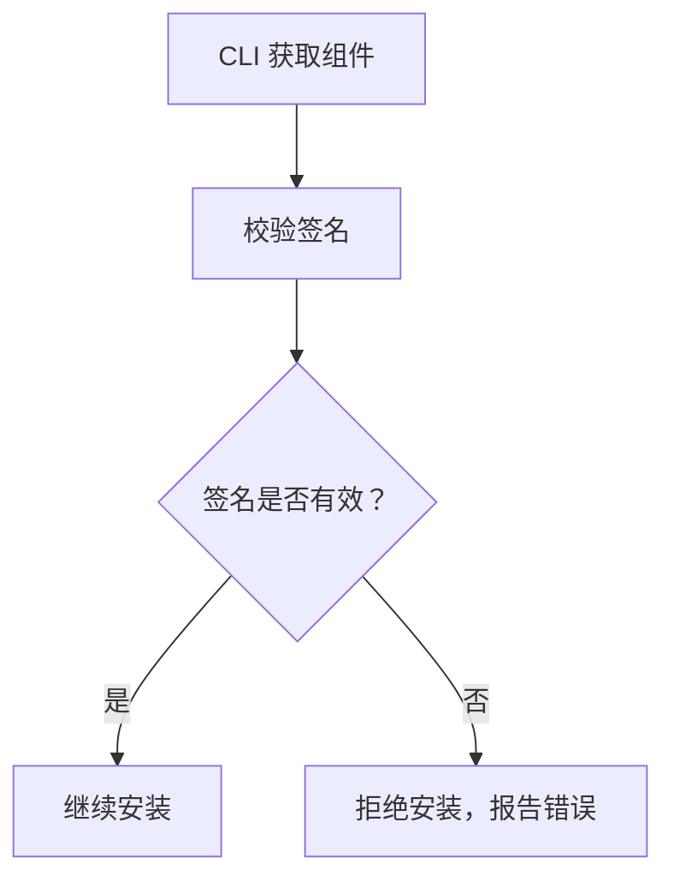

### 7.5 签名策略

| 环境 | 签名要求 |
| --- | --- |
| 本地开发 | 可选（`requireSignature: false`） |
| 测试环境 | 建议开启 |
| 生产环境 | 强制开启（`requireSignature: true`） |

### 7.6 签名配置

```yaml
# brickkit.yaml
installer:
  requireSignature: true    # 生产环境强制
```

### 7.7 签名校验失败处理

```
❌ 安装失败：签名校验不通过
   组件：people/basic@1.0.0
   原因：签名无效或已过期
   建议：联系组件发布者重新签名
```

---

## 8. 安装源模型

### 8.1 什么是安装源

安装源是 CLI 获取组件的入口。CLI 可以配置多个安装源。

### 8.2 安装源类型

| 类型 | 说明 | 适用场景 |
| --- | --- | --- |
| market | 远程市场 API | 生产环境，连接 BrickKit Market |
| git | Git 仓库 | 开源组件本地开发 |
| local | 本地目录 | 本地开发、离线环境 |

### 8.3 安装源配置

在 brickkit.yaml 中配置：

```yaml
# brickkit.yaml
sources:
  # 官方市场（默认）
  - id: brickkit-market
    type: market
    url: https://market.brickkit.io/api/v1
    authToken: ${MARKET_TOKEN}    # 可选，访问 private 组件时需要
    enabled: true

  # 本地开发目录
  - id: local-dev
    type: local
    path: ./components
    enabled: true

  # Git 仓库
  - id: my-git
    type: git
    url: https://github.com/myorg/brickkit-components.git
    enabled: false
```

**Token 优先级：** 如果已执行 `brickkit login`，CLI 优先使用 `.brickkit/credentials` 中的登录态，忽略 `authToken` 字段。

### 8.4 安装源优先级

当多个安装源中存在同名组件时，按配置顺序优先：

`sources` 列表中靠前的安装源优先

### 8.5 本地安装源目录结构

```
components/
├── people/
│   └── basic/
│       ├── component.yaml
│       └── Dockerfile
├── department/
│   └── tree/
│       ├── component.yaml
│       └── Dockerfile
├── authorization/
│   └── rbac/
│       ├── component.yaml
│       └── Dockerfile
└── portal/
    └── user-frontend/
        ├── component.yaml
        ├── Dockerfile
        └── nginx.conf.template
```

本地安装源中，CLI 直接读取 `component.yaml`，镜像使用本地已构建的镜像。

---

## 9. 市场 API 设计

> **这一章列的是**已实现**的端点，不是愿景。** 一份写着"定稿"的规范书，读者会照着它写客户端；混进没实现的路径，代价是他撞 404。
>
> 权威来源是 `market-server/internal/handler/handler.go` 的路由注册表，并由
> `TestEveryRouteIsDocumented` 双向守着：**实现了没写进本章**会失败，
> **本章写了却没实现**同样会失败。

### 9.1 组件管理

| 方法 | 路径 | 说明 |
| --- | --- | --- |
| GET | /api/v1/components | 搜索组件列表 |
| GET | /api/v1/components/{componentId} | 查询组件详情 |

**故意不做的三个：**

| 端点 | 为什么不做 |
| --- | --- |
| `POST /api/v1/components` | 首次 `publish` 时服务端自动建组件（§3.3），单独一个创建接口没有调用方 |
| `PUT /api/v1/components/{id}` | 组件元数据（name / description / vendor）跟着 Manifest 走，发新版本时一并更新。让它能被单独改，等于让市场上的描述与组件里的 Manifest 分叉 |
| `DELETE /api/v1/components/{id}` | §19：不允许物理删除已发布的东西。要下架用版本状态 `blocked`（§6.1） |

### 9.2 版本管理

| 方法 | 路径 | 说明 |
| --- | --- | --- |
| GET | /api/v1/components/{id}/versions | 查询版本列表 |
| POST | /api/v1/components/{id}/versions | 发布新版本 |
| PUT | /api/v1/components/{id}/versions/{ver} | 更新版本状态 |
| DELETE | /api/v1/components/{id}/versions/{ver} | 删除版本（软删除） |
| GET | /api/v1/components/{id}/versions/{ver}/manifest | 获取 Manifest |

**故意不做：** `GET .../versions/{ver}`（版本详情）。它要给的信息，版本列表里全有——CLI 取的也是列表（`source/market.go`）。

### 9.3 产物管理

| 方法 | 路径 | 说明 |
| --- | --- | --- |
| GET | /api/v1/components/{id}/versions/{ver}/artifacts | 获取该版本的产物列表 |
| GET | /api/v1/components/{id}/versions/{ver}/artifacts/{artifactId}/download | 下载产物文件 |
| POST | /api/v1/components/{id}/versions/{ver}/artifacts/{artifactId}/upload | 上传某个产物的内容（发布第二步） |

⚠️ **上传路径带 `{artifactId}`。** 产物**清单**在 `POST .../versions` 时就随 Manifest 一起登记了；这个端点上传的是其中某一个文件的**内容**。发布因此是三步：建版本（draft）→ 逐个上传产物 → 置为 stable（004 §3.11）。

### 9.4 可见性管理

| 方法 | 路径 | 说明 |
| --- | --- | --- |
| PUT | /api/v1/components/{id}/visibility | 设置可见性 |
| GET | /api/v1/components/{id}/access | 查询访问策略 |
| PUT | /api/v1/components/{id}/access | 更新访问策略 |

### 9.5 用户与组织

| 方法 | 路径 | 说明 |
| --- | --- | --- |
| POST | /api/v1/auth/login | 用户登录 |
| POST | /api/v1/auth/logout | 退出登录（作废当前 Token） |
| POST | /api/v1/auth/register | 用户注册 |
| GET | /api/v1/organizations | 查询组织列表（普通用户只看得到自己所属的，管理员看全部） |
| POST | /api/v1/organizations | 创建组织（创建者成为所有者并自动入组） |
| POST | /api/v1/organizations/{id}/members | 添加组织成员（**仅组织所有者或市场管理员**） |

⚠️ **组织成员关系就是授权本身，因此它只能有一个入口，而且那个入口必须有门。**

private 组件按 `allowedOrganizations` 授权（§5.3），也就是说"我属于哪个组织"直接决定"我能读哪些私有组件"。由此推出两条硬规则：

| 规则 | 不这么做会怎样 |
| --- | --- |
| **注册接口收到的 `orgId` 一律忽略** | 任何人注册时写上别人的组织 ID，就能读走该组织的**全部** private 组件——详情、Manifest、产物，一样不落 |
| 加成员只有组织所有者与市场管理员能做 | 等价于上一条：谁都能把自己加进任何组织 |

**一个用户至多属于一个组织**（§10 的 `users.org_id` 是单值）。已在别的组织里的人再被加入时**明确报冲突**，不能悄悄挪走——那会让他原组织的私有组件突然读不到了。重复添加同一个人是幂等的（运维脚本可以放心重跑）。

### 9.6 认证方式

所有需要认证的 API 使用 Bearer Token：

```
Authorization: Bearer <market-token>
```

- public 组件的查询 API 不需要认证
- private 组件的所有操作需要认证
- 组件发布操作必须认证

### 9.7 运维与审计

| 方法 | 路径 | 说明 |
| --- | --- | --- |
| GET | /api/v1/health | 健康检查，不需要认证。《市场部署与运维指南》里 compose 的 healthcheck 探的就是它 |
| GET | /api/v1/audit | 查询审计日志，需要认证（§16） |

> 这两个端点一直都在，只是从前没写进 §9 的清单里。`/api/v1/health` 尤其显眼——它在《市场部署与运维指南》里出现了四次，而这份自称定义市场 API 的文档一个字没提。

---

## 10. 市场数据模型

### 10.1 组件表

```sql
CREATE TABLE components (
    component_id    VARCHAR(256) PRIMARY KEY,
    name            VARCHAR(256) NOT NULL,
    description     TEXT,
    vendor          VARCHAR(256),
    visibility      VARCHAR(32) NOT NULL DEFAULT 'public',
    source_type     VARCHAR(32) NOT NULL DEFAULT 'registry',  -- git / registry
    git_url         VARCHAR(512),                              -- 开源组件的 Git 地址
    status          VARCHAR(32) NOT NULL DEFAULT 'active',
    owner_id        VARCHAR(128) NOT NULL,
    org_id          VARCHAR(128),
    downloads       BIGINT DEFAULT 0,
    created_at      TIMESTAMP DEFAULT NOW(),
    updated_at      TIMESTAMP DEFAULT NOW()
);
```

### 10.2 组件标签表

```sql
CREATE TABLE component_tags (
    component_id    VARCHAR(256) NOT NULL,
    tag             VARCHAR(128) NOT NULL,
    PRIMARY KEY (component_id, tag)
);
```

### 10.3 组件版本表

```sql
CREATE TABLE component_versions (
    component_id    VARCHAR(256) NOT NULL,
    version         VARCHAR(64) NOT NULL,
    status          VARCHAR(32) NOT NULL DEFAULT 'draft',
    manifest_json   JSONB NOT NULL,
    changelog       TEXT,
    signature_json  JSONB,
    published_at    TIMESTAMP,
    published_by    VARCHAR(128),
    created_at      TIMESTAMP DEFAULT NOW(),
    PRIMARY KEY (component_id, version)
);
```

### 10.4 产物表

```sql
CREATE TABLE artifacts (
    artifact_id     BIGSERIAL PRIMARY KEY,
    component_id    VARCHAR(256) NOT NULL,
    version         VARCHAR(64) NOT NULL,
    type            VARCHAR(64) NOT NULL,       -- 自由字符串：container / api-contract / sdk / docs / 任何
    format          VARCHAR(64),                -- 自由字符串：protobuf / openapi / graphql / python / 任何
    description     TEXT,                       -- 人类可读描述
    reference       VARCHAR(512),               -- 镜像地址（container）或文件存储路径（其他）
    file_list       JSONB,                      -- 文件列表（非 container 类型时使用）
    checksum        VARCHAR(256),
    size_bytes      BIGINT,
    created_at      TIMESTAMP DEFAULT NOW()
);
```

**关键设计决策：**

| 决策 | 说明 |
| --- | --- |
| `type` 是自由字符串 | 不做枚举校验。今天是 `container`、`api-contract`，明天可以是 `asyncapi-spec`、`ml-model`。市场不理解文件内容，只负责存储和分发 |
| `format` 是自由字符串 | 同上，市场不校验 |
| `file_list` 是 JSONB | 存储文件路径列表，灵活适应任意数量的文件 |
| 市场不解析文件内容 | 市场只存储和分发，不理解 proto / OpenAPI 等文件内容 |

### 10.4.1 组织表

```sql
CREATE TABLE organizations (
    org_id          VARCHAR(128) PRIMARY KEY,
    name            VARCHAR(256) NOT NULL,
    owner_id        VARCHAR(128) NOT NULL,
    created_at      TIMESTAMP DEFAULT NOW()
);
```

成员关系记在 `users.org_id` 上，不另开成员表：一个用户至多属于一个组织（见 §9.5）。

### 10.5 访问策略表

```sql
CREATE TABLE access_policies (
    policy_id       BIGSERIAL PRIMARY KEY,
    component_id    VARCHAR(256) NOT NULL,
    target_type     VARCHAR(32) NOT NULL,  -- user / organization
    target_id       VARCHAR(128) NOT NULL,
    permission      VARCHAR(32) NOT NULL DEFAULT 'read',
    created_at      TIMESTAMP DEFAULT NOW()
);
```

### 10.6 下载记录表

```sql
CREATE TABLE download_records (
    record_id       BIGSERIAL PRIMARY KEY,
    component_id    VARCHAR(256) NOT NULL,
    version         VARCHAR(64) NOT NULL,
    artifact_type   VARCHAR(64),               -- 下载的产物类型
    downloaded_by   VARCHAR(128),
    downloaded_at   TIMESTAMP DEFAULT NOW()
);
```

---

## 11. 开源/闭源组件处理

### 11.1 两种来源类型

| 类型 | sourceType | 必须提供 | CLI 行为 | 适用场景 |
| --- | --- | --- | --- | --- |
| 开源 | git | Git 仓库地址 + component.yaml | 拉取仓库，可本地构建，也可直接用已发布镜像 | 开源组件 |
| 闭源 | registry | 镜像地址 + component.yaml + API 契约 | 只拉取镜像和产物文件，不看源码 | 闭源组件 |

### 11.2 开源组件

发布时：

```json
{
  "componentId": "people/basic",
  "sourceType": "git",
  "gitUrl": "https://github.com/brickkit/people-basic.git",
  "artifacts": [
    {
      "type": "container",
      "reference": "registry.brickkit.io/people-basic:1.2.0"
    },
    {
      "type": "api-contract",
      "format": "protobuf",
      "description": "gRPC API 契约文件",
      "files": ["proto/people/v1/people.proto"]
    }
  ]
}
```

CLI 拉取时：

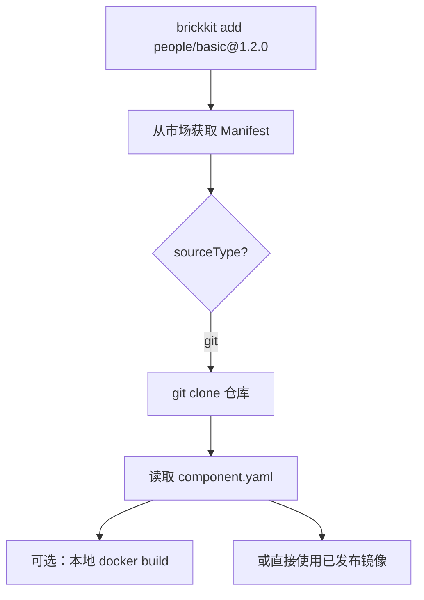

开源组件额外能力：

- 可以查看源码
- 可以本地修改后重新构建
- 可以 fork 后修改
- 可以在本地调试（`local: true`）

### 11.3 闭源组件

发布时：

```json
{
  "componentId": "mycompany/approval",
  "sourceType": "registry",
  "artifacts": [
    {
      "type": "container",
      "reference": "registry.mycompany.com/approval:1.0.0"
    },
    {
      "type": "api-contract",
      "format": "protobuf",
      "description": "gRPC API 契约文件",
      "files": ["proto/approval/v1/approval.proto"]
    }
  ]
}
```

CLI 拉取时：

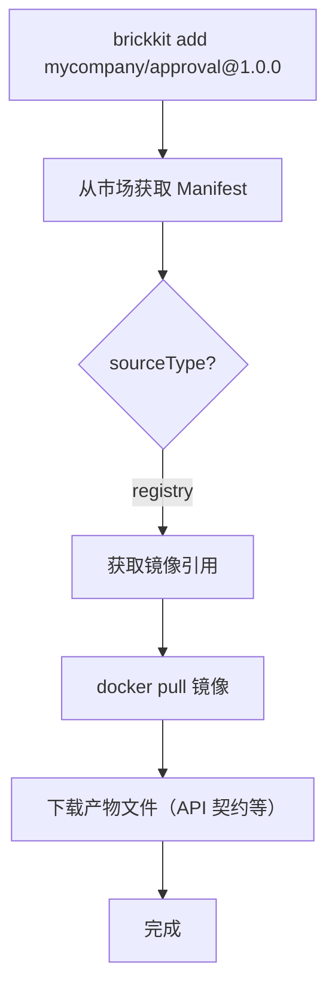

闭源组件限制：

- 不能查看源码
- 不能本地构建
- 不能使用 `local: true` 调试
- 只能使用已发布的镜像
- 但可以获取 API 契约文件（proto / OpenAPI）

### 11.4 闭源组件的产物存储

闭源组件没有 Git 仓库。它的"发布物"存储在市场本身：

| 存储内容 | 说明 |
| --- | --- |
| component.yaml | Manifest（必须） |
| 镜像引用 | 指向镜像仓库的地址（必须） |
| API 契约文件（proto / OpenAPI） | 闭源组件必须上传（如提供 API） |
| 其他附件（SDK、文档等） | 可选 |
| 签名 | 组件签名（建议） |
| 更新说明 | changelog |

**闭源组件的边界：**

| 内容 | 开源组件 | 闭源组件 |
| --- | --- | --- |
| 源码 | ✅ 可见 | ❌ 不可见 |
| API 契约（proto / OpenAPI） | ✅ 可见（在 Git 仓库中） | ✅ **可见（必须上传到市场）** |
| 镜像 | ✅ 可拉取 | ✅ 可拉取 |
| 本地调试 | ✅ `local: true` | ❌ 不支持 |

**核心原则：代码可以闭源，但 API 契约必须公开。** 否则调用方无法开发调用代码，组件就无法被集成。

### 11.5 来源类型对比

| 维度 | 开源（git） | 闭源（registry） |
| --- | --- | --- |
| 有 Git 仓库 | ✅ | ❌ |
| 有源码 | ✅ | ❌ |
| 可本地构建 | ✅ | ❌ |
| 可本地调试（local: true） | ✅ | ❌ |
| 有 Manifest | ✅ | ✅（存市场） |
| 有镜像引用 | ✅ | ✅ |
| 有 API 契约 | ✅（在 Git 仓库中） | ✅（上传到市场） |
| CLI 拉取方式 | git clone + 读 Manifest | 从市场获取 Manifest + pull 镜像 + 下载产物文件 |

---

## 12. 本地开发模式

### 12.1 本地开发时不需要市场

本地开发时，CLI 可以直接使用本地目录作为安装源：

```yaml
# brickkit.yaml
sources:
  - id: local-dev
    type: local
    path: ./components
    enabled: true
```

### 12.2 本地开发流程

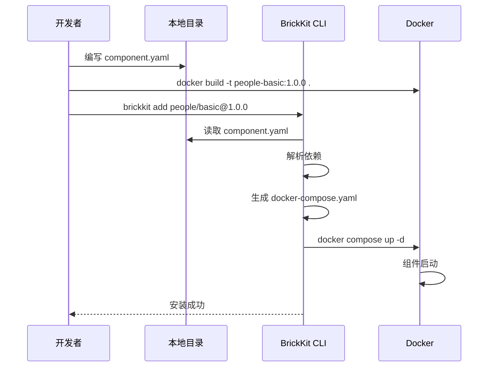

### 12.3 本地开发不需要签名

```yaml
# brickkit.yaml
installer:
  requireSignature: false
```

### 12.4 本地开发不需要认证

本地安装源不需要 Token：

```yaml
sources:
  - id: local-dev
    type: local
    path: ./components
    enabled: true
    # 不需要 authToken
```

---

## 13. 市场与镜像仓库的关系

### 13.1 市场不存储镜像

市场只存储：

- 组件元数据
- Manifest
- 版本信息
- 签名
- 镜像引用（指向镜像仓库的地址）
- 产物文件（API 契约、SDK、文档等）

镜像本身存储在独立的镜像仓库中（如 Docker Hub、Harbor、私有 Registry）。

### 13.2 镜像引用

```json
{
  "artifacts": [
    {
      "type": "container",
      "reference": "registry.brickkit.io/people-basic:1.2.0",
      "checksum": "sha256:abc123..."
    }
  ]
}
```

CLI 安装组件时：

1. 从市场获取镜像引用
2. 从镜像仓库拉取镜像
3. 下载产物文件（API 契约等）
4. 生成部署文件并启动

### 13.3 镜像仓库权限

| 组件可见性 | 镜像仓库权限 |
| --- | --- |
| public | 镜像公开，任何人可 pull |
| private | 镜像私有，只有授权用户可 pull |

CLI 拉取 private 镜像时，需要用户手动执行 `docker login` 登录镜像仓库：

```bash
# 用户手动登录镜像仓库
docker login registry.brickkit.io
# 输入用户名和密码
```

CLI 在 `brickkit up` 时会检测镜像拉取权限。如果镜像拉取失败且错误为 `unauthorized` / `authentication required`，CLI 报错提示：

```
❌ 镜像拉取失败（未授权）
   组件：people/basic@1.0.0
   镜像：registry.brickkit.io/people-basic:1.0.0
   错误：unauthorized: authentication required

   💡 请先登录镜像仓库：
      docker login registry.brickkit.io
   然后重新执行 brickkit up。
```

### 13.4 镜像权限与组件权限的关系

- 组件 private → 镜像也必须 private
- 组件 public → 镜像可以 public
- 市场控制"谁能看到组件"
- 镜像仓库控制"谁能拉取镜像"
- 两者必须一致

### 13.5 镜像安全要求

| 要求 | 说明 |
| --- | --- |
| 不使用 latest 标签 | 生产环境必须使用明确版本 |
| 镜像来源可信 | 只从配置的镜像仓库拉取 |
| 镜像签名校验 | 生产环境强制校验 |
| 非 root 运行 | 容器内不使用 root 用户 |

---

## 14. 组件命名空间

### 14.1 命名空间规则

组件 ID 格式：`<scope>/<name>`

| 命名空间 | 说明 | 示例 |
| --- | --- | --- |
| brickkit/ | 官方组件 | brickkit/saga-orchestrator |
| infra/ | 基础设施工具组件 | infra/redis-event-bus |
| 组织名/ | 组织组件 | mycompany/approval |
| 用户名/ | 个人组件 | zhangsan/my-tool |
| 业务域/ | 业务组件 | people/basic |

### 14.2 命名空间权限

| 命名空间 | 谁能**首次创建** | 平台怎么保证 |
| --- | --- | --- |
| `brickkit/` | 只有市场管理员 | 固定的保留前缀，发布时校验 |
| `infra/` | 只有市场管理员 | 同上 |
| 其余（组织名 / 用户名 / 业务域） | **先到先得** | 首次发布者成为 owner；之后每个版本都要过所有者校验 |

**为什么其余的是先到先得。** "组织名/ 必须是该组织成员"需要一张命名空间
注册表：申请、审批、转让、争议处理——那是一个独立的子系统，而它换来的东西
npm 也没有（unscoped 包名同样先到先得）。

**抢注一个名字并不能劫持别人的组件**：首次发布者成为所有者，之后的每个版本
都要过所有者校验。所以真正的风险只有"冒充官方"——那个用一张固定的前缀表
就挡住了，不需要任何新的数据结构。

### 14.3 命名规则

| 规则 | 说明 |
| --- | --- |
| 全部小写 | ✅ `people/basic` ❌ `People/Basic` |
| 只能包含字母、数字、斜杠、中划线 | ✅ `auth/password-login` ❌ `auth_password` |
| 不得包含版本号 | ✅ `people/basic` ❌ `people/basic-v2` |
| 不得包含空格 | ✅ `people/basic` ❌ `people basic` |
| 一旦发布不得修改 | 组件 ID 是不可变的 |

---

## 15. 市场安全要求

### 15.1 发布安全

| 要求 | 说明 |
| --- | --- |
| 发布者必须认证 | 匿名不能发布 |
| Manifest 必须校验 | 格式不合法拒绝发布 |
| 版本不可重复 | 同一组件同一版本只能发布一次 |
| 签名必须有效 | 生产环境强制校验 |
| 发布操作记录审计 | 谁在什么时间发布了什么 |
| configSchema 配置项名称不得与保留变量冲突 | 冲突时拒绝发布（见第 18 节） |
| artifacts 格式必须合法 | 每个 artifact 必须有 type 和 files |
| 闭源组件必须提供 API 契约 | 如果闭源组件提供 API，必须存在至少一个 `type: api-contract` 的 artifact |

### 15.2 访问安全

| 要求 | 说明 |
| --- | --- |
| private 组件必须认证 | 未登录不能访问 private 组件 |
| 权限最小化 | 用户只能访问被授权的组件 |
| API 限流 | 防止滥用 |
| 下载记录 | 记录谁下载了什么（包括产物文件） |

### 15.3 内容安全

| 要求 | 说明 |
| --- | --- |
| 组件可被 blocked | 发现安全问题时管理员可以阻止安装 |
| 版本可被 deprecated | 不推荐使用时标记 |
| 不允许物理删除已发布版本 | 防止依赖方突然找不到 |

---

## 16. 市场审计

### 16.1 审计范围

| 操作 | 记录 |
| --- | --- |
| 组件发布 | 谁发布了什么版本 |
| 组件更新 | 谁更新了什么 |
| 可见性变更 | 谁把组件从 public 改为 private |
| 版本状态变更 | 谁把版本标记为 deprecated/blocked |
| 组件删除 | 谁删除了什么组件 |
| 权限变更 | 谁修改了访问策略 |
| 产物文件下载 | 谁下载了什么产物文件 |

### 16.2 审计日志格式

```json
{
  "auditId": "market-audit-001",
  "action": "component.version.published",
  "componentId": "people/basic",
  "version": "1.2.0",
  "operator": "release-bot@brickkit.io",
  "time": "2026-01-01T10:00:00Z",
  "result": "success",
  "detail": ""
}
```

`detail` 是这条动作的补充说明，随 `action` 不同而不同。**状态变更**会把请求里的 `reason` 记进去：

```json
{
  "action": "component.version.status_changed",
  "componentId": "malicious/component",
  "version": "1.0.0",
  "operator": "root",
  "result": "success",
  "detail": "blocked：发现恶意行为"
}
```

理由超过 200 字会被截断（末尾带 `…`）——请求体没有大小限制，粘错一段日志进去会让这一行审计变成几十 KB，而审计日志的价值恰恰在于能一眼扫过去。截断而不是拒绝：理由写太长不该让下架失败。

⚠️ **`reason` 从前是收了不用的。** HTTP 层解析出来就丢掉，审计里只有 `blocked` 一个词——而 `action` 已经说了是状态变更，那一格几乎没加信息。而 `blocked` 恰恰是整个信任模型的最后一道闸（001 §12：平台只做最后的 blocked 下架），一条不记**为什么**的下架审计，在这个动作上等于没记。

### 16.3 审计规则

| 规则 | 说明 |
| --- | --- |
| 不可删除 | 审计日志只能追加，不能修改或删除 |
| 保留期限 | 建议至少保留 1 年 |
| 可查询 | `GET /api/v1/audit`（需要认证）。市场没有 Web 界面，见 §3.6 |

---

## 17. 市场与 CLI 的完整交互流程

### 17.1 安装组件（brickkit add）

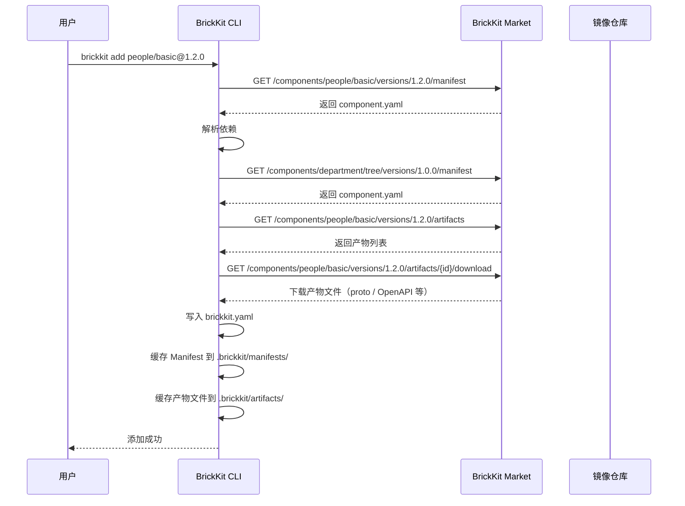

### 17.2 搜索组件

**CLI 目前没有搜索命令，只能直接调市场 API：**

```bash
curl -s "$MARKET/api/v1/components?keyword=people" | jq .
```

服务端支持按关键字、标签、命名空间、版本状态、可见性、来源类型筛选（§4.2）。

⚠️ **这是一个已知缺口，不是设计主张。** 001 §6 给市场的定位是一句话——"市场只回答：有什么可以装？谁有权装？"。第一问现在唯一的入口是手敲 curl，而它面向的是开发者。

这一句从前写的是"通过市场 Web 界面或直接调用市场 API 完成"，读起来像是"已经有两条路了，所以 CLI 不必再有一条"。**那个界面并不存在**（§3.6），所以这句话实际上是在用一个不存在的东西论证另一个东西不必做。

补的形状应当是一个 `search` 子命令（接关键字）：服务端的 `GET /api/v1/components` 已经实现，CLI 侧要的只是一次请求加一张表。

### 17.3 发布组件（brickkit publish）

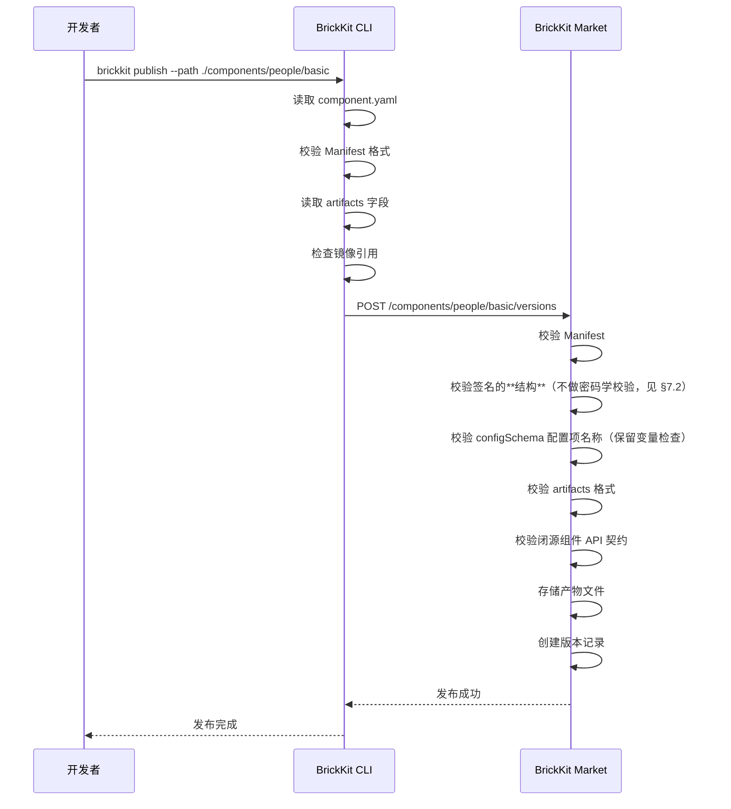

---

## 18. Manifest 校验规则

市场收到发布请求后，会自动校验 Manifest：

| 校验项 | 说明 |
| --- | --- |
| apiVersion | 必须为 `brickkit/v1` |
| kind | 必须为 `Component` |
| metadata.id | 必须存在，格式为 `scope/name` |
| metadata.version | 必须存在，精确语义化版本，不与已有版本重复 |
| metadata.name | 必须存在 |
| metadata.description | 必须存在 |
| deployment.type | 必须为 `container` |
| deployment.image | 必须存在，指向有效的镜像地址 |
| deployment.port | 必须存在，正整数 |
| deployment.resources（可选） | 如果存在，格式必须合法（requests/limits 包含 cpu/memory） |
| dependencies | 依赖声明必须合法（精确版本） |
| healthCheck | 必须存在（type: http/tcp/none） |
| migration（可选） | 如果存在，command 必须为数组 |
| configSchema（可选） | 如果存在，必须为合法的 JSON Schema（市场只校验 configSchema 本身的格式合法性，不校验使用者填写的 config 值） |
| configSchema 配置项名称（保留变量检查） | 如果 configSchema 存在，配置项名称转为大写下划线后不得与平台保留变量冲突（见下方详细规则） |
| artifacts（可选） | 如果存在，每个 artifact 必须有 `type` 和 `files` 字段 |
| 闭源组件 API 契约 | 如果 sourceType 为 `registry` 且组件提供 API（`deployment.port` 存在），必须存在至少一个 `type: api-contract` 的 artifact |
| 发布者权限 | 已存在的组件：必须是所有者或市场管理员；首次创建：`brickkit/` 与 `infra/` 需要市场管理员，其余先到先得（§14.2） |
| 来源类型 | sourceType 是否合法（git/registry） |

校验失败时，市场返回错误信息，发布不会成功。

### 18.1 configSchema 配置项名称保留变量校验

市场在发布时校验 configSchema 中的配置项名称，防止与平台保留变量冲突。

**保留变量规则（转大写后匹配）：**

| 保留模式 | 说明 | 匹配方式 |
| --- | --- | --- |
| COMPONENT_ID | 平台通用变量 | 精确匹配 |
| COMPONENT_VERSION | 平台通用变量 | 精确匹配 |
| *_ENDPOINT | 依赖组件地址 | 后缀匹配 |
| DATABASE_* | 数据库资源连接 | 前缀匹配 |
| REDIS_* | 缓存资源连接 | 前缀匹配 |
| MQ_* | 消息队列资源连接 | 前缀匹配 |
| STORAGE_* | 对象存储资源连接 | 前缀匹配 |
| SEARCH_* | 搜索引擎资源连接 | 前缀匹配 |
| SMTP_* | 邮件服务资源连接 | 前缀匹配 |
| {envPrefix}_* | 多资源前缀（如 `PRIMARY_`、`ARCHIVE_`） | 前缀匹配 |

**校验逻辑：**

1. 遍历 configSchema 中 `properties` 的每个配置项名称
2. 将配置项名称转为大写下划线格式（如 `departmentTreeEndpoint` → `DEPARTMENT_TREE_ENDPOINT`）
3. 检查是否与保留变量规则匹配
4. 如果匹配，拒绝发布并返回错误信息

**冲突示例：**

- `departmentTreeEndpoint` → `DEPARTMENT_TREE_ENDPOINT` → 与 `*_ENDPOINT` 冲突 ❌
- `componentId` → `COMPONENT_ID` → 与 `COMPONENT_ID` 冲突 ❌
- `databaseHost` → `DATABASE_HOST` → 与 `DATABASE_*` 冲突 ❌
- `redisPort` → `REDIS_PORT` → 与 `REDIS_*` 冲突 ❌
- `customPageSize` → `CUSTOM_PAGE_SIZE` → 无冲突 ✅
- `defaultPageSize` → `DEFAULT_PAGE_SIZE` → 无冲突 ✅
- `enableAudit` → `ENABLE_AUDIT` → 无冲突 ✅

**校验失败响应示例：**

```json
{
  "success": false,
  "error": {
    "code": "CONFIG_SCHEMA_RESERVED_VARIABLE_CONFLICT",
    "message": "configSchema 配置项名称与平台保留变量冲突",
    "details": {
      "componentId": "people/basic",
      "version": "1.2.0",
      "conflicts": [
        {
          "configKey": "departmentTreeEndpoint",
          "envVarName": "DEPARTMENT_TREE_ENDPOINT",
          "conflictPattern": "*_ENDPOINT",
          "suggestion": "请修改配置项名称，如改为 customDeptEndpoint"
        }
      ]
    }
  }
}
```

**为什么在发布时校验（源头防御）：**

| 层次 | 时机 | 行为 |
| --- | --- | --- |
| 市场发布时校验 | 源头防御 | configSchema 配置项名称与保留变量冲突时，**市场拒绝发布** |
| CLI 注入时检测 | 运行时防御 | config 覆盖的环境变量与保留变量冲突时，CLI 警告但跳过该配置项，平台注入的值优先 |

在发布时校验是"源头防御"——从源头杜绝问题。如果 configSchema 中就不允许声明与保留变量冲突的配置项，那运行时就不会出现覆盖。

### 18.2 artifacts 格式校验

市场在发布时校验 artifacts 的格式：

| 校验项 | 说明 |
| --- | --- |
| type 必须存在 | 每个 artifact 必须有 `type` 字段 |
| files 必须存在 | 每个 artifact 必须有 `files` 字段（`type: container` 除外，container 使用 `reference`） |
| type 不校验值 | `type` 是自由字符串，市场不校验其值是否"合法" |
| format 不校验值 | `format` 是自由字符串，市场不校验 |
| 文件必须存在 | 发布时上传的文件必须与 `files` 列表一致 |

### 18.3 闭源组件 API 契约校验

市场在发布时校验闭源组件是否提供了 API 契约：

| 条件 | 校验 |
| --- | --- |
| sourceType 为 `registry`（闭源） | 触发校验 |
| deployment.port 存在（组件提供 API） | 触发校验 |
| artifacts 中不存在 `type: api-contract` | 拒绝发布 |

**校验失败响应示例：**

```json
{
  "success": false,
  "error": {
    "code": "CLOSED_SOURCE_MISSING_API_CONTRACT",
    "message": "闭源组件提供 API 时必须上传 API 契约文件",
    "details": {
      "componentId": "mycompany/approval",
      "version": "1.0.0",
      "suggestion": "请在 artifacts 中添加至少一个 type: api-contract 的产物（如 proto 文件或 OpenAPI spec）"
    }
  }
}
```

---

## 19. 市场约束总结

- 市场是独立的公共平台，不是组件。
- 市场管理可安装组件，不管理运行中组件。
- 一个中心化市场，public/private 控制权限。
- 组件发布必须认证。
- 组件版本必须有明确状态（draft/stable/deprecated/blocked）。
- 版本必须是精确版本，不接受版本范围约束。
- 生产环境强制签名校验。
- 市场不存储镜像，只存储镜像引用。
- 市场不存储部署文件（compose/K8s YAML），部署文件由 CLI 生成。
- CLI 通过安装源连接市场。
- 本地开发可以使用本地目录，不需要市场。
- 已发布版本不允许物理删除。
- 所有市场操作必须记录审计。
- private 组件必须控制镜像仓库访问权限。
- 开源组件登记 Git 仓库地址；闭源组件的 Manifest + 镜像引用 + API 契约文件存储在市场本身。
- 发布方式：只有 CLI `brickkit publish`。市场没有 Web 界面（§3.6）。
- 多版本处理完全由 CLI 和 brickkit.yaml 负责，市场不做多版本冲突检测。多版本共存是默认行为。
- 所有组件都是 container（包括前端组件，使用 nginx 等 Web Server）。
- Manifest 中新增 `migration` 字段（可选），市场校验其格式合法性。
- Manifest 中新增 `configSchema` 字段（可选），市场只校验 configSchema 的 JSON Schema 格式合法性（结构校验），不校验使用者填写的 config 值。
- 市场校验 configSchema 配置项名称不得与平台保留变量冲突（源头防御）。冲突时拒绝发布。
- Manifest 中新增 `deployment.resources` 字段（可选），市场校验其格式合法性（不校验具体数值合理性）。
- Manifest 中新增 `artifacts` 字段（可选），市场校验其格式合法性。`type` 和 `format` 是自由字符串，市场不校验其值。
- 市场存储和分发产物文件（API 契约、SDK、文档等），不解析文件内容。
- 闭源组件如果提供 API，必须在 artifacts 中声明至少一个 `type: api-contract` 的产物。代码可以闭源，但 API 契约必须公开。
- 市场不做第三方组件安全审查。信任模型：安装即信任，平台只做 `blocked` 下架。
- CLI 拉取 private 镜像时，用户需手动执行 `docker login`，CLI 检测登录状态并提示。
- 组件搜索目前只能直接调市场 API（`GET /api/v1/components`）。CLI 还没有搜索命令，这是已知缺口（§17.2）。

---

## 20. 与其他设计书的关系

| 设计书 | 关系 |
| --- | --- |
| 001 平台理念与总体架构 | 定义市场的定位和边界 |
| 002 组件规范 | 定义 Manifest 格式，市场校验依据；破坏性变更（Major）协同守则；deployment.resources 字段定义；configSchema 保留变量约束；artifacts 字段定义；API 契约公开原则 |
| 004 BrickKit CLI 设计 | 定义 CLI 如何从市场获取组件、如何发布、`brickkit login` 行为；保留变量冲突检测（运行时防御）；CLI 下载 artifacts 行为 |
| 008 安全与治理 | 定义市场的安全要求、组件信任模型；保留变量保护；闭源组件边界：代码闭源，API 契约公开 |
| 009 组件开发快速入门 | 教开发者如何发布到市场 |
| 010 组件发布与上架指南 | 详细的发布流程 |
| 011 组件安装与拼装指南 | 教用户如何通过市场安装组件 |
| 012 架构设计原理与考量 | 本文档所有设计的决策依据 |

---

## 21. 总结

BrickKit Market（组件市场）的核心可以用一句话概括：

> **让所有人都能发布组件，让所有人都能找到组件，让权限控制谁能安装什么。代码可以闭源，但 API 契约必须公开。市场不理解文件内容，只负责存储和分发。**

| 维度           | 说明                                                                       |
| ------------ | ------------------------------------------------------------------------ |
| 市场           | 组件发布 + 组件发现 + 版本管理 + 权限控制 + 签名校验 + 产物存储与分发                               |
| 市场不做         | 不安装组件，不运行组件，不管组件状态，不解析产物文件内容                                             |
| 市场回答         | 有什么可以装？谁有权装？                                                             |
| CLI 回答       | 怎么装？装好了没有？                                                               |
| 开源组件         | 有 Git 仓库，可查看源码，可本地调试                                                     |
| 闭源组件         | 产物存在市场本身，只能拉取镜像，但可以获取 API 契约文件                                           |
| 版本           | 精确版本，不接受版本范围，服务名带版本号                                                     |
| 部署文件         | 不由市场存储，由 CLI 根据 Manifest 自动生成                                            |
| 多版本          | 多版本共存是默认行为，由 CLI 和 brickkit.yaml 负责，市场不做冲突检测                             |
| 签名           | 生产环境强制校验                                                                 |
| configSchema | 市场只校验 JSON Schema 格式合法性，不校验使用者的 config 值                                 |
| 保留变量保护       | 市场在发布时校验 configSchema 配置项名称不得与保留变量冲突（源头防御）；CLI 在注入时检测冲突（运行时防御）           |
| 资源配额         | Manifest 中 `deployment.resources` 可选字段，市场校验格式合法性，不校验具体数值                 |
| artifacts    | 通用产物机制。type 和 format 是自由字符串，不限枚举。市场不理解文件内容，只负责存储和分发。每个组件版本独立存储 artifacts |
| API 契约       | 代码可以闭源，但 API 契约必须公开。闭源组件必须在 artifacts 中声明 API 契约。契约跟随组件版本，不需要独立版本管理      |
| 镜像认证         | 用户手动 `docker login`，CLI 检测登录状态并提示                                        |
| 信任模型         | 安装即信任，平台只做 `blocked` 下架                                                  |
| 组件搜索         | 目前只能直接调市场 API（`GET /api/v1/components`）。CLI 还没有搜索命令，已知缺口（§17.2）        |