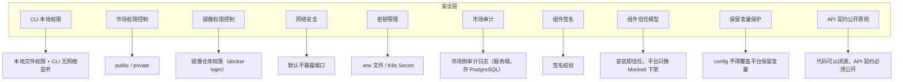
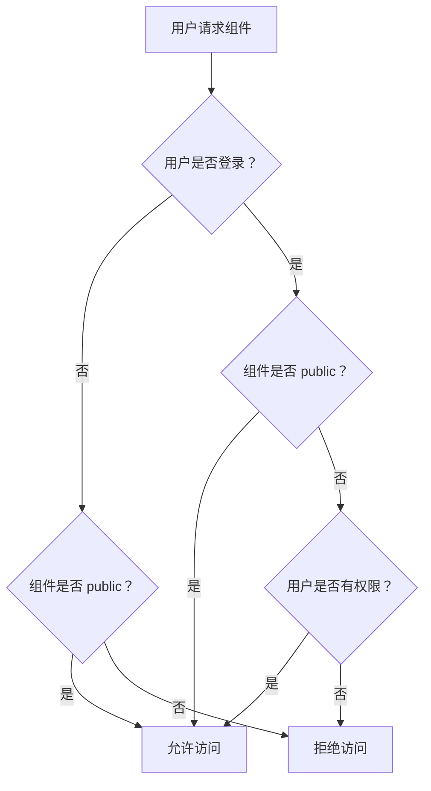
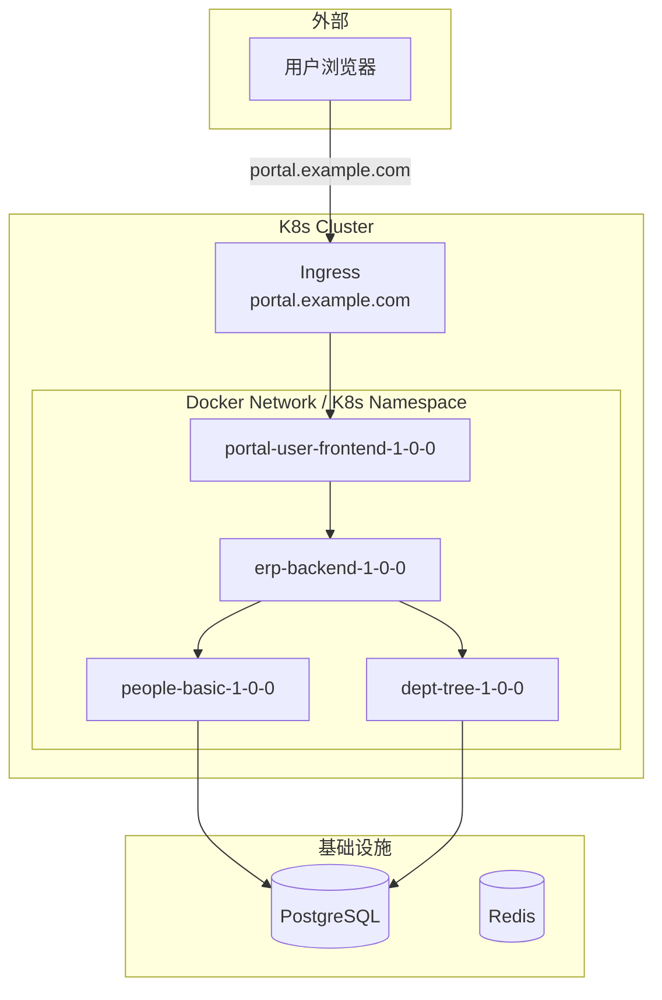
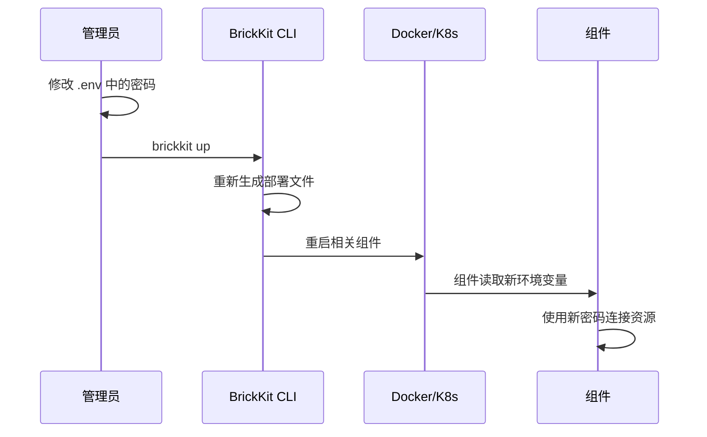
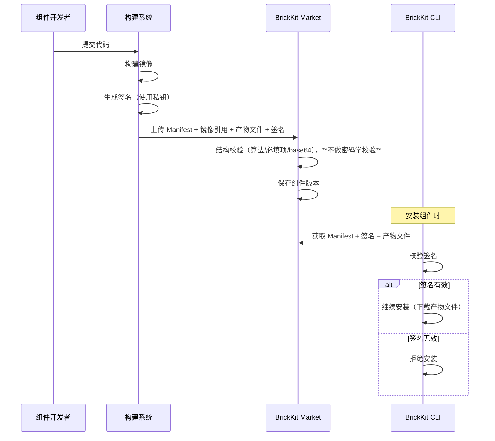
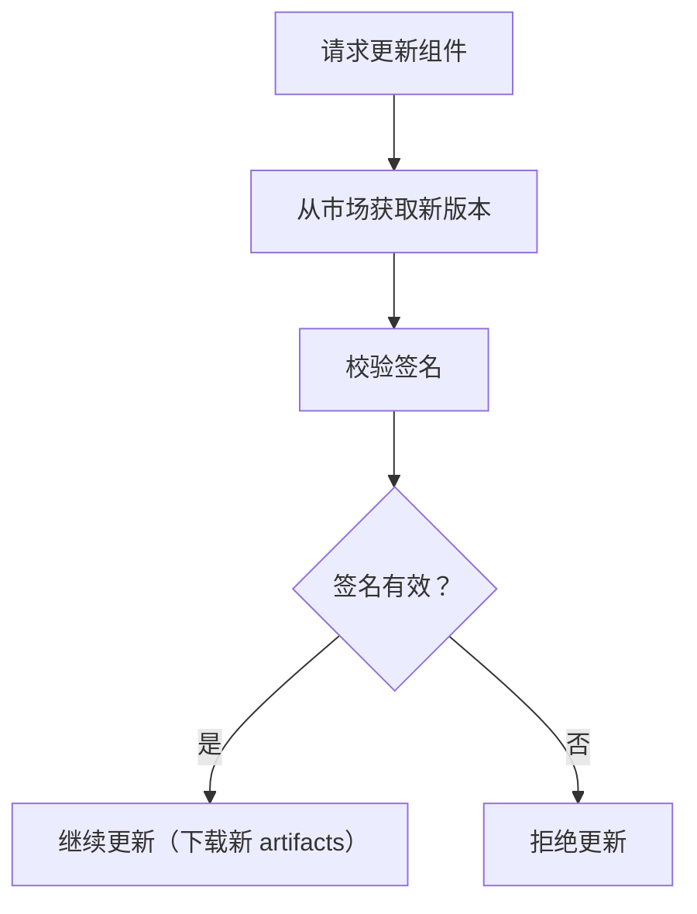

# 008 BrickKit 安全与治理

## 文档信息

| 项目 | 内容 |
| --- | --- |
| 文档编号 | 008 |
| 文档名称 | 安全与治理 |
| 所属篇章 | 第八篇：安全与治理 |
| 版本 | 1.4.0 |
| 最后更新 | 2026-08-10 |
| 状态 | 定稿 |
| 依赖文档 | 001 平台理念与总体架构、002 组件规范、003 项目配置规范、004 BrickKit CLI 设计、005 部署与运行规范、006 基础资源规范、007 组件市场设计、012 架构设计原理与考量 |
| 被依赖文档 | 009 组件开发快速入门、010 组件发布与上架指南、011 组件安装与拼装指南 |

---

## 1. 安全治理定位

### 1.1 核心原则

BrickKit 的安全治理遵循极简原则：

**不暴露就是安全。不授权就不能访问。不签名就不能安装。代码可以闭源，但 API 契约必须公开。**

### 1.2 安全模型总览



### 1.3 BrickKit 不做的事

| 不做的事 | 原因 |
| --- | --- |
| 不做用户权限管理 | 那是组件的事（如 RBAC 组件） |
| 不做多租户隔离 | 那是组件的事 |
| 不做 API 网关安全 | 组件自己直接调用 |
| 不做服务网格安全 | 太重，不需要 |
| 不做通信治理（熔断/限流） | 组件自己的事 |
| 不做动态配置 | 改配置就重启 |
| 不做复杂的 OAuth/OIDC | 组件自己实现 |
| 不做第三方组件安全审查 | 信任模型：安装即信任（见 1.4） |
| 不校验 config 值的类型 | configSchema 是"配置说明书"，不是"安检机" |
| 不自动 docker login | 镜像拉取认证由用户手动处理，CLI 只检测并提示 |
| 不校验 resources 合理性 | 资源配额是"推荐值"，CLI 透传，不校验 CPU/内存数值是否合理 |
| 不校验健康检查实现内容 | `/healthz` 只检查本进程存活是组件开发者的责任，CLI 不校验实现内容 |
| 不解析 artifacts 文件内容 | CLI 和市场只负责存储和分发产物文件（API 契约、SDK、文档等），不理解 proto / OpenAPI 等文件内容 |
| 不做 CLI 本地审计日志 | 本地文件无防篡改能力，不具备安全效力。真正的审计由市场（服务端）、Git（配置变更）、K8s Audit Log（部署操作）覆盖 |

平台只保护自己的管理面（CLI、市场、部署文件）。业务面的安全是组件自己的事。

### 1.4 BrickKit 组件信任模型

BrickKit 对第三方组件采用 **"安装即信任"** 的信任模型，与 VSCode 插件市场、npm、GitHub 开源项目的模式一致：

| 组件来源 | 信任基础 | 用户责任 |
| --- | --- | --- |
| 开源组件 | 代码全透明，用户可自行审查源码 | 用户自己审查代码，自己承担风险 |
| 闭源组件 | 基于商业协议和信任契约 | 出问题走协议追责 |
| 官方组件 | BrickKit 官方团队维护 | 平台背书 |

**平台的安全底线：**

- 平台不做前置安全审查（不扫描代码、不沙箱运行、不静态分析）
- 平台只做最后的"城管"：发现确凿的恶意组件时，市场管理员将其标记为 `blocked`，阻止新安装
- 未来可能引入 AI 辅助代码审查，但当前阶段安全责任由使用者自行承担

**一句话总结：** 你用它说明你相信他，不相信他你就别用他。平台不为用户的组件选择兜底。

### 1.5 闭源组件的边界

**核心原则：代码可以闭源，但 API 契约必须公开。**

| 内容 | 开源组件 | 闭源组件 |
| --- | --- | --- |
| 源码 | ✅ 可见 | ❌ 不可见 |
| API 契约（proto / OpenAPI） | ✅ 可见（在 Git 仓库中） | ✅ **可见（必须上传到市场）** |
| 镜像 | ✅ 可拉取 | ✅ 可拉取 |
| 本地调试 | ✅ `local: true` | ❌ 不支持 |
| 其他附件（SDK、文档等） | ✅ 可选（在 Git 仓库中） | ✅ 可选（上传到市场） |

**为什么 API 契约必须公开？**

组件之间的调用需要调用方知道被调用方的 API 定义（端点、参数、返回格式）。如果闭源组件不提供 API 契约，调用方根本无法开发调用代码，组件就无法被集成。API 契约是"接口定义"，不是"实现代码"，公开它不会泄露组件的内部实现。

**市场发布时的强制校验：**

如果闭源组件（`sourceType: registry`）声明了 `deployment.port`（即提供 API），但 artifacts 中没有 `type: api-contract` 的产物，市场拒绝发布。

---

## 2. CLI 本地权限

### 2.1 CLI 安全特性

| 特性 | 说明 |
| --- | --- |
| 无常驻进程 | CLI 执行完命令就退出 |
| 无网络监听 | CLI 不开放任何端口 |
| 无远程 API | 所有操作都是本地执行 |
| 权限 = 操作系统权限 | 谁能运行 CLI，谁就能管理组件 |

### 2.2 CLI 权限控制

由于 CLI 是本地工具，权限控制依赖操作系统：

| 环境 | 权限控制方式 |
| --- | --- |
| 个人电脑 | 当前用户权限 |
| 团队服务器 | Linux 用户/组权限 |
| CI/CD | 服务账号权限 |
| K8s | RBAC（kubectl 权限） |

### 2.3 CLI 操作不需要 Token

```bash
# 直接执行，不需要 Token
brickkit add people/basic@1.0.0
brickkit up
brickkit down
```

CLI 是本地工具，权限由操作系统控制。不需要额外的认证层。

### 2.4 市场 Token（访问 private 组件时需要）

访问市场中的 private 组件时，CLI 需要 Token：

```yaml
# brickkit.yaml
sources:
  - id: brickkit-market
    type: market
    url: https://market.brickkit.io/api/v1
    authToken: ${MARKET_TOKEN}    # 通过环境变量引用
    enabled: true
```

**Token 优先级：** 如果已执行 `brickkit login`，CLI 优先使用 `.brickkit/credentials` 中的登录态，忽略 `authToken` 字段。

| Token 状态 | 能访问的组件 |
| --- | --- |
| 无 Token | 只能访问 public 组件 |
| 有 Token（login 或 authToken） | 可以访问 public + 该账号有权限的 private 组件 |

---

## 3. 市场权限控制

### 3.1 可见性模型

| 可见性 | 谁能看到 | 谁能安装 |
| --- | --- | --- |
| public | 所有人 | 所有人 |
| private | 授权用户/组织 | 授权用户/组织 |

### 3.2 public 组件

```json
{
  "componentId": "people/basic",
  "visibility": "public"
}
```

- 任何人可以在市场中搜索到
- 任何人可以查看 Manifest
- 任何人可以下载产物文件（API 契约等）
- 任何人可以安装
- 镜像仓库中的镜像也是公开的

### 3.3 private 组件

```json
{
  "componentId": "mycompany/approval",
  "visibility": "private",
  "accessControl": {
    "allowedOrganizations": ["org-mycompany"],
    "allowedUsers": ["user-admin-1", "user-admin-2"]
  }
}
```

- 只有授权用户/组织可以在市场中搜索到
- 只有授权用户/组织可以查看 Manifest
- 只有授权用户/组织可以下载产物文件（API 契约等）
- 只有授权用户/组织可以安装
- 镜像仓库中的镜像也是私有的

### 3.4 权限控制流程



### 3.5 发布权限

| 操作 | 权限要求 |
| --- | --- |
| 创建组件 | 必须登录；`brickkit/` 与 `infra/` 只有市场管理员能创建，其余先到先得（007 §14.2） |
| 发布版本 | 必须登录，必须是组件所有者或组织成员 |
| 修改可见性 | 必须是组件所有者 |
| 标记 deprecated | 必须是组件所有者 |
| 标记 blocked | 只有市场管理员 |

---

## 4. 镜像权限控制

### 4.1 核心规则

组件本质上是一个 Docker 镜像。控制安装的最底层就是控制谁能拉这个镜像。

| 组件可见性 | 镜像仓库权限 |
| --- | --- |
| public | 镜像公开，任何人可 pull |
| private | 镜像私有，只有授权用户可 pull |

### 4.2 CLI 拉取镜像的认证

CLI 拉取 private 镜像时，需要用户手动执行 `docker login` 登录镜像仓库：

```bash
# 用户手动登录镜像仓库
docker login registry.brickkit.io
# 输入用户名和密码
```

CLI 在 `brickkit up` 时会检测镜像拉取权限。如果镜像拉取失败且错误为 `unauthorized` / `authentication required`，CLI 报错提示：

```
❌ 镜像拉取失败（未授权）
   组件：people/basic@1.0.0
   镜像：registry.brickkit.io/people-basic:1.0.0
   错误：unauthorized: authentication required

   💡 请先登录镜像仓库：
      docker login registry.brickkit.io
   然后重新执行 brickkit up。
```

**注意：** CLI 不自动执行 `docker login`，也不在 `brickkit.yaml` 中存储镜像仓库凭据。镜像拉取认证完全由用户手动处理，与日常 Docker 使用习惯一致。

### 4.3 镜像权限与组件权限的关系

- 组件 private → 镜像也必须 private
- 组件 public → 镜像可以 public
- 市场控制"谁能看到组件"
- 镜像仓库控制"谁能拉取镜像"
- 两者必须一致

### 4.4 镜像安全要求

| 要求 | 说明 |
| --- | --- |
| 不使用 latest 标签 | 生产环境必须使用明确版本 |
| 镜像来源可信 | 只从配置的镜像仓库拉取 |
| 镜像签名校验 | 生产环境强制校验 |
| 非 root 运行 | 容器内不使用 root 用户 |

---

## 5. 网络安全

### 5.1 核心原则

**默认不暴露端口 = 安全。**

### 5.2 Docker 环境

| 对象 | 是否映射端口 | 说明 |
| --- | --- | --- |
| 后端组件 | ❌ 不映射 | 只在 Docker Network 内 |
| 基础资源 | ❌ 不映射 | 只在 Docker Network 内 |
| 前端组件（`expose: false`） | ❌ 不映射 | 只在 Docker Network 内 |
| 前端组件（`expose: true`） | ✅ 映射 | 映射到宿主机，浏览器可访问 |

默认不映射端口。只有 `expose: true` 的组件才映射端口到宿主机。

**Docker 环境端口冲突处理：** 如果多个组件同时 `expose: true` 且宿主机端口相同，CLI 报错阻断。使用 `exposePort` 自定义宿主机端口。

**K8s 环境无端口冲突：** K8s 使用 Ingress + 域名路由，两个组件可以共用同一个端口（如 80），只要 `hostname` 不同就不冲突。

### 5.3 K8s 环境

| 对象 | Service 类型 | 说明 |
| --- | --- | --- |
| 后端组件 | ClusterIP | 只在集群内 |
| 前端组件（`expose: false`） | ClusterIP | 只在集群内 |
| `expose: true` 的组件 | ClusterIP + Ingress | 通过 Ingress 暴露到外部 |

### 5.4 expose 机制

```yaml
# brickkit.yaml
components:
  - id: portal/user-frontend
    version: 1.0.0
    expose: true
    hostname: portal.example.com    # K8s 必须，Docker 可省略
    exposePort: 8080                # Docker 环境：自定义宿主机映射端口（可选）

  - id: people/basic
    version: 1.0.0
    expose: false    # 默认，不暴露
```

规则：

- `expose: false`（默认）：不生成 Ingress / 不映射端口，组件只在内部网络可达
- `expose: true`：
  - K8s 环境：CLI 自动生成 Ingress YAML（基于 `hostname` 域名路由）
  - Docker 环境：CLI 映射端口到宿主机（默认使用 Manifest 中 `deployment.port`，可通过 `exposePort` 自定义）
- 不声明 `expose: true` 就不暴露。**安全是默认的。**

### 5.5 网络隔离



### 5.6 安全默认值

| 配置 | 默认值 | 说明 |
| --- | --- | --- |
| expose | false | 不暴露 |
| 端口映射 | 不映射 | Docker 环境 |
| Service 类型 | ClusterIP | K8s 环境 |
| Ingress | 不生成 | 除非 expose: true |

---

## 6. 密钥管理

### 6.1 核心原则

| 原则 | 说明 |
| --- | --- |
| 密码不写入 brickkit.yaml | 使用 `${ENV_VAR}` 引用 |
| 密码不写入代码仓库 | `.env` 文件加入 `.gitignore` |
| 密码不出现在日志中 | 日志脱敏 |
| 密码不出现在错误信息中 | 错误信息脱敏 |
| 生产环境使用 K8s Secret | CLI 自动生成 Secret YAML |

### 6.2 Docker 环境密钥管理

方式：`.env` 文件

```bash
# .env（不提交到 Git）
POSTGRES_PASSWORD=my-secret-password-123
REDIS_PASSWORD=my-redis-password
MARKET_TOKEN=xxx
```

brickkit.yaml 中引用：

```yaml
resources:
  - kind: database
    engine: postgresql
    id: postgres-main
    password: ${POSTGRES_PASSWORD}    # 引用 .env 中的变量
```

CLI 生成 docker-compose.yaml 时**尽量**保留 `${POSTGRES_PASSWORD}` 这个引用，
由 Docker Compose 自己从 `.env` 读取。

⚠️ **变量若已 export 到 shell 里（CI 常见），CLI 会先展开它**——那份 compose 里
就是明文密码（003 §5.4、006 §6.2）。`.brickkit/generated/` 在 `.gitignore` 里，
但它确实躺在磁盘上。想让明文不落盘，就把密码只放在项目根的 `.env` 里。

### 6.3 K8s 环境密钥管理

方式：K8s Secret

CLI 自动生成 Secret YAML：

```yaml
# .brickkit/generated/k8s/secrets/resource-secrets.yaml
apiVersion: v1
kind: Secret
metadata:
  name: postgres-main-secret
  namespace: brickkit-my-project
type: Opaque
stringData:
  password: s3cret-from-dotenv      # ← 生成时已求值，不是占位符
---
apiVersion: v1
kind: Secret
metadata:
  name: redis-main-secret
  namespace: brickkit-my-project
type: Opaque
stringData:
  password: r3dis-from-dotenv       # ← 同上
```

⚠️ **`${VAR}` 在生成时就求值，清单里写的是真实值。** 这是 K8s 目标与 Docker
目标的一处根本差别：`docker compose` 会自己读 `.env` 做替换，而 **`kubectl`
不做任何变量替换**。留着占位符等于把字面量 `"${POSTGRES_PASSWORD}"` 当成密码
部署上去——Pod 以认证失败反复重启，而那份 YAML 看上去完全正常。

CLI 因此按 shell 的写法展开 `${VAR}` 与 `${VAR:-默认值}`（取值来源是项目根的
`.env` 与当前进程的环境变量），**展开不了的变量一次性列出并阻断生成**，
绝不写出一份"看着对、跑起来错"的清单。Secret 文件权限因此是 `0600`
（其余清单 `0644`），而 `.brickkit/generated/` 本来就在 `.gitignore` 里。

完整对照见 005 §5.6 与 006 §6.3。


Deployment 中引用：

```yaml
env:
  - name: DATABASE_PASSWORD
    valueFrom:
      secretKeyRef:
        name: postgres-main-secret
        key: password
```

### 6.4 密钥类型

| 密钥类型 | 示例 |
| --- | --- |
| 数据库密码 | PostgreSQL 密码 |
| 缓存密码 | Redis 密码 |
| 市场 Token | BrickKit Market Token |
| JWT 私钥 | 认证组件使用 |
| API Token | 第三方服务 Token |

**注意：** 镜像仓库认证不通过 brickkit.yaml 或 `.env` 管理，而是由用户手动执行 `docker login` 处理。

### 6.5 密钥更新流程



规则：

- 修改密码后必须重新 `brickkit up`
- 组件重启后读取新密码
- 不做热更新（改配置就重启）

### 6.6 密钥安全要求

| 要求 | 说明 |
| --- | --- |
| `.env` 不提交 Git | 加入 `.gitignore` |
| 生产环境使用 K8s Secret | 不依赖 `.env` 文件 |
| 密码定期轮换 | 建议每 90 天 |
| 最小权限账号 | 每个组件使用独立账号 |
| 不输出密码到日志 | 日志脱敏 |
| 不在错误信息中输出密码 | 错误信息脱敏 |

---

## 7. 审计

### 7.1 审计定位

**BrickKit 不做 CLI 本地审计日志。**

理由：

- 本地文件无防篡改能力，不具备安全效力
- 真正的审计已由以下机制覆盖：

| 审计层 | 覆盖内容 | 存储位置 |
| --- | --- | --- |
| 市场审计（服务端） | 组件发布、可见性变更、产物文件下载、权限变更 | 市场 PostgreSQL |
| Git 记录 | brickkit.yaml 配置变更 | Git 仓库 |
| K8s Audit Log | 部署操作（kubectl apply 等） | K8s 集群 |

### 7.2 市场审计（市场侧）

市场侧的审计（发布、可见性变更、产物文件下载等）由市场自身管理，存储在市场 PostgreSQL 中：

```json
{
  "auditId": "market-audit-001",
  "action": "component.version.published",
  "componentId": "people/basic",
  "version": "1.2.0",
  "operator": "release-bot@brickkit.io",
  "time": "2026-01-01T10:00:00Z",
  "result": "success"
}
```

**市场审计范围：**

| 操作 | 记录 |
| --- | --- |
| 组件发布 | 谁发布了什么版本 |
| 组件更新 | 谁更新了什么 |
| 可见性变更 | 谁把组件从 public 改为 private |
| 版本状态变更 | 谁把版本标记为 deprecated/blocked |
| 组件删除 | 谁删除了什么组件 |
| 权限变更 | 谁修改了访问策略 |
| 产物文件下载 | 谁下载了什么产物文件 |

**市场审计规则：**

| 规则 | 说明 |
| --- | --- |
| 不可删除 | 审计日志只能追加，不能修改或删除 |
| 保留期限 | 建议至少保留 1 年 |
| 可查询 | 市场 Web 界面提供审计日志查询 |

---

## 8. 组件签名

### 8.1 签名目的

- 确保组件未被篡改
- 确保组件来自可信发布者
- 确保组件版本完整

### 8.2 签名流程



> **市场为什么不做密码学校验。** 市场手里没有任何可信的公钥。若让发布者连公钥一起
> 上传，那就是自己给自己发证——攻击者拿到发布 Token 后，用自己的密钥对签名、连公钥
> 一起传，"校验"照样通过。这种校验比没有更糟，因为它会让人以为验过了。
>
> 市场只做**结构校验**（算法认不认识、必填项在不在、`value` 是不是合法 base64）——
> 这三种错一眼就能看出来，放进库里只会让每一个使用者在 `add` 时各自撞一次墙，
> 而那时已经查不清是谁、什么时候传坏的了。真正的校验在 CLI 侧（§8.4）。
>
> **想清楚之后仍然不做，理由比"没有可信公钥"更强。**
>
> 确实存在一种市场能做有意义校验的形态：让发布者把公钥登记到**账号**下
> （GitHub 的模型），市场用账号里登记的公钥验签。它比"上传即信任"强，
> 因为攻击者拿到发布 Token 后无法用自己的密钥签名——除非他还能改账号里的密钥。
>
> **而那个"除非"正是前提。** 这套机制成立的唯一条件是**权限分离**：
> 发布用的凭据不能有管理密钥的权限（GitHub 上 `repo` 权限的 token
> 改不了 SSH 密钥）。没有这条分离，偷到发布 Token 的人同样能换掉登记的公钥，
> "市场验过签"就成了一句空话——比不验更糟，因为它会让人以为验过了。
>
> BrickKit 的 Token 目前**没有 scope**（见 `tokens` 表），所以这条前提不成立。
> 与其加一套认证层去支撑一个边际收益有限的机制，不如把校验完整地留在 CLI 侧。
>
> **CLI 侧的校验本来就是完整的保护，而且更强**：信任锚点是使用者自己的
> `installer.publicKeys`，不依赖市场是否被攻破。市场侧那一层能多覆盖的，
> 只有"使用者没配公钥"这一种场景——而那批人真正该做的是去配公钥，
> 不是指望市场替他们判断谁可信。
>
> 什么情况下重新考虑：**Token 有了 scope 之后**。那时账号密钥登记
> （而不是 TOFU 那类自动钉住的方案）是更简单的形态——密钥轮换就是
> 普通的账号操作，不需要专门设计一套证明持有的协议。
>
### 8.3 签名信息

```json
{
  "signature": {
    "algorithm": "cosign",
    "publicKeyRef": "keys/people-basic-release.pub",
    "value": "MEUCIQ...",
    "signedAt": "2026-01-01T10:00:00Z",
    "signedBy": "release-bot@brickkit.io"
  }
}
```

`publicKeyRef` 是一个**名字**，不是密钥材料。它由使用者在 `brickkit.yaml` 的 `installer.publicKeys` 里解析成真正的公钥文件——见 003 §3.6，那里说明了为什么公钥不能跟着签名一起从市场取。

### 8.3.1 签名的对象：Manifest 的规范化载荷

签名覆盖的是**组件版本的 Manifest**，不是镜像。Manifest 才是 CLI 真正下载、真正能验的东西——
镜像是容器运行时/kubelet 拉的，那一步 CLI 根本不在链路上。

#### 8.3.2 那镜像怎么办：钉 digest，而不是再签一次

`deployment.image` **就在 Manifest 里**，所以"部署哪个镜像"已经被签名覆盖了。
剩下的缺口只有一个：

> 签名保证了镜像**字符串**没被改，保证不了那个字符串**还指向同样的字节**。

tag 是可变的。发布者签名时是 `repo:1.0.0`，攻击者拿到 registry 权限后
用同一个 tag 重新 push，签名依然有效、跑起来的却是另一个镜像。

把 tag 换成 digest，这个缺口自己就关上了——digest 按定义不可变，
而它已经在签名覆盖范围内。**不需要任何新的密码学机制。**

因此 `brickkit publish` **默认**把 tag 解析成 digest 再签名：

```
component.yaml:  registry.example.com/people-basic:1.2.0
   ↓ publish 向 registry 查询
上传的 Manifest:  registry.example.com/people-basic@sha256:d9e853e8…
   ↓ 然后才签名
```

⚠️ **顺序不能反。** 先签后钉的话，签的是旧 Manifest 而上传的是钉过的，
消费方一律验签失败——而发布者这边一切正常，很难查。

**解析不出 digest 时阻断发布。** 取不到通常意味着镜像还没推上去，
那样消费方也拉不到；而版本号一旦建出来不可回收（007 §6.4），
与其在市场里留下一个装不上的版本，不如现在停下。
确实无法解析时用 `--no-pin-digest` 跳过，CLI 会明确警告放弃了什么。

##### 只用 buildx 查询，不做 fallback

`docker manifest inspect -v` 也能给出一个 digest，但那是**单个平台**的
manifest digest。实测 `alpine:3.20`：

| 来源 | digest | MediaType |
| --- | --- | --- |
| `docker buildx imagetools inspect` | `sha256:d9e853e8…` | `image.index.v1+json`（多架构索引） |
| `docker manifest inspect -v` | `sha256:c64c687c…` | `image.manifest.v1+json`，`linux/amd64` |

钉住后者会把组件**锁死在 amd64**——ARM 节点上拉不到，而且往往是发布很久
之后换机器时才发现。一个悄悄锁架构的 fallback 比直接报错糟得多，
所以 buildx 不可用时直接失败。

查的也是 **registry** 而不是本地 daemon：本地 `RepoDigests` 看着像答案，
但它可能来自 `docker load`，未必真在目标 registry 里存在——而消费方是从
registry 拉的。

##### 镜像签名（cosign 签镜像本身）仍然不做

它解决的是另一个问题：**绕开 BrickKit 直接部署**时，谁来保证镜像来源。
那一步由集群的准入控制器（Kyverno / Sigstore policy-controller）校验，
需要运维制定策略，CLI 碰不到。与 005 §5.13.0.1 对厂商 CRD 的判断同源：
平台不该把自己塞进它管不了的链路。

但不能直接对 Manifest 的原始字节签名。一份 Manifest 在到达校验方之前会被反复改写形态：

```
component.yaml (YAML) → publish 转 JSON 上传 → 市场存 JSON → CLI 取回转回 YAML 解析
```

每一步的字节序都不同。对"某一种写法的字节"签名，在这条链路上必然失效，而且失效方式随市场版本、反向代理而变。

因此签名的对象是**规范化载荷**：解析成数据结构后，用固定规则（键名字典序的 JSON）重新编码。只要语义相同，不论原始是 YAML 还是 JSON、键序如何、缩进与注释怎么写，结果都逐字节相同。

规范化本身也有攻击面：让双方各自计算规范形式，就必须保证同一份文档不会被两边解析成不同的东西。**重复键直接拒绝**（不同解析器有取第一个的、有取最后一个的，这个分歧足以构造"发布者看到 A、CLI 校验 A、运行时用 B"的文档），键必须是字符串。

### 8.4 CLI 校验签名

CLI 执行 `brickkit add` 时：

1. 从市场获取 Manifest 和签名
2. 把 Manifest 规范化成载荷（§8.3.1）
3. 用 `installer.publicKeys` 里的公钥校验签名
4. **核对签名覆盖的 `metadata.id` / `metadata.version` 就是要装的那个版本**
5. 校验通过 → 继续安装（下载 artifacts）
6. 校验失败 → 拒绝安装

第 4 步不能省。签名只能证明"这份 Manifest 是发布者签的"，证明不了"它就是我要装的那个"：被攻破的市场可以把 `people/basic@1.2.0` 的响应换成同一发布者签过的 `people/basic@0.9.0`（含已知漏洞），签名完全有效——降级攻击就这样成立。组件 ID 与版本本身就在签名覆盖的内容里，核对一下即可堵住。

### 8.4.1 校验不需要安装 cosign

cosign `sign-blob` 产出的是标准的 ECDSA P-256 over SHA-256 签名（ASN.1 DER 再 base64），公钥是 PKIX PEM。**Go 标准库直接可验**，CLI 因此零依赖。

| 角色 | 动作 | 需要 cosign |
| --- | --- | --- |
| 组件发布者 | `brickkit publish --sign` | ✅ 需要（一次性，通常在 CI 里） |
| 组件使用者 | `brickkit add` 自动验签 | ❌ 不需要 |

这不只是少一个依赖。如果验签也要装 cosign，那"生产环境强制签名"（§8.5）就意味着每台机器、每个 CI runner 都得装 cosign——大多数团队会因此直接把校验关掉，安全措施变成摆设。

互操作性由真 cosign 二进制的双向测试保证（cosign 签 → 标准库验；标准库的载荷 → `cosign verify-blob` 验），不靠推断。签名因此不是只有 BrickKit 认得的私有格式，运维与审计可以拿标准 cosign 独立复核。

### 8.4.2 默认不上传公共透明日志

cosign **默认**会把签名条目上传到 Sigstore 的公共 Rekor 透明日志（全世界可查，签名时输出 `tlog entry created with index: ...`）。

对开源组件这是优点（可审计、可发现伪造）。但 BrickKit 的组件大量是 private 的（007 §5.1），默认上传等于把"某公司在某时刻发布了某个内部组件、其内容哈希是什么"公开出去。

因此 CLI 签名时固定使用 `--tlog-upload=false`，校验侧相应地不查询透明日志。需要透明日志的项目应自建 Rekor 实例。

### 8.5 签名策略

| 环境 | 签名要求 |
| --- | --- |
| 本地开发 | 可选（`requireSignature: false`） |
| 测试环境 | 建议开启 |
| 生产环境 | 强制开启（`requireSignature: true`） |

#### 8.5.1 完整判定表

`requireSignature` 与"签名验不验得过"是**两条独立的规则**，不能合成一条：

| 情形 | `requireSignature: true` | `requireSignature: false` |
| --- | --- | --- |
| **没有配置 `publicKeys`** | 放行 + 警告 | 放行（静默） |
| 配了公钥，组件没有签名 | ❌ 阻断 | ✅ 放行 |
| 配了公钥，签名 `ref` 不在信任列表 | ❌ 阻断 | ✅ 放行 + 警告 |
| 配了公钥，签名验不过 | ❌ 阻断 | ❌ **阻断** |

**最后一行**：`requireSignature` 管的是"**没有**签名允不允许"，不是"**坏**签名允不允许"。一个验不过的签名意味着内容被改过、或来源根本不对——那在任何模式下都不该放行。若关掉强制校验就连坏签名一起放过，本地开发环境会成为投毒的入口，而开发机上的组件照样连着真实的数据库。

**第一行**：钥匙串才是总开关。**没有信任锚点就没有"强制"可言**——就算组件真带了签名，也没有公钥可以拿去验它。此时阻断换不来任何安全收益，却会让所有还没配公钥的项目当场装不了东西。但必须出声：使用者以为自己开着强制校验，实际一次也没校验过，这个落差不能默不作声。

#### 8.5.2 只有市场安装源受签名约束

§8.4 说的是"从**市场**获取 Manifest 和签名"。本地安装源指向的是使用者自己硬盘上、正被他编辑的目录；git 安装源指向的是他自己在 `brickkit.yaml` 里写下的仓库——那里根本没有"发布者"这个角色，也就无所谓签名。

若一并强制，打开 `requireSignature` 会让所有用本地源开发的项目当场瘫痪，结果只会是大家把它关掉；那才是真正的安全损失。

#### 8.5.3 缓存同样要校验

Manifest 命中 `.brickkit/manifests/` 缓存时也必须走一遍校验。跳过的话，"先在不校验的情况下 `add` 一次、再打开 `requireSignature`"就能让一份从未验过的 Manifest 一直被用下去，而且看起来一切正常。

缓存旁边因此还要记下**来源类型**（`<name>.sig.json`）：只存签名的话，"没有签名"就有了两种解释——市场给的未签名组件（该被拦住），还是 git 源给的（压根不该管）——两者无法区分。

缓存校验不过时**退回去重新拉取**，而不是直接报错：缓存里的东西可能只是旧了（公钥轮换过、发布者重新签过），硬报错会让人除了手动删缓存无路可走；而重新拉来的那份同样要过校验，安全性一点没少。

### 8.6 签名配置

```yaml
# brickkit.yaml
installer:
  requireSignature: true    # 生产环境强制
  publicKeys:               # 信任哪些发布者，由项目自己说了算（003 §3.6）
    keys/people-basic-release.pub: keys/people-basic-release.pub
```

### 8.7 签名校验失败处理

```
❌ 安装失败：签名校验不通过
   组件：people/basic@1.0.0
   原因：签名无效或已过期
   建议：联系组件发布者重新签名
```

---
## 9. 组件声明了什么，使用者看得到什么

### 9.1 核心原则

**平台没有"权限"这个概念，组件也不向平台申请任何东西。**

它只是在 Manifest 里**声明自己需要什么**——依赖哪些组件、要哪类基础资源、
建议给多少配额。使用者装之前看得到这份声明，装完之后拿到的也**只有**这份声明里
写着的东西：没声明的依赖不会被注入地址，没绑定的资源不会有连接变量。

> ⚠️ 这一节从前叫「组件权限声明」，§9.2 贴的是一份普通的 `component.yaml`。
> 那个标题许诺了一套**并不存在**的机制——读的人会去找"权限模型"、
> 找"授权流程"，然后发现内容只是 `dependencies` 加 `deployment.resources`。
> 真正在执行的约束在 §9.4 与 §10，它们靠的是**平台不做什么**（不注入没声明的东西、
> 不挂载 SA 令牌、默认不暴露端口），不是靠一层许可检查。

### 9.2 Manifest 里与此相关的字段

```yaml
dependencies:
  components:
    - department/tree@1.0.0        # 只有声明了，才会拿到 DEPARTMENT_TREE_ENDPOINT
  resources:
    - kind: database               # 只有使用者在 brickkit.yaml 里绑定了，
      engine: postgresql           # 才会拿到 DATABASE_*

deployment:
  resources:                       # 推荐配额，CLI 透传不校验（002 §4.6）
    requests: { cpu: "100m", memory: "128Mi" }
    limits:   { cpu: "500m", memory: "512Mi" }
```

三者都是**声明**而非申请：平台不审批，只是照着它注入，以及在缺东西时报错
（强依赖取不到 → 阻断；资源没绑定 → `up` 阻断，006 §4.4）。

### 9.3 安装时看得到什么

`brickkit add` 打印依赖树、产物下载情况，以及**验过的**签名：

```
📦 添加 people/basic@1.2.0
   ├── Manifest ✅
   ├── 依赖 department/tree@1.0.0 ✅ 已拉取（artifacts 1 个文件）
   └── artifacts ✅（1 个文件）
✅ 已写入 brickkit.yaml（2 个组件）
📁 已下载 artifacts 到 .brickkit/artifacts/（2 个文件）
```

**签名只在真的验过时才出现一行**（008 §8.4）：

```
🔏 签名：✅ 已校验 people/basic@1.2.0（发布者 release-bot@example.com）
```

没验过的不列"未校验"——绝大多数项目还没配 `installer.publicKeys`，
那会把正常状态渲染成一屏噪音。真正需要使用者知道的落差走警告：
要求强制却没配公钥、签名来自不认识的发布者。

**`add` 不列资源需求与配额。** 那两样要等到 `brickkit up` 才有意义，
而 `up` 每次都会把话说全——哪些资源得先跑起来、哪些库要预先建好（006 §9.1、§9.5），
资源没绑定时还会一次报全所有缺的（`resolver.CheckRunningResourceBindings`）。
在 `add` 提前说一遍，等于让同一件事有两处各自维护的判据。

> 这段样例从前写的是一份 `add` **从未产出过**的输出：资源需求、推荐配额、
> 可见性、发布者一应俱全。照着它去核对的人会以为自己哪里配错了。

### 9.4 组件拿不到什么

真正在执行的约束，靠的都是"平台不做"，不是"平台不许"：

| 约束 | 靠什么成立 |
| --- | --- |
| 只拿到自己声明的依赖地址 | 没声明就不注入 `*_ENDPOINT`（004 §5.6） |
| 只连到绑定给它的资源 | 没绑定就一个 `DATABASE_*` 都没有；`up` 直接阻断（006 §4.4） |
| 拿不到别的组件的密钥 | Secret 按资源归集，只有绑了它的组件才引用（005 §5.6） |
| 覆盖不了平台注入的变量 | 保留变量冲突时跳过使用者那份，平台的值优先（004 §5.6.1） |
| 问不到 K8s API | `serviceAccount.enabled` 时每组件一个不挂载令牌的 SA（005 §5.13.3） |
| 外部访问不到它 | 不写 `expose` 就不映射端口 / 不生成 Ingress（005 §10） |

**注意最后两条是 opt-in 的**（005 §5.13）：不写 `deploy.serviceAccount` 时
Pod 用的仍是命名空间的 `default` SA，那张令牌照常挂载。平台不替使用者
做这个决定，理由与 `podSecurity` 相同——加上去可能让本来跑得好好的组件起不来。

## 10. 第三方组件治理

### 10.1 第三方组件接入要求

第三方组件（闭源或开源）必须提供：

| 要求 | 说明 |
| --- | --- |
| component.yaml | 完整的 Manifest |
| 健康检查 | `/healthz` 端点（**只检查本进程存活，不检查任何外部依赖**） |
| 日志输出 | 结构化日志 |
| 版本信息 | 明确的精确版本 |
| 依赖声明 | 声明所有依赖 |
| 资源声明 | 声明需要的资源 |
| configSchema 配置项名称 | 不得与平台保留变量冲突（见 12.6 节） |
| API 契约文件（如提供 API） | 闭源组件必须在 artifacts 中声明至少一个 `type: api-contract` 的产物 |

### 10.2 第三方组件安全限制

| 限制 | 说明 |
| --- | --- |
| 不暴露端口到宿主机 | 除非 `expose: true` |
| 不获取管理员权限 | 组件不需要管理权限 |
| 不访问其他组件数据 | 通过 API 调用 |
| 不修改平台配置 | 只能修改自己的配置 |
| 必须签名 | 生产环境强制 |
| configSchema 配置项名称不得与保留变量冲突 | 市场发布时校验（源头防御） |
| 闭源组件必须提供 API 契约 | 代码可以闭源，但 API 契约必须公开。闭源组件如果提供 API，必须在 artifacts 中声明至少一个 `type: api-contract` 的产物 |

### 10.3 CLI 对组件只分两种

**所有组件跑在同样的容器里，没有分级隔离。** 平台唯一会因组件来源而改变的行为
只有两处：

| 情形 | CLI 的行为 |
| --- | --- |
| 市场把该版本标为 `blocked` | ❌ 装不上（`COMPONENT_BLOCKED`）；不写版本号时那个版本也不会被选中（004 §3.3） |
| 签名验过 / 没验过 | 验过打一行 `🔏 签名：✅ 已校验`；要求强制却没配公钥、发布者不认识时给警告（§8.5） |

**"验过签名"不等于"这个组件是安全的"**，它只说明这份 Manifest 确实来自那个
你已经写进 `installer.publicKeys` 的发布者，且中途没被改过。代码干什么、
镜像里装了什么，平台一概不知道——安装任何组件都意味着信任它的发布者（§1.4）。

> 这里从前是一张四级"信任级别"表（官方 / 可信社区 / 未验证 / 被阻止），
> 带一列"隔离方式"。那一列里三行写的都是"标准容器"，第四行写的是
> "不允许安装"——那根本不是一种隔离方式。而"官方组件"在代码里不存在：
> CLI 分不出谁是官方，它只知道这个签名验没验过。
> 一张暗示着分级沙箱的表，与"平台提供集市，不提供保险箱"（§1.4）恰好相反。

### 10.4 组件阻止机制

市场管理员可以将组件标记为 blocked：

```json
{
  "componentId": "malicious/component",
  "version": "1.0.0",
  "status": "blocked",
  "reason": "发现安全漏洞"
}
```

被阻止的组件：

- 不允许新安装
- 已安装的组件提示风险
- 管理员可以选择移除

---

## 11. 日志安全

### 11.1 日志中不得出现的内容

| 不得出现 | 说明 |
| --- | --- |
| 密码 | 任何密码 |
| Token | 任何 Token |
| 私钥 | 任何私钥 |
| 完整身份证号 | 脱敏处理 |
| 完整手机号 | 脱敏处理 |
| 完整银行卡号 | 脱敏处理 |

### 11.2 日志脱敏示例

```javascript
// ❌ 错误：
{"message": "user login", "password": "abc123"}

// ✅ 正确：
{"message": "user login", "username": "admin", "result": "success"}
```

### 11.3 错误日志安全

```javascript
// ❌ 错误（暴露内部实现）：
{"error": "NullPointerException at com.example.PeopleService.java:123"}

// ✅ 正确（不暴露内部实现）：
{"error": {"code": "PEOPLE_INTERNAL_ERROR", "message": "人员服务内部错误"}}
```

---

## 12. 配置安全

### 12.1 配置安全规则

| 规则 | 说明 |
| --- | --- |
| 配置不进入代码仓库 | 通过环境变量注入 |
| 敏感配置作为密钥 | 密码、Token 等 |
| 配置变更通过 Git 追踪 | brickkit.yaml 提交 Git，变更可追溯 |
| 组件只能读取自己的配置 | 不跨组件 |
| brickkit.yaml 不硬编码密码 | 使用 `${ENV_VAR}` 引用 |
| config 配置项名称不得与保留变量冲突 | 见 12.6 节保留变量保护 |

### 12.2 brickkit.yaml 配置安全

```yaml
# ✅ 正确：通过环境变量引用
password: ${POSTGRES_PASSWORD}
authToken: ${MARKET_TOKEN}

# ❌ 错误：硬编码密码
password: my-secret-password-123
authToken: xxx-token-xxx
```

### 12.3 .env 文件安全

```bash
# .env（不提交到 Git）
POSTGRES_PASSWORD=my-secret-password-123
MARKET_TOKEN=xxx
```

`.env` 文件必须加入 `.gitignore`。

### 12.4 生产环境配置安全

生产环境建议使用 K8s Secret 或 Vault：

```yaml
# K8s 环境中，CLI 自动生成 Secret YAML
# 不依赖 .env 文件
```

### 12.5 config 字段安全

brickkit.yaml 中的 `config` 字段用于覆盖 configSchema 默认值（业务配置）。业务配置不是密钥，可以提交到 Git。

```yaml
components:
  - id: erp/backend
    version: 1.0.0
    config:
      sessionTtlSeconds: 7200    # 业务配置，可以提交 Git
      enableAudit: true           # 业务配置，可以提交 Git
```

密钥不放在 `config` 字段中，密钥通过 `.env` 文件或 K8s Secret 管理。

**注意：CLI 不校验 config 值的类型。** configSchema 是"配置说明书"，不是"安检机"。使用者填错类型（如把 integer 写成字符串），CLI 原样注入，由此导致的组件运行异常由使用者自行承担。

### 12.6 保留变量保护

⚠️ **config 字段中的配置项名称不得与平台保留变量冲突。**

以下环境变量由平台注入，configSchema 中的配置项名称不得与之冲突（转大写后匹配）：

| 保留模式 | 说明 | 匹配方式 |
| --- | --- | --- |
| COMPONENT_ID | 平台通用变量 | 精确匹配 |
| COMPONENT_VERSION | 平台通用变量 | 精确匹配 |
| *_ENDPOINT | 依赖组件地址 | 后缀匹配 |
| DATABASE_* | 数据库资源连接 | 前缀匹配 |
| REDIS_* | 缓存资源连接 | 前缀匹配 |
| MQ_* | 消息队列资源连接 | 前缀匹配 |
| STORAGE_* | 对象存储资源连接 | 前缀匹配 |
| SEARCH_* | 搜索引擎资源连接 | 前缀匹配 |
| SMTP_* | 邮件服务资源连接 | 前缀匹配 |
| {envPrefix}_* | 多资源前缀（如 `PRIMARY_`、`ARCHIVE_`） | 前缀匹配 |

**为什么需要保留变量保护？**

如果 config 字段中的配置项名称与保留变量冲突，使用者可以通过 config 覆盖平台注入的依赖地址，将流量劫持到恶意服务器。例如：

```yaml
# ❌ 危险：config 中的配置项与保留变量冲突
components:
  - id: component-a
    version: 1.0.0
    config:
      departmentTreeEndpoint: "http://my-malicious-server:9999"
      # 转大写后为 DEPARTMENT_TREE_ENDPOINT，与平台注入的依赖地址变量冲突
      # 如果不保护，组件 A 的所有请求将被劫持到恶意服务器
```

**两层防御：**

| 层次 | 时机 | 行为 |
| --- | --- | --- |
| 市场发布时校验（源头防御） | 组件发布时 | configSchema 配置项名称与保留变量冲突时，**市场拒绝发布** |
| CLI 注入时检测（运行时防御） | 组件启动时 | config 覆盖的环境变量与保留变量冲突时，CLI 警告但跳过该配置项，平台注入的值优先 |

**CLI 冲突处理策略：警告但跳过，平台注入的值优先。**

```
⚠️ 配置冲突：
   组件 people/basic 的 config 字段中包含配置项 "departmentTreeEndpoint"
   转换为环境变量 DEPARTMENT_TREE_ENDPOINT 后，与平台注入的依赖地址变量冲突。
   该配置项已被忽略，平台注入的值优先。
   建议：修改 configSchema 中的配置项名称，避免与平台保留变量冲突。
```

**选择"警告但跳过"而非"报错阻断"的理由：**

- 报错阻断可能导致用户无法启动项目（一个配置项名称写错就全部停摆）
- 警告但跳过既保护了安全，又不阻断用户操作
- 与 BrickKit "精确优于隐式"一致——明确告诉用户发生了什么

---

## 13. 更新安全

### 13.1 更新安全要求

| 要求 | 说明 |
| --- | --- |
| 更新来自可信版本 | 只从市场获取 |
| 更新前检查兼容性 | 依赖检查 |
| 更新失败可回滚 | 修改版本号重新 up |
| 配置和密钥变更通过 Git 追踪 | brickkit.yaml 提交 Git |
| 数据库迁移谨慎 | 先兼容后迁移 |

### 13.2 更新时签名校验

更新组件时，CLI 必须校验新版本的签名：



### 13.3 迁移安全

组件更新涉及数据库迁移时（`migration.command`）：

- 迁移失败 = 主服务不启动（安全阻断）
- 不自动重试（防止数据损坏）
- 迁移日志可审查（用户自己看日志）
- 迁移脚本随代码版本走（可追溯）
- K8s 环境下，CLI 在执行迁移前自动清理同名旧 Job（确保幂等性）

---

## 14. 安全威胁与应对

### 14.1 威胁模型

| 威胁 | 影响 | 应对 |
| --- | --- | --- |
| 未授权安装组件 | 恶意组件进入系统 | 市场权限 + 签名校验 |
| 组件篡改 | 组件行为被修改 | 签名校验 |
| 密钥泄露 | 数据库被访问 | `.env` 不提交 Git + K8s Secret + 定期轮换 |
| 端口暴露 | 组件被外部攻击 | 默认不暴露端口 |
| CLI 权限泄露 | 系统被控制 | 操作系统权限控制 |
| 恶意组件读取数据 | 数据泄露 | 数据隔离 + 最小权限 |
| 日志泄露敏感信息 | 隐私泄露 | 日志脱敏 |
| 市场被攻破 | 恶意组件分发 | 签名校验 + 市场审计 |
| 迁移脚本被篡改 | 数据库损坏 | 签名校验 + 迁移不重试 |
| 第三方恶意组件 | 同网络内越权调用 | 信任模型：安装即信任（见 1.4）；平台只做 blocked 下架 |
| 环境变量劫持 | 流量被劫持到恶意服务器 | 保留变量保护：市场发布时校验（源头防御）+ CLI 注入时检测（运行时防御） |
| 资源耗尽 | 宿主机/节点资源被拖垮 | 资源配额：Manifest `deployment.resources` + brickkit.yaml 覆盖；合理设置 limits |
| 闭源组件不提供 API 契约 | 调用方无法开发调用代码 | 市场发布时强制校验：闭源组件必须上传 API 契约 |
| 恶意产物文件 | 调用方下载后执行恶意代码 | 信任模型：安装即信任；产物文件是开发时辅助，不自动执行 |

### 14.2 安全默认值

| 配置 | 默认值 | 说明 |
| --- | --- | --- |
| requireSignature | true（生产） | 强制签名 |
| expose | false | 默认不暴露 |
| 端口映射 | 不映射 | Docker 环境 |
| Service 类型 | ClusterIP | K8s 环境 |
| 密钥 | 必须通过环境变量引用 | 不允许硬编码 |
| 多版本共存 | 默认共存 | brickkit.yaml 中有几个版本就启动几个容器 |
| 镜像认证 | 用户手动 `docker login` | CLI 不自动登录 |
| config 值校验 | 不校验 | CLI 不校验 config 值类型 |
| 保留变量保护 | 开启（两层防御） | 市场发布时校验 + CLI 注入时检测 |
| 资源配额 | CLI 默认值（100m/128Mi） | Manifest 可声明推荐值，brickkit.yaml 可覆盖 |
| 闭源组件 API 契约 | 必须上传 | 市场发布时强制校验 |

---

## 15. 安全约束总结

- CLI 是本地工具，无 HTTP API，无网络监听。
- 市场组件必须区分 public/private。
- 镜像权限必须与组件权限一致。
- 默认不暴露端口。
- 不声明 `expose: true` 就不生成 Ingress / 不映射端口。
- Docker 环境多个组件 `expose: true` 端口冲突时，使用 `exposePort` 自定义宿主机端口。K8s 环境通过 Ingress + 域名路由，不存在端口冲突。
- 密钥通过 `.env` 文件（Docker）或 K8s Secret（生产）管理，不硬编码在 brickkit.yaml 中。
- 密钥不得出现在日志中。
- 市场侧审计日志存储在市场 PostgreSQL 中，不可删除，建议保留至少 1 年。
- 配置变更通过 Git 追踪（brickkit.yaml 提交 Git）。
- 生产环境强制组件签名校验。
- 第三方组件必须声明依赖和资源。
- 被阻止的组件不允许安装。
- 组件不获取管理员权限。
- 组件不访问其他组件的数据。
- brickkit.yaml 不硬编码密码。
- 更新必须校验签名。
- `.env` 文件不提交 Git。
- 容器使用非 root 用户运行。
- 日志必须脱敏。
- 每个组件使用独立的数据库账号（最小权限）。
- 密码定期轮换（建议每 90 天）。
- 迁移失败 = 主服务不启动（安全阻断）。K8s 环境下 CLI 自动清理旧 Job。
- 业务配置（config 字段）可以提交 Git；密钥不可以。CLI 不校验 config 值的类型。
- 多版本默认共存。brickkit.yaml 中有几个版本就启动几个容器。多版本共存只是物理缓冲，不保证数据层兼容。
- 信任模型：安装组件即代表用户信任发布者。平台不做第三方组件安全审查，只做 `blocked` 下架。
- 镜像拉取认证由用户手动 `docker login` 处理，CLI 检测登录状态并提示。
- `brickkit down` 不删除 volume（数据安全）。
- config 配置项名称不得与平台保留变量冲突。市场发布时校验（源头防御），CLI 注入时检测（运行时防御）。冲突时 CLI 警告但跳过，平台注入的值优先。
- 组件可在 Manifest 中声明推荐的资源配额（`deployment.resources`），CLI 透传给 K8s/Docker。brickkit.yaml 可覆盖。CLI 不校验 resources 数值合理性。
- `/healthz` 只检查本进程存活，禁止检查数据库、依赖组件或任何外部系统（防止雪崩）。这是组件开发者的责任，CLI 不校验健康检查实现内容。
- 代码可以闭源，但 API 契约必须公开。闭源组件如果提供 API，必须在 artifacts 中声明至少一个 `type: api-contract` 的产物。市场发布时强制校验。
- CLI 和市场不解析 artifacts 文件内容，只负责存储和分发。产物文件是开发时辅助（API 契约、SDK、文档等），不自动执行。
- API 契约文件跟随组件版本走，不需要独立的版本管理。向后兼容的变更自然兼容，破坏性变更遵循"破坏性变更协同守则"。
- CLI 不做本地审计日志。审计由市场（服务端）、Git（配置变更）、K8s Audit Log（部署操作）覆盖。

---

## 16. 与其他设计书的关系

| 设计书 | 关系 |
| --- | --- |
| 001 平台理念与总体架构 | 定义安全治理的定位和边界；设计原则中的"信任模型" |
| 002 组件规范 | 定义组件在 Manifest 里声明什么（依赖 / 资源 / 配额，§9）；破坏性变更（Major）协同守则；deployment.resources 字段定义；configSchema 保留变量约束；健康检查禁令；artifacts 字段定义；API 契约公开原则 |
| 003 项目配置规范 | 定义密钥引用方式、exposePort、resources 覆盖；config 保留变量约束 |
| 004 BrickKit CLI 设计 | 定义 CLI 的本地权限、`brickkit login`、镜像权限检测；保留变量冲突检测（运行时防御）；resources 合并逻辑；CLI 下载 artifacts 行为 |
| 005 部署与运行规范 | 定义网络安全和端口暴露、Migration Job 清理、resources 生成；健康检查转换 |
| 006 基础资源规范 | 定义密钥管理和资源安全、volume 保留 |
| 007 组件市场设计 | 定义市场权限控制和签名；市场校验 configSchema 配置项名称不与保留变量冲突（源头防御）；市场存储和分发 artifacts；市场校验闭源组件 API 契约；市场审计 |
| 012 架构设计原理与考量 | 本文档所有设计的决策依据；信任模型辩护、config 不校验辩护 |

---

## 17. 总结

BrickKit 安全与治理的核心可以用一句话概括：

> **不暴露就是安全，不授权就不能访问，不签名就不能安装。安装即信任，平台只做最后的城管。保留变量不可覆盖，健康检查不可越界。代码可以闭源，但 API 契约必须公开。**

| 维度 | 说明 |
| --- | --- |
| 安全 | 本地权限 + 市场权限 + 签名 + 市场审计 + 默认不暴露 + 信任模型 + 保留变量保护 + API 契约公开原则 |
| CLI | 本地工具，无 HTTP API，无网络监听 |
| 信任模型 | 安装即信任。开源组件用户自行审查；闭源组件基于协议。平台只做 `blocked` 下架 |
| 密钥 | `.env` 文件（Docker）/ K8s Secret（生产），不硬编码 |
| 镜像认证 | 用户手动 `docker login`，CLI 检测登录状态并提示 |
| 审计 | 市场侧审计（服务端，存 PostgreSQL）。CLI 不做本地审计。配置变更通过 Git 追踪 |
| 网络 | 默认不映射端口，`expose: true` 才暴露。Docker 用 `exposePort` 解决端口冲突 |
| 签名 | 生产环境强制校验 |
| 迁移 | 失败 = 阻断启动，不重试。K8s 执行前自动清理旧 Job |
| 配置 | 业务配置（config）可提交 Git，密钥不可以。CLI 不校验 config 值类型。config 配置项名称不得与保留变量冲突 |
| 保留变量保护 | 两层防御：市场发布时校验（源头）+ CLI 注入时检测（运行时）。冲突时警告但跳过，平台值优先 |
| 资源配额 | Manifest `deployment.resources` 推荐值 + brickkit.yaml 覆盖。CLI 透传，不校验合理性 |
| 健康检查 | `/healthz` 只检查本进程存活，禁止检查任何外部依赖。CLI 不校验实现内容，这是组件开发者的责任 |
| brickkit down | 不删除 volume（数据安全） |
| artifacts | 通用产物机制。type 和 format 是自由字符串。CLI 和市场不解析文件内容，只负责存储和分发 |
| API 契约 | 代码可以闭源，但 API 契约必须公开。闭源组件必须在 artifacts 中声明 API 契约。契约跟随组件版本，不需要独立版本管理 |
| 多版本共存 | 默认行为。brickkit.yaml 中有几个版本就启动几个容器。多版本共存只是物理缓冲，不保证数据层兼容 |
| 原则 | 平台保护自己的管理面。业务面的安全是组件自己的事 |