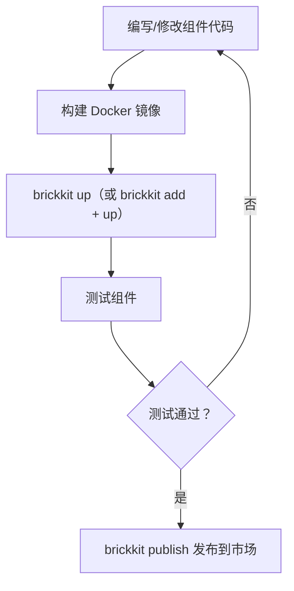
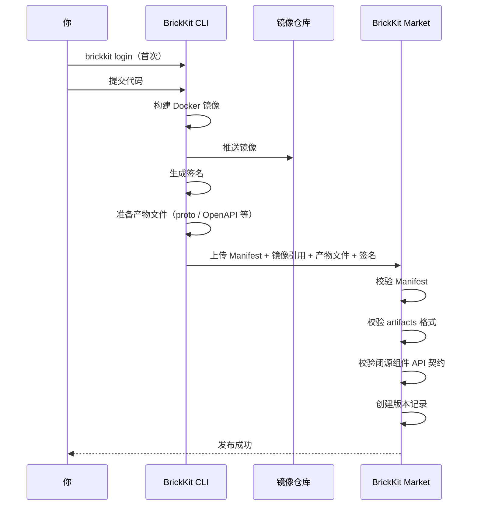

# 009 BrickKit 组件开发快速入门

## 文档信息

| 项目 | 内容 |
| --- | --- |
| 文档编号 | 009 |
| 文档名称 | 组件开发快速入门 |
| 所属篇章 | 第九篇：开发者指南 |
| 版本 | 1.8.2 |
| 最后更新 | 2026-08-15 |
| 状态 | 定稿 |
| 依赖文档 | 001 平台理念与总体架构、002 组件规范、003 项目配置规范、004 BrickKit CLI 设计、005 部署与运行规范、012 架构设计原理与考量 |
| 被依赖文档 | 010 组件发布与上架指南、011 组件安装与拼装指南 |

---

## 1. 本文档目标

本文档手把手教你从零开始写出第一个 BrickKit 组件。

读完后你将知道：

- 怎么搭建开发环境
- 怎么创建一个组件项目
- 怎么写 component.yaml（含 artifacts 声明）
- 怎么让组件跑起来（`brickkit up`）
- 怎么声明依赖（强依赖 / 弱依赖）
- 怎么让组件之间互相调用
- 怎么获取依赖组件的 API 契约（artifacts 自动下载）
- 怎么开发前端组件（nginx 容器）
- 怎么开发 gRPC 双协议组件（HTTP + gRPC）
- 怎么声明数据库迁移
- 怎么在 IDE 中断点调试（含 `local-debug.<版本化服务名>.env` 配置）
- 怎么把组件发布到市场（含 artifacts 上传）
- 怎么进行渐进式拼装（安装→获取契约→开发→发布→再安装）

---

## 2. 环境准备

### 2.1 你需要什么

| 工具 | 用途 | 必须 |
| --- | --- | --- |
| Docker（或 Podman） | 运行组件容器 | ✅ |
| Docker Compose（或 podman-compose） | 编排多个容器 | ✅ |
| BrickKit CLI | 管理组件和项目 | ✅ |
| 任意编程语言 | 写组件代码 | ✅ |
| Git | 版本管理 | ✅ |
| 文本编辑器 / IDE | 编写代码和 Manifest | ✅ |
| protoc（如开发 gRPC 组件） | 编译 proto 文件 | 按需 |

### 2.2 安装 BrickKit CLI

```bash
# 方式1：直接下载二进制
curl -fsSL https://get.brickkit.io | bash

# 方式2：包管理器
brew install brickkit          # macOS
apt install brickkit           # Linux

# 验证安装
brickkit version
# BrickKit CLI v1.0.0
# 支持 Manifest 版本：brickkit/v1
# 支持部署目标：docker, k8s
```

### 2.3 初始化项目

```bash
# 创建项目目录
mkdir my-project
cd my-project

# 初始化 BrickKit 项目
brickkit init my-first-project
```

输出：

```
✅ 项目已初始化：my-first-project
   📁 brickkit.yaml        项目配置
   📁 .brickkit/           CLI 工作目录
   📁 .brickkit/backup/    配置备份

下一步：
  brickkit add people/basic@1.0.0    添加组件
  brickkit up                        一键启动
```

生成的项目目录：

```
my-first-project/
├── brickkit.yaml              # 项目配置
├── .brickkit/
│   ├── backup/
│   │   └── brickkit.yaml.initial
│   ├── manifests/             # Manifest 缓存（空）
│   ├── artifacts/             # API 契约及其他产物缓存（空）
│   ├── credentials            # 登录凭据（brickkit login 生成）
│   └── generated/             # 生成的部署文件（空）
└── components/                # 组件源码目录
    └── .archived/             # 归档目录（brickkit sync 自动管理，隐藏）
```

**components/ 目录说明：**

- `components/<scope>/<name>/`：活跃组件源码。自己开发的组件或通过 `brickkit add --repo` clone 的组件。每个组件是独立的 Git 仓库。

- `components/.archived/`：归档目录。`brickkit sync` 根据级联计算结果，将不启动的组件源码自动移入此目录。以 `.` 开头，文件管理器默认隐藏。

- `components/` 目录不提交到项目 Git 仓库（见 `.gitignore` 建议）。

### 2.4 配置安装源

编辑 `brickkit.yaml`，添加本地安装源：

```yaml
# brickkit.yaml
project: my-first-project

deploy:
  target: docker

sources:
  # 本地开发目录（优先）
  - id: local-dev
    type: local
    path: ./components
    enabled: true

  # 市场作为补充（可选）
  - id: brickkit-market
    type: market
    url: https://market.brickkit.io/api/v1
    enabled: true
```

---

## 3. 创建你的第一个组件

### 3.1 目标

我们写一个最简单的组件：Hello 组件。

它做一件事：提供一个 HTTP API，返回 "Hello from BrickKit!"。

### 3.2 创建项目目录

```bash
mkdir -p components/hello/world
cd components/hello/world
```

目录结构：

```
components/
└── hello/
    └── world/
        ├── component.yaml
        ├── Dockerfile
        └── app.py
```

### 3.3 编写组件代码

用你最熟悉的语言。这里用 Python 举例：

```python
# app.py
import os
import json
from http.server import HTTPServer, BaseHTTPRequestHandler

# 从环境变量读取配置（CLI 注入）
COMPONENT_ID = os.environ.get("COMPONENT_ID", "hello/world")
COMPONENT_VERSION = os.environ.get("COMPONENT_VERSION", "1.0.0")
PORT = 8080

class Handler(BaseHTTPRequestHandler):
    def do_GET(self):
        if self.path == "/healthz":
            # ⚠️ 健康检查：只检查本进程存活，不检查任何外部依赖
            self._respond(200, {
                "status": "healthy",
                "componentId": COMPONENT_ID,
                "version": COMPONENT_VERSION
            })
        elif self.path == "/api/v1/hello":
            # 业务 API
            self._respond(200, {
                "message": "Hello from BrickKit!",
                "componentId": COMPONENT_ID,
                "version": COMPONENT_VERSION
            })
        else:
            self._respond(404, {"error": "Not Found"})

    def _respond(self, status, data):
        self.send_response(status)
        self.send_header("Content-Type", "application/json")
        self.end_headers()
        self.wfile.write(json.dumps(data).encode())

    def log_message(self, format, *args):
        # 输出结构化 JSON 日志
        log_entry = {
            "time": __import__("datetime").datetime.now(
                __import__("datetime").timezone.utc
            ).isoformat(),
            "level": "info",
            "componentId": COMPONENT_ID,
            "message": format % args
        }
        print(json.dumps(log_entry), flush=True)

if __name__ == "__main__":
    server = HTTPServer(("0.0.0.0", PORT), Handler)
    print(json.dumps({
        "time": __import__("datetime").datetime.now(
            __import__("datetime").timezone.utc
        ).isoformat(),
        "level": "info",
        "componentId": COMPONENT_ID,
        "message": f"listening on port {PORT}"
    }), flush=True)
    server.serve_forever()
```

关键点：

- 组件只需要监听端口、提供 `/healthz`、读环境变量
- `/healthz` 只检查本进程存活，不检查任何外部依赖
- 不需要向任何注册中心注册
- 不需要关心自己跑在 Docker 还是 K8s 上

### 3.4 编写 Dockerfile

```dockerfile
# Dockerfile
FROM python:3.11-alpine

WORKDIR /app
COPY app.py .

# 使用非 root 用户
RUN addgroup -g 1001 app && adduser -u 1001 -G app -s /bin/sh -D app
USER app

EXPOSE 8080

CMD ["python", "app.py"]
```

### 3.5 编写 component.yaml

```yaml
# component.yaml
apiVersion: brickkit/v1
kind: Component

metadata:
  id: hello/world
  name: Hello World 组件
  version: 1.0.0
  description: 一个最简单的示例组件，返回 Hello 信息
  vendor: my-name
  license: MIT

tags:
  - example
  - hello
  - backend

dependencies:
  components: []
  resources: []

deployment:
  type: container
  image: hello-world:1.0.0
  port: 8080

healthCheck:
  type: http
  path: /healthz

observability:
  metrics: false
  tracing: false
```

### 3.6 构建镜像

```bash
docker build -t hello-world:1.0.0 .
```

---

## 4. 运行你的组件

### 4.1 添加组件到项目

```bash
# 回到项目根目录
cd ../../..

# 添加组件
brickkit add hello/world@1.0.0
```

输出：

```
📦 添加 hello/world@1.0.0
   ├── 无依赖组件
   └── 无 artifacts

✅ 已写入 brickkit.yaml（1 个组件）
```

brickkit.yaml 自动更新：

```yaml
components:
  - id: hello/world
    version: 1.0.0
    # 没写 enabled → 默认开启，但可被级联关闭
```

### 4.2 一键启动

```bash
brickkit up
```

输出：

```
🚀 启动项目 my-first-project（deploy.target: docker）

📋 组件状态计算：
   ✅ hello/world@1.0.0             启动（根组件）

📋 启动顺序：
   1. hello-world-1-0-0       无依赖

🔍 检测镜像拉取权限... ✅ 全部通过
📄 已生成：.brickkit/generated/docker-compose.yaml
🐳 正在启动...

✅ 全部组件已启动
   hello-world-1-0-0    running
```

### 4.3 验证组件运行

```bash
# 查看状态
brickkit status
```

输出：

```
📊 项目状态：my-first-project（deploy.target: docker）

✅ 运行中（1 个组件）
 ┌─────────────┬───────┬───────────────────┬─────────────────────────┐
 │ 组件        │ 版本  │ 状态              │ 端口                    │
 ├─────────────┼───────┼───────────────────┼─────────────────────────┤
 │ hello/world │ 1.0.0 │ 运行中（healthy） │ 0.0.0.0:18080->8080/tcp │
 └─────────────┴───────┴───────────────────┴─────────────────────────┘
```

### 4.4 调用你的组件

```bash
# 从 Docker Network 内调用
docker exec hello-world-1-0-0 wget -qO- http://localhost:8080/api/v1/hello

# 查看日志
docker compose -p brickkit-my-first-project -f .brickkit/generated/docker-compose.yaml logs hello-world-1-0-0
```

响应：

```json
{
  "message": "Hello from BrickKit!",
  "componentId": "hello/world",
  "version": "1.0.0"
}
```

### 4.5 停止组件

```bash
brickkit down
```

**重要：`brickkit down` 不删除数据库数据（volume）。** 等价于 `docker compose down`（不带 `-v` 参数）。如需彻底清理，请手动执行 `docker volume rm` 或 `docker compose down -v`。

---

## 5. 声明依赖

### 5.1 场景

现在我们要写第二个组件：Greeting 组件。

它依赖 Hello 组件，调用 Hello 组件的 API，然后返回一个更完整的问候。

### 5.2 创建项目

```bash
mkdir -p components/greeting/basic
cd components/greeting/basic
```

### 5.3 编写代码

```python
# app.py
import os
import json
import urllib.request
from http.server import HTTPServer, BaseHTTPRequestHandler

COMPONENT_ID = os.environ.get("COMPONENT_ID", "greeting/basic")
COMPONENT_VERSION = os.environ.get("COMPONENT_VERSION", "1.0.0")

# 关键：从环境变量读取依赖组件的地址（值带版本号）
HELLO_WORLD_ENDPOINT = os.environ.get(
    "HELLO_WORLD_ENDPOINT", "http://hello-world-1-0-0:8080"
)
PORT = 8080

class Handler(BaseHTTPRequestHandler):
    def do_GET(self):
        if self.path == "/healthz":
            # ⚠️ 只检查本进程存活，不检查任何外部依赖
            self._respond(200, {
                "status": "healthy",
                "componentId": COMPONENT_ID,
                "version": COMPONENT_VERSION
            })
        elif self.path == "/api/v1/greeting":
            # 调用依赖组件
            try:
                req = urllib.request.Request(
                    f"{HELLO_WORLD_ENDPOINT}/api/v1/hello"
                )
                resp = urllib.request.urlopen(req, timeout=5)
                hello_data = json.loads(resp.read())
                message = hello_data.get("message", "")
            except Exception as e:
                message = f"Failed to call hello component: {e}"

            self._respond(200, {
                "greeting": f"Welcome! {message}",
                "from": COMPONENT_ID
            })
        else:
            self._respond(404, {"error": "Not Found"})

    def _respond(self, status, data):
        self.send_response(status)
        self.send_header("Content-Type", "application/json")
        self.end_headers()
        self.wfile.write(json.dumps(data).encode())

    def log_message(self, format, *args):
        log_entry = {
            "time": __import__("datetime").datetime.now(
                __import__("datetime").timezone.utc
            ).isoformat(),
            "level": "info",
            "componentId": COMPONENT_ID,
            "message": format % args
        }
        print(json.dumps(log_entry), flush=True)

if __name__ == "__main__":
    server = HTTPServer(("0.0.0.0", PORT), Handler)
    print(json.dumps({
        "time": __import__("datetime").datetime.now(
            __import__("datetime").timezone.utc
        ).isoformat(),
        "level": "info",
        "componentId": COMPONENT_ID,
        "message": f"listening on port {PORT}"
    }), flush=True)
    server.serve_forever()
```

关键点：

- 依赖组件地址从环境变量 `HELLO_WORLD_ENDPOINT` 读取
- 环境变量的值带版本号：`http://hello-world-1-0-0:8080`
- 组件代码不需要知道服务名是怎么生成的，只需要读环境变量

### 5.4 编写 Manifest（带依赖 + artifacts）

```yaml
# component.yaml
apiVersion: brickkit/v1
kind: Component

metadata:
  id: greeting/basic
  name: Greeting 组件
  version: 1.0.0
  description: 调用 Hello 组件，返回完整问候
  vendor: my-name
  license: MIT

tags:
  - example
  - greeting
  - backend

dependencies:
  components:
    # 强依赖（默认）：精确版本
    - hello/world@1.0.0
  resources: []

# 声明 API 契约（可选，但推荐）
artifacts:
  - type: api-docs
    format: openapi
    description: "HTTP REST API 文档"
    files:
      - openapi.json

deployment:
  type: container
  image: greeting-basic:1.0.0
  port: 8080

healthCheck:
  type: http
  path: /healthz
```

关键：

- `dependencies.components` 中声明了 `hello/world@1.0.0`（精确版本）
- `artifacts` 中声明了组件附带的产物文件（API 文档）

安装 `greeting/basic` 时，CLI 会：

1. 检查 `hello/world@1.0.0` 是否已添加
2. 如果未添加，自动添加
3. 下载所有 artifacts（proto / OpenAPI 等）到 `.brickkit/artifacts/`
4. 生成部署文件时注入环境变量 `HELLO_WORLD_ENDPOINT=http://hello-world-1-0-0:8080`
5. 按依赖顺序启动

### 5.5 构建和添加

```bash
# 构建镜像
docker build -t greeting-basic:1.0.0 .

# 回到项目根目录，添加组件
cd ../../..
brickkit add greeting/basic@1.0.0
```

输出：

```
📦 添加 greeting/basic@1.0.0
   ├── 依赖 hello/world@1.0.0 ✅ 已添加
   ├── artifacts ✅（1 个文件：openapi.json）
   └── 无资源依赖

✅ 已写入 brickkit.yaml（2 个组件）
📁 已下载 artifacts 到 .brickkit/artifacts/（1 个文件）
```

### 5.6 启动并验证

```bash
brickkit up
```

输出：

```
🚀 启动项目 my-first-project（deploy.target: docker）

📋 组件状态计算：
   ✅ hello/world@1.0.0             启动
   ✅ greeting/basic@1.0.0          启动

📋 启动顺序：
   1. hello-world-1-0-0       无依赖
   2. greeting-basic-1-0-0    ← 依赖 1

🔍 检测镜像拉取权限... ✅ 全部通过
📄 已生成：.brickkit/generated/docker-compose.yaml
🐳 正在启动...

✅ 全部组件已启动
   hello-world-1-0-0      running
   greeting-basic-1-0-0   running
```

### 5.7 验证依赖调用

```bash
docker exec greeting-basic-1-0-0 \
  wget -qO- http://greeting-basic-1-0-0:8080/api/v1/greeting
```

响应：

```json
{
  "greeting": "Welcome! Hello from BrickKit!",
  "from": "greeting/basic"
}
```

### 5.8 查看下载的 artifacts

```bash
# 查看已下载的产物文件
ls .brickkit/artifacts/

# 查看具体文件
cat .brickkit/artifacts/greeting-basic-1-0-0/api-docs/openapi.json
```

### 5.9 弱依赖示例

如果某个依赖是可选的（如事件总线），使用 `optional: true`：

```yaml
dependencies:
  components:
    - hello/world@1.0.0          # 强依赖
    - id: infra/redis-event-bus@1.0.0
      optional: true             # 弱依赖
```

弱依赖缺失时，CLI 警告但继续启动，**完全不注入该环境变量**（不注入空字符串）。降级处理完全是组件自己的责任。组件必须使用安全读取方式（如 `os.environ.get()`）并在代码中自行处理弱依赖不可用的情况。

**重要：** 弱依赖缺失时，对应的环境变量（如 `INFRA_REDIS_EVENT_BUS_ENDPOINT`）完全不存在。组件代码必须使用 `os.environ.get("INFRA_REDIS_EVENT_BUS_ENDPOINT")` 读取，不能使用 `os.environ["INFRA_REDIS_EVENT_BUS_ENDPOINT"]`（会抛出 `KeyError`）。

---

## 6. 组件开发核心规则

### 6.1 必须做的事

| # | 规则 | 说明 |
| --- | --- | --- |
| 1 | 提供 component.yaml | 组件的自我描述文件 |
| 2 | 提供 /healthz 端点 | CLI 转换为底层引擎的健康检查（**只检查本进程存活**） |
| 3 | 从环境变量读取配置 | 不硬编码任何地址或密码 |
| 4 | 输出结构化日志 | JSON 格式，包含组件 ID |
| 5 | 监听固定端口 | 由 Manifest 中的 deployment.port 声明 |
| 6 | 声明 artifacts（如提供 API） | 至少声明 API 契约文件（proto / OpenAPI） |

### 6.2 不能做的事

| # | 规则 | 说明 |
| --- | --- | --- |
| 1 | 不硬编码地址 | 用环境变量获取依赖地址 |
| 2 | 不硬编码密码 | 用环境变量获取 |
| 3 | 不访问其他组件数据库 | 通过 API 调用获取数据 |
| 4 | 不假设部署环境 | 不关心自己在 Docker 还是 K8s 上 |
| 5 | 不依赖特定操作系统 | 用容器化部署 |
| 6 | 不自带部署文件 | compose/K8s YAML 由 CLI 生成 |
| 7 | 不在健康检查中检查外部依赖 | `/healthz` **只检查本进程存活** |

### 6.3 环境变量清单

CLI 启动组件时会注入以下环境变量：

| 环境变量 | 说明 | 示例 |
| --- | --- | --- |
| COMPONENT_ID | 组件 ID | hello/world |
| COMPONENT_VERSION | 组件版本 | 1.0.0 |
| {依赖组件}_ENDPOINT | 依赖组件地址（值带版本号）。弱依赖缺失时该变量不存在，请使用 `os.environ.get()` 读取 | http://hello-world-1-0-0:8080 |
| {依赖组件}_{NAME大写}_ENDPOINT | 依赖组件额外端口地址（来自 extraPorts） | http://people-basic-1-0-0:9090 |
| DATABASE_HOST | 数据库地址 | postgres |
| DATABASE_PORT | 数据库端口 | 5432 |
| DATABASE_NAME | 数据库名 | hello |
| DATABASE_USER | 数据库用户 | hello_user |
| DATABASE_PASSWORD | 数据库密码 | xxx |
| 自身配置项 | configSchema 字段转大写（含 config 覆盖）。CLI 不校验 config 值类型 | DEFAULT_PAGE_SIZE |

读取方式建议：

- **强依赖：** 环境变量一定存在，可以用 `os.environ["X"]`（方括号访问，不存在时抛异常，快速发现问题）
- **弱依赖：** 环境变量可能不存在，必须用 `os.environ.get("X")`（安全读取，不存在时返回 `None`）
- **统一推荐：** 所有环境变量都用 `os.environ.get()` 读取，代码更健壮

⚠️ **保留变量保护：**

以下环境变量由平台注入，configSchema 中的配置项名称不得与之冲突（转大写后匹配）：

| 保留模式 | 说明 | 示例 |
| --- | --- | --- |
| COMPONENT_ID | 平台通用变量 | 精确匹配 |
| COMPONENT_VERSION | 平台通用变量 | 精确匹配 |
| *_ENDPOINT | 依赖组件地址（含额外端口） | 后缀匹配 |
| DATABASE_* | 数据库资源连接 | 前缀匹配 |
| REDIS_* | 缓存资源连接 | 前缀匹配 |
| MQ_* | 消息队列资源连接 | 前缀匹配 |
| STORAGE_* | 对象存储资源连接 | 前缀匹配 |
| SEARCH_* | 搜索引擎资源连接 | 前缀匹配 |
| SMTP_* | 邮件服务资源连接 | 前缀匹配 |
| {envPrefix}_* | 多资源前缀（如 `PRIMARY_`、`ARCHIVE_`） | 前缀匹配 |

如果你的 configSchema 中声明了名为 `departmentTreeEndpoint` 的配置项，转大写后为 `DEPARTMENT_TREE_ENDPOINT`，与保留模式 `*_ENDPOINT` 冲突。市场在发布时会拒绝该组件（见 007 组件市场设计第 18 节）。请修改配置项名称，如改为 `customDeptEndpoint`。

---

## 7. 健康检查开发

### 7.1 核心原则（必须牢记）

`/healthz` 仅代表本进程存活，不代表任何外部依赖存活。

健康检查中禁止检查数据库、缓存、依赖组件或任何外部系统。

这是 BrickKit 健康检查的第一原则。违反此原则会导致生产环境雪崩（详见 7.6 节）。

### 7.2 唯一正确的实现

```python
# GET /healthz
def health_check():
    return {
        "status": "healthy",
        "componentId": COMPONENT_ID,
        "version": COMPONENT_VERSION
    }
```

就这么简单。返回 200，告诉底层引擎"我还活着"。

### 7.3 绝对禁止的做法（错误示范）

以下做法全部禁止，任何一个都可能导致生产环境雪崩：

```python
# ❌ 错误示范 1：检查数据库
@app.route('/healthz')
def healthz():
    try:
        db.ping()  # ← 禁止！数据库抖动会导致 Pod 被反复重启
    except:
        return {"status": "unhealthy"}, 500
    return {"status": "healthy"}, 200

# ❌ 错误示范 2：检查依赖组件
@app.route('/healthz')
def healthz():
    try:
        urllib.request.urlopen(f"{DEPT_ENDPOINT}/healthz", timeout=3)  # ← 禁止！
    except:
        return {"status": "unhealthy"}, 500
    return {"status": "healthy"}, 200

# ❌ 错误示范 3：检查 Redis / 缓存
@app.route('/healthz')
def healthz():
    try:
        redis_client.ping()  # ← 禁止！
    except:
        return {"status": "unhealthy"}, 500
    return {"status": "healthy"}, 200

# ❌ 错误示范 4：执行复杂查询
@app.route('/healthz')
def healthz():
    result = db.query("SELECT COUNT(*) FROM users")  # ← 禁止！
    return {"status": "healthy", "userCount": result}, 200

# ❌ 错误示范 5：调用外部第三方 API
@app.route('/healthz')
def healthz():
    try:
        requests.get("https://external-api.com/ping", timeout=3)  # ← 禁止！
    except:
        return {"status": "unhealthy"}, 500
    return {"status": "healthy"}, 200
```

### 7.4 健康检查规则

| 规则 | 说明 |
| --- | --- |
| 返回 200 = 健康 | HTTP 状态码 200 |
| 返回非 200 = 不健康 | 底层引擎标记为 unhealthy |
| 响应时间 < 1 秒 | 健康检查必须极快，不做任何 I/O 操作 |
| 只检查本进程存活 | 不检查数据库、缓存、依赖组件、外部 API 或任何外部系统 |
| 不检查强依赖 | 强依赖挂了也不应影响存活判断，否则引发级联雪崩 |
| 不检查弱依赖 | 弱依赖挂了组件应降级运行，不应导致健康检查失败 |
| 组件启动后必须可被检查 | 组件启动后立即暴露 /healthz |

### 7.5 健康检查的用途

CLI 将 Manifest 中的 `healthCheck` 转换为底层引擎的原生健康检查：

| 环境 | 转换结果 |
| --- | --- |
| Docker | compose 的 `healthcheck` 指令 + `restart: unless-stopped` |
| K8s | `livenessProbe` + `readinessProbe` + `restartPolicy: Always` |

平台不轮询健康检查。 健康检查和重启由底层引擎原生处理。

⚠️ **关键理解：**

在 K8s 环境中，`livenessProbe` 失败 → Pod 被 kill 并重启。
在 Docker 环境中，`healthcheck` 失败 → 容器被标记为 unhealthy → `restart: unless-stopped` 触发重启。

这意味着：如果你的 `/healthz` 检查了数据库，数据库短暂抖动 → `/healthz` 返回 500 → Pod/容器被重启 → 重启后连不上数据库 → 再次返回 500 → 再次被重启 → CrashLoopBackOff 雪崩。

### 7.6 为什么不能检查外部依赖（雪崩原理）

以下是一个真实的生产事故场景：

```
数据库短暂抖动（3秒）
  → 组件 A 的 /healthz 检查数据库
  → /healthz 返回 500
  → K8s livenessProbe 失败
  → Pod 被 kill
  → Pod 重启
  → 数据库仍在抖动
  → /healthz 再次返回 500
  → Pod 再次被 kill
  → CrashLoopBackOff
  → 组件 A 完全不可用
  → 依赖组件 A 的组件 B 也不可用
  → 级联雪崩：整个系统瘫痪
```

正确的做法：

- `/healthz` 只检查本进程存活（返回 200）
- 数据库挂了 → 业务 API 返回 500（这是正常的业务错误）
- 调用方组件收到 500 → 自行决定重试或降级
- 数据库恢复 → 业务 API 恢复正常

全程没有 Pod 被重启，没有雪崩。

**一句话总结：健康检查失败 = 进程死了，需要重启。数据库挂了 ≠ 进程死了。**

---

## 8. 组件日志规范

### 8.1 日志格式

所有日志必须输出 JSON 到 stdout：

```python
import json
import sys
from datetime import datetime, timezone

def log(level, message, **kwargs):
    entry = {
        "time": datetime.now(timezone.utc).isoformat(),
        "level": level,
        "componentId": COMPONENT_ID,
        "message": message,
        **kwargs
    }
    print(json.dumps(entry), flush=True)

# 使用
log("info", "person created", personId="person-1001")
log("error", "database connection failed", error=str(e))
```

### 8.2 日志输出示例

```json
{"time": "2026-01-01T10:00:00Z", "level": "info", "componentId": "hello/world", "message": "server started", "port": 8080}
{"time": "2026-01-01T10:00:05Z", "level": "info", "componentId": "hello/world", "message": "request handled", "path": "/api/v1/hello", "status": 200}
```

### 8.3 日志规则

| 规则 | 说明 |
| --- | --- |
| 输出到 stdout | Docker/K8s 收集 stdout |
| JSON 格式 | 方便解析和搜索 |
| 包含 componentId | 方便过滤 |
| 不输出密码 | 安全 |
| 不输出 Token | 安全 |
| 错误不暴露内部实现 | 安全 |

---

## 9. 使用其他语言开发

### 9.1 Go 示例

```go
package main

import (
    "encoding/json"
    "fmt"
    "net/http"
    "os"
)

func main() {
    componentId := os.Getenv("COMPONENT_ID")
    port := "8080"

    http.HandleFunc("/healthz", func(w http.ResponseWriter, r *http.Request) {
        json.NewEncoder(w).Encode(map[string]string{
            "status":      "healthy",
            "componentId": componentId,
        })
    })

    http.HandleFunc("/api/v1/hello", func(w http.ResponseWriter, r *http.Request) {
        json.NewEncoder(w).Encode(map[string]string{
            "message": "Hello from Go!",
        })
    })

    fmt.Printf("%s listening on :%s\n", componentId, port)
    http.ListenAndServe(":"+port, nil)
}
```

### 9.2 Node.js 示例

```javascript
const http = require('http');
const COMPONENT_ID = process.env.COMPONENT_ID || 'hello/world';
const PORT = 8080;

const server = http.createServer((req, res) => {
    res.setHeader('Content-Type', 'application/json');
    if (req.url === '/healthz') {
        res.end(JSON.stringify({
            status: 'healthy',
            componentId: COMPONENT_ID
        }));
    } else if (req.url === '/api/v1/hello') {
        res.end(JSON.stringify({
            message: 'Hello from Node.js!'
        }));
    } else {
        res.statusCode = 404;
        res.end(JSON.stringify({ error: 'Not Found' }));
    }
});

server.listen(PORT, () => {
    console.log(JSON.stringify({
        level: 'info',
        componentId: COMPONENT_ID,
        message: `listening on port ${PORT}`
    }));
});
```

### 9.3 Java 示例（Spring Boot）

```java
@RestController
public class HelloController {
    @Value("${COMPONENT_ID:hello/world}")
    private String componentId;

    @GetMapping("/healthz")
    public Map<String, String> health() {
        return Map.of(
            "status", "healthy",
            "componentId", componentId
        );
    }

    @GetMapping("/api/v1/hello")
    public Map<String, String> hello() {
        return Map.of("message", "Hello from Java!");
    }
}
```

### 9.4 语言选择建议

| 场景 | 推荐语言 |
| --- | --- |
| 高性能 API 服务 | Go |
| 快速原型 | Python / Node.js |
| 企业级业务 | Java / C# |
| 数据处理 | Python |
| 前端组件 | TypeScript + nginx |
| 脚本/工具 | Shell / Python |
| gRPC 双协议组件 | Go（grpc-gateway）/ Python（grpcio） |

平台不限制语言。 只要你能构建 Docker 镜像，就能成为 BrickKit 组件。

### 9.5 gRPC 组件开发

如果组件需要提供 gRPC 服务（或 HTTP + gRPC 双协议），需要：

1. 在组件仓库中定义 `.proto` 文件
2. 在 `component.yaml` 的 `artifacts` 中声明 proto 文件
3. 在组件中实现 gRPC 服务
4. 发布时 proto 文件随 artifacts 上传到市场

proto 文件在组件仓库中的位置：

```
my-component/
├── component.yaml
├── Dockerfile
├── proto/                    ← proto 文件在组件仓库内部
│   └── mycomponent/
│       └── v1/
│           └── service.proto
├── main.go / app.py
├── migrations/               ← SQL 迁移文件（如有）
│   └── 001_init.sql
└── ...
```

component.yaml 中声明：

```yaml
# gRPC 组件必须提供 proto 文件作为 API 契约
artifacts:
  - type: api-contract
    format: protobuf
    description: "gRPC API 契约文件"
    files:
      - proto/mycomponent/v1/service.proto
  - type: api-docs
    format: openapi
    description: "HTTP REST API 文档（grpc-gateway 自动生成）"
    files:
      - openapi.json
```

**Go 组件（grpc-gateway 双协议，单端口）**

Go 组件推荐使用 grpc-gateway，在同一个端口同时提供 HTTP 和 gRPC 服务：

```go
// 同一个端口同时提供 HTTP 和 gRPC
// 使用 golang.org/x/net/http2/h2c 支持 HTTP/2 cleartext
```

Manifest 中不需要 extraPorts，因为 HTTP 和 gRPC 共用同一个端口（`deployment.port`）。

**Python 组件（grpcio 双端口，使用 extraPorts）**

Python 组件可以使用 grpcio 提供 gRPC 服务。由于 Python 的 grpcio 不支持与 HTTP 共用同一个端口，需要在 Manifest 中通过 `extraPorts` 声明额外的 gRPC 端口：

```yaml
# component.yaml
deployment:
  type: container
  image: registry.brickkit.io/people-basic:1.0.0
  port: 8080              # 主端口（HTTP，健康检查用）
  extraPorts:             # 额外端口（gRPC）
    - name: grpc
      port: 9090
```

```python
# HTTP: FastAPI 监听 8080（Manifest 中声明的主端口，健康检查用）
# gRPC: grpcio 监听 9090（extraPorts 中声明的额外端口）
```

CLI 行为：

| 环境 | CLI 行为 |
| --- | --- |
| Docker | 不需要额外处理。Docker Network 内容器的所有端口天然可达 |
| K8s | CLI 在 Service 中暴露 9090 端口 |
| 环境变量注入 | CLI 为依赖该组件的组件注入 `PEOPLE_BASIC_GRPC_ENDPOINT=http://people-basic-1-0-0:9090` |

调用方组件读取 gRPC 地址：

```python
# 调用方组件中
import os

# 主端口（HTTP）
people_basic_endpoint = os.environ.get("PEOPLE_BASIC_ENDPOINT")

# 额外端口（gRPC，来自 extraPorts）
people_basic_grpc_endpoint = os.environ.get("PEOPLE_BASIC_GRPC_ENDPOINT")
```

关键规则：

- proto 文件是"API 契约"，不是"实现代码"
- 代码可以闭源，但 API 契约必须公开
- 闭源组件必须在 artifacts 中声明至少一个 `type: api-contract` 的产物
- proto 文件跟随组件版本走，不需要独立的版本管理
- 向后兼容的 proto 变更（新增方法/字段），旧客户端代码自然兼容
- 破坏性的 proto 变更（删除方法/字段），遵循"破坏性变更协同守则"

---

## 10. 前端组件开发

### 10.1 前端组件是什么

前端组件是一个普通的 container 组件。它的容器内运行 Web Server（如 nginx）来 serve 静态资源。

前端组件和后端组件一样：

- 有端口（如 nginx 的 80）
- 有健康检查（如 nginx 的 `/` 或自定义 `/healthz`）
- 可以被 Ingress 暴露
- 可以被 `local: true` 本地调试
- 可以声明依赖后端组件

### 10.2 前端组件的 Manifest

```yaml
apiVersion: brickkit/v1
kind: Component

metadata:
  id: portal/user-frontend
  name: 用户工作台前端
  version: 1.0.0
  description: 提供用户工作台界面
  vendor: my-name
  license: MIT

tags:
  - portal
  - frontend
  - ui

dependencies:
  components:
    - erp/backend@1.0.0    # 精确版本

configSchema:
  type: object
  properties:
    cdnBaseUrl:
      type: string
      default: ""
      description: 静态资源 CDN 地址，为空则使用本地资源

deployment:
  type: container
  image: registry.brickkit.io/portal-user-frontend:1.0.0
  port: 80

healthCheck:
  type: http
  path: /
```

### 10.3 前端组件的 Dockerfile

```dockerfile
# 阶段1：构建前端静态资源
FROM node:18 AS build
WORKDIR /app
COPY package*.json ./
RUN npm install
COPY . .
RUN npm run build

# 阶段2：用 nginx serve 静态资源
FROM nginx:alpine
COPY --from=build /app/dist /usr/share/nginx/html
COPY nginx.conf.template /etc/nginx/templates/default.conf.template
EXPOSE 80
```

### 10.4 nginx 配置（反向代理后端）

前端组件通过 nginx 反向代理访问后端组件：

```nginx
# nginx.conf.template
upstream backend {
    server ${ERP_BACKEND_ENDPOINT};  # CLI 注入的环境变量
}

server {
    listen 80;

    # 静态资源
    location / {
        root /usr/share/nginx/html;
        try_files $uri $uri/ /index.html;
    }

    # 反向代理后端 API
    location /api/ {
        proxy_pass http://backend;
        proxy_set_header Host $host;
        proxy_set_header X-Real-IP $remote_addr;
        proxy_set_header X-Forwarded-For $proxy_add_x_forwarded_for;
    }
}
```

关键点：

- nginx 通过环境变量 `${ERP_BACKEND_ENDPOINT}` 拿到后端地址
- CLI 自动注入这个环境变量（值带版本号）
- 前端代码中所有 API 请求都发到同源路径（`/api/v1/...`）
- 前端代码不需要知道后端的具体地址

### 10.5 前端代码调用后端

```javascript
// 前端代码中，所有 API 请求都发到同源路径
const response = await fetch('/api/v1/people');
const data = await response.json();
```

nginx 会自动把 `/api/` 请求代理到后端组件。前端代码不需要硬编码后端地址。

### 10.6 其他 Web Server 选择

除了 nginx，你也可以使用其他 Web Server：

| Web Server | 适用场景 |
| --- | --- |
| nginx | 最通用，推荐 |
| caddy | 自动 HTTPS，配置简单 |
| traefik | 动态路由，适合复杂场景 |
| node serve | 极简，适合开发 |
| http-server | 极简，适合开发 |

平台不限制你用什么 Web Server。 只要它是一个容器，有端口，有健康检查，就能成为 BrickKit 组件。

### 10.7 前端组件的 configSchema

前端组件可以通过 `configSchema` 暴露配置项，让使用者可以修改：

```yaml
configSchema:
  type: object
  properties:
    cdnBaseUrl:
      type: string
      default: ""
      description: 静态资源 CDN 地址，为空则使用本地资源
```

使用者在 brickkit.yaml 中覆盖：

```yaml
components:
  - id: portal/user-frontend
    version: 1.0.0
    config:
      cdnBaseUrl: "https://cdn.mycompany.com/assets"
```

CLI 注入为环境变量 `CDN_BASE_URL`，nginx 配置中使用。

**重要：CLI 不校验 config 值的类型。** configSchema 是"配置说明书"，不是"安检机"。CLI 不基于 configSchema 对使用者填写的 config 值做运行时类型校验。如果使用者填错类型（如把 string 写成 integer），CLI 原样注入，由此导致的组件运行异常由使用者自行承担。

---

## 11. 数据库迁移开发

### 11.1 什么是数据库迁移

组件更新可能涉及数据库结构变更（新增字段、修改索引等）。组件可以通过 Manifest 声明迁移命令，CLI 在部署前自动执行。

### 11.2 Manifest 中的 migration 字段

```yaml
# component.yaml
apiVersion: brickkit/v1
kind: Component

metadata:
  id: people/basic
  name: 基础人员组件
  version: 1.1.0
  # ... 其他字段 ...

deployment:
  type: container
  image: registry.brickkit.io/people-basic:1.1.0
  port: 8080

# 新增的迁移字段（可选）
migration:
  command: ["python", "manage.py", "migrate"]

healthCheck:
  type: http
  path: /healthz
```

### 11.3 CLI 执行逻辑

| 环境 | CLI 行为 |
| --- | --- |
| Docker | 生成一次性 service，主 service 通过 `depends_on: service_completed_successfully` 等待 |
| K8s | 生成 Job；CLI 在执行迁移前先自动清理可能残留的同名旧 Job（`kubectl delete job --ignore-not-found`），然后阻塞等待新 Job 完成后再 apply Deployment |

### 11.4 迁移使用的镜像

CLI 使用组件自己的镜像（`deployment.image`）执行迁移命令。

迁移脚本和主业务代码打包在同一个镜像中（如 Django 的 `manage.py`、Rails 的 `db:migrate`、Go 的 `golang-migrate`）。

> **你的镜像带 ENTRYPOINT 时不用做任何特殊处理**：`migration.command` 照常写完整命令，
> CLI 生成 compose 时会自动拆成 `entrypoint` + `command`（002 §8.4）。
> 但如果你手写 compose 调试迁移，记得两个都要覆盖——只写 `command` 会参数错位，
> 迁移容器会**把服务启起来**而不是执行迁移。

### 11.5 迁移环境变量

CLI 自动将主容器的环境变量（特别是 `DATABASE_HOST`、`DATABASE_PASSWORD` 等）原封不动地复制给迁移容器。开发者不需要在 `migration` 字段中额外配置环境变量。

### 11.6 迁移失败处理

- 迁移成功（exit 0）→ 主服务正常启动
- 迁移失败（exit 非 0）→ 主服务不启动
- 不设超时限制（用户自己看日志判断）
- 不设重试（数据库 DDL 操作不应盲目重试）
- K8s 环境下，修复迁移脚本后重新执行 `brickkit up`，CLI 会自动清理旧的失败 Job 并重新执行迁移

### 11.7 迁移命令示例

| 语言/框架 | 迁移命令 |
| --- | --- |
| Python / Django | `["python", "manage.py", "migrate"]` |
| Ruby / Rails | `["rails", "db:migrate"]` |
| Go / golang-migrate | `["./migrate", "-path", "/migrations", "-database", "$DATABASE_URL", "up"]` |
| Node.js / Prisma | `["npx", "prisma", "migrate", "deploy"]` |
| Java / Flyway | `["flyway", "migrate"]` |
| Shell 脚本 | `["sh", "/app/scripts/migrate.sh"]` |

### 11.8 没有 migration 字段的组件

如果组件没有声明 `migration` 字段，CLI 不执行任何迁移操作，直接启动主容器。

### 11.9 迁移最佳实践

| 原则 | 说明 |
| --- | --- |
| 先兼容后迁移 | 新增字段，不删除旧字段 |
| 幂等性 | 迁移脚本可以安全地重复执行 |
| 不做破坏性操作 | 不在迁移中直接删除字段、重命名表、清空数据 |
| 迁移脚本随代码版本走 | 迁移脚本和代码在同一个镜像中 |

### 11.10 先建库：这一步由使用者做

**平台不会替你创建数据库**（006 §9.1、§9.5）：库里的**表**由你的 migration 建，
但 **database 本身**需要使用者执行一次 `CREATE DATABASE`。

因此组件必须在自己的 README 里写清楚这件事，并给出预设库名：

```markdown
## 使用前：创建数据库（执行一次）

本组件预设的数据库名是 `brickkit_people`：

    psql -U postgres -c "CREATE DATABASE brickkit_people"

然后在 brickkit.yaml 中绑定：

    bindings:
      - componentId: people/basic
        database: brickkit_people
```

**一个组件一个数据库**：共用会让一个组件读到另一个组件的表（002 §2.2 数据自治）。

### 11.11 自己实现迁移执行器时的文件组织

用现成框架（Django / Flyway / golang-migrate）的组件按框架约定来即可。
自行实现时，按 002 §8.10 的标准组织脚本：

```
migrations/
├── 0001_init.up.sql             建表与索引
├── 0001_init.down.sql           回退：删表
├── 0002_seed_people.up.sql      初始数据
└── 0002_seed_people.down.sql    回退：删初始数据
```

**Go：用 `go:embed` 把脚本打进二进制**，从根上避免"镜像里漏了 SQL 文件"：

```go
//go:embed migrations/*.sql
var migrationFiles embed.FS
```

**Python：在 Dockerfile 里 COPY 进镜像**：

```dockerfile
COPY app ./app
COPY migrations ./migrations     # 002 §8.4：迁移脚本与业务代码同镜像同版本
```

执行状态记在 `schema_migrations` 表里，**主键必须是 `(component_id, version)`**
（002 §8.11）——几乎所有组件的第一个迁移都叫 `0001_init`，只按 version 去重会在
共用数据库时让后执行的组件误以为自己已经迁移过。

三条不变量（002 §8.12）：**幂等**（已执行的不再执行）、
**原子**（迁移与版本记录同事务）、**有序**（失败即中止且不记录版本）。

### 11.12 提供 migrate 子命令

把迁移做成主二进制的一个子命令，而不是另写一个脚本：
这样迁移逻辑与业务代码永远是同一个版本，不会出现"迁移用的是旧镜像"。

```yaml
# component.yaml
migration:
  command: ["/app/department-tree", "migrate"]     # Go
  # command: ["python", "-m", "app.main", "migrate"]  # Python
```

推荐同时提供回退子命令，方便开发与测试反复重建环境（002 §8.13）：

```bash
<组件二进制> migrate           # 向上迁移，幂等
<组件二进制> migrate down      # 回退最近 1 个
<组件二进制> migrate down 3    # 回退最近 3 个
<组件二进制> migrate reset     # 全部回退，库回到干净状态
```

> `down` / `reset` 面向开发与测试。生产环境的结构问题请用一个新的 up 迁移去修，
> 不要 down 回去（002 §8.13）。
>
> 若某个迁移没有 `down` 脚本，回退时必须**报错**而不是假装成功——
> 那会让迁移记录与数据库真实结构对不上。

### 11.13 入口必须对未知参数报错（务必照做）

⚠️ 你的入口只允许两种结果：**启动服务**，或**执行迁移然后退出**。任何不认识的参数都必须打印错误并以非零码退出。

```go
// ❌ 常见写法，也是一个坑
if len(args) > 0 && args[0] == "migrate" {
    return runMigrate(args[1:])
}
return serve()          // ← 参数拼错一个字母就走到这里

// ✅ 先认参数，不认识就报错
switch {
case len(args) == 0:
    return serve()
case args[0] == "migrate":
    return runMigrate(args[1:])
default:
    return fmt.Errorf("未知的参数：%s", args[0])
}
```

**这条不是洁癖。** 迁移容器和主容器是同一个镜像，只靠参数区分。回落到 `serve()` 的话，一个写错的迁移命令会让"迁移容器"变成服务容器：它永不退出 → 主服务永远等不到"迁移完成" → 整个项目卡在 `Created`。而容器日志里写着"组件已就绪"，你会往完全错误的方向排查。详见 002 §8.5.1。

顺带一条：把参数校验放在读环境变量、连数据库**之前**。否则想告诉使用者"参数写错了"，得先连上一个可能根本连不上的库，最后给出的是一句误导的"连接数据库失败"。

---

## 12. 本地调试

### 12.1 场景

你需要在 IDE 中用 Debugger 断点调试组件，但组件又需要被 Docker 网络中的其他组件访问。

### 12.2 解决方案：local: true

在 `brickkit.yaml` 中标记 `local: true`：

```yaml
components:
  - id: hello/world
    version: 1.0.0
    local: true       # 本地调试模式
    localPort: 8081   # 本地监听端口

  - id: greeting/basic
    version: 1.0.0
    local: false      # 正常 Docker 模式
```

### 12.3 CLI 行为

- `local: true` 的组件不生成容器
- CLI 在其他容器的 `extra_hosts` 中将该组件的服务名映射到宿主机
- 环境变量中的端口改为 `localPort`
- CLI 为 local 组件的依赖组件自动映射端口到宿主机（见 12.7 节）
- CLI 生成 `.brickkit/generated/local-debug.<版本化服务名>.env` 文件（见 12.8 节）

### 12.4 调试流程

```bash
# 1. 启动 Docker 中的其他组件（不启动 hello/world）
brickkit up

# 2. 在 IDE 中启动 hello/world（源码模式，监听 8081）
#    加载 .brickkit/generated/local-debug.hello-world-1-0-0.env 中的环境变量
#    VS Code / IntelliJ / GoLand 等，debugger 直接 attach

# 3. greeting/basic 容器访问 http://hello-world-1-0-0:8081
#    → 实际路由到宿主机 8081 端口
#    → IDE debugger 命中断点 ✅

# 4. hello/world 访问依赖组件（如 department-tree）
#    → 通过 localhost:18080（CLI 自动映射的端口）
#    → 访问 Docker 容器内的依赖组件 ✅
```

### 12.5 生成的 docker-compose.yaml

```yaml
services:
  greeting-basic-1-0-0:
    image: greeting-basic:1.0.0
    extra_hosts:
      - "hello-world-1-0-0:host-gateway"   # ← 映射到宿主机
    environment:
      - HELLO_WORLD_ENDPOINT=http://hello-world-1-0-0:8081  # ← 本地端口
```

### 12.6 多组件同时调试

多个组件可以同时标记 `local: true`，使用不同端口：

```yaml
components:
  - id: hello/world
    version: 1.0.0
    local: true
    localPort: 8081

  - id: department/tree
    version: 1.0.0
    local: true
    localPort: 8082

  - id: greeting/basic
    version: 1.0.0
    local: false
```

⚠️ **写了 `localPort` 就要让进程真的监听它。** 平台注入的环境变量只回答"别人在哪"（`*_ENDPOINT`），从来不回答"我该监听哪个端口"——那是你自己代码里的事。所以：

| 你的写法 | 你要做的事 |
| --- | --- |
| 不写 `localPort` | 什么都不用做。CLI 默认按你 `component.yaml` 里声明的 `deployment.port` 通知所有依赖方，进程照常启动即可 |
| 写了 `localPort: 8081` | 在 IDE 的运行配置里让进程监听 8081（改启动参数或环境变量，取决于你的框架） |

只有在多个 local 组件声明了同一个端口、或该端口已被宿主机上别的东西占用时，才需要动 `localPort`。忘了改监听端口的表现是：调用方持续 503，而日志里没有任何一行提到端口。

### 12.7 local 组件的依赖端口映射

当组件标记为 `local: true` 时，该组件在宿主机上运行（IDE 中），需要访问 Docker 容器内的依赖组件。CLI 自动处理这个方向的访问：

| 场景 | CLI 行为 |
| --- | --- |
| 依赖组件已有 `expose: true` + `exposePort` | 使用已有的映射端口 |
| 依赖组件没有 `expose` | CLI 自动分配宿主机端口（优先 `10000 + 容器端口`，被占用时从 18080 起递增） |
| 端口冲突 | CLI 报错并提示 |

示例：

```yaml
components:
  - id: people/basic
    version: 1.0.0
    local: true
    localPort: 8081

  - id: department/tree
    version: 1.0.0
    local: false    # 在 Docker 中运行
```

CLI 行为：

- `department/tree` 在 Docker 中运行，CLI 自动为其映射宿主机端口（如 18080）
- 在生成的 docker-compose.yaml 中，`department-tree-1-0-0` 增加 `ports: ["18080:8080"]`
- 生成 `local-debug.people-basic-1-0-0.env`，其中 `DEPARTMENT_TREE_ENDPOINT=http://localhost:18080`
- `people/basic` 在 IDE 中运行时，通过 `localhost:18080` 访问 `department/tree`

### 12.8 local-debug.env

当项目中存在 `local: true` 的组件时，CLI 在 `brickkit up` 时自动生成 `.brickkit/generated/local-debug.<版本化服务名>.env` 文件。

**文件命名规则：使用版本化服务名。** 确保多版本共存时不会互相覆盖。

文件内容示例：

```bash
# .brickkit/generated/local-debug.people-basic-1-0-0.env
# 由 BrickKit CLI 自动生成，供 IDE 加载
# 组件：people/basic@1.0.0（local: true）
# 生成时间：2026-08-09T10:00:00Z

COMPONENT_ID=people/basic
COMPONENT_VERSION=1.0.0
DATABASE_HOST=localhost
DATABASE_PORT=15432
DATABASE_NAME=people
DATABASE_USER=people_user
DATABASE_PASSWORD=${PEOPLE_DB_PASSWORD}

# 依赖地址指向 localhost（因为依赖组件已映射端口到宿主机）
DEPARTMENT_TREE_ENDPOINT=http://localhost:18080
```

IDE 中的使用方式：

| IDE | 配置方式 |
| --- | --- |
| VS Code | `launch.json` 中配置 `envFile: ".brickkit/generated/local-debug.people-basic-1-0-0.env"` |
| IntelliJ / GoLand | Run Configuration → Environment Variables → 导入 `.env` 文件 |
| 命令行 | `source .brickkit/generated/local-debug.people-basic-1-0-0.env && python app.py` |

VS Code 配置示例（launch.json）：

```json
{
    "version": "0.2.0",
    "configurations": [
        {
            "name": "调试 people/basic",
            "type": "debugpy",
            "request": "launch",
            "program": "${workspaceFolder}/components/people/basic/app.py",
            "envFile": "${workspaceFolder}/.brickkit/generated/local-debug.people-basic-1-0-0.env",
            "console": "integratedTerminal"
        }
    ]
}
```

注意：

- `local-debug.env` 每次 `brickkit up` 时重新生成
- 文件存储在 `.brickkit/generated/` 目录中
- 文件不提交 Git（`.brickkit/generated/` 已在 `.gitignore` 中）
- 如果项目中有多个 `local: true` 的组件（包括同一组件 ID 的不同版本），为每个组件生成独立的 env 文件，使用**版本化服务名**命名（如 `local-debug.people-basic-1-0-0.env`、`local-debug.department-tree-1-0-0.env`）

### 12.9 本地调试限制

| 限制 | 说明 |
| --- | --- |
| 闭源组件不支持 | 没有源码，无法在 IDE 中运行 |
| 需要 Docker 20.10+ | `host-gateway` 需要 Docker 20.10+ |

---

## 13. 本地开发工作流

### 13.1 日常开发流程



### 13.2 快速迭代命令

```bash
# 1. 修改代码
vim components/hello/world/app.py

# 2. 重新构建镜像
cd components/hello/world
docker build -t hello-world:1.0.1 .

# 3. 更新 component.yaml 中的版本
sed -i 's/version: 1.0.0/version: 1.0.1/' component.yaml

# 4. 回到项目根目录，更新 brickkit.yaml 中的版本
cd ../../..
sed -i 's/version: 1.0.0/version: 1.0.1/' brickkit.yaml

# 5. 重新启动
brickkit up

# 6. 查看日志
docker compose -p brickkit-my-first-project -f .brickkit/generated/docker-compose.yaml logs -f hello-world-1-0-1
```

### 13.3 调试技巧

```bash
# 查看组件容器日志
docker compose -p brickkit-my-first-project -f .brickkit/generated/docker-compose.yaml logs hello-world-1-0-0

# 进入组件容器调试
docker exec -it hello-world-1-0-0 sh

# 从组件容器内调用其他组件
docker exec greeting-basic-1-0-0 \
  wget -qO- http://hello-world-1-0-0:8080/api/v1/hello

# 查看组件环境变量
docker exec hello-world-1-0-0 env

# 查看 Docker Network 中的所有容器
docker network inspect brickkit-my-first-project-net

# 查看启动顺序
brickkit order

# 查看项目状态
brickkit status

# 重置配置到初始状态
brickkit reset

# 整理源码工作区（归档/激活）
brickkit sync
```

### 13.4 查看下载的 API 契约

安装组件后，CLI 会自动下载所有 artifacts 到本地：

```bash
# 查看已下载的产物文件
ls .brickkit/artifacts/

# 查看某个组件的 API 契约
ls .brickkit/artifacts/department-tree-1-0-0/api-contract/
# → proto/department/v1/department.proto

# 查看 OpenAPI 文档
cat .brickkit/artifacts/people-basic-1-0-0/api-docs/openapi.json
```

你可以基于这些契约文件开发调用方代码（如生成 gRPC 客户端）。

### 13.5 渐进式拼装工作流（真实场景）

BrickKit 支持"渐进式拼装"的开发模式：先安装底层组件，获取 API 契约，基于契约开发连接组件，发布后再安装连接组件，自动拼装完整系统。

完整流程：

```
第 1 步：安装底层组件（获取 API 契约）
     brickkit add department/tree@1.0.0
     → CLI 下载 Manifest + proto 文件到 .brickkit/artifacts/

第 2 步：查看下载的契约文件
     ls .brickkit/artifacts/department-tree-1-0-0/api-contract/
     → proto/department/v1/department.proto

第 3 步：基于契约开发连接组件
     → 读取 proto 文件，生成客户端代码
     → 开发连接组件业务逻辑
     → 在连接组件的 Manifest 中声明依赖 department/tree@1.0.0

第 4 步：发布连接组件
     brickkit publish --path ./erp-backend --visibility public

第 5 步：最终用户安装连接组件（自动拼装）
     brickkit add erp/backend@1.0.0
     → CLI 自动递归拉取所有依赖 + 下载所有 artifacts
     brickkit up
     → 一键启动完整系统
```

渐进式拼装的本质：

| 角色 | 做什么 | 使用什么 |
| --- | --- | --- |
| 底层组件开发者 | 开发并发布底层组件（如部门组件） | `brickkit publish` |
| 连接组件开发者 | 安装底层组件 → 获取契约 → 开发连接组件 → 发布 | `brickkit add` + IDE + `brickkit publish` |
| 最终用户 | 安装连接组件 → 自动拼装完整系统 | `brickkit add` + `brickkit up` |

这个流程可以无限重复： 每次有新的底层组件发布，连接组件开发者都可以安装它、获取契约、开发新的连接功能、发布、再被最终用户安装。像搭积木一样，一块一块地加。

### 13.6 获取组件源码进行修改（--repo）

如果你需要修改某个已安装的开源组件的业务逻辑，可以使用 `--repo` 参数 clone 完整源码：

```bash
# 安装组件 + clone 源码
brickkit add people/basic@1.0.0 --repo

# 如果组件已存在，只执行 clone（不重复写入 brickkit.yaml）
brickkit add people/basic@1.0.0 --repo

# clone 所有递归依赖的开源组件源码
brickkit add erp/backend@1.0.0 --repo-all
```

clone 下来的源码存放在 `components/<scope>/<name>/` 目录下，是一个完整的 Git 仓库（含 `.git` 目录）。

**`--repo` / `--repo-all` 参数说明：**

| 参数 | 说明 |
| --- | --- |
| `--repo` | 只 clone 指定组件的完整 Git 仓库。仅对开源组件有效。闭源组件报错阻断 |
| `--repo-all` | clone 所有递归依赖中开源组件的完整 Git 仓库。闭源组件跳过并提示 |

**修改源码后如何上传：**

修改完成后，需要把代码推送回 Git 仓库。根据你的权限情况：

- **有 push 权限**（如公司内部仓库）：直接 `git push`
- **没有 push 权限**（如公共开源仓库）：先 fork，再添加自己的 remote，push 到 fork

详细教程见 011 组件安装与拼装指南第 9 章"修改开源组件源码后如何上传"。

**工作区整理（brickkit sync）：**

当项目中有很多组件源码时，你日常开发可能只关注其中 2~3 个组件。`brickkit sync` 命令可以根据级联计算结果，自动将不活跃的组件源码归档到 `components/.archived/` 目录：

```bash
brickkit sync
```

输出示例：

```
$ brickkit sync
📂 工作区整理：
   ✅ components/people/basic          → 活跃
   ✅ components/department/tree       → 活跃
   📦 components/erp/backend           → components/.archived/erp/backend
      原因：显式禁用（enabled: false）
   📂 components/.archived/authorization/rbac → components/authorization/rbac
      原因：恢复启用
✅ 工作区整理完成（2 个活跃，1 个归档，1 个激活）
```

**核心规则：**
- `brickkit sync` 复用 `brickkit up` 的级联计算逻辑
- 双向操作：该归档的归档，该激活的移回来
- 纯独立命令，不集成在 `brickkit up` 中
- `local: true` 组件一视同仁，不特殊处理
- 归档的组件仍是完整的 Git 仓库（含 `.git`），push 操作不受影响

---

## 14. 组件测试

### 14.1 单元测试

组件内部的逻辑用你熟悉的测试框架测试：

```python
# test_app.py
def test_health_check():
    response = client.get("/healthz")
    assert response.status_code == 200
    assert response.json()["status"] == "healthy"

def test_hello_api():
    response = client.get("/api/v1/hello")
    assert response.status_code == 200
    assert "Hello" in response.json()["message"]
```

### 14.2 集成测试

在本地 BrickKit 环境中测试组件间调用：

```bash
# 启动所有组件
brickkit up

# 测试调用
docker exec greeting-basic-1-0-0 \
  wget -qO- http://greeting-basic-1-0-0:8080/api/v1/greeting
```

### 14.3 测试清单

| 测试项 | 说明 |
| --- | --- |
| /healthz 返回 200 | 健康检查通过 |
| /healthz 不检查外部依赖 | 确认健康检查中没有数据库/依赖组件/外部 API 调用 |
| 业务 API 正常响应 | 功能正确 |
| 依赖组件调用成功 | 依赖通信正常 |
| 依赖组件不可用时降级 | 容错能力（弱依赖） |
| 环境变量缺失时报错 | 配置校验 |
| 日志输出正常 | 可观测性 |
| 迁移脚本可执行 | 数据库迁移正常（如有） |
| artifacts 文件存在 | proto / OpenAPI 文件与 Manifest 声明一致 |

---

## 15. 组件发布到市场

### 15.1 发布前检查

| 检查项 | 说明 |
| --- | --- |
| component.yaml 完整 | 所有必填字段都有 |
| 版本号正确 | 精确语义化版本 |
| 镜像已构建 | Docker 镜像可用 |
| 健康检查通过 | /healthz 返回 200 |
| 健康检查不检查外部依赖 | /healthz 中没有数据库/依赖组件/外部 API 调用 |
| 依赖声明完整 | 所有依赖都声明了（精确版本） |
| 日志输出正常 | JSON 格式 |
| 无硬编码配置 | 全部通过环境变量 |
| 无敏感信息 | 代码中没有密码 |
| 迁移脚本可执行 | 如有 migration 字段 |
| configSchema 配置项名称不与保留变量冲突 | 见 6.3 节保留变量保护 |
| artifacts 声明完整 | 如果组件提供 API，必须声明 API 契约文件 |
| 闭源组件包含 API 契约 | 闭源组件的 artifacts 中必须有至少一个 `type: api-contract` |

### 15.2 发布流程



### 15.3 发布命令

```bash
# 0. 登录市场（首次发布时需要）
brickkit login

# 1. 构建镜像并推送到镜像仓库
docker build -t registry.brickkit.io/hello-world:1.0.0 .
docker push registry.brickkit.io/hello-world:1.0.0

# 2. 发布到市场（需先 brickkit login）
#    CLI 自动读取 Manifest 中的 artifacts 字段，上传产物文件
brickkit publish \
  --path ./components/hello/world \
  --visibility public \
  --changelog "首次发布" \
  --sign
```

输出示例：

```
📤 发布 hello/world@1.0.0
   ✅ Manifest 校验通过
   ✅ 镜像引用有效：registry.brickkit.io/hello-world:1.0.0
   ✅ 签名校验通过
   ✅ artifacts 上传成功（1 个文件：openapi.json）
   ✅ 上传成功

🎉 发布完成
   组件：hello/world@1.0.0
   可见性：public
   市场地址：https://market.brickkit.io/components/hello/world
```

### 15.4 发布后验证

```bash
# 从市场查询组件
curl https://market.brickkit.io/api/v1/components/hello/world

# 从市场查询版本
curl https://market.brickkit.io/api/v1/components/hello/world/versions

# 验证产物文件可下载
curl https://market.brickkit.io/api/v1/components/hello/world/versions/1.0.0/artifacts
```

---

## 16. 常见问题

**Q1：依赖组件的地址怎么获取？**

不需要自己获取。CLI 启动组件时会自动注入：

```python
# 强依赖：环境变量一定存在，可以用方括号访问
HELLO_WORLD_ENDPOINT = os.environ["HELLO_WORLD_ENDPOINT"]
# 值：http://hello-world-1-0-0:8080（带版本号）

# 弱依赖：环境变量可能不存在，必须用 get() 安全读取
EVENT_BUS_ENDPOINT = os.environ.get("INFRA_REDIS_EVENT_BUS_ENDPOINT")
# 弱依赖缺失时返回 None
```

**Q2：本地开发时怎么调试依赖？**

使用 `local: true` + IDE debugger（见第 12 章）。CLI 会自动生成 `local-debug.<版本化服务名>.env` 文件，在 IDE 中加载即可。

**Q3：组件可以用什么语言？**

任何语言。只要你能构建 Docker 镜像。

**Q4：组件必须用 Docker 吗？**

前期是的。所有组件都是容器部署。

**Q5：前端组件需要 Docker 吗？**

需要。前端组件是一个 nginx 容器（或其他 Web Server 容器），和其他组件一样是 container。

**Q6：组件之间怎么通信？**

直接 HTTP/gRPC 调用。CLI 不做代理。

```python
# 读取依赖组件地址
endpoint = os.environ["HELLO_WORLD_ENDPOINT"]

# 直接调用
response = requests.get(f"{endpoint}/api/v1/hello")
```

**Q7：组件需要自己处理认证吗？**

组件之间的内部调用，前期不需要额外认证（在同一个 Docker Network 内）。

对外暴露的 API 需要自己处理认证。

**信任模型补充：** BrickKit 采用"安装即信任"的信任模型。安装第三方组件即代表用户信任该组件的发布者。平台不做前置安全审查，只做最后的 `blocked` 下架。详见 008 安全与治理第 1.4 节。

**Q8：怎么更新组件？**

修改代码 → 构建新镜像 → 更新 component.yaml 版本 → 更新 brickkit.yaml 版本 → `brickkit up`。

**Q9：组件数据存在哪里？**

组件自己决定。通常是 PostgreSQL。CLI 不管你的业务数据，只管你的运行状态。

**Q10：怎么查看启动顺序？**

```bash
brickkit order
```

**Q11：怎么重置配置？**

```bash
brickkit reset        # 恢复到初始状态
brickkit reset --last # 恢复到上一次备份
```

**Q12：怎么禁用某个组件（不启动）？**

`enabled` 字段有三种状态：

1. **`enabled: true`（显式写出）：钉住**，必须运行。不可被级联关闭。
2. **不写 `enabled` 字段：默认开启**，但可被级联关闭。如果没有启用中的组件需要它，CLI 自动跳过它。
3. **`enabled: false`：显式关闭**。一定不启动。

```yaml
components:
  - id: infra/redis-event-bus
    version: 1.0.0
    enabled: false    # 显式关闭，不启动
```

注意：如果一个组件被**显式关闭**（`enabled: false`），且有其他**正在启动的组件**强依赖它，CLI 会报错阻断。如果它只是被**级联跳过**（没写 `enabled` 且没有启用中的组件依赖它），则不报错，CLI 自动跳过。

**Q13：弱依赖缺失时怎么办？**

弱依赖缺失时，CLI 警告但继续启动，**完全不注入该环境变量**（不注入空字符串）。降级处理完全是组件自己的责任。

组件必须使用安全读取方式（如 `os.environ.get()`）并在代码中自行处理弱依赖不可用的情况：

```python
# 推荐的弱依赖检测模式
# 弱依赖缺失时，该环境变量完全不存在，os.environ.get() 返回 None
EVENT_BUS = os.environ.get("INFRA_REDIS_EVENT_BUS_ENDPOINT")

if EVENT_BUS:
    try:
        requests.get(f"{EVENT_BUS}/healthz", timeout=3)
        event_bus_available = True
    except:
        event_bus_available = False
else:
    # 环境变量不存在 → 弱依赖未启动
    event_bus_available = False

# 根据 event_bus_available 决定是否启用异步功能
```

⚠️ **不要使用 `os.environ["INFRA_REDIS_EVENT_BUS_ENDPOINT"]`（方括号访问）。** 弱依赖缺失时该变量不存在，方括号访问会抛出 `KeyError`，导致组件崩溃。

**Q14：前端组件怎么获取后端地址？**

前端组件（nginx 容器）通过环境变量获取后端地址，nginx 做反向代理：

```nginx
upstream backend {
    server ${ERP_BACKEND_ENDPOINT};  # CLI 注入的环境变量
}
```

前端代码中所有 API 请求都发到同源路径（`/api/v1/...`），nginx 自动代理到后端。

**Q15：数据库迁移失败怎么办？**

迁移失败 = 主服务不启动。查看迁移日志排查问题：

```bash
# Docker 环境
docker compose -p brickkit-my-first-project -f .brickkit/generated/docker-compose.yaml logs people-basic-1-0-0-migration

# K8s 环境
kubectl logs job/people-basic-1-0-0-migration -n brickkit-my-project
```

修复迁移脚本后，重新执行 `brickkit up`。

**K8s 环境提示：** CLI 会在重新执行迁移前自动清理旧的失败 Job（`kubectl delete job --ignore-not-found`），你只需要修复脚本后直接 `brickkit up` 即可，不需要手动清理。

**Q16：为什么健康检查不能检查数据库？**

这是最常见的错误。如果在 `/healthz` 中检查数据库：

```
数据库短暂抖动（如连接池耗尽、主从切换）
→ /healthz 返回 500
→ K8s 认为 Pod 死了
→ kill Pod
→ Pod 重启
→ 数据库仍在抖动
→ 再次返回 500
→ 再次被 kill
→ CrashLoopBackOff 雪崩
```

正确做法：`/healthz` 只返回 200，表示"进程还活着"。数据库挂了，业务 API 返回 500 即可，调用方自行处理。详见第 7 章。

**Q17：configSchema 中的配置项名称有什么限制？**

配置项名称转为大写下划线后，不得与平台保留变量冲突（见 6.3 节"保留变量保护"）。例如：

- `departmentTreeEndpoint` → `DEPARTMENT_TREE_ENDPOINT` → 与 `*_ENDPOINT` 冲突 ❌
- `componentId` → `COMPONENT_ID` → 与 `COMPONENT_ID` 冲突 ❌
- `databaseHost` → `DATABASE_HOST` → 与 `DATABASE_*` 冲突 ❌
- `customPageSize` → `CUSTOM_PAGE_SIZE` → 无冲突 ✅

市场在发布时会校验 configSchema 配置项名称，冲突时拒绝发布。

**Q18：怎么获取依赖组件的 API 契约？**

安装组件时，CLI 自动下载所有 artifacts 到 `.brickkit/artifacts/`：

```bash
brickkit add department/tree@1.0.0
# CLI 自动下载 proto 文件到 .brickkit/artifacts/department-tree-1-0-0/
```

你可以基于下载的 proto 文件生成客户端代码，或查看 OpenAPI 文档了解 API 定义。

**Q19：闭源组件必须提供 API 契约吗？**

是的。如果闭源组件提供 API（HTTP 或 gRPC），必须在 artifacts 中声明至少一个 `type: api-contract` 的产物。代码可以闭源，但 API 契约必须公开。否则调用方无法开发调用代码，组件就无法被集成。

**Q20：proto 文件需要独立做版本管理吗？**

不需要。proto 文件跟随组件版本走。每个组件版本有自己独立的 artifacts。v1.0.0 的 proto 和 v1.1.0 的 proto 独立存储，互不覆盖。向后兼容的 proto 变更（新增方法/字段），旧客户端代码自然兼容；破坏性的 proto 变更（删除方法/字段），遵循"破坏性变更协同守则"。

**Q21：Python 组件怎么声明 gRPC 额外端口？**

在 component.yaml 的 `deployment` 中使用 `extraPorts` 字段：

```yaml
deployment:
  type: container
  image: registry.brickkit.io/people-basic:1.0.0
  port: 8080              # 主端口（HTTP，健康检查用）
  extraPorts:             # 额外端口（gRPC）
    - name: grpc
      port: 9090
```

CLI 会自动处理：

- Docker 环境：不需要额外处理（Docker Network 内所有端口天然可达）
- K8s 环境：在 Service 中暴露 9090 端口
- 环境变量：为依赖方注入 `PEOPLE_BASIC_GRPC_ENDPOINT=http://people-basic-1-0-0:9090`

---

## 17. 完整开发清单

开发一个组件，你需要完成以下步骤：

- □ 1. 创建项目目录
- □ 2. 编写组件代码（任何语言）
- □ 3. 实现 /healthz 健康检查端点（只检查本进程存活，不检查任何外部依赖）
- □ 4. 实现业务 API
- □ 5. 从环境变量读取配置（不硬编码）
- □ 6. 弱依赖使用 os.environ.get() 安全读取
- □ 7. 输出结构化 JSON 日志
- □ 8. 编写 Dockerfile
- □ 9. 编写 component.yaml（精确版本、强/弱依赖）
- □ 10. 确认 configSchema 配置项名称不与保留变量冲突
- □ 11. 声明 artifacts（如提供 API，必须声明 API 契约文件）
- □ 12. 准备产物文件（proto / OpenAPI / SDK 等）
- □ 13. 声明额外端口（如需要，使用 deployment.extraPorts）
- □ 14. 构建 Docker 镜像
- □ 15. 声明数据库迁移（如有 migration 字段）
- □ 16. 本地测试（brickkit add + brickkit up + 调用 + 健康检查）
- □ 17. 本地调试（local: true + IDE debugger + 加载 `local-debug.<版本化服务名>.env`）
- □ 18. 编写 API 文档（Swagger/README）
- □ 19. 登录市场（brickkit login）
- □ 20. 发布到市场（brickkit publish，自动上传 artifacts）
- □ 21. 如需修改已安装的开源组件源码，使用 `brickkit add --repo` clone
- □ 22. 修改源码后按教程上传（fork + remote 或直接 push）
- □ 23. 使用 `brickkit sync` 整理源码工作区（归档不活跃的组件）

---

## 18. 下一步

完成本文档后，你可以继续学习：

| 文档 | 内容 |
| --- | --- |
| 002 组件规范 | Manifest 完整字段定义（含 artifacts、extraPorts）；破坏性变更（Major）协同守则；API 契约公开原则 |
| 003 项目配置规范 | brickkit.yaml 完整参考（含 config 覆盖、exposePort、artifacts 目录） |
| 005 部署与运行规范 | Docker/K8s 部署细节、本地调试、Migration Job、Podman、extraPorts Service 生成 |
| 008 安全与治理 | 组件信任模型、默认不暴露、市场审计；闭源组件边界：代码闭源，API 契约公开 |
| 010 组件发布与上架指南 | 详细的发布流程（含 artifacts 上传） |
| 011 组件安装与拼装指南 | 如何拼装多个组件（含渐进式拼装） |
| 附录：组件间通信推荐实践 | 超时、重试、错误格式、降级代码模板（非强制） |

---

## 19. 总结

BrickKit 组件开发的核心可以用一句话概括：

> **写一个 component.yaml，实现 /healthz，从环境变量读配置，声明你的 API 契约。CLI 帮你生成部署文件、下载依赖的契约、DNS 帮你找到彼此。剩下的，全是你的事。**

| 维度            | 说明                                                                                               |
| ------------- | ------------------------------------------------------------------------------------------------ |
| 你的组件          | 代码 + Dockerfile + component.yaml + 产物文件（artifacts）                                               |
| CLI 帮你        | 拉取 + 解析依赖 + 下载 artifacts + 生成部署文件 + 注入配置 + 检测镜像权限 + 执行迁移 + 启动                                    |
| 你只需要          | 写业务逻辑 + 读环境变量 + 暴露 API + 声明 API 契约                                                               |
| 健康检查          | `/healthz` **只检查本进程存活，禁止检查数据库、依赖组件或任何外部系统**（防止雪崩）                                                |
| 前端组件          | nginx 容器 + 反向代理后端（环境变量注入后端地址）                                                                    |
| gRPC 组件       | proto 文件在组件仓库内部，artifacts 中声明。Go 用 grpc-gateway 单端口；Python 用 grpcio + `extraPorts` 双端口           |
| 额外端口          | `deployment.extraPorts` 声明额外端口（如 gRPC）。Docker 无需处理，K8s 在 Service 中暴露，注入 `{ID}_{NAME大写}_ENDPOINT` |
| 数据库迁移         | `migration.command` + CLI 自动执行（Job / 一次性 service）；K8s 执行前自动清理旧 Job                               |
| 弱依赖           | 缺失时**完全不注入环境变量**，必须用 `os.environ.get()` 读取，降级是组件自己的事                                             |
| config 覆盖     | brickkit.yaml `config` 字段覆盖 configSchema 默认值。CLI 不校验 config 值类型                                  |
| 保留变量          | configSchema 配置项名称不得与平台保留变量冲突（市场发布时校验）                                                           |
| 本地调试          | `local: true` + IDE debugger + 加载 `local-debug.<版本化服务名>.env`。CLI 为 local 组件的依赖自动映射宿主机端口          |
| artifacts     | 通用产物机制。type 和 format 是自由字符串。发布时上传市场，安装时 CLI 自动下载                                                 |
| API 契约        | 代码可以闭源，但 API 契约必须公开。闭源组件必须在 artifacts 中声明 API 契约                                                 |
| 渐进式拼装         | 安装底层组件 → 获取契约 → 开发连接组件 → 发布 → 再安装。像搭积木一样，一块一块地加                                                  |
| brickkit down | 不删除 volume（数据安全）                                                                                 |
| 发布            | `brickkit login` + `brickkit publish`（自动上传 artifacts）                                            |
| 源码获取          | `brickkit add --repo`（单个）/ `--repo-all`（全部依赖）。仅开源组件有效。闭源组件报错/跳过                                  |
| 工作区管理         | `brickkit sync` 根据级联计算结果双向归档/激活组件源码。归档目录为 `components/.archived/`                                |
| 源码上传          | CLI 不管 Git 权限。有权限直接 push；没权限先 fork 再添加 remote。详见 011 第 9 章                                       |
| 一个组件一个仓库      | 每个组件对应一个独立的 Git 仓库。不支持 monorepo                                                                  |