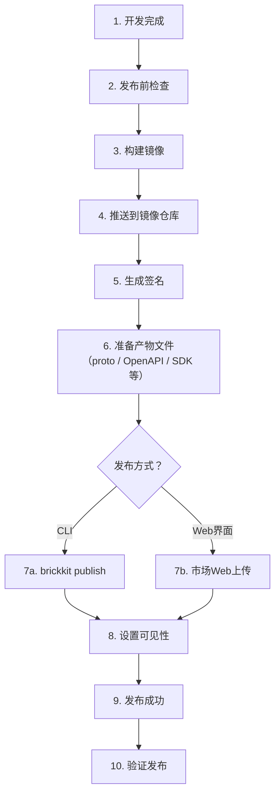
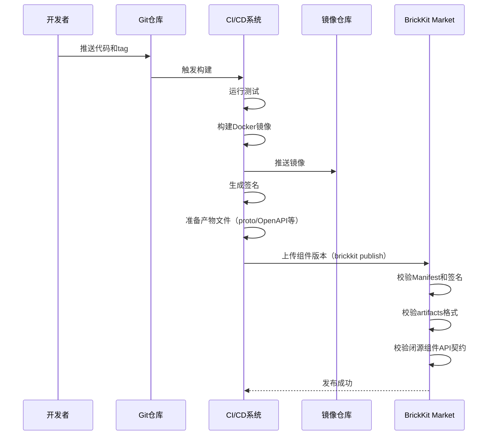

# 010 BrickKit 组件发布与上架指南

## 文档信息

| 项目 | 内容 |
| --- | --- |
| 文档编号 | 010 |
| 文档名称 | 组件发布与上架指南 |
| 所属篇章 | 第九篇：开发者指南 |
| 版本 | 1.5.0 |
| 最后更新 | 2026-08-23 |
| 状态 | 定稿 |
| 依赖文档 | 002 组件规范、004 BrickKit CLI 设计、007 组件市场设计、008 安全与治理、009 组件开发快速入门、012 架构设计原理与考量 |
| 被依赖文档 | 011 组件安装与拼装指南 |

---

## 1. 本文档目标

本文档教你如何把开发好的组件发布到 BrickKit Market，让其他人可以发现、安装和使用你的组件。

读完后你将知道：
- 发布前需要准备什么
- 怎么构建组件产物
- 怎么校验 Manifest
- 怎么生成签名
- 怎么推送到镜像仓库
- 怎么准备和上传产物文件（API 契约、SDK、文档等）
- 怎么通过 CLI 或 Web 界面上传到市场
- 怎么区分开源/闭源组件
- 怎么设置可见性（public/private）
- 怎么管理版本（精确版本）
- 怎么处理破坏性变更（Major 版本）
- 怎么从归档目录发布（`brickkit sync` 归档后）
- 怎么通过 `--repo` clone 后修改再发布新版本
- 发布后怎么验证

---

## 2. 发布流程总览

### 2.1 完整流程图



### 2.2 开源 vs 闭源发布差异

| 维度 | 开源组件 | 闭源组件 |
| --- | --- | --- |
| Git 仓库 | ✅ 必须提供 | ❌ 不需要 |
| 源码 | ✅ 公开 | ❌ 不公开 |
| Manifest 存储 | 市场 + Git 仓库 | 仅市场 |
| 镜像引用 | ✅ 必须 | ✅ 必须 |
| API 契约文件 | ✅（在 Git 仓库中） | ✅ 必须上传到市场（如提供 API） |
| 其他附件（SDK、文档等） | ✅ 可选（在 Git 仓库中） | ✅ 可选（上传到市场） |
| 发布方式 | CLI / Web 均可 | CLI / Web 均可 |
| 本地调试支持 | ✅（`local: true`） | ❌（无源码） |

### 2.3 所有组件都是 container

BrickKit 中所有组件都是 container（包括前端组件，使用 nginx 等 Web Server）。发布流程对所有组件类型一致：

- 后端组件：业务进程容器
- 前端组件：nginx 容器 serve 静态资源
- 工具组件：业务进程容器
- 脚本组件：脚本进程容器

发布流程没有区别。

---

## 3. 发布前检查清单

### 3.1 代码检查

| # | 检查项 | 说明 |
| --- | --- | --- |
| 1 | 代码中无硬编码地址 | 所有地址通过环境变量读取 |
| 2 | 代码中无硬编码密码 | 所有密码通过环境变量读取 |
| 3 | 代码中无敏感信息 | 无 Token、私钥、身份证号等 |
| 4 | 日志输出正常 | JSON 格式，不输出密码 |
| 5 | 错误处理完整 | 不暴露内部实现细节 |
| 6 | 弱依赖降级逻辑 | 弱依赖缺失时有降级处理（使用 `os.environ.get()` 安全读取） |

### 3.2 功能检查

| # | 检查项 | 说明 |
| --- | --- | --- |
| 1 | `/healthz` 返回 200 | 健康检查通过 |
| 2 | 业务 API 正常响应 | 功能正确 |
| 3 | 依赖组件调用成功 | 依赖通信正常 |
| 4 | 弱依赖不可用时有降级 | 容错能力 |
| 5 | 单元测试通过 | 代码质量 |
| 6 | 集成测试通过 | 端到端验证 |
| 7 | 迁移脚本可执行 | 如有 migration 字段 |

### 3.3 Manifest 检查

| # | 检查项 | 说明 |
| --- | --- | --- |
| 1 | component.yaml 格式合法 | 所有必填字段完整 |
| 2 | 版本号正确 | 精确语义化版本，不与已有版本重复 |
| 3 | 依赖声明完整 | 所有依赖都声明了（精确版本） |
| 4 | 强/弱依赖标记正确 | `optional: true` 标记弱依赖 |
| 5 | 资源声明正确 | 需要的资源类型和引擎正确 |
| 6 | configSchema 完整 | 配置项有类型和默认值 |
| 7 | healthCheck 配置正确 | 类型和路径正确 |
| 8 | deployment 配置正确 | 镜像地址和端口正确 |
| 9 | migration 配置正确（如有） | 迁移命令为数组格式 |
| 10 | tags 设置合理 | 方便市场搜索和分类 |
| 11 | 破坏性变更已标注（Major 版本） | Changelog 中强提示（见 10.7） |
| 12 | artifacts 声明完整 | 如果组件提供 API，必须声明 API 契约文件 |
| 13 | 闭源组件包含 API 契约 | 闭源组件的 artifacts 中必须有至少一个 `type: api-contract` |

### 3.4 安全检查

| # | 检查项 | 说明 |
| --- | --- | --- |
| 1 | 容器使用非 root 用户 | Dockerfile 中 USER 非 root |
| 2 | 不暴露不必要端口 | 只暴露业务端口 |
| 3 | 镜像来源可信 | 基础镜像来自官方或可信源 |
| 4 | 无已知安全漏洞 | 扫描镜像 |

---

## 4. 构建组件产物

### 4.1 后端组件

构建 Docker 镜像：

```bash
# 进入组件目录
cd components/people/basic

# 构建镜像（使用明确版本标签）
docker build -t registry.brickkit.io/people-basic:1.2.0 .

# 验证镜像可以运行
docker run -d --name test-people-basic -p 8080:8080 registry.brickkit.io/people-basic:1.2.0

# 测试健康检查
curl http://localhost:8080/healthz

# 停止测试容器
docker stop test-people-basic
docker rm test-people-basic
```

### 4.2 前端组件（nginx 容器）

前端组件也是一个 container，构建方式和后端组件一样：

```bash
# 进入前端组件目录
cd components/portal/user-frontend

# 构建镜像（内部包含 npm build + nginx）
docker build -t registry.brickkit.io/portal-user-frontend:1.0.0 .

# 验证镜像可以运行
docker run -d --name test-frontend -p 8080:80 registry.brickkit.io/portal-user-frontend:1.0.0

# 测试健康检查
curl http://localhost:8080/

# 停止测试容器
docker stop test-frontend
docker rm test-frontend
```

前端组件的 Dockerfile 示例：

```dockerfile
# 阶段1：构建前端静态资源
FROM node:18 AS build
WORKDIR /app
COPY package*.json ./
RUN npm install
COPY . .
RUN npm run build

# 阶段2：用 nginx serve 静态资源
FROM nginx:alpine
COPY --from=build /app/dist /usr/share/nginx/html
COPY nginx.conf.template /etc/nginx/templates/default.conf.template
EXPOSE 80
```

### 4.3 镜像标签规则

| 规则 | 说明 |
| --- | --- |
| 不使用 latest | 生产环境必须使用明确版本 |
| 版本与 Manifest 一致 | component.yaml 中的 version 必须与镜像标签一致 |
| 包含命名空间 | 如 `registry.brickkit.io/people-basic:1.2.0` |

```bash
# ❌ 错误：
docker build -t people-basic:latest .

# ✅ 正确：
docker build -t registry.brickkit.io/people-basic:1.2.0 .
```

### 4.4 准备产物文件（artifacts）

如果组件在 Manifest 中声明了 `artifacts`，发布前需要确保所有产物文件存在且正确：

| 产物类型 | 说明 | 示例 |
| --- | --- | --- |
| api-contract | API 契约文件（proto / OpenAPI / GraphQL schema 等） | proto/people/v1/people.proto |
| api-docs | API 文档 | openapi.json |
| sdk | 客户端 SDK | sdk/people-basic-client-1.0.0.tar.gz |
| 其他 | 任何自定义类型 | 自由定义 |

**检查清单：**

| # | 检查项 | 说明 |
| --- | --- | --- |
| 1 | artifacts 中声明的每个文件都存在 | 文件路径相对于组件仓库根目录 |
| 2 | proto 文件可以编译 | `protoc` 编译通过 |
| 3 | OpenAPI spec 格式合法 | 可用 Swagger Editor 验证 |
| 4 | 闭源组件必须包含 API 契约 | 至少一个 `type: api-contract` |

---

## 5. 推送到镜像仓库

### 5.1 登录镜像仓库

```bash
# 用户手动登录镜像仓库（CLI 不自动执行 docker login）
docker login registry.brickkit.io
# 输入用户名和密码
```

**注意：** CLI 不自动执行 `docker login`，也不在 `brickkit.yaml` 中存储镜像仓库凭据。镜像拉取认证完全由用户手动处理，与日常 Docker 使用习惯一致。CLI 在 `brickkit up` 时会检测镜像拉取权限，如果未登录会报错提示。

### 5.2 推送镜像

```bash
docker push registry.brickkit.io/people-basic:1.2.0
```

### 5.3 验证推送成功

```bash
# 拉取验证
docker pull registry.brickkit.io/people-basic:1.2.0
```

### 5.4 镜像仓库权限

| 组件可见性 | 镜像仓库权限 |
| --- | --- |
| public | 镜像公开，任何人可 pull |
| private | 镜像私有，只有授权用户可 pull |

发布 private 组件时，确保镜像仓库中对应的镜像也是私有的。

---

## 6. 生成签名

### 6.1 为什么需要签名

签名确保：
- 组件未被篡改
- 组件来自可信发布者
- 组件版本完整

### 6.2 生成签名

⚠️ **签的是 Manifest，不是镜像。** BrickKit 的签名覆盖的是**组件版本的
Manifest 的规范化载荷**（008 §8.3.1）——那才是 CLI 真正下载、真正能验的东西；
镜像是容器运行时/kubelet 拉的，CLI 根本不在那条链路上。

`cosign sign <镜像>`（对镜像本身签名）解决的是另一个问题：绕开 BrickKit
直接部署时谁来保证镜像来源。那一步由集群的准入控制器（Kyverno /
Sigstore policy-controller）校验，需要运维制定策略，CLI 碰不到——
**平台不做它**（008 §8.3.2）。

**准备密钥对（首次发布时，一次性）：**

```bash
cosign generate-key-pair          # 产出 cosign.key（私钥）与 cosign.pub（公钥）
mv cosign.key keys/people-basic-release.key
mv cosign.pub keys/people-basic-release.pub
```

私钥 `*.key` **绝不能提交 Git**；公钥 `*.pub` 应当提交——使用者要把它配进
自己的 `installer.publicKeys`（003 §3.6）。

**签名与发布是同一条命令：**

```bash
brickkit publish \
  --path ./components/people/basic \
  --sign \
  --key keys/people-basic-release.key \
  --signed-by release-bot@mycompany.com
```

CLI 替你做三件事，都不需要你手工调 cosign：

| CLI 做的 | 为什么 |
| --- | --- |
| 把 `deployment.image` 的 tag 解析成 **digest** 再签 | tag 是可变的：签名保证镜像**字符串**没被改，保证不了它还指向同样的字节。钉成 digest 这个缺口就自己关上了（008 §8.3.2）。`--no-pin-digest` 可跳过，CLI 会明确警告放弃了什么 |
| 把 Manifest 规范化成载荷再签 | 一份 Manifest 在到达校验方之前会经历 YAML → JSON → YAML 的反复改写，对"某一种写法的字节"签名必然失效（008 §8.3.1） |
| 固定 `--tlog-upload=false` | cosign **默认**会把签名条目上传到 Sigstore 的公共 Rekor 透明日志。BrickKit 的组件大量是 private 的，默认上传等于把"某公司在某时刻发布了某个内部组件、其内容哈希是什么"公开出去（008 §8.4.2） |

**发布方需要装 cosign，使用者不需要。** cosign `sign-blob` 产出的就是标准的
ECDSA P-256 over SHA-256 签名，Go 标准库直接可验，CLI 零依赖（008 §8.4.1）。

**参数速查（完整列表见 004 §3.11）：**

| 参数 | 说明 |
| --- | --- |
| `--sign` | 签名后发布 |
| `--key` | 私钥路径，默认 `cosign.key` |
| `--signed-by` | 签名者标识，写进签名供安装方核对 |
| `--public-key-ref` | 写进签名的公钥 ref。不写则按 `--key` 的 `.key` → `.pub` 推导 |
| `--no-pin-digest` | 不把镜像 tag 钉成 digest（**默认会钉**） |

CI 里私钥有口令时用环境变量传：`COSIGN_PASSWORD="" brickkit publish --sign ...`。

### 6.3 签名信息

发布成功后，市场上存的签名长这样（`publicKeyRef` 只是一个**名字**，
不是密钥材料——由使用者在自己的 `installer.publicKeys` 里解析成公钥文件）：

```json
{
  "algorithm": "cosign",
  "publicKeyRef": "keys/people-basic-release.pub",
  "value": "MEUCIQ...",
  "signedAt": "2026-01-01T10:00:00Z",
  "signedBy": "release-bot@mycompany.com"
}
```

**市场只校验这份结构（算法认不认识、必填项在不在、`value` 是不是合法 base64），
不做密码学校验**（007 §7.2）：它手里没有可信的公钥，让发布者连公钥一起上传
就是自己给自己发证。真正的校验在使用者的 CLI 上。

### 6.4 签名策略

| 环境 | 签名要求 |
| --- | --- |
| 本地开发 | 可选 |
| 测试环境 | 建议开启 |
| 生产环境 | 强制开启 |

**建议所有发布到市场的组件都签名。** 即使是 public 组件。

---

## 7. 上传到市场

### 7.1 发布方式

组件可以通过两种方式发布到市场：

| 方式 | 说明 | 适用场景 |
| --- | --- | --- |
| CLI `brickkit publish` | 命令行发布 | 开发者本地、CI/CD |
| 市场 Web 界面 | 浏览器上传 | 快速发布、非技术人员 |

### 7.2 认证

发布组件必须登录市场。

**CLI 方式：**

```bash
# 登录市场
brickkit login
# 输入用户名和密码
```

**Token 存储位置：** `.brickkit/credentials`

**credentials 文件格式（预留扩展）：**

```json
{
  "type": "password",
  "marketUrl": "https://market.brickkit.io/api/v1",
  "username": "zhangsan",
  "token": "eyJhbGciOiJIUzI1NiIs...",
  "expiresAt": "2026-09-08T10:00:00Z",
  "createdAt": "2026-08-08T10:00:00Z"
}
```

`type` 字段当前固定为 `"password"`。未来扩展 OAuth 时可改为 `"oauth"`，扩展 API Key 时可改为 `"api-key"`，CLI 根据 `type` 决定认证行为。

**Token 优先级：**
- CLI 优先读取 `.brickkit/credentials` 中的 Token
- 如果 `.brickkit/credentials` 不存在，fallback 到 `brickkit.yaml` 中 `sources.authToken: ${MARKET_TOKEN}`

**API 方式：**

```bash
curl -X POST https://market.brickkit.io/api/v1/auth/login \
  -H "Content-Type: application/json" \
  -d '{
    "username": "my-name",
    "password": "my-password"
  }'
```

### 7.3 方式一：CLI 发布（推荐）

```bash
brickkit publish \
  --path ./components/people/basic \
  --visibility public \
  --changelog "新增人员状态字段" \
  --sign
```

**CLI 发布行为：**
1. **检查登录状态：** 如果 `.brickkit/credentials` 不存在且 `brickkit.yaml` 中没有 `authToken`，报错提示先执行 `brickkit login`
2. 读取组件目录中的 `component.yaml`
3. 校验 Manifest 格式
4. 读取 Manifest 中的 `artifacts` 字段
5. 检查镜像引用是否有效
6. 上传到市场（Manifest + 镜像引用 + 产物文件 + 签名）
7. 设置可见性

**从归档目录发布：**

如果组件源码被 `brickkit sync` 归档到了 `components/.archived/` 目录，你可以：

- **方式 A：先激活再发布**

```bash
# 先执行 brickkit sync 把组件移回活跃目录（如果组件恢复启用）
brickkit sync

# 然后正常发布
brickkit publish --path ./components/people/basic
```

- **方式 B：直接指定归档目录路径**

```bash
brickkit publish --path ./components/.archived/people/basic
```

归档目录中的组件仍然是完整的 Git 仓库（含 `.git`），publish 操作不受影响。

**输出示例（未登录）：**

```
❌ 发布失败：未登录
   请先执行 brickkit login 登录市场
   或在 brickkit.yaml 中配置 sources.authToken
```

**输出示例（成功）：**

```
📤 发布 people/basic@1.2.0
   ✅ Manifest 校验通过
   ✅ 镜像引用有效：registry.brickkit.io/people-basic:1.2.0
   ✅ 签名校验通过
   ✅ artifacts 上传成功（2 个文件）
   ✅ 上传成功
🎉 发布完成
   组件：people/basic@1.2.0
   可见性：public
   来源类型：git
   Git 仓库：https://github.com/brickkit/people-basic.git
   市场地址：https://market.brickkit.io/components/people/basic
```

### 7.4 方式二：Web 界面发布

市场 Web 界面提供表单式发布：

1. 登录市场：`https://market.brickkit.io`
2. 进入"发布组件"页面
3. 上传 component.yaml（或粘贴内容）
4. 填写镜像引用
5. 选择来源类型（git / registry）
6. 填写 Git 仓库地址（开源时）
7. 上传产物文件（proto / OpenAPI / SDK 等）
8. 上传签名（可选）
9. 设置可见性
10. 填写更新说明
11. 点击"发布"

### 7.5 首次发布（创建组件）

如果是第一次发布某个组件，需要先创建组件：

```bash
curl -X POST https://market.brickkit.io/api/v1/components \
  -H "Authorization: Bearer <market-token>" \
  -H "Content-Type: application/json" \
  -d '{
    "componentId": "people/basic",
    "name": "基础人员组件",
    "description": "提供基础人员管理能力",
    "vendor": "brickkit-official",
    "tags": ["people", "master-data", "backend"],
    "visibility": "public",
    "sourceType": "git",
    "gitUrl": "https://github.com/brickkit/people-basic.git"
  }'
```

### 7.6 发布版本请求

```json
POST /api/v1/components/people/basic/versions

{
  "version": "1.2.0",
  "status": "stable",
  "manifest": {
    "apiVersion": "brickkit/v1",
    "kind": "Component",
    "metadata": {
      "id": "people/basic",
      "name": "基础人员组件",
      "version": "1.2.0",
      "description": "提供基础人员管理能力",
      "vendor": "brickkit-official",
      "license": "MIT"
    },
    "tags": ["people", "master-data", "backend"],
    "artifacts": [
      {
        "type": "api-contract",
        "format": "protobuf",
        "description": "gRPC API 契约文件",
        "files": ["proto/people/v1/people.proto"]
      },
      {
        "type": "api-docs",
        "format": "openapi",
        "description": "HTTP REST API 文档",
        "files": ["openapi.json"]
      }
    ],
    "dependencies": {
      "components": [
        { "id": "department/tree", "version": "1.0.0" },
        { "id": "infra/redis-event-bus", "version": "1.0.0", "optional": true }
      ],
      "resources": [
        { "kind": "database", "engine": "postgresql" }
      ]
    },
    "configSchema": {
      "type": "object",
      "properties": {
        "defaultPageSize": { "type": "integer", "default": 20 },
        "enableAudit": { "type": "boolean", "default": true }
      }
    },
    "deployment": {
      "type": "container",
      "image": "registry.brickkit.io/people-basic:1.2.0",
      "port": 8080
    },
    "migration": {
      "command": ["python", "manage.py", "migrate"]
    },
    "healthCheck": {
      "type": "http",
      "path": "/healthz"
    },
  },
  "sourceType": "git",
  "gitUrl": "https://github.com/brickkit/people-basic.git",
  "artifacts": [
    {
      "type": "container",
      "reference": "registry.brickkit.io/people-basic:1.2.0",
      "checksum": "sha256:abc123..."
    },
    {
      "type": "api-contract",
      "format": "protobuf",
      "description": "gRPC API 契约文件",
      "files": ["proto/people/v1/people.proto"]
    },
    {
      "type": "api-docs",
      "format": "openapi",
      "description": "HTTP REST API 文档",
      "files": ["openapi.json"]
    }
  ],
  "changelog": "1. 新增人员状态字段\n2. 优化人员列表查询性能",
  "signature": {
    "algorithm": "cosign",
    "publicKeyRef": "keys/people-basic-release.pub",
    "value": "MEUCIQ...",
    "signedAt": "2026-01-01T10:00:00Z",
    "signedBy": "release-bot@brickkit.io"
  }
}
```

**关键点：**
- 依赖使用精确版本（`"version": "1.0.0"`），不用 `^1.0.0`
- 弱依赖使用 `"optional": true` 标记
- `migration` 字段（可选）：声明数据库迁移命令
- `configSchema` 字段（可选）：声明组件接受的配置项
- `sourceType` 和 `gitUrl` 字段：区分开源/闭源
- `artifacts` 字段（可选）：声明组件附带的产物文件，type 和 format 是自由字符串

### 7.7 发布请求校验

市场收到发布请求后，会自动校验：

| 校验项 | 说明 |
| --- | --- |
| Manifest 格式 | apiVersion、kind、metadata 是否合法 |
| 版本号 | 是否精确语义化版本，是否重复 |
| 依赖格式 | 依赖声明是否合法（精确版本） |
| 镜像引用 | 是否指向有效的镜像地址 |
| 签名 | 签名是否有效（如果提供） |
| 发布者权限 | 是否有权发布到该命名空间 |
| 来源类型 | sourceType 是否合法（git/registry） |
| migration 格式 | 如有，command 是否为数组 |
| configSchema 格式 | 如有，是否为合法的 JSON Schema（**市场只校验 configSchema 本身的格式合法性，不校验使用者填写的 config 值**） |
| configSchema 配置项名称 | 不得与平台保留变量冲突（见 007 组件市场设计第 18 节） |
| artifacts 格式 | 如果存在，每个 artifact 必须有 `type` 和 `files` 字段 |
| 闭源组件 API 契约 | 如果 sourceType 为 `registry` 且组件提供 API（`deployment.port` 存在），必须存在至少一个 `type: api-contract` 的 artifact |

校验失败时，市场返回错误信息，发布不会成功。

### 7.8 发布成功响应

```json
{
  "success": true,
  "data": {
    "componentId": "people/basic",
    "version": "1.2.0",
    "status": "stable",
    "sourceType": "git",
    "publishedAt": "2026-01-01T10:00:00Z",
    "publishedBy": "release-bot@brickkit.io"
  }
}
```

---

## 8. 开源/闭源组件发布

### 8.1 开源组件发布

开源组件必须提供 Git 仓库地址：

```json
{
  "componentId": "people/basic",
  "sourceType": "git",
  "gitUrl": "https://github.com/brickkit/people-basic.git",
  "artifacts": [
    {
      "type": "container",
      "reference": "registry.brickkit.io/people-basic:1.2.0"
    },
    {
      "type": "api-contract",
      "format": "protobuf",
      "description": "gRPC API 契约文件",
      "files": ["proto/people/v1/people.proto"]
    }
  ]
}
```

**开源组件额外能力：**
- 用户可以查看源码
- 用户可以本地修改后重新构建
- 用户可以 fork 后修改
- 用户可以使用 `local: true` 本地调试

### 8.2 闭源组件发布

闭源组件不提供 Git 仓库，只有 Manifest + 镜像引用 + API 契约：

```json
{
  "componentId": "mycompany/approval",
  "sourceType": "registry",
  "artifacts": [
    {
      "type": "container",
      "reference": "registry.mycompany.com/approval:1.0.0"
    },
    {
      "type": "api-contract",
      "format": "protobuf",
      "description": "gRPC API 契约文件",
      "files": ["proto/approval/v1/approval.proto"]
    }
  ]
}
```

**闭源组件限制：**
- 用户不能查看源码
- 用户不能本地构建
- 用户不能使用 `local: true` 本地调试
- 只能使用已发布的镜像
- 但用户可以获取 API 契约文件（proto / OpenAPI）

### 8.3 闭源组件的产物存储

闭源组件的"发布物"存储在市场本身：

| 存储内容 | 说明 |
| --- | --- |
| component.yaml | Manifest（必须） |
| 镜像引用 | 指向镜像仓库的地址（必须） |
| API 契约文件（proto / OpenAPI） | 闭源组件必须上传（如提供 API） |
| 其他附件（SDK、文档等） | 可选 |
| 签名 | 组件签名（建议） |
| 更新说明 | changelog |

**闭源组件的边界：**

| 内容 | 开源组件 | 闭源组件 |
| --- | --- | --- |
| 源码 | ✅ 可见 | ❌ 不可见 |
| API 契约（proto / OpenAPI） | ✅ 可见（在 Git 仓库中） | ✅ **可见（必须上传到市场）** |
| 镜像 | ✅ 可拉取 | ✅ 可拉取 |
| 本地调试 | ✅ `local: true` | ❌ 不支持 |

**核心原则：代码可以闭源，但 API 契约必须公开。** 否则调用方无法开发调用代码，组件就无法被集成。

### 8.4 来源类型对比

| 维度 | 开源（git） | 闭源（registry） |
| --- | --- | --- |
| 有 Git 仓库 | ✅ | ❌ |
| 有源码 | ✅ | ❌ |
| 可本地构建 | ✅ | ❌ |
| 可本地调试（local: true） | ✅ | ❌ |
| 有 Manifest | ✅ | ✅（存市场） |
| 有镜像引用 | ✅ | ✅ |
| 有 API 契约 | ✅（在 Git 仓库中） | ✅（上传到市场） |
| CLI 拉取方式 | git clone + 读 Manifest | 从市场获取 Manifest + pull 镜像 + 下载产物文件 |

---

## 9. 设置可见性

### 9.1 public（公开）

所有人可以看到和安装：

```json
{
  "visibility": "public"
}
```

适用场景：
- 开源组件
- 官方通用组件
- 社区贡献组件

### 9.2 private（私有）

只有授权用户/组织可以看到和安装：

```json
{
  "visibility": "private",
  "accessControl": {
    "allowedOrganizations": ["org-mycompany"],
    "allowedUsers": ["user-admin-1", "user-dev-2"]
  }
}
```

适用场景：
- 企业内部定制组件
- 客户专属组件
- 闭源商业组件

### 9.3 设置可见性 API

```bash
curl -X PUT https://market.brickkit.io/api/v1/components/people/basic/visibility \
  -H "Authorization: Bearer <market-token>" \
  -H "Content-Type: application/json" \
  -d '{
    "visibility": "private",
    "accessControl": {
      "allowedOrganizations": ["org-mycompany"]
    }
  }'
```

### 9.4 可见性与镜像权限的关系

| 组件可见性 | 镜像仓库权限 | 必须一致 |
| --- | --- | --- |
| public | 镜像公开 | ✅ |
| private | 镜像私有 | ✅ |

**组件可见性和镜像权限必须一致。** 如果组件是 private 但镜像是 public，那任何人都能拉取镜像，private 就失去意义了。

---

## 10. 版本管理

### 10.1 精确版本

```
major.minor.patch
```

| 变化 | 含义 | 示例 |
| --- | --- | --- |
| patch | 向后兼容的问题修复 | 1.0.0 → 1.0.1 |
| minor | 向后兼容的新增功能 | 1.0.0 → 1.1.0 |
| major | 破坏性变更 | 1.0.0 → 2.0.0 |

**关键规则：**

| 规则 | 说明 |
| --- | --- |
| 版本必须是精确的 | `1.2.0`，不接受 `^1.2.0` 或 `~1.2.0` |
| 依赖声明也是精确版本 | `department/tree@1.0.0` |
| 版本不可重复 | 同一组件同一版本只能发布一次 |
| 升级必须显式 | 调用方必须手动修改 Manifest 中的版本号 |
| 服务名带版本号 | `people-basic-1-2-0` |

### 10.2 版本状态

| 状态 | 说明 | 能否安装 |
| --- | --- | --- |
| draft | 草稿，开发中 | ❌ |
| stable | 稳定，可安装 | ✅ |
| deprecated | 已弃用，不推荐 | ⚠️ |
| blocked | 被阻止 | ❌ |

### 10.3 发布时设置版本状态

```json
{
  "version": "1.2.0",
  "status": "stable"
}
```

### 10.4 更新版本状态

```bash
# 将版本标记为 deprecated
curl -X PUT https://market.brickkit.io/api/v1/components/people/basic/versions/1.0.0 \
  -H "Authorization: Bearer <market-token>" \
  -d '{ "status": "deprecated" }'
```

### 10.5 版本不可重复

同一个组件的同一个版本只能发布一次：

```
❌ 不允许：
people/basic@1.0.0 发布两次

✅ 正确：
people/basic@1.0.0 发布一次
people/basic@1.0.1 修复后发布新版本
```

### 10.6 版本不可物理删除

已发布的版本不允许物理删除。只能标记为 `blocked` 或 `deprecated`。

**原因：**
- 其他组件可能依赖该版本
- 已安装的环境可能正在使用该版本
- 物理删除会导致依赖方找不到组件

### 10.7 破坏性变更（Major）协同守则

当组件发布涉及破坏性操作的 Major 版本（如 1.0.0 → 2.0.0，删除字段、重命名表、移除 API 等）时，必须遵循以下守则：

| # | 守则 | 责任方 |
| --- | --- | --- |
| 1 | Changelog 中必须强提示破坏性变更 | 组件发布者 |
| 2 | 调用方团队必须协调同步升级 | 调用方团队 |
| 3 | 无法按时更新的部门，多版本共存作为物理缓冲期 | 项目管理员 |
| 4 | 平台不保证多版本共存时的数据库结构兼容 | —（平台不介入） |

**重要共识：** 破坏性变更是组织协调问题，不是平台技术问题。多版本共存（brickkit.yaml 中同时存在多个版本条目）只是物理缓冲，不会自动解决数据层冲突（如迁移冲突、字段删除导致旧版本崩溃）。部门之间必须自行协调升级节奏，平台不替任何人兜底。

此守则同样适用于 API 契约文件的破坏性变更。proto 文件的版本管理 = 组件的版本管理，不需要独立的版本管理机制。向后兼容的 proto 变更（新增方法/字段），旧客户端代码自然兼容；破坏性的 proto 变更（删除方法/字段），调用方必须协调同步升级。

**Changelog 中的破坏性变更标注示例：**

```markdown
## 2.0.0 ⚠️ 破坏性变更

### ⚠️ 重要：此版本包含破坏性变更，调用方必须协调同步升级！

### 破坏性变更
- 删除了 `person.age` 字段（改用 `person.birth_date`）
- 重命名了 `person_status` 表为 `person_lifecycle_status`
- 移除了 `GET /api/v1/people/legacy` 接口
- proto 文件中删除了 `GetPersonLegacy` 方法

### 迁移指南
1. 将所有 `person.age` 的引用改为 `person.birth_date`
2. 更新数据库查询中的表名
3. 将 `/api/v1/people/legacy` 调用改为 `/api/v1/people`
4. 重新生成 gRPC 客户端代码（下载新版 proto 文件）

### 新增
- 支持人员生命周期状态管理
- 新增批量导入 API

### 数据库迁移
- 迁移脚本自动执行（migration.command）
- ⚠️ 迁移包含删除操作，不可回滚
```

---

## 11. 更新说明（Changelog）

### 11.1 每次发布必须写更新说明

```json
{
  "changelog": "1. 新增人员状态字段\n2. 优化人员列表查询性能\n3. 修复部门同步事件重复问题"
}
```

### 11.2 更新说明格式建议

```markdown
## 1.2.0

### 新增
- 人员状态字段（active/inactive/locked）
- 人员列表支持按状态筛选

### 优化
- 人员列表查询性能提升50%

### 修复
- 修复部门同步事件重复触发问题

### 依赖变更
- 需要 department/tree@1.1.0（之前是 1.0.0）

### 配置变更
- 新增配置项 enableStatusFilter（默认 true）

### 数据库迁移
- 新增 person.status 字段
- 迁移脚本自动执行（migration.command）

### API 契约变更
- proto 文件新增 GetPersonByStatus 方法（向后兼容）
```

### 11.3 更新说明规则

| 规则 | 说明 |
| --- | --- |
| 必须写 | 每次发布都要写 |
| 写清楚变更 | 让使用者知道改了什么 |
| 标注破坏性变更 | major 版本必须明确说明（见 10.7 协同守则） |
| 标注依赖变更 | 如果依赖版本变了 |
| 标注配置变更 | 如果新增了配置项 |
| 标注数据库迁移 | 如果有数据库结构变更（migration 字段） |
| 标注 API 契约变更 | 如果 proto / OpenAPI 文件有变更 |

---

## 12. 发布后验证

### 12.1 验证组件在市场可见

```bash
# 查询组件
curl https://market.brickkit.io/api/v1/components/people/basic

# 查询版本列表
curl https://market.brickkit.io/api/v1/components/people/basic/versions

# 查询特定版本
curl https://market.brickkit.io/api/v1/components/people/basic/versions/1.2.0
```

### 12.2 验证 Manifest 可获取

```bash
curl https://market.brickkit.io/api/v1/components/people/basic/versions/1.2.0/manifest
```

### 12.3 验证产物文件可下载

```bash
# 获取产物列表
curl https://market.brickkit.io/api/v1/components/people/basic/versions/1.2.0/artifacts

# 下载具体产物文件
curl https://market.brickkit.io/api/v1/components/people/basic/versions/1.2.0/artifacts/{artifactId}/download
```

### 12.4 验证镜像可拉取

```bash
docker pull registry.brickkit.io/people-basic:1.2.0
```

### 12.5 验证签名

签名覆盖的是 Manifest（§6.2），所以验证的方式是**以使用者的身份装一次**——
把公钥配进项目、打开强制校验，然后 `brickkit add`：

```yaml
# 测试项目的 brickkit.yaml
installer:
  requireSignature: true
  publicKeys:
    keys/people-basic-release.pub: ./people-basic-release.pub
```

```bash
brickkit add people/basic@1.2.0     # 验签失败会直接拒绝安装
```

这条路径与真实使用者走的完全一样，因此能验出"公钥 ref 写错了""签的是
另一个版本"这类只有端到端才暴露的问题。

想用标准 cosign 独立复核（审计场景）也可以——签名不是 BrickKit 私有格式：

```bash
cosign verify-blob --key keys/people-basic-release.pub \
  --signature <签名的 base64> <Manifest 的规范化载荷>
```

⚠️ `cosign verify --key ... <镜像>` **验不了 BrickKit 的签名**：那验的是
镜像签名，而平台不签镜像（§6.2）。

### 12.6 端到端验证

在本地 BrickKit 环境中安装刚发布的组件：

```bash
# 创建测试项目
mkdir test-install
cd test-install
brickkit init test-project

# 添加组件（CLI 自动拉取 Manifest + 产物文件）
brickkit add people/basic@1.2.0

# 验证产物文件已下载
ls .brickkit/artifacts/people-basic-1-2-0/
# 应包含 proto 文件和 openapi.json

# 配置资源绑定（如需要）
# 编辑 brickkit.yaml，添加 resources 和 bindings

# 启动
brickkit up

# 确认安装成功
brickkit status
```

---

## 13. 命名空间与发布权限

### 13.1 命名空间规则

组件 ID 格式：`<scope>/<name>`

| 命名空间 | 谁能**首次创建** | 平台怎么保证 |
| --- | --- | --- |
| `brickkit/` | 只有市场管理员 | 固定的保留前缀，发布时校验 |
| `infra/` | 只有市场管理员 | 同上 |
| 其余（组织名 / 用户名 / 业务域） | **先到先得** | 首次发布者成为 owner；之后每个版本都要过所有者校验 |

**为什么其余的是先到先得。** "组织名/ 必须是该组织成员"需要一张命名空间
注册表：申请、审批、转让、争议处理——那是一个独立的子系统，而它换来的东西
npm 也没有（unscoped 包名同样先到先得）。

**抢注一个名字并不能劫持别人的组件**：首次发布者成为所有者，之后的每个版本
都要过所有者校验。所以真正的风险只有"冒充官方"——那个用一张固定的前缀表
就挡住了，不需要任何新的数据结构。

### 13.2 发布权限

| 操作 | 权限要求 |
| --- | --- |
| 创建组件 | 必须登录；`brickkit/` 与 `infra/` 只有市场管理员能创建，其余先到先得（007 §14.2） |
| 发布版本 | 必须登录，必须是组件所有者或组织成员 |
| 修改可见性 | 必须是组件所有者 |
| 标记 deprecated | 必须是组件所有者 |
| 标记 blocked | 只有市场管理员 |

### 13.3 组织发布

如果你代表组织发布组件：

```bash
# 组件ID使用组织命名空间
brickkit publish \
  --path ./components/mycompany/approval-flow \
  --visibility private \
  --changelog "首次发布"
```

---

## 14. 本地开发时不需要发布

### 14.1 本地开发使用本地安装源

本地开发时，你不需要把组件发布到市场。直接使用本地目录作为安装源：

```yaml
# brickkit.yaml
sources:
  - id: local-dev
    type: local
    path: ./components
    enabled: true
```

### 14.2 本地开发不需要签名

```yaml
# brickkit.yaml
installer:
  requireSignature: false
```

### 14.3 本地开发不需要认证

本地安装源不需要 Token。

### 14.4 什么时候需要发布到市场

| 场景 | 是否需要发布 |
| --- | --- |
| 本地开发调试 | ❌ 不需要 |
| 团队内部测试 | ❌ 可以用本地安装源 |
| 分享给其他团队 | ✅ 需要发布 |
| 开源给社区 | ✅ 需要发布（public） |
| 商业售卖 | ✅ 需要发布（private） |

---

## 15. CI/CD 自动发布

### 15.1 推荐流程



### 15.2 CI/CD 脚本示例

```bash
#!/bin/bash
# publish.sh

set -e

COMPONENT_ID="people/basic"
VERSION=$(cat component.yaml | grep "version:" | awk '{print $2}')
IMAGE="registry.brickkit.io/people-basic:${VERSION}"

echo "Publishing ${COMPONENT_ID}@${VERSION}"

# 1. 运行测试
echo "Running tests..."
python -m pytest tests/

# 2. 构建镜像
echo "Building image..."
docker build -t ${IMAGE} .

# 3. 推送镜像
echo "Pushing image..."
docker push ${IMAGE}

# 4. 发布到市场（签名、钉 digest、上传 artifacts 都在这一步，见 §6.2）
echo "Publishing to market..."
COSIGN_PASSWORD="${COSIGN_PASSWORD}" brickkit publish \
  --path . \
  --visibility public \
  --changelog "$(cat CHANGELOG.md | head -20)" \
  --sign \
  --key keys/people-basic-release.key \
  --signed-by "ci@${CI_PROJECT_NAMESPACE:-example.com}"

echo "Published successfully!"
```

⚠️ **这里没有单独的"签名镜像"一步。** `--sign` 签的是 Manifest 的规范化载荷，
并顺手把 `deployment.image` 的 tag 钉成 digest——镜像的字节由 digest 保护，
不需要再签一次（§6.2、008 §8.3.2）。要给镜像本身签名是集群准入控制器那条线的事，
与 `brickkit publish` 无关。

**顺序不能反：** 镜像必须先 push 成功，`publish` 才解析得出 digest；
解析不出时它会**阻断发布**（而不是悄悄退回 tag），因为版本号一旦建出来
不可回收（007 §6.4），与其在市场里留下一个装不上的版本，不如现在停下。

### 15.3 Git Tag 触发发布

推荐通过 Git Tag 触发发布：

```bash
# 开发完成，打tag
git tag v1.2.0
git push origin v1.2.0

# CI/CD检测到tag，自动触发发布流程
```

---

## 16. 发布常见问题

**Q1：发布时报错"版本已存在"**

同一个组件的同一个版本只能发布一次。如果你需要修改，必须升级版本号：

```
❌ 1.2.0 发布失败后重新发布 1.2.0
✅ 修改后发布 1.2.1
```

**Q2：发布时报错"Manifest 校验失败"**

检查 component.yaml 格式：
- apiVersion 是否为 `brickkit/v1`
- kind 是否为 `Component`
- metadata.id 是否存在
- metadata.version 是否与发布版本一致
- deployment 是否完整（type: container, image, port）
- 依赖是否使用精确版本（不用 `^`）
- migration.command 是否为数组格式（如有）

**Q3：发布时报错"签名校验失败"**

检查：
- 签名是否使用了正确的私钥
- 公钥是否已上传到市场
- 签名是否过期

**Q4：发布时报错"无权限"**

检查：
- 是否已登录市场（`brickkit login`）
- 是否有该命名空间的发布权限
- 如果是组织组件，是否是组织成员

**Q5：发布后在市场搜索不到**

检查：
- 组件可见性是否为 private（如果是，只有授权用户能看到）
- 版本状态是否为 draft（draft 不展示）
- 搜索关键字是否正确

**Q6：发布后别人安装时报错"镜像拉取失败"**

检查：
- 镜像是否已推送到镜像仓库
- 镜像仓库权限是否与组件可见性一致
- 如果是 private 组件，安装方是否已执行 `docker login`

**Q7：可以删除已发布的版本吗？**

不可以物理删除。只能标记为 `deprecated` 或 `blocked`。

```bash
# 标记为deprecated
curl -X PUT https://market.brickkit.io/api/v1/components/people/basic/versions/1.0.0 \
  -H "Authorization: Bearer <token>" \
  -d '{"status": "deprecated"}'
```

**Q8：发布 public 组件后想改为 private 可以吗？**

可以。但注意：
- 已经安装了该组件的环境不受影响
- 改为 private 后，新的未授权用户无法搜索和安装
- 镜像仓库权限也需要同步修改

**Q9：发布时需要上传镜像本身吗？**

不需要。市场只存储镜像引用（地址），不存储镜像本身。镜像存储在独立的镜像仓库中。

**Q10：一次可以发布多个版本吗？**

不可以。每次只能发布一个版本。如果需要发布多个版本，分多次发布。

**Q11：开源组件必须提供 Git 仓库吗？**

是的。开源组件（`sourceType: git`）必须提供 Git 仓库地址。这样用户可以查看源码、fork、本地调试。

**Q12：闭源组件怎么发布？**

闭源组件（`sourceType: registry`）需要提供 Manifest + 镜像引用 + API 契约文件。市场会存储这些配置文件和产物文件。用户可以拉取镜像和下载 API 契约文件，但不能查看源码。

**Q13：组件需要上传 docker-compose 或 K8s 文件吗？**

不需要。部署文件由 CLI 根据 component.yaml 自动生成。组件只需要提供 Manifest。

**Q14：前端组件的发布流程和后端一样吗？**

一样。前端组件是一个 nginx 容器，发布流程和后端组件完全一致：构建镜像 → 推送仓库 → 签名 → 上传市场。

**Q15：有 migration 字段的组件发布时需要注意什么？**

确保：
- migration.command 格式正确（数组格式）
- 迁移脚本在镜像中可执行
- 迁移脚本是幂等的
- 更新说明中标注数据库迁移内容

**Q16：发布 Major 版本（破坏性变更）时需要注意什么？**

遵循 10.7 节"破坏性变更（Major）协同守则"：
- Changelog 中必须强提示破坏性变更
- 明确列出所有删除、重命名、移除的内容
- 提供迁移指南
- 通知调用方团队协调同步升级
- 如果调用方无法按时升级，多版本共存作为物理缓冲
- 如果 proto 文件有破坏性变更，在 Changelog 中明确标注

**Q17：闭源组件不提供 API 契约会怎样？**

市场会拒绝发布。如果闭源组件声明了 `deployment.port`（即提供 API），但 artifacts 中没有 `type: api-contract` 的产物，市场返回错误：

```json
{
  "success": false,
  "error": {
    "code": "CLOSED_SOURCE_MISSING_API_CONTRACT",
    "message": "闭源组件提供 API 时必须上传 API 契约文件",
    "details": {
      "componentId": "mycompany/approval",
      "version": "1.0.0",
      "suggestion": "请在 artifacts 中添加至少一个 type: api-contract 的产物（如 proto 文件或 OpenAPI spec）"
    }
  }
}
```

**Q18：artifacts 中的 type 和 format 有限制吗？**

没有。`type` 和 `format` 都是自由字符串，市场不校验其值。今天是 `api-contract` + `protobuf`，明天可以是 `asyncapi-spec` + `asyncapi`，后天可以是 `ml-model` + `onnx`。市场不理解文件内容，只负责存储和分发。

**Q19：产物文件有大小限制吗？**

建议单个文件不超过 10MB。如果有大型 SDK 包，建议上传到独立的文件存储服务，在 artifacts 中只放下载链接。

**Q20：proto 文件需要独立做版本管理吗？**

不需要。proto 文件跟随组件版本走。每个组件版本有自己独立的 artifacts。v1.0.0 的 proto 和 v1.1.0 的 proto 独立存储，互不覆盖。向后兼容的 proto 变更（Minor），旧客户端代码自然兼容；破坏性的 proto 变更（Major），遵循"破坏性变更协同守则"。

**Q21：组件源码在归档目录（`.archived/`）中，怎么发布？**

两种处理方式：

**方式 A：先激活再发布**

如果组件在 brickkit.yaml 中恢复启用，执行 `brickkit sync` 会自动将其从归档目录移回活跃目录：

```bash
brickkit sync
brickkit publish --path ./components/people/basic
```

**方式 B：直接指定归档目录路径**

```bash
brickkit publish --path ./components/.archived/people/basic
```

归档的组件仍然是完整的 Git 仓库，publish 操作不受归档影响。

**Q22：通过 `--repo` clone 的组件修改后怎么发布新版本？**

如果你通过 `brickkit add people/basic@1.0.0 --repo` clone 了组件源码并做了修改，想发布新版本：

1. 更新 `component.yaml` 中的版本号（如 1.0.0 → 1.1.0）
2. 构建新镜像
3. 推送镜像到镜像仓库
4. 执行 `brickkit publish`

```bash
cd components/people/basic

# 1. 更新版本号
sed -i 's/version: 1.0.0/version: 1.1.0/' component.yaml

# 2. 构建新镜像
docker build -t registry.brickkit.io/people-basic:1.1.0 .

# 3. 推送镜像
docker push registry.brickkit.io/people-basic:1.1.0

# 4. 发布到市场
brickkit publish --path . --visibility public --changelog "新增自定义字段"
```

修改源码后如何上传到 Git 仓库，详见 011 组件安装与拼装指南第 9 章"修改开源组件源码后如何上传"。

---

## 17. 发布审计

### 17.1 所有发布操作都会记录审计

```json
{
  "auditId": "audit-001",
  "action": "component.version.published",
  "componentId": "people/basic",
  "version": "1.2.0",
  "operator": "release-bot@brickkit.io",
  "time": "2026-01-01T10:00:00Z",
  "result": "success"
}
```

### 17.2 审计记录不可删除

审计日志只能追加，不能修改或删除。

### 17.3 可以在市场查看发布历史

```bash
curl https://market.brickkit.io/api/v1/components/people/basic/audit-logs \
  -H "Authorization: Bearer <token>"
```

---

## 18. 发布清单总结

```
发布前：
       □ 代码中无硬编码配置
       □ /healthz 健康检查通过
       □ 业务API正常
       □ 依赖组件调用正常
       □ 弱依赖降级逻辑正确（使用 os.environ.get() 安全读取）
       □ 单元测试通过
       □ component.yaml 格式合法
       □ 版本号正确（精确版本）
       □ 依赖声明完整（精确版本 + 强/弱标记）
       □ configSchema 完整（如有）
       □ migration 命令正确（如有）
       □ tags 设置合理
       □ 容器使用非root用户
       □ 破坏性变更已在 Changelog 中强提示（Major 版本）
       □ artifacts 声明完整（如有 API，必须声明 API 契约文件）
       □ 闭源组件包含 API 契约（proto / OpenAPI）
  构建：
       □ 构建Docker镜像（明确版本标签）
       □ 手动执行 docker login 登录镜像仓库
       □ 推送到镜像仓库
       □ 验证镜像可拉取
  签名：
       □ 生成签名
       □ 验证签名有效
  发布：
       □ 登录市场（brickkit login 或 Web界面）
       □ 上传 Manifest + 镜像引用 + 产物文件 + 签名
       □ 选择来源类型（git / registry）
       □ 填写 Git 仓库地址（开源时）
       □ 设置可见性
       □ 写更新说明（含迁移说明和 API 契约变更说明，如有）
       □ 破坏性变更标注（Major 版本）
       □ 如源码在归档目录，确认路径正确（或使用 brickkit sync 激活）
  验证：
       □ 市场中可搜索到
       □ Manifest可获取
       □ 产物文件可下载
       □ 镜像可拉取
       □ 签名可验证
       □ 本地安装测试通过（brickkit add + brickkit up）
       □ 产物文件已下载到 .brickkit/artifacts/
```

---

## 19. 与其他设计书的关系

| 设计书 | 关系 |
| --- | --- |
| 002 组件规范 | 定义 Manifest 格式、依赖声明、版本规则；**破坏性变更（Major）协同守则**；artifacts 字段定义；API 契约公开原则 |
| 004 BrickKit CLI 设计 | 定义 `brickkit publish` 命令行为、`brickkit login` 行为、Token 存储；CLI 下载 artifacts 行为 |
| 007 组件市场设计 | 定义市场的 API、权限模型、数据模型；市场存储和分发 artifacts；市场校验闭源组件 API 契约 |
| 008 安全与治理 | 定义签名要求、权限控制、审计、组件信任模型；闭源组件边界：代码闭源，API 契约公开 |
| 009 组件开发快速入门 | 定义组件开发流程 |
| 011 组件安装与拼装指南 | 定义安装已发布组件的流程；修改开源组件源码后如何上传（fork + remote）；工作区管理（`brickkit sync`） |
| 012 架构设计原理与考量 | 精确版本、闭源存储等设计的决策依据 |

---

## 20. 总结

BrickKit 组件发布的核心可以用一句话概括：

**构建镜像，推送到仓库，签名，上传 Manifest 和产物文件到市场，设置可见性。完事。代码可以闭源，但 API 契约必须公开。**

| 维度             | 说明                                                                    |
| -------------- | --------------------------------------------------------------------- |
| 发布             | 构建镜像 + 推送仓库 + 签名 + 上传市场 + 设置可见性                                       |
| 发布方式           | CLI `brickkit publish` 或 市场 Web 界面                                    |
| 认证             | `brickkit login` → Token 存 `.brickkit/credentials`（优先于 `authToken`）   |
| 镜像认证           | 用户手动 `docker login`，CLI 检测登录状态并提示                                     |
| 开源组件           | Git 仓库 + Manifest + 镜像                                                |
| 闭源组件           | Manifest + 镜像引用 + API 契约文件（存市场）                                       |
| 前端组件           | nginx 容器，发布流程和后端一样                                                    |
| 版本             | 精确版本（不用 `^`），服务名带版本号                                                  |
| 破坏性变更          | Major 版本必须在 Changelog 强提示，调用方协调同步升级（组织协调问题）                           |
| 市场只存引用         | 不存镜像，不存部署文件                                                           |
| 已发布版本          | 不可删除，只能标记 deprecated/blocked                                          |
| 审计             | 所有发布操作都有审计记录                                                          |
| migration      | 如有迁移，更新说明中标注，确保幂等                                                     |
| 信任模型           | 安装即信任，平台只做 `blocked` 下架                                               |
| artifacts      | 通用产物机制。type 和 format 是自由字符串。发布时上传市场，安装时 CLI 自动下载。市场不理解文件内容            |
| API 契约         | 代码可以闭源，但 API 契约必须公开。闭源组件必须在 artifacts 中声明 API 契约。契约跟随组件版本，不需要独立版本管理   |
| 从归档目录发布        | 源码在 `components/.archived/` 中时，直接指定归档路径 publish，或先 `brickkit sync` 激活 |
| `--repo` 修改后发布 | clone 源码 → 修改 → 更新版本号 → 构建镜像 → `brickkit publish`                     |