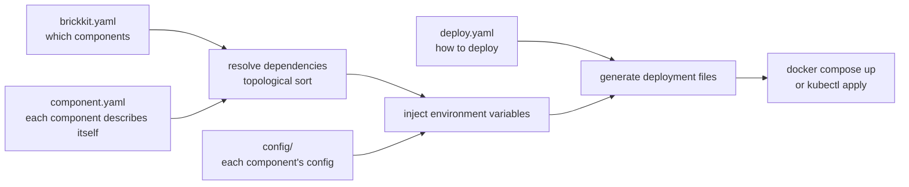

# What BrickKit is

## In one sentence

BrickKit is a **declarative component assembly platform**: you write down which components you want and what they
depend on, and everything else — start order, service addresses, environment variables, deployment files — is derived
by BrickKit and handed to Docker or Kubernetes to run.

"Declarative" means you describe **the result you want** ("I want `erp/backend` 1.0.0, and it has to reach a
database"), not **the steps that get you there** ("start the database, wait until it's healthy, put its address in this
variable, start the backend…"). The platform works out the steps.

## The core ideas

**1. Declare the components; the CLI derives the rest.** A component's own `component.yaml` says what it depends on,
which port it listens on and what configuration it needs. Your project declares only which components, at which
versions. The CLI puts the two together, works out the dependency tree, the start order and the environment variables
each component should get, generates `compose.yaml` or Kubernetes manifests, calls `docker compose` or `kubectl`, and
exits.

**2. The platform doesn't stay running.** No registry (service discovery is Docker's or Kubernetes' DNS), no config
server (configuration lives in files; change it and `up` again), no gateway (components call each other directly by
DNS), no daemon (the CLI exits when it's done). Each of those would buy some convenience, at the price of
infrastructure that has to be operated for as long as it exists, that fails, and that becomes a bottleneck — BrickKit
chooses not to have it.

**3. A component is a self-contained domain unit, and its boundary is a contract.** Each component is developed,
tested and released on its own, with its own versions. Other components depend only on its manifest
(`component.yaml`) and its published contract (OpenAPI, Protobuf and so on), never on its code. So the implementation
behind the contract can be rewritten wholesale, in another language, without changing a line anywhere else.

## The three layers

A BrickKit project is described by three layers of files, each owning one thing:

```text
my-shop/
├── brickkit.yaml        declaration: which components, at which exact versions (it is the lock file)
├── deploy.yaml          deployment: target (docker / podman / k8s), ports, modes, shell members
├── config/
│   ├── vars.yaml        values several components share
│   └── demo-hello.yaml  the environment variables each component gets
└── .brickkit/           the CLI's caches and generated files (not in Git)
```

From declaration to running containers, the pipeline looks like this:



Why three layers rather than one file: the three things change at different rates and belong to different people.
Component versions are decided by whoever assembles the system, and get reviewed; how things are deployed varies by
environment, often with temporary "only on my machine" changes (those go into `deploy.local.yaml`, which stays out of
Git); configuration holds secrets and has to be managed apart from the rest. One file holding all three ends up
edited by everyone and understood by no one. See [The three layers at a glance](../01-three-layers/01-overview.md).

## The fractal structure

**While you develop it**, a component is itself a complete BrickKit project — it can have its own three layers to
bring up its dependencies locally for integration work. **When another project uses it**, it's a black box: the
project reads only its `component.yaml` and `BRICKKIT.md`. The specification nests; the files don't. See
[The fractal structure](05-fractal-architecture.md).

## Friendly to AI

- **A component is small enough for an AI to read in one go.** It is one piece of the business, a few hundred to a few
  thousand lines, so there's no hunting for context in a giant monolith.
- **The boundary is a contract file, not a guess.** When an AI writes a caller, it reads the dependency's contract and
  `BRICKKIT.md`, not the dependency's implementation.
- **The easy-to-get-wrong parts are derived by the platform.** Service addresses, variable names and deployment files
  aren't invented by the AI; assembly mistakes surface at `brickkit up --dry-run`.
- **There is a clear reading path.** `AGENTS.md` at the repository root tells an AI which file holds which
  information, so it reads only what it needs.

See [For AI assistants](../08-ai-guide/README.md).

## In terms of tools you already know

| BrickKit | Roughly |
| --- | --- |
| BrickKit CLI | `npm` + `helm` + `docker compose` + `git clone`, but for **business components that run on their own** |
| Component | an npm package plus its Docker image |
| `component.yaml` | `package.json` |
| `brickkit.yaml` | `package-lock.json`: every component locked to an exact version |
| `deploy.yaml` | the "how it runs" half of a `compose.yaml` |
| `brickkit add` | `npm install` |
| `brickkit up` | `docker compose up -d` / `kubectl apply` |
| `brickkit release` | tagging a version in the component's repository and pushing it |

The difference: npm installs a code library; BrickKit installs **a service that runs on its own**, so it also handles
dependency resolution, address injection, database migrations and start order. A closer comparison is in
[Comparison](04-comparison.md).

Next: [Quick start](02-quick-start.md).
