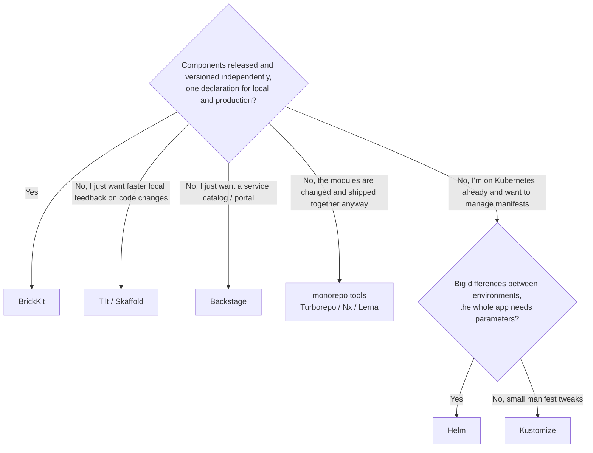

# Comparison

Most of these tools solve **neighbouring but different** problems. Each table below compares only the part that
genuinely overlaps; it doesn't hold up something BrickKit has to show another tool "lacks" it — often that tool never
meant to do that job. What BrickKit deliberately doesn't do, and why, is in
[Design principles and trade-offs](../06-architecture/05-design-principles.md).

For a rough first direction, this chart is a starting point; the details are in the sections after it:

## At a glance

Find a tool you know and follow its name to the detailed comparison.

| Tool | What it is | What it mainly solves | The key difference from BrickKit | When to pick it |
| --- | --- | --- | --- | --- |
| [1. Docker Compose](#1-vs-docker-compose) | Define and start a set of containers from one YAML file | Running a set of services on one machine | BrickKit manages components released and versioned independently: dependencies, addresses and start order are worked out for you, and `compose.yaml` is something it generates | Quick prototypes, purely local work, services with no "who depends on which version of whom" question |
| [2. Helm](#2-vs-helm) | Kubernetes' package manager: manifests packed into a Chart, installed with templates and values | Templating and parameterising Kubernetes manifests | BrickKit declares at the component level and isn't a template engine; the same declaration produces both Docker and Kubernetes deployments | Already on Kubernetes, templating a complex application, or the Chart ecosystem already has what you need |
| [3. Kustomize](#3-vs-kustomize) | Kubernetes' built-in manifest customisation: base manifests plus layers of overlays | Managing manifest differences between environments | BrickKit has one complete deploy file per environment, with no inheritance chain | Already on Kubernetes, small differences between environments, a team at home with overlays |
| [4. Tilt / Skaffold](#4-vs-tilt--skaffold) | Watch code changes, rebuild and redeploy automatically | Shortening the "change code → see the result" loop | BrickKit neither builds automatically nor hot-reloads; it manages a component's whole life from development to production | You need to see the effect of a one-line change immediately |
| [5. Backstage](#5-vs-backstage) | An open-source developer portal: service catalog, docs, plugins | Giving developers one place to start | BrickKit's dependencies drive start order and address injection directly, and it's a run-and-exit CLI rather than an application to operate | You need a team-wide service catalog and portal, and deployment is left to an existing CD setup |
| [6. monorepo tools](#6-vs-monorepo-tools) | Manage many modules in one repository, with caching to speed up builds | Building, caching and versioning many modules | BrickKit is about runtime deployment, not build pipelines; components depend on API contracts, not on code imports | Modules that are changed together often, share code and ship together |

---

## One by one

### 1. vs Docker Compose

**What it is:** Docker's own orchestration tool. In `compose.yaml` you list the containers you want, each with its
image, ports and environment variables, and `docker compose up` starts them together.

| Aspect | Docker Compose | BrickKit |
| --- | --- | --- |
| The problem | Orchestrating a set of containers from one YAML file | Managing a set of business components that are **released and versioned independently** |
| Where components come from | An image registry; an image carries no dependency or config spec | A Git repository, a local directory or a component market; every component carries a manifest and an API contract |
| Dependency order | `depends_on` is written by hand, and only covers the services in that one file | Each component's `dependencies` are expanded recursively into the whole tree, required and optional kept apart; the `depends_on` in the generated `compose.yaml` is computed |
| Address injection | Environment variables written by hand, kept consistent by you | `*_ENDPOINT` injected automatically, the variable name derived from the component ID |
| Database migrations | No such concept; you add a one-shot service yourself | The component declares `migration.command`; the platform generates a one-shot migration service, and the main service doesn't start if it fails |
| Versions side by side | You rename services yourself | The service name carries the exact version, so two versions are two names that don't clash |
| Kubernetes | None, short of a converter like Kompose, with limited results | Change `target: k8s` in `deploy.yaml` and the same declaration produces Kubernetes manifests |

- **Pick Compose:** quick prototypes, purely local development, no version dependencies between services.
- **Pick BrickKit:** components are released and upgraded on their own, you need dependency resolution across many
  components, and local and production must share one declaration.

---

### 2. vs Helm

**What it is:** often called Kubernetes' package manager. All of an application's Kubernetes manifests are packed into
a Chart (templates plus default values), and installing it fills in parameters from `values` files.

| Aspect | Helm | BrickKit |
| --- | --- | --- |
| The problem | Templating and parameterising Kubernetes manifests | Letting component code not know whether it runs on Docker or Kubernetes |
| Targets | Kubernetes only | Docker, Podman, Kubernetes, from one declaration |
| Several environments | One Chart plus a `values-<env>.yaml` per environment | One complete deploy file per environment (`deploy.prod.yaml`), chosen with `-f` |
| Dependencies | Sub-charts installed together, coarse-grained | Component-level dependencies, required vs. optional, topologically sorted |
| Service names | No "version in the service name" convention; running versions side by side is up to the Chart author | Service name = component ID + exact version, a fixed platform rule |
| Local debugging | Usually `kubectl port-forward` or an extra tool | `mode: debug` / `mode: local` (on Docker / Podman targets): the process runs on your machine, and the other containers still find it |

- **Pick Helm:** already on Kubernetes, templating a complex application, and the Chart ecosystem has what you need.
- **Pick BrickKit:** components evolve independently, local and production share one declaration, and running versions
  side by side can't rest on hand-made naming conventions.

---

### 3. vs Kustomize

**What it is:** Kubernetes' built-in manifest customisation tool (`kubectl apply -k`). No templates: you write base
manifests, then an overlay per environment, merged when applied.

| Aspect | Kustomize | BrickKit |
| --- | --- | --- |
| Config model | A base plus overlays, merged when applied | One complete, self-contained deploy file per environment, no inheritance chain |
| What you have to keep in your head | The inheritance and the merge rules; a `git diff` often doesn't show the value that actually takes effect | Opening one file shows the whole picture; the `git diff` is the actual change |
| Dependency resolution | None; it only assembles manifests | Expands the dependency tree recursively, required vs. optional, topological sort |

- **Pick Kustomize:** already on Kubernetes, small manifest differences, a team at home with overlays.
- **Pick BrickKit:** you find inheritance chains hard to reason about and want each environment's config readable as is.

---

### 4. vs Tilt / Skaffold

**What it is:** tools for developers. They watch your code and, on every change, rebuild the image and redeploy, making
"change code → see the result" very short.

| Aspect | Tilt / Skaffold | BrickKit |
| --- | --- | --- |
| The problem | Speeding up the local inner loop | Managing a component's whole life from development to production |
| Building | Automatic builds are the core feature | **Never builds automatically**: `brickkit build` is an explicit step, `up` only deploys |
| Local development | Hot reload | `mode: local` has BrickKit launch your process; with `mode: debug` you start it in your IDE and the platform makes sure the other components find it |
| Versions | No notion of a component version | Exact versions and versions side by side are built into the platform |

- **Pick Tilt / Skaffold:** you need to see a one-line change take effect immediately.
- **Pick BrickKit:** components are released independently and local must match production. The two work together:
  BrickKit assembles the system, and the component you're debugging runs under your favourite hot-reload tool.

---

### 5. vs Backstage

**What it is:** an open-source developer portal. Services are registered in a catalog (one `catalog-info.yaml` per
service), with documentation and plugins, so developers find everything in one place.

| Aspect | Backstage | BrickKit |
| --- | --- | --- |
| Dependencies | `dependsOn` can be declared for display; it doesn't drive deployment | Dependencies drive topological order, what runs, and address injection directly |
| Deployment | Doesn't deploy; connects to ArgoCD, Helm and the like | Generates Compose / Kubernetes manifests and calls the engine |
| Operating cost | An application to operate in its own right | One binary that runs and exits; no background service |
| Documentation | A docs site inside the portal | Every component carries a `BRICKKIT.md` (and its translations), cached into the project on `add`, matching exactly the version locked; the project's `AGENTS.md` ends with a table of every component, what it does and where its docs are |

- **Pick Backstage:** you need a team-wide service catalog and portal. The two don't conflict — a `catalog-info.yaml`
  can point at a BrickKit project.

---

### 6. vs monorepo tools

**What they are:** Turborepo, Nx and Lerna keep many modules in one repository and use caching and incremental builds
to rebuild only what changed.

| Aspect | monorepo tools | BrickKit |
| --- | --- | --- |
| What they care about | The build pipeline: how code is compiled, cached, tested | Runtime deployment: how services are assembled and find each other |
| Dependencies | **Build-time** dependencies: the code import graph | **Runtime** dependencies: API contracts, with addresses injected through environment variables |
| Versions | One global version, or per-package versions | An independent exact version per component; a version is a Git tag |
| Repositories | One repository | One repository per component — or several components in subdirectories of one repository, each tag carrying the component's name (`people-basic/1.0.0`), versions still independent |

- **Pick a monorepo tool:** modules are changed together often, share code and ship together.
- **Pick BrickKit:** components talk only through APIs and need their own release pace. They also work together: the
  monorepo tool handles builds, BrickKit handles assembly.

---

## Where BrickKit sits

**Declarative + derived + no control plane + fractal.** You declare components and their dependencies, and the platform
derives the deployment; it runs and leaves, with nothing resident; a component is a project while you develop it and a
black box when someone uses it. If you don't need some of these, the matching tool above is probably the better fit.
