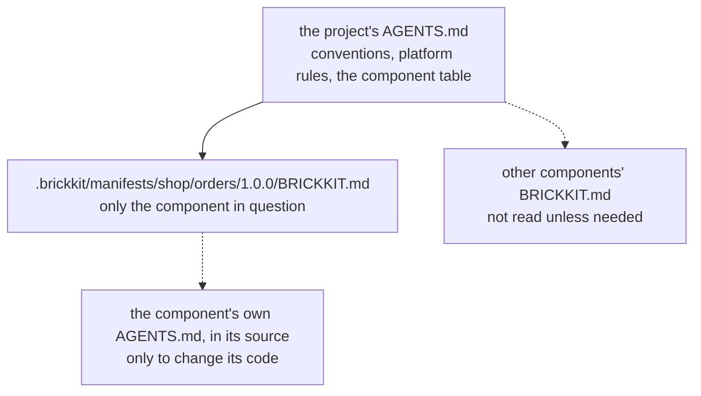

# The fractal structure

"Fractal" means the same shape repeating at different scales. BrickKit's specification works that way: a project is
made of components, and a component, in the hands of whoever is developing it, **is itself a complete project**.

## The idea

- **While you develop it (the project view):** a component's author can keep a set of three-layer files in the
  component's repository (`brickkit.yaml`, `deploy.yaml`, `config/`) to bring up the component's dependencies locally
  and integrate against them. The component repository is then an ordinary BrickKit project.
- **When someone uses it (the component view):** when another project runs `brickkit add` on the component, it reads
  only the component's `component.yaml` (the contract) and `BRICKKIT.md` (the documentation). The three layers in the
  component's repository, and whatever dependencies they pulled in for integration, **don't exist** for the user.
- **The spec nests, the files don't:** a user's project never embeds a component's project; only the specification
  nests — every level uses the same three layers, the same commands, the same documentation structure.

What this buys: the author integrates with the same tools the user assembles with, so there's nothing to learn twice;
and whatever the author adds locally for integration (a mock, a debug switch) can never leak to users. What it costs:
a component's dependencies can only be written in the `dependencies` of its `component.yaml` — extra components in the
author's workbench `brickkit.yaml` are invisible to users, as they should be.

## While you develop it: a workbench inside the component repository

Run `brickkit init` without a name at the component repository's root (completion mode: it adds what's missing and
leaves every existing byte alone). Below, `brickkit new` creates a component first, then its directory is completed:

```bash
brickkit new shop/orders --path orders
```

```text
✅ Component skeleton generated: shop/orders
   📄 orders/component.yaml
   📄 orders/BRICKKIT.md
   📄 orders/AGENTS.md
   📄 orders/CLAUDE.md
   📄 orders/README.md

Next steps:
  Fill in the TODOs in component.yaml and the docs (brickkit lint lists every one left)
  cd orders && brickkit init    give it a local workbench (completion mode: existing files are left alone)
  brickkit lint                 check component.yaml and the docs
```

```bash
cd orders
git init
brickkit init --yes
```

```text
This directory already has files; brickkit init will:
   ✅ create  brickkit.yaml
   ✅ create  deploy.yaml
   ✅ create  config/vars.yaml
   ✅ create  config/.gitkeep
   ✅ create  .gitignore
✅ Project completed: orders
   📁 .claude/skills/      AI assistant skills (5)
   🪝 .git/hooks/pre-commit Check the component layout before committing
   ✅ closing check passed: the project loads
```

A few things worth noticing:

- `init` in a component repository creates neither `components/` nor `shell/`, and declares neither local source —
  that's the directory convention of an assembling project, which a component repository has no use for.
- The component's own documents (`BRICKKIT.md`, `AGENTS.md`, `CLAUDE.md`, `README.md`) are kept byte for byte; only the
  block maintained by the CLI at the end of `AGENTS.md` is rewritten, and it now carries the workbench's component table
  as well as the component rules. A workbench has one `AGENTS.md`, not two.
- From here, `brickkit add` brings the component's dependencies into the workbench, and `brickkit up` brings the whole
  dependency tree up locally for integration. At this point `brickkit.yaml` is the author's **local workbench**;
  whether to commit it is the author's call.

When a project's local source holds several components and you want a workbench for each, use
`brickkit add --local --init`: it first gives every local component without a `brickkit.yaml` a workbench, then adds
them all to the project.

## When someone uses it: only the contract and the docs

When a user `add`s the component, the CLI takes just the contract and the docs from the component's Git tag and caches
them permanently under the project's `.brickkit/manifests/`:

```text
.brickkit/manifests/shop/orders/1.0.0/
├── component.yaml    the contract: dependencies, ports, config items, health check, image
├── BRICKKIT.md       the docs: how to use this component
└── BRICKKIT.zh.md    a translation, when the component carries one (BRICKKIT.<lang>.md)
```

The component's `AGENTS.md` and `README.md` stay in its repository: they are for whoever develops it and for people
browsing it on GitHub, not for the projects that use it.

The dependency tree is resolved only from the `dependencies` in `component.yaml`. The `brickkit.yaml`, `deploy.yaml`
and `config/` in the component's repository are never read. `.brickkit/` itself isn't committed: after cloning a
project, the first `add` or `up` fetches what's needed again — the way `node_modules` stays out of Git while
`package.json` goes in.

## A directory with both `component.yaml` and `brickkit.yaml`

That's exactly what a component repository with a workbench looks like. The CLI treats it like this:

| Command | Goes by |
| --- | --- |
| `up`, `add`, `status` and the other assembling commands | The **project**: they work on the local workbench |
| `lint` | Checks the three layers as a project, and this `component.yaml` too |
| `release` | Only **`component.yaml`**: the version and the checks come from it; `brickkit.yaml` is not read at all |

`release` going by `component.yaml` alone keeps a release clean: components the author added to the workbench for
integration never end up in the released version.

## Component documentation: `BRICKKIT.md`, `AGENTS.md`, `README.md`

A component repository carries three documents, each for a different reader, plus `CLAUDE.md` (one line, `@AGENTS.md`):

| File | Read by | Travels to the projects that use it |
| --- | --- | --- |
| `BRICKKIT.md` | The people and AIs using the component | Yes: cached next to `component.yaml`, so it is read alone, without the repository |
| `AGENTS.md` | The AI (and person) developing the component | No |
| `README.md` | People browsing the repository on GitHub; mostly links to the other two | No |

The `BRICKKIT.md` skeleton from `brickkit new` has six sections:

```markdown
# shop/orders

## Purpose

<!-- TODO: one or two sentences on the problem it solves, then two short lists: Owns, and Does not own (each saying who owns it instead) -->

## Before you deploy

<!-- TODO: what must exist before brickkit up — a database with its schema and role, an account, a certificate — who prepares each and how to check it; or "Nothing beyond the configuration below." -->

## Dependencies

<!-- TODO: each dependency by ID (no version), what it is used for; for an optional one, what happens when it is absent -->

## Configuration

| Variable | Required | Meaning |
|---|---|---|
| <!-- TODO: a key from configSchema --> | | <!-- TODO: what it means for the business, especially what the default cannot say --> |

## Contracts

<!-- TODO: every file under artifacts with the main interfaces it describes; events published; events consumed -->

## Shell declaration

Not a shell.
```

The documentation is fractal too, appearing at three levels:

| Level | File | Job | Written by |
| --- | --- | --- | --- |
| Definition (the platform) | `AGENTS.md` / `AGENTS.zh.md` at the root of the BrickKit repository | Sets the document structure and the AI's reading path | Maintained with the platform |
| Instance (the project) | `AGENTS.md` at the project root | The team's conventions, where to look and pitfalls; at its end, a summary of the platform rules and the table of the project's components, with where their docs and contracts are | The author writes the sections; the table is rewritten by `init`, `add`, `remove` and `upgrade` |
| Content (the component) | `BRICKKIT.md` and `AGENTS.md` at the component repository root | `BRICKKIT.md`: purpose, preparation, dependencies, what its config means, contracts; `AGENTS.md`: code map, build and test, design decisions | Skeletons from `new`, filled in by the author |

How to write them: [A component's documentation](../03-component-guide/08-component-doc-spec.md).

## How an AI reads a nested project



An AI reads the project's `AGENTS.md` first, then only the documentation of the component it needs, and opens a
component's own `AGENTS.md` only when it is about to change that component's code: no digging through component
source, no reading the three layers inside a component repository, only the context the current question calls for. See [Reading a fractal project](../08-ai-guide/05-fractal-reading.md).
