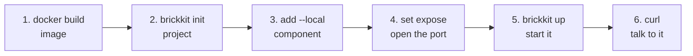

# Quick Start (5 minutes)

The shortest real path from an empty directory to an HTTP-reachable container, using this repository's own test fixture, [`demo/hello`](../../tests/components/demo-hello/). Every command and every output block below is real — nothing here is invented.

**Prerequisites:** the BrickKit CLI built (`make build-cli`, or an installed release), and Docker running.

Six steps, empty directory to something you can curl:



## 1. Build the fixture's image

`demo/hello` is this repository's own fixture and isn't published anywhere, so build it once from the repo root:

```bash
docker build -t brickkit-demo/hello:1.0.0 tests/components/demo-hello
```

In real use, a component's image already exists in a registry by the time you `brickkit add` it — a Manifest's `deployment.image` always points at something already built, never something the CLI builds for you. This step only exists because `demo/hello` isn't published anywhere.

## 2. Initialize a project

```bash
mkdir hello && cd hello
brickkit init hello
```

```
✅ Project initialized: hello
   📁 brickkit.yaml        Project config
   📁 components/          Component source (configured as the local install source local-dev)
   📁 .brickkit/           CLI working directory
   📁 .claude/skills/      AI assistant skills (4)
   📁 AGENTS.md            AI assistant project guide

Next steps:
  brickkit add --local               add every component under components/
  brickkit add people/basic@1.0.0    add a component from an install source
  brickkit up                        start everything in one go
```

`init` already wired `components/` up as a `local`-type install source — that's where the next step looks.

The `.claude/skills/` and `AGENTS.md` lines in that output are for AI assistants: `init` installs them by default so an AI knows, from the start, the platform rules that common sense gets wrong. They describe **this version of the CLI**, so after you upgrade the CLI, run `brickkit skills update` once in the project to refresh them — a file you've edited by hand is never overwritten, and `brickkit skills` on its own only looks, without changing anything. Don't want them? `brickkit init --no-skills` skips them.

## 3. Add the component

Copy the component's Manifest and artifacts into the local source, matching the `<scope>/<name>/component.yaml` layout a local source expects:

```bash
mkdir -p components/demo/hello
cp ../tests/components/demo-hello/component.yaml components/demo/hello/
cp ../tests/components/demo-hello/openapi.json components/demo/hello/
brickkit add --local
```

```
🔍 Found 1 component in local install source: local-dev
📦 Adding demo/hello@1.0.0
   ├── Manifest ✅
   └── artifacts ✅ (1 file)
✅ Written to brickkit.yaml (1 component)
```

`--local` doesn't take a component ID — its meaning is "add every component in this local source at once," not "add this one component in local debug mode." That distinction is the single easiest thing to get wrong here.

## 4. Turn on exposure

Not exposing anything by default is a deliberate security default (AGENTS.md §4), not a missing step. Open `brickkit.yaml` and add two fields to the `demo/hello` entry:

```yaml
components:
  - id: demo/hello
    version: 1.0.0
    expose: true
    exposePort: 8080
```

## 5. Start it

```bash
brickkit up
```

```
🚀 Starting project hello (deploy.target: docker)
📋 Component state calculation:
   ✅ demo/hello@1.0.0  starting (top-level)

📋 Start order (topological sort):
   1. demo-hello-1-0-0  no dependencies

Can start on their own: demo-hello-1-0-0 (no dependencies)
📄 Generated: .brickkit/generated/docker-compose.yaml

🔍 Checking image pull permissions... ✅ All passed

🐳 Starting (docker)...
   demo-hello-1-0-0             running (healthy)
✅ All components started (1)

💡 View the status: brickkit status
   View the logs: docker compose -p brickkit-hello logs -f
```

## 6. Talk to it

```bash
curl http://localhost:8080/api/v1/hello
```

```json
{"component":"demo/hello","greeting":"Hello","message":"Hello, I'm demo/hello@1.0.0","version":"1.0.0"}
```

**Done.** Your first component is running, reachable over plain HTTP — no CLI-internal channel involved.

## Tear it down

```bash
brickkit down
```

```
🛑 Stopping project hello
✅ All components stopped

💡 Data volumes were not deleted; database data is still there
   For a full cleanup, run by hand: docker volume rm <volume-name>
   Start again with: brickkit up
```

## Switch the CLI's language

Everything above was printed in English, the default. To read the CLI in Chinese instead:

```bash
brickkit lang set zh                # from now on, on this machine
BRICKKIT_LANG=zh brickkit status    # just this once
brickkit lang                       # which language is in effect, and why
```

`BRICKKIT_LANG` beats the saved setting, which beats the English default. Error codes, command names and flag names never change with the language. Details: [`brickkit lang`](06-architecture/09-cli-reference.md#brickkit-lang).

## Wire up your editor

Optional, and it takes a minute. `brickkit.yaml` and each component's `component.yaml` have a **JSON Schema**: a machine-readable description of every field — its type, whether it's required, which values it may take. An editor that understands YAML schemas turns that into help as you type:

- it completes field names and values;
- it underlines a key that doesn't exist — a misspelled `dependancies`;
- it flags a value of the wrong type, or outside a closed set (`deploy.target` may only be `docker` or `k8s`);
- it knows two rules people trip over: versions are exact (`^1.0.0` is flagged, in `metadata.version` and in `brickkit.yaml`'s `components[].version`), and `deployment.port` must be 1–65535.

The schemas are [`schemas/component.schema.json`](../../schemas/component.schema.json) and [`schemas/brickkit.schema.json`](../../schemas/brickkit.schema.json), generated from the same Go structs the CLI parses these files into, with a test in the repository keeping them in step. `brickkit lint` is the offline counterpart: it reports the same structural problems from the terminal.

There's one reason not to skip this. With no BrickKit schema attached, the YAML language server falls back to SchemaStore, a public catalog of schemas. As of yaml-language-server 1.24.0 and the SchemaStore catalog at the time of writing, that catalog maps the file name `component.yaml` to Kubeflow Pipelines' schema — both are third-party and can change, so what your editor shows later may differ. In our check, a perfectly valid BrickKit `component.yaml` came out underlined almost everywhere (`Property apiVersion is not allowed.`, `Missing property "implementation".`). Attaching the BrickKit schema, either way below, replaces whatever it would have guessed.

**Two ways to attach it.** The thing that reads a schema is the YAML language server (`yaml-language-server`); the Red Hat "YAML" extension for VS Code bundles it, and another editor that runs the same server works the same way.

1. **A comment on the first line of the file.** It travels with the file, so everyone who opens it gets the schema with nothing to configure:

   ```yaml
   # yaml-language-server: $schema=https://raw.githubusercontent.com/brickKit/brickKit/main/schemas/component.schema.json
   apiVersion: brickkit/v1
   kind: Component
   ```

   In `brickkit.yaml` the line names `brickkit.schema.json` instead. `brickkit init` and `brickkit new` don't write it; you add it once per file.

2. **A VS Code setting**, if you'd rather not touch the files — in `.vscode/settings.json` for one project, or in your user settings:

   ```json
   {
     "yaml.schemas": {
       "https://raw.githubusercontent.com/brickKit/brickKit/main/schemas/component.schema.json": "component.yaml",
       "https://raw.githubusercontent.com/brickKit/brickKit/main/schemas/brickkit.schema.json": "brickkit*.yaml"
     }
   }
   ```

   `component.yaml` matches that file name in any directory, so every component under `components/` is covered; `brickkit*.yaml` matches `brickkit.yaml` and environment files such as `brickkit.prod.yaml`.

The URL follows `main`, so the schema is as new as the repository. If your CLI is older, the editor may accept a field it doesn't know yet: `brickkit lint` is the authority on what the CLI you have accepts.

A section you leave empty is fine: `dependencies:` with every entry commented out reads as `null`, and both the CLI and the schema accept that. A required field can't be empty — `deployment.port:` with no value is flagged, and the CLI calls it missing too.

**What the schemas don't cover.** They describe one file's own fields: names, types, which are required, closed value sets, patterns, ranges. Two other kinds of rule are outside them on purpose:

- **Rules that need logic** — most combinations that can't be written together (`mode: debug` with `servedBy`, say), a `configSchema` key that collides with a reserved environment variable, a component directory whose name must match its `metadata.id` — are checked by `brickkit lint`. A few checks need the resolved dependency graph, which `lint` deliberately never builds (for a market/Git component that can mean a network call, and the whole point of `lint` is staying offline) — those are only caught when `up`/`up --dry-run` actually resolves it, such as a `servedBy` target that doesn't exist.
- **Rules that need another file, or the network** — whether the dependency graph resolves, whether a `servedBy` target exists — are checked by `brickkit up --dry-run`. `brickkit lint` doesn't do those either: it never resolves dependencies.

**Where an editor is stricter than the CLI.** Three places, all deliberate: the schema would rather underline something that is almost certainly a slip than stay silent, even where the CLI would accept it.

1. **`${VAR}` in a field with a closed set of values.** `brickkit.yaml` expands `${VAR}` from the environment *before* checking it, so `deploy.target: ${TARGET}` is accepted when `TARGET` is set. The schema checks the literal text `${TARGET}`, which is neither `docker` nor `k8s`, and underlines it. The same goes for `sources[].type` and `resources[].kind`: write the literal value there.
2. **YAML the CLI reads loosely.** An unquoted number in a string field (`project: 2024`, `password: 123456`) is quietly turned into text; `yes` or `on` where a true/false belongs (`expose: yes`) is read as true; a `null` item in a list (an empty `-` under `tags:`) or a `null` value in a map goes through; a fraction in an integer field (`port: 5432.5`) is cut to `5432`. The schema underlines all of these — they are nearly always a typo, or a value that should have been quoted.
3. **Extra keys inside a `configSchema` property.** Each property there understands a fixed set of keys (`type`, `default`, `description`, `enum`, `minimum`, …). The CLI's parser doesn't reject another one — a misspelled `defualt`, say, or `format`, which JSON Schema writers reach for — it ignores it, and `brickkit lint`, `brickkit publish` and `brickkit add --local` warn that it won't take effect. The schema underlines it: the same complaint, from the editor.

The schemas were checked against a real `yaml-language-server` (1.24.0): unknown-field underlines, closed values, patterns and ranges, completion of `deploy.target`, and both ways of attaching them above.

## Where to go next

- Want to understand what just happened? → [Core Concepts](01-concepts.md)
- Want the fuller walkthrough? → [Tutorial series](03-guide/README.md) (this Quick Start is the core path of [article 1](03-guide/01-first-project.md), which also covers dependencies, config changes, and K8s deployment)
- Want to look up a command? → [Command overview](06-architecture/09-cli-reference.md#all-the-commands-at-a-glance)
- Hit a problem? → [Troubleshooting](08-troubleshooting.md)
