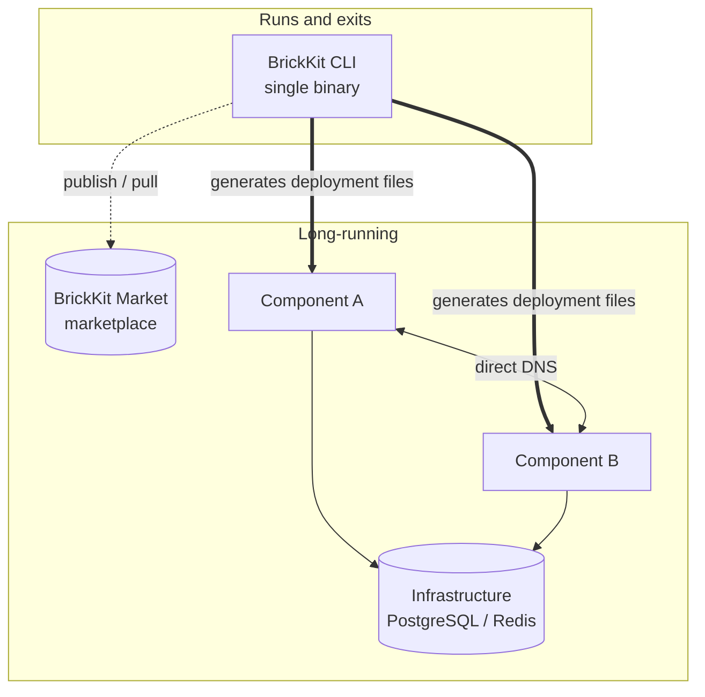
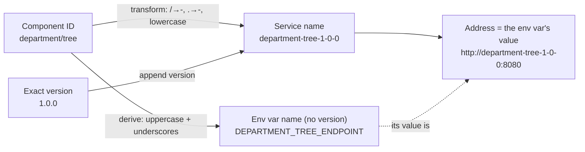

# Core Concepts

If all you want is BrickKit's skeleton in five minutes, so the docs and error messages stop throwing unfamiliar terms at you — this page is that. The full definitions live in [AGENTS.md](../../AGENTS.md)'s glossary, and the reasoning behind the twelve design principles is in [Design principles and trade-offs](06-architecture/01-design-principles.md); this is just a faster way in.

## Four parts

| Part | Form | Long-running? | Responsibility |
| --- | --- | --- | --- |
| **BrickKit CLI** | Local single binary | ❌ Runs and exits | Pulling, parsing, generating, invoking, publishing, source-workspace management |
| **BrickKit Market** | An independent online service (you can host your own) | ✅ | Component publishing/discovery, versions/visibility/signing, artifact storage |
| **Component layer** | Docker containers / K8s Pods | ✅ | The business logic itself, components call each other over DNS directly |
| **Infrastructure layer** | PostgreSQL / Redis, etc. | ✅ | Deployed manually by ops, declared and bound in `brickkit.yaml` |

The diagram deliberately draws the CLI with a dashed line, boxed off in its own "runs and exits" corner — there's no fifth part, no resident "main system." `brickkit up` runs and exits; what's actually running afterward is just your component containers and infrastructure.

"You can host your own" in the Market row is the operative part: BrickKit doesn't operate a public instance today. A project reaches one by self-hosting it, or by pointing at one someone else already runs (AGENTS.md §5.9).

## Key terms

| Term | Definition |
| --- | --- |
| Component | The most basic install-and-run unit: a business program that runs on its own, **always packaged as a container (a Docker image)** — frontends included |
| Manifest (`component.yaml`) | A component's introduction of itself: what it depends on, which port it listens on, which settings it has, and how to check that it's healthy |
| Project config (`brickkit.yaml`) | Your project's order form: which components you want, which are enabled, whether to expose them, how config is overridden, where the databases and other resources are, and where to deploy |
| Required Dependency | The component can't work without it; missing → the CLI **errors and blocks startup** |
| Optional Dependency | Nice to have, but the component can get by without it (`optional: true`); missing → only a warning, and **the env var is not injected at all** (not injected as an empty string) |
| Versioned Service Name | A service name carrying an exact version, e.g. `people-basic-1-0-0`: two versions are two different names and can run side by side |
| Local Debug Mode | `mode: debug`: one component runs on your own machine (in an IDE with breakpoints, say) while the other components in containers can still find it |
| Local Managed Mode | `mode: local`: BrickKit itself detects how to start the component, runs it as a bare process on your own machine, and supervises it — hands-off, no IDE needed |
| Source | Where a component comes from: the marketplace (HTTP) / a Git repo / a local directory |
| Resource | External systems a component depends on (databases, Redis, etc.): deployed by ops, declared and bound in `brickkit.yaml` |
| Env Injection | When generating deployment files, the CLI writes dependency addresses, resource connections and the component's own config into environment variables and hands them to the component |
| Deploy Target | `docker` or `k8s`: decides which kind of deployment file the CLI generates (Docker Compose or Kubernetes manifests) |
| servedBy | Used when several components are merged into one process to save memory: a merged component gets no container of its own and is hosted by a "shell" component instead |

## The one rule that runs through everything: service names, and why the env var name never carries a version

**Service name = transformed component ID + exact version.** Transform rule: `/` → `-`, `.` → `-`, all lowercase. **The environment variable name is derived from the component ID alone and never carries a version; only its value points at a specific one.** Split apart those read as two rules — put together, they're the same design:

| Component ID | Version | Service name |
| --- | --- | --- |
| `people/basic` | 1.0.0 | `people-basic-1-0-0` |
| `erp/backend` | 2.1.3 | `erp-backend-2-1-3` |

The address format is **exactly the same** locally (Docker) and in production (K8s): `http://<versioned-service-name>:<port>`. This one rule alone explains two things: multiple versions coexist for free (two versions are just two non-conflicting DNS names), and a caller always knows exactly which version it's talking to — no implicit upgrades.

And the variable *name* carrying no version is exactly what that right-hand derivation path in the diagram gives you — `DEPARTMENT_TREE_ENDPOINT` is derived purely from `department/tree`, independent of which version it happens to be pointing at. This is also why a single component ID can only appear once within one `component.yaml`'s `dependencies` — two versions would collide on the same variable name, with the latter silently overwriting the former, so the CLI rejects this outright while parsing the Manifest. Version coexistence is therefore a **project-level** capability (`brickkit.yaml` can list two version entries side by side for different callers), not a component-level one.

## `mode`: top-down inheritance

| Value | Meaning | Behavior |
| --- | --- | --- |
| **not written** | Follows the top | A top-level component (nothing depends on it) runs by default; a lower one follows whatever's above it |
| `mode: enabled` | Always runs | Ignores what's above it. If its required dependencies are turned off, it errors (two conflicting intents) |
| `mode: disable` | Never runs | Whatever depends on it stops too |
| `mode: debug` | Always runs, as a process you start yourself | Pinned exactly like `mode: enabled`, but no container is generated: you run it on your own machine, in an IDE (Docker only — [Article 3](03-guide/03-local-debugging.md)) |
| `mode: local` | Always runs, as a process BrickKit starts and supervises itself | Pinned exactly like `mode: enabled`, but no container is generated: BrickKit detects the start command, launches it, and supervises it — no IDE needed (Docker only — [Article 4](03-guide/04-local-execution.md)) |

A lower-level component shared by multiple upstream components keeps running as long as at least one of them still needs it — it's never accidentally taken down. This is also why `brickkit add` never writes a `mode` field on its own: leaving it unwritten already means "follow the top."

## Read further

- [Architecture overview](06-architecture/00-overview.md)
- [Design principles and trade-offs](06-architecture/01-design-principles.md)
- [Dependency resolution](06-architecture/02-dependency-resolution.md)
- [Deployment generation](06-architecture/03-deployment-generation.md)
- [AGENTS.md](../../AGENTS.md) — the full glossary, twelve design principles, and twenty-three "why" justifications
