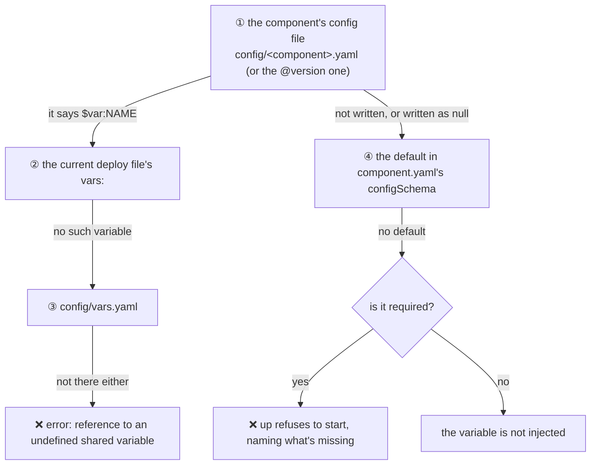

# Where a value comes from

Which value does one config item of one component finally get? There is a single chain, read from the top; the first
level that "gives a value" wins:



## Level by level

**① The component's config file.** The default version uses `config/<component>.yaml`; a version kept for a dependency
uses `config/<component>@<version>.yaml` (see [The config/ directory](05-config-directory.md)). The value you write is
the value the component gets.

**② ③ If what's written is `$var:NAME`**, the shared variable is looked up: first in the **current deploy file**'s
`vars:`, then in `config/vars.yaml`. Neither has it — an error. A deploy file's `vars:` **only affects `$var:` lookups**:
it never overrides a value you wrote directly in a component's config.

**④ Not written (or written as `null` / `~`)**: the default declared in the component's `configSchema` is used.

**Nothing at all**: an optional item isn't injected — the component sees "no such environment variable", not an empty
string, and takes its own "not configured" path; a required item makes `up` stop and name what's missing.

## Which deploy file is "current"

| Situation | Read |
| --- | --- |
| The command was given `-f deploy.prod.yaml` | That one |
| Local mode is on (and no `--no-local`) | `deploy.local.yaml` |
| Otherwise | `deploy.yaml` |

So the same `config/`, paired with different deploy files, can resolve `$var:` to different values — that is how
several environments work.

## Examples

In `demo/hello`'s `configSchema`, `GREETING` defaults to `Hello`.

| You write | The component gets |
| --- | --- |
| Nothing (the skeleton line stays commented) | `GREETING=Hello` (④ the default) |
| `GREETING: Howdy` | `GREETING=Howdy` (①) |
| `GREETING: $var:GREETING_TEXT`, with `GREETING_TEXT: Howdy` in `config/vars.yaml` | `GREETING=Howdy` (③) |
| The same, while the current deploy file says `vars: {GREETING_TEXT: Bonjour}` | `GREETING=Bonjour` (②) |
| `GREETING: ""` | `GREETING=` (an empty string on an optional item is a deliberate value, and is injected) |

The last row deserves a word: an empty string on an **optional** item means "I want an empty string"; an empty string
left on a **required** item (the `""` the skeleton leaves) means "not filled in yet", and counts as missing.

## The same key twice at one level

A key appearing twice in one file isn't "the later one wins" — it **fails loudly**:

```text
❌ Error: unresolved configuration conflicts
   File: config/demo-hello.yaml
   Config item: GREETING
   Line 1: hi
   Line 2: hello
   Suggestions:
   1. Keep the line you want, delete the other one, then run the command again
   2. Do not run yq or your editor's Format Document on this file: they silently drop one of the duplicate keys, and the conflict disappears without being resolved
   💡 Your editor may mark this file as invalid YAML. That is expected: BrickKit wrote the duplicate key on purpose so the conflict cannot be missed
```

When `upgrade` migrates config and meets a key "you changed and the component's author also changed the default of",
it writes exactly two such lines on purpose, to make you decide; see
[Upgrading and config migration](../02-project-guide/06-upgrade-and-migration.md).

## What isn't part of this chain

- **Process environment variables**: they take part only where you explicitly wrote `${VAR}`, and never quietly
  override anything (see [Secrets](07-sensitive-values.md)).
- **Variables the platform injects itself**: `COMPONENT_ID`, `COMPONENT_VERSION`, dependencies' `*_ENDPOINT` and so on
  are the platform's call; when a config item has the same name, the platform's value wins and you get a warning. The
  full dictionary of variables is the [environment-variable contract](../06-architecture/03-env-injection-contract.md).
- **Keys that aren't in `configSchema`**: not injected, with a warning that they have no effect.
