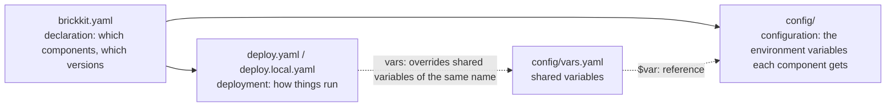

# The three layers

A BrickKit project is described by three layers of files. This module explains what each layer owns, what you can
write in it, and in what order values are taken.

| Page | What you get from it |
| --- | --- |
| [01 At a glance](01-overview.md) | The directory layout, which file each kind of information belongs in, what goes into Git |
| [02 brickkit.yaml](02-brickkit-yaml.md) | Declaring components, exact versions, install sources, how `add` picks a version |
| [03 deploy.yaml](03-deploy-yaml.md) | The deploy target, `mode`, exposing ports, shell members, Kubernetes settings, `vars:` |
| [04 deploy.local.yaml](04-deploy-local-yaml.md) | The personal deploy file: whole-file replacement, strict consistency, `brickkit local` |
| [05 The config/ directory](05-config-directory.md) | How config files are named, their skeletons, the archive |
| [06 Shared variables and $var:](06-vars-and-var-ref.md) | The one way for several components to share a value |
| [07 Secrets](07-sensitive-values.md) | `${VAR}`, `file://`, `existingSecret`, and where each ends up on Docker and on Kubernetes |
| [08 Where a value comes from](08-resolution-priority.md) | Which value a config item finally takes |
| [09 Quick field reference](09-field-reference.md) | The fields of the three files at a glance, and common mistakes |

**Reading order:** 01 first; then 02, 03 or 05 depending on the file in front of you; 04 for local debugging; 07 when
secrets come up. Each field's full specification (types, validation rules) is in the [Reference](../11-reference/README.md).
