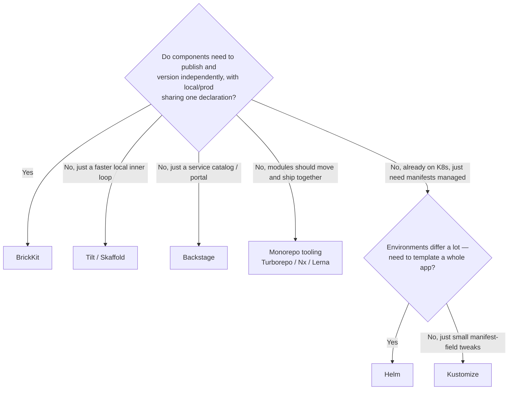

# BrickKit vs. existing tools

Most of these tools solve **adjacent, not identical** problems. Each table below tries to compare only the parts that actually overlap, rather than scoring BrickKit against something a tool was never trying to do. For what BrickKit itself deliberately doesn't do, and why, see [What it deliberately doesn't do](../../README.md#what-it-deliberately-doesnt-do) in the README, or the [architecture docs](06-architecture/00-overview.md). This page compares tools; for the *ideas* behind them — DDD, GitOps, twelve-factor and the rest — what each one is, what it costs, and how BrickKit treats it, see [Design principles and trade-offs](06-architecture/01-design-principles.md#meet-the-ideas).

If you just want a rough starting point, this gives one — the actual detail is still in the tables below:

## Overview

**How to read this:** start with the overview table and find the tool you already know; click its name in the first column to jump to the numbered comparison.

| Tool | What it is | What it mainly solves | The key difference from BrickKit | When to pick it |
| --- | --- | --- | --- | --- |
| [1. Docker Compose](#1-vs-docker-compose) | Defines and starts a set of containers from one YAML file | Getting a group of services running on one machine | BrickKit manages the whole lifecycle of independently published, independently versioned components; dependencies, addresses and start order are computed for you | Quick prototypes, purely local development, or services with no "who depends on which version of what" problem |
| [2. Helm](#2-vs-helm) | The "package manager" for Kubernetes: bundles manifests into a Chart, installed with templates and parameters | Templating and parameterizing Kubernetes manifests | One BrickKit declaration generates both Docker and Kubernetes deployments, and component code never knows where it runs | You're already on K8s, need to template a complex app, or the Chart ecosystem already has what you need |
| [3. Kustomize](#3-vs-kustomize) | Kubernetes' own manifest customizer: one base plus layers of "overlays", no templates | Managing manifest differences between environments | BrickKit gives each environment one complete, self-contained file — no inheritance chain | You're already on K8s, environments differ little, and your team is fluent in overlays |
| [4. Tilt / Skaffold](#4-vs-tilt--skaffold) | Dev tools that watch your code and automatically rebuild and redeploy | Speeding up the local "edit code → see it run" loop | BrickKit manages a component's whole lifecycle from development to production, with one declaration for local and production | You need a one-line change to show up immediately |
| [5. Backstage](#5-vs-backstage) | An open-source developer portal: a service catalog, docs and plugins behind one door | Giving developers one place to go | In BrickKit, dependencies directly drive start order and address injection rather than just being displayed — and it's a run-and-exit CLI, not another app to operate | You need a team-wide service catalog and portal, with deployment left to your existing CD |
| [6. Monorepo tooling](#6-vs-monorepo-tooling) | Tools that manage many modules in one repository and speed up builds with caching | Building, caching and versioning many modules together | Every BrickKit component has its own repository, version and permissions; it depends on runtime API contracts, not build-time code imports | Modules change together often, share code, and usually release together |

---

## One by one

### 1. vs. Docker Compose

**What it is:** Docker Compose is Docker's own orchestration tool: in one `docker-compose.yaml` you write down which containers you want, which images they use and what ports and environment variables they get, and `docker compose up` starts them all together.

| Dimension | Docker Compose | BrickKit |
| --- | --- | --- |
| Problem solved | Orchestrating a set of containers from one YAML file | Managing the full lifecycle of independently published, independently versioned business components |
| Component source | An image registry, with no metadata convention | The component marketplace (Manifest + API contract + signature — discoverable and verifiable) |
| Startup ordering | Has `depends_on` + `condition: service_healthy`, but you write it by hand, scoped to the services already in this one file | Recursively expands each component's `dependencies` into the whole tree, distinguishes required/optional, and computes `depends_on` automatically (the generated compose file uses `depends_on` too — you just never write it, and it isn't limited to one level) |
| Address injection | Manual environment variables — consistency is on you | Versioned addresses generated and injected automatically; variable names are derived from the component ID, so they can't drift |
| Database migrations | No native concept — you add a one-shot service yourself | A component declares `migration.command`; the CLI runs it as a one-shot service and blocks the main service on failure |
| Multi-version coexistence | You have to invent your own service-naming scheme | Built in — the service name itself carries the exact version, so two versions are just two non-conflicting names |
| Kubernetes support | None; third-party converters (e.g. Kompose) exist but are limited | Change one field (`deploy.target`) and the same declaration generates Kubernetes manifests |

- **Use Compose when:** rapid prototyping, purely local development, or your services don't have a "who depends on which version of what" problem yet.
- **Use BrickKit when:** components get published and upgraded independently, you need multi-component dependency resolution, or the same declaration needs to cover local and production.

---

### 2. vs. Helm

**What it is:** Helm is often called the "package manager" for Kubernetes: it bundles all of an app's Kubernetes manifests into one Chart (with templates and defaults), you fill in parameters with a `values` file, and `helm install` puts the whole thing into the cluster.

| Dimension | Helm | BrickKit |
| --- | --- | --- |
| Problem solved | Templating and parameterizing Kubernetes manifests | Letting component code stay completely unaware of whether it's running under Docker or Kubernetes |
| Target platform | Kubernetes only | Both Docker and Kubernetes, from the same declaration |
| Component source | A Chart repository (OCI or a traditional index) | The component marketplace (Manifest, API contract, signature) |
| Multi-environment config | One Chart, several `values-<env>.yaml` files — the differences are yours to maintain | One declaration; switching platforms is changing the single `deploy.target` field |
| Dependency resolution | Chart dependencies pull in sub-charts together — coarser-grained | Component-level dependencies, required vs. optional, automatic topological sort |
| Service naming | K8s Services already get DNS, but there's no built-in convention for encoding a version into the name — coexisting versions means each chart author inventing their own scheme | Service name = component ID + exact version, a fixed platform-wide rule, not something each chart reinvents |
| Local debugging | Typically `kubectl port-forward` or a separate tool (e.g. Telepresence) | `mode: debug` + `extra_hosts` (Docker target only — under K8s there's no equivalent need for this, see the deployment-selection guide) |

- **Use Helm when:** you're already on K8s, need to template a genuinely complex app, or the Helm chart ecosystem already has what you need.
- **Use BrickKit when:** components need to evolve independently, local and production need the same declaration, or multi-version coexistence shouldn't depend on a hand-rolled naming convention.

---

### 3. vs. Kustomize

**What it is:** Kustomize is Kubernetes' own manifest customizer (`kubectl apply -k`): instead of templates, you write one base manifest and then a layer of "overlay" per environment, and the two are merged into the final manifest at apply time.

| Dimension | Kustomize | BrickKit |
| --- | --- | --- |
| Problem solved | Managing per-environment manifest differences with base + overlay | Making every environment's config complete, self-contained, and what-you-see-is-what-you-get |
| Config model | A base layer plus overlays, merged at apply time | One complete `brickkit.yaml` per environment, no inheritance chain |
| Mental overhead | You have to reason about the inheritance chain and field-merge rules; `git diff` often doesn't show what actually takes effect | Open one file and see everything; `git diff` maps directly to the real change |
| Component source | Not a concept it has — it's purely a manifest-layering tool | The component marketplace (Manifest, API contract, signature) |
| Dependency resolution | None — it only concerns itself with how manifests combine | Recursively expands the dependency tree, required vs. optional, topological sort |

- **Use Kustomize when:** you're already on K8s, environment differences are small, and your team is already fluent in the overlay mental model.
- **Use BrickKit when:** the overlay inheritance chain is hard to reason about and you want every environment's config to be directly readable.

---

### 4. vs. Tilt / Skaffold

**What it is:** Tilt and Skaffold are two developer-facing tools: they watch your code and, on every change, rebuild the image and redeploy it to a (usually local) Kubernetes cluster, keeping the "edit code → see it run" loop very short.

| Dimension | Tilt / Skaffold | BrickKit |
| --- | --- | --- |
| Problem solved | Speeding up the local dev inner loop (edit code → auto-build → auto-deploy) | Managing a business component's full lifecycle from development to production |
| Component source | Local source code, built by the current project | The component marketplace — published and versioned independently |
| Startup ordering | Can be hand-written (e.g. Tilt's `resource_deps`), but you maintain it yourself and it doesn't cross project boundaries | Automatically expanded from the Manifest — nothing to hand-write |
| Primary use case | The local development inner loop | The same declaration for local and production |
| Version management | No "component version" concept — build artifacts are tagged per dev iteration | Exact versions with multi-version coexistence as a platform-native capability |

- **Use Tilt/Skaffold when:** you need a fast local inner loop where a one-line code change shows up immediately.
- **Use BrickKit when:** components need to evolve and publish independently, and local behavior needs to actually match production.

---

### 5. vs. Backstage

**What it is:** Backstage is an open-source developer portal (an IDP, an Internal Developer Portal): every service in the company is registered in one catalog (one `catalog-info.yaml` per service), with docs and plugins alongside, so developers find everything in one place.

| Dimension | Backstage | BrickKit |
| --- | --- | --- |
| Problem solved | Giving developers one place to go — a service catalog, docs, a plugin ecosystem | Letting components evolve independently, with automatic dependency resolution and deployment-file generation |
| Component source | The service catalog (`catalog-info.yaml`, descriptive metadata) | The component marketplace (Manifest + API contract + signature — executable and installable) |
| Dependency relationships | The catalog can declare `dependsOn` for display and visualization, but doesn't use it to drive actual deployment ordering or address injection | Dependencies directly drive topological sort, the enabled cascade, and environment-variable injection — not just a display |
| Deployment | Doesn't deploy anything itself — wired up to a CD tool like ArgoCD or Helm | Natively generates Docker Compose / Kubernetes manifests and calls the underlying engine |
| Operational weight | Heavy — Backstage itself is an application you run and maintain (typically Node.js + Postgres) | Light — the CLI is a single binary that runs and exits, no resident service of its own |

- **Use Backstage when:** you need a team-wide service catalog, a developer portal, and a plugin ecosystem, with deployment handled by your existing CD stack.
- **Use BrickKit when:** what you need is dependency resolution and deployment generation actually happening, not a display layer. The two aren't mutually exclusive — a `catalog-info.yaml` entry can point at a BrickKit project just fine.

---

### 6. vs. monorepo tooling

**What it is:** Turborepo, Nx and Lerna are monorepo tools: they keep many modules in a single Git repository and use caching and incremental builds so that only what actually changed gets rebuilt.

| Dimension | Monorepo tooling | BrickKit |
| --- | --- | --- |
| Problem solved | Managing multiple modules in one repository and speeding up build caching | Letting components publish, version, and deploy independently |
| Component source | Different directories in the same repository | Independent Git repositories |
| Version management | Supports global or independent versioning (e.g. Lerna's independent mode), but the history all lives in one repo | Every component has its own version, its own repo, its own Git history |
| Dependency resolution | **Build-time** — a code-level import graph that caching and incremental builds are based on | **Runtime** — an API-level contract, addresses injected via environment variables, not a code import |
| Publishing permissions | Usually one shared permission model for the whole repo | Every component has its own repo, its own visibility, its own signature |

- **Use a monorepo when:** modules need frequent coordinated changes, shared code, and usually publish together.
- **Use BrickKit when:** components only talk over an API, need independent release cadences and permission boundaries, and a change to A shouldn't force you to touch B's build.
