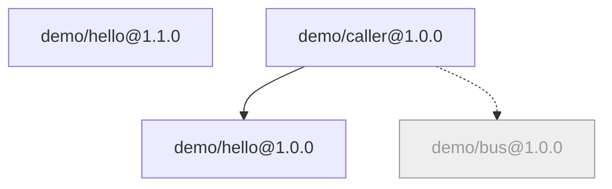

# Status and topology

Three read-only commands, each answering one question: what's running now (`status`), who depends on whom (`deps`), and
what the whole graph looks like (`graph`).

## `brickkit status`

The CLI stores no running state — there's no background process keeping it. `status` asks the engine directly every time
(`docker compose ps`, or `kubectl get deployments`):

```text
📊 Project status: my-shop (target: docker)

✅ Running (3 components)
 ┌─────────────┬─────────┬───────────────────┬───────────────────────────────────────────────┐
 │ Component   │ Version │ Status            │ Port                                          │
 ├─────────────┼─────────┼───────────────────┼───────────────────────────────────────────────┤
 │ demo/hello  │ 1.0.0   │ running (healthy) │ 8080/tcp                                      │
 │ demo/caller │ 1.0.0   │ running (healthy) │ 0.0.0.0:18080->8080/tcp, [::]:18080->8080/tcp │
 │ demo/hello  │ 1.1.0   │ running (healthy) │ 8080/tcp                                      │
 └─────────────┴─────────┴───────────────────┴───────────────────────────────────────────────┘

⬜ Not started (1 component)
 ┌───────────┬─────────┬─────────────────────────────────────┐
 │ Component │ Version │ Reason                              │
 ├───────────┼─────────┼─────────────────────────────────────┤
 │ demo/bus  │ 1.0.0   │ disabled explicitly (mode: disable) │
 └───────────┴─────────┴─────────────────────────────────────┘
```

- Two versions of the same component get a row each (`demo/hello` 1.0.0 and 1.1.0 here).
- Components not started this time are listed too, with the reason; a reason that comes from `deploy.local.yaml` is
  marked as such.
- In the Port column, `0.0.0.0:18080->8080` means it's open on the host; a bare `8080/tcp` is reachable only on the
  container network.
- `mode: debug` components get a table of their own (see [Local debugging](03-local-debug-workflow.md)). `mode: local`
  components are processes watched by `up` in another terminal, so they aren't in the table; when such a session is
  running, it says which process.

After `down`, the components that should run are listed as not running, with a pointer to the logs (the disabled `demo/bus` stays in the "not started" table):

```text
❌ Not running (3 components)
 ┌─────────────┬─────────┬─────────────┐
 │ Component   │ Version │ Status      │
 ├─────────────┼─────────┼─────────────┤
 │ demo/hello  │ 1.0.0   │ not created │
 │ demo/caller │ 1.0.0   │ not created │
 │ demo/hello  │ 1.1.0   │ not created │
 └─────────────┴─────────┴─────────────┘
   View the logs to find out why: docker compose -p brickkit-my-shop logs <service-name>

📋 No components are running (perhaps brickkit down was already run)
   Start again with: brickkit up
```

## `brickkit deps`

`brickkit.yaml` only locks versions; it doesn't say who depends on whom — each component declares its own dependencies in
its `component.yaml`, and copying them into the project file would only let the two drift apart. `deps` reads them and
prints a tree:

```bash
brickkit deps
```

```text
demo/hello@1.1.0

demo/caller@1.0.0
├── demo/hello@1.0.0
└── demo/bus@1.0.0 (optional)
```

One tree per top-level component (nothing in the project depends on it). Within one output a component version is
expanded only once; later appearances are marked "(shown above)"; an optional dependency missing from the project is marked
"(optional, not installed)".

For one component: a tree per version, plus who depends on it:

```bash
brickkit deps demo/hello
```

```text
demo/hello@1.0.0

Required by: demo/caller@1.0.0

demo/hello@1.1.0

Required by: nothing (top-level)
```

`brickkit deps demo/hello@1.0.0` shows only that version.

**Events.** Events sent through a messaging system are not dependencies, and the trees don't have them. When components
list what they publish and subscribe to under
[`events`](../03-component-guide/02-component-yaml-reference.md#events-what-i-publish-and-subscribe-to) in
`component.yaml`, `deps <id>` adds who is on the other end:

```text
erp/finance@1.0.0

Required by: nothing (top-level)

Publishes:
  erp.finance.invoice.issued.v1 → (no subscriber in this project)

Subscribes to:
  crm.opportunity.won.v1 ← crm/opportunity@1.0.0
  mdm.customer.* ← (no publisher in this project)
```

`deps` with no argument lists every event in the project after the trees, sorted by name — the place to look, before
changing an event, for who is affected:

```text
Events (publisher → subscriber):
  crm.opportunity.won.v1: crm/opportunity@1.0.0 → erp/finance@1.0.0, infra/audit@1.0.0
  erp.finance.invoice.issued.v1: erp/finance@1.0.0 → (no subscriber in this project)
  mdm.customer.*: (no publisher in this project) → erp/finance@1.0.0
```

## `brickkit graph`

The same dependency graph, drawn as Mermaid:

```bash
brickkit graph
```

```text
graph TD
    demo_hello_1_1_0["demo/hello@1.1.0"]
    demo_bus_1_0_0["demo/bus@1.0.0"]
    demo_hello_1_0_0["demo/hello@1.0.0"]
    demo_caller_1_0_0["demo/caller@1.0.0"]
    demo_caller_1_0_0 --> demo_hello_1_0_0
    demo_caller_1_0_0 -.-> demo_bus_1_0_0
    classDef disabled fill:#eee,stroke:#999,color:#999;
    class demo_bus_1_0_0 disabled
```

Rendered, it looks like this:



| In the diagram | Means |
| --- | --- |
| Solid line | Required dependency |
| Dashed line | Optional dependency; one missing from the project is drawn as a "not installed" node |
| Dashed line labelled `$endpoint` | The config refers to its address with `$endpoint:` (filled in by the project, not a dependency the component declared; no start order) |
| Dashed line labelled with event names | From a publisher to a subscriber: the subscriber receives events it publishes (`events` in `component.yaml`). The label is the subscriptions, three at most, then a count; it is not a dependency, and it points the way the events travel |
| Greyed out | Won't start this time (here `demo/bus` is turned off with `mode: disable`) |
| Group box | Members a shell hosts are drawn inside the shell's box; `--ignore-shells` shows each component on its own |
| Special label | `mode: local` components are marked "managed locally" |

Edges are always drawn, whether or not the other end runs this time: the diagram shows the declared structure, and
"does it run" is expressed by the node's style.

**Save it as a file.** Stdout carries nothing but Mermaid, so:

```bash
brickkit graph > graph.mmd
```

GitHub renders a `.mmd` file directly; in Markdown, put it in a `mermaid` code fence. Warnings from dependency resolution
go to stderr and never end up in the file.

**It never reads local mode.** `graph` reads `deploy.yaml` (or the file named with `-f`), never `deploy.local.yaml` — the
diagram can be committed and shared, and doesn't depend on who generated it.

`deps` and `graph` both need the complete dependency graph: components not yet cached have their `component.yaml`
fetched from the install sources, so they may go to the network.
