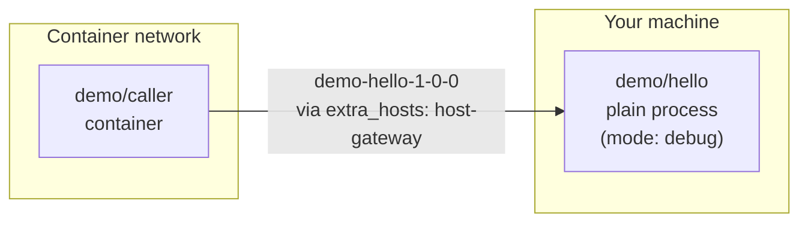

# 3. Debug a Component Locally

Set a breakpoint in a debugger, and the process it's attached to has to run on your own machine, not inside a container — but everything that component talks to should keep running exactly as it would in a normal deployment, and everything that depends on it should keep working without knowing anything changed. `mode: debug` is the field that makes this possible (AGENTS.md §5.6). This article proves the whole loop for real: `demo/hello` runs as a plain OS process on the host while `demo/caller` — configured as if it were going to run in a container — resolves and reaches it anyway.

## The setup, one field different from Article 2

Same two components as [Article 2](02-what-runs.md), with one addition to `demo/hello`'s entry in `brickkit.yaml`:

```yaml
components:
  - id: demo/hello
    version: 1.0.0
    mode: debug
    localPort: 8080
  - id: demo/caller
    version: 1.0.0
```

```bash
brickkit up --dry-run
```

```
📋 Component state calculation:
   ✅ demo/hello@1.0.0   starting (mode: debug)
   ✅ demo/caller@1.0.0  starting (top-level)
...
🔧 Local debugging (mode: debug):
   demo/hello@1.0.0
      No container is generated; start it in your IDE, listening on localhost:8080
      Environment variables: .brickkit/generated/local-debug.demo-hello-1-0-0.env
      VS Code: set "envFile": "${workspaceFolder}/.brickkit/generated/local-debug.demo-hello-1-0-0.env" in launch.json
```

`demo/hello` still shows up in the status calculation, still shows up in the dependency graph, still gets a real address computed for it — nothing about how it participates in the project changed. What changed is *where its code actually runs*.

One line of that output is different from Article 2: the reason next to `demo/hello` now reads `mode: debug` instead of `demo/caller needs it`. A `mode: debug` component is pinned, exactly like `mode: enabled` in [Article 2](02-what-runs.md) — it runs whether or not anything above it needs it, because writing `mode: debug` tells BrickKit you are working on this component right now. And like `mode: enabled`, it is an error if one of its required dependencies is turned off: two conflicting intents are reported, not quietly resolved.

## What actually got generated



The compose file only has one service in it — `demo/caller`'s — confirmed by the header comment (`Components: 1`), and it carries the exact address-bridging config:

```yaml
services:
  demo-caller-1-0-0:
    environment:
      - DEMO_HELLO_ENDPOINT=http://demo-hello-1-0-0:8080
    extra_hosts:
      - demo-hello-1-0-0:host-gateway
```

`DEMO_HELLO_ENDPOINT` is the exact same address string `demo/caller` would get if `demo/hello` were running in its own container — the caller's own configuration never changes based on where its dependency physically lives (AGENTS.md §5.1). What makes that string actually resolve to your machine is `extra_hosts`: `host-gateway` is Docker's own special value for "the host machine's own IP, from inside this container" — so `demo-hello-1-0-0` resolves to your laptop, not to a container that was never created.

The other generated file is the one the console output pointed at:

```
# .brickkit/generated/local-debug.demo-hello-1-0-0.env
COMPONENT_ID=demo/hello
COMPONENT_VERSION=1.0.0
GREETING=Hello
```

Same environment variables `demo/hello` would get injected into a container — `configSchema` defaults included — just written to a file your IDE's run configuration can point at instead.

## Actually running it

Build `demo/hello`'s binary and start it, loading exactly that generated file:

```bash
go build -o /tmp/demo-hello-local tests/components/demo-hello

set -a; source .brickkit/generated/local-debug.demo-hello-1-0-0.env; set +a
/tmp/demo-hello-local &

curl http://localhost:8080/api/v1/hello
```

```json
{"component":"demo/hello","greeting":"Hello","message":"Hello, I'm demo/hello@1.0.0","version":"1.0.0"}
```

This is the same process a debugger would attach to, breakpoints and all — a plain OS process reading env vars and listening on `:8080`, no different from running it directly from your IDE's "run" button.

## Proving a container actually reaches it

`demo/caller`'s own image needs a real database to fully start (Article 6 covers binding one), but the networking trick it relies on is independently verifiable with a throwaway container carrying the exact same `extra_hosts` entry BrickKit generated above:

```bash
docker network create brickkit-hello-world-net
docker run --rm --network brickkit-hello-world-net \
  --add-host demo-hello-1-0-0:host-gateway \
  curlimages/curl curl -s http://demo-hello-1-0-0:8080/api/v1/hello
```

```json
{"component":"demo/hello","greeting":"Hello","message":"Hello, I'm demo/hello@1.0.0","version":"1.0.0"}
```

A container that has never heard of your host machine by IP, on a network `demo/caller` would actually run on, reaches a process running directly on your laptop — using nothing but the same one line of config `brickkit up` would have written into `demo/caller`'s own service definition.

```bash
kill %1   # stop the local demo/hello process
docker network rm brickkit-hello-world-net
```

## What this doesn't change

Multiple components can be `mode: debug` at once, each with its own `localPort` — nothing about the mechanism is limited to one at a time. And nothing about `demo/caller` needed to change to make any of this work: it reads `DEMO_HELLO_ENDPOINT` from its environment exactly as it always does, with no idea whether the other end is a container or a laptop (AGENTS.md §5.6's "zero component-code changes" promise, confirmed rather than just stated).

---

Next: [Deploy to Kubernetes](04-kubernetes.md) — the same shape of project, deployed to Kubernetes instead of Docker — same Manifest, same dependency graph, a different set of generated files entirely.
