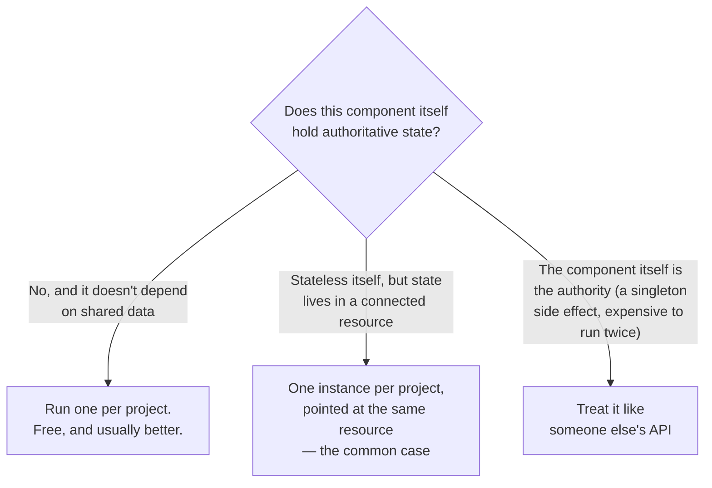

# 13. Multi-Project Sharing

Two teams, two separate BrickKit projects, and a real question: do they need to share anything at all? This article works through the one question that actually matters — where does the state live — and the three shapes that fall out of it, verified against two genuinely independent projects and a shared Redis, not a single project pretending to be two.

## The one question that decides everything



The middle case is the one people skip past. Component autonomy (AGENTS.md §4) already pushes every component toward statelessness — config from environment variables, state in a bound resource — so "this component genuinely owns authoritative state" is rarer than it sounds. `infra/redis-event-bus` looks like it should obviously need to be a shared, central thing; it holds zero state of its own. Everything lives in Redis Streams. Two projects each running their own instance, pointed at the same Redis, *is* a shared event stream.

## Shared resource, independent components

Start one Redis both projects can reach, and two genuinely separate projects — different directories, different `brickkit.yaml`, never referencing each other:

```bash
docker run -d --name shared-redis -p 16399:6379 redis:7-alpine
```

```yaml
# team-a/brickkit.yaml and team-b/brickkit.yaml — identical shape, different exposePort
components:
  - id: infra/redis-event-bus
    version: 1.0.0
    expose: true
    exposePort: 18201   # 18202 in team-b

resources:
  - kind: cache
    engine: redis
    id: redis
    host: host.docker.internal   # the host machine — where the shared Redis actually is
    port: 16399
    bindings:
      - componentId: infra/redis-event-bus
```

```bash
cd team-a && brickkit up   # ✅ All components started (1)
cd team-b && brickkit up   # ✅ All components started (1)
```

`host.docker.internal` is doing real work here: each project is its own Compose project with its own network, unreachable from the other by design — writing the other project's container name wouldn't resolve to anything. The shared Redis lives on the one thing both projects can already see, the host machine. On Kubernetes the same relationship just needs a different `host` — a Service DNS name is reachable across namespaces by default, no extra configuration.

```bash
curl -X POST http://localhost:18201/api/v1/events \
  -H 'Content-Type: application/json' \
  -d '{"type":"order.approved","actor":"alice","subject":"ORD-42"}'

curl "http://localhost:18202/api/v1/events?count=5"
```
```json
{"events":[{"type":"order.approved","actor":"alice","subject":"ORD-42","time":"...","id":"1789402628553-0"}],"total":1}
```

An event published on `team-a`'s instance shows up on `team-b`'s — two components that have never heard of each other, sharing one event stream, entirely through the resource they both happen to point at. Nothing project-specific was needed for this to work.

## One config field flips shared into isolated

`streamName` is exactly the field that decides whether these two projects are looking at the same stream:

```yaml
# team-b/brickkit.yaml
components:
  - id: infra/redis-event-bus
    version: 1.0.0
    expose: true
    exposePort: 18202
    config:
      streamName: "team-b:events"
```

```bash
brickkit up
curl "http://localhost:18202/api/v1/events?count=5"
```
```json
{"events":[],"total":0}
```

`team-b` can no longer see the event `team-a` published — and `team-a`'s own view is completely unaffected, still showing that one event. Same Redis, same component, same underlying infrastructure — sharing versus isolation here was never an architectural decision made once and locked in, it's one line of config that can be changed at any time.

## Treating a component as someone else's API

When a component genuinely is the authority — a singleton side effect (a scheduled job, a notification sender: run two and you send everything twice), something too expensive to duplicate, or something a completely different team owns and operates — the relationship should look exactly like calling any third-party API: you need its address, nothing about when it starts, upgrades, or scales is your problem, and if it's down your own component degrades however its own code decides to.

The component declares that it needs an address it has no way to guess:

```yaml
# component.yaml
configSchema:
  type: object
  required:
    - notifierBaseUrl
  properties:
    notifierBaseUrl:
      type: string
      description: 共用通知服务的地址，由部署它的那个项目提供
```

`required` with no `default` means the platform can't invent a value — the deploying project has to provide one. Try running without it:

```bash
brickkit up --dry-run
```
```
❌ Error: a required component config item has no value
   Missing config: demo/hello@1.0.0 → notifierBaseUrl (injected as NOTIFIER_BASE_URL)
   原因：组件在 configSchema.required 里声明了它，又没有给默认值——
   这一项平台推导不出来，只能由项目提供
```

This is the load-bearing part of the whole pattern: without it, a forgotten address doesn't crash anything — the environment variable just never appears, the component quietly falls into whatever its own "unconfigured" branch does, and nothing ever tells you the call is silently going nowhere. Fill it in and the value flows through exactly like any other config:

```yaml
components:
  - id: demo/hello
    version: 1.0.0
    config:
      notifierBaseUrl: http://host.docker.internal:18080
```
```bash
brickkit up
docker exec brickkit-shop-project-demo-hello-1-0-0-1 env | grep NOTIFIER
```
```
NOTIFIER_BASE_URL=http://host.docker.internal:18080
```

One naming rule matters here: don't call this field anything ending in `Endpoint` — `*_ENDPOINT` is the platform's own reserved suffix for dependency addresses it injects itself, and a config key that collides with it gets silently overridden and warned about (AGENTS.md §5.2). `notifierBaseUrl`/`xxxAddr` avoid the collision entirely.

## Why there's no platform feature that does this automatically

An earlier version of this platform had exactly that: an `external: {project: X}` field that would derive a cross-project address for you — reach into the other project's Docker network, or append its Kubernetes namespace to the address. It was removed, because it quietly encoded the wrong relationship: not "call someone else's API," but "share someone else's internal network." That meant the calling project needed the other component's Manifest resolvable from its own sources at all, needed the other project actually running before it could start, and — silently, no error anywhere — broke the instant either side turned on `local: true` or `networkPolicy.egress`. Losing it cost exactly one thing: the other component's artifacts (`.proto`, `openapi.json`) stop downloading automatically, and have to be requested once, by hand — [`brickkit fetch`](07-consuming-artifacts.md) from Article 7 is the tool for exactly that, on either side of this relationship.

---

This is the last article in the current series (see [the guide index](README.md) for what's still planned). For deeper detail on any single mechanism this series walked through hands-on, `docs/en/06-architecture/` and `docs/en/07-patterns/` are where it's explained properly, with real code and real generated output — AGENTS.md §11.2 has the full map.
