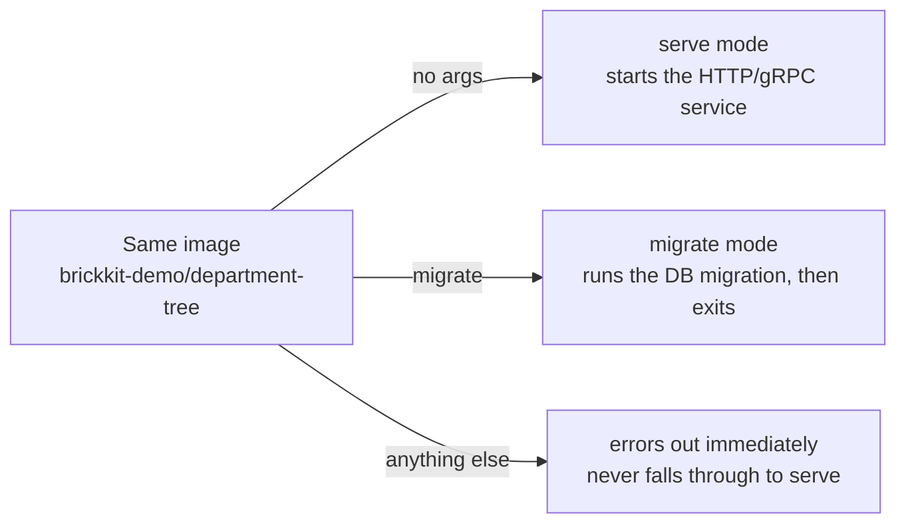

# Writing a Go Component for BrickKit: a full walkthrough

This isn't a toy built from scratch — it's a guided read through a real component that already lives in this repository and is covered by its own test suite (`component_test.go`, `migrate_test.go`) and `make test-components-integration`: [`tests/components/department-tree/`](../../tests/components/department-tree/), a real Go component with a PostgreSQL dependency and database migrations. By the end you'll know what a well-formed Go component looks like, why each piece is written the way it is, and what to change to make it yours.

Every command and output block below is real — built, run, curled, and logged for this page, not written from memory.

## The shape of it

```
department-tree/
├── component.yaml       # the Manifest
├── Dockerfile            # multi-stage build
├── go.mod / go.sum
├── main.go               # entry point: serve or migrate mode
├── config.go              # config read from environment variables only
├── server.go / service.go / store.go   # HTTP layer / business layer / data access
├── migrate.go             # the migration engine (SQL embedded via go:embed)
├── migrations/
│   ├── 0001_init.up.sql / .down.sql
│   └── 0002_seed_departments.up.sql / .down.sql
├── openapi.json           # HTTP API docs, published as an artifact
├── proto/department/v1/department.proto   # gRPC contract, published the same way
└── *_test.go
```

This component happens to demonstrate single-port HTTP+gRPC, migrations, and both `api-contract`/`api-docs` artifacts at once — your own component doesn't need all of that; take whichever pieces apply.

## component.yaml: declare what you are first

```yaml
apiVersion: brickkit/v1
kind: Component

metadata:
  id: department/tree
  name: Department Tree
  version: 1.0.0
  description: Organization-chart queries, HTTP and gRPC sharing one port

dependencies:
  resources:
    - kind: database
      engine: postgresql

configSchema:
  type: object
  properties:
    logLevel:
      type: string
      default: "info"
      description: Log level, injected as LOG_LEVEL

migration:
  command: ["/app/department-tree", "migrate"]

deployment:
  type: container
  image: brickkit-demo/department-tree:1.0.0
  port: 8080
  resources:
    requests: { cpu: "50m", memory: "32Mi" }   # requests only, no limits — see AGENTS.md §6

healthCheck:
  type: http
  path: /healthz
```

This is a **leaf component**: `dependencies.components` is empty, it only declares a `database` resource. `configSchema` has exactly one field — you don't need to pad it out to look thorough; declare what you actually use.

## main.go: one binary, two modes

```go
const (
	modeServe   = "serve"
	modeMigrate = "migrate"
)

func parseArgs(args []string) (mode string, rest []string, err error) {
	if len(args) == 0 {
		return modeServe, nil, nil
	}
	if args[0] == modeMigrate {
		return modeMigrate, args[1:], nil
	}
	return "", nil, errors.New(
		"unknown argument: " + args[0] + " (usage: no args to serve | migrate [down [n] | reset])")
}
```



`component.yaml`'s `migration.command` and the main service run from the exact **same image** — this argument is the only thing that tells them apart. The mistake this code specifically guards against: **an unrecognized argument must error outright, never fall through to "start the service anyway."** If a typo'd migration argument silently started the service instead, the migration container would become a second service container that never exits — the main service waits forever for it to finish, and the whole deployment hangs at `Created`, while that container's own logs cheerfully say "ready." `parseArgs` is a pure function — it doesn't read environment variables or touch the database. **Validate the argument first, before connecting to a database that might not even be reachable** — don't let a typo surface as a misleading "failed to connect to the database."

## Config: environment variables only

```go
type config struct {
	ComponentID string
	Version     string
	LogLevel    string
	Database    databaseConfig
}
```

The component doesn't read a config file, doesn't take database settings as command-line flags (`migrate`/`down`/`reset` are operating modes, not configuration), and doesn't know or care where it's deployed. `DATABASE_HOST`/`DATABASE_NAME`/`DATABASE_USER` missing means **startup fails immediately**, naming exactly which ones — it never quietly falls back to `localhost`. Falling back to a plausible-looking default is the classic way someone spends an hour debugging a component that's silently connected to the wrong database in production.

## Migrations: go:embed plus a per-component primary key

```go
//go:embed migrations/*.sql
var migrationFiles embed.FS

const schemaMigrationsTable = `
CREATE TABLE IF NOT EXISTS schema_migrations (
	component_id TEXT NOT NULL,
	version      TEXT NOT NULL,
	applied_at   TIMESTAMPTZ NOT NULL DEFAULT NOW(),
	PRIMARY KEY (component_id, version)
)`
```

Two decisions worth copying:

1. **`go:embed` bakes the SQL files into the binary** instead of reading them off disk at runtime — the migration scripts and the business code are always the exact same version; an image can never ship missing one of its own SQL files.
2. **`schema_migrations`'s primary key is `(component_id, version)`, not `version` alone.** This came from a real problem hit when testing two components against one shared database: with a bare `version` key, two components both having a `0001_init` migration means whichever runs first blocks the second one's tables from ever being created.

Three invariants, locked down by `migrate_test.go`: **idempotent** (the migration command reruns on every container restart; anything already applied must be a no-op), **atomic** (a migration and its version record commit in the same transaction — a failure rolls back the whole thing), **ordered** (applied lowest version first, and a failure stops the run rather than skipping ahead).

## Dockerfile: multi-stage, non-root

```dockerfile
FROM golang:1.22-alpine AS build
WORKDIR /src
COPY go.mod go.sum ./
RUN go mod download
COPY . .
RUN CGO_ENABLED=0 go build -trimpath -ldflags="-s -w" -o /out/department-tree .

FROM alpine:3.20
RUN adduser -D -u 10001 brickkit
COPY --from=build /out/department-tree /app/department-tree
USER 10001
EXPOSE 8080
ENTRYPOINT ["/app/department-tree"]
```

The full `golang` image only exists at build time; the runtime image ships neither the Go toolchain nor the source. `USER 10001` isn't optional — component containers don't run as root.

## Health check: itself only, never the database

```yaml
healthCheck:
  type: http
  path: /healthz
```

The `/healthz` handler only reports "this process is alive" — it never pings the database. That's deliberate: if the health check also checked the database, one database hiccup would mark every component depending on it unhealthy and get them all restarted at once — a single downstream blip becomes a cascading failure. A database that's down should make the business endpoints fail, not the health check.

## Running it for real

**1. Build the image**

```bash
docker build -t brickkit-demo/department-tree:1.0.0 tests/components/department-tree
```

**2. Start a local PostgreSQL** (the repository already ships this stack — no need to write your own compose file):

```bash
PG_PORT=55432 PG_USER=demo docker compose -f deploy/dev-resources/docker-compose.yaml up -d postgres
docker exec brickkit-dev-resources-postgres-1 psql -U demo -c "CREATE DATABASE brickkit_department"
```

**3. Configure `brickkit.yaml`** — with the dev-resources stack, the resource address is `host.docker.internal`, not a container name (same reason the comment at the top of `deploy/dev-resources/docker-compose.yaml` gives: that stack and your BrickKit project don't share a Docker network):

```yaml
components:
  - id: department/tree
    version: 1.0.0
    expose: true
    exposePort: 8080

resources:
  - kind: database
    engine: postgresql
    id: postgres-main
    host: host.docker.internal
    port: 55432
    username: demo
    password: ${PG_PASSWORD}
    bindings:
      - componentId: department/tree
        database: brickkit_department
```

Get this wrong and `brickkit up --dry-run` warns you at generation time (this is a real warning, not invented):

```
⚠️ A resource's host looks like a service name, which may not resolve inside the container
   Resource: postgres-main
   host: brickkit-template-pg
   Reason: The platform doesn't deploy resources, so compose has no service by that name
   Suggestions:
   1. If the resource runs on this machine, write host: host.docker.internal (the platform adds extra_hosts automatically)
   2. If the resource runs elsewhere, write its IP or domain name
   3. If you have already attached that container to this project's network by hand, you can ignore this reminder
```

**4. Start it**

```bash
brickkit up
```

```
🚀 Starting project dept-demo (deploy.target: docker)
📋 Component state calculation:
   ✅ department/tree@1.0.0  starting (top-level)

📋 Start order (topological sort):
   1. department-tree-1-0-0  no dependencies

📌 These base resources have to be running first (the platform doesn't deploy them for you):
   postgres-main postgresql     host.docker.internal:55432  used by department/tree
      Needs database brickkit_department (used by department/tree): CREATE DATABASE "brickkit_department";

🔧 Database migrations that run before startup (on failure that component won't start):
   department/tree@1.0.0  /app/department-tree migrate

🔍 Checking image pull permissions... ✅ All passed

🐳 Starting (docker)...
   department-tree-1-0-0        running (healthy)
✅ All components started (1)
```

The migration container's real log output (structured JSON, written to stdout):

```
{"time":"...","level":"INFO","msg":"Starting database migration","componentId":"department/tree","config":"component=department/tree@1.0.0 database=host.docker.internal:55432/brickkit_department user=demo logLevel=info"}
{"time":"...","level":"INFO","msg":"Migration finished","componentId":"department/tree"}
```

(The `msg` values are translated here: this sample component's own log messages are written in Chinese. What language a component logs in is entirely its own business — the platform never reads component logs.)

**5. Talk to it** (`0002_seed_departments.up.sql` already seeded a few rows):

```bash
curl -s http://localhost:8080/api/v1/departments
```

```json
{
  "departments": [
    {"id": "d-backend", "name": "Backend Team", "parentId": "d-tech", "level": 3},
    {"id": "d-hr", "name": "HR", "parentId": "d-root", "level": 2},
    {"id": "d-root", "name": "Head Office", "parentId": "", "level": 1},
    {"id": "d-tech", "name": "Tech Center", "parentId": "d-root", "level": 2}
  ],
  "total": 4
}
```

**6. Verify idempotency:** run `brickkit up` again. The migration container runs `migrate` a second time, logs the same two lines ("started"/"complete"), and `schema_migrations` gains no duplicate rows — that's what "idempotent" looks like at runtime, not just in a docstring.

**7. Tear down**

```bash
brickkit down
docker compose -f deploy/dev-resources/docker-compose.yaml down -v
```

## Adapting this into your own component

1. `component.yaml`: change `metadata.id`/`version`, add or drop `dependencies`/`configSchema` as needed
2. `main.go`'s `parseArgs`: keep "an unrecognized argument errors outright" — the rest is yours to change
3. `config.go`: environment variables only; a missing required one should fail startup, never fall back to a default
4. `migrations/`: `<version>.up.sql`/`<version>.down.sql` pairs, and `schema_migrations`'s primary key includes the component ID
5. `Dockerfile`: multi-stage build, non-root user, `ENTRYPOINT` pointing straight at the binary
6. `healthCheck`: checks the process itself only, never a database or a dependency

## Read further

- [Component Design Guidelines](07-patterns/00-component-design.md) — the domain research to do before writing any of this
- [Testing patterns for components built on BrickKit](07-patterns/01-testing.md) — which layers `component_test.go`/`migrate_test.go` correspond to
- [Deployment file generation](06-architecture/03-deployment-generation.md) — how `component.yaml` becomes the compose file shown above
- [Core Concepts](01-concepts.md) — the service-naming and env-injection rules that run through the whole platform
