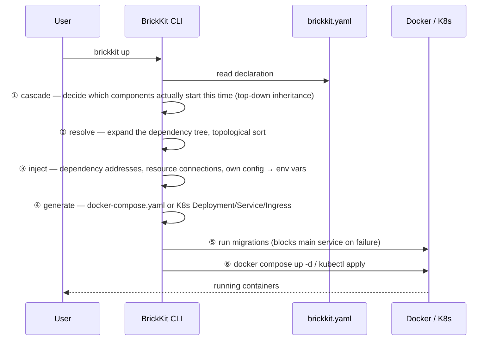

# Architecture overview

BrickKit is a **declarative component management and assembly platform**: build systems like snapping together bricks, where each component (brick) is developed, deployed, and called independently. You declare which components exist and what they depend on; the CLI's job is to derive everything else — the order, the addresses, the deployment files — and hand off to Docker or Kubernetes (the idea behind that is spelled out in [Design principles and trade-offs](01-design-principles.md)). It is **not** an operating system, not an ERP, and not any specific piece of business software — it's a tool for growing an architecture incrementally.

## The four parts

| Part | Form | Long-running? | Responsibility |
| --- | --- | --- | --- |
| **BrickKit CLI** | Local single binary | No — runs and exits | Fetch, resolve, generate, invoke, publish, manage the source workspace |
| **BrickKit Market** | Independent SaaS (self-hostable) | Yes | Component publishing/discovery, versions/visibility/signing, artifact storage |
| **Component layer** | Docker containers / K8s Pods | Yes | The actual business logic; components talk to each other directly over DNS |
| **Infrastructure layer** | PostgreSQL / Redis / etc. | Yes | **Deployed manually by ops**, bound by declaration in `brickkit.yaml` |

Of these four, only the CLI is not long-running — it exits as soon as a command finishes. The desired state lives in `brickkit.yaml`, the actual state lives in Docker/Kubernetes, and the CLI itself holds no state in between.

## What happens when you run `brickkit up`



Here is that same pipeline made concrete with components that actually exist in this repository. Running `brickkit add erp/backend@1.0.0` recursively pulls in `erp/backend`'s three required dependencies (`people/basic`, `auth/password-login`, `authorization/rbac`) plus one optional one — to keep this walkthrough focused, it follows just one of those chains: [`tests/components/people-basic/`](../../../tests/components/people-basic/) is a direct dependency, and [`tests/components/department-tree/`](../../../tests/components/department-tree/) comes along transitively because `people/basic` itself requires it. That's why (among the others) [`tests/components/erp-backend/`](../../../tests/components/erp-backend/), `department-tree`, and `people-basic` end up together in one `brickkit.yaml`. Now run `brickkit up`:

- **① cascade** finds none of the three declare `mode`, and each is either at the top of the dependency chain or required by something that is, so all three start;
- **② resolve** expands the dependency tree and topologically sorts it, which forces the start order `department-tree` → `people-basic` → `erp-backend` (dependencies before dependents);
- **③ inject** writes `DEPARTMENT_TREE_ENDPOINT=http://department-tree-1-0-0:8080` for `people/basic`, and a similar address pointing at `people-basic` for `erp/backend`;
- **④ generate** translates each of these components' `component.yaml` into its own service in `docker-compose.yaml` — one part of the full service set generated for `erp/backend`'s complete dependency tree (see [Deployment file generation](03-deployment-generation.md) for what that translation actually produces, on both targets, down to the byte);
- **⑤ run migrations** runs the migration commands `department-tree` and `people-basic` each declare (`erp/backend` itself has no `migration` field, so it's skipped) — `auth/password-login` and `authorization/rbac` each declare their own migration too, run the same way;
- **⑥** finally, `docker compose up -d` brings these containers up (along with the rest of `erp/backend`'s dependency set).

**Why all three start is worth spelling out, because the general rule behind it has more than one state.** Not writing `mode` on a component at all means it *follows the top*: a component nothing else depends on runs by default, and a lower-level one runs as long as some running component above it still needs it — which is exactly why `department-tree` starts here even though nothing in this project's `brickkit.yaml` says so directly, it's just true that `people-basic` needs it and `people-basic` is itself needed by the top-level `erp-backend`. The other values are explicit and override this entirely: `mode: enabled` pins a component to always run regardless of what's above it (and errors if a required dependency it needs was turned off — two conflicting intents can't both hold), `mode: disable` pins it to never run, taking everything that depends on it down too, `mode: debug` pins it to always run like `mode: enabled` — but as a process you start yourself in an IDE, not as a container — and `mode: local` pins it the same way, except BrickKit itself detects the start command, launches the process, and supervises it, so nothing needs starting by hand. If this project's `brickkit.yaml` set `department-tree`'s `mode: disable` instead of leaving it unwritten, `people-basic` — which requires it — would fail to resolve at all, and the CLI would say so by name rather than generating a broken deployment and letting it fail at container start. Every line of real CLI output states which of these reasons applies (`starting (top-level)` / `starting (mode: enabled)` / `starting (mode: debug)` / `starting (X needs it)` — `mode: local` shares `mode: debug`'s exact wording, since the reason names *why* it's pinned, not which bare-process mode it is), because which one is true is never something a reader should have to infer from the file alone.

Among the resulting service names are `erp-backend-1-0-0`, `department-tree-1-0-0`, and `people-basic-1-0-0` — the next section explains exactly how each name is derived. For a harder version of steps ① and ② — a real diamond dependency, a real cycle, and turning a component off — see [Dependency resolution and start order](02-dependency-resolution.md).

## What's in a project directory

`brickkit init` creates the following in the **current directory**. Only one file, `brickkit.yaml`, is actually "desired state"; `.brickkit/` is the CLI's own working directory, and each thing in it is either a cache that can be fetched again, an output regenerated by every `up`, or a login credential.

```
my-shop/                          ← project root
├── brickkit.yaml                 ← project config: the only "desired state"
├── components/                   ← component source workspace (not committed by default: each component is its own Git repo)
│   └── .archived/                ← source of components brickkit sync archived because they aren't starting
├── .brickkit/                    ← the CLI's working directory
│   ├── manifests/                ← Manifest cache: <component-id>-<version>.yaml, e.g. people-basic-1.0.0.yaml
│   ├── artifacts/                ← contracts, docs and other artifacts a component ships: <versioned-service-name>/<type>/…
│   ├── generated/                ← deployment files up generates (don't hand-edit, not committed)
│   ├── credentials               ← the token brickkit login stores (mode 0600, not committed)
│   └── skills.lock               ← records who wrote each AI-assistant skill file last (committed)
├── .claude/skills/               ← AI-assistant skills (installed by init, committed)
├── AGENTS.md                     ← AI-assistant project guide (installed by init, committed)
└── .gitignore                    ← ignore rules init appended
```

- **`manifests/` and `artifacts/` are caches, committed by default so the team shares one copy.** `up` reads the Manifests in `manifests/` and never needs a component's code; a missing or corrupt one is fetched again from its source. The exception is a component a local source provides (including any you `--repo`-cloned into `components/`): its `component.yaml` is re-read from that directory on every run and never cached. Artifacts are downloaded by `add` / `fetch`. The two matching lines in the `.gitignore` that `init` appends are commented out by default; uncomment them to ignore these.
- **`generated/` is rewritten by every `up` — don't hand-edit it.** It holds `docker-compose.yaml` (a `k8s/` directory when `deploy.target: k8s`), plus `local-debug.<versioned-service-name>.env` for `mode: debug` components. It's ignored by `.gitignore` by default — the latter can carry resolved config values.
- **`credentials` only exists after `brickkit login`**, and is ignored by `.gitignore` by default.
- **`skills.lock` should be committed**: it lets someone else's CLI tell "you hand-edited this skill file" apart from "a CLI upgrade made it stale".


## Versioned service names and the unified address format

**Service name = transformed component ID + exact version.** The transformation is three rules: `/` → `-`, `.` → `-`, all lowercase. `erp/backend` at version `1.0.0` becomes `erp-backend-1-0-0`.

The address format is **identical** under Docker and Kubernetes: `http://<versioned-service-name>:<port>`. Locally that's `http://department-tree-1-0-0:8080`; on a K8s cluster it's the exact same string — component code never needs to know which environment it's running in. This rule produces two direct consequences: **multiple versions coexist for free** (`people-basic-1-0-0` and `people-basic-2-0-0` are two non-conflicting DNS names), and **a caller always knows exactly which version it's talking to** — there is no implicit upgrade.

A real example beats the transformation rule on its own. Below is the actual `dependencies.components` block from [`tests/components/erp-backend/component.yaml`](../../../tests/components/erp-backend/component.yaml):

```yaml
dependencies:
  components:
    # Required: injects PEOPLE_BASIC_ENDPOINT (HTTP, 8080)
    # and PEOPLE_BASIC_GRPC_ENDPOINT (gRPC, from the extraPorts it declares, 9090).
    # This component uses the latter
    - people/basic@1.0.0
    # Required: injects AUTH_PASSWORD_LOGIN_ENDPOINT
    - auth/password-login@1.0.0
    # Required: injects AUTHORIZATION_RBAC_ENDPOINT (gRPC and HTTP share the main port)
    - authorization/rbac@1.0.0
    # **Optional**: when it isn't installed the platform injects no INFRA_REDIS_EVENT_BUS_ENDPOINT at all,
    # and this component degrades accordingly — approvals still succeed, they just don't emit events
    - id: infra/redis-event-bus@1.0.0
      optional: true
```

(The comments in the source file are in Chinese; they are translated here.) The four dependency lines map to four environment variable names, each **derived directly from the component ID** (`/` and `-` become `_`, uppercased, with `_ENDPOINT` appended) — no separate variable-name declaration is needed. This is also why BrickKit has no dependency aliasing: once that two-way mapping between variable name and component ID is broken, seeing `IAM_ENDPOINT` no longer tells you which component it points at.

### External tools connecting to a component's port directly

This transformation rule isn't only for the platform's own `*_ENDPOINT` injection. When you write a standalone script or tool — a local dev script, an ops tool, a one-off debugging session, not another BrickKit component — and need to bypass a component's business API to hit its gRPC/HTTP port directly, the address is computed with the exact same rule the platform uses internally: `http://<versioned-service-name>:<the component's own declared port>`. This holds whether the component is currently deployed standalone or merged into a shell via `servedBy` (see the [shell implementer's guide](../07-patterns/07-shell-implementers-guide.md)) — the shell container's network alias uses this exact same computed name. An external tool never needs to know or care whether the component is currently merged, or whether it has its own container.

The one precondition: this code has to run inside the Docker network BrickKit manages — for example, `docker run --rm --network <project-network-name> <image> ...` to join it temporarily. Don't assume the component's port is published to the host: `expose: true` only takes effect for a standalone-deployed component — a `servedBy` member is completely unaffected by it, and there is never a `localhost:<port>` to hit.

## What the platform deliberately doesn't do, and why

This list matters as much as the platform's abilities: none of the items below is "not built yet" — each was argued through and rejected. BrickKit stays a "connector" and a "translator": it never reaches into business logic, and it never repeats what the underlying infrastructure already does well.

**How to read this:** start with the five overview tables below, grouped by theme; click a name in the first column to jump to its numbered write-up.

### A. Runtime and communication

| Doesn't do | Why | What to do instead |
| --- | --- | --- |
| [1. Long-running daemon and control plane](#1-long-running-daemon-and-control-plane)<br>A program that runs in the background and manages every component | Run-and-exit means no single point of failure, no idle resources, no open port | The CLI exits when it's done; state lives in `brickkit.yaml` and the underlying engine |
| [2. Service registry](#2-service-registry)<br>An address book of "which service is where" | The DNS that Docker and Kubernetes already provide is service discovery, for free | Use DNS directly: `http://<versioned service name>:<port>` |
| [3. API gateway, service mesh and load balancing](#3-api-gateway-service-mesh-and-load-balancing)<br>A single front door, a layer managing service-to-service traffic, spreading requests over instances | Components call each other directly over DNS; gateway routing rules differ by business | Kubernetes Service load-balances; for a gateway, pass `labels` through |
| [4. Communication governance](#4-communication-governance)<br>Circuit breaking, rate limiting, retries | Thresholds and backoff differ by business; no platform default fits | Write it in the component's own code |
| [5. Health-check polling](#5-health-check-polling)<br>The platform periodically asking each component "are you alive?" | Compose and Kubernetes already do it natively | The component serves `/healthz`; the engine does the probing |
| [6. Config center and hot reload](#6-config-center-and-hot-reload)<br>A service that stores config centrally and pushes changes to running programs | A whole heavy mechanism, and most basic config only takes effect safely on a restart anyway | Environment-variable injection; change config, then `brickkit up` restarts |

### B. Configuration and versions

| Doesn't do | Why | What to do instead |
| --- | --- | --- |
| [7. Version-range resolution](#7-version-range-resolution)<br>Writing a dependency as `^1.0.0` and letting the tool pick the latest | A range is a classic cause of "works on my machine, breaks in production" | Exact versions only; `add` resolves once and pins the result |
| [8. Multi-environment overlays and inheritance](#8-multi-environment-overlays-and-inheritance)<br>A base config plus a per-environment "override" layer, merged at runtime | You have to assemble the inheritance chain in your head to read the final config | One complete, self-contained `brickkit.yaml` per environment |
| [9. Type validation of config values](#9-type-validation-of-config-values)<br>Checking that a config value has the right type and range | Once you start you can't stop, and JSON Schema's complexity ends up in the CLI | `configSchema` is a spec sheet; key names are checked, values aren't |
| [10. Dependency aliases](#10-dependency-aliases)<br>Giving a dependency an alias so the variable name no longer comes from the component ID | The variable name and the component ID map both ways; an alias keeps only half | For "one capability, many implementations", use a `kind` resource or an address setting in `configSchema` |

### C. Inside a component

| Doesn't do | Why | What to do instead |
| --- | --- | --- |
| [11. Weak-dependency fallback logic](#11-weak-dependency-fallback-logic)<br>What a component does when an optional dependency is unavailable | Querying the database, returning an empty list or writing a file is pure business judgment | In the component's own business code; the platform just doesn't inject the variable |
| [12. Multi-tenancy](#12-multi-tenancy)<br>One system serving several isolated customers | How to isolate (shared table, schema per tenant, database per tenant) is a business decision | Each component decides its own isolation strategy |

### D. Security and distribution

| Doesn't do | Why | What to do instead |
| --- | --- | --- |
| [13. Security review of third-party components](#13-security-review-of-third-party-components)<br>The platform scanning and vetting a component before it's published | An upfront scan either flags too much or misses cleverly disguised malicious code | Signature verification, plus marking a malicious component `blocked` afterwards |
| [14. Monorepo sub-directory components](#14-monorepo-sub-directory-components)<br>Several components in different folders of one Git repository | A component is an independent unit of publishing, moving and permissions | One component, one Git repository |
| [18. Fetching secrets from an external store](#18-fetching-secrets-from-an-external-store)<br>The CLI calling a secret-manager SDK on your behalf to fetch values into Secrets | An SDK and credentials per store, and network access on every `up` including `--dry-run` | Put the value in the environment yourself; for a Secret that already exists, reference it with `existingSecret` |

### E. Deployment shape and scope

| Doesn't do | Why | What to do instead |
| --- | --- | --- |
| [15. A full consolidated-deployment command](#15-a-full-consolidated-deployment-command)<br>Merging many components into one process to save memory, with the platform managing all of it | It would mean the platform starting to understand what's inside the "shell" | One small structural piece only: `servedBy` |
| [16. Podman as a deploy target](#16-podman-as-a-deploy-target)<br>Deploying with Podman instead of Docker | It worked, but `down` fails on rootless Podman, and a project that can't be torn down is worse than one that isn't supported | Use Docker |
| [17. Low-code, BI and DevOps pipelines](#17-low-code-bi-and-devops-pipelines) | Out of the platform's scope | — |
| [19. Engine plugins and third-party deploy targets](#19-engine-plugins-and-third-party-deploy-targets)<br>A pluggable interface for deploying somewhere the platform doesn't know | A plugin would own tear-down and status guarantees while the CLI reported success on its behalf — the Podman lesson | Build a new target in-tree, with the full test guard set |
| [20. An incremental generation cache](#20-an-incremental-generation-cache)<br>Remembering hashes so `up` regenerates only what changed | Generating 50 components already takes about 2 ms; there's nothing to speed up | Nothing — measure first if a real project ever shows otherwise |
| [21. Generated mocks and substituting missing dependencies](#21-generated-mocks-and-substituting-missing-dependencies)<br>Building a fake server from a contract, and auto-swapping it in for a missing required dependency | The platform never parses contracts; a silent stand-in contradicts "missing required dependency blocks startup" | A stub via `brickkit new --contract`, then `mode: debug` plus any mock tool |
| [22. A built-in renderer for the dependency graph](#22-a-built-in-renderer-for-the-dependency-graph)<br>HTML or SVG output, a viewer, or a flag that writes the file for you | Mermaid text is already rendered for free, and a renderer inside the CLI is a permanent maintenance cost | `brickkit graph > graph.mmd` — GitHub renders that file, or a Markdown code fence tagged `mermaid` |
| [23. Dependency and cross-file checks in lint](#23-dependency-and-cross-file-checks-in-lint)<br>`brickkit lint` resolving the dependency graph, or checking that a `servedBy` target exists | Resolving the graph needs the network; one network call and "offline, instant" is gone | `brickkit up --dry-run`, which has to resolve the graph anyway |

---

### 1. Long-running daemon and control plane

- **What it is:** a program that runs in the background and manages every component.
- **Why it doesn't:** the CLI runs and exits, and state lives in `brickkit.yaml` and the underlying engine (Docker, Kubernetes). No background process means no single point of failure, no idle resource use, no listening port, and no attack surface.
- **What to do instead:** the CLI exits when it's done. If a visual console is ever needed, it should be an ordinary frontend component plus an API component, not something built into the platform core.
- **What you'd see if you built one anyway:** build your own persistent orchestration daemon to solve "nobody remembers to run `up`" and you've recreated the exact single point of failure and attack surface BrickKit was designed to avoid.

---

### 2. Service registry

- **What it is:** an address book of "which service is where": services register when they come up and look each other up when they need to call.
- **Why it doesn't:** the DNS that Docker Compose and Kubernetes already provide is service discovery, for free; the platform doesn't need to build and keep highly available a registry of its own. It also means a component needs no registration SDK at all.
- **What to do instead:** use DNS directly: `http://<versioned service name>:<port>`, identical on Docker and Kubernetes.
- **What you'd see if you built one anyway:** wire a custom service-discovery SDK into component code and the component is no longer a "zero-touch" deployment — it now depends on something that must be kept alive by hand, while the free DNS it replaced sits unused.

---

### 3. API gateway, service mesh and load balancing

- **What it is:** a gateway is the single front door for requests coming in from outside, and does the routing; a service mesh is a layer of infrastructure dedicated to how services talk to each other; load balancing spreads requests over the instances of one service.
- **Why it doesn't:** components call each other directly over DNS, and a Kubernetes Service already load-balances. Gateway routing rules vary too much by business to standardize without forcing a bad fit.
- **What to do instead:** when you need an outside gateway (Traefik, say), pass `labels` through verbatim to it: the platform doesn't understand what a label means, it just passes it on.
- **What you'd see if you built one anyway:** skip the `labels` passthrough and hand-write a Traefik file-provider config with versioned service names baked in, and that config silently goes stale the moment a component's version bumps — the platform won't warn you.

---

### 4. Communication governance

- **What it is:** the whole set of policies that protect calls between services: circuit breaking (pausing calls to something that keeps failing), rate limiting, and retrying failed calls with backoff.
- **Why it doesn't:** retry backoff and circuit-breaker thresholds vary by business need; a platform-wide default is both hard to get universally right and takes away flexibility a component might genuinely need.
- **What to do instead:** write it in the component's own code.
- **What you'd see if you built one anyway:** wait for the platform to retry a failed call on a component's behalf, and nothing happens — a transient network blip surfaces directly as an unhandled error in whichever component made the call, because retry and backoff were never the platform's job.

---

### 5. Health-check polling

- **What it is:** the platform periodically asking each component "are you alive?".
- **Why it doesn't:** Kubernetes Probes and Docker Compose's own `healthcheck` plus restart policy already do this natively. A platform-built poller would mean either a background process (the same daemon problem as item 1) or a client library every component would have to embed.
- **What to do instead:** the component serves `/healthz` (checking only the process itself), and the engine does the probing and restarting.
- **What you'd see if you built one anyway:** have a component call a dependency's `/healthz` from inside its own health check "just to be safe," and you've built exactly the cascading failure the platform's own health-check rule exists to prevent: one flaky dependency makes every upstream component look unhealthy and restart at once.

---

### 6. Config center and hot reload

- **What it is:** a service that stores configuration centrally and can push changes to running programs in real time.
- **Why it doesn't:** that is a whole heavy mechanism of long-lived connections, pushes and version comparison — and for most basic configuration (connection-pool size, timeouts), a restart is already the only safe way to make it take effect.
- **What to do instead:** environment-variable injection. Change `brickkit.yaml`, then `brickkit up` restarts. If a business toggle truly needs millisecond-level updates, the component can poll Redis itself.

---

### 7. Version-range resolution

- **What it is:** writing a dependency's version as a "range" such as `^1.0.0` and letting the tool pick the latest match at install time.
- **Why it doesn't:** ranges are the classic cause of "works on my machine, breaks in production"; exact versions also let the version number go straight into the service name, making multi-version coexistence free.
- **What to do instead:** exact versions only. When you run `brickkit add` with no version, it resolves once, at that moment, and pins the result.
- **What you'd see if you built one anyway:** write `^1.0.0`, `~1.0.0` or `latest` in `dependencies` or `brickkit.yaml` and the CLI rejects it immediately at resolve time — the problem never survives to reach runtime.

---

### 8. Multi-environment overlays and inheritance

- **What it is:** a base config plus a layer of "overrides" per environment, merged into the final config at runtime.
- **Why it doesn't:** an overlay forces you to mentally reconstruct "base layer / override layer / merge rules" before you can read the final config, and a Git diff of the base layer can't tell you which environments it silently affects.
- **What to do instead:** one complete, self-contained `brickkit.yaml` per environment, chosen with `brickkit up --config brickkit.prod.yaml`. To see how two environment files differ — and what the differences do — see the two-line recipe in [Choosing a deployment shape](../07-patterns/05-deployment-selection-guide.md).
- **What you'd see if you built one anyway:** reuse config via `base.yaml` plus `prod-overlay.yaml` and the only thing you save is typing a few lines — the cost is that a change to the base layer can silently affect environments you can't identify from the diff, and the CLI provides no command to merge such files anyway.

---

### 9. Type validation of config values

- **What it is:** checking that a config value you filled in has the right type and is within the allowed range.
- **Why it doesn't:** once value validation is allowed, the questions never stop — validate `enum`? `minimum`? `pattern`? — and JSON Schema's full complexity ends up inside the CLI. And what to do about a bad value (error, or fall back to a default) is the component's call anyway.
- **What to do instead:** `configSchema` is a spec sheet. The CLI checks that a setting's *name* exists (a typo warns) and never checks its *value*. See [the matching principle](01-design-principles.md#10-configschema-is-a-spec-sheet-not-a-security-gate).
- **What you'd see if you built one anyway:** declare `type: integer` in `configSchema` and let a user fill in a string — the CLI won't stop it. The component crashes only when its own code calls `int()` on that string — discovered at runtime, not at `brickkit up`.

---

### 10. Dependency aliases

- **What it is:** giving a dependency an alias (say `as: iam`) so the environment variable name no longer comes from the component ID.
- **Why it doesn't:** today the variable name is computed from the component ID, and the mapping runs **both ways**: from `people/basic` you can compute `PEOPLE_BASIC_ENDPOINT`, and from `PEOPLE_BASIC_ENDPOINT` you know exactly which component it points at. An alias keeps only half of that — `IAM_ENDPOINT` can't be traced back to the component it points at, and that is exactly where an investigation into "why is this address wrong" starts. It would also mean re-deriving reserved-variable protection and dependency de-duplication from scratch, both of which are built on "the name is computed from the ID".
- **What to do instead:** for "one capability, many implementations", use a `kind` resource (changing one `engine` field swaps the implementation); for a service that needs an address but not a dependency edge (IAM, say), use a non-reserved key in `configSchema`. For anything on a real dependency edge, the implementation's name showing up in the variable name isn't a flaw — it's the fact of that dependency.

---

### 11. Weak-dependency fallback logic

- **What it is:** what a component does when an optional dependency isn't available.
- **Why it doesn't:** whether a missing Redis means "query the database instead," "return an empty list," or "write to a local file and retry" is a pure business decision, and the right answer differs by component.
- **What to do instead:** in the component's own business code. The platform's only action is to skip injecting the corresponding `*_ENDPOINT` entirely.
- **What you'd see if you built one anyway:** expect the platform to "automatically" handle a missing weak dependency and nothing happens. Component code that reads the variable with `os.environ["X"]` crashes immediately with a `KeyError` — intentional, and safer than silently injecting an empty string.

---

### 12. Multi-tenancy

- **What it is:** one system serving several customers who must be kept isolated from each other.
- **Why it doesn't:** whether to isolate tenants with a shared schema and a tenant column, a schema per tenant, or a database per tenant is a business and domain decision with no single answer that fits every component's data model.
- **What to do instead:** each component decides its own isolation strategy.
- **What you'd see if you built one anyway:** look for a `tenant_id` field or an isolation switch anywhere in `brickkit.yaml` or a component's Manifest, and there isn't one — tenant isolation lives entirely inside each component's own schema and business logic.

---

### 13. Security review of third-party components

- **What it is:** the platform scanning and vetting a component for safety before it is published.
- **Why it doesn't:** the same trust model as npm, the VS Code Marketplace or GitHub: installing means trusting. An upfront scan has either too many false negatives (missing deliberately disguised malicious code) or too many false positives (blocking legitimate components).
- **What to do instead:** signature verification (with the trusted public key in your own project), plus marking a malicious component `blocked` afterwards. See [signing and the trust model](06-signing-and-trust.md).
- **What you'd see if you built one anyway:** assume every Market component has passed some kind of security audit before publish, and you'd be wrong — `brickkit add` performs no scanning at all; the only real enforcement is after the fact, marking a component `blocked` once it's confirmed malicious.

---

### 14. Monorepo sub-directory components

- **What it is:** several components living in different sub-directories of one Git repository.
- **Why it doesn't:** a component is an independent unit of **publishing** (it has its own version — how would you even tag it inside a monorepo?), of **moving** (`brickkit sync` archives the whole repository directory, `.git` and all) and of **permissions** (its own visibility and publisher).
- **What to do instead:** one component, one Git repository. Several parts of the same piece of business — the proto, the backend code, the migration scripts — belong to the *same* component and don't need splitting.

---

### 15. A full consolidated-deployment command

- **What it is:** merging many components into one process (one container) to save memory, with the platform managing all of it.
- **Why it doesn't:** the platform does not, and will not, ship its own shell scaffolding or process supervisor. That would mean the platform starting to understand what's inside the "shell", what can be merged, what supervises the processes, how a given framework starts several listeners — exactly what this platform argues against.
- **What to do instead:** one small **structural piece** is built in: `servedBy` lets a component declare "my workload is provided by that other component", and the platform wires `*_ENDPOINT` addresses to it correctly on both Docker and Kubernetes, without ever needing to understand what's inside the shell. Everything else — avoiding port collisions, taking over health checks and migrations, isolating each module's config — is the shell author's own code. See the [servedBy deployment checklist](../07-patterns/06-servedby-deployment-checklist.md) and [building a qualified shell](../07-patterns/07-shell-implementers-guide.md).
- **First ask whether you need it at all:** memory cost is mostly decided by language: 8–20MB for a Go component, 200–450MB for a JVM one. Don't merge just to save memory — that is usually solving the wrong problem: switch runtime, or run fewer components with `mode: disable`.

---

### 16. Podman as a deploy target

- **What it is:** deploying with Podman, another container engine, instead of Docker.
- **Why it doesn't:** support was built and ran — `up`, `status`, real requests and idempotent reruns all passed — but `down` fails on rootless Podman with `rootless netns: kill network process: permission denied`, reproducible even with plain `podman rm -f`, outside BrickKit's own code entirely. A project that can't be torn down is worse than one that never came up: containers keep holding ports and volumes while the CLI would have reported success. So support was pulled rather than shipped half-working.
- **What to do instead:** use Docker. On a machine with only Podman installed, `up` and `status` name this exact failure and point at Docker instead of a generic "no engine found".
- **When it could come back:** it needs a real machine where `podman compose down` itself works cleanly, a full lifecycle verified on it, and a repeatable check added so it can't silently regress again.

---

### 17. Low-code, BI and DevOps pipelines

- **Why it doesn't:** out of the platform's scope. BrickKit is a platform for assembling components: it is not an operating system, not an ERP, and not any specific piece of business software.

---

### 18. Fetching secrets from an external store

- **What it is:** the CLI calling Vault / AWS Secrets Manager SDKs at `up` time to fetch values and turn them into Secrets.
- **Why it doesn't:** an SDK and its credentials per store, network access on every `up` including `--dry-run`, and a neighbour of the rejected config center; `${VAR}` already reads the process environment first.
- **What to do instead:** put the value in the environment with whatever tool you use, then `brickkit up`; declare `secret: true` in `configSchema` so a config credential stays out of Deployments; or, for a Secret an external system already created, reference it directly with `resources[].existingSecret` or a `secret: true` config value's `{ existingSecret, key }` form — see [Secrets](../07-patterns/10-secrets.md).

---

### 19. Engine plugins and third-party deploy targets

- **What it is:** an interface external programs implement so a flag like `--engine nomad` on `up` deploys somewhere the platform doesn't know.
- **Why it doesn't:** a target's tear-down, status and orphan-cleanup guarantees are the reason "a project can be torn down" is true, and a plugin would own them while the CLI reported success (the Podman lesson, entry 16); a CLI flag would also bypass `deploy.target`, the declaration.
- **What to do instead:** build a new target in-tree with the full test guard set.

---

### 20. An incremental generation cache

- **What it is:** remembering hashes under `.brickkit/` so `up` regenerates only what changed.
- **Why it doesn't:** generating 50 components takes about 2 ms; what users wait for is `docker compose up` / `kubectl apply`, which already touch only what changed; a cache that goes stale silently produces wrong deployment files.
- **What to do instead:** nothing — there is nothing to speed up. Measure first (`go test ./tests/perf -bench .`); reopen it only if a real project shows generation above ~100 ms.

---

### 21. Generated mocks and substituting missing dependencies

- **What it is:** a `mock`-style command building a fake server from a component's contract, and a `--with-mocks`-style flag on `up` swapping it in for a required dependency that isn't there.
- **Why it doesn't:** the platform never parses contracts; a stand-in swapped in silently contradicts "a missing required dependency blocks startup"; and a mock under its own name gets no traffic because injected addresses point at the real component's versioned service name.
- **What to do instead:** `brickkit new <id> --contract openapi` for a stub, `mode: debug` + `localPort`, and any mock tool listening on that port — [walkthrough](../03-guide/08-consuming-artifacts.md).

---

### 22. A built-in renderer for the dependency graph

- **What it is:** `brickkit graph` producing an HTML page or an SVG image itself, shipping a viewer, or growing a flag that writes the output to a file — instead of just printing Mermaid text.
- **Why it doesn't:** Mermaid text is already rendered for free: GitHub renders a `.mmd` / `.mermaid` file, and a Markdown code fence tagged `mermaid`, with nothing to install. A renderer inside the CLI would be a permanent maintenance cost — layout, one more output format to keep correct — for something that costs nothing today. A file-writing flag isn't needed either: stdout carries nothing but Mermaid (a hint is a `%%` comment line, a warning goes to stderr), so an ordinary shell redirect already writes a valid file.
- **What to do instead:** `brickkit graph > graph.mmd`, then open that file on GitHub; or paste the output into a Markdown code fence tagged `mermaid`.

---

### 23. Dependency and cross-file checks in lint

- **What it is:** making `brickkit lint` resolve the dependency graph and check references across files — does the component a `servedBy` names exist in the project, can a required dependency be found.
- **Why it doesn't:** `lint` is a promise: offline, read-only, instant, no Docker or Kubernetes, and no rule of its own — it runs the same parse-and-validate that `up`, `add` and `publish` already apply to each file. Resolving the graph needs every component's Manifest, and for a market or Git component that means the network; one network call and the promise is gone.
- **What to do instead:** `brickkit up --dry-run`, which has to resolve the graph anyway and stops with an error that names the culprit on a missing `servedBy` target or a required dependency it can't find; `brickkit graph` to see the declared structure. (`lint` doesn't check a `configSchema` value against its own `enum` or `minimum` either — that is [item 9](#9-type-validation-of-config-values).)

---

For the principles behind these decisions and the argument for each one, see [Design principles and trade-offs](01-design-principles.md); the twenty-three "why" justifications are in section 9 of [`AGENTS.md`](../../../AGENTS.md). For the complete field or command reference, see the [component.yaml Field Reference](07-component-yaml-reference.md), the [brickkit.yaml Field Reference](08-brickkit-yaml-reference.md), and the [CLI Command Reference](09-cli-reference.md).
