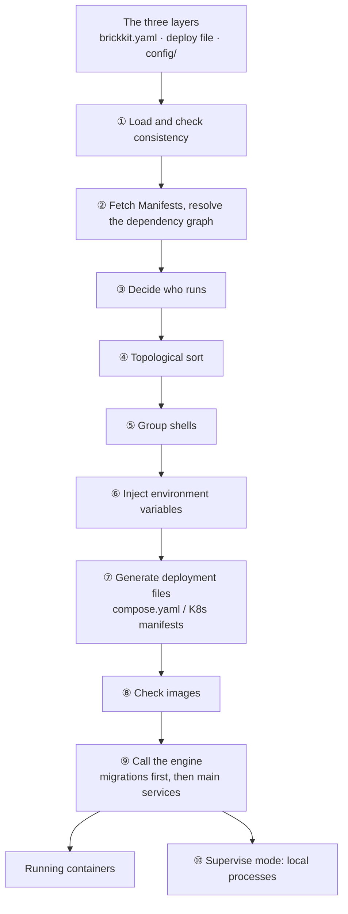

# The pipeline

## Four parts

| Part | Form | Long-running? | Does |
| --- | --- | --- | --- |
| BrickKit CLI | One local executable | ❌ Exits when done | Reads declarations, resolves, generates, calls the engine, releases |
| Components | Docker containers / Kubernetes Pods | ✅ | The business itself; they call each other directly by DNS name |
| The underlying engine | Docker / Podman / Kubernetes | ✅ | Actually runs containers, health-checks, restarts, load-balances |
| Install sources | Git repositories, local directories, a component market (optional) | Depends | Holds components' `component.yaml`, contracts and code |

"What it should be" is written in the three layers of files; "what it actually is" lives in the underlying engine. Between
two runs the CLI remembers nothing — no background process, no listening port, no service to operate.

## The pipeline of one `brickkit up`

## What each station does

**① Load and check consistency.** Read `brickkit.yaml`, the deploy file used this time (`deploy.yaml`; `deploy.local.yaml`
in local mode; or the one `-f` names) and `config/`. The three layers have to agree: every component version has exactly
one entry in the deploy file, shell members are written under their shell, every `$var:` is defined, no config conflict is
left unresolved. When they don't, it stops — every later station takes these three files as input, and with wrong input,
everything computed afterwards is wrong.

**② Fetch Manifests, resolve the dependency graph.** For the components and versions in `brickkit.yaml`, fetch each
component's `component.yaml` from the cache or the install source, and connect them into a graph by their
`dependencies`. A missing required dependency is an error here; a missing optional one is a warning. See
[Dependency resolution](02-dependency-resolution.md).

**③ Decide who runs.** Top-level components (nothing depends on them) run by default; a lower component runs as long as
something above it that needs it runs; a `mode` written in the deploy file takes precedence. Every component carries a
reason ("top-level", "demo/caller needs it", "mode: debug").

**④ Topological sort.** Order the components running this time for start-up: dependencies before those that depend on
them.

**⑤ Group shells.** Work out which members each shell hosts this time, check their versions match the ones compiled into
the shell, and pack the members' config into JSON. See [Shells](../04-shell/README.md).

**⑥ Inject environment variables.** Work out every environment variable each component gets: `COMPONENT_ID`,
`COMPONENT_VERSION`, every dependency's `*_ENDPOINT`, the config values resolved from `config/`. A required item without a
value is stopped here. See [The environment variable contract](03-env-injection-contract.md).

**⑦ Generate deployment files.** Depending on the deploy file's `target`, generate `.brickkit/generated/compose.yaml`
(`docker`, `podman`) or a set of Kubernetes manifests (`k8s`). They are generated afresh every time; components never
carry deployment files of their own. `--dry-run` stops here. See [Generating deployment files](04-deploy-file-generation.md).

**⑧ Check images.** Images built on this machine must already exist (`up` never builds); pulled images must be reachable.
Every missing one is listed at once.

**⑨ Call the engine.** `docker compose up` (or `podman compose`, `kubectl apply`). Components that declare a migration run
it first, and their main service starts only when it finished successfully; then it waits for every component's health
check to pass. With the `k8s` target, before touching anything it confirms that `kubectl` is connected to the cluster the
deploy file names.

**⑩ Supervise local processes.** With `mode: local` components, `up` stays in the foreground, starting and supervising
those processes on this machine until `Ctrl+C`.

## One pipeline, several exits

| Command | Goes as far as |
| --- | --- |
| `brickkit lint` | ①, plus config and shell-declaration checks for components whose Manifests are already on disk; no network, no dependency graph |
| `brickkit deps`, `brickkit graph` | ①②③, printing the dependency graph |
| `brickkit up --dry-run` | ①–⑦, stopping once the deployment files are generated |
| `brickkit up` | All of it |
| `brickkit sync` | ①②③, arranging the source directories by who runs |

They share the same code: for the same project, what `graph` draws, what `sync` archives and what `up` starts are always
the same decision.

## What the platform deliberately doesn't do

- **Stay running.** No control plane, no daemon: the state lives in the three layers and the underlying engine.
- **Service discovery or health polling.** DNS and the engine's own health checks already do that.
- **Gateways, meshes, circuit breaking, rate limiting, config centres.** These vary by business; they belong to the
  components themselves, or to outside tools hooked in through `labels` passed through.
- **Guess.** Version ranges, unknown fields, ports nobody said to expose — none of these are decided for you.

The reasons behind each are in [Design principles and trade-offs](05-design-principles.md).
