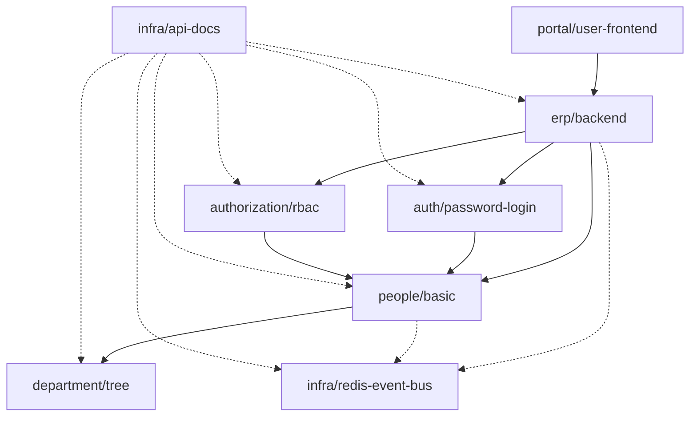

# Dependency Resolution and Start Order

The overview walks through the six-stage `brickkit up` pipeline once, straight through, with everything turned on. This document goes back to stages ① and ② — **cascade** (which components actually run this time) and **resolve** (in what order the ones that run actually start) — and pushes each one harder: what happens when something is turned off, what happens when two paths converge on the same dependency, and why eight components starting doesn't mean eight serial steps.

Every example below is a real `brickkit up --dry-run` run against real components from [`tests/components/`](../../../tests/components/), not a hand-written illustration. The command output below is the CLI's English output, quoted verbatim — the same text you'd see running it yourself. (English is the default; `brickkit lang set zh` switches the CLI to Chinese.)

## The graph these examples share



Solid arrows are required dependencies, dashed arrows are optional. Two things make this graph worth using as a running example rather than a toy: `people/basic` is a genuine diamond — three separate paths (`erp/backend` directly, and through both `auth/password-login` and `authorization/rbac`) converge on it — and `infra/api-docs` optionally depends on almost everything else in the graph, which turns out to matter a lot in the next section.

## Stage ①: cascade — who actually runs

The full rule table lives in AGENTS.md §5.4; this section shows what it looks like against a real graph rather than restating it. Declare this project with `erp/backend: mode: disable` and nothing else touched, then run `brickkit up --dry-run`:

```
📋 Component state calculation:
   ✅ department/tree@1.0.0        starting (infra/api-docs needs it)
   ✅ infra/redis-event-bus@1.0.0  starting (infra/api-docs needs it)
   ✅ people/basic@1.0.0           starting (auth/password-login needs it)
   ✅ auth/password-login@1.0.0    starting (infra/api-docs needs it)
   ✅ authorization/rbac@1.0.0     starting (infra/api-docs needs it)
   ⬜ erp/backend@1.0.0            disabled explicitly (mode: disable)
   ⬜ portal/user-frontend@1.0.0   not starting (required dependency erp/backend is not starting)
   ✅ infra/api-docs@1.0.0         starting (top-level)
```

Two things here are easy to get wrong by reasoning about the rule in the abstract instead of watching it run:

- **Turning off `erp/backend` doesn't turn off its own dependency subtree.** `people/basic`, `auth/password-login`, `authorization/rbac`, and `department/tree` all keep running, because `infra/api-docs` — a completely separate, always-on top-level component — optionally depends on every one of them directly. Cascade asks "does *any* running upstream still need this," not "does the upstream I had in mind still need this." A shared lower-level component surviving through a consumer you weren't thinking about is the normal case here, not an edge case.
- **The propagation runs in both directions from an explicit `mode: disable`.** `portal/user-frontend` never declared `mode` at all — on its own it would default to running, being top-level. It stops anyway, because its *required* dependency (`erp/backend`) is force-off, and "whatever depends on it stops too" (AGENTS.md §5.4) applies regardless of what the dependent's own `mode` field says. Only an explicit `mode: enabled` on `portal/user-frontend` would turn this into a hard error instead of a silent stop — two conflicting explicit intents on record at once.

## Stage ②: resolve — expanding the graph without duplicating the diamond

Re-enable `erp/backend` and run the same command again. The status calculation now shows all eight components starting, each with a real reason:

```
📋 Component state calculation:
   ✅ department/tree@1.0.0        starting (infra/api-docs needs it)
   ✅ infra/redis-event-bus@1.0.0  starting (erp/backend needs it)
   ✅ people/basic@1.0.0           starting (auth/password-login needs it)
   ✅ auth/password-login@1.0.0    starting (erp/backend needs it)
   ✅ authorization/rbac@1.0.0     starting (erp/backend needs it)
   ✅ erp/backend@1.0.0            starting (infra/api-docs needs it)
   ✅ portal/user-frontend@1.0.0   starting (top-level)
   ✅ infra/api-docs@1.0.0         starting (top-level)
```

`people/basic` is reached three separate times while walking this graph — directly from `erp/backend`, and again from each of `auth/password-login` and `authorization/rbac` — and resolves to **one** node, appearing once in the plan. The rule is identity by `(component ID, exact version)`: every path that names `people/basic@1.0.0` lands on the same node, however many different callers reached it. This is also exactly why version coexistence needs no special handling at all — `people/basic@1.0.0` and a hypothetical `people/basic@2.0.0` referenced elsewhere are two different identities, so they'd simply be two different nodes, never merged and never in conflict (AGENTS.md §5.1).

**A required dependency that can't be found blocks generation immediately**, naming exactly which component demanded it — not just "something's missing":

```
❌ Error: required dependency missing
   Component: people/basic@1.0.0
   Missing dependency: department/tree@1.0.0
   Reason: The component was not found in any install source
```

An optional dependency that can't be found produces a warning instead and the resolution continues — the missing component's `*_ENDPOINT` is simply never injected into whatever declared it as optional.

## Cycles: allowed if a weak edge breaks the chain, a hard error otherwise

Point `department/tree` back at `people/basic` as a **required** dependency (on top of `people/basic`'s own required dependency on `department/tree`) and resolution refuses outright:

```
❌ Error: dependency cycle detected
   Cycle path: department/tree@1.0.0 → people/basic@1.0.0 → department/tree@1.0.0
   Reason: These components all **require** each other; each is waiting for the others to start first, so there is no valid startup order
   Suggestions:
   1. Check the dependency declarations in the Manifest (dependencies.components)
   2. Make one side an optional dependency (optional: true) instead — an optional edge doesn't constrain startup order, and one optional edge in the cycle breaks the deadlock
```

Make that same edge **optional** instead — `department/tree` optionally depends on `people/basic`, which still required-depends on `department/tree` — and the identical cycle resolves cleanly, no error, both directions visible in the dependency graph output (`department/tree@1.0.0 → people/basic@1.0.0 (optional)`, and separately `people/basic@1.0.0 → department/tree@1.0.0` with no such marker).

The reason a cycle is only an error when every edge in it is required, never when at least one is optional: **a cycle is a problem because it makes start order unsolvable, and start order is only ever constrained by required edges** — the topological sort that produces stage ②'s output doesn't consider optional edges at all, precisely because an optional dependency might not even be running. So a cycle built entirely from required edges truly has no valid order — A waits for B, B waits for A, forever. A cycle with one optional edge in it has an obvious order: start the components without a required predecessor in the cycle first, and the optional edge simply doesn't block anything. Two components that each optionally call the other when it happens to be available — a notification service optionally calling an audit service, which optionally calls back into the notification service to record what it did — is a completely ordinary shape for two collaborating components, and there's no structural reason it should be rejected just because it happens to form a cycle on paper.

## Start order: topological sort, and why more components doesn't mean more serial steps

Back to all eight components enabled, the actual order:

```
📋 Start order (topological sort):
   1. department-tree-1-0-0        no dependencies
   2. infra-api-docs-1-0-0         no dependencies
   3. infra-redis-event-bus-1-0-0  no dependencies
   4. people-basic-1-0-0           ← depends on 1
   5. auth-password-login-1-0-0    ← depends on 4
   6. authorization-rbac-1-0-0     ← depends on 4
   7. erp-backend-1-0-0            ← depends on 4, 5, 6
   8. portal-user-frontend-1-0-0   ← depends on 7

Can start on their own: department-tree-1-0-0, infra-api-docs-1-0-0, infra-redis-event-bus-1-0-0 (no dependencies)
Longest dependency chain (5 levels): department-tree-1-0-0 → people-basic-1-0-0 → auth-password-login-1-0-0 → erp-backend-1-0-0 → portal-user-frontend-1-0-0
   Components not on this chain start in parallel with it
```

Eight components, but the number that actually determines how long `up` takes to reach a fully running state is the **length of the longest required-dependency chain** — five here, not eight. `department-tree`, `infra-api-docs`, and `infra-redis-event-bus` have no required dependency at all and start immediately, in parallel with everything else. `authorization-rbac` sits at the same depth as `auth-password-login` (both wait only on `people-basic`) but isn't on the *longest* chain, since the chain through `auth-password-login` happens to be the one that continues on to `erp-backend` and `portal-user-frontend` — so `authorization-rbac` starts in parallel with that entire continuation, not serially before it.

This distinction isn't pedantic — it's a real correction to a mistake that shipped in this platform's own documentation once. An earlier design doc reported a component's wait time using its flat topological position instead of its actual required-dependency depth, producing a claim like "must wait for the first 4 components," for a component whose own dependency diagram — printed right next to that claim — showed it required exactly one thing. Flattening a dependency graph into a single ordered list is necessary to produce *a* valid start order, but reading that list's positions as "how many things this component waits for" silently reintroduces a serial mental model the graph itself never had. If you want to know how long a real `up` takes, look at the longest chain length, not the count of components in the plan.

---

For the complete field-level rules this section builds on — exact-version pinning, why `people/basic` can only appear once in a single Manifest's `dependencies`, the two-layer reserved-variable protection — see AGENTS.md §5.1, §5.2, and §9.2/§9.3.
