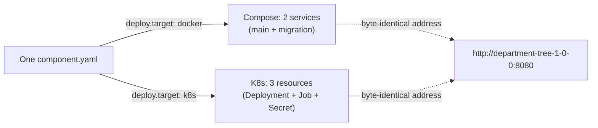

# Deployment File Generation

A component's repository never ships a deployment file of its own — the CLI reads one `component.yaml` and generates either a `compose.yaml` or a full set of Kubernetes manifests, depending on nothing but `deploy.target` (AGENTS.md §5.5). This document shows exactly what comes out the other side of that generation step, for both targets, from the same two-component project — so that "the same Manifest becomes different deployment files" stops being an abstract claim and becomes something you can see line by line.

Every file quoted below is real, unedited output from `brickkit up --dry-run` against [`tests/components/department-tree/`](../../../tests/components/department-tree/) and [`tests/components/people-basic/`](../../../tests/components/people-basic/), trimmed only to drop repeated boilerplate (labels, the generation-timestamp header). `department/tree` declares a `database` resource, a `migration.command`, a `logLevel` config item, and only a resource `requests` block (no `limits`) — deliberately chosen because it exercises resource binding, migrations, config override, and quota translation all at once. The project overrides `department/tree`'s `logLevel` to `debug` but leaves `people/basic`'s config untouched, which turns out to matter below.



## Docker Compose: one component becomes two services

```yaml
services:
  department-tree-1-0-0:
    depends_on:
      department-tree-1-0-0-migration:
        condition: service_completed_successfully
    deploy:
      resources:
        reservations:
          cpus: "0.05"
          memory: 32M
    environment:
      - COMPONENT_ID=department/tree
      - COMPONENT_VERSION=1.0.0
      - DATABASE_HOST=postgres.internal
      - DATABASE_NAME=department
      - DATABASE_PASSWORD=s3cret
      - DATABASE_PORT=5432
      - DATABASE_USER=brickkit_app
      - LOG_LEVEL=debug
    healthcheck:
      interval: 10s
      retries: 3
      start_period: 60s
      test: [CMD-SHELL, "wget -q --spider http://localhost:8080/healthz || curl -fsS http://localhost:8080/healthz || exit 1"]
      timeout: 3s
    image: brickkit-demo/department-tree:1.0.0
    restart: unless-stopped
  department-tree-1-0-0-migration:
    command: [migrate]
    entrypoint: [/app/department-tree]
    environment: [... same as above ...]
    image: brickkit-demo/department-tree:1.0.0
    restart: "no"
  people-basic-1-0-0:
    depends_on:
      department-tree-1-0-0: { condition: service_healthy }
      people-basic-1-0-0-migration: { condition: service_completed_successfully }
    environment:
      - DATABASE_NAME=people
      - DEPARTMENT_TREE_ENDPOINT=http://department-tree-1-0-0:8080
      - LOG_LEVEL=info
      - ...
```

A handful of things are worth slowing down on here:

- **Migration is a real, separate service, not a step bolted onto the main one.** `department-tree-1-0-0-migration` runs the manifest's `migration.command`, has `restart: "no"` (it's meant to run once and exit), and the main service `depends_on` it with `condition: service_completed_successfully` — not `service_healthy`, since a one-shot container never becomes "healthy," it becomes "exited 0." The main service literally cannot start until that exit code is a success.
- **`people-basic-1-0-0`'s dependency on `department-tree-1-0-0` uses a different condition**: `service_healthy`. Two different `depends_on` conditions doing two different jobs in the same file — one waits for a one-shot task to finish, the other waits for a long-running service's healthcheck to pass.
- **The resource quota is unit-converted, not copied verbatim.** The Manifest declared `requests: { cpu: "50m", memory: "32Mi" }`; Compose has no native concept of Kubernetes' millicpu/mebibyte notation, so it becomes `cpus: "0.05"` (50m = 0.05 of a core) and `memory: 32M`. No `limits` were declared, and none were generated — silence in, silence out, exactly as AGENTS.md's "only `requests` has a default" rule promises.
- **The healthcheck tries two different tools, on purpose.** `wget -q --spider ... || curl -fsS ... || exit 1` isn't hedging for style — a Compose healthcheck runs *inside* the container, using whatever's actually installed there, and a base image like `python:slim` or a distroless image routinely ships neither tool, or only one of them. Writing just `wget` produces a component that's genuinely running fine and gets marked `unhealthy` anyway, with nothing in the container's own logs hinting why. Trying both is the platform's defense against that — it doesn't help if an image has truly neither, which is still worth checking for directly (AGENTS.md §10 names this exact pitfall).
- **`department/tree`'s config override actually shows up (`LOG_LEVEL=debug`), and `people/basic`'s doesn't (stays whatever its own Manifest defaults to).** The project only wrote a `config:` override for `department/tree` — this is `configSchema` override injection working exactly as scoped, one component at a time, not a project-wide setting.

## Kubernetes: three separate resources instead of two services

The same project, same components, only `deploy.target: k8s` — the Deployment for `department/tree`, trimmed to its distinctive parts:

```yaml
apiVersion: apps/v1
kind: Deployment
spec:
  template:
    spec:
      containers:
        - env:
            - { name: DATABASE_PASSWORD, valueFrom: { secretKeyRef: { name: main-db-secret, key: password } } }
            - { name: LOG_LEVEL, value: debug }
          image: brickkit-demo/department-tree:1.0.0
          livenessProbe:    { httpGet: {path: /healthz, port: 8080}, initialDelaySeconds: 10, periodSeconds: 10, timeoutSeconds: 3, failureThreshold: 3 }
          readinessProbe:   { httpGet: {path: /healthz, port: 8080}, initialDelaySeconds: 5,  periodSeconds: 5,  timeoutSeconds: 3, failureThreshold: 3 }
          startupProbe:     { httpGet: {path: /healthz, port: 8080}, periodSeconds: 5, timeoutSeconds: 3, failureThreshold: 12 }
          resources:
            requests: { cpu: 50m, memory: 32Mi }
```

- **The database password is a Kubernetes Secret reference, not a plain value** — `valueFrom.secretKeyRef` pointing at a separately generated `Secret/main-db-secret`, instead of Compose's plain `DATABASE_PASSWORD=s3cret` environment line. This is the one place the two targets genuinely diverge in more than syntax: the *address format* is identical everywhere (AGENTS.md's environment-consistency claim is about addresses), but *secret delivery* isn't, because only one of the two targets has a native secret object to delegate to.
- **A `secret: true` config item gets the same treatment, in its own file.** Neither component here declares one, but if `department/tree` had a `configSchema` property marked `secret: true`, its value would land in a second, separately generated `secrets/config-secrets.yaml` (0600, same as the resource one) instead of `secrets/resource-secrets.yaml` — one file per category, never mixed, so a project with only resource passwords never even gets a `config-secrets.yaml` on disk.
- **`existingSecret` skips generation entirely.** Write `resources[].existingSecret` on the database resource, or `{ existingSecret, key }` on a `secret: true` config value, and neither generated file gets that entry at all — the `secretKeyRef.name` in the Deployment points straight at the name you gave, because that Secret was never the platform's to generate; it already exists, put there by whatever created it.
- **Resource quota is carried through with no unit conversion this time** — `50m`/`32Mi` straight from the Manifest, because Kubernetes already speaks millicpu and mebibytes natively. Compose needed a conversion; Kubernetes doesn't.
- **Three separate probes exist, and they're doing three different jobs — this is real depth the "K8s Probes" one-liner elsewhere doesn't show.** `livenessProbe` (10s initial delay, every 10s, 3 failures ≈ 40s to declare dead) is the one that gets a Pod killed and restarted. `readinessProbe` (5s / 5s / 3 failures) controls whether the Service sends it traffic at all — and **readiness stays disabled the whole time `startupProbe` hasn't passed yet**, so a Pod that's still starting never receives a request just because it happened to pass a readiness check early. `startupProbe` exists specifically to keep a slow cold start from being mistaken for a crash: its `failureThreshold` isn't a fixed constant like the other two probes' — it's computed as `ceil(startPeriodSeconds ÷ 5)`, rounding up so a declared grace period is never shortchanged by an indivisible remainder. This Manifest didn't set `startPeriodSeconds` at all, so it took the field's own default of 60 seconds, which is exactly what `periodSeconds: 5, failureThreshold: 12` (5 × 12 = 60) encodes.
- **Without a startup probe, this exact platform default (10s + 10s×3 ≈ 40s) is the same 30–40 second window that CrashLoopBackOffs a genuinely healthy but slow-starting component** — Spring Boot, Django with heavy preloading, .NET's first JIT pass are the recurring real offenders (AGENTS.md's `startPeriodSeconds` warning). The startup probe is what actually buys the time `startPeriodSeconds` promises; bumping `livenessProbe`'s own `initialDelaySeconds` instead would "fix" one slow component by making every component's crash detection slower, which is why the platform keeps the two probes structurally separate instead.
- **Migration is a `batch/v1` Job, generated as a separate file, not folded into the Deployment at all** — `restartPolicy: Never`, `backoffLimit: 0`, so a failing migration fails once, visibly, with no silent retry loop masking it. Why a Job and not an InitContainer is a separate, already-answered question — see AGENTS.md §9.6 (the short version: an InitContainer is Pod-scoped, so `replicas: 3` would run the same migration three times concurrently; a Job is cluster-scoped and runs it exactly once).

## What's actually identical across both targets

`people/basic`'s dependency on `department/tree` produces the exact same string on both targets:

```
DEPARTMENT_TREE_ENDPOINT=http://department-tree-1-0-0:8080
```

Not "an equivalent address" — the identical bytes, because both a Compose service name and a Kubernetes Service name resolve the same versioned-service-name string over DNS. Everything this document just walked through — probes vs. a single healthcheck, a Secret reference vs. a plain value, unit-converted quotas vs. native ones — is generation-target detail sitting entirely on top of that one unchanging address. A component's own code never has to know, and never can tell, which of the two targets actually produced the file that started it.
