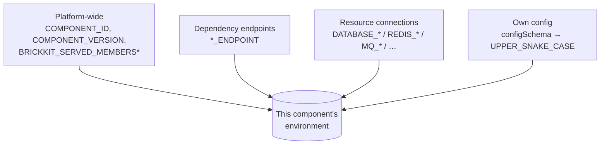

# Environment Variable Contract

AGENTS.md §5.2 states the *shape* of each category of injected variable — the naming rule, the priority order, the two-layer reserved-variable defense. This document is the *dictionary*: every variable name the platform can ever write into a component's container, spelled out exactly, for every resource `kind`, with the precise value each one carries and the precise condition under which it's absent instead of empty. Every name and every warning text below is verified against `internal/inject/inject.go` and `internal/shell/shell.go`, and every generated example is real, unedited output from `brickkit up --dry-run` against synthetic fixtures built the same way the CLI's own test suite builds them — not hand-typed.



A rule that applies to every category below, stated once here instead of four times: **a variable that has no value is never injected as an empty string — it simply doesn't exist.** A missing optional dependency, an unbound resource field, an unconfigured config key with no default: all three produce the same outcome, "the variable is absent," never `VAR=""`. Component code has to read every one of these defensively (`os.environ.get()`, not `os.environ[...]`) for exactly this reason — AGENTS.md §9.13 has the full argument for why an empty string would be worse.

## 1. Platform-wide variables

| Name | Present on | Value |
| --- | --- | --- |
| `COMPONENT_ID` | every component | the component's own ID, e.g. `shop/checkout` |
| `COMPONENT_VERSION` | every component | the component's own exact version, e.g. `1.0.0` |
| `BRICKKIT_SERVED_MEMBERS` | a `servedBy` shell only | comma-separated versioned service names of the shell's currently-active members, sorted; `""` (present, empty) when the shell has zero active members — never absent, since a compliant shell must be able to tell "zero members" apart from "this platform predates the variable" |
| `BRICKKIT_SERVED_MEMBERS_CONFIG` | a `servedBy` shell only | a JSON array, one element per active member; `[]` when there are zero — see §4 |

Real generated output, from a plain component with no dependencies and no resources bound:

```
COMPONENT_ID=shop/checkout
COMPONENT_VERSION=1.0.0
```

These four names, plus the `*_ENDPOINT` suffix and the resource-kind prefixes in §3, are the platform's full reserved-variable list — see §5.

## 2. Dependency endpoint variables

**Naming rule** (`internal/manifest/envvar.go`): take the dependency's component ID, replace every `/` and `-` with `_`, uppercase the result — that's `EnvPrefix`. The main port's variable is `{EnvPrefix}_ENDPOINT`; an extra port named `x` is `{EnvPrefix}_{X}_ENDPOINT` (the port's own `name` field, uppercased). The **name** never carries a version; the **value** always points at the versioned service name it currently resolves to.

```
people/basic            → EnvPrefix PEOPLE_BASIC
  deployment.port: 8080  → PEOPLE_BASIC_ENDPOINT=http://people-basic-1-0-0:8080
  extraPorts: [grpc:9090] → PEOPLE_BASIC_GRPC_ENDPOINT=http://people-basic-1-0-0:9090
```

This is real, not illustrative — [`tests/components/people-basic/`](../../../tests/components/people-basic/) declares exactly that main port and that one extra port, and [`tests/components/erp-backend/`](../../../tests/components/erp-backend/) depends on it and uses the gRPC one specifically (its own `component.yaml` comments say so, and `internal/inject/inject_test.go` / `internal/compose/compose_test.go` assert on the exact string).

**A required dependency that's missing blocks `up` outright** (resolution fails before injection ever runs). **An optional (`optional: true`) dependency that's missing or not currently running injects nothing at all** — not `PEOPLE_BASIC_ENDPOINT=`, no variable named `PEOPLE_BASIC_ENDPOINT` in the environment whatsoever. See AGENTS.md §5.3 for the full required/optional table and §9.13 for why this is deliberately not an empty string.

One name can only ever point at one version: `dependencies.components` can't list the same component ID twice (AGENTS.md §5.1), because the variable *name* has no version slot to disambiguate a second entry into.

## 3. Resource connection variables

Each bound resource contributes a fixed set of variables, one set per `kind` — never all six kinds' worth, only the kind that resource actually is. A field that resolves to an empty string (host never set, no username configured, …) is dropped from that set entirely, same "absent, not empty" rule as everywhere else. Every value below (except the slot fields) comes straight from the resource's own `host` / `port` / `username` / `password` in `brickkit.yaml`; the slot fields (`DATABASE_NAME`, `MQ_VHOST`, `STORAGE_BUCKET`, `SEARCH_INDEX`) come from the binding's own slot field (AGENTS.md §7's "same slot" table).

| Resource `kind` | Variables | Notes |
| --- | --- | --- |
| `database` | `DATABASE_HOST`, `DATABASE_PORT`, `DATABASE_NAME`, `DATABASE_USER`, `DATABASE_PASSWORD` 🔒 | `DATABASE_NAME` is the binding's `database:` slot |
| `cache` | `REDIS_HOST`, `REDIS_PORT`, `REDIS_PASSWORD` 🔒 | No `REDIS_USER`, no DB-index variable, no slot field — `kind: cache` has none (AGENTS.md §7) |
| `mq` | `MQ_HOST`, `MQ_PORT`, `MQ_USER`, `MQ_PASSWORD` 🔒, `MQ_VHOST` | `MQ_VHOST` is the binding's `vhost:` slot |
| `storage` | `STORAGE_ENDPOINT`, `STORAGE_BUCKET`, `STORAGE_ACCESS_KEY`, `STORAGE_SECRET_KEY` 🔒 | `STORAGE_ENDPOINT` is `host:port` combined, not just `host` — a bare host string with the port silently missing is exactly the failure mode this was fixed to avoid (MinIO's default `9000` is easy to leave off); `STORAGE_BUCKET` is the `bucket:` slot, `STORAGE_ACCESS_KEY`/`STORAGE_SECRET_KEY` are `username`/`password` renamed to match the S3-family vocabulary |
| `search` | `SEARCH_HOST`, `SEARCH_PORT`, `SEARCH_INDEX` | No auth variables at all — `username`/`password` on a `kind: search` resource are simply never injected; `SEARCH_INDEX` is the `index:` slot |
| `smtp` | `SMTP_HOST`, `SMTP_PORT`, `SMTP_USER`, `SMTP_PASSWORD` 🔒 | No slot field — `kind: smtp` has none |

🔒 marks a secret: on `deploy.target: k8s` this variable is generated as a `valueFrom.secretKeyRef` against a generated `Secret`, not a plain value (see [03-deployment-generation.md](03-deployment-generation.md)); on Docker it's a plain environment value like everything else, since Compose has no native secret object to delegate to.

A component's own config variable gets the 🔒 too when its `configSchema` property says `secret: true`. Its Secret is `Secret/<versioned-service-name>-config-secret` (key = the variable's name), separate from the resource Secrets, and under `servedBy` it stays with the *member* — the shell's prefixed variable (e.g. `MDM_CUSTOMER_API_KEY`) is a `secretKeyRef` into the member's Secret. Either kind of secret can instead reference a Secret an external system already created (`resources[].existingSecret`, or a `secret: true` config value written as `{ existingSecret, key }`) — the platform then generates no Secret of its own for that one variable.

Real generated output — one component bound to all six kinds at once (`database`/`cache`/`mq`/`storage`/`search`/`smtp`, no `envPrefix` on any of them):

```
DATABASE_HOST=postgres.internal
DATABASE_NAME=checkout
DATABASE_PASSWORD=s3cret
DATABASE_PORT=5432
DATABASE_USER=app
MQ_HOST=mq.internal
MQ_PASSWORD=mqpass
MQ_PORT=5672
MQ_USER=mquser
MQ_VHOST=checkout
REDIS_HOST=redis.internal
REDIS_PASSWORD=cachepass
REDIS_PORT=6379
SEARCH_HOST=search.internal
SEARCH_INDEX=checkout-products
SEARCH_PORT=9200
SMTP_HOST=smtp.internal
SMTP_PASSWORD=mailpass
SMTP_PORT=587
SMTP_USER=mailer
STORAGE_ACCESS_KEY=minioadmin
STORAGE_BUCKET=checkout-media
STORAGE_ENDPOINT=minio.internal:9000
STORAGE_SECRET_KEY=miniosecret
```

**`envPrefix` shifts the whole set, not just one field.** A `database` resource bound with `envPrefix: ARCHIVE` produces `ARCHIVE_DATABASE_HOST` / `ARCHIVE_DATABASE_PORT` / `ARCHIVE_DATABASE_NAME` / `ARCHIVE_DATABASE_USER` / `ARCHIVE_DATABASE_PASSWORD` — the exact same five names from the table above, each with the prefix prepended, nothing renamed or dropped:

```
ARCHIVE_DATABASE_HOST=archive.internal
ARCHIVE_DATABASE_NAME=checkout_archive
ARCHIVE_DATABASE_PASSWORD=s3cret
ARCHIVE_DATABASE_PORT=5432
ARCHIVE_DATABASE_USER=app
```

This is the mechanism [05-resource-binding.md](05-resource-binding.md) uses to let one component bind two same-`kind` resources at once without a collision — full detail there; this document only owns the variable names themselves.

## 4. The component's own config

**Naming rule** (`internal/inject/reserved.go`'s `EnvVarName`, shared byte-for-byte with the marketplace's own publish-time validator so the two sides never disagree about whether a name collides): a camelCase or kebab-case `configSchema` property name becomes `UPPER_SNAKE_CASE` — a word boundary is either an explicit `-`/`.`/space, or a lowercase-or-digit character immediately followed by an uppercase one.

```
defaultPageSize → DEFAULT_PAGE_SIZE
enableV2Api     → ENABLE_V2_API
kebab-case-key  → KEBAB_CASE_KEY
```

This transform is **one-directional** — given `DEFAULT_PAGE_SIZE` alone there's no way to recover whether the source key was `defaultPageSize` or `default_page_size`. `servedBy`'s `BRICKKIT_SERVED_MEMBERS_CONFIG` (§6) exists partly because of this: a shell author needs the mapping from original key to generated variable name spelled out for them, not re-derivable after the fact.

**Value formatting** (`formatValue`) depends on the property's actual value, not its declared `type`:

| Value kind | Rendered as | Example |
| --- | --- | --- |
| string | itself, unchanged | `"info"` → `info` |
| boolean | `true` or `false` | `true` → `true` |
| a whole-number float (YAML/JSON integers decode as `float64`) | no decimal point | `20` → `20`, not `20.000000` |
| a non-whole float | Go's `%g` | `1.5` → `1.5` |
| **array or object** | Go's default `fmt.Sprint` representation — **not JSON** | `["cn-east", "cn-north"]` → `[cn-east cn-north]`; `{beta: true, legacy: false}` → `map[beta:true legacy:false]` |

That last row is a real, verified footgun, not a hypothetical: a `configSchema` property typed `array` or `object` does not arrive in the container as JSON. It arrives as Go's whitespace-separated, bracket-delimited stringification of the decoded value — unparseable by `json.loads`/`JSON.parse` without writing a custom parser for Go's own `fmt` syntax, which nothing sane should do. If a component genuinely needs structured config delivered through this channel, encode it as a single `type: string` property holding a JSON string literal (`'["cn-east","cn-north"]'`) and parse that in the component — don't declare `type: array`/`type: object` and expect JSON out the other end.

**Where the value comes from** — `component.yaml`'s own `configSchema.properties.<key>.default`, or `brickkit.yaml`'s `components[].config.<key>` if present (the override wins). Neither is type-checked (AGENTS.md §4, §9.12 — "the spec sheet has already been handed to you"). A property with **no default and no override** injects nothing, *unless* it's also listed under `configSchema.required` — see §5.3.

## 5. The two failure modes that aren't "inject nothing"

Three genuinely different outcomes exist for a `config` entry that's somehow wrong, and only one of them is silent:

**5.1 — A `config` key's computed env var name collides with a reserved pattern.** The reserved set is exactly: the four exact names in §1, the `*_ENDPOINT` suffix, the six resource-kind prefixes in §3 (`DATABASE_`/`REDIS_`/`MQ_`/`STORAGE_`/`SEARCH_`/`SMTP_`), and any `envPrefix` the *project* has defined for a bound resource. This last one is why the check happens at injection time and not at publish time — a component's own Manifest has no way to know what `envPrefix` a project binding it will someday choose. **This is a warning, not a blocking error** — the config item is dropped, the platform's own value (if any) wins, `up` continues:

```
⚠️ 配置冲突：组件 shop/checkout 的配置项已被忽略
   组件：shop/checkout
   配置项：databaseFlavor
   环境变量名：DATABASE_FLAVOR
   冲突的保留模式：DATABASE_*
   处理：该配置项已被忽略，平台注入的值优先
   建议：
   1. 修改 configSchema 中的配置项名称，避开平台保留变量
   2. 例如改为 customDatabaseFlavor
```

The suggested rename differs by which pattern was hit — a prefix collision (`DATABASE_*`) suggests a `custom` prefix on the *key*; a suffix collision (`*_ENDPOINT`) suggests renaming the key's own `Endpoint` tail to `BaseUrl`, because prefixing a key that already ends in `Endpoint` obviously doesn't fix a suffix match:

```
⚠️ 配置冲突：组件 shop/checkout 的配置项已被忽略
   组件：shop/checkout
   配置项：upstreamEndpoint
   环境变量名：UPSTREAM_ENDPOINT
   冲突的保留模式：*_ENDPOINT
   建议：
   2. 例如改为 upstreamBaseUrl
```

**5.2 — A `config` key in `brickkit.yaml` doesn't exist in the component's `configSchema` at all** (a typo, or an override left over from before the component dropped that property). Also a warning, also non-blocking, with an edit-distance guess at what you meant:

```
⚠️ config 里有配置项不会生效：组件 shop/checkout 的 typoLogLevel
   配置项：typoLogLevel
   原因：组件的 configSchema 里没有这一项
   影响：这一项不会被注入任何环境变量；组件会使用它自己的默认值
   组件声明的配置项：databaseFlavor、logLevel、upstreamEndpoint
```

The same warning fires, worded identically, when the component has **no `configSchema` at all** and the project still writes a `config:` block — the whole block is ignored, not just the unrecognized keys:

```
⚠️ config 整块不会生效：组件 shop/cart 没有声明 configSchema
   被忽略的配置项：maxItems（共 1 项）
   影响：一项都不会被注入任何环境变量
   建议：要让它可配置，先在组件的 component.yaml 里加 configSchema
```

**5.3 — A `configSchema.required` key has no default and no override anywhere.** This is the one case in this whole document that's a **hard error, not a warning** — `brickkit up` refuses to generate anything at all, for any component in the project, naming the exact missing key and which component declared it required:

```
❌ 错误：必填的组件配置没有值
   缺少配置：shop/pricing@1.0.0 → pricingServiceUrl（注入为 PRICING_SERVICE_URL）
   原因：组件在 configSchema.required 里声明了它，又没有给默认值——这一项平台推导不出来，只能由项目提供
   建议：
   1. 在 brickkit.yaml 里给它一个值：
    components:
      - id: shop/pricing
        config:
          pricingServiceUrl: <值>
   2. 值里可以写 ${ENV_VAR}，真值放 .env
```

Why this one alone gets to block startup: a required key with no default is the component author saying "I genuinely cannot guess this — the project has to supply it," the standard shape for a cross-project service address (AGENTS.md §5.2 — the platform has no way to derive where another project's own service lives). Letting it through silently would mean the component starts, looks healthy, and has exactly one call path that quietly never works — indistinguishable from "configured correctly" until someone hits that path in production. Compare this against §5.1/§5.2: those are typos with a working (if wrong) fallback behind them; this is "there is no fallback," so the platform can't afford to treat it the same way.

## 6. `servedBy`: how member variables land on the shell

A `servedBy` member contributes no container and no environment of its own — its variables get merged onto the **shell's** container instead (AGENTS.md §5.7). Three different merge rules apply to three different kinds of variable:

- **`*_ENDPOINT` variables** (the member's own dependencies, §2) merge in unprefixed — component IDs already make these names globally unique, and a caller reading `DEPARTMENT_TREE_ENDPOINT` shouldn't have to know whether the component behind it is standalone or merged into a shell.
- **The member's own `configSchema` config** (§4) merges in **with an `{EnvPrefix(memberID)}_` prefix** — the same prefix algorithm `*_ENDPOINT` uses — specifically so two independently-authored members reusing the same generic config key (`pageSize`, say) can never collide on the shell's single shared process environment.
- **Never merged at all**: `COMPONENT_ID`/`COMPONENT_VERSION` (the shell keeps its own, singular pair — a member has no container to be "the" component of), resource-connection variables (§3 — a member's resource binding is satisfied once the *shell's* componentId is bound to that resource; see AGENTS.md §5.7), and `labels` (moved out of the merge entirely after real multi-component testing showed same-key-different-value collisions were the norm, not the exception — AGENTS.md §5.7's full account).

Real generated output — a shell (`infra/shell-go-core`) with two members, `mdm/customer` (`pageSize` default `20`, own port `8081`) and `mdm/product` (`pageSize` overridden to `100` in `brickkit.yaml`, own port `8082`):

```
BRICKKIT_SERVED_MEMBERS=mdm-customer-1-0-0,mdm-product-1-0-0
BRICKKIT_SERVED_MEMBERS_CONFIG=[{"componentId":"mdm/customer","version":"1.0.0","httpPort":8081,"extraPorts":[],"configEnvVars":{"pageSize":"MDM_CUSTOMER_PAGE_SIZE"}},{"componentId":"mdm/product","version":"1.0.0","httpPort":8082,"extraPorts":[],"configEnvVars":{"pageSize":"MDM_PRODUCT_PAGE_SIZE"}}]
COMPONENT_ID=infra/shell-go-core
COMPONENT_VERSION=1.0.0
MDM_CUSTOMER_PAGE_SIZE=20
MDM_PRODUCT_PAGE_SIZE=100
```

Two things worth reading closely in that output: **`BRICKKIT_SERVED_MEMBERS_CONFIG` carries `pageSize: "MDM_CUSTOMER_PAGE_SIZE"` — a variable *name*, never the value `20` itself.** The value lives at that named variable, one line down, in the shell's own environment; a shell implementation reads the JSON to learn *which* variable holds a given member's given config key, then reads that variable itself. This indirection is deliberate: a member's config value is routinely an unexpanded `${VAR}` secret placeholder, and embedding an unresolved placeholder's eventual value inside a JSON string would let `docker compose`'s own blind text substitution corrupt the JSON the moment that value contains a quote or backslash (AGENTS.md §5.7 has the incident this fixed). And **`MDM_PRODUCT_PAGE_SIZE=100`, not `50`** — the project's `config: { pageSize: 100 }` override on `mdm/product` took effect exactly as it would for a standalone component; `servedBy` changes *where* the variable lands, never the ordinary override-beats-default rule from §4.

`BRICKKIT_SERVED_MEMBERS` and `BRICKKIT_SERVED_MEMBERS_CONFIG` are themselves on the reserved list (§5.1) — no component's `configSchema` can declare a property that resolves to either name.

## Read further

- AGENTS.md §5.2 — the naming rules this document turns into a full dictionary, and the two-layer reserved-variable defense in one paragraph
- AGENTS.md §9.13 — the full argument for "absent, never empty"
- [05-resource-binding.md](05-resource-binding.md) — what happens when a binding is wrong or two bindings collide, and how the *quota* chain (a different merge, not covered here) combines three layers field by field
- [03-deployment-generation.md](03-deployment-generation.md) — how a secret-flagged variable becomes a Kubernetes `Secret` reference instead of a plain value
- [07-shell-implementers-guide.md](../07-patterns/07-shell-implementers-guide.md) — what a `servedBy` shell author actually has to do with `BRICKKIT_SERVED_MEMBERS`/`BRICKKIT_SERVED_MEMBERS_CONFIG` once they land in the process
- [03-service-addressing.md](../07-patterns/03-service-addressing.md) — once a `*_ENDPOINT` variable is in your environment, what actually happens to an open connection through it when the container behind it gets replaced — measured, not assumed, across Go/Python/Node
