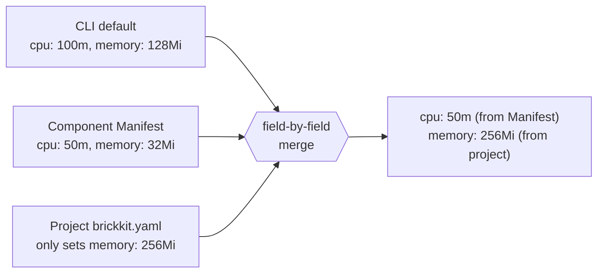

# Resource Binding Mechanics

A resource — a database, a cache, an object store — is deployed by ops, not by BrickKit; a project only declares one and binds components to it (AGENTS.md §2.1, §7). The field skeleton for how to write that declaration is already fully specified in AGENTS.md; this document is about what actually happens once you do — where a binding collides with another, and how a resource quota gets merged from three different places into the one number a container actually starts with. Every error and every generated value below is real, verified output from `brickkit up --dry-run` against [`tests/components/department-tree/`](../../../tests/components/department-tree/) and [`tests/components/demo-hello/`](../../../tests/components/demo-hello/).

## Getting the binding slot wrong is a validation error, not a silent no-op

Each resource `kind` has exactly one binding field — `database` for `kind: database`, `vhost` for `kind: mq`, `bucket` for `kind: storage`, `index` for `kind: search` (`kind: cache` and `kind: smtp` have none at all). Write the wrong one and `brickkit up` refuses to generate anything, naming the field you actually needed:

```
❌ Error: brickkit.yaml failed validation
   File: brickkit.yaml
   resources[0].bindings[0].vhost: under kind: database this slot is called database, not vhost (injected as DATABASE_NAME)
```

This is a validation-time catch, not a runtime mystery — you find out from `brickkit up` itself, with the correct field name handed to you, rather than discovering it later as a missing `DATABASE_NAME` in a running container.

## Two resources of the same kind on one component: a real collision, caught before generation

Bind `department/tree` to two separate `kind: database` resources at once — a primary database and a reporting database, say — without disambiguating either, and `brickkit up` refuses outright rather than letting the second one silently win:

```
❌ Error: brickkit.yaml failed validation
   resources[1].bindings[0]：与 resources[0].bindings[0] 抢同一批连接变量：组件 department/tree 同时绑定了 main-db 与 reporting-db（都是 database，都没写 envPrefix），两者都注入 DATABASE_HOST / DATABASE_PORT / … —— 后者覆盖前者，而组件不会察觉自己连错了地方。给其中一个加 envPrefix 区分开（如 envPrefix: ARCHIVE，注入为 ARCHIVE_DATABASE_HOST）
```

Add `envPrefix: REPORT` to the reporting binding and the exact same two bindings resolve cleanly — both fully present in the generated environment at once, one plain and one prefixed:

```
DATABASE_HOST=postgres.internal
DATABASE_NAME=department
DATABASE_PASSWORD=s3cret
DATABASE_PORT=5432
DATABASE_USER=brickkit_app
REPORT_DATABASE_HOST=reporting.internal
REPORT_DATABASE_NAME=department_reporting
REPORT_DATABASE_PASSWORD=r3port
REPORT_DATABASE_PORT=5432
REPORT_DATABASE_USER=brickkit_report
```

The validation only fires when a genuine collision exists — a single component with two same-kind bindings and no way to tell their variables apart. A project can have as many `kind: database` resources as it wants without ever touching `envPrefix`, as long as no *one* component is bound to more than one of them at a time.

## The quota chain is a real three-level, field-by-field merge — not three all-or-nothing layers

AGENTS.md states the priority order (`brickkit.yaml` > `component.yaml` > CLI default) and that it merges field-by-field rather than replacing the whole block; here is what each of the three levels actually produces on its own, and what happens when they combine, all from real generated Compose output (`deploy.resources.reservations`, converted from Kubernetes-style millicpu/mebibyte notation into Compose's plain numbers).



**Level 3 — nothing declared anywhere.** [`demo/hello`](../../../tests/components/demo-hello/) with its own `deployment.resources` removed and no override in `brickkit.yaml`:

```yaml
deploy:
  resources:
    reservations:
      cpus: "0.10"      # the CLI's own default: 100m
      memory: 128M      # the CLI's own default: 128Mi
```

**Level 2 — the component's own recommended value, nothing overridden.** `department/tree` declares `requests: { cpu: "50m", memory: "32Mi" }` in its Manifest and the project doesn't touch it:

```yaml
deploy:
  resources:
    reservations:
      cpus: "0.05"
      memory: 32M
```

**Level 1 — the project overrides one field, not the other.** The same component, with `brickkit.yaml` adding only `resources: { requests: { memory: "256Mi" } }` — no `cpu` anywhere in the override:

```yaml
deploy:
  resources:
    reservations:
      cpus: "0.05"      # still the component's own Manifest value — the override never mentioned cpu
      memory: 256M      # the project's override wins here
```

`cpu` came from the Manifest, `memory` came from the project, in the same generated block. This is a genuine field-level merge, not "the more specific layer replaces the whole thing" — writing a memory override doesn't require also restating whatever `cpu` value you're happy to leave alone, and it can't accidentally reset a field you didn't mention.

## Why `up` never pre-flight-checks whether a bound resource is actually reachable

`brickkit up` doesn't dial the database, ping Redis, or otherwise probe a `resources:` entry before generating and starting anything. If a resource isn't actually up, the error comes from the component itself (or its migration container, usually the first thing to open a connection) — an ordinary `dial tcp 172.17.0.1:5432: connect: connection refused`, not a platform-level check.

An earlier version of the CLI had exactly this feature (`brickkit up --check-resources`, a plain TCP dial against `host:port`) and it was deliberately removed. The reasoning isn't "not implemented yet" — a preflight probe turns out to be actively misleading, in both directions at once:

| Scenario | What a TCP dial reports | What's actually true |
| --- | --- | --- |
| `host: localhost`, with a component bound to it that runs in a container | ✅ reachable | ❌ inside that container, `localhost` resolves to the container itself, not the host |
| `host` is a real in-network service name (correct for a containerized component) | ❌ unreachable | ✅ the component resolves and reaches it perfectly normally |

The CLI runs on the host, outside any container network, using whatever credentials the user typed — a component runs inside the container network, using its own bound credentials. A successful dial from the host proves nothing about whether the component itself can connect, and a failed one is just as likely to be an artifact of dialing from the wrong network as a real outage. Worse, a passing check is a "green light" with no promise behind it — and the whole point of a green light is that people stop looking in that direction. The two rows above show it fails convincingly in both directions, not just "isn't thorough enough." Letting the component report its own connection failure gives a more accurate error for free — it's already using the right credentials from the right network — so `up` limits itself to stating up front which resources need to already be running (AGENTS.md §2.1), and leaves verifying reachability to whatever actually has to make the real connection.
