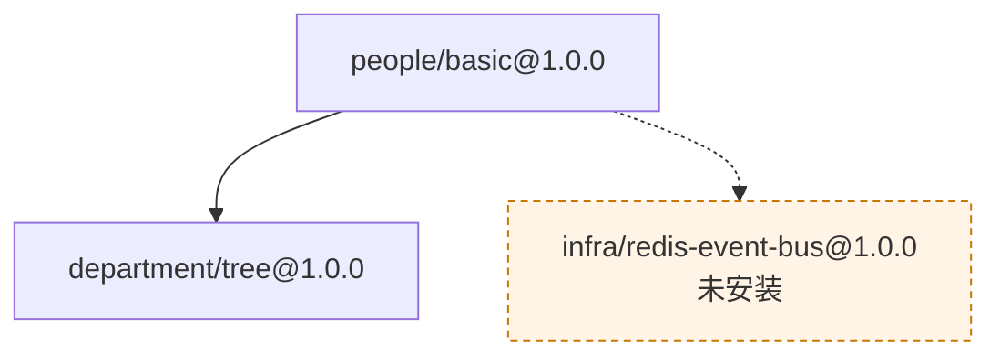
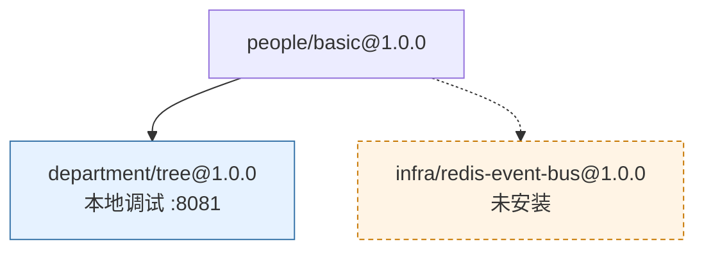

# CLI Command Reference

AGENTS.md §8 gives every command a one-line summary and a curated handful of
flag examples — enough to hold the whole command set in your head at once.
This document is the other half: every command, every flag, real generated
output. Reach for AGENTS.md when you need the shape of the whole CLI; reach
for this when you need to know exactly what one command does or exactly what
one flag changes.

Every command/flag name in this document is checked against the real binary
by `scripts/check-cli-docs.py` (`make check-cli-docs`) — a renamed or removed
flag fails the build here, not silently drifts out of date.

All examples below ran against a real project (two real components from
`tests/components/`, a real dependency edge between them) unless marked
otherwise.

---

## All the commands at a glance

Click a command name to jump to its full description.

| Group | Command | In one line | When to use it |
| --- | --- | --- | --- |
| Project and components | [`brickkit init`](#brickkit-init) | Create a project: generate the `brickkit.yaml` skeleton and `.brickkit/`, and install the AI assistant skills | Starting a new project from scratch |
| | [`brickkit skills`](#brickkit-skills) | See or refresh the AI assistant skills installed in the project | After upgrading the CLI, to update the skill files |
| | [`brickkit graph`](#brickkit-graph) | Draw the dependency graph as Mermaid text on stdout | Seeing who needs whom, and what would (not) start, before `up` |
| | [`brickkit lint`](#brickkit-lint) | Check the structure of `brickkit.yaml` and `component.yaml` offline, read-only | Right after writing or editing a YAML file — no network, no Docker needed |
| | [`brickkit new`](#brickkit-new) | Generate a new component's minimal skeleton: a `component.yaml` that already passes validation | You're developing a new component |
| | [`brickkit add`](#brickkit-add) | Pull a component and its whole dependency tree, download its artifacts, write it into `brickkit.yaml` | You want to use a component |
| | [`brickkit remove`](#brickkit-remove) | Remove a component and delete its source directory | You no longer need a component |
| | [`brickkit fetch`](#brickkit-fetch) | Download only a component's artifacts — no config change, no deployment | Calling another project's service and needing its contract |
| Running | [`brickkit up`](#brickkit-up) | Decide what runs, generate deployment files, run migrations, call the underlying engine | Actually running the project (or `--dry-run` first to see the plan) |
| | [`brickkit down`](#brickkit-down) | Stop every component (volumes are kept, so data survives) | Done for now |
| | [`brickkit status`](#brickkit-status) | Show a table of what's running | Checking what's up right now |
| Source workspace | [`brickkit sync`](#brickkit-sync) | Archive the source of components that aren't starting and restore those that are, following the "who runs" decision | You want `components/` to hold only what you're working on |
| | [`brickkit restore`](#brickkit-restore) | Put `enabled` and the source layout back to the last commit | You want to undo a `sync` |
| Marketplace | [`brickkit login`](#brickkit-login) | Log in to the marketplace interactively | Before publishing, or installing private components |
| | [`brickkit logout`](#brickkit-logout) | Revoke the token and delete the local credentials | Logging out |
| | [`brickkit publish`](#brickkit-publish) | Upload the Manifest, image reference and artifacts to the marketplace | Publishing your own component |
| Other | [`brickkit version`](#brickkit-version) | Print the version | Checking which version you have installed |
| | [`brickkit completion`](#brickkit-completion) | Print a shell auto-completion script | You want Tab to complete command and flag names in your terminal |

There are also [two global flags](#two-global-flags-on-every-command), available on every command.

---

## brickkit init

**Syntax:** `brickkit init <project-name> [flags]`

Creates `brickkit.yaml`, `components/`, and `.brickkit/` in the current
directory, appends the platform's own rules to `.gitignore`, and installs
the AI assistant skills (`.claude/skills/`, `AGENTS.md`).
The project name is required — no default — and must be lowercase
letters/digits/hyphens, starting and ending with a letter or digit (it feeds
both the Docker network name and the K8s namespace).

The installed skills only cover the things common sense gets wrong —
reserved variables, the health-check prohibition, top-down `enabled` — and
never restate a flag's exact syntax; they point at `--help` for that
instead. They travel with the project in Git and are shared by the whole
team; `brickkit skills update` refreshes them after a CLI upgrade. `init`
never touches your own `CLAUDE.md` — that file is yours.

If the project also puts component source under version control (removing
`components/` from `.gitignore`), `init` additionally installs a pre-commit
hook that catches "the archive state changed but `enabled` didn't come with
it" — but only when the project root **is** the Git repo
root; a project nested inside someone else's repo needs `--hooks` to install
it explicitly.

**Flags**

| Flag | Default | What it does |
| --- | --- | --- |
| `--no-skills` | off | Skip installing the AI assistant skills |
| `--hooks` | off | Only install the pre-commit hook (for retrofitting an existing project, or one nested inside another repo) |

**Example**

```
$ brickkit init demo-shop
✅ 项目已初始化：demo-shop
   📁 brickkit.yaml        项目配置
   📁 components/          组件源码（已配为本地安装源 local-dev）
   📁 .brickkit/           CLI 工作目录
   📁 .claude/skills/      AI 助手技能（4 个）
   📁 AGENTS.md            AI 助手项目导读
   💡 组件源码要跟项目一起进 Git 的话：brickkit init --hooks 装上提交前检查

下一步：
  brickkit add --local               把 components/ 下的组件全加进来
  brickkit add people/basic@1.0.0    从安装源添加组件
  brickkit up                        一键启动
```

```bash
brickkit init demo-shop --config brickkit.prod.yaml   # initialize a non-default environment file
brickkit init demo-shop --no-skills                   # skip the AI assistant skills
brickkit init --hooks                                 # retrofit just the pre-commit hook onto an existing project
```

---

## brickkit skills

**Syntax:** `brickkit skills [flags]` / `brickkit skills <status|update> [flags]`

Manages the AI assistant skills a project's `init` installed. They describe
**this CLI version's** behavior, so a CLI upgrade means they need a refresh.
Bare `brickkit skills` and `brickkit skills status` are read-only and
identical; `brickkit skills update` installs anything missing and refreshes
anything stale.

**A hand-edited skill file is never overwritten.** `update` lists it and
skips it. To discard a local edit, delete the file and run `update` again —
there's deliberately no `--force`: deleting the file is already an
unambiguous action, and a force flag would only add one more way to
accidentally clobber someone's edit. Like `init`, `skills` never touches
your own `CLAUDE.md`.

**It also works inside a standalone component repo.** In a directory with a `component.yaml` and no `brickkit.yaml` (the platform asks for "one component, one repository", so that's usually where a component author works), `skills` manages just the `brickkit-component` skill — the project guide and the assemble, deploy and troubleshoot skills make no sense there, so they aren't installed, and the repo's own `AGENTS.md` is never touched. The order it checks is: `brickkit.yaml` first (if present it's treated as a project, exactly as before), then `component.yaml`, and if neither exists it errors rather than writing files into someone else's directory. It also creates a `.brickkit/skills.lock` in the repo, recording "who wrote this file last", to be committed along with the skill file.

```
$ brickkit skills update
📦 组件仓库（有 component.yaml、没有 brickkit.yaml）：只管理 brickkit-component 技能
✅ AI 助手技能已更新
   已写入 1 个：
     .claude/skills/brickkit-component/SKILL.md
```

**Subcommands**

| Subcommand | What it does |
| --- | --- |
| `status` | Show every skill file's state (installed, missing, stale, hand-edited) — read-only |
| `update` | Install what's missing, refresh what's stale, skip what's been hand-edited |

**Example**

```bash
brickkit skills           # see what's installed and whether anything's out of date
brickkit skills update    # bring everything up to the current CLI version
```

---

## brickkit graph

**Syntax:** `brickkit graph [flags]`

Draws the project's dependency graph — which component needs which — as a diagram, so you can see what `brickkit.yaml` and the components' Manifests add up to instead of piecing it together from a dozen `component.yaml` files. The diagram is written in Mermaid, a plain-text notation for diagrams: the command prints text, and GitHub turns that text into a picture (see "Viewing it" below).

It reads what `up --dry-run` reads — `brickkit.yaml` and every component's Manifest — and does the same two steps: resolve the dependency graph, then decide who starts (AGENTS.md §5.4). Then it stops: no image-permission check, no migrations, no environment-variable injection, no deployment files, no Docker or Kubernetes. Like `up --dry-run`, it fetches over the network the Manifest of a market or Git component that isn't cached yet, so `graph` doesn't promise to work offline (`lint` does). And when the dependency graph can't be resolved — a required dependency that no source has, say — it fails with the error `up` gives, not a new one.

**What the picture shows**

| On the picture | It means |
| --- | --- |
| A box labelled `id@version` | One component. If it's `local: true`, a second line reads `本地调试` (the CLI's wording for "local debugging"), followed by `:<port>` when `localPort` is written in `brickkit.yaml`. With no `localPort` the port is only chosen later, by `up`, so the picture shows none rather than invent one |
| Solid arrow `A --> B` | A has a **required** dependency on B |
| Dashed arrow `A -.-> B` | A has an **optional** dependency on B. If no source has B it's still drawn, as an orange dashed box labelled `id@version` and `未安装` ("not installed") — the same fact `up --dry-run` prints as `（弱，未安装）`, and the answer to "why isn't this address injected?" |
| Grey box | A component that won't start this time: turned off with `enabled: false`, or nothing above it needs it (AGENTS.md §5.4) |
| Light-blue box | A `local: true` component that would start |
| A titled box, `外壳：id@version` ("shell: …"), around some components | Those components are folded into another component's process with `servedBy` (AGENTS.md §5.7), and the title names that shell. The shell itself is an ordinary box outside it. If the shell isn't in the project the group is drawn anyway — reporting a missing target is `up`'s job |

Arrows are drawn whether or not the component at the other end starts: the picture shows the structure you *declared*, and colour shows whether each part starts, so the two never get mixed up.

**Output is pure Mermaid.** Standard output holds the diagram and nothing else — not one extra character — so redirecting it to `graph.mmd` gives a valid file. Everything that isn't the diagram goes elsewhere: warnings from resolving the graph (a missing optional dependency, say) go to stderr; the note that `--ignore-served-by` was in effect is a Mermaid comment line (`%% …`), which renderers skip; and a project with no components prints `graph TD` and one comment line (`%% 当前项目没有组件`, "the project has no components"). The same configuration always draws byte-identical text, dependencies before the components that need them, so a saved `.mmd` file diffs cleanly in Git. (Inside the text, a node's ID is the component's versioned service name with `-` turned into `_` — `demo-hello-1-0-0` becomes `demo_hello_1_0_0`; only the labels are meant for reading.)

**Viewing it.** GitHub draws a `.mmd` (or `.mermaid`) file directly, and draws a fenced code block whose language is `mermaid` inside a Markdown file. Pasted into Markdown *without* that fence, the diagram is just text.

**What it doesn't do, on purpose.** No `--output` flag, no HTML or SVG, no filtering down to one component's neighbourhood. GitHub already draws Mermaid for free, so a renderer of our own would be one more thing to maintain forever (AGENTS.md §4.1), and a shell redirect already does what `--output` would.

**Flags**

| Flag | Default | What it does |
| --- | --- | --- |
| `--ignore-served-by` | off | Clear every `servedBy` declaration in memory and draw again: the components a shell had absorbed show up as ordinary standalone boxes, each as it would stand on its own. Same meaning as `up --ignore-served-by`, and like there, never written back to `brickkit.yaml`. The output gets a `%%` comment line saying it was in effect |

**Example** (the project from the `up --dry-run` example above: `people/basic` needs `department/tree` and has an optional dependency no source provides)

```
$ brickkit graph > graph.mmd
⚠️ 警告：弱依赖缺失：infra/redis-event-bus@1.0.0
   影响组件：people/basic@1.0.0
   原因：该组件在所有安装源中均未找到
   影响：该组件的环境变量 INFRA_REDIS_EVENT_BUS_ENDPOINT 不会被注入
   💡 弱依赖降级由组件自行处理；如需启用，请确认该组件已发布并可从安装源获取
```

The warning is on stderr, so it stays on your screen while the diagram goes into the file. This is `graph.mmd` — and, since GitHub draws a fenced `mermaid` block, also the picture:



The solid arrow is the required dependency; the dashed one, ending in the orange box, is the optional dependency nothing provides. Now write `local: true` and `localPort: 8081` on `department/tree` in `brickkit.yaml`:

```yaml
components:
  - id: department/tree
    version: 1.0.0
    local: true
    localPort: 8081
  - id: people/basic
    version: 1.0.0
```

and its box gets the second line and the light-blue style:



```bash
brickkit graph > graph.mmd                   # save it — GitHub draws .mmd files
brickkit graph --ignore-served-by            # each component as if it stood alone
brickkit graph --config brickkit.prod.yaml   # a non-default environment file
```

---

## brickkit lint

**Syntax:** `brickkit lint [flags]`

Checks that the YAML files you write are shaped correctly — required fields present, values of the right type, no misspelled key, versions written `major.minor.patch`, ports in range — without starting anything: no network, no Docker or Kubernetes, and it writes no file. It answers "did I write this file right?" in about a second, instead of you finding out through `add` or `up`.

It adds no rules of its own: every check is one the platform already makes somewhere when it reads these files — in `add`, `up`, `publish` or the marketplace. What was missing was a way to run them on their own, and on two things nothing could check by itself: a component repository (a `component.yaml`, no `brickkit.yaml`), and a local component you already added — `add --local` skips a version that's already in `brickkit.yaml`, so a typo introduced by a later edit only surfaces when `up` runs, with an engine and the whole cascade.

**Two modes**, picked by what's in the current directory (the same rule `brickkit skills` uses; when both files are there it counts as a project):

- **A project** — a `brickkit.yaml` (or whichever file `--config` names) is there. It checks `brickkit.yaml` first, then every `component.yaml` under the project's local install sources (`type: local`), that is `<scope>/<name>/component.yaml`, whether or not you ever added that component. `.archived/` isn't checked: that's the copy `sync` put away. For each one it also compares the directory name with the `metadata.id` inside — the same match `add --local` relies on. If `brickkit.yaml` itself fails, it skips that second step and says so: with a broken config there's no telling where the local sources are.
- **A standalone component repository** — a `component.yaml` and no `brickkit.yaml`. It checks that one file.

**What it checks.** The structural rules those commands already apply: required fields, types, unknown fields (a misspelled key is rejected outright, and the message guesses which one you meant), version format, port ranges. Plus two kinds of **warning**: a key misspelled *inside* a `configSchema` property (`defualt` for `default`), which would never take effect; and a `configSchema` key that, turned into an environment variable, collides with a reserved one (AGENTS.md §5.2). The second is a superset of what `up` warns about: `up` only meets it for a key that has a default or is overridden in `config`, while `lint` checks every key the schema declares — the same range the marketplace applies at publish time. It can't see `envPrefix` (the project chooses that in `brickkit.yaml`, which a component repository doesn't have), so a collision that depends on it stays with `up`.

**What it doesn't check, and why**

- Whether a dependency can be found in some source, or a `servedBy` target exists. Both need the rest of the project's Manifests — over the network, for market and Git components — and that isn't "offline, in a second". They're what `brickkit up --dry-run` is for, since it resolves the graph anyway.
- The *values* in a `configSchema` — an `enum`, a `minimum`. The platform declares them for the reader and never enforces them (AGENTS.md §9.12: it's a spec sheet, not a gate).
- A market or Git component's Manifest. It was validated when you added it; `lint` only looks at files you can edit yourself, the local sources.

**Exit status, and where the output goes.** The report goes to stdout, because it's what the command produces: a `✅ <path>` line for each clean file, the error and warning blocks for the rest, then a summary line, `📋 检查了 N 个文件：M 个有错误，K 条警告` (N files checked, M with errors, K warnings). Exit status is `0` when nothing is wrong or there are only warnings, and `1` when any file has an error; with `--strict` a warning counts too, which is what a CI gate wants. A failing run ends with one summary error on stderr, code `LINT_FAILED` (in the JSON log line right after it) — see [Error codes](10-error-codes.md#lint_failed).

An editor can catch the structural problems as you type: see [Wire up your editor](../00-quick-start.md#wire-up-your-editor).

**Flags**

| Flag | Default | What it does |
| --- | --- | --- |
| `--strict` | off | Warnings fail the run too (exit status `1`), for CI gates |

**Example** (the project from the `add` example above: `department/tree` and `people/basic` in `components/`)

A clean run:

```
$ brickkit lint
✅ brickkit.yaml
✅ components/department/tree/component.yaml
✅ components/people/basic/component.yaml

📋 检查了 3 个文件：0 个有错误，0 条警告
```

Now misspell `dependencies` as `dependancies` in `components/people/basic/component.yaml`:

```
$ brickkit lint
✅ brickkit.yaml
✅ components/department/tree/component.yaml
❌ 错误：component.yaml 校验失败
   文件：components/people/basic/component.yaml
   dependancies：未知字段（第 35 行），是不是想写 dependencies？
   建议：完整字段参考见 docs/zh/06-architecture/07-component-yaml-reference.md（英文版把 zh 换 en）

📋 检查了 3 个文件：1 个有错误，0 条警告
❌ 错误：结构检查未通过
   已检查：3 个文件
   有错误：1 个文件
   建议：按上面逐条列出的位置修改，再执行 brickkit lint
```

Everything down to the `📋` line is the report, on stdout; the last block is the summary error on stderr, and exit status is `1`. The report names the file and the line and guesses the key you meant.

In a standalone component repository (here a copy of `demo/hello`'s `component.yaml`), it says which mode it's in and checks the one file:

```
$ brickkit lint
📦 组件仓库（有 component.yaml、没有 brickkit.yaml）：只检查 component.yaml
✅ component.yaml

📋 检查了 1 个文件：0 个有错误，0 条警告
```

A warning alone doesn't fail the run. Misspell `default` as `defualt` inside the `greeting` property of its `configSchema`, and `brickkit lint` prints the block below and exits `0`; with `--strict` it exits `1`:

```
$ brickkit lint --strict
📦 组件仓库（有 component.yaml、没有 brickkit.yaml）：只检查 component.yaml
⚠️ 警告：configSchema 里有配置项声明的键不会生效
   来源：component.yaml
   configSchema.properties.greeting.defualt：未知字段（第 31 行），是不是想写 default？
   影响：这些键会被解析器静默丢弃——比如 default 拼错，组件就拿不到默认值
   💡 configSchema 是说明书，每个配置项只认固定的几个键（清单见 component.yaml 字段参考）；JSON Schema 里别的关键字（format、examples……）写了也没有任何效果

📋 检查了 1 个文件：0 个有错误，1 条警告
❌ 错误：结构检查未通过
   已检查：1 个文件
   警告：1 条（--strict：警告也算失败）
   建议：按上面逐条列出的位置修改，再执行 brickkit lint
```

```bash
brickkit lint                                # check everything checkable in this directory
brickkit lint --strict                       # warnings fail the run too (CI gate)
brickkit lint --config brickkit.prod.yaml    # a non-default environment file
```

---

## brickkit new

**Syntax:** `brickkit new <scope>/<name> [flags]`

Generates a component's minimal skeleton: a `component.yaml` that already
passes `Parse` + `Validate`, so a dry run doesn't turn up an invalid-YAML
surprise on the very first try. With the `--contract` flag it also writes a
placeholder contract file, registered under `artifacts`. Nothing else — no
Dockerfile, no source code in any language. The platform is
language-agnostic and doesn't pick one for you; for a real worked example,
see [Writing a Go component](../04-go-component-template.md) or
[Build your first component](../03-guide/11-build-your-own.md).

By default it writes to `components/<scope>/<name>/` — the exact layout a
`local`-type source already scans (`<scope>/<name>/component.yaml`), and the
same place a component's existing source gets cloned to. The `--path` flag
writes somewhere else instead, with no `<scope>/<name>` nesting — that
directory becomes the component's own repository root ("one component, one
repository"). Either way, the target directory must not already exist; `new`
never overwrites.

It never runs `brickkit add` for you — writing to `brickkit.yaml` is a
separate, reviewable step — and it never touches `.claude/skills/`: inside a
project the skills are already installed by `init`, and for a standalone
repository you run `brickkit skills update` yourself once there's a
`component.yaml` to detect.

**Flags**

| Flag | Default | What it does |
| --- | --- | --- |
| `--path <dir>` | `components/<scope>/<name>/` | Write here instead, with no extra nesting |
| `--contract <format>` | (none) | `openapi` or `proto`: also write a placeholder contract file and register it under `artifacts` |

**Example**

```
$ brickkit new demo/widget
✅ 已生成组件骨架：demo/widget
   📄 components/demo/widget/component.yaml

下一步：
  改完骨架里的 TODO
  brickkit add --local               把它加进 brickkit.yaml（本地安装源里能扫到它的话）
  brickkit up --dry-run               校验能不能通过
```

```yaml
# component.yaml
# demo/widget —— 由 brickkit new 生成的骨架
# 下面每一处 TODO 都要改成真的；结构本身已经能通过 brickkit up --dry-run 的校验
apiVersion: brickkit/v1
kind: Component

metadata:
  id: demo/widget
  name: widget # TODO：改成人看的展示名
  version: 0.1.0
  description: TODO：一句话说清楚这个组件做什么

deployment:
  type: container
  image: demo/widget:0.1.0 # TODO：换成真实构建出来的镜像（本地开发前先 docker build）
  port: 8080 # TODO：换成组件实际监听的端口

healthCheck:
  type: http
  path: /healthz
  # 冷启动超过默认的 60 秒（很重的 Spring Boot / Django 预加载 / .NET 首次 JIT 等）
  # 要写 startPeriodSeconds，否则 K8s 下会永久 CrashLoopBackOff
```

`--contract openapi` additionally writes `api/openapi.yaml`:

```yaml
openapi: 3.0.3
info:
  title: demo/gadget
  version: 0.1.0
  description: TODO：这个组件对外提供的 API
paths: {}
```

...and registers it:

```yaml
artifacts:
  - type: api-contract
    format: openapi
    files:
      - api/openapi.yaml
```

`--contract proto` writes `api/service.proto` and registers `format: proto`
instead, with the equivalent `files: [api/service.proto]`.

Running it again on a directory that already exists refuses rather than
overwriting:

```
$ brickkit new demo/widget
❌ 错误：目标目录已存在
   目录：components/demo/widget
   建议：
   1. 如果是误操作，请先删除或重命名该目录
   2. 想写到别的地方，用 --path 指定
```

```bash
brickkit new demo/widget --contract openapi        # also scaffold an OpenAPI contract placeholder
brickkit new demo/widget --contract proto          # also scaffold a proto contract placeholder
brickkit new demo/widget --path ../widget-repo     # write elsewhere — that directory becomes the repo root
```

---

## brickkit add

**Syntax:** `brickkit add [<component-id>[@exact-version]] [flags]`

Recursively resolves and installs a component and its dependency tree:
fetches the Manifest from the first source that has it (checked in the
order `sources:` lists them), recurses into `dependencies.components`, errors
on an unreachable required dependency (warns and continues on an
unreachable optional one), downloads `artifacts` into
`.brickkit/artifacts/<versioned-service-name>/`, and writes the result into
`brickkit.yaml` — **without** writing an `enabled` field, so the component
follows top-down inheritance by default (AGENTS.md §5.4).

Omit the version and the CLI resolves one for you: a `local`/`git` source's
single `component.yaml` is definitionally "the latest" from that source; a
`market` source excludes non-installable states (`draft`, `blocked`) and
takes the highest remaining version number. Sources are tried in
declaration order — the first one that has the component wins, versions are
never compared across sources. What's written to disk is always an exact
version; the CLI never accepts (and never writes) a range like `^1.0.0` —
only the version argument itself is optional, not the precision of what
ends up in the config (AGENTS.md §9.2).

Adding a second version of an already-installed component prompts for
confirmation before letting the two coexist (skipped non-interactively with
`--yes`).

How to clone component source (`--repo` / `--repo-all`) and manage it afterwards is in the hands-on walkthrough [Manage component source](../03-guide/08-component-source.md).

**Flags**

| Flag | Default | What it does |
| --- | --- | --- |
| `--local` | off | Add every component found in this project's `local`-type sources at once. Takes no component ID and can't combine with `--repo`/`--repo-all`. Already-configured components are skipped; a same-ID-different-version conflict is skipped with its own notice rather than silently deciding for you. One unresolvable component aborts the whole batch — `brickkit.yaml` is left completely untouched, not partially updated |
| `--repo` | off | Additionally clone this component's full Git repository into `components/` (open-source components only) |
| `--repo-all` | off | Clone the Git repository of every open-source component in the resolved dependency tree (closed-source ones are named and skipped) |
| `-y`, `--yes` | off | Non-interactive: answer every confirmation prompt automatically (for CI/CD) |

**Example**

```
$ brickkit add people/basic@1.0.0 --yes
📦 添加 people/basic@1.0.0
   ├── Manifest ✅
   ├── 依赖 department/tree@1.0.0 ✅ 已拉取（artifacts 2 个文件）
   └── artifacts ✅（2 个文件）
⚠️ 警告：弱依赖缺失：infra/redis-event-bus@1.0.0
   影响组件：people/basic@1.0.0
   原因：该组件在所有安装源中均未找到
   影响：该组件的环境变量 INFRA_REDIS_EVENT_BUS_ENDPOINT 不会被注入
   💡 弱依赖降级由组件自行处理；如需启用，请确认该组件已发布并可从安装源获取
✅ 已写入 brickkit.yaml（2 个组件）
📁 已下载 artifacts 到 .brickkit/artifacts/（4 个文件）
```

Note what this real run shows: a missing **required** dependency
(`department/tree`) resolves silently and successfully; a missing
**optional** one (`infra/redis-event-bus`) only warns, and the warning
states exactly which environment variable won't be injected as a result —
this is the "not injected at all, never an empty string" behavior AGENTS.md
§5.3 and §9.13 argue for, visible at the moment it actually takes effect.

```bash
brickkit add erp/backend@1.0.0 --repo-all   # clone the source of every open-source dependency
brickkit add --local                        # add every component a local source declares, all at once
```

---

## brickkit remove

**Syntax:** `brickkit remove <component-id>[@version] [flags]`

Removes a component: refuses if another component still declares it as a
**required** dependency (naming the caller), otherwise removes its
`brickkit.yaml` entry, clears any `resources[].bindings` pointing at it,
clears its Manifest/artifact cache, and deletes its source directory —
`components/<scope>/<name>/` and any archived copy under
`components/.archived/<scope>/<name>/` — unless another installed version
of the same ID still needs that source. A version must be given explicitly
when more than one version of the same component is installed.

A hands-on walkthrough with real output: [Manage component source](../03-guide/08-component-source.md) — being blocked by a dependent, source that couldn't be found again, and git submodules, each one actually triggered.

**Flags**

| Flag | Default | What it does |
| --- | --- | --- |
| `--force` | off | Delete the source directory anyway, even when it isn't a Git repository, or has uncommitted changes, or has commits never pushed anywhere — normally each of those blocks the deletion since it would otherwise be unrecoverable |

**Example**

```
$ brickkit remove department/tree
❌ 无法移除 department/tree
   版本：1.0.0
   以下组件强依赖它：people/basic@1.0.0
   建议：请先移除依赖方
```

```bash
brickkit remove people/basic@1.0.0            # specify the version when more than one is installed
brickkit remove people/basic@1.0.0 --force    # delete the source even with uncommitted/unpushed changes
```

---

## brickkit fetch

**Syntax:** `brickkit fetch <component-id>[@version] [flags]`

Downloads a component's declared artifacts (`.proto`, an OpenAPI document,
an SDK — whatever the Manifest's `artifacts` section lists) **without**
installing the component into this project — no `brickkit.yaml` write, no
deployment, no dependency-graph involvement. This is the cross-project
case: you need another team's contract to generate a client against, but
that service is deployed by their project, not yours, and adding it as a
dependency here would make this platform try to deploy a second copy of it.

Artifacts land at `.brickkit/artifacts/<versioned-service-name>/<type>/...`
— the exact same location `brickkit add` uses, and by the same default,
committed and shared with the team. Omit the version and the CLI resolves
the latest from the source, the same way `add` does.

**Example**

```bash
brickkit fetch infra/notifier@1.0.0   # fetch one exact version's artifacts
brickkit fetch infra/notifier         # fetch the latest version's artifacts
```

---

## brickkit up

**Syntax:** `brickkit up [flags]`

Turns the declaration into running containers, in one pass: reads
`brickkit.yaml` and every component's Manifest → cascade decision (top-down:
a top-level component with no `enabled` written runs by default, everything
below follows whoever above it needs it, AGENTS.md §5.4) → checks required
dependencies (errors if missing) and optional ones (warns, and skips
injecting that dependency's `*_ENDPOINT` entirely) → topological sort for
start order → generates `docker-compose.yaml` (or the K8s manifests),
injecting environment variables and merging resource quotas → generates
`local-debug.<versioned-service-name>.env` for any `local: true` component →
checks image-pull permissions (prompts `docker login` if unauthorized) →
invokes the underlying engine, running any declared migration in a one-shot
container first and blocking the main service on its failure.

Changing a component's version in `brickkit.yaml` **is** an upgrade — `up`
pulls the new Manifest and artifacts and runs the same compatibility checks
as a fresh install.

**Flags**

| Flag | Default | What it does |
| --- | --- | --- |
| `--dry-run` | off | Generate the deployment files and print the plan (cascade decision, start order, resource-binding warnings, dependency graph) without starting anything. On an upgrade, also prints a summary of what changed |
| `--context` | (from `deploy.context`) | Override which kubeconfig context to deploy to for this one run. K8s only — meaningless (and rejected) under `deploy.target: docker` |
| `--ignore-served-by` | off | Clear every `servedBy` declaration in memory and run again — a formerly-absorbed member gets generated and started as a standalone component this time, for machine-checking the design principle that every component must be able to `brickkit up` on its own. Never writes back to `brickkit.yaml`; stack it with `--dry-run` to only inspect the generated output, or run it alone for a real standalone start |

**Example** (real project: `people/basic` depending on `department/tree`, a
missing optional dependency, and no `resources:` bound yet)

```
$ brickkit up --dry-run
🚀 启动项目 demo-shop（deploy.target: docker）
⚠️ 警告：弱依赖缺失：infra/redis-event-bus@1.0.0
   影响组件：people/basic@1.0.0
   原因：该组件在所有安装源中均未找到
   影响：该组件的环境变量 INFRA_REDIS_EVENT_BUS_ENDPOINT 不会被注入
   💡 弱依赖降级由组件自行处理；如需启用，请确认该组件已发布并可从安装源获取
📋 组件状态计算：
   ✅ department/tree@1.0.0  启动（people/basic 需要）
   ✅ people/basic@1.0.0     启动（顶层）

⚠️ 警告：资源依赖未满足（--dry-run 不阻断）
   department/tree@1.0.0：需要 kind: database、engine: postgresql（brickkit.yaml 的 resources 中未声明）
   people/basic@1.0.0：需要 kind: database、engine: postgresql（brickkit.yaml 的 resources 中未声明）
   建议：
   1. 生成的部署文件里**不会有**这些组件的资源连接变量（DATABASE_* 等）
   2. 在 brickkit.yaml → resources 中声明并绑定后再 up；不加 --dry-run 时这里会直接阻断
📋 启动顺序（拓扑排序）：
   1. department-tree-1-0-0  无依赖
   2. people-basic-1-0-0     ← 依赖 1

可独立启动：department-tree-1-0-0（无依赖）
最长依赖链（2 层）：department-tree-1-0-0 → people-basic-1-0-0

依赖图：
   people/basic@1.0.0 → department/tree@1.0.0
                      → infra/redis-event-bus@1.0.0（弱，未安装）
📄 已生成：.brickkit/generated/docker-compose.yaml

🔧 启动前会执行的数据库迁移（失败则该组件不会启动）：
   department/tree@1.0.0  /app/department-tree migrate
   people/basic@1.0.0  python -m app.main migrate

💡 --dry-run 只生成文件，未启动任何组件
```

Every line in this output carries its own reasoning — `department/tree`
says `（people/basic 需要）`, `people/basic` says `（顶层）` — exactly the
"every start decision states its reason" property AGENTS.md §5.4 describes.
Note too that an unmet resource binding only **warns** under `--dry-run`; a
real `up` blocks on it (this is what the suggestion's second line is
telling you).

```bash
brickkit up --config brickkit.prod.yaml   # act on a non-default environment file
brickkit up --context prod-cluster        # target a specific kubeconfig context for this run (k8s only)
brickkit up --ignore-served-by --dry-run  # verify: can these components still generate standalone without servedBy?
```

---

## brickkit down

**Syntax:** `brickkit down [flags]`

Stops every component. Stop order is the reverse of start order (dependents
before dependencies) — the underlying engine handles this, not the CLI. To
stop only some components, write `enabled: false` on the ones you want
down and run `brickkit up` again: they drop out of the generated deployment
file and the engine removes their containers as a side effect of the
regenerated file no longer declaring them — same end state as "stop just
these," except the intent is now recorded in `brickkit.yaml`, so the next
`up` won't bring them back by surprise.

**`down` never deletes volumes — database data always survives it.** Wipe
it deliberately with `docker volume rm` or `docker compose down -v` if you
actually want to.

**Flags**

| Flag | Default | What it does |
| --- | --- | --- |
| `--context` | (from `deploy.context`) | Same override as `up --context` — target a specific kubeconfig context for this run (k8s only) |

**Example**

```bash
brickkit down
brickkit down --context prod-cluster   # tear down against a specific cluster
```

---

## brickkit status

**Syntax:** `brickkit status [flags]`

Shows every component's running state. The CLI keeps no state of its own —
this always queries the underlying engine live (`docker compose ps
--format json` under Docker). Output covers running components, components
not running (with why), `local: true` components, and base-resource
reachability.

**Example**

```
$ brickkit status
📊 项目状态：demo-shop（deploy.target: docker）

❌ 未在运行（2 个组件）
 ┌─────────────────┬───────┬────────┐
 │ 组件            │ 版本  │ 状态   │
 ├─────────────────┼───────┼────────┤
 │ department/tree │ 1.0.0 │ 未创建 │
 │ people/basic    │ 1.0.0 │ 未创建 │
 └─────────────────┴───────┴────────┘
   看日志定位：docker compose -p brickkit-demo-shop logs <服务名>

📋 没有正在运行的组件（可能已经 brickkit down 过）
   重新启动：brickkit up
```

---

## brickkit sync

**Syntax:** `brickkit sync [flags]`

Bidirectionally moves component source between `components/` and
`components/.archived/`, using **exactly the same decision `up` would make**:
what would start this run stays (or moves back) in the active directory,
what wouldn't start moves into the archive. It never touches a running
container and never changes what `up` would start — it only moves
directories. Narrow the scope with `enabled: false` in `brickkit.yaml`
(top-down, AGENTS.md §5.4) and `sync` follows along. Each directory it
touches moves whole, `.git` included, so ordinary Git commands keep working
on an archived component. Only components already declared in
`brickkit.yaml`, with source already present, are ever touched. There's no
`--dry-run` — the move is fully reversible by running it again.

A hands-on walkthrough with real output: [Manage component source](../03-guide/08-component-source.md) — archiving, activating, and how it works with `enabled`.

**Example**

```
$ brickkit sync
📂 工作区无需整理
   components 下没有需要归档或激活的组件源码
```

---

## brickkit restore

**Syntax:** `brickkit restore [flags]`

Resets each component's `enabled` field in `brickkit.yaml` back to its
value at the last commit (dropping the field entirely if the commit didn't
have it), then lets the source-directory layout follow that reset the same
way `sync` would. This exists for projects that commit component source
alongside the project (`components/` removed from `.gitignore`): on those
projects, `sync`'s directory moves land in the diff, and "flipped a few
top-level components off locally, ran `sync`, forgot to flip them back
before committing" is a recurring mistake this closes.

It only ever touches `enabled`, one entry at a time:

- present in both the working tree and the last commit → reset to the
  committed value
- added in the working tree since the last commit (a fresh `add`, or a
  version bump) → left alone entirely
- present in the last commit but missing from the working tree → **never**
  added back — this is not `git revert`

Every value it's about to overwrite is printed before it changes anything.

A hands-on walkthrough with real output: the last section of [Manage component source](../03-guide/08-component-source.md), from making the mistake and being stopped by the hook, to `restore` fixing it.

**Flags**

| Flag | Default | What it does |
| --- | --- | --- |
| `--check` | off | Only check whether what's about to be committed (the yaml and the directory layout) is self-consistent — change nothing, exit non-zero if it isn't. This is what the pre-commit hook (`brickkit init --hooks`) calls |

**Example**

```bash
brickkit restore           # reset enabled and the source layout to the last commit
brickkit restore --check   # check only; non-zero exit means this commit would be inconsistent
```

---

## brickkit login

**Syntax:** `brickkit login [flags]`

Logs in to the marketplace: prompts for a username, prompts for a password
(hidden input), calls the marketplace's auth API, and on success writes the
token to `.brickkit/credentials` (mode `0600`). The marketplace address
comes from whichever `sources:` entry has `type: market`; with more than
one configured, `--market` picks which. Token precedence is
`.brickkit/credentials` over `sources.authToken`. The CLI checks the
token's `expiresAt` before every use and asks you to log in again once it's
expired — it never refreshes automatically.

**Flags**

| Flag | Default | What it does |
| --- | --- | --- |
| `--market` | (the configured `market` source) | Which marketplace to log in to, when more than one is configured |
| `--username` | (interactive prompt) | Username, non-interactively |
| `--password-stdin` | off | Read the password from stdin instead of prompting (for CI — no echo, never lands in shell history) |

**Example**

```bash
brickkit login
brickkit login --market https://market.example.com/api/v1
echo "$PASSWORD" | brickkit login --username ci-bot --password-stdin
```

---

## brickkit logout

**Syntax:** `brickkit logout [flags]`

Two steps: revoke the token server-side (`POST /auth/logout`), then delete
`.brickkit/credentials` locally. **The local deletion always happens, even
if the marketplace is unreachable** — otherwise a network blip leaves
someone believing they've logged out while the credential still sits on
disk; an unreachable marketplace only produces a warning, noting the token
stays valid until it naturally expires. Already logged out? `logout` does
nothing, and that's not a failure.

**Flags**

| Flag | Default | What it does |
| --- | --- | --- |
| `--keep-remote` | off | Delete the local credential only — skip calling the marketplace (for working offline) |

**Example**

```bash
brickkit logout
brickkit logout --keep-remote   # local-only, for offline use
```

---

## brickkit publish

**Syntax:** `brickkit publish [flags]`

Publishes a component to the marketplace: confirms you're logged in
(`.brickkit/credentials` or `sources.authToken`), reads and validates
`component.yaml` from `--path`, confirms the image reference resolves and
every file `artifacts` declares actually exists, creates the version as
`draft`, uploads the artifacts, then flips it to `stable`, and finally
applies `--visibility` if given. The three-step draft→upload→stable
sequence is deliberate: the marketplace validates "every declared artifact
file is actually present" at the stable transition, and going through
`draft` first is what guarantees you never end up with a version that's
`stable` but missing files. `--path` accepts an archived component
directory too (e.g. `./components/.archived/erp/backend`).

**Flags**

| Flag | Default | What it does |
| --- | --- | --- |
| `--path` | `.` | The component's source directory (containing `component.yaml`) |
| `--market` | (the configured `market` source) | Which marketplace to publish to |
| `--visibility` | (whatever the marketplace already has it set to) | `public` or `private` |
| `--changelog` | (none) | Free-text release notes for this version |
| `--git-url` | (the directory's own `origin` remote) | The Git repository URL for an open-source component |
| `--source-type` | (inferred from the directory's `git remote`) | `git` (open source) or `registry` (closed source) |
| `--sign` | off | Sign the component with cosign before publishing |
| `--key` | `cosign.key` | The cosign private key to sign with (only meaningful with `--sign`) |
| `--signed-by` | (none) | A human-readable signer identity, e.g. `release-bot@example.com` |
| `--public-key-ref` | (`--key`'s path, `.key` → `.pub`) | The public-key reference recorded alongside the signature |
| `--no-pin-digest` | off (digest-pinning is on by default) | Publish with the image reference left as a mutable tag instead of resolving it to a digest first — see AGENTS.md's closed-source hardening guide for exactly what this trades away |

**Example**

```bash
brickkit publish --path ./components/people/basic
brickkit publish --path ./components/people/basic --visibility private
brickkit publish --path ./components/people/basic --changelog "added a status field to the person record"
brickkit publish --path ./components/people/basic --market https://market.example.com/api/v1 --visibility private --changelog "added X"
brickkit publish --path ./components/people/basic --git-url https://github.com/org/people-basic --sign --key cosign.key --signed-by release-bot@example.com --public-key-ref keys/vendor.pub
```

---

## brickkit version

**Syntax:** `brickkit version [flags]`

Prints the CLI version, the supported Manifest `apiVersion`, and the
supported deploy targets.

**Flags**

| Flag | Default | What it does |
| --- | --- | --- |
| `-v`, `--verbose` | off | Also print the Git commit hash and build timestamp |

**Example**

```
$ brickkit version
BrickKit CLI v0.1.0
Supported manifest version: brickkit/v1
Supported deploy targets: docker, k8s
```

```bash
brickkit version --verbose   # also print the git commit and build time
```

---

## brickkit completion

**Syntax:** `brickkit completion <shell>` — `<shell>` is one of `bash`, `zsh`, `fish`, `powershell`

Prints the auto-completion script for that shell to standard output. Once installed, pressing Tab in your terminal completes command names and flag names, each candidate with a one-line description: type `brickkit up --` and press Tab, and it lists `--dry-run`, `--context` and the rest. It does **not** complete component IDs — pressing Tab after `brickkit remove` won't list the components in your project.

This is a command the cobra framework ships with, not a platform capability: it doesn't read `brickkit.yaml`, doesn't touch the network, doesn't modify any file — it just prints the script, so it runs from any directory. It isn't counted among the commands AGENTS.md §8 lists either.

**Flags**

| Flag | Default | What it does |
| --- | --- | --- |
| `--no-descriptions` | off | Leave the one-line description off each completion candidate (every shell's subcommand has this flag) |

**Installing it**

There are two ways for each shell: try it in the current terminal first, or install it once so every new terminal has it. Either way, it's terminals you open *after* installing that get the completion.

Try it in the current terminal:

```bash
source <(brickkit completion bash)                                  # bash
source <(brickkit completion zsh)                                   # zsh
brickkit completion fish | source                                   # fish
brickkit completion powershell | Out-String | Invoke-Expression     # PowerShell
```

For every new terminal (once per shell):

```bash
# bash: needs the bash-completion package installed first
brickkit completion bash > /etc/bash_completion.d/brickkit          # Linux
prefix=$(brew --prefix)                                             # macOS, with Homebrew
brickkit completion bash > "$prefix/etc/bash_completion.d/brickkit"

# zsh: if completion isn't enabled in zsh yet, run this once first:  echo "autoload -U compinit; compinit" >> ~/.zshrc
brickkit completion zsh > "${fpath[1]}/_brickkit"                   # Linux
prefix=$(brew --prefix)                                             # macOS, with Homebrew
brickkit completion zsh > "$prefix/share/zsh/site-functions/_brickkit"

# fish
brickkit completion fish > ~/.config/fish/completions/brickkit.fish

# PowerShell: add the output of the "try it" command above to your PowerShell profile
```

---

## Two global flags, on every command

| Flag | Default | What it does |
| --- | --- | --- |
| `-c`, `--config` | `brickkit.yaml` | Which project config file to act on — the multi-environment mechanism (`brickkit up --config brickkit.prod.yaml`), not a merge or override layer (AGENTS.md §9.9) |
| `--log-level` | `info` | The level of the structured JSON log lines the CLI writes to stderr (`debug`/`info`/`warn`/`error`/`off`). These are diagnostics, not the command's actual result — normal output is unaffected by this flag, and `off` silences the JSON lines entirely without changing what a command reports |
