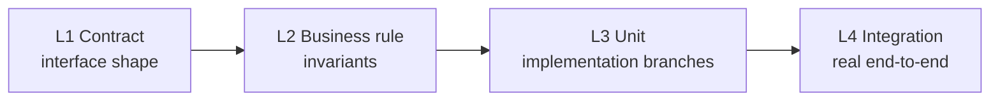
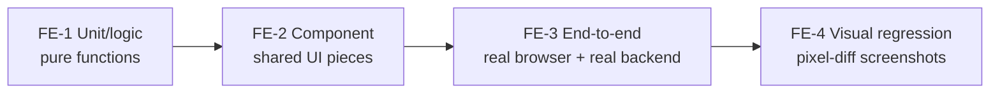

# Testing patterns for components built on BrickKit

This is **recommended practice**, not a BrickKit platform requirement. BrickKit itself has no opinion on how a component tests its own internals — component autonomy is one of the twelve design principles in [`AGENTS.md`](../../../AGENTS.md): language, framework, API shape, transaction handling, and log format are all the component's own call, and the platform asks for exactly three things (a manifest, a health check, environment variables). Test strategy has never been part of that list. What follows is a testing methodology that one real production deployment — 14 components, including its frontend apps, covering one complete business workflow end to end — validated in practice and fed back as a suggestion. Take from it what's useful for a project assembled on BrickKit; adopting any of it is entirely optional. BrickKit treats a frontend component exactly like any other (AGENTS.md §9.10 — it's a container with a port and a health check, same as anything else), so this methodology covers both: a backend component's four layers below, then a frontend component's own four layers further down.

## Backend: four layers, plus two cross-cutting categories



| Layer | What it checks | What it covers |
| --- | --- | --- |
| **L1 — Contract tests** | The interface's external shape | The contract itself has no breaking change, and every interface can actually be called across a process boundary — over the real protocol with real serialization, not just a passing local function call |
| **L2 — Business-rule tests** | Properties the feature must hold | Invariants (a balance never goes negative), valid state-transition paths, idempotency, edge cases |
| **L3 — Unit tests** | Branches of the current implementation | Every branch, every conditional, every exception path the code actually walks through in this specific version |
| **L4 — Integration tests** | The real end-to-end path | A real database, a real message queue, running the whole path from request in to row committed or message published |

Beyond the four layers there are two **cross-cutting categories** — not a fifth layer stacked after L4, but a dimension that should be threaded through tests at every one of the four layers:

| Cross-cutting category | What it covers |
| --- | --- |
| **Permission / scope-boundary tests** | What data a given identity or ownership scope should and shouldn't see — this dimension belongs in contract, business-rule, unit, and integration tests alike, not off in its own box tested once and forgotten |
| **Cross-component tests** | Verifying that a call into another component hits the real thing, not a stand-in — see the criteria under "Cross-component testing: hit real dependencies, not mocks" below |

## The one criterion that tells L2 from L3

L2 and L3 are easy to confuse — both look like they're testing "does this feature work." One question separates them:

> If you deleted this feature's entire implementation and rewrote it from scratch in a different language, would this test still have to hold? Yes → L2. No → L3.

For example: "two requests with the same idempotency key leave behind exactly one record" must still hold whether the feature is written in Go or Python — it's testing the business rule itself, so it's L2. But "the amount field gets parsed as a `Decimal` rather than a `float`" is only meaningful for this specific implementation — rewrite it in another language, or pick a different numeric type, and the assertion may not even apply anymore. That's L3.

## Two pitfalls a real deployment actually hit

**Pitfall one: idempotency tests that only replay once**

| Don't | Symptom | Do instead |
| --- | --- | --- |
| Test only a single request replayed serially — send it, send it again, assert the two outcomes match | An implementation that runs a `SELECT` to check existence before deciding to `INSERT` will, if two concurrent requests both land in that not-yet-found window, each go ahead and insert — producing a duplicate row. A serial-replay test can never land in that race window, so it can never catch this bug; it passes cleanly every time | Replace the check-then-write with one atomic operation — `INSERT ... ON CONFLICT DO NOTHING`, or your database's equivalent — and make sure the test suite includes the scenario where several concurrent requests carrying the same idempotency key arrive at once and only one of them actually executes, not just a serial replay |

**Pitfall two: permission-boundary tests that only check the two extremes**

| Don't | Symptom | Do instead |
| --- | --- | --- |
| Test only "a user with permission can see the data they're allowed to see" and "a user with zero permission sees nothing at all" | Suppose the permission check has a bug that makes the code return an entire table's worth of rows: the zero-permission user never even reaches that code path (something earlier already blocked them), and the permitted user's results aren't wrong either — the rows they're supposed to see are in there, just alongside rows belonging to someone else. Both extreme-case tests pass every time, and the bug never surfaces | Actually create two records that belong to different scopes (say, different `owner`, `department`, or `warehouse` values), query as one of those identities, and assert that the result set contains none of the rows belonging to the other identity — not just "the response was non-empty" or "the response was empty" |

## Cross-component testing: hit real dependencies, not mocks

Three criteria decide whether a cross-component test is doing its job:

1. **Produce the data by going through the dependency's real interface first**, rather than reaching past that interface into the dependency's own storage;
2. **If the dependency's contract can't yet produce the data you need, add that capability to the dependency's contract** — don't route around the contract, and don't write to the dependency's database with raw SQL either;
3. **A mock can prove, at best, that a call happened** — the right arguments, the right number of times — but it can never prove the call's result was correct. Only standing up the real dependency can verify that.

## Writing components with AI: spec first, implementation second

This section is different from the ones above: every section above is distilled from a real production deployment, while this one is a **recommended working order** with no comparable field record behind it. It does one thing — it strings the four layers above together with one check BrickKit itself gives you that needs no containers, in a "spec before implementation" order. Whether and how to adapt it is your call.

**Why the order matters.** If an AI writes the implementation first and the tests afterwards, the tests turn into a restatement of the code already written: they verify "the code does what it does", not "what the code should do". For a test to actually constrain anything, there has to be a spec that doesn't depend on the implementation. A BrickKit component happens to have three, all in `component.yaml`, readable without opening a single line of implementation:

| Spec | Where | What it constrains |
| --- | --- | --- |
| Config spec sheet | `configSchema` | which keys the component reads from its environment, their defaults, which are required |
| Dependency declaration | `dependencies` | which `*_ENDPOINT` variables the component will receive (an optional dependency that isn't running is **not** injected — see [Environment Variable Contract](../06-architecture/04-environment-variables.md)) |
| Interface contract | the contract files under `artifacts` (OpenAPI, protobuf, …; see [Consuming other components](../03-guide/08-consuming-artifacts.md)) | what the component says to the outside |

The recommended order:

| Step | What to do | How to know it's right | Needs containers? |
| --- | --- | --- | --- |
| 1 | Write `component.yaml` completely first: `dependencies`, `configSchema` (keys, defaults, `required`), contract files | `brickkit up --dry-run` (below) | no |
| 2 | Write L1 contract tests from the contract file | They must all be red — and red for a reason (the interface isn't implemented yet). A test that is green on its first run tested nothing | no |
| 3 | Write each L2 business rule as one sentence first, then translate it into a test (example below) | Also red first | no |
| 4 | Let the AI write the implementation until L1 and L2 are green | The tests are the acceptance — nobody has to read the implementation line by line | no |
| 5 | Add L3: the branches of this particular implementation | every branch is exercised | no |
| 6 | Run L4: `brickkit up` with real dependencies, one real end-to-end pass | the whole chain works | yes |

**The step-1 check is BrickKit-specific.** `brickkit up --dry-run` starts nothing, but the injection-stage checks still run, so anything where `component.yaml` and `brickkit.yaml` disagree surfaces right there. Below is real output (excerpt) from the `demo/hello` fixture with the config key `greeting` deliberately misspelled as `greetting`:

```
⚠️ A config item won't take effect: greetting on component demo/hello
   Config item: greetting
   Reason: The component's configSchema has no such item; did you mean greeting?
   Impact: This item is not injected as any environment variable; the component uses its own default
```

The same path also catches: a config key whose name collides with a platform-reserved variable (a warning), and a `configSchema.required` key that has neither a default nor a project override (a **block** — even under `--dry-run` it refuses to go on, with exit code 1). The full error text is in the [Environment Variable Contract](../06-architecture/04-environment-variables.md), section 5.

**How to write step 3.** State the rule as a "given … when … then …" sentence first, then translate it into a test. The idempotency rule from "Pitfall one" above reads:

> Given an idempotency key that hasn't been processed yet; when two requests carrying the same key arrive at the same time; then exactly one actually executes, and the other gets the same result.

That sentence is itself the most precise prompt you can give an AI, and it points straight at the concurrency window a serial-replay test can never reach.

Every other step holds for any project with tests and isn't specific to BrickKit; the one thing this section genuinely adds for BrickKit is the step-1 check — a check that needs no containers and not one line of implementation.

## Frontend: four layers of its own

Same thinking as the backend layers above — spec separated from implementation, shared things prioritized over feature-specific ones, real environments preferred over simulated ones — just with different tools and different boundaries:



| Layer | What it checks | What it covers |
| --- | --- | --- |
| **FE-1 — Unit/logic tests** | Whether the logic itself computes the right thing | Pure functions, composables, state stores — network requests mocked out entirely; doesn't care about a real round-trip or about rendering |
| **FE-2 — Component tests** | A shared component, in isolation | UI components reused across multiple business pages (tables, form templates, generic cards) — breaking one of these breaks every page that references it, which is why this class outranks a one-off component belonging to a single page |
| **FE-3 — End-to-end tests** | A complete business flow, for real | Real browser + real backend (the whole assembly actually running) — not one isolated UI interaction. Name each test after the business flow it verifies, not which button it clicked, so a test run can be filtered by flow |
| **FE-4 — Visual regression tests** | Spacing, density, and component usage staying consistent across pages | A pixel-level screenshot diff taken in passing as an FE-3 run walks through key pages — not a separate browser run just for screenshots. The baseline updates alongside intentional UI changes |

**When to start writing FE-3/FE-4**: once a page's interaction shape has largely stabilized, add them in a batch. While a page is still being heavily reworked, every UI change drags along a rewrite of selectors and assertions — investing here earlier has poor ROI. Decide the directory/skeleton convention ahead of time, so writing them for real is filling a template in, not designing one from scratch.

**⚠️ Get explicit user agreement before running FE-3 or FE-4 — never on your own initiative.** This isn't about which tool (Playwright/Cypress/Selenium/Puppeteer all cost about the same order of magnitude) — what's expensive is the fact that an AI has to actually drive a real browser and debug selectors or diagnose failures via screenshots or a rendered DOM. Before running either layer, state the specific scope intended (which business flow, which pages/assertions), then wait for the user to confirm whether to run it now and at what scope. Most of the cost is in first writing and debugging a test, not in re-running an already-stable one: a stable suite's rerun produces a text report at roughly the cost of an ordinary unit test. To keep the first-write cost down — prefer an accessibility-tree snapshot (structured text) over screenshotting a whole page just to look at it; on failure, read the plain-text error trace before reaching for a screenshot; have a human record the key interaction paths where possible, rather than letting an AI blindly guess at selectors through trial and error. Visual regression's comparison step is an automated pixel diff producing a text result (pass/fail plus a percentage) — the only step that genuinely needs visual-understanding capability is judging, after a comparison fails, whether the difference is a real bug or an expected change.

**A pitfall a real deployment actually hit — an unhandled rejection on the normal "backend said no" path:**

| Don't | Symptom | Do instead |
| --- | --- | --- |
| Write a page's data-loading function as `try { await load() } finally { ... }` with no `catch`, on the assumption that a mocked, always-succeeding backend in FE-1 means the happy path is the only path that matters | Against a real backend that legitimately rejects a request (a real permission check returning 403, a validation error, a dropped connection), the rejection propagates unhandled — the console shows a framework-level warning, the page sits blank or stuck loading, and the user sees no indication anything went wrong. FE-1's mocked backend can never trigger this, because it never actually fails | Give every page's loading/reloading function an explicit `catch` that surfaces a visible error state — a toast, an inline message, a fallback view. A backend rejection is an expected, normal outcome for a frontend to handle, not an exceptional one it gets to skip — this is exactly why FE-3 has to run against a real backend: no amount of mocking surfaces a bug that only exists in how a real rejection is handled |

**Frontend contract drift: closed by mechanism, not by writing more tests.** A hand-written frontend type definition with a comment claiming it "matches the backend contract exactly" — with nothing actually enforcing that — shouldn't be defended by repeatedly adding tests to catch drift; that turns a problem that could be eliminated at the source into a maintenance tax that never gets fully paid off. Generate frontend types and request functions directly from the backend contract (`.openapi.yaml` or a GraphQL schema) instead: the type checker then catches every drift at compile time, and every new endpoint costs nothing extra to keep in sync.

---

How to plan seed data and test data — which rows belong in migration scripts versus which should be constructed fresh at test time — is a separate question, covered in [Planning seed data and test data](02-data-construction.md).
