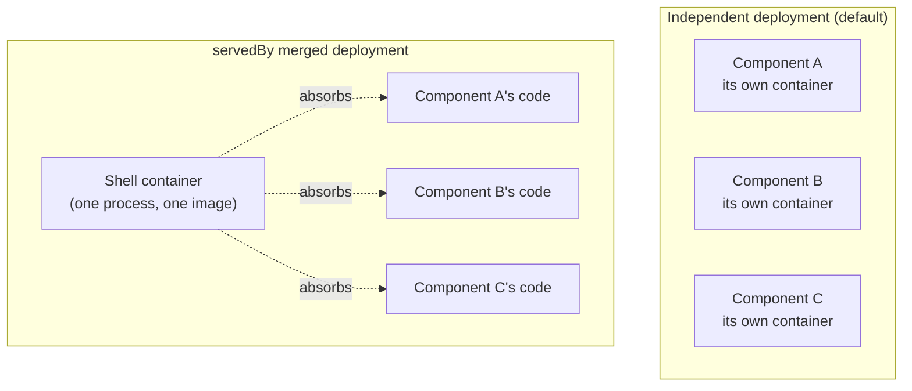

# Building a Qualified Shell

> Prerequisite: read [Architecture overview](../06-architecture/00-overview.md) first if you
> haven't — this guide assumes you already understand versioned service
> names and environment-variable injection. If you haven't yet settled on
> your project's overall deployment shape — which components run
> independently, which get merged, and `docker` vs `k8s` — read
> [Choosing a deployment shape](05-deployment-selection-guide.md) first. If
> you've already got that far but haven't decided `servedBy` is the right
> call for your situation, read
> [Declaring servedBy: a deployment checklist § When servedBy is the right
> call — and when it isn't](06-servedby-deployment-checklist.md#when-servedby-is-the-right-call--and-when-it-isnt)
> first — it covers the memory-floor problem this feature exists to solve,
> and the cheaper options worth trying before reaching for it.

`servedBy` (see AGENTS.md §5.7) lets a component declare that its workload
runs inside another component's container instead of its own. This guide is
for whoever builds that other component — the "shell." It has two jobs:
say precisely what the platform hands your shell and what it doesn't, and
lay out the nine correctness properties every real merged process ends up
needing, regardless of language or framework.



## What `servedBy` does and doesn't ask of the platform

A `servedBy` component's code runs inside your shell's single container or
Pod. The platform generates the address routing for it — a Docker network
alias or a Kubernetes Service, depending on target — and merges the right
`*_ENDPOINT` variables into your shell's environment, so anything that
depends on a component you've absorbed still resolves it correctly. That is
the entire platform contract. It never needs to know, and this guide never
asks you to tell it, what language your shell is written in, how many
processes or threads it runs, which concurrency primitives it uses, or what
base image it starts from. Two real shells built for the same platform can
look nothing alike internally — one might orchestrate goroutines with
`errgroup`, another might run an `asyncio` event loop — and both are equally
valid, because the platform's contract stops at "which address points
where."

## What the platform puts in your shell's environment

- **Every `*_ENDPOINT` variable an absorbed component would have received
  had it been deployed on its own.** These are merged directly into your
  shell's real OS environment — not relayed through some intermediate
  config object your own code has to construct. If two absorbed components
  need different values under the same variable name (the same component ID
  at two different exact versions, say), that is a genuine conflict the
  platform catches and refuses to generate, rather than silently picking
  one.
- **`BRICKKIT_SERVED_MEMBERS`** — a comma-separated list of the versioned
  service names of the components currently absorbed into this deployment.
  A shell image is typically compiled with more modules than any single
  deployment actually needs active; this variable tells you, at that
  specific deployment's startup, which of your compiled-in modules should
  actually run right now. Two values matter, and they mean opposite things:
  an **empty string** means zero members are currently active — a
  compliant shell must initialize none of them. The variable being
  **entirely absent** means this container isn't running under a
  brickKit-generated deployment at all (you started the binary by hand for
  local debugging, say) — what you do in that case is entirely up to you.
  Don't collapse these two cases into one fallback path. The recommended
  pattern: at startup, compute each compiled-in module's own versioned
  service name using the same rule the platform uses (component ID with
  `/` and `.` replaced by `-`, all lowercase, plus the exact version with
  `.` replaced by `-`), and skip initializing — including skipping its
  migrations and skipping opening its resource connections — any module not
  on the list.
- **`BRICKKIT_SERVED_MEMBERS_CONFIG`** — the detailed counterpart to the
  list above: a JSON array with one element per currently-absorbed member,
  each carrying `componentId`/`version`/`httpPort`/`extraPorts`/`configEnvVars`
  (`configEnvVars` maps that member's own configSchema key — camelCase, not
  the converted uppercase environment-variable name — to the name of the
  independent environment variable, in your own process environment, where
  its actual merged value lives). Zero members still gives you `[]`, not a
  missing variable. This one is for shell authors who actually have to wire
  each module up: no more hand-writing a CLI tool that computes a JSON blob
  before every deployment and pastes it into a string field under some
  shell component's own `configSchema` in `brickkit.yaml` — that kind of
  hand-maintained data goes stale the instant a member's version, config
  values, or `servedBy` membership changes, and the platform won't warn
  you; it just crash-loops (or wires up the wrong module) the next time the
  shell actually starts.

## What gets merged in, and what doesn't

An absorbed component's own `configSchema`-derived configuration values
*do* get merged into your shell's shared OS environment — just never under
the component's own, unprefixed name. Each one lands under
`{EnvPrefix(componentId)}_{the same uppercase name a standalone deployment
would use}` — the identical prefix rule `*_ENDPOINT` variables already use.
A config key like `pgSchema` on its own is not guaranteed unique (two
independently-authored modules can easily reuse the same generic name for
two entirely different values), which is exactly why it never appears
unprefixed; prefixed by component ID, it structurally cannot collide with
another member's same-named key. `BRICKKIT_SERVED_MEMBERS_CONFIG` above is
an index into these variables, not a second copy of their values — read
`configEnvVars[key]` to get the variable *name*, then read that variable
from your own environment to get the real value. This indirection is
deliberate: a member's config value in `brickkit.yaml` is frequently a
`${VAR}` reference to a secret, and brickKit's Docker Compose generation
deliberately never resolves those itself (the generated file is meant to
stay safe to open and diff) — the placeholder is left for `docker compose`
to expand only at container-start time. Packing such a placeholder's
*value* into a JSON string would let `docker compose`'s own blind,
structure-unaware text substitution corrupt that JSON the moment the
placeholder expands into something containing a quote, backslash, or
newline (a multi-line PEM key, say); keeping each value in its own
single-purpose environment variable — exactly like a standalone
component's own config — avoids that entirely.

Resource-connection variables (`DATABASE_*` and friends) still never merge
in on a member's behalf — they can carry a secret identity that's supposed
to go through a K8s Secret, and folding them in would route around that
handling. Giving each of your absorbed modules its own isolated resource
connections is still squarely your job, not the platform's — see property
5 below. The platform also never puts `COMPONENT_ID` or `COMPONENT_VERSION`
for anything but the shell itself into that environment, for the same
reason: those variable names are fixed and would collide the instant you
absorb more than one component.

## Nine properties a merged process must satisfy

Every one of these was found the hard way, by teams who actually shipped a
shell. None of them are specific to any one language, database, or
framework — only the concrete illustrations are, and they're marked as
such.

1. **A health check must reflect only the merged unit itself, never a
   downstream dependency.** This is the same rule the platform's own
   `/healthz` guidance already states for a single component — but merging
   raises the stakes: one absorbed module's downstream hiccup can now take
   down the health signal for every module sharing that process, and a
   restart takes all of them with it, not just the one that was actually
   unwell.
2. **Verify your health check against every HTTP method your framework
   routes differently — don't assume the documented behavior survives
   contact with reality.** One real example: a popular Python ASGI
   framework's routing layer does not automatically answer `HEAD` requests
   for a route only declared with `GET`, despite what its underlying
   toolkit's documentation implies — a health checker that sends `HEAD`
   (as `wget --spider` does) gets a 404 against a route that answers `GET`
   perfectly normally. The lesson generalizes past this one framework:
   whatever health-check mechanism your deployment target actually uses,
   test it against your real merged binary once, don't reason about it
   from documentation.
3. **One module's unexpected error must not take down its siblings.** A
   standalone deployment gives each component a blast radius of one; a
   naively merged one can silently turn that into "the whole shell." The
   concrete trap: orchestration primitives that share a single cancellation
   signal across independent tasks (Go's `errgroup.WithContext` is one
   example — the first goroutine to return a non-nil error cancels the
   shared context for every other goroutine in the group) are built for
   "these things should live and die together," which is exactly the wrong
   shape for modules that are supposed to stay independently fault-isolated.
   Whatever your language's equivalent primitive is, check what it actually
   does on a single failure before you build your module orchestration on it.
4. **Any stateful resource shared across modules — a connection pool, a
   client — must have its per-borrow identity or scope cleared before the
   next borrow, or the next borrower silently inherits it.** This is the
   most dangerous property on this list, because violating it produces no
   crash and no error message — only quietly wrong data, read or written
   under the wrong identity. How you satisfy it is entirely stack-specific
   (a transaction-scoped `SET LOCAL ROLE`/`SET LOCAL search_path` in
   PostgreSQL, reset automatically on commit or rollback, is one real fix;
   a different database or a different pooling library will need a
   different mechanism), but the underlying rule — never set identity or
   scope on a shared resource outside of a request- or transaction-scoped
   boundary — is universal to sharing any stateful resource pool at all.
5. **Process-global state initializes exactly once for the whole process,
   not once per absorbed module.** Signal handlers, tracer/logger/metrics
   registry setup, and any framework-level global configuration all fall
   under this — and so, per the two sections above, does giving each module
   its own configuration and resource connections, since the platform
   deliberately doesn't do that merging for you. Whichever module happens
   to initialize last tends to silently win, usually with no warning that
   it happened.
6. **Whatever mechanism your independently-deployed code uses to discover a
   dependency's address must still work once merged.** If your code (or a
   shared SDK you maintain) reads dependency addresses straight out of the
   process's real environment variables — exactly the mechanism this guide
   describes above — this property holds automatically, because the
   platform already writes those variables into your shell container's
   real OS environment, the same way it would for any independently
   deployed component. The trap only appears if some layer in your own
   stack relays or re-derives that address through an intermediate step
   (a per-module config object your shell launcher builds and hands to
   each module, say) and that relay step is the one place nobody actually
   wires the real environment through — a bug that stays invisible until
   the first time a code path that depends on it actually runs.
7. **Migration and schema-creation ordering becomes entirely your
   responsibility, derived from your modules' real dependency order.** The
   platform runs no migration container at all for a `servedBy` component
   (it warns you at generation time, precisely so this doesn't surprise you
   at runtime) — your shell's own startup code has to run each absorbed
   module's migrations in an order that actually respects any cross-module
   foreign keys or references, not an arbitrary or assumed-idempotent one.
8. **Any process-global, register-once-by-name mechanism needs a
   duplicate-registration check once modules are merged into one process.**
   This is not specific to any one serialization format. The canonical
   trap in Go: two modules that each vendor a copy of the same third
   component's generated gRPC/protobuf client code (to avoid directly
   importing each other's repositories) will, once compiled into the same
   binary, each try to register the same `.proto` file path in
   `google.golang.org/protobuf`'s process-global type registry — and the
   second registration panics, with an error message that gives no hint
   the actual cause is a merged deployment. The fix that actually works is
   a deliberate, narrow exception to "components never import each other":
   a package that contains *only* generated message types and client stubs
   — no hand-written business logic — can be published as an independent,
   shared module that every component importing that contract depends on
   directly, instead of each vendoring its own copy. Sharing pure
   generated-contract code this way doesn't compromise component autonomy
   the way sharing real business logic would, and it guarantees there is
   only ever one compiled instance of that contract's types in a merged
   process, no matter how the modules end up grouped. If your own
   toolchain has an equivalent global registry-by-name pattern (not every
   language does), the same exception — and the same underlying fix — likely
   applies.
9. **There is no way to externally verify that a shell image's declared
   version matches what's actually compiled inside it.** An image is an
   opaque reference to the platform; keeping that promise is entirely on
   your own team's discipline (a version ledger you maintain by hand is a
   reasonable, if unglamorous, answer). This is an honest, permanent
   limitation of merging code into one artifact — not a gap a future
   platform version is expected to close.

## Multiple versions, mixed deployment shapes

A real migration is never a clean cutover — some callers upgrade before
others, and a shell's own contents change over time. `servedBy` doesn't add
a new axis of complexity here; every scenario below already falls out of
BrickKit's existing exact-version-pinning and versioned-service-naming
rules (AGENTS.md §5.1/§9.2/§9.3), because `servedBy` is just one more field
on one more ordinary `components:` entry.

**Old callers on the old version, new callers on the new, one version
merged and the other standalone — no coordination required between them.**

```yaml
components:
  - id: infra/shell-go-core
    version: 1.0.0
    image: brickenterprise/be-shell-go:1.0.0
    healthCheck: { path: /healthz }
    deployment: { port: 9000 }

  - id: mdm/customer
    version: 1.0.7                       # not yet migrated; still its own container
    deployment: { port: 8080 }

  - id: mdm/customer
    version: 2.0.0                       # migrated; lives inside the shell
    servedBy: infra/shell-go-core@1.0.0
    deployment: { port: 8081 }
```

A component still declaring `mdm/customer@1.0.7` as a dependency gets
`MDM_CUSTOMER_ENDPOINT=http://mdm-customer-1-0-7:8080` — that version's own
independent service, exactly as before this feature existed. A component
declaring `mdm/customer@2.0.0` gets
`MDM_CUSTOMER_ENDPOINT=http://mdm-customer-2-0-0:8081` — note that this is
still `mdm/customer`'s *own* versioned service name and its *own* declared
port, identical in shape to what an independently-deployed version would
produce. What's different is invisible at this layer: the platform makes
that name resolve to the shell instead of a container of its own (a Docker
network alias, or a dedicated Kubernetes Service selecting the shell's
Pods — see below). Neither caller's own dependency declaration, nor the
address it computes, ever needs to change based on where its dependency
happens to physically live — that indirection is the entire point of the
platform's address injection.

**One practical trap when you actually set this up locally**, confirmed against
a real `local`-type install source: each version needs its own source
directory. A `local` source's directory holds exactly one `component.yaml`,
so writing 1.0.7 and then overwriting it with 2.0.0 in the same directory
doesn't give you two versions — it gives you one directory that only ever
resolves to whichever version was written last, and the platform reports
`COMPONENT_NOT_FOUND` for the missing one rather than hinting at the
directory itself. Two separate `sources: - type: local` entries, each
pointing at its own directory, is what actually works.

**The same shell can absorb two versions of the same logical component at
once** — this is exactly the state a migration passes through while some
callers are on the old version and some are on the new, and both versions
are already merged for footprint reasons:

```yaml
  - id: mdm/customer
    version: 1.0.7
    servedBy: infra/shell-go-core@1.0.0
    deployment: { port: 8080 }
  - id: mdm/customer
    version: 2.0.0
    servedBy: infra/shell-go-core@1.0.0
    deployment: { port: 8081 }           # must differ from 1.0.7's port
```

Give each version its own port and the platform treats them as two entirely
independent members of the same group — merged endpoints, network
routing, and `BRICKKIT_SERVED_MEMBERS` all handle this with no special
casing, the same way they'd handle two unrelated components sharing a
shell. The only thing you must get right yourself: your shell's own module
registry needs to be keyed by the full versioned service name
(`mdm-customer-1-0-7` vs. `mdm-customer-2-0-0`), not by the bare component
ID — if it's keyed by ID alone, the second version silently overwrites the
first in your registry, with no error from the platform (which never
inspects your registry) and no error from the merge (which validated the
*addresses*, not your shell's internal bookkeeping).

**This only works if your language's own toolchain actually lets you
compile in two versions of the same code at once — check this before
relying on it.** Confirmed against real Go components: it doesn't hold by
default. `go.mod`'s `require` directive resolves one version per module
path per build, and a module path only becomes version-distinguishable
across major versions if its author has opted into Go's semantic import
versioning (a `/v2`-suffixed module path) — a `1.0.7`→`2.0.0` bump alone
never triggers this, and nothing about `servedBy` makes it happen either.
If your components don't use semantic import versioning (most don't), a Go
shell physically cannot statically link two versions of the same component
into one binary — put them in two separate shell images instead. This is a
property of how each language's build system resolves dependencies, not
something the platform can see or compensate for (the platform never
inspects what's actually compiled into your shell image, per property 9
above) — other statically-compiled languages likely have their own version
of this same constraint, worth checking against your specific toolchain
before you build on this pattern.

**What you cannot do: give one exact version two deployment shapes at
once.**

```yaml
  - id: mdm/customer
    version: 1.0.7
    servedBy: infra/shell-go-core@1.0.0
  - id: mdm/customer
    version: 1.0.7                       # rejected: duplicate id+version
```

This isn't a `servedBy`-specific restriction — a project config can never
declare the same exact `(id, version)` twice, with or without `servedBy`
(AGENTS.md §5.1's "one component ID appears once" rule, applied literally:
`servedBy` is just one more field on that one entry, not a second axis a
duplicate could vary on). If you genuinely need "most callers share one
merged instance, one caller needs an independently-scaled instance of what
is conceptually the same code," the answer is to publish that code under a
second version number — even a trivial one — and give the two versions
their two different deployment shapes. A single version number cannot mean
two different things at once; that would be exactly the kind of implicit,
unguessable state this platform's "explicit over implicit" principle exists
to rule out.

## What this guide deliberately never asks of you

Nothing here requires disclosing your shell's language, process count,
concurrency model, or base image to the platform, and nothing in the
platform's own generation logic branches on any of those either. That's not
an oversight — it's the entire point of `servedBy`: the platform's job stops
at correctly answering "which address points where," and everything past
that line is yours to build however fits your stack.
