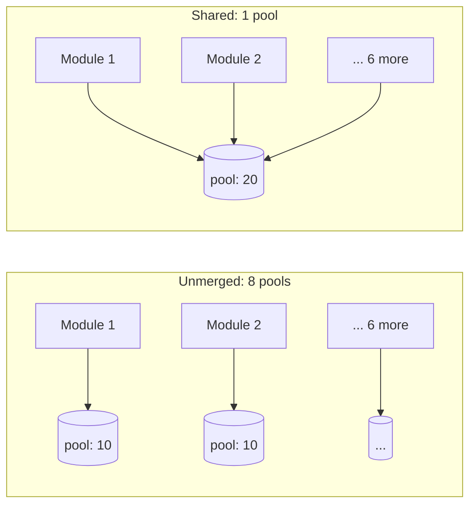

# Sharing a Database Connection Pool Inside a Shell

This is a narrow, specific follow-on to
[Declaring servedBy: a deployment checklist](06-servedby-deployment-checklist.md):
once several components share one shell process for memory-footprint
reasons, their database connections become a second, independent resource
question — one the shell's memory savings don't automatically extend to,
and one that can go quietly, dangerously wrong if it isn't deliberately
designed. This applies to PostgreSQL and Oracle specifically; skip to
["Engines this doesn't apply to"](#engines-this-doesnt-apply-to) if
you're on anything else.

## Merging processes doesn't merge connection pools by itself

The motivation for `servedBy` is usually saving JVM memory. But absorbing
eight Spring Boot components into one process brings eight independent
connection pools along with it unless something is deliberately done about
it:



| | Connections per instance | Running 2 replicas |
| --- | --- | --- |
| 8 modules, each its own pool (HikariCP's default `maximumPoolSize: 10`) | **80** | **160** |
| Merged into one shared pool (`maximumPoolSize: 20`) | **20** | **40** |

PostgreSQL's default `max_connections` is **100** — a single merged
instance alone comes close to exhausting the default configuration, and
two replicas blow straight through it. Each PostgreSQL connection is a
full backend process, not a lightweight handle, so 80 versus 20 is a real
difference in load on the database server, not a rounding error. The
memory you saved landed on the shell's machine; the connection cost you
didn't account for lands on the database's. Count both sides, not just
the one `servedBy` was built to help with.

## The pool usually can't actually be merged — check this before you plan around it

A PostgreSQL connection is bound to exactly one database and one
authentication role for its entire lifetime. So even once eight modules
are compiled into the same JVM, the same class loader, the same process —
if they point at eight different databases, **the eight pools cannot be
physically merged**: a connection open to the `people` database cannot
query the `department` database. Merging the process saves nothing here.

**The precondition is switching from one-database-per-component to
one-schema-per-component, all inside a single shared database** — only
then does the shell have anything to actually merge.

Schema grouping is necessary, not sufficient, on its own: it only makes
merging *possible*. The actual saving comes from the shell deliberately
merging the pools — if every absorbed module still builds its own pool
from its own `DATABASE_*` variables, you still have eight pools, and
schema grouping bought you nothing. **Sharing one `DataSource` across
modules has to be an explicit design goal of the shell**, on top of
everything else a qualifying shell already has to get right.

## Two conditions, both required

| Condition | How it's satisfied |
| --- | --- |
| **Same database** | Schema grouping: eight components, eight schemas, one shared database |
| **Same authentication role** | Connections carry a role too — eight separate accounts still means eight pools |

The second condition runs into a real tension: giving each component its
own least-privilege database account, in its own database, is the
platform's own recommended default. That default isn't about connection
count — "one database per component" and "one schema per component, one
shared database" cost exactly the same number of connections in the
platform's normal, unmerged shape, since connection count is driven by
process count × pool size, not database count, and a per-component account
still means one server-side pool per account either way (PgBouncer's own
pools key on `(user, database)`). The real reason for the default is
that one-database-per-component needs nobody to get anything right for the
isolation to hold — a connection is physically bound to one database, so
crossing into another component's data isn't a permission a migration tool
or a `search_path` reset can quietly get wrong. Schema grouping only pays
for itself once several components are actually merged into one shell for
memory reasons — which is exactly the situation this document is about —
and even then, it's a deliberate, narrow trade of some of that
by-construction safety for the ability to actually share a pool, not a
general-purpose way to save connections.

Inside a merged deployment, that tension has
a real resolution — and it's a better one than routing everything through
an external pooler like PgBouncer — because the shell itself controls
exactly when a connection is borrowed and returned:

```
borrow connection → BEGIN → SET LOCAL ROLE component_a → run that module's queries → COMMIT
                            ↑ SET LOCAL reverts automatically at transaction end,
                              so the connection returns to the pool clean
```

Log in with one shared role, then switch to the borrowing module's own
role for the duration of its transaction. Each module keeps its own
privilege boundary; the pool stays one pool. The same applies to
`search_path` — use `SET LOCAL search_path`, or fully qualify every table
reference in your SQL.

**Never `SET search_path` — without `LOCAL` — and then return the
connection to the pool.** The next borrower silently inherits it, and
module A's queries start reading and writing module B's tables — no
error, no crash, just quietly wrong data under someone else's identity.
This is the single easiest mistake to make with this pattern, and one of
the hardest to notice once made, because nothing about it looks broken
from the outside.

## This decision has a deadline: before the database exists

**Once a database has been created per-component and has real data in it,
switching to one-database-many-schemas is a data migration, not a
config change.** So if a merged deployment is even plausible in your
future — the signal worth watching for is "mostly JVM components,
heading toward a private, resource-capped delivery" — adopting schema
grouping from the start costs little, even before you've decided to
merge anything. This is the one decision in this whole document worth
making before you've committed to `servedBy` at all.

## What you still pay, even after merging the pool

| Cost | Why it doesn't go away |
| --- | --- |
| **A shared pool has no bulkheads** | One module leaking connections, or running a long transaction, stalls the whole group waiting on the same limited pool. Separate pools at least fail independently. |
| **The shell has to take over `DataSource` management** | Each Spring Boot module's own `DataSourceAutoConfiguration` has to be overridden by the shell — this is real integration work, not a configuration flag. |
| **Migrations need the same regrouping** | Each module's migration scripts need to target their own schema. This is the same rule AGENTS.md already states for any two components sharing one database — the migration-state table's primary key must include a component identifier, or migrations clobber each other — most migration tools default to writing into `public`, and without configuring this they'll all collide there regardless of how many schemas the actual data lives in. |

The first row is the same fault-isolation cost the implementers guide
already names for merging in general — sharing a connection pool is just
one more place that cost shows up, not a new bill on top of it.

## Engines this doesn't apply to

PostgreSQL and Oracle bind a connection to a specific database/PDB for its
whole lifetime, which is the entire reason schema grouping matters here.
MySQL, MariaDB, SQL Server, and MongoDB don't work that way — a single
connection can freely query across databases (`people.employees JOIN
department.nodes` is an ordinary MySQL query). On these engines, merging a
pool needs no schema regrouping at all; one-database-per-component is
already poolable as-is.

| Engine | Needs schema regrouping to share a pool? |
| --- | --- |
| PostgreSQL / Oracle | ✅ Yes — connections are bound to a database/PDB |
| MySQL / MariaDB / SQL Server / MongoDB | ❌ No — connections already cross databases freely |

The authentication-role dimension applies regardless of engine, though:
sharing one pool means sharing one login identity, and the `SET LOCAL
ROLE`-equivalent technique (MySQL's own privilege model has its own
version of the same idea) is still the right way to keep each module's
privilege boundary intact.
