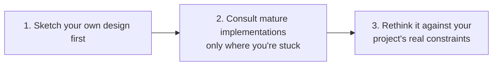

# Component design

This page is **recommended practice**, not a platform rule. How a component's domain model is designed inside is none of
the platform's business — it belongs to whoever builds the component. The method below comes from a real production
deployment: research before designing, watch for one particular signal while researching, then decide where the boundary
goes.

## How big a component should be

**One component covers one domain concept.** "Basic personnel data", "the department tree", "password login", "role
authorisation" are each one component; "the HR system" isn't — it's a family of components.

**For scale.** The project's own 10 test components (`tests/components/`) range from a little over two hundred lines of
code to about three thousand six hundred. That order of size has two advantages:

- One person or one AI can read and understand the whole component in one go, without guessing their way around a
  codebase of hundreds of thousands of lines.
- The component's boundary is written in `component.yaml` and its contracts; someone reading the component only needs those
  two, plus its direct dependencies.

This isn't a hard rule: a component that grows to five thousand lines while really covering one thing doesn't need
splitting to meet a number. Conversely, a three-hundred-line component looking after both "orders" and "stock" should be
split. Line counts are a symptom; the domain concept is what decides.

## Start from reference implementations, not a blank page

Designing business logic should almost always begin by looking at how mature software solves the same problem. A domain
model polished by years of real deployment has absorbed the edge cases a from-scratch design is almost sure to miss —
misses that usually surface three months after a customer goes live, not in the design review.

**The order matters, and the reverse order is worse than no research at all:**



| Step | Do | Why in this order |
| --- | --- | --- |
| 1. Design your own version first | Before opening any reference implementation, sketch a version from your own project's real constraints | Only with your own plan in hand do you see where they differ; read with an empty head and you just produce a copy |
| 2. Look only for what you can't work out | How to cut the domain model, which states a state machine has, which transitions are legal, which fields are required, how edge cases are handled | This step is research, not copying homework — you already know what you're looking for |
| 3. Come back and think it through, then write | Digest what you learned against your own project's real constraints | A reference project's stack and boundaries are almost never the same as yours; what you borrow is its reasoning, not its code |

**Closed-source products are worth consulting too**, even without their source. You can still watch how they're used in
the real world: which features customers use every day, which nobody ever clicks, which flows have been complained about
for years. When judging "is this capability worth its own component", that kind of information is often more useful than
source — and that judgment matters more than any implementation detail, because it comes earlier and is harder to correct
afterwards.

**About licences**: understanding an implementation's reasoning and then re-implementing it independently (even in
another language) isn't a derivative work. What to avoid is opening their source files and copying line by line.
Following the three steps above keeps you well clear of that line. If you really want to use code directly, only under
permissive licences (Apache-2.0 / MIT / BSD), keeping the original copyright notice.

**Write down what you consulted** in the component's design notes, before implementing. Writing it then is cheap;
reconstructing it later, when someone asks "why does this field look like this", is expensive:

```markdown
## Implementations consulted

| Project | Version/commit | Module consulted | What was borrowed | Licence (verified) | Use |
|---|---|---|---|---|---|
| Odoo | 17.0 | `addons/product/models/product_uom.py` | Table design and rounding strategy for unit-of-measure conversion factors | LGPL-3 | Borrowed reasoning |
| A closed-source product | — | — | Real everyday patterns of multi-unit conversion | Closed source | Borrowed usage patterns |

**Deliberately not consulted** (say so, so that later readers don't think it was overlooked):

**Approaches deliberately avoided** (name the anti-patterns found in the references, and why this component doesn't repeat them):
```

The "Use" column takes only three values: **borrowed reasoning** (understand why it was designed that way, then implement
independently — nearly every row should be this), **borrowed usage patterns** (closed-source products, or only docs and
interaction observed), **copied code** (only Apache-2.0 / MIT / BSD, keeping the copyright notice, saying exactly which
file and which part).

## Weaknesses common in reference implementations

Reading several mature implementations in one domain, you often find they share the same set of structural weaknesses,
mostly inherited from the same kind of early architecture. Recognising them as you read is a chance to deliberately not
repeat them:

| Common weakness | How to avoid it |
| --- | --- |
| Every module shares one process and one database, cross-module joins are routine, and module boundaries become "soft" ones anyone can step over | Separate components with separate schemas, the boundary kept by access rights rather than convention — exactly the boundary the component model gives you already |
| Customisation by runtime patching and hooks into the base implementation, so every upgrade may break every customisation | A separately versioned fork plus a locked contract, turning the upgrade into an explicit merge |
| Everything metadata-driven (dynamic fields, a generic "document type"), with no static types to catch errors before run time | A real contract, plus static types where the language supports them |
| Reports query live transaction tables directly, and one heavy query drags down the transaction path | Reports go to summary tables or a dedicated component, never touching the live transaction path |
| Tables grow without limit, and sooner or later the system is crushed by its own history | Design partitioning and archiving for tables that keep growing from day one |

## Component or config switch: recognising a "slot family"

Comparing reference implementations, one situation keeps coming up: **the same feature has genuinely different
implementations in several mature systems, each of them reasonable, only suited to different customers.**

That isn't a "should it be configurable" question. It's telling you the feature needs **a family of interchangeable
components**, not a switch hidden inside one component. It turns on that qualifying condition:

- After comparing, one is **clearly better** → that's the only version you should implement; no family needed.
- Several implementations **each hold up, serving genuinely different customers** → worth making into a family of
  independent, interchangeable components.

| Feature | The real divergence in reference implementations | Conclusion |
| --- | --- | --- |
| Costing method | Moving weighted average / FIFO / standard cost / actual batch cost, each suited to different industries | A family |
| Warehouse picking strategy | First-expiry-first-out / FIFO / nearest location / wave picking | A family |
| Approval routing | Strict hierarchy / tiered by amount / matrix / rule engine | A family — but it's business logic, so it goes in a business-facing component; don't expect a platform mechanism to express it |
| Document numbering | Sequential / segmented by year and month / segmented by organisation and type | **Not** a family — one config item is enough |
| Which fields a master-data record has | Each just has "a few more fields, a few fewer" | **Not** a family — that's customisation, not architecture |

### What a family of interchangeable components looks like on BrickKit

1. **Each member is an independent component**: its own repository, its own `component.yaml`, its own version history.
   `pricing/costing-fifo` and `pricing/costing-standard` are two components, not two modes of one component.
2. **Every member's external contract is exactly the same.** Calling code written against one member works unchanged
   against another — that's what "interchangeable" means.
3. **Nobody may declare a dependency on a particular member.** A component's `dependencies.components` names an exact
   component ID and exact version, fixed in its `component.yaml` when it's released, and the project using it can't
   re-point it afterwards; nor does the platform offer dependency aliases (the variable name is derived from the component
   ID — seeing `PRICING_COSTING_FIFO_ENDPOINT` you know what it points at, and an alias would break that derivation). So a
   component that calls this slot **doesn't** write `pricing/costing-fifo` as a dependency; it declares an address config
   item in `configSchema` (say a required `COSTING_URL` without a default), which the project assembling the system fills
   in with the member it actually installs: `COSTING_URL: $endpoint:pricing/costing-fifo`. The platform works out the
   address (versioned, rewritten for shells and processes on this machine); when several components use it, write it once
   in `config/vars.yaml` — see [Another component's address](../01-three-layers/06-vars-and-var-ref.md). Once anyone
   declares a dependency on a member, that member is no longer replaceable.
4. **Settle the family before writing implementations**: the names, the shared contract, which customers each member
   serves, and which one a new project installs by default.
5. **The shared contract lives in no member's repository.** Put it in a contract repository of its own (interface
   definitions, events, the list of capabilities), and have each member reference it at an exact version. Kept in the
   first member, it makes the second member depend on its competitor.
6. **"The same contract" has to be provable.** Write a black-box conformance suite: it talks to a **running** member only
   through the contract and checks the results, blind to the implementation and to the language it's written in; bring
   the member and what it needs up with `brickkit up --focus <member>`, and run the suite against it. Every member runs
   the same version of the suite before each release, and passing it is what makes it a member of the family. Where
   members may differ in capability, the contract lists the capabilities, and the suite tests what a member declares.

**Don't write `if costingMethod == "fifo"` inside one component to fob off a real slot signal.** That crams several
customer groups' genuinely different needs into one codebase, and from then on each customer's needs hold back everyone
else's releases. **The exception**: a divergence small enough for two or three conditional branches, with no third or
fourth variant in sight — splitting out a whole component for that is over-design of another kind.

## Background tasks: the same code may be running several times at once

Scheduled jobs, message consumers, clean-ups — the platform schedules none of them: they live in the component's own
process, and are the component's business. What the component needs to know is when the platform runs the same code
several times at once:

- `replicas` above 1 on K8s: every replica runs your scheduled job.
- A rolling update on K8s: old and new Pods overlap for a while, both running.
- Several versions side by side: two versions of one component running together, often against the same database.
- A shell: a member's tasks run in the shell's process, sharing CPU and connections with the other members; one heavy
  scheduled job slows every member in that process, so give it a limit.

On Docker / Podman each component is one container, stopped before its replacement starts, so none of this shows on a
single machine — it appears on K8s. Write for one of three shapes:

| Shape | Example | How it's done once |
| --- | --- | --- |
| Singleton | Syncing a directory from an outside system every five minutes | A lease or a database advisory lock: whoever holds it runs, the others skip |
| Once per time slot | The reconciliation at 02:00 each day | Record "done" keyed by the slot (the date): a second run finds it done and exits |
| Competing claims | Working through the rows of a queue or an outbox table | `SELECT … FOR UPDATE SKIP LOCKED`, or a message queue's consumer group: several run in parallel, each row is taken by one |

Write it from the start as if several copies may be running: it stays correct with one replica, and scaling out needs no
code change.

## Failure modes to avoid

**The god component.** One component looks after everything: users, permissions, orders, reports. The symptoms: dozens of
unrelated items in `configSchema`; changing one feature means releasing the whole component; a problem anywhere restarts
all of it. For the direction of the split, see the three questions in the next section.

**Too many dependencies.** One component depends directly on seven or eight others. Every one of them has to be up before
it can start, and whenever any of them changes its contract, it has to change too. Two common causes:

- It's really a **connector component** (orchestrating several standalone components to complete one flow) written as an
  ordinary business component — make orchestration its explicit job, and don't let other components depend back on it.
- It's doing its dependencies' work for them (assembling another component's data itself, say) — hand that capability
  back to the component it belongs to.

**Splitting too far.** Two components share a rule that "must hold at every moment", yet they were split — there are no
transactions across components, and sooner or later the rule gets broken.

## If your team speaks DDD

You're not required to use DDD. This is just a mapping: if your team already uses words like bounded context and
aggregate, here's what they correspond to in BrickKit. This section isn't backed by a review of a real deployment; it
translates the platform's existing mechanisms into DDD terms, plus a few recommended tests.

| DDD concept | What it corresponds to in BrickKit | Why |
| --- | --- | --- |
| Bounded context | At least one component; a component shouldn't straddle two contexts | A component decides its model and manages its schema itself |
| Aggregate (consistency boundary) | Must go into **one component** | Components only call each other directly by request/response, the platform isn't on the call path, and there are no cross-component transactions to rely on |
| Ubiquitous language | Component IDs and the key names in `configSchema` | The component ID turns, unchanged, into a variable name in the caller's code (`people/basic` → `PEOPLE_BASIC_ENDPOINT`), so name it with the domain's words, not the implementation's |
| Published language / open host service | The contract files in `artifacts` | See [Contracts and artifacts](../03-component-guide/06-artifacts-and-contracts.md) |
| Customer–supplier | The caller pins the supplier's exact version in `dependencies` | No implicit upgrades; upgrading is an explicit change the caller makes itself |

**One term easy to get backwards.** In DDD, "upstream" is the supplier depended on and "downstream" the consumer. When
BrickKit says a component "follows the ones above it", "above" is **the side depending on others** — the top level is the
components nothing depends on. So BrickKit's "above" corresponds to DDD's downstream, and "below" to DDD's upstream.

**Whether to split: ask three questions** (a recommended test, not a platform rule):

1. Is there a rule between the two pieces of data that **must hold at every moment** (say "a balance can never be
   negative", constraining both the account and its ledger)? Yes → put them in one component.
2. Do they need to be **released separately, owned by different people or different customers**? Yes → split them. A
   component is one unit of release, one unit of versioning, one unit of permissions.
3. Once split, can callers write their calling code from the contract alone, without knowing which tables the other side
   has inside? No → the boundary is wrong; go back to question 1.

These three questions answer "should two things be in one component"; the slot family in the section above answers
"should a feature become a family of interchangeable components". They don't conflict.
