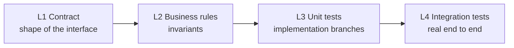
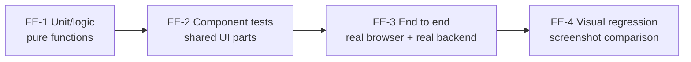

# Testing strategy

This page is **recommended practice**. The platform stays out of how components are tested inside: language, framework
and test tools are the component's own choice, and the platform only asks for three things — `component.yaml`, a health
check, environment variables. The layered approach below comes from a review of a real production deployment (14
components, including a frontend, covering one complete business loop). To the platform, a frontend component is just
like any other — a container with a port and a health check — so this approach covers both sides: first four layers for
backends, then four for frontends.

## Backends: four layers of tests



| Layer | Checks | Specifically |
| --- | --- | --- |
| L1 Contract tests | The interface's shape to the outside | No breaking change to the contract; every endpoint really works across a process boundary — over the real protocol and real serialisation, not just a local function call that passes |
| L2 Business-rule tests | The properties the feature should have | Invariants (a balance can't go negative), legal state transitions, idempotency, edge cases |
| L3 Unit tests | This implementation's branches | Every branch, condition and error path the current code actually takes |
| L4 Integration tests | The real path end to end | Against a real database and a real message queue, all the way from the request coming in to the write or the message sent |

Two further dimensions **run through every layer** — not a fifth layer, but covered along the way while writing each one:

| Dimension | Covers |
| --- | --- |
| Permissions and data scope | The boundary of what different identities, with different ownership scopes, can see. It goes into every layer, not tested once and done |
| Cross-component calls | Calls to other components go to the real dependency, not a stand-in; see "A component's tests and integration tests" below |

### Telling L2 from L3

L2 and L3 are the easiest to confuse: both look like testing "whether the feature is right". One test is enough:

> Delete this feature's implementation entirely and rewrite it in another language — should this test still hold? Yes →
> L2; no → L3.

"Two requests with the same idempotency key leave only one record" — has to hold in Go and in Python alike: L2. "The amount
field is parsed as `Decimal`, not `float`" — only meaningful for the current implementation: L3.

### Two traps actually fallen into

**Trap one: testing idempotency only by "replaying once".**

| Don't | Symptom | Instead |
| --- | --- | --- |
| Test only serial replay: send once, send again, assert the results match | An implementation that "first `SELECT`s whether it exists, then `INSERT`s if not" inserts twice when two concurrent requests both fall into the "not found yet" window, leaving two records. Serial replay never hits that window, and the test stays green | Switch to an atomic write (like `INSERT ... ON CONFLICT DO NOTHING`); the test must include "several requests with the same idempotency key arrive at once, and only one really runs" |

**Trap two: testing permissions only at the two ends.**

| Don't | Symptom | Instead |
| --- | --- | --- |
| Test only "someone with permission sees what they should" and "someone with no permission sees nothing" | The permission branch is wrong and returns the whole table: the no-permission user is stopped earlier anyway, and the rows the permitted user sees are themselves correct (they just see other people's too) — both tests pass every time | Build two pieces of data in different ownership scopes (different owners, departments, warehouses), query as one identity, and assert the result contains **none at all** of the other's data — not merely "not empty" or "empty" |

## A component's tests and integration tests

### A component's own tests: run on their own

L1–L3 run in the component's own repository, without starting other components and without BrickKit. Dependency
addresses come from environment variables, which the test sets itself; an optional dependency's variable may not exist at
all, so treat "the variable doesn't exist" as an input to test too — how the component degrades then is its own business
logic.

**Stand-ins (mocks) are fine, but know what they can't prove**: a mock can only prove "the call happened" (right arguments,
how many times), never "the result after the call is right".

### Integration tests: real containers, cross-component calls

L4 uses BrickKit to bring up the real dependencies. To judge whether a cross-component test is written right, look for
three things:

1. **It produces data on the spot through the dependency's real interface**, rather than bypassing the interface to read or
   write its storage directly.
2. **When the dependency's contract has no way to produce that data, the capability is added to its contract first** —
   never working around the contract, never writing its database with SQL.
3. **Whether the result is right can only be verified with the dependencies really up** — exactly the half a mock can't do.

In the component's own repository, bring the dependencies up with a workbench (see
[Developing inside a component](../03-component-guide/05-local-dev-fractal.md)): the dependencies run in containers, the
component under test runs on this machine as `mode: debug`, and the tests hit it directly.

## Spec first, then implementation (especially when an AI writes the component)

This section is a **recommended working order**, without a real deployment review behind it like the ones above.

**Why the order matters.** Write the implementation first and the tests afterwards, and the tests become a restatement of
the code already written — they verify "the code does what it does", not "what the code should do". For tests to really
constrain anything, there has to be a specification that doesn't depend on the implementation first. A component happens
to have three, all in `component.yaml`, available without reading a line of implementation:

| Specification | Where | Constrains |
| --- | --- | --- |
| The config spec sheet | `configSchema` | Which environment variables the component reads, their defaults, which are required |
| The dependency declaration | `dependencies` | Which `*_ENDPOINT` variables the component receives (an optional dependency not running is **not** injected; see [The environment variable contract](../06-architecture/03-env-injection-contract.md)) |
| The interface contract | The contract files in `artifacts` | What the component promises to the outside (see [Contracts and artifacts](../03-component-guide/06-artifacts-and-contracts.md)) |

The recommended order:

| Step | Do | How you know the step is right | Containers? |
| --- | --- | --- | --- |
| 1 | Complete `component.yaml`: `dependencies`, `configSchema` (keys, defaults, `required`), contract files | `brickkit lint`, then `brickkit up --dry-run` in the workbench (see below) | No |
| 2 | Write L1 from the contract | They must all be red now, and red for a reason (the endpoints aren't implemented yet). Green on the first run means it tests nothing | No |
| 3 | Write each L2 business rule as a sentence first, then turn it into a test | Likewise red first | No |
| 4 | Write the implementation until L1 and L2 are all green | The tests are the acceptance | No |
| 5 | Add L3: this implementation's branches | Every branch is reached | No |
| 6 | Run L4: `brickkit up` starts real dependencies, and a real path is walked through | Works end to end | Yes |

**Step 1's checks come from BrickKit.** `brickkit up --dry-run` starts nothing, but the checks of the injection stage run
as usual, so wherever `component.yaml` and `config/` disagree shows up right there. Here's the real output (an excerpt) when
`demo/hello`'s config key `GREETING` is written as `GREETTING`:

```text
⚠️ demo/hello@1.0.0: GREETTING is not declared in the component's configSchema, so it has no effect
   File: config/demo-hello.yaml
   Declared keys: GREETING
   Suggestion: Did you mean GREETING?
```

The same step also stops: a config item name colliding with a platform-reserved variable (a warning); a key in `required`
with neither a default nor a value from the project (**blocking** — `--dry-run` stops with exit code 1 too).

**How to write step 3.** Write it first as one sentence of "given… when… then…", then turn it into a test. The idempotency
rule from trap one, written out:

> Given an idempotency key not yet processed; when two requests with the same key arrive at once; then only one really
> runs, and the other gets the same result.

That sentence is itself the most precise prompt you can give an AI, and it points straight at the concurrency window that
serial replay can't reach.

## Frontends: four layers of their own

The same thinking — specification apart from implementation, shared things before specific ones, real environments over
simulated ones — with different tools and boundaries:



| Layer | Checks | Specifically |
| --- | --- | --- |
| FE-1 Unit/logic | Whether the logic computes right | Pure functions, composables, state management; every network request mocked, no rendering |
| FE-2 Component tests | The shared UI parts themselves | Tables, form templates and generic cards reused by several pages — breaking one breaks every page using it, so they naturally come before parts specific to one page |
| FE-3 End to end | Whole business flows | A real browser + a real backend (the whole assembly running). Named by "the business flow verified", not "which button was clicked" |
| FE-4 Visual regression | Whether spacing, density and usage are consistent across pages | Screenshots compared along the way when FE-3 reaches key pages, without starting a browser again. The baseline is updated together with intended UI changes |

**When to write FE-3/FE-4**: add them in bulk once page interactions have mostly settled. While pages are still changing a
lot, every change drags selectors and assertions along with it, and the payoff is poor. The skeleton and directory
conventions can be settled early.

**Before having an AI run FE-3 or FE-4, get the user's agreement.** What's expensive isn't the tools but "an AI really
driving a browser, debugging selectors through screenshots or reading the DOM". Say beforehand which flow is being tested
this time and which pages it covers, and wait for the user to confirm. The cost is mostly in writing and debugging; running
an already stable suite with a text report costs about as much as unit tests. To lower the cost of writing them the first
time: confirm elements with accessibility-tree snapshots (structured text) rather than a full-page screenshot every time;
on failure, read the text stack first and take a screenshot only if that doesn't tell you; have a person record the key
paths where possible.

**A trap actually fallen into: not catching "the backend refused".**

| Don't | Symptom | Instead |
| --- | --- | --- |
| Write data loading as `try { await load() } finally { ... }` with no `catch` — because the mocked backend in FE-1 always succeeds | When the real backend legitimately refuses (403, a validation error, a dropped connection), the rejection becomes an exception nobody catches: one framework warning in the console, the page stuck blank or loading, and the user sees nothing | Every load/refresh function has an explicit `catch` and shows a visible error state. It's also why FE-3 has to hit a real backend: a mock can't test "was a real refusal handled" |

**Frontend types drifting from backend contracts: prevent it with a mechanism, not with more tests.** A hand-written
frontend type annotation says "matches the backend contract", with nothing to guarantee it. Generate frontend types and
request functions straight from the backend contract (an OpenAPI file, a GraphQL schema), and type checking stops every
drift at compile time, at zero extra cost for each endpoint added afterwards.

---

How to plan seed data and test data: [Seed data](03-seed-data.md).
