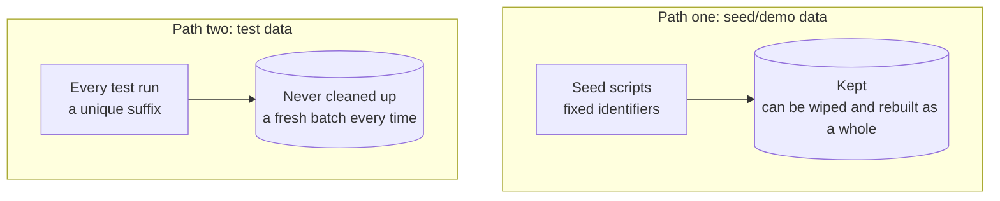

# Seed data

This page is **recommended practice**, following on from the [testing strategy](02-testing-strategy.md): that page covers
how to test in layers; this one covers what data those tests — and a person exploring the whole system by hand — actually
run on. How a component manages its own data is none of the platform's business; the method below comes from the same
real production deployment (14 components, one complete business path).

Two words first:

- **Seed data** (also called demo data): a batch of fake data for people to explore the system locally and give demos
  with, produced by scripts and kept.
- **Test data**: data an automated test creates on the spot on every run, serving only that test's assertions.

## Two paths



| | Seed/demo data | Test data |
| --- | --- | --- |
| Purpose | People exploring locally, demos | Automated tests at every layer |
| How it's produced | Fixed identifiers, idempotent — rerunning the script doesn't rebuild what exists | Created on the spot by each test run, with a timestamp or random number as a unique suffix |
| Lifetime | Kept; can be wiped as a whole | Never cleaned up — rows piling up doesn't matter; the next run has its own new suffix |
| Shared? | Components may look up and reuse each other's (see below) | Never — no test should depend on "this row was left by another test" |

**Why "never cleaned up" is actually better.** Cleaning up at the end of a test means a test failing halfway leaves half
its data behind, which the next run may run into; and two batches of tests running concurrently delete each other's data.
With a new suffix every time and no cleanup, both problems disappear at once — at the cost of a few rows in the database
nobody looks at.

## Physical isolation: never share storage

Wiping the seed data shouldn't turn any test red; a test run shouldn't dirty the data a person is exploring by hand. With
the two paths mixed, "why did this suddenly break" has no single direction to investigate — maybe someone wiped the seed
data, maybe another test ran concurrently — and the two causes are investigated completely differently.

So isolate them **physically**, not just by convention: tests connect to a different database instance (at least a
different database), not two namespaces in the same one. An integration test writing to a row of baseline data (the
default warehouse, the default cost centre) that happens to be what a demo reads — as long as physical storage is shared,
that risk is always there.

**How to do it in BrickKit**: a database address is a component's config item anyway, with its value referencing a shared
variable through `$var:`. Give the tests a deploy file of their own, pointing at the test database in its `vars:`:

```yaml
# config/vars.yaml — the database used normally (exploring, demos)
PG_HOST: pg.dev.internal
PG_PASSWORD: ${PG_PASSWORD}
```

```yaml
# config/people-basic.yaml
DB_HOST: $var:PG_HOST
DB_PASSWORD: $var:PG_PASSWORD
DB_NAME: people
```

```yaml
# deploy.test.yaml — used for integration tests: brickkit up -f deploy.test.yaml
target: docker
vars:
  PG_HOST: pg.test.internal
components:
  - id: people/basic
  # …copy the other components' entries from deploy.yaml: every deploy file lists every component in brickkit.yaml
```

On the `-f deploy.test.yaml` run, every `$var:PG_HOST` gets the test database; normally it's still the development one.
The component's code needn't know which one it's connected to.

**Don't switch to an in-memory database for speed.** When your database uses features an embedded substitute can't
reproduce (partitioned tables, session-level settings like `SET LOCAL ROLE`), switching to a throwaway substitute gives up
exactly what the integration test is there to prove — that the real infrastructure really behaves as expected. The real
fix for "rebuilding data is slow, tests pollute each other" is making **the data itself** disposable — the "unique suffix,
never cleaned up" above — not changing the database.

## One coverage floor, two ways to reach it

Both paths share one floor: **no component should have only "everything's fine" data.** Every branch of a state machine,
every failure path, every data-scope dimension needs data that really triggers it. But the floor is reached differently:

- **Seed data aims to be plentiful and complete.** It also has to serve "can a person experience this whole system", so
  quantity and variety are goals in themselves.
- **Test data aims to be small and precise.** Each test creates exactly enough data to verify its own assertion. The one
  exception is property-based tests of core invariants (a balance never goes negative, a state machine never jumps to an
  illegal state): they need volume so random input is more likely to hit the edges — a different thing from "complete to
  experience".

They aren't a rich and a slim version of the same data — their purposes differ, so they should look different.

## When seed data is "enough"

This takes deliberate design, not just piling up volume:

- **Data scopes really have several values.** Permission boundaries by department, by owner, by warehouse can only be
  clicked through and verified when the data really holds several values. With all the seed data under one all-powerful
  administrator, even a correctly implemented scope mechanism doesn't exist as far as the experience goes.
- **Enough volume to need paging.** A list with cursor paging and 5 rows only ever has one page — the paging contract never
  existed in the experience.
- **Spread out in time**, not all freshly created, so "the last N days", trend charts and time-partitioned logic have
  something to verify.
- **Negative and edge data really exist**: a disabled record, a zero balance, an overdue unpaid invoice, a rejected request.
  A failure path that exists only in your head can't be clicked open.
- **The data can be looked up.** With a lot of data, there needs to be one place to look up "what this fixed identifier
  stands for" — otherwise a new component that wants to reuse it has nowhere to look, and may collide with an identifier
  already taken. One list maintained in one place (component, data, count, owner) beats every component keeping its own.

## Duplicate data between components is fine

It's all fake data, with no risk of polluting real data. Two components each creating something conceptually similar (each
its own "sample customer") isn't worth the coordination cost of de-duplicating. When a component needs data like another
component's, reusing what's already there is far cheaper than negotiating "who should maintain it".

## Ownership: each component creates its own, dependencies first

Centralise seed data at the project level, and the moment someone runs one component on its own with just its
dependencies (a very common way to use it), the central script stops working — it only works when every component runs
together. So:

- **Each component owns and maintains its own seed data.**
- **Before creating its own part, it has the seed data of every declared dependency created first** — required and
  optional dependencies alike: in development and demo environments, declared dependencies are usually all running anyway;
  the required/optional distinction serves "should this optional module be installed" in real deployments, not the order
  of seed data. When a dependency really can't be reached in the current environment, skip it and carry on with your own —
  a missing dependency degrades the seed flow rather than failing it.
- **Hand over through the component's own idempotency mechanism; don't invent a protocol.** When a downstream component
  needs an id from a dependency's seed data, it looks it up in that dependency by the fixed identifier both sides agreed
  on, and gets the matching row.

## Once referenced, a fixed identifier is a contract

Once another component has looked up a fixed seed identifier, it can no longer be deleted or pointed at another meaning —
only added to. Treat it like a field in a published contract: additions are fine; breaking changes need the same
coordination as a real contract change.

## Append-only tables can only be reset as a whole

A table that by nature only ever grows (a ledger, locked accounting periods, an audit log) shouldn't have row-by-row seed
cleanup — sequences don't roll back because a few rows were deleted, and hard deletes quietly violate the table's own
design. The right tool is a full migration reset (roll back every migration and run them again); the side effect is that
the baseline data the migrations themselves load comes back too, since it belongs to the rebuilt schema, not to the seed
scripts.

**Rule of thumb**: append-only tables only ever get a full reset; tables that can safely be deleted row by row can have
either, and day to day the lighter row-by-row cleanup comes first.

## The line never to cross: seed mechanisms never reach production

No mechanism that creates seed data may ever be able to plant a real credential in a real customer's deployment. Once a
test account or a shared password gets mixed into something "run on every deployment" (a database init script baked into
an image, say), it's a back door buried in every installation. No exceptions:

- **Baseline data every deployment really needs** (the default warehouse, the basic chart of accounts, standard units of
  measure) goes through migrations, not seed scripts — it isn't test data, it's part of the product. A component's
  `migration.command` runs before the main service on every deployment, which is exactly the "runs everywhere,
  non-optional" this kind of data needs (see [The migration container](../05-migration/01-migration-service.md)).
- **"How the first administrator gets in" in a real deployment is a config-driven bootstrap problem, not seed data.** Put
  the first real operator's identity in a config item; the component reads it at start-up and idempotently grants it the
  administrator role — nobody writes SQL by hand, and no account is hard-coded anywhere. That's a different problem from
  the "test role with every permission" local development needs; don't let one mechanism stand in for the other.

## What else test data needs

- **Event or message tests need a private subject or topic of their own** — shared with something else on the same
  machine, a real consumer competes with the test for messages.
- **Tests verifying idempotent consumption (de-duplicating by a unique key) use a different identifier on every run** —
  with a fixed string, the second run looks like a legitimate replay to the de-duplication logic and is quietly swallowed,
  never reaching the code under test.
- **Test data doesn't need seed data's dimensions** — paging volume, spread in time, discoverability. Creating more data
  for goals unrelated to this test is pure waste.
