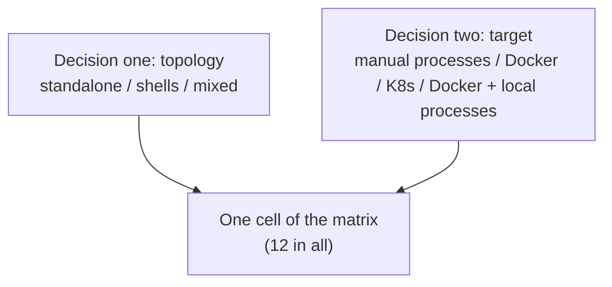

# Choosing a deployment shape

This page answers one question only: **what should a project with N components actually run as?** It doesn't teach you
how to build a shell (see [Writing a shell](../04-shell/05-shell-development.md)), nor the steps to put a component into a
shell (see [Managing members](../04-shell/04-members-management.md)). Read this page first, before the project's overall
shape is decided.

## Two decisions, plus one switch

**Decision one: topology — how many containers do the components end up in?**

- **All standalone**: each component its own container (or Pod). This is the shape you get by writing nothing extra.
- **All in shells**: as many components as can be merged are compiled into a few shells, one container per shell.
- **Mixed**: some in shells, some standalone. This is usually the norm, not a compromise: some components **structurally**
  can't go into a shell — a pure frontend served by nginx has no backend process to compile in; a stateless gateway is
  often kept standalone on purpose, so it can scale on its own load.

A shell is itself an ordinary component (marked `kind: shell` in `brickkit.yaml`); the members it can host are written in
`shell.members` of its `component.yaml`, and **which it hosts this time** is written in the deploy file — member entries
nested under the shell entry's `members`. So topology is decided **per deploy file**: the development machine's
`deploy.yaml` can be all standalone while production's `deploy.prod.yaml` gathers a few members into shells, without a word
of `config/` changing.

**Decision two: the deploy target — `docker` (or `podman`) or `k8s`**, written in the deploy file's `target`. This is
almost entirely an infrastructure question, not a performance one: do you have a Kubernetes cluster, do you need
scheduling across machines and self-healing? If not, `docker` drives everything on one machine with `docker compose`, the
simplest to operate, fit for local development, demos, and small-scale or single-machine production. If so, `k8s`
generates Deployments / Services / Ingresses. The topology decision applies unchanged; switching targets is switching one
deploy file.

**The switch: `mode: debug` / `mode: local` — pull one or two components onto your machine as processes, while the rest
runs in containers as usual.**

- `mode: debug`: you start the process in your IDE, and the platform only makes sure others can find it. It can only be
  written in the personal `deploy.local.yaml`.
- `mode: local`: the platform recognises the start command itself, starts the process and supervises it.

Both **exist only on Docker / Podman**, and are refused when the deploy target is `k8s` — a Pod in the cluster can't reach
your laptop. They combine with any topology: a process on this machine can depend on standalone components, on shells, or
on a member inside a shell; a member inside a shell can itself be pulled out to debug.

The two decisions really are two independent axes, so this is a matrix, not a few preset names:



## One way outside the platform: starting things by hand

Nothing stops you from starting every component as an ordinary process (`go run`, `uvicorn`, or your language's
equivalent), without going through `brickkit up` at all.

**The boundary first: this isn't a shape the platform manages; the platform doesn't even know it exists.** Dependency
resolution, environment variable injection, health checks, migration order and service discovery all don't happen,
because you didn't call it. Which port each process listens on, every variable a real deployment would inject, the start
order — you reconstruct all of it yourself. That's a direct consequence of "the CLI exits when done, with no long-running
service": the platform exists only while a command runs.

It's still entirely legitimate and very common — usually the fastest development loop (no images to build, breakpoints
attach directly).

**A trick worth knowing: have the CLI work out the environment variables for you.** In `deploy.local.yaml`, temporarily
mark the component you'll run by hand `mode: debug`, run `brickkit up --dry-run` once, and read the generated
`.brickkit/generated/local-debug.<versioned service name>.env` — exactly the full set of variables a real deployment would
give it. For instance, `shop/order` depending on the shell member `shop/stock`:

```text
COMPONENT_ID=shop/order
COMPONENT_VERSION=0.1.0
SHOP_STOCK_ENDPOINT=http://localhost:18082
```

Copy what you need, then delete that line (or `brickkit local off`). `deploy.local.yaml` is never committed anyway, so it
affects no one. One thing the trick doesn't cover: addresses you wrote by hand in `config/` assuming the container network
(like `http://host.docker.internal:8000`) — the platform doesn't parse config values and won't rewrite them to
`localhost` for you, just as with `mode: debug` itself.

## The matrix

|  | Manual processes | Docker | K8s | Docker + local processes |
| --- | --- | --- | --- | --- |
| **All standalone** | [1. The starting point before shells](#1-all-standalone--manual-processes) | [2. The standard shape while one machine is enough](#2-all-standalone--docker) | [3. The most generous end](#3-all-standalone--k8s) | [4. Debug one component, keep the rest real](#4-all-standalone--docker--local-processes) |
| **All in shells** | [5. Testing a shell's own orchestration alone](#5-all-in-shells--manual-processes) | [6. Squeezing memory when one machine isn't enough](#6-all-in-shells--docker) | [7. The tightest end](#7-all-in-shells--k8s) | [8. Debug one component, keep the shells real](#8-all-in-shells--docker--local-processes) |
| **Mixed** | [9. Everyday development once shells are in use](#9-mixed--manual-processes) | [10. Where most real projects end up](#10-mixed--docker) | [11. The middle ground on resources](#11-mixed--k8s) | [12. The combination closest to real development](#12-mixed--docker--local-processes) |

There's no 13th cell "K8s + local processes": `mode: debug` / `mode: local` meeting `target: k8s` in a deploy file is
refused while loading, with the component named in the error.

### 1. All standalone × manual processes

**What it is**: every component used is an ordinary process you start by hand, with no containers and no `brickkit up`.

**When**: the most common starting point for developing one component, especially while the project has no shells yet.
When you want the fastest "change code, see the effect" loop.

**Upside**: no image-building step; no container layer between a process and the addresses it connects to, so a problem
has only two variables to check; no need to install Docker.

**Cost**: injection, health checks, service discovery and migration order are all for you to reconstruct; with more
components, assembling a dozen sets of environment variables by hand is real labour and error-prone. The `--dry-run`
trick above saves most of it.

### 2. All standalone × Docker

**What it is**: one Compose service per component, driven end to end by `brickkit up`: address injection, health checks,
starting in dependency order, migrations.

**When**: the default shape while one machine can hold the components. "Can hold" is a real number: each process's memory
floor is almost entirely set by its language runtime — Go / Rust 8–20 MB, Python / Node 40–90 MB, JVM 200–450 MB (typical
orders of magnitude for each runtime; measure your own components). Twenty idle Go components add up to under half a GB;
twenty idle Spring Boot components already take 4–9 GB without doing anything. Stay in this cell until that sum really
doesn't work out on the machine you deploy to.

**Upside**: every component can be started and stopped on its own, and trouble affects only itself; one component means
one container, one log, one health state — the simplest to troubleshoot.

**Cost**: every component pays its own runtime memory floor — the very reason shells exist; a single-machine shape, with no
scheduling across machines and no self-healing.

**Worth knowing**: measure before deciding "it doesn't fit" (`docker stats`); don't take numbers off the table — a
50-component project may run only a few locally, because most are `mode: disable` this time, or nothing needs them.

### 3. All standalone × K8s

**What it is**: one Deployment + Service per component, with addresses resolved by the cluster's native Service DNS.

**When**: the cluster has resources to spare, and there's no need to trade merging for a lower memory floor. Every
component keeps its own `replicas` and its own `resources`.

**Upside**: truly independent horizontal scaling; scheduling across machines and failure recovery work per component.

**Cost**: the highest operational complexity — it needs real cluster administration; the machine running `up` needs
`kubectl`; many components means many Deployment / Service objects.

**Worth knowing**: on K8s, `expose: true` needs `hostname` (Ingress routes by domain name), and Docker's `exposePort` does
nothing; a missing `hostname` is stopped by `up --dry-run`. Addresses in `config/` that assume a single-machine Docker
network have to be changed when moving to K8s — giving different values per environment with the deploy file's `vars:` is
the least work.

### 4. All standalone × Docker + local processes

**What it is**: everything is a real container except the components you marked `mode: debug` or `mode: local`. The
platform makes the other containers resolve that component's versioned service name to your machine (`extra_hosts` pointing
at `host-gateway`); callers get exactly the same address string — only where the name resolves changes.

**When**: you want "the rest is real" and also "no image rebuild for changing this one component". It's only a
development-time overlay; it doesn't decide the production topology.

**Upside**: zero changes to component code; several components can be pulled out at once, each with its own `localPort`;
everything the process on this machine depends on still gets the real addresses the platform works out.

**Cost**: when something can't connect, first ask "does this name resolve to my machine or to a container", rather than
checking the network in general; container-network addresses written by hand in `config/` aren't rewritten.

**Worth knowing**: a `mode: debug` component gets a `local-debug.<service name>.env` for the IDE to load, with multi-line
values and values holding special characters already escaped by shell rules. It **runs no database migration** — the
migration step went away together with its container, so a component with a migration has to have it run by hand the first
time (see [Local debugging](../02-project-guide/03-local-debug-workflow.md)).

### 5. All in shells × manual processes

**What it is**: the shell's own program started straight on your machine, without any orchestration. What you're testing
is the shell's own multi-module orchestration. The platform isn't there, so `BRICKKIT_SERVED_MEMBERS` /
`BRICKKIT_SERVED_MEMBERS_CONFIG` are yours to assemble (or hard-code for the test).

**When**: needed almost only by whoever builds and tests shells: verifying the shell's start order, health check and
failure isolation between modules without the container layer, before handing it to a real deployment.

**Upside**: the fastest loop for shell development; "a bug in the shell's orchestration" can be separated cleanly from "a
problem in the container layer".

**Cost**: none of the platform's guarantees exist here — it can only prove the shell behaves right on data you assembled
yourself. The exact shape of the two variables is in [Config as JSON](../04-shell/02-json-injection.md).

**Worth knowing**: the module registry inside a shell should be keyed by **the full component ID plus version**, so that a
real deployment can host two versions of one component at once — a trap that only shows up when two versions really are
fed in, worth practising on purpose in this cell.

### 6. All in shells × Docker

**What it is**: as many components as possible compiled into a few shells; one Compose service per shell, and members
generate no service container of their own. The member addresses callers get are still the members' own versioned service
names — network aliases of the shell's container, with no caller code changing.

**When**: when the memory sum of cell 2 really doesn't work out — not before. Before doing it, try cheaper things first:
give the expensive components a lighter runtime (compiling JVM components into GraalVM native images drops the memory floor
from hundreds of MB to tens, with the deployment shape unchanged); check whether the components driving the number up could
be `mode: disable` this time anyway.

**Upside**: a shell carries one runtime floor and one connection pool, not N; fewer containers, faster start-up, fewer logs
to watch and fewer things to restart.

**Cost**: members sharing a shell share a failure domain (one crash can take down the other modules, unless the shell is
built very carefully) and a unit of scaling (one member can't get extra replicas on its own).

**Worth knowing**:
- Members' migrations **are still run by the platform**: with the member's own image and config, and the shell starts only
  once they succeeded (see [Migrations and shells](../05-migration/04-shell-interaction.md)). So every member must have an
  image of its own.
- Which members a shell image really compiles in is checked by `up` against the image's label, and a mismatch stops it
  (`IMAGE_STALE`), rather than a shell missing a member quietly starting.
- Fields on a member entry describing "how its own container is deployed" (`expose`, `replicas`, `resources` and so on) do
  nothing inside a shell; they're kept for when the member falls back to a standalone component.
- Merging can create a start wait cycle; `up` stops it and gives three ways out (see
  [Managing members](../04-shell/04-members-management.md#start-cycles-caused-by-merging-and-skipwaitfor)).

### 7. All in shells × K8s

**What it is**: the same merging against a cluster: one Deployment per shell; one Service per member, whose `selector`
picks the shell's Pod and whose port is the member's own declared port; members generate no Deployment of their own.

**When**: the cluster's resources really are tight, and pushing the total cost down matters more than scaling a member on
its own.

**Upside**: both "merging saves memory" and "K8s self-healing and scheduling across machines". With network policies on, a
member's callers and dependencies are counted into the shell's rules automatically.

**Cost**: every cost of cell 6 holds unchanged; so does every K8s cost of cell 3 — merging doesn't lower K8s' own demands.

**Worth knowing**: Pods have no start order on K8s, so wait cycles caused by merging aren't stopped here, and `skipWaitFor`
only warns and does nothing; members' migrations are still their own Jobs.

### 8. All in shells × Docker + local processes

**What it is**: cell 4's overlay, only "the rest" is shells. Both directions work:

- A process on this machine depends on a member: the address it gets is a real `http://localhost:<port>` — the mapping is
  opened on the **shell's** Compose service (the member has no service of its own), on the port the member declares, which
  the shell must listen on anyway.
- A member itself is pulled out: in `deploy.local.yaml`, write `mode: debug` and `localPort` on that member under the shell
  entry's `members`; the shell doesn't host it this time, and it runs on your machine.

**When**: the component you're changing has to talk to the real, already merged rest, and you don't want to rebuild any
image.

**Upside**: no need to know which shell a member is in; the rest stays whole and real.

**Cost**: every limit of cell 4 applies unchanged. With a member pulled out for debugging, the shell hosts one module fewer
this time — the shell must handle one item fewer in `BRICKKIT_SERVED_MEMBERS` correctly.

### 9. Mixed × manual processes

**What it is**: the components used this time are started by hand in their real shapes — standalone components as in cell
1, shells as in cell 5.

**When**: everyday development once the project's production topology uses shells. Start only the few you're changing,
and the local result still reflects real address resolution and cross-process calls.

**Upside**: keeps the fastest loop past the scale of "all standalone"; reconstructing the real shape lets you hit
shape-related bugs locally (a shell registry keyed wrong, say).

**Cost**: the most manual preparation of any cell; nothing checks that the "who is where" you set up by hand agrees with the
deploy file.

### 10. Mixed × Docker

**What it is**: some standalone containers, some in shells, all driven by one `brickkit up`. Who is where is decided
entirely by where entries sit in the deploy file (at the top level, or under a shell's `members`).

**When**: where a mature project usually ends up, and usually **structurally**, not as a resource compromise — components
like frontends and gateways don't belong in shells to begin with. When you're unsure which cell an on-premises delivery
should use, this is usually the answer.

**Upside**: standalone where independence is needed, memory saved everywhere else; both kinds of entry sit side by side in
one deploy file, with no special handling.

**Cost**: troubleshooting means carrying two mental models at once; the costs of the merged half and of the standalone half
each hold unchanged — mixing doesn't average them out.

**Worth knowing**: an old version of a component running standalone while a new version runs in a shell can coexist with
zero coordination (see the end of this page).

### 11. Mixed × K8s

**What it is**: cell 10's mixed topology against a cluster: standalone components each with a Deployment + Service,
members' Services pointing at the shell Pods.

**When**: resources neither tight nor generous: most components stay in shells to keep the total cost down, and the few
that really need their own replica count or resource quota are picked out and deployed on their own. Unlike cell 10, mixing
here is often a **resource-tuning** decision — a component that could structurally be merged perfectly well is split out
deliberately, to scale on its own.

**Upside**: the most flexible resource allocation; address resolution and network policies support mixing natively, with
no extra configuration.

**Cost**: the full K8s operational cost and the full merging cost at once; the most places to look when something goes
wrong: K8s itself, a shell's internal orchestration, ordinary containers.

### 12. Mixed × Docker + local processes

**What it is**: the real mixed topology running in Docker, with one more component pulled onto your machine. The
combination closest to real development, because "the rest" is the project's real production shape.

**When**: the component you're changing has to be checked against the topology the project will really use.

**Upside**: without touching production, it's the nearest thing to "debugging against production"; address resolution
works in both directions (see cells 4 and 8).

**Cost**: you have to understand shell merging, the address resolution of processes on this machine and the behaviour of
ordinary containers all at once — there's no simpler mental model to fall back on.

## One conclusion across all 12 cells: versions side by side need no extra care

No cell changes how several versions of the same component coexist. Versioned service names make coexistence independent
of topology and of deploy target: old callers and new ones, a version running standalone and a version in a shell, can all
coexist in one deployment. The platform doesn't check whether old and new versions work together correctly — keeping
contracts compatible is the component author's responsibility (see
[Several versions side by side](../03-component-guide/09-multi-version-coexistence.md)).

## Comparing two environments

Each environment has one complete deploy file, so comparing two environments needs no dedicated command; two ordinary
`diff`s are enough:

1. `diff -u deploy.yaml deploy.prod.yaml` shows **what you wrote differently**.
2. A `diff` of two `up --dry-run` outputs shows **what those differences lead to** — which components don't start as a
   result, and why.

Real output below: `demo/caller` requires `demo/hello` and optionally depends on `demo/bus`; the production file switches
to `k8s` and turns `demo/hello` off:

```text
$ diff -u deploy.yaml deploy.prod.yaml
--- deploy.yaml
+++ deploy.prod.yaml
@@ -1,10 +1,8 @@
-# deploy.yaml — how this project is deployed: the target, and which components run and how.
-# The team file: commit it. Your personal copy is deploy.local.yaml (brickkit local on).
-target: docker # docker | podman | k8s
-
+target: k8s
 components:
   - id: demo/hello
+    mode: disable
   - id: demo/bus
   - id: demo/caller
     expose: true
-    exposePort: 18080
+    hostname: shop.example.com
```

```text
$ diff <(brickkit up --dry-run 2>&1 | grep -v '^{') \
       <(brickkit up --dry-run -f deploy.prod.yaml 2>&1 | grep -v '^{')
1c1,2
< 🚀 Starting project my-shop (target: docker)
---
> Using deploy.prod.yaml (--file)
> 🚀 Starting project my-shop (target: k8s)
3,5c4,6
<    ✅ demo/hello@1.0.0   starting (demo/caller needs it)
<    ✅ demo/bus@1.0.0     starting (demo/caller needs it)
<    ✅ demo/caller@1.0.0  starting (top-level)
---
>    ⬜ demo/hello@1.0.0   disabled explicitly (mode: disable)
>    ⬜ demo/bus@1.0.0     not starting (nothing above it is starting)
>    ⬜ demo/caller@1.0.0  not starting (required dependency demo/hello is not starting)
```

(The second `diff` goes on with differences in start order and generated files, cut here.)

The second one gives the consequences directly: not only does `demo/hello` not start, `demo/caller` doesn't either (it
requires `demo/hello`), and `demo/bus`, with nothing above needing it, doesn't start. The `mode: disable` line in the first
`diff` alone doesn't tell you any of that.

- `grep -v '^{'` filters out the JSON log lines the CLI writes on stderr; otherwise they mix into the human-readable output
  and the `diff` is full of noise.
- What's compared here is **the start decision**, not the generated deployment files themselves: one side is
  `compose.yaml`, the other a set of Kubernetes manifests, which can't be compared line by line anyway.
