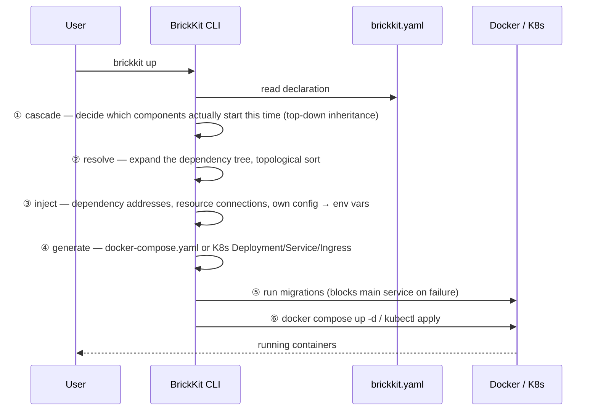

# Architecture overview

BrickKit is a **component management and assembly platform**: build systems like snapping together bricks, where each component (brick) is developed, deployed, and called independently, and the CLI's only job is to pull them, order them, generate the deployment files, and hand off to Docker or Kubernetes. It is **not** an operating system, not an ERP, and not any specific piece of business software — it's a tool for growing an architecture incrementally.

## The four parts

| Part | Form | Long-running? | Responsibility |
| --- | --- | --- | --- |
| **BrickKit CLI** | Local single binary | No — runs and exits | Fetch, resolve, generate, invoke, publish, manage the source workspace |
| **BrickKit Market** | Independent SaaS (self-hostable) | Yes | Component publishing/discovery, versions/visibility/signing, artifact storage |
| **Component layer** | Docker containers / K8s Pods | Yes | The actual business logic; components talk to each other directly over DNS |
| **Infrastructure layer** | PostgreSQL / Redis / etc. | Yes | **Deployed manually by ops**, bound by declaration in `brickkit.yaml` |

Of these four, only the CLI is not long-running — it exits as soon as a command finishes. The desired state lives in `brickkit.yaml`, the actual state lives in Docker/Kubernetes, and the CLI itself holds no state in between.

## What happens when you run `brickkit up`



Here is that same pipeline made concrete with components that actually exist in this repository. Running `brickkit add erp/backend@1.0.0` recursively pulls in `erp/backend`'s three required dependencies (`people/basic`, `auth/password-login`, `authorization/rbac`) plus one optional one — to keep this walkthrough focused, it follows just one of those chains: [`tests/components/people-basic/`](../../../tests/components/people-basic/) is a direct dependency, and [`tests/components/department-tree/`](../../../tests/components/department-tree/) comes along transitively because `people/basic` itself requires it. That's why (among the others) [`tests/components/erp-backend/`](../../../tests/components/erp-backend/), `department-tree`, and `people-basic` end up together in one `brickkit.yaml`. Now run `brickkit up`:

- **① cascade** finds none of the three declare `enabled`, and each is either at the top of the dependency chain or required by something that is, so all three start;
- **② resolve** expands the dependency tree and topologically sorts it, which forces the start order `department-tree` → `people-basic` → `erp-backend` (dependencies before dependents);
- **③ inject** writes `DEPARTMENT_TREE_ENDPOINT=http://department-tree-1-0-0:8080` for `people/basic`, and a similar address pointing at `people-basic` for `erp/backend`;
- **④ generate** translates each of these components' `component.yaml` into its own service in `docker-compose.yaml` — one part of the full service set generated for `erp/backend`'s complete dependency tree;
- **⑤ run migrations** runs the migration commands `department-tree` and `people-basic` each declare (`erp/backend` itself has no `migration` field, so it's skipped) — `auth/password-login` and `authorization/rbac` each declare their own migration too, run the same way;
- **⑥** finally, `docker compose up -d` brings these containers up (along with the rest of `erp/backend`'s dependency set).

Among the resulting service names are `erp-backend-1-0-0`, `department-tree-1-0-0`, and `people-basic-1-0-0` — the next section explains exactly how each name is derived. For a harder version of steps ① and ② — a real diamond dependency, a real cycle, and turning a component off — see [Dependency resolution and start order](dependency-resolution.md).

## Versioned service names and the unified address format

**Service name = transformed component ID + exact version.** The transformation is three rules: `/` → `-`, `.` → `-`, all lowercase. `erp/backend` at version `1.0.0` becomes `erp-backend-1-0-0`.

The address format is **identical** under Docker and Kubernetes: `http://<versioned-service-name>:<port>`. Locally that's `http://department-tree-1-0-0:8080`; on a K8s cluster it's the exact same string — component code never needs to know which environment it's running in. This rule produces two direct consequences: **multiple versions coexist for free** (`people-basic-1-0-0` and `people-basic-2-0-0` are two non-conflicting DNS names), and **a caller always knows exactly which version it's talking to** — there is no implicit upgrade.

A real example beats the transformation rule on its own. Below is the actual `dependencies.components` block from [`tests/components/erp-backend/component.yaml`](../../../tests/components/erp-backend/component.yaml):

```yaml
dependencies:
  components:
    # 强依赖：注入 PEOPLE_BASIC_ENDPOINT（HTTP，8080）
    # 与 PEOPLE_BASIC_GRPC_ENDPOINT（gRPC，来自它声明的 extraPorts，9090）。
    # 本组件用的是后者
    - people/basic@1.0.0
    # 强依赖：注入 AUTH_PASSWORD_LOGIN_ENDPOINT
    - auth/password-login@1.0.0
    # 强依赖：注入 AUTHORIZATION_RBAC_ENDPOINT（gRPC 与 HTTP 共用主端口）
    - authorization/rbac@1.0.0
    # **弱依赖**：没装它时平台完全不注入 INFRA_REDIS_EVENT_BUS_ENDPOINT，
    # 本组件据此降级——审批照常成功，只是不发事件（003 §4.3）
    - id: infra/redis-event-bus@1.0.0
      optional: true
```

(The comments are in Chinese in the source file, quoted here verbatim rather than translated, since this is meant to be the literal file content.) The four dependency lines map to four environment variable names, each **derived directly from the component ID** (`/` and `-` become `_`, uppercased, with `_ENDPOINT` appended) — no separate variable-name declaration is needed. This is also why BrickKit has no dependency aliasing: once that two-way mapping between variable name and component ID is broken, seeing `IAM_ENDPOINT` no longer tells you which component it points at.

## What the platform deliberately doesn't do, and why

| Doesn't do | Why | Symptom if you route around it |
| --- | --- | --- |
| A long-running daemon / control plane | The CLI runs and exits; state lives externally in `brickkit.yaml` plus the underlying engine. No background process means no single point of failure, no idle resource usage, no listening port | Build your own persistent orchestration daemon to solve "nobody remembers to run `up`," and you've recreated the exact single point of failure and attack surface BrickKit was designed to avoid |
| Service registry / address book | Docker Compose service DNS and Kubernetes Service DNS already provide service discovery for free; the platform doesn't need to build and keep highly available a registry of its own | Wire a custom service-discovery SDK into component code and the component is no longer a "zero-touch" deployment — it now depends on something that must be kept alive by hand, while the free DNS it replaced sits unused |
| API gateway / service mesh / load balancing | Components call each other directly over DNS; Kubernetes Service already load-balances. Gateway routing rules vary too much by business to standardize without forcing a bad fit | Skip the platform's `labels` passthrough and hand-write a Traefik file-provider config with versioned service names baked in, and that config silently goes stale the moment a component's version bumps — the platform won't warn you |
| Version-range resolution (`^1.0.0`) | Ranges are the classic cause of "works on my machine, breaks in production"; exact versions also let the version number be embedded directly in the service name, making multi-version coexistence free | Write `^1.0.0` / `~1.0.0` / `latest` in `dependencies` or `brickkit.yaml` and the CLI rejects it immediately at resolve time — the problem never survives to reach runtime |
| Multi-environment overlay inheritance | An overlay forces you to mentally reconstruct "base layer / override layer / merge rules" before you can read the final config, and a Git diff of the base layer can't tell you which environments it silently affects | Reuse config via `base.yaml` + `prod-overlay.yaml` and the only thing you save is typing a few lines — the cost is that a change to the base layer can silently affect environments you can't identify by looking at the diff, and the CLI provides no command to merge such files anyway |
| Config value type validation | Once value validation is allowed, the questions never stop — validate `enum`? `minimum`? `pattern`? — and JSON Schema's full complexity ends up inside the CLI; a component should decide for itself whether to error or fall back to a default on bad config | Declare `type: integer` in `configSchema` and let a user fill in a string — the CLI won't stop it. The component crashes only when its own code calls `int()` on that string — discovered at runtime, not at `brickkit up` |
| Weak-dependency fallback logic | Whether a missing Redis means "query the database instead," "return an empty list," or "write to a local file and retry" is a pure business decision, and the right answer differs by component | Expect the platform to "automatically" handle a missing weak dependency and nothing happens — the platform's only action is to skip injecting the corresponding `*_ENDPOINT` entirely. Component code that reads it with `os.environ["X"]` crashes immediately with a `KeyError` (this is intentional — safer than silently injecting an empty string) |

---

To dig into the full argument behind any one of these decisions, see [`docs/archive/design/012-架构设计原理与考量.md`](../../archive/design/012-架构设计原理与考量.md) (historical record, Chinese only). For the complete field or command reference, see sections 6, 7, and 8 of `AGENTS.md` (the `component.yaml` skeleton, the `brickkit.yaml` skeleton, and the CLI command set).
