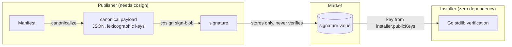

# Signing and the Trust Model

AGENTS.md §5.9 states the trust model in one line: the publisher signs with cosign, the installer verifies with the Go standard library, and the platform's only after-the-fact defense is marking a component `blocked`. This document is about the mechanics underneath that line — what actually gets signed, why the two sides of signing use such different tools, why the public key can never come from the marketplace itself, and a real, verified example of the reserved-variable defense that keeps a component's own config from quietly overriding a platform-injected value.

## What gets signed is a canonicalized payload, not the Manifest's raw bytes

A Manifest crosses several different representations on its way from a publisher to an installer: `component.yaml` (YAML) → converted to JSON for upload → stored as JSON by the marketplace → fetched by the CLI → parsed back into the Manifest structure. The byte sequence is different at every one of those steps. Signing any one step's raw bytes would break the moment a different step's serializer made a different (but semantically identical) choice — a comment, an indentation style, a key order — and it would break *unpredictably*, depending on which marketplace version or which proxy happened to be in the path that day.

So the object that actually gets signed is a **canonical payload**: the Manifest parsed into a data structure, then re-encoded with one fixed rule (JSON, keys in lexicographic order). Two documents that mean the same thing produce byte-identical canonical output regardless of how either one was originally written — which also means a comment, a quoting-style change, or reordered YAML keys never counts as tampering, because none of them change what the canonical form looks like.

Canonicalization itself has to close one attack surface to be trustworthy: **duplicate keys are rejected outright, not resolved by picking one.** If two parties each compute their own canonical form of "the same" document, both sides need certainty that the same document can never be parsed into two different structures — and a duplicate key is exactly the case where different parsers disagree (some keep the first occurrence, some keep the last). Rather than pick a convention and hope every implementation agrees with it, a Manifest with a duplicate key is simply invalid.

This is also where the closed-source image-hardening guide's digest-pinning recommendation actually closes its gap (see [Protecting closed-source components from image-based extraction](../patterns/closed-source-image-hardening.md)): the signature covers the Manifest, and `deployment.image` is a string field inside it — signing the Manifest alone only guarantees that string wasn't altered, not that the string still resolves to the same image bytes it did at signing time. `brickkit publish` resolves a mutable tag to its digest *before* canonicalizing and signing, by default, so the string the signature actually covers is one a registry can't quietly repoint later. Skipping this needs the explicit `--no-pin-digest` flag, which prints a loud warning naming this exact risk rather than skipping silently.



## Why signing needs cosign installed, but verifying never does

The asymmetry is deliberate, not an inconsistency: **every installer has to verify, but only a publisher — usually a CI pipeline — ever signs.** cosign's `sign-blob` produces a standard ECDSA P-256-over-SHA-256 signature (ASN.1 DER, base64-encoded) against a standard PKIX PEM public key — both are things the Go standard library can check natively, so verification carries zero additional dependencies. Signing is the side that actually benefits from cosign's own scope: password-protected keys, KMS-backed keys, hardware keys, keyless signing tied to an OIDC identity — key management this varied is squarely cosign's problem to solve, not something worth re-implementing to shave off one dependency on the publishing side.

The consequence is what makes `installer.requireSignature: true` viable as a production default at all: if verification also needed cosign installed, enforcing signatures in production would mean installing cosign on every machine and every CI runner that ever runs `brickkit add` — and most teams, faced with that, would just turn the check off rather than carry the dependency everywhere. Making the expensive tool only necessary for the rare operation (publishing) and the cheap, dependency-free path the common one (installing) is what keeps the check realistic to actually enforce.

## Why the public key has to live in your own project, never fetched from the marketplace

A signature's metadata carries a `publicKeyRef` — a *name*, not the key material itself (AGENTS.md §7). Something has to resolve that name to an actual public key, and where that resolution happens decides whether the whole mechanism means anything:

| Where the key comes from | What a marketplace compromise actually costs you |
| --- | --- |
| Fetched from the marketplace itself | The marketplace is now issuing its own certificates to itself. If it's ever compromised, an attacker swaps the component *and* the public key together — verification still passes, and the signature has defended against nothing |
| Configured in the project (`installer.publicKeys`, versioned in Git alongside `brickkit.yaml`) | The trust anchor lives with the installer, survives a marketplace compromise untouched, and picks up ordinary code-review scrutiny as part of the project's own Git history |

Only the second option is implemented at all — a `publicKeyRef` that can't be found in the project's own `installer.publicKeys` is a verification failure, full stop, with no fallback to "fetch one from wherever the component came from." AGENTS.md §7 already states the sharpest consequence of this design: **`publicKeys` is the only field that actually makes verification take effect** — with zero keys configured, `requireSignature: true` does nothing at all, because there's no trust anchor to check a signature against, and the CLI can only warn about this once, after the fact, not stop you from shipping that configuration.

## Reserved variables: a publish-time rejection and an injection-time warning, and only one of them is easy to demonstrate without a live marketplace

AGENTS.md §5.2 describes two layers of defense against a component's own config colliding with a platform-injected variable: the marketplace refuses a colliding `configSchema` key at publish time, and the CLI warns and skips the colliding item at injection time. The second layer is real, verified output — declare a `configSchema` property named `backendEndpoint` (which uppercases to `BACKEND_ENDPOINT`, a suffix match against the reserved `*_ENDPOINT` pattern) and run `brickkit up`:

```
⚠️ 配置冲突：组件 demo/hello 的配置项已被忽略
   组件：demo/hello
   配置项：backendEndpoint
   环境变量名：BACKEND_ENDPOINT
   冲突的保留模式：*_ENDPOINT
   处理：该配置项已被忽略，平台注入的值优先
   建议：
   1. 修改 configSchema 中的配置项名称，避开平台保留变量
   2. 例如改为 backendBaseUrl
```

The component still starts — this is a warning, not a blocked deployment — but `backendEndpoint`'s declared default is silently absent from the container's environment, exactly as advertised: the platform-injected value (if any component actually depended on `demo/hello` and got a real `*_ENDPOINT` injected under that name) always wins, and the CLI even proposes a concrete rename rather than just naming the problem.
