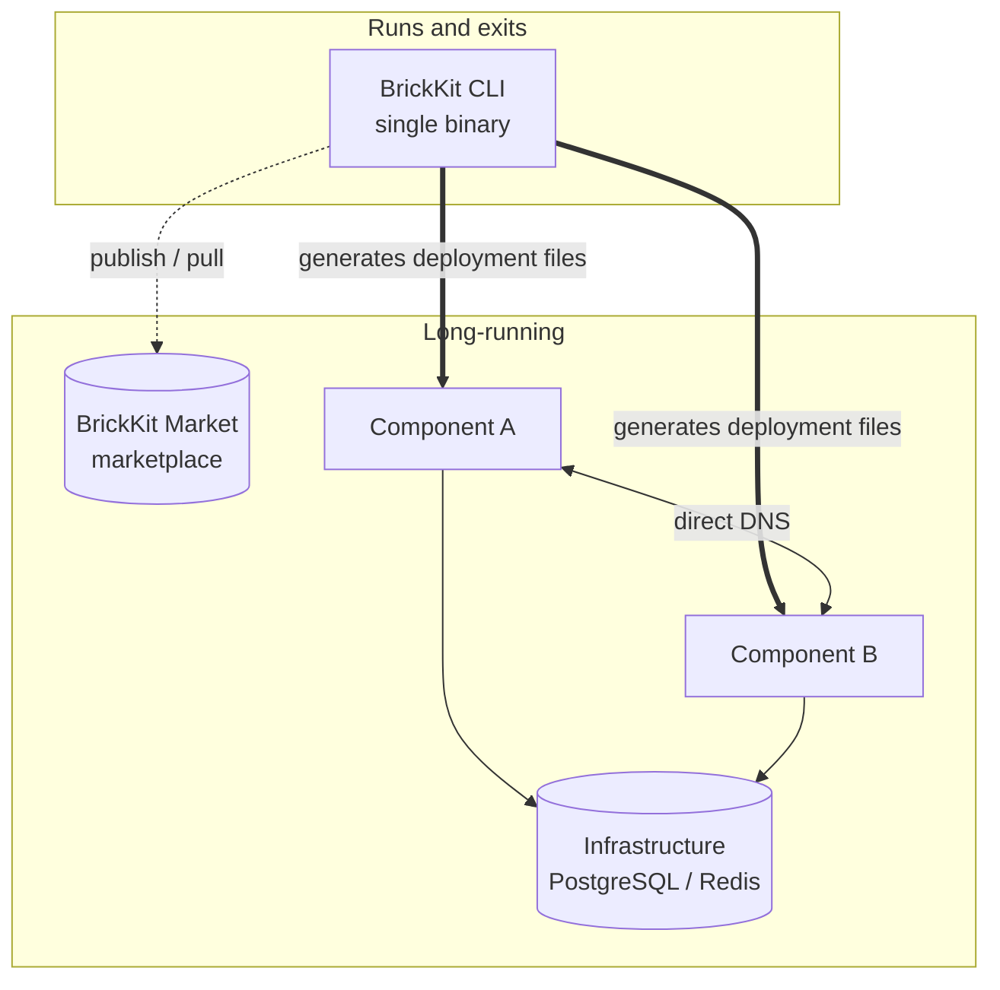
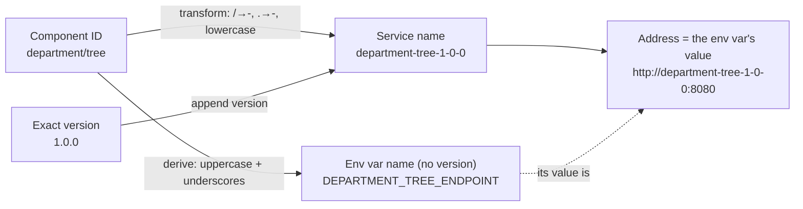

# Core Concepts

If all you want is BrickKit's skeleton in five minutes, so the docs and error messages stop throwing unfamiliar terms at you — this page is that. The full definitions live in [AGENTS.md](../../AGENTS.md)'s glossary and twelve design principles; this is just a faster way in.

## Four parts

| Part | Form | Long-running? | Responsibility |
| --- | --- | --- | --- |
| **BrickKit CLI** | Local single binary | ❌ Runs and exits | Pulling, parsing, generating, invoking, publishing, source-workspace management |
| **BrickKit Market** | Independent SaaS (self-hostable) | ✅ | Component publishing/discovery, versions/visibility/signing, artifact storage |
| **Component layer** | Docker containers / K8s Pods | ✅ | The business logic itself, components call each other over DNS directly |
| **Infrastructure layer** | PostgreSQL / Redis, etc. | ✅ | Deployed manually by ops, declared and bound in `brickkit.yaml` |

The diagram deliberately draws the CLI with a dashed line, boxed off in its own "runs and exits" corner — there's no fifth part, no resident "main system." `brickkit up` runs and exits; what's actually running afterward is just your component containers and infrastructure.

## Key terms

| Term | Definition |
| --- | --- |
| Component | The most basic install-and-run unit, **always a container**, including frontends |
| Manifest (`component.yaml`) | A component's self-description: dependencies, ports, config schema, health check |
| Project config (`brickkit.yaml`) | Project-level declaration: component list, enabled state, local debug, exposure, config overrides, resource bindings, deploy target |
| Required Dependency | Missing → the CLI **errors and blocks startup** |
| Optional Dependency | `optional: true`; missing → only a warning, and **the env var is not injected at all** (not injected as an empty string) |
| Versioned Service Name | A service name carrying an exact version, e.g. `people-basic-1-0-0` |
| Local Debug Mode | `local: true`; the component runs on the host inside an IDE, mapped into the container network via `extra_hosts` |
| Source | Where a component comes from: the marketplace (HTTP) / a Git repo / a local directory |
| Resource | External systems a component depends on (databases, Redis, etc.), deployed by ops, bound in `brickkit.yaml` |
| Env Injection | The CLI writes dependency addresses, resource connections, and own config into env vars when generating deployment files |
| Deploy Target | `docker` or `k8s`, decides which kind of deployment file the CLI generates |
| servedBy | A component declaring "my workload is provided by another component (a shell)" — it generates no container of its own |

## The one rule that runs through everything: service names, and why the env var name never carries a version

**Service name = transformed component ID + exact version.** Transform rule: `/` → `-`, `.` → `-`, all lowercase. **The environment variable name is derived from the component ID alone and never carries a version; only its value points at a specific one.** Split apart those read as two rules — put together, they're the same design:

| Component ID | Version | Service name |
| --- | --- | --- |
| `people/basic` | 1.0.0 | `people-basic-1-0-0` |
| `erp/backend` | 2.1.3 | `erp-backend-2-1-3` |

The address format is **exactly the same** locally (Docker) and in production (K8s): `http://<versioned-service-name>:<port>`. This one rule alone explains two things: multiple versions coexist for free (two versions are just two non-conflicting DNS names), and a caller always knows exactly which version it's talking to — no implicit upgrades.

And the variable *name* carrying no version is exactly what that right-hand derivation path in the diagram gives you — `DEPARTMENT_TREE_ENDPOINT` is derived purely from `department/tree`, independent of which version it happens to be pointing at. This is also why a single component ID can only appear once within one `component.yaml`'s `dependencies` — two versions would collide on the same variable name, with the latter silently overwriting the former, so the CLI rejects this outright while parsing the Manifest. Version coexistence is therefore a **project-level** capability (`brickkit.yaml` can list two version entries side by side for different callers), not a component-level one.

## `enabled`: top-down inheritance

| Value | Meaning | Behavior |
| --- | --- | --- |
| **not written** | Follows the top | A top-level component (nothing depends on it) runs by default; a lower one follows whatever's above it |
| `enabled: true` | Always runs | Ignores what's above it. If its required dependencies are turned off, it errors (two conflicting intents) |
| `enabled: false` | Never runs | Whatever depends on it stops too |

A lower-level component shared by multiple upstream components keeps running as long as at least one of them still needs it — it's never accidentally taken down. This is also why `brickkit add` never writes an `enabled` field on its own: leaving it unwritten already means "follow the top."

## Read further

- [Architecture overview](architecture/overview.md)
- [Dependency resolution](architecture/dependency-resolution.md)
- [Deployment generation](architecture/deployment-generation.md)
- [AGENTS.md](../../AGENTS.md) — the full glossary, twelve design principles, and twenty-three "why" justifications
