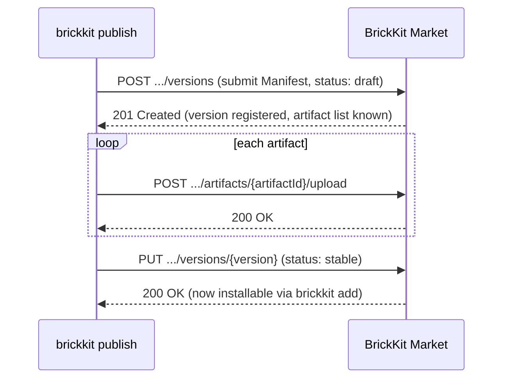

# Market API Reference

The HTTP API reference for the BrickKit Market. This describes **implemented endpoints only** — the source of truth is the real route table in `market-server/internal/handler/handler.go`, which a test guards against ever documenting something that doesn't exist.

Under normal use you never call these directly: `brickkit login`/`add`/`publish` already wrap them. This page is for whoever is writing their own market client, or wants to understand the exact behavior underneath the CLI.

## Conventions

**Base URL:** wherever your market instance is deployed; every path below is relative to that, prefixed with `/api/v1`.

**Authentication:** endpoints that need it take a Bearer Token:

```
Authorization: Bearer <market-token>
```

The token comes from `POST /api/v1/auth/login` — it's the same value `brickkit login` writes into `.brickkit/credentials`. Read-only queries against public components don't need authentication; everything touching a private component, and publishing, does.

**Response envelope:** every response has the same shape:

```json
// success
{"success": true, "data": { ... }}

// failure
{"success": false, "error": {"code": "...", "message": "...", "details": { ... }}}
```

`error.details` carries structured detail (a list of validation problems, conflict info, etc.) when there is any — not every error has it.

## Error codes

| Code | HTTP status | Meaning |
| --- | --- | --- |
| `INVALID_REQUEST` | 400 | The request body isn't valid JSON, or a field failed validation |
| `MANIFEST_INVALID` | 400 | The Manifest submitted with a publish failed validation |
| `CONFIG_SCHEMA_RESERVED_VARIABLE_CONFLICT` | 400 | A `configSchema` field name collides with a reserved environment variable |
| `CLOSED_SOURCE_MISSING_API_CONTRACT` | 400 | A closed-source component didn't provide an API-contract artifact |
| `UNAUTHORIZED` | 401 | No token, or the token is expired/invalid |
| `FORBIDDEN` | 403 | The token is valid, but this identity isn't allowed to do this |
| `COMPONENT_BLOCKED` | 403 | The component has been blocked by a market admin |
| `NOT_FOUND` | 404 | The component / version / organization, etc. doesn't exist |
| `CONFLICT` / `VERSION_ALREADY_EXISTS` | 409 | A state conflict (e.g. that version number is already published) |
| `INTERNAL` | 500 | A market-side error — the specifics stay in server logs, never leak to the client |

## Auth and accounts

| Method | Path | Auth | Notes |
| --- | --- | --- | --- |
| POST | `/api/v1/auth/register` | No | Body: `username`, `password`, `email` (optional). Returns a `User` object, with the password hash never included |
| POST | `/api/v1/auth/login` | No | Body: `username`, `password`. Returns `token` and `expiresAt` — exactly what `brickkit login` stores in `.brickkit/credentials` |
| POST | `/api/v1/auth/logout` | Yes | Revokes only the token this request carried (not every token on the account). Repeated calls are idempotent; no body needed |

⚠️ **If a registration request includes `orgId`, the server silently ignores it.** Organization membership is itself the authorization mechanism for private components — if registration could self-report an org, anyone could write in someone else's org ID and read every private component that org has access to: details, Manifest, artifacts, all of it. The only door into an org is the "add organization member" endpoint below, and only that org's owner or a market admin can open it.

## Organizations

| Method | Path | Auth | Notes |
| --- | --- | --- | --- |
| GET | `/api/v1/organizations` | Yes | List organizations. A regular user sees only the one they belong to; a market admin sees all of them |
| POST | `/api/v1/organizations` | Yes | Create an organization — the creator becomes its owner and is added automatically |
| POST | `/api/v1/organizations/{orgId}/members` | Yes (org owner or market admin only) | Add a member |

A user belongs to at most one organization. Adding someone who's already in a different org returns an **explicit conflict** instead of silently moving them — that would suddenly cut off their old org's private components. Adding the same person twice is idempotent.

## Components

| Method | Path | Auth | Notes |
| --- | --- | --- | --- |
| GET | `/api/v1/components` | Depends on visibility | Search. Query params: `keyword`, `page`, `pageSize`, `tags` (comma-separated, repeatable). Only returns non-blocked components the calling identity is allowed to see |
| GET | `/api/v1/components/{scope}/{name}` | Depends on visibility | Component detail |
| PUT | `/api/v1/components/{scope}/{name}/visibility` | Yes | Set visibility (`public`/`private`) |
| GET | `/api/v1/components/{scope}/{name}/access` | Yes | Read the access policy — which users/orgs a private component is granted to |
| PUT | `/api/v1/components/{scope}/{name}/access` | Yes | Update the access policy |

**Three endpoints deliberately don't exist:**

| Missing endpoint | Why |
| --- | --- |
| `POST /api/v1/components` (create a component on its own) | The server creates a component automatically on the first `publish` — a standalone create endpoint would have no caller |
| `PUT /api/v1/components/{scope}/{name}` (edit component metadata) | A component's name/description/vendor travel with the Manifest and update together on every new version — letting them be edited separately would let the market's description drift from the Manifest |
| `DELETE /api/v1/components/{scope}/{name}` (hard delete) | Published things are never physically deleted; to take one down, set a version's status to `blocked` |

## Versions

| Method | Path | Auth | Notes |
| --- | --- | --- | --- |
| GET | `/api/v1/components/{scope}/{name}/versions` | Depends on visibility | List versions |
| POST | `/api/v1/components/{scope}/{name}/versions` | Yes | Publish a new version (see below) |
| PUT | `/api/v1/components/{scope}/{name}/versions/{version}` | Yes | Update version status (`draft`/`stable`/`deprecated`/`blocked`) |
| DELETE | `/api/v1/components/{scope}/{name}/versions/{version}` | Yes | Soft-delete a version |
| GET | `/api/v1/components/{scope}/{name}/versions/{version}/manifest` | Depends on visibility | Fetch that version's Manifest |

**Deliberately missing:** a standalone "version detail" endpoint. Everything it would return is already in the version list, and that's what the CLI itself reads.

### Publishing a new version

The body for `POST /api/v1/components/{scope}/{name}/versions`:

```json
{
  "version": "1.0.0",
  "status": "draft",
  "manifest": { /* component.yaml, parsed to JSON */ },
  "sourceType": "git",
  "gitUrl": "https://github.com/org/repo",
  "changelog": "Initial release",
  "visibility": "public",
  "signature": {
    "algorithm": "cosign",
    "publicKeyRef": "keys/vendor.pub",
    "value": "<base64 signature value>",
    "signedBy": "release-bot@example.com"
  }
}
```

`sourceType` is `git` (open source — the CLI can clone the source) or `registry` (closed source — only an image and artifacts, and an `api-contract` artifact is required). `signature` is optional — the market only stores it and checks its structure (is the algorithm recognized, are the required fields present, is `value` valid base64). **It does no cryptographic verification** — the market has no trusted public key of its own to check against. Real verification happens on the installer's side, against whatever public key is configured in `installer.publicKeys`.

Publishing is three steps: `POST .../versions` (create a `draft`), upload each artifact's content one at a time (`POST .../artifacts/{artifactId}/upload`), then `PUT .../versions/{version}` to mark it `stable`. `brickkit publish` wraps all three into one command:



A version stuck at `draft` is never installable — `brickkit add`/`brickkit fetch` both skip it. A failure partway through doesn't leave a half-finished mess behind either: re-running `brickkit publish` recognizes the same unfinished draft and resumes uploading, instead of creating a new version from scratch. But if the Manifest genuinely changed in the meantime (even with the version number unchanged), the CLI refuses to resume and tells you to bump the version — so you never end up thinking you shipped new code while the server is still holding the old draft.

## Artifacts

| Method | Path | Auth | Notes |
| --- | --- | --- | --- |
| GET | `/api/v1/components/{scope}/{name}/versions/{version}/artifacts` | Depends on visibility | List that version's artifacts |
| POST | `/api/v1/components/{scope}/{name}/versions/{version}/artifacts/{artifactId}/upload` | Yes | Upload one artifact's content |
| GET | `/api/v1/components/{scope}/{name}/versions/{version}/artifacts/{artifactId}/download` | Depends on visibility | Download an artifact's file |

⚠️ The artifact **manifest** (which artifacts exist, and each one's type) is registered alongside the Manifest when the version is published. The upload endpoint sends one artifact's actual **content**; `{artifactId}` refers to an entry already registered in that manifest.

## Operations and auditing

| Method | Path | Auth | Notes |
| --- | --- | --- | --- |
| GET | `/api/v1/health` | No | Health check — this is what a self-hosted market's Compose healthcheck probes |
| GET | `/api/v1/audit` | Yes | Query the audit log |

## Read further

- [Signing and the trust model](architecture/signing-and-trust.md) — why the market stores signatures but never verifies them
- [Self-hosting the BrickKit Market](patterns/deployment/self-hosted-market.md) — deploying the market itself
- [CLI command reference](architecture/cli-reference.md) — how `login`/`publish`/`add` use this API under the hood
