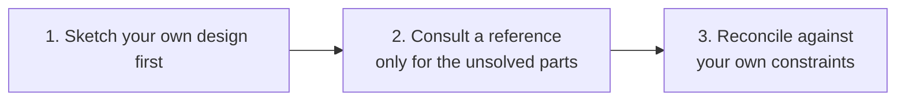

# Component Design Guidelines

This is **recommended practice**, not a BrickKit platform requirement — the
same status as the other documents in this series
([testing](testing.md), [data construction](data-construction.md)):
BrickKit's component autonomy principle (AGENTS.md §4) leaves how a
component's own domain model gets designed entirely up to whoever builds
it. What follows is methodology the same real production deployment that
validated the testing and data-construction guidance validated for
component design as well: how to research a domain before designing it,
and one specific signal worth recognizing while doing that research —
when a feature isn't a configuration flag, but a sign that several
independent components need to exist side by side.

## Start from a reference implementation, not a blank page

Business-logic design should almost always start by looking at how mature
real-world software already solves the same problem. This isn't modesty
— a domain model that took years of real deployments to shape has already
absorbed edge cases a from-scratch design will almost certainly miss, and
those missed edge cases tend to surface three months after a customer is
already live on the new system, not during design review.

**The order matters, and reversing it produces a worse result than
skipping the research altogether:**



| Step | What to do | Why this order |
| --- | --- | --- |
| **1. Design your own version first** | Sketch a design against your own project's actual constraints before opening any reference | Bringing your own plan to someone else's implementation is what lets you see where the real difference is. Reading with an empty head just produces a copy. |
| **2. Consult a reference only for the parts you couldn't work out** | How the domain model is carved up, what states a state machine has and which transitions are legal, which fields are mandatory, how edge cases are actually handled | This step is research, not copying homework — you already know what you're looking for. |
| **3. Come back and think it through yourself before writing anything** | Reconcile what you learned against your own project's real constraints | A reference project's tech stack and component boundaries are almost never like yours (different language, different process/database topology). Copying it verbatim is neither possible nor correct — the point was never to port the code, only to borrow the reasoning behind it. |

**Closed-source products are worth consulting too**, even though you can't
read their source. You can still observe how a mature product is actually
*used*: which features customers touch every day, which ones nobody ever
clicks, which workflows have been complained about for years. This is
often more valuable than source code for judging whether a capability
deserves to become its own independently-releasable component in the
first place — and that judgment matters more than any implementation
detail, because it comes earlier and is harder to undo.

**On licensing**, briefly: consulting a reference for its reasoning and
then re-implementing it independently — possibly in a different language
— does not create a derivative work. What to actually avoid is opening
the other project's source file and transcribing it line by line.
Following the three steps above keeps you well clear of that line. If
code genuinely needs to be used directly, restrict this to permissively
licensed projects (Apache-2.0 / MIT / BSD) and preserve the original
notice.

**Record what was consulted**, as part of the component's own design
notes, before implementation starts — this is cheap to write down at the
time and expensive to reconstruct later once someone asks "why does this
field exist":

```markdown
## Reference Implementations

| Project | Version/commit | Module consulted | What was borrowed | License (verified) | Usage |
|---|---|---|---|---|---|
| Odoo | 17.0 | `addons/product/models/product_uom.py` | The table design for unit-of-measure conversion factors and its rounding strategy | LGPL-3 | Borrowed reasoning |
| A closed-source product | — | — | How multi-unit conversion is actually used day to day: which conversions come up constantly, which are never touched | Closed source | Borrowed real-world usage |

**Explicitly not consulted** (state this, so the next reader doesn't assume it was overlooked):

**What to deliberately avoid** (name the specific anti-pattern found in a reference, and why this component doesn't replicate it):
```

Three legal values for "Usage": **Borrowed reasoning** (read the
implementation, understood why it works that way, then designed and
built an independent version — this is the value in almost every row),
**Borrowed real-world usage** (a closed-source product, or documentation
consulted rather than source), and **Copied code** (used verbatim — only
permitted for Apache-2.0/MIT/BSD projects, with the original attribution
preserved and the exact file and section named).

## A failure pattern worth naming while comparing references

Reading several mature implementations of the same domain tends to
surface the same handful of structural weaknesses, often inherited from
an earlier era of the same architectural tradition. Recognizing this
while reading is exactly the point of doing the reading — it's the chance
to deliberately not repeat something everyone else got stuck with:

| Weakness commonly found in mature references | How to design around it |
| --- | --- |
| Every module shares one process and one database, so cross-module table joins become routine and the intended module boundary is "soft" — crossed constantly | Independent components, independent schemas, a real boundary enforced by actual access control rather than convention — this is the boundary BrickKit's own component model already gives you for free (AGENTS.md §4's component autonomy) |
| Customization done via runtime patching or hooks into the base implementation, so every upgrade risks breaking every customization | A separately versioned fork plus a locked contract, so an upgrade is an explicit, deliberate merge — never an automatic one silently interacting with patched code |
| Metadata-driven everything (dynamic fields, a generic "document type" abstraction), so there's no static type an IDE or a type checker can use to catch a mistake before runtime | A real schema/contract plus a statically-typed implementation where your language supports it |
| Reports query live transactional tables directly, so a heavy analytical query degrades the transactional path | Reports go through a summary table or a dedicated component, never the live transactional path |
| Tables grow forever with no plan, and the system eventually gets crushed under its own history | Design every growable table as partitioned from day one, with an explicit archival policy |

## Recognizing a slot-family signal

While comparing references, one specific situation comes up repeatedly:
**the same feature has genuinely different implementations across several
mature systems, and — this is the qualifier that matters — each one is
reasonable, just suited to a different customer profile.**

This is not a "should we make it configurable" question. It's a signal
that the feature needs a family of interchangeable components, not a
single implementation with a flag buried inside it.

The judgment hinges entirely on that qualifier:

- If several implementations turn out to make one **clearly better** than
  the rest → that's your one implementation. No family needed.
- If several are **each defensible, serving genuinely different customer
  profiles** → there's a real, distinct need for each, and it deserves a
  proper family of separate, interchangeable components.

| Feature | The real divergence found across references | Conclusion |
| --- | --- | --- |
| Costing method | Moving weighted average / FIFO / standard cost with variance / batch actual cost — four approaches, each correct for a different industry | Needs a family |
| Warehouse picking strategy | First-expiry-first-out / FIFO / nearest-bin / wave picking | Needs a family |
| Approval routing | Strict hierarchy / amount-tiered / matrix-based / rule-engine-driven | Needs a family — though this is business logic, not infrastructure, so it belongs in a business-facing component, not something a generic platform mechanism should try to express |
| Document numbering scheme | Sequential / year-month-segmented / org-and-type-segmented | **Not** a family — a single configuration item covers this |
| Which fields exist on a core master-data record | Every reference differs only in "a few more fields, a few fewer" | **Not** a family — that's a customization concern, not an architectural one |

## What "a family" actually means on BrickKit

Once the signal above is recognized, the shape it takes here follows
directly from mechanisms the platform already has — this isn't a new
concept BrickKit needs to learn:

1. **Each family member is published as its own, independent component**
   — its own repository, its own Manifest, its own version history
   (AGENTS.md §9.16's "one component, one repository" applies here
   exactly as it does anywhere else). `pricing/costing-fifo` and
   `pricing/costing-standard-cost` are two components, not two modes of
   one component.
2. **Every family member exposes an identical contract surface.** A
   caller written against one member has to work unmodified against any
   other — this is what actually makes the family interchangeable, not
   just conveniently similar.
3. **Nothing may hold a fixed dependency edge on one specific family
   member.** This is the hard constraint that makes something eligible to
   be a family member at all, and it has a precise meaning in BrickKit
   terms: a component's own `dependencies.components` entry names an
   exact component ID at an exact version (AGENTS.md §6) — baked into
   that component's Manifest at publish time, not something a project's
   `brickkit.yaml` can redirect afterward (this is exactly why dependency
   aliasing was rejected as a platform feature — AGENTS.md §9.23). So a
   component that calls into a slot **must not** declare
   `pricing/costing-fifo` as an ordinary dependency; it should instead
   declare a `configSchema` address field (the same escape hatch AGENTS.md
   §9.23 already names for "a service that needs an address but not a
   dependency edge") and let whichever project is assembling this system
   supply the actual endpoint of whichever family member it has chosen to
   install. If something already declares a fixed dependency on one
   specific member, that member has already stopped being swappable — the
   correct shape from there is either "one component with an internal
   strategy" (see the point below on when *not* to build a family) or a
   full, separately maintained fork.
4. **Register the family before writing any implementation**: name it,
   define what the shared contract surface actually is, identify which
   customer profile each member serves, and decide which one — if any —
   ships as the default choice for a new project.

**Never write a branch like `if costingMethod == "fifo"` inside a single
component to paper over a real slot-family signal.** That packs multiple
customers' genuinely different needs into one codebase, where every
customer's requirement now constrains every other customer's build — the
same "pull one thread, the whole thing moves" failure that component
autonomy exists to prevent in the first place. **The one exception**: the
divergence is small enough to be a couple of conditional branches, and
there's no foreseeable third or fourth variant on the horizon — reaching
for a whole separate component for a difference that will plausibly never
grow past two branches is its own kind of overbuilding.

This discipline also happens to be the physical precondition for letting
a customer build a closed-source customization starting from whichever
family member is closest to what they actually need: the more closely a
family's members already track the real divergence found during
reference research, the closer a customer's fork starting point already
is to what they want, and the less custom work is left to do afterward.
