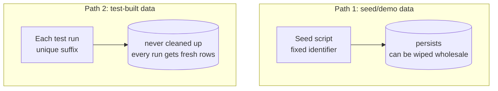

# Planning Seed Data and Test Data

This is **recommended practice**, not a BrickKit platform requirement — the
same status as [Testing patterns for components built on
BrickKit](testing.md), which this document continues: that guide covers how
to layer tests, this one covers where the data those tests (and a human
exploring the assembled system) actually run against comes from. It's
recommended practice for the same reason: BrickKit's component autonomy
principle (AGENTS.md §4) leaves how a component manages its own data
entirely up to the component. What follows is a methodology the same real
production deployment that validated the testing layering — 14
components, one complete business workflow — validated in practice for
data as well, generalized into BrickKit-neutral guidance.

## Two paths, physically separate, never shared

| | Seed/demo data | Test-built data |
| --- | --- | --- |
| **Used for** | A human exploring the system locally, or a demo | Automated tests, at every layer |
| **How it's produced** | A fixed identifier, claimed idempotently — rerunning the seed script doesn't rebuild what's already there | Built fresh by the test itself, on every run, disambiguated with a unique suffix (timestamp, random number) |
| **Lifecycle** | Persistent; can be wiped wholesale | Never cleaned up — accumulating rows is fine, since the next run gets its own fresh suffix regardless |
| **Shareable?** | Components may look each other's seed rows up and reuse them (see below) | Never — no automated test should depend on a row some other test or some other run happened to leave behind |

Wiping seed data should never turn a test red, and a test run should never
contaminate the data a human is exploring by hand. Once these two paths
mix, "why did this suddenly break" stops having one investigation path —
it could be that someone wiped the seed data, or that some other test ran
concurrently and didn't clean up, and those two causes need completely
different digging. Keeping the paths independent removes the ambiguity at
the root, and it's worth doing physically, not just as a convention: point
tests at a database that's genuinely separate from the one a human
explores, not two logical namespaces sharing one physical instance. A real
integration test writing to a baseline reference row (a default warehouse,
a default cost center) that a human's demo session also reads from is
enough to make that human watch their own data change for no visible
reason — and that risk exists the instant the two paths share physical
storage, regardless of whether anything is running concurrently at the
time.

BrickKit already gives you the mechanism to do this without inventing
anything new: declare two separate `resources:` entries in `brickkit.yaml`
(AGENTS.md §7) — one for exploration, one dedicated to tests — and give
the test-facing one its own `envPrefix` so the component's test setup
reads a distinct set of `DATABASE_*`-style variables from the start. This
is an ordinary use of a mechanism the platform already has, not a new one
this document is asking for.

If your database has features a lightweight embedded or in-memory
substitute can't reproduce faithfully (partitioned tables, session-scoped
settings like `SET LOCAL ROLE`), swapping in a throwaway database for
speed trades away exactly the thing an integration test is supposed to
prove — that the real infrastructure behaves as expected. The actual fix
for "rebuilding data is slow and test runs contaminate each other" isn't a
different database, it's making the data itself disposable: the
unique-suffix, never-cleaned-up pattern above.

## The same coverage principle, achieved two different ways

Both paths share one floor: **no component should have only the
"everything's fine" kind of data.** Every state-machine branch, every
failure path, every data-scope dimension needs data that can actually
trigger it — this applies whether the data comes from a seed script or a
test. But the two paths hit that floor differently:

- **Seed data aims for many and complete.** It's simultaneously serving
  "can a human fully experience this system," so volume and variety are
  themselves part of the goal, not just a means to test coverage.
- **Test data aims for few and precise.** Each test needs exactly the
  data its own assertion requires — piling on volume "for richness" adds
  nothing. The one exception is property-based testing for a core
  invariant (a balance never goes negative, a state machine never reaches
  an invalid transition): that needs volume too, but for a different
  reason — maximizing the chance randomized inputs actually land on a
  boundary condition, not experience completeness.

These aren't a rich version and a lean version of the same data set — they
serve different purposes and are supposed to look different.

## What makes seed data actually "enough" — this needs deliberate design, not just row count

- **Data-scope dimensions need genuine multiplicity.** A permission or
  ownership boundary (by department, by owner, by warehouse — whatever
  your domain's actual scoping dimension is) only becomes something a
  human can meaningfully click through and verify once there are multiple
  real values for it in the data. Seed data that all hangs off one
  all-powerful account makes the entire scoping mechanism invisible in
  practice, even if it works correctly.
- **Volume needs to actually trigger pagination**, if a list endpoint is
  cursor-paginated. Five rows always fits on one page — pagination as a
  contract has no real presence in the experience until there's enough
  data to force a second page to exist.
- **Time needs to be spread out**, not everything freshly created at seed
  time, so that "last N days"-style queries, trend views, and any
  time-partitioned logic have a real scenario to run against.
- **Negative and edge-case data needs to exist as data, not just as an
  idea**: a disabled record, a zero balance, an overdue item, a rejected
  request. A failure path that only exists in someone's head can't be
  clicked into.
- **Data needs to be discoverable.** Once volume goes up, there needs to
  be one place that says what a given fixed identifier actually
  represents — otherwise a new component wanting to reuse existing seed
  data has nowhere to look, and risks colliding with an identifier it
  didn't know was taken. A single running list (component, data, quantity,
  owner) serves this better than every component maintaining its own copy
  of the same information.

## Redundancy across components is fine — even useful

All of this data is fake; there's no real-data-contamination risk to
manage. If two components each independently seed something conceptually
similar (two separate notions of "a sample customer," say), deduplicating
them isn't worth the coordination cost — redundancy here is nearly free,
and "a large volume of data that looks complete" is itself one of the
goals in the first place. When a component needs data similar to what
another component already seeds, reusing it directly is cheaper than
negotiating who should own the canonical version.

## Ownership: every component seeds itself, dependencies first

Centralizing seed data at the assembly layer breaks the moment someone
brings up one component alone together with its dependency tree (a
supported, common BrickKit workflow) — a centralized script only works
once every component is already running together. So:

- **Every component owns and maintains its own seed data.**
- **Before seeding its own part, a component seeds everything it declares
  as a dependency** — required and optional treated the same way here, for
  a reason specific to this context: in a development or demo environment
  every declared dependency is normally already running, so there's no
  "only some of the dependencies are installed" scenario to hedge
  against, and declaring a dependency at all already means the component
  genuinely uses it (the strong/weak distinction exists for a real
  deployment's "do I need to buy this module" question — AGENTS.md's
  optional-dependency semantics — not for a development-time seeding
  order). If a declared dependency genuinely isn't reachable in the
  current environment, skip seeding it and continue with the component's
  own part — a missing dependency should degrade the seed run, not fail
  it outright.
- **Use each component's own idempotency mechanism as the handoff, not a
  new protocol.** A downstream component that needs an id a dependency's
  seed data produced looks it up by querying that dependency for the row
  matching a fixed, agreed identifier — there's no need to invent a format
  for one script to print ids for another to consume.

## Once referenced, a fixed seed identifier is a lightweight contract

The moment another component has looked up a fixed seed identifier, that
identifier can't be casually deleted or repointed at a different meaning
— only added to. Treat it the same way you'd treat a field in a published
API contract: additive changes are fine, breaking ones need the same
coordination a real contract change would.

## Append-only data needs a full reset, not row deletion

If a table is append-only by nature (a ledger, a locked accounting
period, an audit log), it shouldn't have a row-by-row seed-cleanup path
at all — only a full reset. Deleting rows one by one can't restore an
append-only table to a genuinely clean state (a sequence doesn't roll
back because rows were removed), and doing it anyway quietly violates the
table's own design. The right tool is a full migration reset (tear down
and reapply every migration) — which, as a side effect, means the
baseline data your migrations themselves seed comes back too, since it's
part of the schema being rebuilt, not the seed script's job.
**Rule of thumb: an append-only table gets a reset path, never a
row-deletion cleanup path**; a table that's safe to delete from row by
row can have both, and the lighter row-level cleanup (touching nothing
else) is the one to prefer day to day.

## The one hard boundary: seed mechanisms must never leak into production

Whatever generates seed data must never be able to plant a real credential
in a real customer's deployment. The moment a test account or a shared
password ends up inside something that runs on every deployment
(a database-init script bundled into the image, say), it's a permanent
backdoor in every installation of that component — the same category of
risk as shipping a production auth flow with a direct password-login
grant type left enabled. This line has no exceptions:

- **Genuinely universal baseline data every deployment needs** (a default
  warehouse, a base chart of accounts, a set of standard units of
  measure) belongs in a migration, not a seed script — it isn't test
  data, it's part of the product. BrickKit already gives this a home: a
  component's `migration.command` (AGENTS.md §5.5) runs before the main
  service starts, on every deployment, which is exactly the "runs
  everywhere, isn't optional" property this kind of data needs.
- **"How does the first admin get in" for a real deployment is a
  configuration-driven bootstrap question, not a seed-data question.**
  The first real operator's identity goes into a config value the
  component reads on startup to grant itself an admin role idempotently —
  nobody hand-writes SQL, nothing is hardcoded. This solves a different
  problem than the "superuser test role holding every permission" that
  local development and demos need, and the two mechanisms shouldn't be
  made to substitute for each other.

## What test data specifically needs, beyond §1's unique-suffix rule

- **A consumer/event test needs its own private subject or topic** when
  it publishes an event to trigger the code under test — sharing a
  subject with whatever else might be running on the same machine risks
  a real consumer competing for the same message.
- **A test verifying idempotent-consumption logic (deduplication by a
  unique key) must use a unique identifier per run, not a fixed string**
  — a fixed string means the second test run looks, to the deduplication
  logic, exactly like a legitimate replay of the first, and gets silently
  swallowed instead of actually exercising the code path.
- **Test data doesn't need any of §4's seed-specific dimensions** —
  pagination volume, time spread, discoverability. A test only needs
  data that precisely matches its own assertion; manufacturing extra data
  in service of "experience completeness" that has nothing to do with
  that one test is pure waste.
