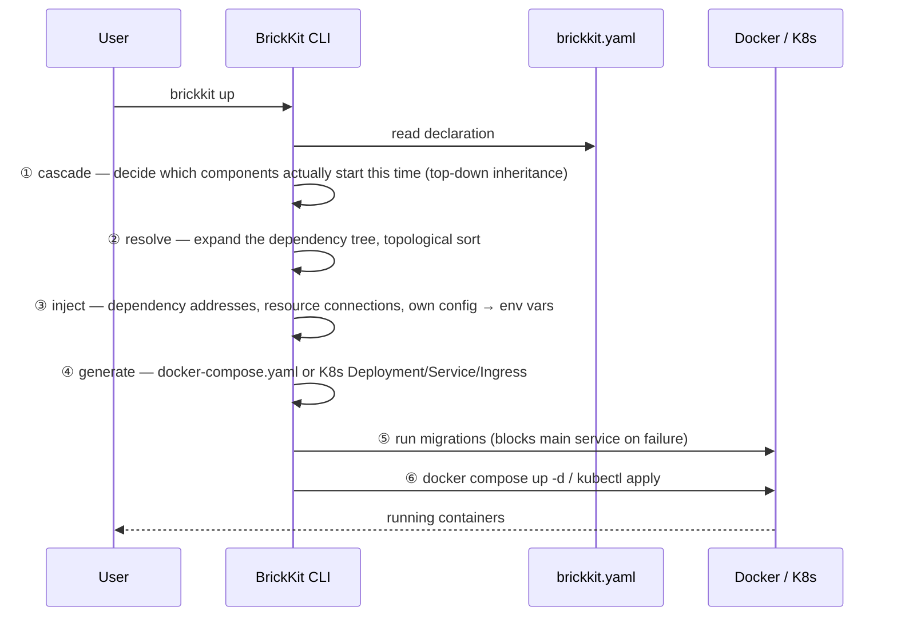

# 文档体系重构（阶段一：骨架与入口）Implementation Plan

> **For agentic workers:** REQUIRED SUB-SKILL: Use superpowers:subagent-driven-development (recommended) or superpowers:executing-plans to implement this plan task-by-task. Steps use checkbox (`- [ ]`) syntax for tracking.

**Goal:** 把 brickKit 仓库自己的文档从"默认中文、英文只有一句打发"重建成"默认英文、中文对等服务、AI 优先可发现"的结构；旧的 `design/`、`试用指南/` 等整体归档为历史记录；新增 `docs/en/`、`docs/zh/` 对称双语内容树，根目录 README 也拆成 `README.md`/`README.zh.md` 对等的一对；目录与文件命名从一开始就按可扩展到第三种语言设计（`docs/<lang>/`、`README.<lang>.md`），本轮只落地英文与中文；并用两篇示范文档（一篇 architecture、一篇 patterns）证明新结构立得住。

**Architecture:** 新建 `docs/{en,zh}/{architecture,guide,patterns}/` 三个类别，`docs/archive/` 收纳冻结的旧内容；`README.md` 保持用户向定位，`AI-CONTEXT.md` 改名 `AGENTS.md`（+ 一行 `CLAUDE.md`）承担 AI 压缩全貌 + 路由；`llms.txt` 重新生成为中英文分节的全站索引。九道现有文档门禁按"是否还在验证一份仍在维护的文档"重新分工：三道纯"文档跟不跟得上 CLI"的门禁收窄范围排除归档内容，两道"拿文档当测试脚本"的真回归测试改路径继续跑，新增一道双语镜像 + 链接完整性门禁。

**Tech Stack:** Go（tests/docfields、CLI 本体）、Python 3（scripts/check-*.py）、Bash（scripts/check-guides.sh）、Markdown + Mermaid。

**Spec:** [`docs/superpowers/specs/2026-09-13-bilingual-docs-restructure-design.md`](../specs/2026-09-13-bilingual-docs-restructure-design.md) —— 本计划的任务顺序、目录蓝图、门禁分工全部照此文件的决策执行；执行者应该两份一起读。

## Global Constraints

- 对称双语：`docs/en/` 与 `docs/zh/` 结构完全镜像，任何一份都要能独立完整阅读（spec §3）。
- `docs/archive/` 下的内容永远只中文，不重写、不追译，只搬迁位置（spec §3）。
- 全部新目录用英文命名：`architecture/`、`guide/`、`patterns/`（spec §3）。
- AI 入口文件命名为 `AGENTS.md` + 一行 `CLAUDE.md`（内容固定为 `@AGENTS.md`），不再叫 `AI-CONTEXT.md`（spec §3）。
- README.md 保持用户向定位（是什么/怎么装/怎么卸/基础命令/不做什么/怎么上手/仓库结构），不吸收 AGENTS.md 的压缩说明书内容（spec §3）。
- README 也要对称双语：`README.md`（英文）与 `README.zh.md`（中文）内容对等，顶部各一行语言切换链接互指（spec §3）。
- 语言约定要能直接扩展到第三种语言：`docs/<lang>/` 与 `README.<lang>.md` 这两个命名模式本身不写死"只支持英中两种"，本轮只落地 `en`/`zh`（spec §4）。
- `docs/{en,zh}/architecture/` 与 `docs/{en,zh}/patterns/` 下的新文档：每份只回答一个问题；禁止裸的"见上文"引用；每条禁令带"为什么"+"症状"；用 mermaid + 真实代码示例，不用纯文字描述机制（spec §6）。
- "用户把裸仓库地址丢给 AI 就能找到一切"这条链路必须保留：README 顶部固定一段给 AI 的指令块，指向 `AGENTS.md` 的 raw 链接与 `llms.txt`（spec §5）。
- 每完成一个 Task 就提交一次（仓库约定：改完测过就提交，不用等确认）。所有 commit message 末尾按仓库当前约定加 `Co-Authored-By: Claude Sonnet 5 <noreply@anthropic.com>`。

---

### Task 1: 建立目录骨架，归档旧内容为历史记录

**Files:**
- Create: `docs/en/.gitkeep`、`docs/zh/.gitkeep`（占位，防止空目录不入库；后续任务产出真实文件后可删）
- Move (`git mv`): `design/` → `docs/archive/design/`；`试用指南/` → `docs/archive/guide/`；`开发进度/` → `docs/archive/decisions/`；`开发计划.md`、`发布与分发.md`、`市场部署与运维指南.md`、`部署模式.md`、`组件合并部署.md` → `docs/archive/planning/`
- Modify: 归档后的每个 `*.md` 文件顶部插入一行历史存档提示（脚本批量处理，见 Step 3）

**Interfaces:**
- 产出：`docs/archive/design/`、`docs/archive/guide/`（含 `playground/` 子目录原样搬入）、`docs/archive/decisions/`、`docs/archive/planning/` 四棵子树，供 Task 2 的门禁脚本路径更新引用。

- [ ] **Step 1: 建目录骨架**

```bash
mkdir -p docs/en docs/zh docs/archive/planning
touch docs/en/.gitkeep docs/zh/.gitkeep
git add docs/en/.gitkeep docs/zh/.gitkeep
```

- [ ] **Step 2: 用 git mv 搬迁旧内容（保留历史）**

```bash
git mv design docs/archive/design
git mv 试用指南 docs/archive/guide
git mv 开发进度 docs/archive/decisions
git mv 开发计划.md docs/archive/planning/开发计划.md
git mv 发布与分发.md docs/archive/planning/发布与分发.md
git mv 市场部署与运维指南.md docs/archive/planning/市场部署与运维指南.md
git mv 部署模式.md docs/archive/planning/部署模式.md
git mv 组件合并部署.md docs/archive/planning/组件合并部署.md
```

- [ ] **Step 3: 验证搬迁没丢文件**

```bash
find docs/archive -name '*.md' | wc -l
```

Expected: 与搬迁前 `design/`（14）+ `试用指南/`（23 篇 + README，共 24，playground 里的 README 不计入 md 主体但也会被这条 find 数进去，属预期）+ `开发进度/`（README + 决策索引 + 延后实现清单 + 项目元信息 + 完成记录 7 篇 = 11）+ 5 份根目录方法论文档，总数应该与搬迁前 `find design 试用指南 开发进度 -name '*.md' | wc -l` 加 5 的结果一致——搬迁前后各跑一次这条命令，两个数字（后者 = 前者 + 5）对不上就说明漏了文件，先排查再继续。

- [ ] **Step 4: 批量给归档文件加历史存档提示**

```bash
for f in $(find docs/archive -name '*.md'); do
  if ! head -3 "$f" | grep -q "历史存档"; then
    printf '> ⚠️ **历史存档，可能与当前 CLI 行为不一致。** 这是 brickKit 重构文档体系前的旧版原文，不再维护——理解现在的平台请看 <https://github.com/brickKit/brickKit/tree/main/docs/zh/architecture> 与 <https://github.com/brickKit/brickKit/tree/main/docs/zh/guide>。\n\n%s\n' "$(cat "$f")" > "$f.tmp"
    mv "$f.tmp" "$f"
  fi
done
```

- [ ] **Step 5: 抽查三个文件确认 banner 正确插入且原内容完整**

```bash
head -5 docs/archive/design/001-平台理念与总体架构.md
head -5 docs/archive/guide/README.md
head -5 docs/archive/decisions/决策索引.md
```

Expected: 每个文件第一行是历史存档提示，空一行后紧接原来的 `#` 标题，原文件其余内容不变（用 `git diff --stat` 确认每个文件只多了两行，没有内容丢失）。

```bash
git diff --stat docs/archive/design/001-平台理念与总体架构.md
```

Expected: `2 insertions(+)`（只加了 banner 行和空行）。

- [ ] **Step 6: 提交**

```bash
git add docs/archive
git commit -m "$(cat <<'EOF'
文档重构 1/9：旧 design/试用指南/开发进度 与四份方法论文档整体归档为历史记录

对称双语重构的第一步：把当初为开发 brickKit 本身沉淀的规范/验证/决策记录
挪进 docs/archive/，保留 git 历史，每篇顶部加历史存档提示。这些内容不再
维护、不追译，价值是可追溯而不是给新读者理解平台用——理解平台改看后续
任务新建的 docs/{en,zh}/architecture 与 docs/{en,zh}/guide。

Co-Authored-By: Claude Sonnet 5 <noreply@anthropic.com>
EOF
)"
```

---

### Task 2: 更新全部文档门禁脚本，适配新路径

**Files:**
- Modify: `tests/docfields/docfields_test.go`
- Modify: `scripts/check-cli-docs.py`
- Modify: `scripts/check-doc-tree.py`
- Modify: `scripts/check-docs.py`
- Modify: `scripts/check-guide-output.py`
- Modify: `scripts/check-guides.sh`

**Interfaces:**
- 依赖 Task 1 产出的 `docs/archive/{design,guide,decisions}/` 路径。
- 本任务完成后 `make check-docs check-cli-docs check-doc-tree check-doc-fields check-guide-output` 全部针对新路径可跑通（`check-guide-output`/`check-guides.sh` 需要真实 Docker 环境，见 Step 6/7 的验证说明）。

**背景（为什么要拆成"停用"与"改路径"两类，不是全部一刀切）：**

`design/`、`试用指南/` 归档后不再维护。九道门禁里，`check-doc-fields`（`tests/docfields`）、`check-cli-docs.py`、`check-doc-tree.py` 三道验证的是"文档跟不跟得上 CLI 真实行为"——继续对着一份"承诺不再更新"的文档验证这件事，本身就自相矛盘，而且注定会随 CLI 未来演进而失败，届时没人会去改一份定义为"历史记录不重写"的旧文档。这三道的做法是**收窄范围，排除归档内容，保留对 `README.md`/`AGENTS.md`/`docs/en+zh` 等仍在维护的文档的验证**。

`check-guide-output.py`、`check-guides.sh`、`check-docs.py` 三个脚本的性质不同：前两个是**拿旧指南/设计书里的操作步骤当测试脚本，真的执行命令验证 CLI 没退化**——这是回归测试，价值与"文档是否还在维护"无关，做法是**改路径继续跑**。`check-docs.py` 检查的是悬空小节引用与断链——纯粹的内部一致性，不要求内容随 CLI 演进，同样是**改路径继续跑**。

- [ ] **Step 1: `tests/docfields/docfields_test.go` —— 停止扫描 `design/`，删除专属检查 `附录合集.md` 完整性的测试**

编辑 `docs()` 函数（约第 57-69 行），去掉 `design/*.md` 的 glob：

```go
// docs 收集根目录的 AI-CONTEXT.md 与 README.md。
//
// design/ 已归档为历史记录，不再参与"文档跟不跟得上 CLI"的验证——继续验证
// 一份承诺不再更新的文档没有意义。试用指南也不在其中：那里的 YAML 多是
// "改这一行"的片段，本来就不会被分类到（见 classify）。
func docs(t *testing.T) []docFile {
	t.Helper()

	var out []docFile
	paths := []string{
		filepath.Join(repoRoot, "AI-CONTEXT.md"),
		filepath.Join(repoRoot, "README.md"),
	}

	for _, path := range paths {
		body, err := os.ReadFile(path)
		require.NoError(t, err)
		out = append(out, docFile{name: filepath.Base(path), body: string(body)})
	}
	require.NotEmpty(t, out)
```

（`AI-CONTEXT.md` 这个文件名会在 Task 5 改成 `AGENTS.md`，那时再回来改这一行——两个任务不要互相踩。）

删除整个"「完整字段参考」必须真的完整"区块：从注释 `// ============================================================\n// 「完整字段参考」必须真的完整` 开始，到 `sectionAfter` 函数结束（覆盖 `referenceSkeleton` 类型定义、`referenceSkeletons` 变量、`TestReferenceSkeletonsListEveryField` 函数、`sectionAfter` 函数四个符号）。这四个符号只被彼此引用，删除后不会留下未使用的死代码。

同时更新 `TestEveryFieldIsMentionedInDesignDocs` 上方的注释与 `TestFieldTablesListOnlyRealFields` 上方引用"附录 B.1 / D.1 那条守着"的那句注释——两处都提到刚删掉的检查，改成说明"完整性检查已随 design/ 归档一并移除，这两条测试保持宽松判据不变"。

- [ ] **Step 2: 验证 Go 代码仍能编译、未使用符号已清理**

```bash
go build ./tests/docfields/... && go vet ./tests/docfields/...
```

Expected: 无输出、退出码 0。如果报 unused import（比如 `regexp`、`sort` 若只被删掉的测试用到），把对应 import 一并删掉再重跑。

- [ ] **Step 3: 跑 docfields 测试确认收窄后依然全绿**

```bash
go test ./tests/docfields/... -v
```

Expected: `TestDocSkeletonsUseOnlyKnownFields`、`TestEveryFieldIsMentionedInDesignDocs`、`TestFieldTablesListOnlyRealFields` 三条 PASS，`TestReferenceSkeletonsListEveryField` 已不存在（不会出现在输出里）。

- [ ] **Step 4: `scripts/check-cli-docs.py` —— 移除 design/试用指南，新增 docs/en+zh**

第 190-191 行的 pattern 列表：

```python
# 修改前
for pattern in ["design/**/*.md", "试用指南/**/*.md", "*.md", "deploy/**/*.md",
                "llms.txt", "internal/skills/assets/**/*.md"]:
```

改为：

```python
# 修改后
for pattern in ["*.md", "deploy/**/*.md", "docs/en/**/*.md", "docs/zh/**/*.md",
                "llms.txt", "internal/skills/assets/**/*.md"]:
```

- [ ] **Step 5: `scripts/check-doc-tree.py` —— 把归档目录整体排除**

第 49 行：

```python
# 修改前
SKIP_DIRS = ("playground", "node_modules", ".tools", "bin", "data", ".git")

# 修改后
SKIP_DIRS = ("playground", "node_modules", ".tools", "bin", "data", ".git", "archive")
```

- [ ] **Step 6: `scripts/check-docs.py` —— 全部路径引用改指向归档位置，并新增 docs/en+zh**

四处修改（均为字符串替换，逻辑不变）：

```python
# design_sections()，原第 61-62 行
# 修改前
for path in glob.glob("design/[0-9][0-9][0-9]*.md"):
    number = re.match(r"design/(\d{3})", path).group(1)
# 修改后
for path in glob.glob("docs/archive/design/[0-9][0-9][0-9]*.md"):
    number = re.match(r"docs/archive/design/(\d{3})", path).group(1)
```

```python
# check_sections()，原第 89 行
# 修改前
for path in walk(["internal/**/*.go", "market-server/**/*.go",
                  "design/*.md", "试用指南/*.md", "开发进度/**/*.md", "*.md"]):
# 修改后
for path in walk(["internal/**/*.go", "market-server/**/*.go",
                  "docs/archive/design/*.md", "docs/archive/guide/*.md",
                  "docs/archive/decisions/**/*.md",
                  "docs/en/**/*.md", "docs/zh/**/*.md", "*.md"]):
```

```python
# check_links()，原第 108-109 行
# 修改前
for path in walk(["design/**/*.md", "试用指南/**/*.md",
                  "开发进度/**/*.md", "deploy/**/*.md", "*.md"]):
# 修改后
for path in walk(["docs/archive/design/**/*.md", "docs/archive/guide/**/*.md",
                  "docs/archive/decisions/**/*.md", "deploy/**/*.md",
                  "docs/en/**/*.md", "docs/zh/**/*.md", "*.md"]):
```

指南编号一致性检查（原第 154、202、208、268 行）与 012 引用检查（原第 251 行），做字符串替换：

```python
# 全部出现的
"试用指南/[0-9]*-*.md"          →  "docs/archive/guide/[0-9]*-*.md"
"试用指南/README.md"            →  "docs/archive/guide/README.md"
"试用指南/*.md"                 →  "docs/archive/guide/*.md"
"design/012-架构设计原理与考量.md"  →  "docs/archive/design/012-架构设计原理与考量.md"
```

- [ ] **Step 7: `scripts/check-guide-output.py` —— 改路径继续跑（真回归测试，不停用）**

第 58 行：

```python
# 修改前
GUIDE = os.path.join(ROOT, "试用指南")
# 修改后
GUIDE = os.path.join(ROOT, "docs", "archive", "guide")
```

全文所有 `"design/XXX-...md"` 字面量（约 17 处，"---- 设计书（design/）----" 小节里的 `check` 元组第二个字段）批量加前缀，用 sed 处理最省事、不容易漏：

```bash
sed -i 's#"design/#"docs/archive/design/#g' scripts/check-guide-output.py
```

再手动确认两处非 `"design/` 前缀写法的引用也已改到位（`grep -n '试用指南' scripts/check-guide-output.py` 应该只剩注释里解释历史的文字，不再剩路径拼接）：

```python
# 原第 677 行
# 修改前
src = os.path.join(GUIDE, "示例组件", *component_id.split("/"))
# 不需要改——GUIDE 已经指向新路径，示例组件目录跟着 GUIDE 一起搬到了
# docs/archive/guide/示例组件/，这一行本来就是相对 GUIDE 拼的
```

第 731 行的诊断文案：

```python
# 修改前
return False, f"缺组件镜像 {image}（见 试用指南/00-准备.md）"
# 修改后
return False, f"缺组件镜像 {image}（见 docs/archive/guide/00-准备.md）"
```

- [ ] **Step 8: `scripts/check-guides.sh` —— 更新诊断文案里的路径**

第 108 行：

```bash
# 修改前
docker) [[ $have_docker -eq 0 ]] && echo "没有可用的 Docker" || echo "缺组件镜像（brickkit-demo/hello:1.0.0 等，见 试用指南/00-准备.md）" ;;
# 修改后
docker) [[ $have_docker -eq 0 ]] && echo "没有可用的 Docker" || echo "缺组件镜像（brickkit-demo/hello:1.0.0 等，见 docs/archive/guide/00-准备.md）" ;;
```

- [ ] **Step 9: 跑不需要真实基础设施的检查，确认路径迁移没有语法/逻辑错误**

```bash
make build-cli
python3 scripts/check-docs.py
python3 scripts/check-cli-docs.py bin/brickkit
python3 scripts/check-doc-tree.py bin/brickkit
```

Expected: 三条全部输出"✅"类通过信息，退出码 0。

- [ ] **Step 10: 若本机有 Docker，跑真回归测试确认路径迁移后依然可执行**

```bash
make check-guide-output
```

Expected: 通过，或明确报出"环境缺 X"这类响亮跳过（不是路径错误导致的 `FileNotFoundError`）。若本机没有 Docker，跳过这一步，在下面的提交信息里注明"未在有 Docker 的环境验证，由后续 CI 补验"。

- [ ] **Step 11: 提交**

```bash
git add tests/docfields/docfields_test.go scripts/check-cli-docs.py \
        scripts/check-doc-tree.py scripts/check-docs.py \
        scripts/check-guide-output.py scripts/check-guides.sh
git commit -m "$(cat <<'EOF'
文档重构 2/9：六个文档门禁脚本适配归档后的新路径

三道验证"文档跟不跟得上 CLI"的门禁（docfields、check-cli-docs、
check-doc-tree）收窄范围排除 docs/archive——继续验证一份承诺不再更新的
文档没有意义。三道拿旧文档当回归测试脚本的门禁（check-docs、
check-guide-output、check-guides.sh）改路径继续跑，回归覆盖不因归档而丢失。

Co-Authored-By: Claude Sonnet 5 <noreply@anthropic.com>
EOF
)"
```

---

### Task 3: 新增双语镜像与 llms.txt 链接完整性门禁

**Files:**
- Create: `scripts/check-docs-bilingual.py`
- Modify: `Makefile`

**Interfaces:**
- Consumes: `docs/en/`、`docs/zh/` 目录结构（Task 1 建的骨架，Task 7/8 会往里填内容）；`llms.txt`（Task 6 重新生成）。
- Produces: `make check-docs-bilingual` 目标，接入 `lint`。

- [ ] **Step 1: 写检查脚本**

```python
#!/usr/bin/env python3
"""docs/en 与 docs/zh 镜像一致性 + 根目录 README 双语齐全 + llms.txt 链接完整性。

守三件事：① docs/en 下每一份文档，docs/zh 下必须有同一相对路径的对应文件，
反之亦然——对称双语意味着任何一份都不是"翻译附属"，少了一份就是承诺被打破。
② 根目录的 README.md / README.zh.md 必须成对存在——同一条原则用在入口文件
上。③ llms.txt 里每一条 raw.githubusercontent.com 链接指向的文件必须真实
存在——这条呼应 be-assembly-standard 反馈里"结构检查脚本自己也要用真实
反例验证"那条教训：一个检查规则本身也是代码，链接指向的文件被改名/删除时
必须报错，不能悄悄继续"通过"。
"""
import glob
import os
import re
import sys

ROOT = os.path.dirname(os.path.dirname(os.path.abspath(__file__)))


def mirror_pairs():
    """返回 (docs/en 相对路径, docs/zh 相对路径) 应该成对存在的清单。"""
    en_files = {
        os.path.relpath(p, os.path.join(ROOT, "docs", "en"))
        for p in glob.glob(os.path.join(ROOT, "docs", "en", "**", "*.md"), recursive=True)
    }
    zh_files = {
        os.path.relpath(p, os.path.join(ROOT, "docs", "zh"))
        for p in glob.glob(os.path.join(ROOT, "docs", "zh", "**", "*.md"), recursive=True)
    }
    return en_files, zh_files


def check_mirror():
    en_files, zh_files = mirror_pairs()
    only_en = sorted(en_files - zh_files)
    only_zh = sorted(zh_files - en_files)
    bad = []
    for rel in only_en:
        bad.append(f"docs/en/{rel} 有英文版，docs/zh/{rel} 缺对应中文版")
    for rel in only_zh:
        bad.append(f"docs/zh/{rel} 有中文版，docs/en/{rel} 缺对应英文版")
    return bad


def check_llms_txt_links():
    path = os.path.join(ROOT, "llms.txt")
    text = open(path, encoding="utf-8").read()
    prefix = "https://raw.githubusercontent.com/brickKit/brickKit/main/"
    bad = []
    for m in re.finditer(r"\[([^\]]+)\]\((" + re.escape(prefix) + r"[^)]+)\)", text):
        url = m.group(2)
        rel = url[len(prefix):]
        # raw URL 里目录/文件名做过 URL 编码，还原成真实路径再判断存在性
        from urllib.parse import unquote
        local = os.path.join(ROOT, unquote(rel))
        if not os.path.isfile(local):
            bad.append(f"llms.txt 链接 {url} 指向的文件不存在：{local}")
    return bad


def check_root_readme_pair():
    """根目录的多语言 README 必须成对存在。

    README 不在 docs/en|zh 树下，是单独的一对文件（README.md / README.zh.md），
    mirror_pairs() 那套按目录扫描的逻辑覆盖不到它，所以单独查一次。将来新增
    第三种语言时，这里也要跟着加一行——这条检查本身不会自动发现"该有却没有"
    的语言，只能守住"已经存在的语言必须两两都在"。
    """
    root = os.path.join(ROOT, "README.md")
    zh = os.path.join(ROOT, "README.zh.md")
    bad = []
    if os.path.isfile(root) and not os.path.isfile(zh):
        bad.append("README.md 存在，但 README.zh.md 缺失")
    if os.path.isfile(zh) and not os.path.isfile(root):
        bad.append("README.zh.md 存在，但 README.md 缺失")
    return bad


def main():
    bad = check_mirror() + check_llms_txt_links() + check_root_readme_pair()
    if bad:
        print("❌ 文档双语/链接完整性检查失败：")
        for line in bad:
            print(f"   - {line}")
        sys.exit(1)
    print("✅ docs/en ↔ docs/zh 镜像完整，README 双语齐全，llms.txt 全部链接可解析")


if __name__ == "__main__":
    main()
```

- [ ] **Step 2: 赋可执行权限并本地试跑（此时 docs/en、docs/zh 里只有占位文件，llms.txt 还是旧内容，预期会报错——先确认脚本本身逻辑正确，而不是要求现在就全绿）**

```bash
chmod +x scripts/check-docs-bilingual.py
python3 scripts/check-docs-bilingual.py
```

Expected: 因为 `docs/en/.gitkeep`、`docs/zh/.gitkeep` 都不是 `*.md`，`check_mirror()` 这一步此刻应该无输出（两边都还没有真正的 `.md` 文件，找不到不对称）；`check_llms_txt_links()` 会因为 llms.txt 还没更新（Task 6 才做）而可能报出一些指向旧 `design/`、`试用指南/` 路径的失败；`check_root_readme_pair()` 此时会报 `README.md 存在，但 README.zh.md 缺失`（Task 4 才会建 `README.zh.md`）——这些都是预期状态，属于"脚本正确地抓到了当前确实存在的不一致"，不是脚本写错了。把这一步的真实输出记在这个 Step 的提交信息里，留给 Task 4/6 完成后再验证一次全绿。

- [ ] **Step 3: 接入 Makefile**

在 `Makefile` 里 `check-doc-tree` 目标之后新增：

```makefile
.PHONY: check-docs-bilingual
check-docs-bilingual: ## 检查 docs/en 与 docs/zh 镜像完整、llms.txt 链接不悬空
	@python3 scripts/check-docs-bilingual.py
```

并把 `lint` 目标（约第 130 行）的依赖列表加上这一项：

```makefile
# 修改前
lint: check-docs check-cli-docs check-doc-tree check-doc-fields check-market-api check-guide-output check-install-sh check-no-binaries cover-check

# 修改后
lint: check-docs check-cli-docs check-doc-tree check-doc-fields check-docs-bilingual check-market-api check-guide-output check-install-sh check-no-binaries cover-check
```

- [ ] **Step 4: 提交**

```bash
git add scripts/check-docs-bilingual.py Makefile
git commit -m "$(cat <<'EOF'
文档重构 3/9：新增 docs/en↔docs/zh 镜像与 llms.txt 链接完整性门禁

对称双语的承诺（任何一份都不是翻译附属）需要机器守住，不能只靠人记得同步
维护两边。新增 check-docs-bilingual 接入 make lint：docs/en 与 docs/zh 必须
逐文件镜像，根目录 README.md/README.zh.md 必须成对存在，llms.txt 里的每条
raw 链接必须指向真实存在的文件。

Co-Authored-By: Claude Sonnet 5 <noreply@anthropic.com>
EOF
)"
```

---

### Task 4: 重写 README.md（英文，用户向）+ README.zh.md（中文对等版）

**Files:**
- Modify: `README.md`（整份重写，用户已明确 README 不吸收 AGENTS.md 的压缩说明书内容，保持现有中文版的性质：是什么/怎么装/怎么卸/基础命令/不做什么/怎么上手/仓库结构）
- Create: `README.zh.md`（与 `README.md` 内容对等的中文版，根目录多语言 README 是 GitHub 的通用约定——将来加第三种语言，只需要照这个模式再加一份 `README.<lang>.md`）

**Interfaces:**
- Produces: README 顶部固定一段"给 AI 的指令"块，是 Task 5（AGENTS.md）与 Task 6（llms.txt）能被"裸仓库地址"发现的唯一入口——这段文字的措辞是本任务里最容易出错的部分，下面给出完整定稿文本，不要改写措辞。
- Produces: `README.md` 与 `README.zh.md` 顶部各一行语言切换链接，互相指向对方——Task 3 的 `check_root_readme_pair()` 会验证这两个文件成对存在。

- [ ] **Step 1: 写 README 顶部的语言切换行 + AI 指令块（原文照抄，这是关键的可发现性设计，不是可自由发挥的部分）**

`README.md` 标题正下方先加一行语言切换（后面还有更多语言时，这一行只需要追加一个链接）：

```markdown
[English](README.md) | [中文](README.zh.md)
```

紧跟在标题和一句话定位之后：

```markdown
> ## 🤖 For AI assistants
>
> If someone hands you this repository's URL and asks you to understand, discuss, or
> evaluate BrickKit — **fetch these two files before answering anything else**:
>
> 1. **<https://raw.githubusercontent.com/brickKit/brickKit/main/AGENTS.md>** — a
>    single file that compresses the entire platform: positioning, terminology,
>    design principles, the explicit "won't do" list, core mechanisms, both YAML
>    field skeletons, the full command reference, and every "why we built it this
>    way" justification.
> 2. **<https://raw.githubusercontent.com/brickKit/brickKit/main/llms.txt>** — the
>    complete site index, every entry with an absolute raw link and a one-line
>    description, split into an **English** section and a **中文** section.
>
> **Pick your language from the user's question, not from this file.** This README
> is always English (it is the first thing rendered on the repository homepage), but
> the documentation underneath it is fully bilingual and symmetric — neither language
> is a translation of the other. If the user is asking in Chinese, read everything
> under `docs/zh/`; if they are asking in English (or anything else), read
> `docs/en/`. `llms.txt`'s two sections point at the same structure in both languages.
```

- [ ] **Step 2: 写 `README.zh.md` 顶部同样的语言切换行（先做中文版是因为素材本来就是中文——当前仓库根目录的 README.md 本身就是中文，直接挪过来改造比先写英文版再回译省一轮转换）**

```markdown
[English](README.md) | [中文](README.zh.md)
```

`README.zh.md` 的 AI 指令块是 Step 1 那段英文的中文对照版，同样固定在标题与一句话定位之后，措辞与 Step 1 一一对应（"先抓取 AGENTS.md 与 llms.txt 两份文件""按用户提问语言选 docs/zh 还是 docs/en，不是按这份文件的语言选"），不要另起一套说法。

- [ ] **Step 3: 重写正文——严格按下面这份大纲写，`README.zh.md` 与 `README.md` 两份都要写，内容对等（不要求逐句直译），每节的信息来自当前仓库根目录的旧版中文 README（内容不能丢，只是拆成两份语言、去掉"对称双语"之外不该出现在这里的东西）**

大纲（标题固定，每节要点必须覆盖，具体行文由执行者写）：

1. `## What BrickKit is` —— 一句话定位 + 那张"BrickKit 相当于什么"的类比表（CLI≈npm+helm+docker compose+git clone；Market≈npmjs.com/Docker Hub；Component≈npm package/Docker image；`component.yaml`≈`package.json`；`brickkit.yaml`≈docker-compose.yaml 的声明式输入；`brickkit add`≈`npm install`；`brickkit up`≈`docker compose up -d`/`kubectl apply`）+ 与 npm 的根本区别（装的是能独立跑起来的业务服务，不是代码库）。
2. `## Install` —— 三种安装方式（一行脚本 / `go install` / 源码构建）与验证命令，内容照搬现有中文版 §安装 一节（含 sha256 校验、`BRICKKIT_VERSION`/`BRICKKIT_INSTALL_DIR`、Windows 现状说明、"还需要什么"环境表）。
3. `## Uninstall` —— `rm "$(command -v brickkit)"`，无全局配置要清。
4. `## One-minute tour` —— 现有的四行命令示例 + `deploy.target` 改一个字段切 K8s 的示例 + 13 条命令清单。
5. `## What it deliberately doesn't do` —— 拒绝清单表格（现有 9 行），保留"平台只做连接器和翻译官"那句总结，链接指向新路径 `docs/zh/architecture/`（届时 Task 7 建好后此链接生效；此刻先写死链接文字，Task 7 完成后不需要回头改，因为路径已经按最终形态写）。
6. `## Where to go next` —— 表格，把现有中文版"从哪开始"表的行改写成新结构下的目标：理解平台 → `docs/{en,zh}/architecture/`；动手教程 → `docs/{en,zh}/guide/`；怎么测试/怎么规划种子数据/怎么部署优化 → `docs/{en,zh}/patterns/`；查某个决策当初为什么这么定 → `docs/archive/decisions/`（标注"historical, Chinese only"）。
7. `## Repository layout` —— 现有代码结构树，额外加上 `docs/` 三个子树的一行说明。
8. `## Build & test` —— 现有 `make build/test/test-all/lint` 与九道门禁表格（门禁描述保持不变，Task 2/3 已经把它们的行为改对，表格文字本身不用因为路径变了而改）。
9. `## Project status` —— 现有测试数/试用指南数/设计书数等统计行，替换措辞为符合新结构的说法（比如"14 design books"变成指向 `docs/archive/design/`的历史统计，注明"superseded by `docs/{en,zh}/architecture/`"）。

- [ ] **Step 4: 确认两份 README 都没有出现与新架构矛盾的措辞，且互相的语言切换链接可达**

```bash
grep -n "全部文档\|以此为准\|简体中文" README.md README.zh.md
```

Expected: 无匹配（旧版这几处措辞必须被新文案取代）。

```bash
grep -n "README.zh.md" README.md && grep -n "README.md" README.zh.md
```

Expected: 两条都有输出——确认两份文件顶部的语言切换行确实互相指向对方。

- [ ] **Step 5: 用 Task 3 的双语门禁验证 README 这一对文件**

```bash
python3 scripts/check-docs-bilingual.py
```

Expected: 输出中不再包含"README.md 存在，但 README.zh.md 缺失"这类报错（`docs/en`↔`docs/zh` 部分与 `llms.txt` 部分此时仍会报错，那是 Task 6/7/8 才解决的，属预期）。

- [ ] **Step 6: 提交**

```bash
git add README.md README.zh.md
git commit -m "$(cat <<'EOF'
文档重构 4/9：README 改写为英文、用户向 + 新增 README.zh.md 对等中文版

README 保持现有的用户向定位（是什么/怎么装/怎么卸/基础命令/不做什么/怎么
上手/仓库结构），只是换成默认英文；新增 README.zh.md 作为对等的中文版，
两份顶部各一行语言切换互链——对称双语没有例外，入口文件也不能只有英文。
顶部固定的 AI 指令块是"裸仓库地址丢给 AI 就能找到一切"这条链路的起点，
指向 AGENTS.md 与 llms.txt，并明确按用户提问语言路由到 docs/en 或 docs/zh。

Co-Authored-By: Claude Sonnet 5 <noreply@anthropic.com>
EOF
)"
```

---

### Task 5: `AI-CONTEXT.md` → `AGENTS.md` + `CLAUDE.md`

**Files:**
- Move (`git mv`): `AI-CONTEXT.md` → `AGENTS.md`
- Create: `CLAUDE.md`
- Modify: `AGENTS.md`（内容更新：语言路由规则、§11 仓库地图表全部路径、新增指向 `patterns/` 的行）
- Modify: `tests/docfields/docfields_test.go`（`docs()` 函数里的文件名引用）

**Interfaces:**
- Consumes: Task 1 归档后的路径（`AGENTS.md` §11 表格要指向 `docs/archive/...`）；Task 7/8 尚未产出内容，但 §11 表格已经按最终路径写好，等内容落地后无需回头改。

- [ ] **Step 1: 改名**

```bash
git mv AI-CONTEXT.md AGENTS.md
```

- [ ] **Step 2: 新建 `CLAUDE.md`**

```markdown
@AGENTS.md
```

- [ ] **Step 3: 在 `AGENTS.md` 开头（现有"这份文件是写给 AI 助手的"引用块之后）插入语言路由规则**

紧接在原有开头引用块下方新增一段（不要放在文件末尾——AI 常常只读到片段，这条规则必须在最前面就出现）：

```markdown
> **语言路由：按用户提问的语言选文档，不是按这份文件的语言选。** 这份 `AGENTS.md`
> 本身是全平台唯一一份不区分语言的压缩全貌；但涉及具体细节、需要深挖某个机制时——
> 用户用中文提问，去读 `docs/zh/` 下对应路径；用户用英文（或其他语言）提问，去读
> `docs/en/` 下对应路径。两棵树结构完全镜像，路径公式是
> `docs/{en,zh}/<architecture|guide|patterns>/<同一相对路径>`。第 11 节的表格默认给
> 中文路径，把 `zh` 换成 `en` 就是对应的英文版。
```

- [ ] **Step 4: 更新第 11 节"仓库地图与深挖入口"整张表**

把现有指向 `design/XXX.md`、`试用指南/XXX.md` 的行，改成指向 `docs/archive/design/XXX.md`、`docs/archive/guide/XXX.md`（这些是历史记录，用途从"当前规范"改写成"历史设计论证，理解现状请看下面新增的 architecture 行"）；表格顶部新增几行指向新结构：

```markdown
| 平台是什么、核心机制怎么工作（现行版本） | `docs/zh/architecture/`（英文版把 `zh` 换 `en`） |
| 动手教程 | `docs/zh/guide/`（英文版同上） |
| 测试怎么分层、种子/测试数据怎么规划、组件怎么设计、部署怎么优化 | `docs/zh/patterns/`（英文版同上） |
| 旧设计书当初的论证过程（历史记录，可能与当前实现不一致） | `docs/archive/design/`，只中文 |
| 旧试用指南原文（历史记录） | `docs/archive/guide/`，只中文 |
```

（原表格里指向 `design/012-架构设计原理与考量.md` 的"所有为什么的完整论证"一行等具体条目全部保留，只是路径前缀改成 `docs/archive/design/`；不要删除这些行——归档内容依然是唯一记录了当初论证过程的地方。）

- [ ] **Step 5: `tests/docfields/docfields_test.go` 里补上文件名重命名**

Task 2 Step 1 已经把 `docs()` 改成只扫两个固定文件；这里把其中一个从 `AI-CONTEXT.md` 改成 `AGENTS.md`：

```go
// 修改前
paths := []string{
	filepath.Join(repoRoot, "AI-CONTEXT.md"),
	filepath.Join(repoRoot, "README.md"),
}

// 修改后
paths := []string{
	filepath.Join(repoRoot, "AGENTS.md"),
	filepath.Join(repoRoot, "README.md"),
}
```

- [ ] **Step 6: 跑测试确认改名后依然全绿**

```bash
go test ./tests/docfields/... -v
```

Expected: 全部 PASS。

- [ ] **Step 7: 全仓库搜索残留的 `AI-CONTEXT.md` 引用，逐个确认是否需要跟着改**

```bash
grep -rln "AI-CONTEXT.md" --include="*.go" --include="*.md" --include="*.py" --include="*.sh" .
```

Expected: 输出的每个文件都需要人工看一眼——`internal/skills/assets/` 下如果有引用，那是装进**用户项目**的技能包内容，按 spec §2 非目标第 2 条不在本轮范围内，跳过；仓库自身的 `.go`/`.md`/`llms.txt` 里的引用要改成 `AGENTS.md`（`llms.txt` 留给 Task 6 整份重写，这里不用单独处理）。

- [ ] **Step 8: 提交**

```bash
git add AGENTS.md CLAUDE.md tests/docfields/docfields_test.go
git commit -m "$(cat <<'EOF'
文档重构 5/9：AI-CONTEXT.md 改名 AGENTS.md，加 CLAUDE.md，接入语言路由规则

对齐当前 AI 编码工具生态的通用文件名约定（Cursor / Claude Code 等多家工具
自动读取 AGENTS.md）。开头新增语言路由规则（按用户提问语言选 docs/en 还是
docs/zh，不是按这份文件本身），第 11 节仓库地图表更新为归档后的新路径并
新增指向 patterns/ 的行。

Co-Authored-By: Claude Sonnet 5 <noreply@anthropic.com>
EOF
)"
```

---

### Task 6: 重新生成 `llms.txt`（中英文分节）

**Files:**
- Modify: `llms.txt`（整份重写）

**Interfaces:**
- Consumes: Task 1（归档路径）、Task 5（`AGENTS.md`）、Task 7/8（`docs/en+zh/architecture|patterns` 的两篇示范文档，此时应已存在，因为按顺序 Task 6 排在 Task 7/8 之前执行的话，这里先写好"届时会有"的条目，等 Task 7/8 落地后回来补链接——见下方 Step 3 的说明）。
- Produces: Task 3 的 `check-docs-bilingual.py` 用它来验证链接完整性。

**为什么单文件分两节，不拆成 `llms.txt` + `llms.zh.txt`：** llms.txt 约定是"每个站点一份规范索引"，拆两份会让不知道该抓哪一份的 AI 多走一步判断（spec §5.3）。

- [ ] **Step 1: 整份重写 `llms.txt`**

```markdown
# BrickKit

> A component assembly platform — build systems like snapping together bricks.
> Each component is developed, deployed, and called independently; the BrickKit
> CLI resolves dependencies, orders startup, generates deployment files, and
> hands off to Docker or Kubernetes.
>
> 一个组件管理与拼装平台，像搭积木一样构建系统。每块积木（组件）独立开发、
> 独立部署、独立调用；BrickKit CLI 负责把积木拉来、解析依赖、排好启动顺序、
> 生成部署文件、交给 Docker 或 Kubernetes 跑起来。

Repository: https://github.com/brickKit/brickKit ｜ License: Apache-2.0

If you are an AI assistant, fetch `AGENTS.md` first — one file, the entire
platform compressed. Pick a language section below based on the question you
were asked, not based on this file's own language.

如果你是 AI 助手，请先抓取 `AGENTS.md`——一份文件读完即可理解全平台。按用户
提问所用的语言，从下面选对应的一节，不要按这份文件本身的语言选。

## English documentation

- [AGENTS.md](https://raw.githubusercontent.com/brickKit/brickKit/main/AGENTS.md): The entire platform compressed into one file — positioning, terminology, twelve design principles, the explicit "won't do" list, core mechanisms, both YAML field skeletons, the full command reference, twenty-three "why" justifications.
- [README](https://raw.githubusercontent.com/brickKit/brickKit/main/README.md): The project's front door — what it is, install/uninstall, a one-minute tour, what it deliberately doesn't do, where to go next.
- [Architecture overview](https://raw.githubusercontent.com/brickKit/brickKit/main/docs/en/architecture/overview.md): How a declaration turns into running containers, with the real dependency-resolution → injection → generation pipeline.
- [Testing patterns for components built on BrickKit](https://raw.githubusercontent.com/brickKit/brickKit/main/docs/en/patterns/testing.md): How to layer tests for a component assembled with BrickKit — contract, business-rule, unit, integration, plus the permission-boundary and idempotency pitfalls a real production deployment hit.

## 中文文档

- [AGENTS.md](https://raw.githubusercontent.com/brickKit/brickKit/main/AGENTS.md): 全平台压缩件——定位、术语表、十二条设计原则、拒绝清单、核心机制、两个 yaml 字段骨架、命令参考、二十三个"为什么"。
- [README（中文版）](https://raw.githubusercontent.com/brickKit/brickKit/main/README.zh.md): 项目门面，是什么/怎么装/怎么卸/一分钟示例/不做什么/怎么上手——与英文版 README.md 内容对等。
- [架构总览](https://raw.githubusercontent.com/brickKit/brickKit/main/docs/zh/architecture/overview.md): 一次声明怎么变成运行中的容器，含真实的依赖解析→注入→生成流水线。
- [基于 BrickKit 的组件该怎么分层测试](https://raw.githubusercontent.com/brickKit/brickKit/main/docs/zh/patterns/testing.md): 契约/业务规则/单元/集成四层怎么分工，以及一个真实生产部署踩过的权限边界与幂等性陷阱。

## Historical record（历史记录，只中文，不维护）

- [旧设计书（design/，14 本）](https://raw.githubusercontent.com/brickKit/brickKit/main/docs/archive/design/): 重构前的规范性文档，可能与当前实现不一致，理解现行版本看上面的 architecture。
- [旧试用指南（23 篇）](https://raw.githubusercontent.com/brickKit/brickKit/main/docs/archive/guide/): 重构前的动手教程，理解现行版本看上面的 guide。
- [决策索引（566 条）](https://raw.githubusercontent.com/brickKit/brickKit/main/docs/archive/decisions/%E5%86%B3%E7%AD%96%E7%B4%A2%E5%BC%95.md): 查某个决策当初为什么这么定。
```

（llms.txt 里目录类链接（`docs/archive/design/` 不带具体文件名）不会被 Task 3 的 `check-docs-bilingual.py` 当成需要校验存在性的文件链接——那条正则只匹配以文件扩展名结尾的具体路径，目录链接放在这里纯粹是给人/AI 看的入口提示，这是有意的设计，不是漏洞。）

- [ ] **Step 2: 跑双语门禁，确认所有具体文件链接都能解析**

```bash
python3 scripts/check-docs-bilingual.py
```

Expected: 如果 Task 7/8 尚未完成，`docs/en/architecture/overview.md` 等具体文件链接会报"指向的文件不存在"——这是预期的中间状态，在这个 Step 里记录下失败信息即可，不需要现在就修，Task 7/8 完成后会自然清零。

- [ ] **Step 3: 提交**

```bash
git add llms.txt
git commit -m "$(cat <<'EOF'
文档重构 6/9：llms.txt 重写为中英文分节，指向新结构

单文件不拆成两份——llms.txt 约定是每个站点一份规范索引，拆开会让不知道
抓哪份的 AI 多走一步。English documentation 与 中文文档 两节结构对称，
新增 Historical record 一节指向归档内容。此时 docs/en+zh 下的示范文档
还未落地，check-docs-bilingual 会报缺文件——待 Task 7/8 完成后自然清零。

Co-Authored-By: Claude Sonnet 5 <noreply@anthropic.com>
EOF
)"
```

---

### Task 7: 撰写示范性 architecture 文档（双语）

**Files:**
- Create: `docs/en/architecture/overview.md`
- Create: `docs/zh/architecture/overview.md`
- Delete: `docs/en/.gitkeep`、`docs/zh/.gitkeep`（一旦有真实内容，占位文件不再需要）

**Interfaces:**
- Produces: `llms.txt`（Task 6）与 `AGENTS.md`（Task 5）里已经写死的链接指向这两个文件——文件名必须精确是 `overview.md`，路径必须精确是 `docs/{en,zh}/architecture/overview.md`，否则 Task 3 的双语门禁会报错。

**内容大纲（标题固定，mermaid 图与代码示例照抄下面给出的定稿，中间的说明文字由执行者写，两个语言版本内容对等但不要求逐句直译）：**

1. `# Architecture overview` / `# 架构总览`
2. 开场一段：BrickKit 是组件管理与拼装平台，不是操作系统/ERP/具体业务软件——一句话定位，取自现有 `AGENTS.md` §1。
3. `## The four parts` —— 表格：CLI（本地单二进制，用完即走）/ Market（独立 SaaS）/ 组件层（Docker/K8s 容器）/ 基础资源层（运维手动部署），取自现有 `AGENTS.md` §2.1。
4. `## What happens when you run \`brickkit up\`` —— **下面这张 mermaid 图照抄，不要改动步骤顺序或名称**：



紧跟在图后面，用一段真实例子把这六步具体化：`brickkit add erp/backend@1.0.0` 拉下 `department/tree`、`people/basic` 两个强依赖（这三个组件都在 `tests/components/` 下真实存在，见 [`tests/components/erp-backend/`](../../../tests/components/erp-backend/)、[`tests/components/department-tree/`](../../../tests/components/department-tree/)、[`tests/components/people-basic/`](../../../tests/components/people-basic/)），`brickkit up` 生成的服务名是 `erp-backend-1-0-0`、`department-tree-1-0-0`、`people-basic-1-0-0`，`erp/backend` 拿到的环境变量是 `DEPARTMENT_TREE_ENDPOINT=http://department-tree-1-0-0:8080`。

5. `## Versioned service names and the unified address format` —— 服务名转换规则（`/`→`-`、`.`→`-`、全部小写）+ 地址格式在 Docker 与 K8s 下完全一样这条关键结论，取自现有 `AGENTS.md` §5.1，配一个真实代码示例：贴 [`tests/components/erp-backend/component.yaml`](../../../tests/components/erp-backend/component.yaml) 里 `dependencies.components` 那一段的真实 YAML（执行者需要先打开这个文件抄真实内容，不要虚构）。
6. `## What the platform deliberately doesn't do, and why` —— 拒绝清单表格（取自现有 `AGENTS.md` §4.1），每一行补一句"症状"（如果有人试图绕开这条设计会看到什么表现），这是本文档里"每条禁令带为什么和症状"这条写作标准要落实的地方。
7. 结尾一段：想深挖某条设计决策当初的完整论证，去 `docs/archive/design/012-架构设计原理与考量.md`（历史记录）；想知道具体某个字段/命令的完整参考，去 `AGENTS.md` 第 6/7/8 节。

- [ ] **Step 1: 打开真实源文件，抄出示例 3、5 需要的真实内容（不要凭记忆虚构）**

```bash
cat tests/components/erp-backend/component.yaml
```

把里面 `dependencies.components` 那一段真实内容记下来，用于英文版与中文版正文的示例代码块。

- [ ] **Step 2: 按大纲写 `docs/zh/architecture/overview.md`（先写中文版，因为素材本来就是中文表述，直接源自现有 AGENTS.md 的对应章节，翻译成英文更容易）**

- [ ] **Step 3: 按大纲写 `docs/en/architecture/overview.md`（内容与中文版对等，不要求逐句直译）**

- [ ] **Step 4: 删除占位文件**

```bash
git rm docs/en/.gitkeep docs/zh/.gitkeep
```

- [ ] **Step 5: 跑双语门禁，确认这一对文件让 check-docs-bilingual 对它们的部分转绿**

```bash
python3 scripts/check-docs-bilingual.py
```

Expected: 输出中不再包含 `overview.md` 相关的报错（`docs/en/architecture/overview.md` 与 `docs/zh/architecture/overview.md` 互相镜像；`llms.txt` 里指向它们的两条链接能解析）。如果 Task 8 还没做，`patterns/testing.md` 相关的报错仍会存在，属预期。

- [ ] **Step 6: 提交**

```bash
git add docs/en/architecture docs/zh/architecture
git rm docs/en/.gitkeep docs/zh/.gitkeep 2>/dev/null || true
git commit -m "$(cat <<'EOF'
文档重构 7/9：新增示范性 architecture 文档 overview.md（双语）

第一篇替代旧 design/ 的新内容：brickkit up 的完整流水线用 mermaid 图 + 真实
组件（tests/components/erp-backend 等）示例讲清楚，不再是论证性的长文。
证明对称双语 + mermaid + 真实代码这套写作标准立得住。

Co-Authored-By: Claude Sonnet 5 <noreply@anthropic.com>
EOF
)"
```

---

### Task 8: 撰写示范性 patterns 文档（双语）

**Files:**
- Create: `docs/en/patterns/testing.md`
- Create: `docs/zh/patterns/testing.md`

**Interfaces:**
- Produces: `llms.txt`（Task 6）里已经写死的链接指向这两个文件，文件名与路径必须精确匹配。

**内容大纲（把 be-assembly-standard 验证过的测试分层方法论改写成 brickKit 中性的推荐实践——不是 brickKit 平台的强制规范，是"基于 brickKit 装配的项目"可以参考的方法论，措辞上要明确这一点）：**

1. `# Testing patterns for components built on BrickKit` / `# 基于 BrickKit 的组件该怎么分层测试`
2. 开场一段：这是推荐实践，不是 BrickKit 平台的强制规范——BrickKit 本身不管组件内部怎么测试（组件自治是十二条原则之一），这份文档来自一个真实生产部署（14 个组件、完整业务闭环）验证过的方法论。
3. `## Four layers, plus two cross-cutting categories` —— 表格：L1 契约测试（契约本身没有破坏性变更，每个接口跨进程可调通）/ L2 业务规则测试（不变量、合法状态迁移、幂等性、边界情况）/ L3 单元测试（这一版实现的分支）/ L4 集成测试（真实数据库/真实消息队列端到端）+ 权限/数据范围边界测试、跨组件测试两个跨领域类别。
4. `## The one criterion that tells L2 from L3` —— 引用判据原句："把这个功能的实现整个删掉，换一种语言从头重写，这条测试还应该成立吗？应该成立→L2；不应该成立→L3。"
5. `## Two pitfalls a real deployment actually hit` —— 用"不许/症状/出处"三列格式写两条：
   - 幂等性测试只测"重放一次"：**不许**只测串行重放；**症状**：`INSERT` 前先 `SELECT` 判存在的实现在两个并发请求都落进"还没查到"的窗口期时各自执行一次，串行重放测试永远抓不到这个 bug；**正确做法**：一条原子的 `INSERT ... ON CONFLICT DO NOTHING`，测试必须包含"多个并发请求带同一个幂等键同时到达，只有一个真正执行"这个场景。
   - 权限边界测试只测两端：**不许**只测"有权限的人能看到"和"零权限的人看不到"；**症状**：一段错误返回整张表的代码能完美通过这两条测试（零权限用户根本走不到那一步，有权限用户看到数据也是对的），bug 依然存在，两条测试全绿；**正确做法**：真实建两条归属不同的数据，用其中一个身份去查，断言结果里完全不包含另一个身份的数据。
6. `## Cross-component testing: hit real dependencies, not mocks` —— 三条判据：优先通过依赖组件的真实接口现场产出数据；依赖组件的契约没有这个能力就先把能力补进去，不是绕开也不是拿原生 SQL 直接写依赖组件的数据库；mock 最多证明"调用发生了"，永远证明不了"结果对不对"。
7. 结尾一段：种子数据与测试数据该怎么规划是下一篇要写的内容（`docs/{en,zh}/patterns/data-construction.md`，暂未落地，这里先不建空链接——按"no placeholders"原则，本任务不引用尚未创建的文件）。

- [ ] **Step 1: 按大纲写 `docs/zh/patterns/testing.md`**

- [ ] **Step 2: 按大纲写 `docs/en/patterns/testing.md`（内容对等，不逐句直译）**

- [ ] **Step 3: 跑双语门禁，确认全绿**

```bash
python3 scripts/check-docs-bilingual.py
```

Expected: `✅ docs/en ↔ docs/zh 镜像完整，llms.txt 全部链接可解析`——到这一步，Task 6 写的四条具体文件链接（architecture overview 中英文 + patterns testing 中英文）应该全部能解析，双语镜像也完整。

- [ ] **Step 4: 提交**

```bash
git add docs/en/patterns docs/zh/patterns
git commit -m "$(cat <<'EOF'
文档重构 8/9：新增示范性 patterns 文档 testing.md（双语）

第一篇全新品类的内容：BrickKit 平台本身不管的"组件内部怎么测试"，用一个
真实生产部署（be-assembly-standard，14 个组件、完整业务闭环）验证过的
方法论填上——四层测试怎么分工、L2/L3 判据、幂等性与权限边界两个真实踩过
的陷阱、跨组件测试为什么要打真实依赖而不是 mock。

Co-Authored-By: Claude Sonnet 5 <noreply@anthropic.com>
EOF
)"
```

---

### Task 9: 全量验证与收尾

**Files:**
- 无新文件；本任务只跑验证，必要时回头小修前面任务留下的问题。

- [ ] **Step 1: 跑完整 lint**

```bash
make lint
```

Expected: `check-docs check-cli-docs check-doc-tree check-doc-fields check-docs-bilingual check-market-api check-guide-output check-install-sh check-no-binaries cover-check` 全部通过。任何一项失败，回到对应 Task 修复，不要在这里绕过。

- [ ] **Step 2: 跑单元测试全集**

```bash
make test
```

Expected: 全绿，`tests/docfields` 的四条（收窄后是三条）测试都在里面且通过。

- [ ] **Step 3: 抽查 git 历史确认归档文件保留了 blame**

```bash
git log --follow --oneline -- docs/archive/design/001-平台理念与总体架构.md | tail -5
```

Expected: 能看到这份文件在 `design/001-...` 路径下的历史提交记录，证明 `git mv` 正确保留了历史，不是删除重建。

- [ ] **Step 4: 手工用浏览器或 curl 验证"裸仓库地址"链路的两个关键 raw 链接可访问（需要已经 push 到 GitHub；本地验证的替代方式是确认文件路径与 README/llms.txt 里写的完全一致）**

```bash
# 本地等价验证：确认 README、README.zh.md 与 llms.txt 里写的每个路径本地都真实存在
grep -oE 'AGENTS\.md|README\.zh\.md|llms\.txt|docs/(en|zh)/[a-z/]+\.md' README.md README.zh.md llms.txt | sort -u | while read -r p; do
  [ -f "$p" ] && echo "OK   $p" || echo "MISS $p"
done
```

Expected: 全部 `OK`，没有 `MISS`。

- [ ] **Step 5: 更新本计划文件的完成状态，提交收尾**

```bash
git add -A
git commit -m "$(cat <<'EOF'
文档重构 9/9：全量门禁验证通过，阶段一（骨架与入口）完成

make lint 与 make test 全绿；确认归档文件的 git 历史通过 git mv 完整保留；
README/llms.txt/AGENTS.md 三份入口文件互相指向的路径全部核实存在。

阶段一范围到此为止：新目录骨架、六个门禁脚本的路径迁移、新增的双语完整性
门禁、README/AGENTS.md/CLAUDE.md/llms.txt 四份入口文件、两篇示范性内容
（architecture/overview.md、patterns/testing.md）。旧 design/ 与 guide/ 的
主体内容重写、patterns/ 下种子数据与组件设计准则等其余篇目，留给后续按
docs/superpowers/specs/2026-09-13-bilingual-docs-restructure-design.md
§7"阶段二起"分批推进。

Co-Authored-By: Claude Sonnet 5 <noreply@anthropic.com>
EOF
)"
```

---

## 本轮之外，明确留给后续的内容（不在本计划范围）

- `docs/{en,zh}/architecture/` 的其余篇目（旧 14 本设计书按主题重新切分）。
- `docs/{en,zh}/guide/` 的整套新教程（旧 23 篇的重新设计）。
- `docs/{en,zh}/patterns/` 的其余篇目：种子/测试数据构建方法论、组件设计准则、部署与优化方案（四份根目录方法论文档 `发布与分发`/`市场部署与运维指南`/`部署模式`/`组件合并部署` 的内容重写并入于此）。
- `internal/skills/assets/`（装进下游用户项目的 AI 技能包）——服务对象不同，单独排期，本轮不动（spec §2 非目标）。
