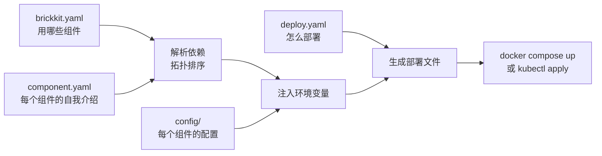

# BrickKit 是什么

## 一句话定位

BrickKit 是一个**声明式的组件组装平台**：你写下要哪些组件、它们依赖谁，其余的——启动顺序、
服务地址、环境变量、部署文件——全部由 BrickKit 派生出来，交给 Docker、Podman 或 Kubernetes 去跑。

"声明式"的意思是：你描述**想要的结果**（"我要 `erp/backend` 1.0.0，它要能连上数据库"），而不是写
**达到结果的步骤**（"先起数据库、再等它健康、再把它的地址填进这个变量、再起后端……"）。步骤由平台算。

## 核心理念

**1. 声明组件，CLI 派生其余一切。** 组件自己的 `component.yaml` 写着它依赖谁、监听哪个端口、
需要哪些配置。你的项目只声明"用哪些组件、什么版本"。CLI 把这两样合起来，算出依赖树、拓扑顺序、
每个组件该拿到的环境变量，生成 `compose.yaml` 或 Kubernetes 清单，调用 `docker compose` 或
`kubectl`，然后退出。

**2. 平台自己不常驻。** 没有注册中心（服务发现就是 Docker / Kubernetes 的 DNS）、没有配置中心
（配置在文件里，改完重新 `up`）、没有网关（组件之间按 DNS 直接调用）、没有守护进程（CLI 跑完就退出）。
这些东西都能换来一些便利，代价是一套要长期运维、会出故障、会成为瓶颈的基础设施——BrickKit 选择不要。

**3. 组件是独立的领域单元，边界是契约。** 每个组件独立开发、独立测试、独立发布自己的版本。
别的组件只依赖它的 Manifest（`component.yaml`）和公开契约（OpenAPI、Protobuf 等），从不依赖它的代码。
所以契约背后的实现可以整体重写、换语言，系统其余部分一行都不用改。

## 三层文件

一个 BrickKit 项目由三层文件描述，每层只管一件事：

```text
my-shop/
├── brickkit.yaml        声明：有哪些组件、什么精确版本（它就是锁文件）
├── deploy.yaml          部署：目标（docker / podman / k8s）、端口、模式、外壳成员
├── config/
│   ├── vars.yaml        多个组件共用的值
│   └── demo-hello.yaml  每个组件拿到的环境变量
└── .brickkit/           CLI 的缓存与生成物（不进 Git）
```

从声明到运行中的容器，流水线是这样的：



为什么分三层而不是一个文件：三件事的变化频率和责任人不同。组件版本由负责组装的人决定、要评审；
部署方式因环境而异，还常有"只在我这台机器上"的临时改动（它们放进不进 Git 的 `deploy.local.yaml`）；
配置里有密钥，要和别的东西分开管。一个文件装三件事，最后谁都改它、谁都读不懂它。
详见 [三层架构总览](../01-three-layers/01-overview.md)。

## 分形架构

一个组件在**开发时**本身就是一个完整的 BrickKit 项目——它可以有自己的三层文件，用来在本地拉起它的
依赖联调；在**被别的项目使用时**，它只是一个黑盒，别人只读它的 `component.yaml` 和 `BRICKKIT.md`。
"物理不套娃，规范套娃"。详见 [分形架构](05-fractal-architecture.md)。

## 对 AI 友好

- **组件小到 AI 能一次读完。** 一个组件就是一块业务，几百到几千行代码，不用在巨型单体里找上下文。
- **边界是契约文件，不用猜。** AI 写调用方时读依赖的契约和 `BRICKKIT.md`，不需要读依赖的实现。
- **容易写错的东西由平台派生。** 服务地址、变量名、部署文件都不用 AI 编；装配错误在
  `brickkit up --dry-run` 时就暴露。
- **有明确的读取路线。** 仓库根目录的 `AGENTS.zh.md` 告诉 AI 什么信息在哪个文件里，按需读取。

详见 [AI 专属指南](../08-ai-guide/README.md)。

## 用你已经会的工具对照一下

| BrickKit | 大致相当于 |
| --- | --- |
| BrickKit CLI | `npm` + `helm` + `docker compose` + `git clone`，但面向**能独立运行的业务组件** |
| 组件 | 一个 npm 包 + 它的 Docker 镜像 |
| `component.yaml` | `package.json` |
| `brickkit.yaml` | `package-lock.json`：每个组件锁在一个精确版本上 |
| `deploy.yaml` | `compose.yaml` 里"怎么跑"的那一半 |
| `brickkit add` | `npm install` |
| `brickkit up` | `docker compose up -d` / `kubectl apply` |
| `brickkit release` | 给组件仓库打一个版本 tag 并推送 |

区别在于：npm 装的是代码库，BrickKit 装的是**能独立跑起来的服务**，所以它还要管依赖解析、地址注入、
数据库迁移和启动顺序。更细的比较见 [与现有方案对比](04-comparison.md)。

下一步：[快速开始](02-quick-start.md)。
