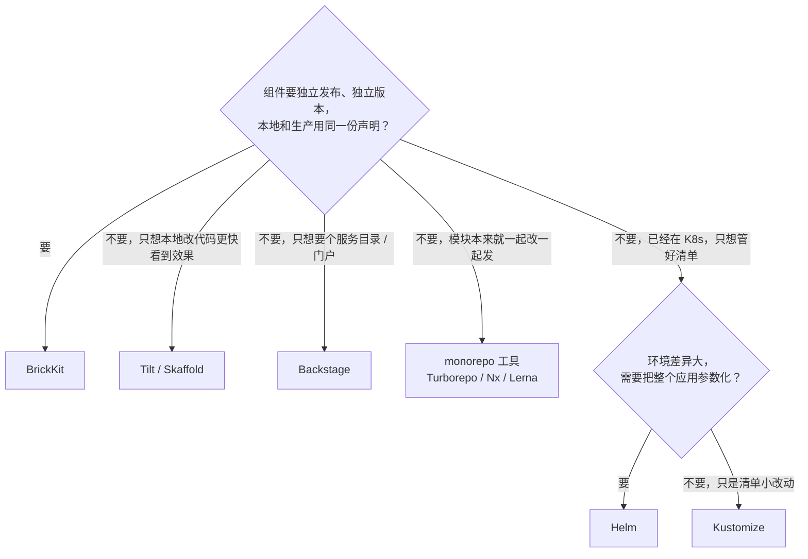

# 与现有方案对比

这些工具大多解决的是**相邻但不同**的问题。下面每张表只比较真正重叠的那部分，不拿 BrickKit 有的东西去衬托
别的工具"没有"——很多时候它们本来就不打算做那件事。BrickKit 自己刻意不做什么、为什么，见
[设计原则与取舍](../06-architecture/05-design-principles.md)。

想先有个大致方向，这张图给个粗略的起点，细节在后面各节：

## 总表

先找到你熟悉的工具，点名字跳到对应的详细对比。

| 工具 | 它是什么 | 主要解决什么 | 和 BrickKit 的关键差别 | 什么时候选它 |
| --- | --- | --- | --- | --- |
| [1. Docker Compose](#1-vs-docker-compose) | 用一份 YAML 定义并启动一组容器 | 在一台机器上把一组服务跑起来 | BrickKit 管的是独立发布、独立版本的组件：依赖、地址、启动顺序都自动算，`compose.yaml` 是它的生成物 | 快速原型、纯本地、服务之间没有"谁依赖谁的哪个版本"的问题 |
| [2. Helm](#2-vs-helm) | Kubernetes 的包管理器：清单打成 Chart，用模板和参数安装 | 把 K8s 清单模板化、参数化 | BrickKit 是组件级的声明，不是模板引擎；同一份声明能生成 Docker 和 K8s 两种部署 | 已经在 K8s 上，要模板化一个复杂应用，或 Chart 生态里正好有你要的 |
| [3. Kustomize](#3-vs-kustomize) | K8s 自带的清单定制：基础清单加多层覆盖 | 管理多个环境之间的清单差异 | BrickKit 每个环境一份完整的部署文件，没有继承链 | 已经在 K8s 上，环境差异小，团队熟悉覆盖层 |
| [4. Tilt / Skaffold](#4-vs-tilt--skaffold) | 盯着代码改动，自动重新构建、重新部署 | 压短"改代码 → 看效果"的循环 | BrickKit 不自动构建、不做热重载；它管组件从开发到生产的完整生命周期 | 改一行代码就要立刻看到效果 |
| [5. Backstage](#5-vs-backstage) | 开源的开发者门户：服务目录、文档、插件 | 给开发者一个统一入口 | BrickKit 的依赖关系直接驱动启动顺序和地址注入，而且是用完即走的 CLI，不是一套要运维的应用 | 需要团队级的服务目录和门户，部署交给已有的 CD 体系 |
| [6. monorepo 工具](#6-vs-monorepo-工具) | 在一个仓库里管多个模块，用缓存加速构建 | 多模块的构建、缓存与版本 | BrickKit 管的是运行时部署，不是构建管道；组件之间依赖 API 契约，不是代码 import | 多个模块频繁一起改、共享代码、一起发布 |

---

## 逐个对比

### 1. vs Docker Compose

**它是什么：** Docker 自带的编排工具。你在 `compose.yaml` 里写下要哪几个容器、各自的镜像、端口、环境变量，
`docker compose up` 把它们一起启动。

| 维度 | Docker Compose | BrickKit |
| --- | --- | --- |
| 解决的问题 | 用一份 YAML 编排一组容器 | 管理一批**独立发布、独立版本**的业务组件 |
| 组件来源 | 镜像仓库，镜像不带依赖和配置的规范 | Git 仓库、本机目录或组件市场；每个组件带 Manifest 和 API 契约 |
| 依赖顺序 | `depends_on` 要你手写，只管这一份文件里的服务 | 从每个组件的 `dependencies` 递归展开整棵依赖树，区分强弱依赖，生成的 `compose.yaml` 里的 `depends_on` 是算出来的 |
| 地址注入 | 手写环境变量，自己保证前后一致 | 自动注入 `*_ENDPOINT`，变量名从组件 ID 推导 |
| 数据库迁移 | 没有这个概念，要自己加一个一次性 service | 组件声明 `migration.command`，平台生成一次性迁移服务，失败就不启动主服务 |
| 多版本共存 | 要自己给 service 改名 | 服务名本身就带精确版本号，两个版本是两个不冲突的名字 |
| Kubernetes | 没有，要靠 Kompose 之类的转换，效果有限 | `deploy.yaml` 里改一个 `target: k8s`，同一份声明生成 K8s 清单 |

- **选 Compose：** 快速原型、纯本地开发，服务之间没有版本依赖问题。
- **选 BrickKit：** 组件会被独立发布和升级，需要多组件的依赖解析，本地和生产要用同一份声明。

---

### 2. vs Helm

**它是什么：** 常被叫作 Kubernetes 的包管理器。一个应用的全部 K8s 清单打成一个 Chart（模板 + 默认值），
安装时用 `values` 文件填参数。

| 维度 | Helm | BrickKit |
| --- | --- | --- |
| 解决的问题 | 把 K8s 清单模板化、参数化 | 让组件代码不用知道自己跑在 Docker 还是 K8s 上 |
| 目标平台 | 只有 Kubernetes | Docker、Podman、Kubernetes，同一份声明 |
| 多环境 | 一份 Chart + 多份 `values-<环境>.yaml` | 每个环境一份完整的部署文件（`deploy.prod.yaml`），用 `-f` 选择 |
| 依赖 | 子 Chart 一起装进来，粒度粗 | 组件级依赖，强弱之分，自动拓扑排序 |
| 服务命名 | 没有"版本进服务名"的约定，多版本共存要 Chart 作者自己设计 | 服务名 = 组件 ID + 精确版本，是平台的固定规则 |
| 本地调试 | 通常靠 `kubectl port-forward` 或额外工具 | `mode: debug` / `mode: local`（Docker / Podman 目标下），进程跑在你机器上，其它容器照样找得到它 |

- **选 Helm：** 已经在 K8s 上，要模板化一个复杂应用，Chart 生态里有你要的。
- **选 BrickKit：** 组件要独立演进，本地和生产用同一份声明，多版本共存不能靠手工命名约定。

---

### 3. vs Kustomize

**它是什么：** Kubernetes 自带的清单定制工具（`kubectl apply -k`）。不用模板，先写一份基础清单，再为每个环境
写一层覆盖，运行时合并。

| 维度 | Kustomize | BrickKit |
| --- | --- | --- |
| 配置模型 | 基础层 + 覆盖层，运行时合并 | 每个环境一份完整、自包含的部署文件，没有继承链 |
| 心智负担 | 要理解继承关系和合并规则，`git diff` 常常看不出实际生效的值 | 打开一个文件就是全貌，`git diff` 就是实际变化 |
| 依赖解析 | 没有，只管清单怎么拼 | 递归展开依赖树，强弱依赖，拓扑排序 |

- **选 Kustomize：** 已经在 K8s 上，清单差异不大，团队熟悉覆盖层。
- **选 BrickKit：** 觉得继承链难以推理，希望每个环境的配置能直接读懂。

---

### 4. vs Tilt / Skaffold

**它是什么：** 面向开发者的工具。它们盯着你的代码，一有改动就重新构建镜像、重新部署，把"改代码 → 看效果"压得很短。

| 维度 | Tilt / Skaffold | BrickKit |
| --- | --- | --- |
| 解决的问题 | 加快本地开发的内循环 | 管理组件从开发到生产的完整生命周期 |
| 构建 | 自动构建是核心能力 | **从不自动构建**：`brickkit build` 是显式动作，`up` 只部署 |
| 本地开发 | 热重载 | `mode: local` 由 BrickKit 拉起你的进程；`mode: debug` 由你在 IDE 里起，平台负责让别的组件找到它 |
| 版本 | 没有"组件版本"的概念 | 精确版本 + 多版本共存是平台原生能力 |

- **选 Tilt / Skaffold：** 改一行代码就要立刻看到效果。
- **选 BrickKit：** 组件要独立发布，本地和生产要对得上号。两者可以并用：BrickKit 负责装配，你在调试的那个组件用自己喜欢的热重载工具跑。

---

### 5. vs Backstage

**它是什么：** 开源的开发者门户。把服务登记成一个目录（每个服务一份 `catalog-info.yaml`），配上文档和插件，让开发者
在一个地方找到一切。

| 维度 | Backstage | BrickKit |
| --- | --- | --- |
| 依赖关系 | 可以声明 `dependsOn` 用于展示，不驱动部署 | 依赖关系直接驱动拓扑排序、启停和地址注入 |
| 部署 | 自己不部署，要接 ArgoCD、Helm 等 | 生成 Compose / K8s 清单并调用底层引擎 |
| 运维成本 | 本身是一套要运维的应用 | 单个二进制，用完即走，没有后台服务 |
| 文档 | 门户里的文档站 | 每个组件带 `BRICKKIT.md`，`add` 时缓存到项目里，版本与锁定的版本严格对应 |

- **选 Backstage：** 需要团队级的服务目录和门户。两者不冲突——`catalog-info.yaml` 可以指向一个 BrickKit 项目。

---

### 6. vs monorepo 工具

**它是什么：** Turborepo、Nx、Lerna 把很多模块放在一个仓库里，用缓存和增量构建只重建改动过的部分。

| 维度 | monorepo 工具 | BrickKit |
| --- | --- | --- |
| 关心的是 | 构建管道：代码怎么编译、缓存、测试 | 运行时部署：服务怎么装配、怎么找到彼此 |
| 依赖 | **构建时**依赖：代码 import 图 | **运行时**依赖：API 契约，地址经环境变量注入 |
| 版本 | 全局版本，或按包独立版本 | 每个组件独立的精确版本，版本就是 Git tag |
| 仓库 | 同一个仓库 | 一个组件一个仓库，也可以几个组件放在同一个仓库的子目录里——各自的 tag 带组件名（`people-basic/1.0.0`），版本依然独立 |

- **选 monorepo 工具：** 多个模块频繁一起改、共享代码、一起发布。
- **选 BrickKit：** 组件之间只通过 API 通信，需要独立的发布节奏。两者也能并用：monorepo 管构建，BrickKit 管装配。

---

## 总结：BrickKit 的位置

**声明式 + 派生 + 没有控制平面 + 分形。** 你声明组件和依赖，平台派生部署；平台跑完就走，不留常驻组件；
一个组件开发时是项目、被使用时是黑盒。如果这几条里有你不需要的，上面对应的那个工具多半更合适。
